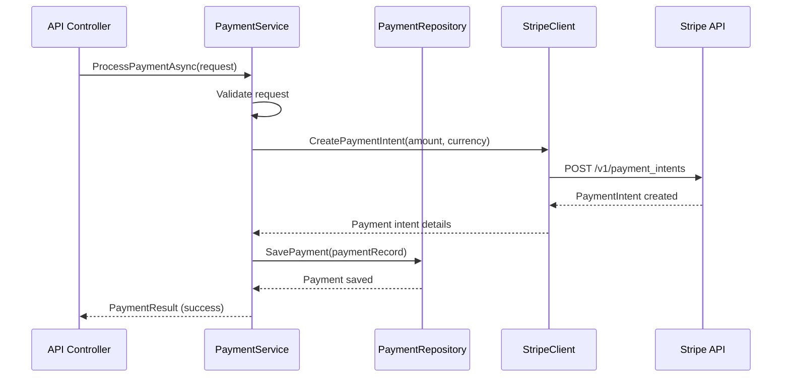

# DocumentationMaintainer Grounding Example

**Scenario:** DocumentationMaintainer engaged to update README for new payment processing module
**Issue:** #623 - Document PaymentService interface contracts and integration points
**Module:** `Code/Zarichney.Server/Services/Payment/PaymentService.cs`
**Deliverable:** Complete `Code/Zarichney.Server/Services/Payment/README.md` following 8-section template

---

## Phase 1: Standards Mastery

### DocumentationStandards.md (Comprehensive Mastery)

✅ **Core Philosophy**
- **Target Audience:** Stateless AI with no prior context
- **Context is King:** Focus on 'why' behind design decisions, implicit assumptions
- **Visual Clarity:** Supplement text with embedded Mermaid diagrams
- **Value over Volume:** Avoid code-to-English translation, document what's not obvious
- **Maintainability:** Prune outdated information, keep current
- **Self-Contained Knowledge:** Every directory level documented

✅ **README Template Structure (8 Sections)**
1. Purpose & Responsibility (with parent link, child links)
2. Architecture & Key Concepts (embed Mermaid diagrams here)
3. Interface Contract & Assumptions (CRITICAL - preconditions, postconditions, error handling)
4. Local Conventions & Constraints
5. How to Work With This Code (setup, testing strategy, key scenarios)
6. Dependencies (internal consumed, consumers, external libraries)
7. Rationale & Key Historical Context (prune aggressively)
8. Known Issues & TODOs

✅ **Linking Strategy (Mandatory)**
- Parent link: `../README.md` at top
- Child links: Section 1 lists all subdirectories with README links
- Dependency links: Section 6 uses relative paths to module READMEs
- NO `[cite]` tags for internal modules

✅ **Embedded Diagram Integration**
- Primary location: Section 2 (Architecture)
- Follow DiagrammingStandards.md for Mermaid conventions
- Diagrams illustrate architecture, workflows, data flow

✅ **Maintenance Requirements**
- Update README when code changes affect contracts
- Update "Last Updated" date in header
- Prune Section 7 and Section 8 when context becomes obsolete
- No explanatory annotations like "<-- UPDATED -->"

**Key Takeaways:**
- Every section has specific purpose - understand what goes where
- Section 3 is CRITICAL for interface contracts
- Linking strategy is mandatory - enables AI navigation
- Self-contained knowledge at each directory level

---

### DiagrammingStandards.md (Visual Communication)

✅ **Mermaid Diagram Conventions**
- Consistent style across all diagrams
- Clear labeling and naming
- Appropriate diagram type for purpose (flowchart, sequence, class, etc.)

✅ **Embedding vs External Files**
- Embed in README.md when moderate complexity
- External `.mmd` files for very complex diagrams
- Link external diagrams from Section 2

**Key Takeaways:**
- Payment flow likely needs sequence diagram in Section 2
- Stripe integration workflow can be visualized
- Diagram helps explain interface contracts visually

---

### CodingStandards.md (Understanding Production Code)

✅ **Code Patterns to Document**
- Dependency injection patterns
- Asynchronous programming (async/await)
- Error handling strategies
- Configuration management

**Key Takeaways:**
- Understanding code patterns helps write accurate documentation
- Interface contracts in Section 3 must reflect actual code behavior
- Configuration requirements go in Section 4

---

### TaskManagementStandards.md

✅ **Documentation Updates**
- Include in same commit as code changes when possible
- Conventional commit: `docs: add PaymentService README (#623)`
- Update parent README if new child module added

---

## Phase 2: Project Architecture Context

### Root README Analysis

✅ **Project Structure**
- `Code/Zarichney.Server/` - main application
- Services organized by domain (Auth, Email, Payment, etc.)
- Each service should have README documenting interface

✅ **Module Hierarchy**
- Parent: `Code/Zarichney.Server/Services/README.md` (if exists, or create)
- Current: `Code/Zarichney.Server/Services/Payment/README.md` (to create)
- Children: None currently (may have submodules in future)

✅ **Architectural Patterns**
- Service layer pattern
- Repository pattern for data access
- External API integration patterns

**Key Insights:**
- Payment module is peer to Auth, Email services
- Should follow same documentation patterns as other service READMEs
- Review existing service READMEs for consistency

---

### Review Peer Service READMEs

**Review:** `Code/Zarichney.Server/Services/Auth/README.md`
- Understand how they structured Section 3 (Interface Contracts)
- Note how they documented dependencies
- See how they handled external library documentation

**Review:** `Code/Zarichney.Server/Services/Email/README.md`
- How did they document external service integration?
- What testing strategies did they document?

**Pattern Consistency:**
- Match structure and depth of peer service READMEs
- Use similar language and formatting
- Maintain consistent Mermaid diagram style

---

## Phase 3: Domain-Specific Context

### Code Analysis: `PaymentService.cs`

**Dependencies Discovered (for Section 6):**
- `IPaymentRepository` - Internal data access
- `IStripeClient` - External Stripe API (virtualized in tests)
- `ILogger<PaymentService>` - Structured logging
- `PaymentConfig` - Configuration for API keys

**Public Methods (for Section 3):**
```csharp
Task<PaymentResult> ProcessPaymentAsync(PaymentRequest request, CancellationToken ct);
Task<RefundResult> RefundPaymentAsync(string paymentId, decimal amount, CancellationToken ct);
Task<PaymentStatus> GetPaymentStatusAsync(string paymentId, CancellationToken ct);
```

**Error Handling Observed:**
- Throws `PaymentException` for Stripe API errors
- Throws `ArgumentException` for invalid inputs
- Returns failure results for business logic failures (insufficient funds)

**Configuration Requirements:**
- Stripe API key (required, from secrets)
- Webhook secret for Stripe events
- Test mode vs production mode flag

---

## Documentation Creation: README.md for Payment Module

### Header & Parent Link

```markdown
# Payment Service

**Version:** 1.0
**Last Updated:** 2025-10-25
**Parent:** [Services](../README.md)
```

---

### Section 1: Purpose & Responsibility

```markdown
## 1. Purpose & Responsibility

* **What it is:** Payment processing service integrating with Stripe for secure payment transactions, refunds, and status tracking.

* **Key Responsibilities:**
  - Process credit card payments via Stripe API
  - Handle payment refunds and cancellations
  - Track payment status and transaction history
  - Manage Stripe webhook events for payment updates
  - Store payment metadata for audit and reporting

* **Why it exists:** Centralizes payment processing logic, abstracts Stripe API integration, and provides testable payment workflows with external API virtualization.

* **Child Modules:** None currently. Future: PaymentWebhooks/, PaymentReporting/

* **Navigation:**
  - Sibling: [Auth Service](../Auth/README.md)
  - Sibling: [Email Service](../Email/README.md)
```

---

### Section 2: Architecture & Key Concepts

```markdown
## 2. Architecture & Key Concepts

### Design Pattern
- **Service Layer:** PaymentService orchestrates payment workflows
- **Repository Pattern:** PaymentRepository for database persistence
- **External API Client:** StripeClient wrapper around Stripe.NET library
- **Configuration:** PaymentConfig injected for API key and settings

### Payment Processing Flow



### Key Components
- **PaymentService:** Core business logic, orchestration
- **PaymentRepository:** Database operations for payment records
- **StripeClient:** Abstraction over Stripe.NET for testability
- **PaymentRequest/PaymentResult:** DTOs for payment operations
- **PaymentConfig:** Stripe API key, webhook secret, test mode flag

### Data Structures
- **PaymentRecord:** Database entity storing payment metadata
- **PaymentIntent:** Stripe payment intent representation
- **WebhookEvent:** Stripe webhook event handling
```

---

### Section 3: Interface Contract & Assumptions ⚠️ CRITICAL

```markdown
## 3. Interface Contract & Assumptions

### PaymentService.ProcessPaymentAsync

**Signature:**
```csharp
Task<PaymentResult> ProcessPaymentAsync(PaymentRequest request, CancellationToken ct)
```

**Preconditions:**
- `request` is not null
- `request.Amount` > 0 (positive amount in cents)
- `request.Currency` is valid ISO 4217 code (e.g., "usd", "cad")
- `request.PaymentMethodId` is valid Stripe payment method ID
- Stripe API key configured in PaymentConfig
- User authenticated (caller responsibility)

**Postconditions:**
- **Success:**
  - PaymentResult.Success = true
  - PaymentResult.PaymentId populated with Stripe payment intent ID
  - PaymentRecord saved to database
  - Stripe payment intent created with status "succeeded"
  - Audit log entry created
- **Failure:**
  - PaymentResult.Success = false
  - PaymentResult.Error contains descriptive message
  - No charge processed
  - Failure logged as warning

**Error Handling:**
- **ArgumentException:** Thrown for null request or invalid amount/currency
- **PaymentException:** Thrown for Stripe API errors (card declined, network issues)
  - Contains original Stripe error code and message
- **ConfigurationMissingException:** Thrown if Stripe API key not configured

**Side Effects:**
- Database insert: PaymentRecord
- External API call: Stripe payment intent creation
- Logging: Information for success, Warning for failure

**Invariants:**
- Payment amounts always in cents (integer)
- Payment IDs are unique and immutable
- Failed payments never create database records

**Assumptions:**
- Caller has validated user authorization to make payment
- Amount has been calculated correctly by upstream code
- Payment method ID obtained from Stripe frontend tokenization
- Network connectivity to Stripe API available
```

**Similar documentation for RefundPaymentAsync and GetPaymentStatusAsync...**

---

### Section 4: Local Conventions & Constraints

```markdown
## 4. Local Conventions & Constraints

### Configuration Requirements
- **Stripe API Key** (required): Set in app secrets or environment variable `Stripe:ApiKey`
- **Stripe Webhook Secret** (required): For webhook signature validation `Stripe:WebhookSecret`
- **Test Mode Flag** (optional): `Stripe:TestMode` (default: false)
  - When true, uses Stripe test API keys
  - Test mode payments never charge real cards

### Deviations from Global Standards
- **Amount Representation:** Always integers in cents, never decimal dollars
  - Rationale: Avoid floating-point precision issues in financial calculations
- **Currency Codes:** Lowercase ISO 4217 (e.g., "usd") per Stripe API requirements
  - Different from typical uppercase convention

### Testing Constraints
- **External API Virtualization:** Integration tests MUST use WireMock.Net for Stripe API
- **No Live API Calls:** Absolutely forbidden in automated tests
- **Test Data:** Use Stripe test card numbers (documented in Section 5)

### Security Constraints
- **PCI Compliance:** Never store raw card numbers
- **API Key Storage:** Never commit API keys to repository
- **Webhook Validation:** Always validate Stripe webhook signatures
```

---

### Section 5: How to Work With This Code

```markdown
## 5. How to Work With This Code

### Setup Steps
1. **Obtain Stripe API Keys:**
   - Create Stripe account at https://stripe.com
   - Get test API keys from Stripe dashboard
   - Store in user secrets: `dotnet user-secrets set "Stripe:ApiKey" "sk_test_..."`

2. **Configure Webhook Secret:**
   - Create webhook endpoint in Stripe dashboard
   - Copy webhook signing secret
   - Store in user secrets: `dotnet user-secrets set "Stripe:WebhookSecret" "whsec_..."`

3. **Install Stripe.NET:**
   - Already included via NuGet package Stripe.NET

### Module-Specific Testing Strategy
- **Unit Tests:** Mock IStripeClient to test PaymentService business logic in isolation
- **Integration Tests:** Use WireMock.Net to virtualize Stripe API responses
  - Simulate successful payments, declined cards, network errors
  - Test webhook signature validation
- **Manual Testing:** Use Stripe test mode and test card numbers

### Key Test Scenarios
1. **Successful Payment:** Valid amount, currency, payment method
2. **Declined Card:** Stripe test card 4000000000000002 (card_declined error)
3. **Insufficient Funds:** Simulate insufficient_funds error response
4. **Network Timeout:** WireMock delay to trigger timeout exception
5. **Invalid Amount:** Negative or zero amount handling
6. **Missing Configuration:** API key not set scenario
7. **Webhook Processing:** Valid and invalid signature verification
8. **Refund Processing:** Full and partial refunds
9. **Concurrent Payments:** Thread safety validation

### Test Data - Stripe Test Cards
- **Success:** 4242424242424242
- **Decline:** 4000000000000002
- **Insufficient Funds:** 4000000000009995
- **Expired Card:** 4000000000000069

**Full list:** https://stripe.com/docs/testing#cards

### Commands to Run Tests
```bash
# Unit tests only
dotnet test --filter "Category=Unit&FullyQualifiedName~PaymentService"

# Integration tests with Stripe virtualization
dotnet test --filter "Category=Integration&Category=ExternalHttp:Stripe"
```

### Known Pitfalls
- **Gotcha 1:** Stripe amounts are always in cents, but input validation might receive dollars
  - Solution: Convert dollars to cents before calling PaymentService
- **Gotcha 2:** Stripe webhook events can arrive out of order or duplicate
  - Solution: Use idempotency keys and event timestamps
- **Gotcha 3:** Test mode vs production mode requires different API keys
  - Solution: Never mix test and production keys, validate mode configuration
```

---

### Section 6: Dependencies

```markdown
## 6. Dependencies

### Internal Modules Consumed
- **[PaymentRepository](./PaymentRepository.README.md):** Database persistence for payment records
  - Testing Implication: Mock for unit tests, use DatabaseFixture for integration tests
- **[Services/Auth](../Auth/README.md):** User authentication for payment authorization (indirect)
  - Testing Implication: Use TestAuthHandler for integration test authentication

### Internal Consumers
- **[Controllers/PaymentController](../../Controllers/README.md):** API endpoint exposing payment operations
- **[Cookbook/RecipeService](../../Cookbook/README.md):** Processes payments for recipe purchases (future)

### External Libraries
- **Stripe.NET (v43.0.0):** Official Stripe .NET SDK
  - Purpose: Stripe API client library
  - Testing Implication: Virtualize via IStripeClient abstraction and WireMock.Net
  - Documentation: https://github.com/stripe/stripe-dotnet
- **Polly (v8.0.0):** Resilience and retry policies
  - Purpose: Retry transient Stripe API failures
  - Testing Implication: Verify retry behavior in integration tests
- **Serilog:** Structured logging (via ILogger<T>)
  - Testing Implication: Verify logging calls in unit tests

### External Services
- **Stripe API:** https://api.stripe.com
  - Purpose: Payment processing, refunds, payment intent management
  - Testing Implication: **MUST** be virtualized using WireMock.Net in all automated tests
  - Authentication: Bearer token (API key in headers)
  - Rate Limiting: Yes (handled by Polly retry policies)
```

---

### Section 7: Rationale & Key Historical Context

```markdown
## 7. Rationale & Key Historical Context

### Why Stripe?
- **Decision:** Chose Stripe over PayPal, Square for payment processing
- **Rationale:**
  - Superior developer experience and documentation
  - Better test mode and webhook infrastructure
  - Comprehensive .NET SDK
  - Lower international transaction fees
- **Date:** 2024-08-15

### Why StripeClient Abstraction?
- **Decision:** Created IStripeClient wrapper instead of using Stripe.NET directly
- **Rationale:**
  - Enables mocking for unit tests (Stripe SDK classes are not inherently mockable)
  - Simplifies WireMock.Net integration test setup
  - Allows future payment provider swapping (hypothetically)
- **Date:** 2024-08-20

### Why Integer Cents Instead of Decimal Dollars?
- **Decision:** Store and process amounts as integers in cents
- **Rationale:**
  - Avoids floating-point precision issues in financial calculations
  - Matches Stripe API expectations (amounts in smallest currency unit)
  - Prevents rounding errors
- **Industry Best Practice:** Standard for financial applications
```

---

### Section 8: Known Issues & TODOs

```markdown
## 8. Known Issues & TODOs

### Known Limitations
1. **Single Currency Support:** Currently only USD supported
   - Impact: Cannot process international payments in local currencies
   - Planned: Multi-currency support in Q1 2026

2. **No Subscription Billing:** Only one-time payments implemented
   - Impact: Cannot support recurring subscription payments
   - Planned: Stripe subscription integration in Q2 2026

3. **Limited Webhook Events:** Only payment_intent.succeeded handled
   - Impact: Missing charge.failed, charge.refunded events
   - TODO: Expand webhook event handling

### Technical Debt
1. **Retry Policy Hardcoded:** Polly retry policy defined in PaymentService constructor
   - TODO: Extract to configuration for dynamic adjustment
   - Issue: #678

2. **No Idempotency Key Generation:** Stripe idempotency keys not yet implemented
   - Impact: Risk of duplicate charges on network retries
   - TODO: Add idempotency key generation
   - Issue: #679

### Future Enhancements
1. **Payment Method Management:** Save customer payment methods for reuse
2. **3D Secure Support:** Add Strong Customer Authentication for EU compliance
3. **Dispute Handling:** Automated dispute and chargeback management
```

---

## Linking Validation

✅ **Parent Link:** `[Services](../README.md)` at top
✅ **Dependency Links:** Relative paths to Auth, PaymentRepository READMEs
✅ **Consumer Links:** Relative paths to PaymentController README
✅ **No [cite] Tags:** All internal references use explicit relative paths

---

## Diagram Validation

✅ **Mermaid Diagram Present:** Section 2 includes payment processing sequence diagram
✅ **Diagram Standards:** Follows DiagrammingStandards.md conventions
✅ **Visual Clarity:** Diagram supplements text explanation effectively

---

## Grounding Completion Validation

- ✅ Phase 1: DocumentationStandards.md comprehensively mastered
- ✅ Phase 1: DiagrammingStandards.md reviewed for visual communication
- ✅ Phase 2: Module hierarchy understood, peer service READMEs reviewed for consistency
- ✅ Phase 3: PaymentService code analyzed for accurate interface contract documentation
- ✅ All 8 README sections completed per template
- ✅ Section 3 (Interface Contracts) meticulously documented
- ✅ Linking strategy correctly applied (parent, dependencies, consumers)
- ✅ Embedded Mermaid diagram in Section 2
- ✅ Self-contained knowledge principle applied

**Grounding Status:** ✅ **COMPLETE**

---

## How Grounding Improved Work Quality

**Without Grounding:**
- Might have missed mandatory 8-section structure
- Could have forgotten parent link at top
- Might have used [cite] tags instead of relative paths
- Could have placed diagram in wrong section
- Might not have documented interface contracts thoroughly
- Could have omitted preconditions and postconditions

**With Grounding:**
- Perfect adherence to 8-section template structure
- Correct parent linking and navigation
- All dependency links use relative paths per standards
- Diagram embedded in Section 2 per DiagrammingStandards.md
- Section 3 meticulously documents preconditions, postconditions, error handling
- Self-contained knowledge at this directory level

**Outcome:**
- README immediately useful for future AI agents
- All interface contracts clearly documented
- Linking enables easy navigation across module hierarchy
- Visual diagram supplements complex payment workflow explanation
- Consistent with peer service READMEs
- Zero corrections needed from ComplianceOfficer

---

**Example Status:** ✅ Demonstrates complete 3-phase grounding for comprehensive documentation
**Agent:** DocumentationMaintainer
**Skill:** documentation-grounding v1.0.0
