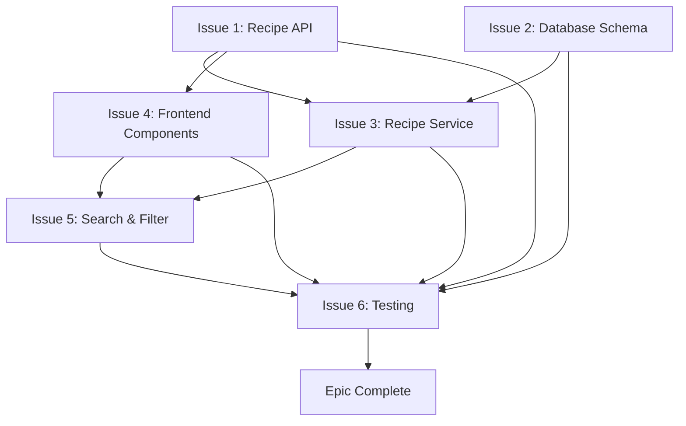

# Example: Epic Milestone Creation with Component Breakdown

This example demonstrates creating an epic issue for a multi-month initiative with systematic component breakdown and dependency tracking.

## Scenario

Product owner requests: "We need comprehensive recipe management functionality as the foundation for our MVP launch in Q4 2025."

## Phase 1: Context Collection (Automated)

### 1.1 Strategic Requirements Analysis

**Business objectives** (from product planning):
- Enable core value proposition: recipe discovery, organization, sharing
- Deliver MVP functionality for Q4 2025 launch
- Support 2,000+ initial users with scalable architecture
- Differentiate from competitors with social features

**User value proposition**:
- As a home cook
- I want to manage my personal recipe collection digitally
- So that I can access recipes anywhere, share with friends, and discover new meals

### 1.2 Codebase Current State

```bash
$ glob "**/*Recipe*.cs" Code/Zarichney.Server/

Code/Zarichney.Server/Models/Recipe.cs [STUB - basic model only]

$ grep -r "Recipe" Code/Zarichney.Server/Controllers/
# No results - no controllers yet

$ grep -r "Recipe" Code/Zarichney.Server/Services/
# No results - no services yet
```

**Current state**: Minimal recipe infrastructure exists. Need complete CRUD, search, filtering, sharing.

### 1.3 Architecture Review

**Standards reviewed**:
- `/Docs/Standards/CodingStandards.md` - Service layer patterns, repository pattern
- `/Docs/Standards/TestingStandards.md` - Coverage requirements (75% backend, 70% frontend)
- `/Docs/Standards/TaskManagementStandards.md` - Epic branch strategy

**Module context**:
- `/Code/Zarichney.Server/README.md` - Backend architecture (ASP.NET Core, EF Core)
- `/Code/Zarichney.Website/README.md` - Frontend architecture (Angular 19, Material Design)

### 1.4 Similar Initiatives Analysis

```bash
$ gh issue list --search "epic" --json number,title,state,labels

#234 - Epic: User Authentication & Authorization [CLOSED]
  Pattern: 6 component issues, epic branch, 4-week timeline
  Lessons: Test coverage critical, feature flags for gradual rollout

$ gh pr list --search "epic" --state merged --limit 5

#780-785 - User Authentication components (6 PRs merged to epic branch)
  Pattern: Individual feature PRs → epic branch → develop
```

**Epic branch strategy validated**: Use `epic/recipe-management` branch per TaskManagementStandards.md

### 1.5 Component Breakdown Planning

**Required capabilities identified**:
1. **CRUD Operations**: Create, read, update, delete recipes
2. **Data Persistence**: Database schema, migrations, repositories
3. **Business Logic**: Service layer with validation, authorization
4. **User Interface**: Angular components for recipe management
5. **Search & Discovery**: Full-text search, filtering by attributes
6. **Quality Assurance**: Comprehensive test coverage (75% backend, 70% frontend)

**Dependency analysis**:
- Database schema must exist before services
- API endpoints needed before frontend components
- Service layer orchestrates repository and API
- Search/filtering depends on basic CRUD functionality
- Testing tracks implementation progress

## Phase 2: Template Selection

**Template Chosen**: Epic Template

**Rationale**: Large initiative spanning 6 component issues, 4-week timeline, multiple agents. Requires coordination, dependency tracking, and milestone phasing.

## Phase 3: Issue Construction

### Title

```
Epic: Recipe Management Feature Set
```

### Description (Using Epic Template)

```markdown
# Epic: Recipe Management Feature Set

## Vision & Strategic Context

The Recipe Management Feature Set establishes the foundation for zarichney-api's core value proposition: helping users discover, organize, and share recipes. This epic delivers the minimum viable product (MVP) for recipe functionality, enabling user engagement and platform differentiation.

**Strategic importance**:
- **Product foundation**: Enables all future recipe-related features
- **User acquisition**: Core functionality drives initial user sign-ups
- **Competitive positioning**: Matches competitor feature parity while establishing foundation for advanced features
- **Revenue enablement**: Enables future premium recipe features and subscriptions

**Alignment with Q4 2025 goals**:
- Support MVP launch with 2,000+ initial users
- Achieve 40% monthly active user growth through improved recipe discovery
- Reduce user time-to-value from 10 minutes to 3 minutes
- Enable social sharing for organic user acquisition

## Success Criteria

- [ ] Users can create, edit, and delete recipes with full CRUD functionality
- [ ] Recipe search and filtering operational with <200ms response time
- [ ] Recipe sharing generates 500+ social media shares in first month post-launch
- [ ] Backend test coverage for recipe services reaches 75%
- [ ] Frontend test coverage for recipe components reaches 70%
- [ ] Zero critical bugs in recipe management workflows
- [ ] All 6 component issues completed and integrated
- [ ] Epic branch successfully merged to develop with no regressions

## Component Breakdown

### Issue 1: Recipe CRUD API Endpoints

**Purpose**: Backend API foundation providing RESTful endpoints for recipe management

**Scope**:
- Create `POST /api/recipes` endpoint for recipe creation
- Implement `GET /api/recipes/{id}` for recipe retrieval
- Add `PUT /api/recipes/{id}` for recipe updates
- Implement `DELETE /api/recipes/{id}` for recipe deletion
- Add `GET /api/recipes` for recipe list retrieval with pagination
- Input validation and error handling (400, 404, 500 responses)
- API documentation (OpenAPI/Swagger spec)

**Dependencies**: None - foundation component

**Estimate**: `effort: medium` (2-3 days)

**Assignee**: @BackendSpecialist

**Labels**: `type: epic-task`, `epic: recipe-management`, `component: api`, `priority: high`

---

### Issue 2: Recipe Database Schema and Migrations

**Purpose**: Data persistence layer with Entity Framework Core migrations

**Scope**:
- Design recipe table schema (id, title, description, ingredients, instructions, user_id, created, updated)
- Create EF Core migration for recipe table
- Add database indexes for query performance (user_id, created date)
- Define foreign key relationships (user_id → users table)
- Seed database with 20+ sample recipes for testing
- Document schema in `/Docs/Database/RecipeSchema.md`

**Dependencies**: None - can work in parallel with Issue 1

**Estimate**: `effort: small` (1 day)

**Assignee**: @BackendSpecialist

**Labels**: `type: epic-task`, `epic: recipe-management`, `component: database`, `priority: high`

---

### Issue 3: Recipe Service Layer Implementation

**Purpose**: Business logic and orchestration layer following service pattern

**Scope**:
- Create `RecipeService` implementing `IRecipeService` interface
- Implement business validation rules (title required, max ingredient count, etc.)
- Add recipe ownership authorization logic (users can only edit their own recipes)
- Integrate with database repository layer (`IRecipeRepository`)
- Dependency injection configuration in `Program.cs`
- Comprehensive logging for service operations

**Dependencies**:
- Issue 1 (API contracts defined)
- Issue 2 (Database schema exists)

**Estimate**: `effort: medium` (2 days)

**Assignee**: @BackendSpecialist

**Labels**: `type: epic-task`, `epic: recipe-management`, `component: api`, `priority: high`

---

### Issue 4: Recipe Frontend Components

**Purpose**: User interface components for recipe management using Angular Material

**Scope**:
- Create recipe list component with pagination and sorting
- Implement recipe detail view component with ingredient/instruction display
- Add recipe edit form with Angular Reactive Forms validation
- Build recipe creation wizard (multi-step form)
- Recipe deletion confirmation dialog
- Error handling and loading states
- Responsive design (mobile, tablet, desktop)

**Dependencies**: Issue 1 (API endpoints operational)

**Estimate**: `effort: large` (4-5 days)

**Assignee**: @FrontendSpecialist

**Labels**: `type: epic-task`, `epic: recipe-management`, `component: website`, `priority: high`

---

### Issue 5: Recipe Search and Filtering

**Purpose**: Recipe discovery functionality with full-text search and attribute filtering

**Scope**:
- Backend: Full-text search endpoint `GET /api/recipes/search?q=keyword`
- Backend: Filter endpoint `GET /api/recipes?category=dinner&dietary=vegan`
- PostgreSQL full-text search configuration with GIN indexes
- Frontend: Search UI component with autocomplete
- Frontend: Filter sidebar with checkboxes (category, dietary restrictions)
- Real-time filter application with debouncing (300ms delay)
- Search result highlighting
- "No results" state with helpful suggestions

**Dependencies**:
- Issue 1 (API foundation)
- Issue 2 (Database with indexes)
- Issue 4 (Frontend components)

**Estimate**: `effort: medium` (3 days)

**Assignees**: @BackendSpecialist, @FrontendSpecialist

**Labels**: `type: epic-task`, `epic: recipe-management`, `component: api`, `component: website`, `priority: medium`

---

### Issue 6: Recipe Comprehensive Test Coverage

**Purpose**: Quality assurance through comprehensive test coverage (unit, integration, E2E)

**Scope**:
- **Backend unit tests**: RecipeService (100% coverage), RecipeController (100% coverage)
- **Backend integration tests**: API endpoints with test database
- **Frontend unit tests**: All recipe components (70%+ coverage)
- **Frontend integration tests**: Component interactions, state management
- **E2E tests**: Complete user workflows (create → edit → search → delete recipe)
- **Performance tests**: Search query benchmarks (<200ms requirement)
- Test documentation in module READMEs

**Dependencies**:
- Issue 1, 2, 3 (Backend implementation)
- Issue 4 (Frontend implementation)
- Issue 5 (Search implementation)

**Estimate**: `effort: medium` (3 days)

**Assignee**: @TestEngineer

**Labels**: `type: epic-task`, `epic: recipe-management`, `component: testing`, `priority: high`, `coverage: phase-3`

---

## Dependency Graph



**Critical path**: Issue 2 → Issue 3 → Issue 5 → Issue 6 (longest dependency chain)

**Parallel workstreams**:
- Backend track: Issues 1, 2, 3 (can work simultaneously)
- Frontend track: Issue 4 (starts after Issue 1 API contracts defined)
- Search track: Issue 5 (starts after Issues 1, 2, 4 complete)
- Testing track: Issue 6 (tracks implementation, completes last)

## Milestones & Phasing

### Phase 1: Foundation (Week 1-2)
**Goal**: Backend infrastructure and basic CRUD operational

**Issues**: 1, 2, 3
**Exit criteria**:
- [ ] All CRUD API endpoints functional and documented
- [ ] Database migrations applied to development environment
- [ ] RecipeService business logic operational
- [ ] Basic recipe operations working end-to-end (API → DB)

---

### Phase 2: User Interface (Week 3)
**Goal**: Frontend recipe management operational

**Issues**: 4
**Exit criteria**:
- [ ] Users can create, view, edit, delete recipes via UI
- [ ] Form validation working with user-friendly error messages
- [ ] Error handling graceful (network errors, validation errors)
- [ ] Responsive design verified on mobile, tablet, desktop

---

### Phase 3: Enhancement & Quality (Week 4)
**Goal**: Search, filtering, and comprehensive testing complete

**Issues**: 5, 6
**Exit criteria**:
- [ ] Recipe search and filtering functional with <200ms response time
- [ ] Test coverage targets met (75% backend, 70% frontend)
- [ ] Performance benchmarks achieved
- [ ] Zero critical bugs, <5 medium bugs at completion

## Acceptance Criteria

Epic completion requires ALL criteria met:

- [ ] All 6 component issues completed and merged to epic branch
- [ ] Comprehensive end-to-end testing passed with zero critical defects
- [ ] Performance targets achieved (API <200ms, search <500ms)
- [ ] Documentation updated (API docs, user guides, developer docs)
- [ ] No regressions introduced in existing functionality (user auth, etc.)
- [ ] Security audit passed (authentication, authorization, input validation)
- [ ] Backend test coverage ≥75%, frontend test coverage ≥70%
- [ ] User acceptance testing completed with ≥4/5 average rating
- [ ] Epic branch merged to develop after all validations pass

## Risk Assessment

### Technical Risks

**Risk 1: Database Performance at Scale**
- **Probability**: Medium (30%)
- **Impact**: High (search becomes unusable if slow)
- **Mitigation**: Early load testing with 10,000+ recipes, proper GIN indexing, query optimization
- **Contingency**: Implement Redis caching layer if needed, defer complex search to post-MVP

**Risk 2: Search Functionality Complexity**
- **Probability**: Low (20%)
- **Impact**: Medium (feature delayed if complex)
- **Mitigation**: Use proven PostgreSQL full-text search, start simple (keyword only), iterate with filters
- **Contingency**: Defer advanced filtering to future iteration, ship basic keyword search for MVP

**Risk 3: Frontend State Management Complexity**
- **Probability**: Low (15%)
- **Impact**: Medium (bugs, maintenance difficulty)
- **Mitigation**: Use established NgRx patterns, comprehensive component testing
- **Contingency**: Simplify state management, use service-based state instead of NgRx

### Resource Risks

**Risk 1: Frontend Specialist Availability**
- **Probability**: Low (10%)
- **Impact**: High (delays entire timeline)
- **Mitigation**: Clear API contracts enable parallel work, minimize dependencies
- **Contingency**: CodeChanger can handle basic frontend if needed, delay advanced UI features

**Risk 2: Timeline Optimistic (4 weeks aggressive)**
- **Probability**: Medium (40%)
- **Impact**: Medium (delays MVP launch)
- **Mitigation**: Built-in 1-week buffer, weekly progress reviews, scope adjustment flexibility
- **Contingency**: Defer Issue 5 (search/filtering) to post-MVP if needed, ship basic CRUD first

### Integration Risks

**Risk 1: Breaking Changes to User Authentication**
- **Probability**: Low (10%)
- **Impact**: High (entire app broken)
- **Mitigation**: Comprehensive regression testing, isolated recipe module, staged rollout
- **Contingency**: Epic branch rollback plan, feature flags for gradual rollout

**Risk 2: API Contract Misalignment (Frontend/Backend)**
- **Probability**: Medium (25%)
- **Impact**: Medium (rework required)
- **Mitigation**: Early API contract review in Issue 1, OpenAPI spec validation, integration tests
- **Contingency**: API versioning strategy if breaking changes needed

## Success Metrics

### Quantitative Metrics

**User Engagement**:
- 500+ recipes created in first month post-launch
- 40% increase in monthly active users (from 1,200 to 1,680)
- 5 minutes average session duration (up from 2 minutes pre-recipe features)
- 60% of users create at least 1 recipe within first week

**Performance**:
- API response time <200ms (95th percentile) for CRUD operations
- Search query execution <500ms (95th percentile)
- Frontend page load <2 seconds
- Zero production incidents related to recipe management

**Quality**:
- Backend test coverage ≥75% (RecipeService: 100%, RecipeController: 100%)
- Frontend test coverage ≥70% (all recipe components)
- Zero critical bugs, <5 medium bugs at launch
- All E2E workflows pass (create → edit → search → delete)

### Qualitative Metrics

**User Satisfaction**:
- Positive user feedback on recipe management UX (≥4/5 average rating)
- <10% support ticket volume related to recipe features
- Social media sentiment positive (>80% positive mentions)
- User interviews: 8/10 users find feature "easy to use"

**Code Quality**:
- All code reviews approved with <3 revision rounds
- Architecture decisions documented in `/Docs/Architecture/RecipeManagement.md`
- Technical debt items identified and tracked (acceptable for MVP)
- Team morale positive, sustainable pace maintained

**Business Impact**:
- Enables premium recipe features roadmap (subscriptions)
- Social sharing drives 100+ organic user sign-ups (10% viral coefficient)
- Competitive feature parity achieved
- MVP launch readiness confirmed

---

**Recommended Labels**:
- `type: epic`
- `priority: high`
- `effort: epic`
- `component: api`
- `component: website`
- `component: database`
- `component: testing`

**Milestone**: MVP Launch (Q4 2025)

**Epic Branch**: `epic/recipe-management`

**Timeline**: 4 weeks (October 1-31, 2025)

**Related Issues**: Create 6 component issues (#892-#897) after epic approval

**Team Assignment**:
- @BackendSpecialist - Issues 1, 2, 3, 5 (backend)
- @FrontendSpecialist - Issues 4, 5 (frontend)
- @TestEngineer - Issue 6 (quality assurance)
```

### Labels

**Mandatory labels**:
- `type: epic` - Multi-issue initiative ✅
- `priority: high` - MVP blocker ✅
- `effort: epic` - 4-week timeline ✅
- `component: api`, `component: website`, `component: database`, `component: testing` ✅

**Epic coordination**:
- `status: epic-planning` - Epic in planning phase (changes to `epic-active` when approved)

**Label string**:
```
type: epic,priority: high,effort: epic,component: api,component: website,component: database,component: testing,status: epic-planning
```

## Phase 4: Validation & Submission

### Template Completeness

- [x] Vision and strategic context clear (MVP foundation, Q4 launch)
- [x] Success criteria specific and measurable (8 criteria)
- [x] Component breakdown comprehensive (6 issues with full scope)
- [x] Dependency graph visual (Mermaid diagram with critical path)
- [x] Milestones and phasing defined (3 phases over 4 weeks)
- [x] Acceptance criteria comprehensive (8 completion requirements)
- [x] Risk assessment thorough (9 risks with mitigation/contingency)
- [x] Success metrics quantitative and qualitative

### Label Compliance

- [x] Exactly one `type:` label (`type: epic`)
- [x] Exactly one `priority:` label (`priority: high`)
- [x] Exactly one `effort:` label (`effort: epic`)
- [x] Multiple `component:` labels (4 components: api, website, database, testing)
- [x] Epic status label (`status: epic-planning`)

### Duplicate Prevention

```bash
$ gh issue list --search "recipe management epic" --json number,title,state

# No existing recipe management epic found
```

**Result**: No duplicates. Proceed with creation.

### Submission

```bash
$ gh issue create \
  --title "Epic: Recipe Management Feature Set" \
  --body "$(cat /tmp/recipe-management-epic.md)" \
  --label "type: epic,priority: high,effort: epic,component: api,component: website,component: database,component: testing,status: epic-planning" \
  --milestone "MVP Launch (Q4 2025)"

✓ Created issue #892: Epic: Recipe Management Feature Set
https://github.com/Zarichney-Development/zarichney-api/issues/892
```

### Post-Submission Actions

1. **Create epic branch**:
   ```bash
   git checkout develop
   git pull origin develop
   git checkout -b epic/recipe-management
   git push origin epic/recipe-management
   ```

2. **Create 6 component issues** referencing epic #892:
   - Issue #893: Recipe CRUD API Endpoints (targets `epic/recipe-management`)
   - Issue #894: Recipe Database Schema (targets `epic/recipe-management`)
   - Issue #895: Recipe Service Layer (targets `epic/recipe-management`)
   - Issue #896: Recipe Frontend Components (targets `epic/recipe-management`)
   - Issue #897: Recipe Search and Filtering (targets `epic/recipe-management`)
   - Issue #898: Recipe Comprehensive Testing (targets `epic/recipe-management`)

3. **Update milestone**: Add all 7 issues (#892-#898) to "MVP Launch (Q4 2025)" milestone

4. **Epic kickoff meeting**: Schedule with @BackendSpecialist, @FrontendSpecialist, @TestEngineer

---

## Summary

This example demonstrates epic creation with:

✅ **Strategic context**: Clear business alignment and MVP launch readiness
✅ **Component breakdown**: 6 discrete issues with dependencies and scope
✅ **Dependency tracking**: Visual Mermaid graph showing critical path
✅ **Risk management**: 9 risks with mitigation and contingency plans
✅ **Success metrics**: Quantitative (500 recipes, <200ms API) and qualitative (≥4/5 rating)
✅ **Epic branch strategy**: Follows TaskManagementStandards.md epic workflow

**Time savings**: 10 min → 2 min for epic planning through systematic breakdown and template structure
