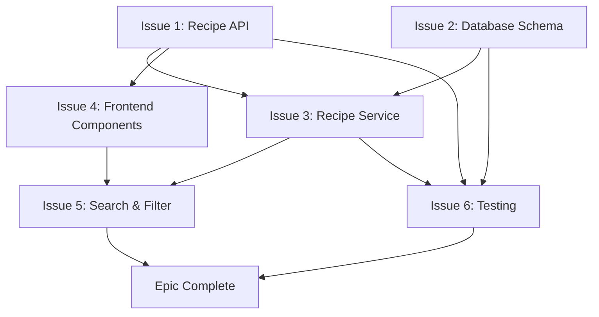

# Epic: [Epic Name]

## Vision & Strategic Context

[Why is this epic important? How does it align with organizational goals and product strategy?]

**Example**: The Recipe Management Feature Set establishes the foundation for our core value proposition: helping users discover, organize, and share recipes. This epic delivers the minimum viable product (MVP) for recipe functionality, enabling user engagement and platform differentiation. Success here directly impacts user acquisition and retention metrics critical to Q4 2025 goals.

**Business Objectives**:
- [Business goal 1]
- [Business goal 2]
- [Business goal 3]

**Example**:
- Increase monthly active users by 40% through improved recipe discovery
- Reduce time-to-value for new users from 10 minutes to 3 minutes
- Enable social sharing to drive organic user acquisition

## Success Criteria

High-level outcomes that define epic completion:

- [ ] [Success criterion 1 - measurable outcome]
- [ ] [Success criterion 2 - measurable outcome]
- [ ] [Success criterion 3 - measurable outcome]

**Example**:
- [ ] Users can create, edit, and delete recipes with full CRUD functionality
- [ ] Recipe search and filtering operational with <200ms response time
- [ ] Recipe sharing generates 500+ social media shares in first month
- [ ] Backend test coverage for recipe services reaches 75%
- [ ] Zero critical bugs in recipe management workflows

## Component Breakdown

[Break down epic into 5-8 discrete issues with clear boundaries]

### Issue 1: [Component Name]

**Purpose**: [What this component delivers and why it's needed]

**Example**: Recipe CRUD API endpoints provide backend foundation for recipe management.

**Scope**:
- [Specific deliverable 1]
- [Specific deliverable 2]
- [Specific deliverable 3]

**Example**:
- Create POST `/api/recipes` endpoint for recipe creation
- Implement GET `/api/recipes/{id}` for recipe retrieval
- Add PUT `/api/recipes/{id}` for recipe updates
- Implement DELETE `/api/recipes/{id}` for recipe deletion
- Add input validation and error handling

**Dependencies**: [Issues that must complete before this can start]

**Example**: None - foundation component

**Estimate**: [Effort sizing using established labels]

**Example**: `effort: medium` (moderate complexity - multi-file coordination)

**Assignee**: @BackendSpecialist

---

### Issue 2: [Component Name]

**Purpose**: [What this component delivers]

**Example**: Recipe database schema and migrations establish data persistence layer.

**Scope**:
- [Specific deliverable 1]
- [Specific deliverable 2]

**Example**:
- Design recipe table schema with all required fields
- Create Entity Framework Core migration
- Add database indexes for query performance
- Seed database with sample recipes for testing

**Dependencies**: None - can work in parallel with Issue 1

**Estimate**: `effort: small` (low complexity - single-file change)

**Assignee**: @BackendSpecialist

---

### Issue 3: [Component Name]

**Purpose**: [What this component delivers]

**Example**: Recipe service layer implements business logic and orchestration.

**Scope**:
- [Specific deliverable 1]
- [Specific deliverable 2]

**Example**:
- Create RecipeService with dependency injection
- Implement business validation rules
- Add recipe ownership authorization logic
- Integrate with database repository layer

**Dependencies**: Issue 1 (API contracts), Issue 2 (database schema)

**Estimate**: `effort: medium` (moderate complexity - business logic integration)

**Assignee**: @BackendSpecialist

---

### Issue 4: [Component Name]

**Purpose**: [What this component delivers]

**Example**: Recipe frontend components provide user interface for recipe management.

**Scope**:
- [Specific deliverable 1]
- [Specific deliverable 2]

**Example**:
- Create recipe list component with Angular Material
- Implement recipe detail view component
- Add recipe edit form with validation
- Build recipe creation wizard

**Dependencies**: Issue 1 (API endpoints)

**Estimate**: `effort: large` (high complexity - extensive UI components)

**Assignee**: @FrontendSpecialist

---

### Issue 5: [Component Name]

**Purpose**: [What this component delivers]

**Example**: Recipe search and filtering enables recipe discovery workflows.

**Scope**:
- [Specific deliverable 1]
- [Specific deliverable 2]

**Example**:
- Backend search endpoint with full-text search
- Frontend search UI with autocomplete
- Filter sidebar with dietary restrictions, cuisine type
- Real-time filter application with debouncing

**Dependencies**: Issue 1 (API), Issue 2 (database), Issue 4 (frontend components)

**Estimate**: `effort: medium` (moderate complexity - full-stack coordination)

**Assignees**: @BackendSpecialist, @FrontendSpecialist

---

### Issue 6: [Component Name]

**Purpose**: [What this component delivers]

**Example**: Recipe comprehensive test coverage ensures quality and reliability.

**Scope**:
- [Specific deliverable 1]
- [Specific deliverable 2]

**Example**:
- Unit tests for RecipeService (100% coverage)
- Integration tests for API endpoints
- E2E tests for complete user workflows
- Performance tests for search queries

**Dependencies**: Issues 1, 2, 3 (backend implementation)

**Estimate**: `effort: medium` (moderate complexity - comprehensive test suite)

**Assignee**: @TestEngineer

---

## Dependency Graph

**Critical Path**: Issue 2 → Issue 3 → Issue 5 → Issue 6 (longest dependency chain)

**Parallel Workstreams**:
- Backend track: Issues 1, 2, 3
- Frontend track: Issue 4 (starts after Issue 1)
- Testing track: Issue 6 (starts after Issue 3)

## Milestones & Phasing

### Phase 1: Foundation
**Goal**: Backend infrastructure and basic CRUD operational

**Issues**:
- Issue 1: Recipe API endpoints
- Issue 2: Database schema and migrations
- Issue 3: Recipe service layer

**Exit Criteria**:
- [ ] All CRUD endpoints functional
- [ ] Database migrations applied
- [ ] Basic recipe operations working end-to-end

---

### Phase 2: User Interface
**Goal**: Frontend recipe management operational

**Issues**:
- Issue 4: Frontend recipe components

**Exit Criteria**:
- [ ] Users can create, view, edit, delete recipes via UI
- [ ] Form validation working
- [ ] Error handling graceful

---

### Phase 3: Enhancement & Quality
**Goal**: Search, filtering, and comprehensive testing complete

**Issues**:
- Issue 5: Search and filtering
- Issue 6: Comprehensive testing

**Exit Criteria**:
- [ ] Recipe search and filtering functional
- [ ] Test coverage targets met (75% backend, 70% frontend)
- [ ] Performance benchmarks achieved (<200ms API response)
- [ ] Zero critical bugs

## Acceptance Criteria

Epic completion requires ALL criteria met:

- [ ] All 6 component issues completed and integrated
- [ ] Comprehensive end-to-end testing passed with zero critical defects
- [ ] Performance targets achieved (API <200ms, search <500ms)
- [ ] Documentation updated (API docs, user guides, developer docs)
- [ ] No regressions introduced in existing functionality
- [ ] Security audit passed (authentication, authorization, input validation)
- [ ] Backend test coverage ≥75%, frontend test coverage ≥70%
- [ ] User acceptance testing completed with positive feedback

## Risk Assessment

### Technical Risks

**Risk 1: Database Performance at Scale**
- **Probability**: Medium
- **Impact**: High
- **Mitigation**: Early load testing, proper indexing strategy, query optimization
- **Contingency**: Implement caching layer if needed

**Risk 2: Search Functionality Complexity**
- **Probability**: Low
- **Impact**: Medium
- **Mitigation**: Use proven full-text search libraries, start simple and iterate
- **Contingency**: Defer advanced search to future iteration

### Resource Risks

**Risk 1: Frontend Specialist Availability**
- **Probability**: Low
- **Impact**: High
- **Mitigation**: Clear API contracts enable parallel work, minimize dependencies
- **Contingency**: CodeChanger can handle basic frontend if needed

**Risk 2: Scope Complexity Underestimated**
- **Probability**: Medium
- **Impact**: Medium
- **Mitigation**: Iterative progress reviews, scope adjustment flexibility, adaptive planning
- **Contingency**: Defer Issue 5 (search) to post-MVP if needed based on iteration learnings

### Integration Risks

**Risk 1: Breaking Changes to Existing Features**
- **Probability**: Low
- **Impact**: High
- **Mitigation**: Comprehensive regression testing, staged rollout, feature flags
- **Contingency**: Rollback plan with database migration reversibility

**Risk 2: API Contract Misalignment**
- **Probability**: Medium
- **Impact**: Medium
- **Mitigation**: Early API contract review, OpenAPI spec validation, integration tests
- **Contingency**: API versioning strategy if breaking changes needed

## Success Metrics

### Quantitative Metrics

**User Engagement**:
- 500+ recipes created in first month
- 40% increase in monthly active users
- 5 minutes average session duration

**Performance**:
- API response time <200ms (95th percentile)
- Search query execution <500ms
- Zero production incidents related to recipe management

**Quality**:
- Backend test coverage ≥75%
- Frontend test coverage ≥70%
- Zero critical bugs, <5 medium bugs at launch

### Qualitative Metrics

**User Satisfaction**:
- Positive user feedback on recipe management UX
- <10% support ticket volume related to recipe features
- Social media sentiment positive (>80% positive mentions)

**Code Quality**:
- All code reviews approved with minimal revisions
- Architecture decisions documented
- Technical debt items identified and tracked

**Team Velocity**:
- All issues completed with scope and complexity expectations met
- Minimal rework required
- Team morale positive, sustainable pace maintained
- Iterative adaptations successful based on implementation learnings

---

**Recommended Labels**:
- `type: epic`
- `priority: high`
- `effort: epic`
- `component: api`
- `component: website`
- `component: database`
- `component: testing`

**Milestone**: Recipe Management MVP (Q4 2025)

**Related Issues**: #[issue-1], #[issue-2], #[issue-3], #[issue-4], #[issue-5], #[issue-6]

**Epic Branch**: `epic/recipe-management`

**Target Milestone**: Recipe Management MVP (Q4 2025)
