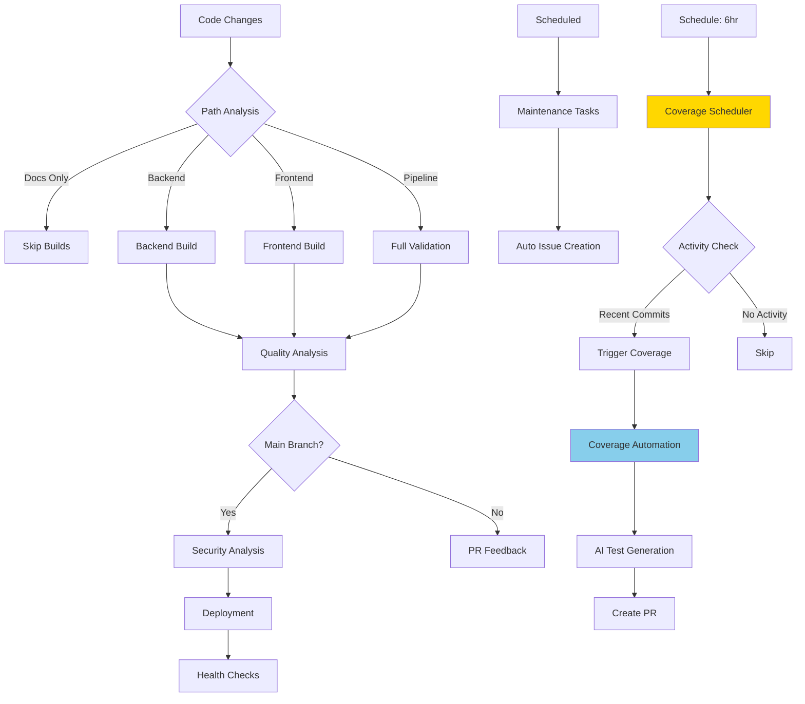

# Module/Directory: .github

**Last Updated:** 2025-08-15

**Parent:** [`zarichney-api`](../README.md)

## 1. Purpose & Responsibility

* **What it is:** GitHub-specific infrastructure directory containing all CI/CD workflows, custom actions, and automation configurations that power the project's DevOps pipeline.
* **Key Responsibilities:** 
    * CI/CD workflow orchestration for build, test, quality analysis, security scanning, and deployment
    * Custom GitHub Actions for reusable automation components
    * AI-powered analysis integration (security, tech debt, standards compliance)
    * Intelligent path-based workflow triggering and optimization
    * Automated issue creation and maintenance task scheduling
    * Security scanning configuration and policy enforcement
* **Why it exists:** To house a clean, maintainable CI/CD architecture that replaced 8 complex workflow files (1,670+ lines) with 5 focused workflows (~400 lines) and script-based logic for better testability and maintainability.
* **Submodules:**
    * **Actions:** [`actions/`](./actions/README.md) - Custom GitHub Actions for AI analysis and shared utilities
    * **Workflows:** [`workflows/`](./workflows/README.md) - Clean CI/CD pipeline with intelligent path filtering
    * **Prompts:** [`prompts/`](./prompts/README.md) - Template-based Claude AI analysis prompt system
    * **Configuration:** [`config/`](./config/README.md) - Configuration files for analysis tools and quality gates
    * **Security:** [`codeql/`](./codeql/README.md) - CodeQL security scanning configuration

## 2. Architecture & Key Concepts

* **High-Level Design:** The GitHub infrastructure follows a clean architecture pattern:
    * **Workflows** orchestrate the CI/CD pipeline with minimal inline logic
    * **Actions** contain reusable automation components and AI integrations
    * **Scripts** (in `Scripts/Pipeline/`) contain the actual business logic for maintainability
    * **Configuration** files define quality gates, security rules, and analysis parameters
* **Core Workflow Flow:** 
    1. **Path Analysis** → Determine which components changed
    2. **Build & Test** → Conditional execution based on path analysis
    3. **Quality Analysis** → AI-powered standards and tech debt assessment (PR only)
    4. **Security Analysis** → Comprehensive security scanning (main branch)
    5. **Deployment** → Conditional deployment with health checks (main branch)
    6. **Maintenance** → Scheduled cleanup and monitoring tasks
    7. **Coverage Automation** → Two-workflow architecture for scheduled test generation:
        * **Scheduler** → Checks activity every 6 hours, triggers if recent commits
        * **Automation** → Executes AI agent via workflow_dispatch (Claude Code compatible)
* **Key Integration Points:**
    * **AI Services:** Claude AI integration for security/quality analysis
    * **AWS Infrastructure:** EC2 deployment with health validation
    * **External Services:** Dependency scanning, code analysis, artifact management
* **Path Intelligence:** Smart workflow triggering prevents unnecessary runs:
    * Documentation-only changes skip expensive builds (30%+ efficiency gain)
    * Component-specific changes trigger only relevant workflows
    * Mixed changes intelligently determine required analysis scope



## 3. Interface Contract & Assumptions

* **Key Public Interfaces (for workflow execution):**
    * **Workflow Triggers**:
        * **Purpose:** Automatic execution based on code changes, schedules, or manual dispatch
        * **Critical Preconditions:** Valid GitHub repository, proper permissions, external service access
        * **Critical Postconditions:** Workflows execute in dependency order, results posted to PRs, artifacts created
        * **Non-Obvious Error Handling:** Graceful degradation when AI services unavailable; partial analysis with clear limitations
    * **Custom Actions**:
        * **Purpose:** Reusable automation components for setup, analysis, and result posting
        * **Critical Preconditions:** Proper action inputs, authenticated access to external services
        * **Critical Postconditions:** Consistent outputs, proper artifact handling, error propagation
        * **Non-Obvious Error Handling:** Actions include retry logic and detailed error reporting
* **Critical Assumptions:**
    * **External Service Access:** Internet connectivity for package downloads, AI services, AWS APIs
    * **Authentication:** Valid secrets for AWS, Claude AI, GitHub tokens configured
    * **Repository Structure:** Expected directory structure (`Code/`, `Scripts/`, `Docs/`) maintained
    * **Docker Availability:** Docker daemon accessible for integration testing and analysis
    * **Path Consistency:** File path patterns remain consistent for intelligent filtering

## 4. Local Conventions & Constraints (Beyond Global Standards)

* **Configuration:**
    * Workflow naming follows `NN-description.yml` pattern for clear ordering
    * Action names use descriptive kebab-case (e.g., `setup-environment`, `check-paths`)
    * Environment variables follow `UPPERCASE_SNAKE_CASE` convention
    * Secrets stored in GitHub repository settings with consistent naming
* **Workflow Organization:**
    * Sequential numbering ensures clear execution order understanding
    * Shared actions in `actions/shared/` for reusability
    * Configuration files in `config/` for centralized management
    * CodeQL configuration in dedicated `codeql/` directory
* **Technology Choices:**
    * GitHub Actions YAML with minimal inline logic
    * Bash scripts for complex automation (delegated to `Scripts/Pipeline/`)
    * Composite actions for reusable components
    * JSON/YAML for configuration management
* **AI Integration Standards:**
    * All AI prompts version-controlled in `.github/prompts/` with template-based system
    * Consistent placeholder-based dynamic context injection across analysis workflows
    * Quality gates based on AI-generated scores and recommendations
    * Graceful degradation when AI services unavailable

## 5. How to Work With This Code

* **Setup:**
    * No local setup required - GitHub-hosted infrastructure
    * For testing: Configure GitHub repository with required secrets
    * For development: Use GitHub web interface or `gh` CLI
    * For advanced debugging: Local `act` tool for workflow simulation
* **Testing:**
    * **Location:** Workflows tested through actual execution in repository
    * **How to Run:** Push to feature branch or use `workflow_dispatch` for manual testing
    * **Testing Strategy:** Each workflow includes validation steps and proper error handling
* **Common Usage Patterns:**
    ```bash
    # Manually trigger specific workflow
    gh workflow run "01-build.yml"
    
    # View workflow status
    gh run list --workflow="01-build.yml"
    
    # Check workflow logs
    gh run view <run-id> --log
    
    # Test path filtering locally
    ./Scripts/Pipeline/test-path-filtering.sh
    ```
* **Common Pitfalls / Gotchas:**
    * Workflow permissions must be carefully configured for security
    * Path filters use glob patterns that must match actual file structure
    * AI service availability affects analysis workflows (graceful degradation implemented)
    * Secret management requires proper GitHub repository configuration

## 6. Dependencies

* **Internal Code Dependencies:**
    * [`.github/scripts/`](../scripts/README.md) - Core automation logic executed by workflows
    * [`.github/prompts/`](./prompts/README.md) - Template-based AI analysis prompts with placeholder system
    * [`Code/Zarichney.Server/`](../Code/Zarichney.Server/README.md) - Backend application for build/test/deploy
    * [`Code/Zarichney.Website/`](../Code/Zarichney.Website/README.md) - Frontend application for build/test/deploy
* **External Service Dependencies:**
    * `GitHub Actions Runtime` - Workflow execution environment
    * `Claude AI API` - AI-powered security and quality analysis
    * `AWS Services` - EC2 deployment, S3 storage, health monitoring
    * `Docker Hub` - Container images for testing and analysis
    * `Node.js/NPM` - Frontend build dependencies
    * `.NET SDK` - Backend build and test execution
* **Dependents (Impact of Changes):**
    * [`Local Development`](../CLAUDE.md) - Development workflow references these GitHub processes
    * [CI/CD Pipeline] - All automated quality gates and deployment processes
    * [Security Infrastructure] - Automated security scanning and vulnerability management

## 7. Rationale & Key Historical Context

* **Clean Architecture Decision:** Replaced complex inline workflow logic with script-based approach to enable local testing, easier debugging, and better maintainability
* **AI Integration Strategy:** Template-based prompts in `.github/prompts/` provide consistent, version-controlled AI analysis with dynamic context injection
* **Prompt Refactoring:** Extracted inline Claude AI prompts to separate template files for improved maintainability and workflow clarity
* **Path-Based Optimization:** Intelligent filtering reduces unnecessary workflow runs by 30%+ while maintaining comprehensive coverage
* **Workflow Separation:** Six focused workflows replace eight overlapping ones, each with single responsibility and clear dependencies
* **Script Delegation:** Moving complex logic to `Scripts/Pipeline/` enables local development and testing of CI/CD components
* **Coverage Epic Split:** Two-workflow architecture (scheduler + automation) resolves Claude Code action's incompatibility with schedule events while preserving automated execution

## 8. Known Issues & TODOs

* **Windows Compatibility:** GitHub Actions primarily designed for Linux runners; Windows support may need additional configuration
* **AI Service Resilience:** Current graceful degradation could be enhanced with cached analysis results
* **Workflow Performance:** Some parallel execution opportunities not yet implemented
* **Configuration Management:** Could benefit from more sophisticated configuration validation
* **Monitoring Integration:** Enhanced observability and alerting could be added for production workflows
* **Coverage Scheduler Intelligence:** Could add more sophisticated PR conflict detection and workload balancing

---