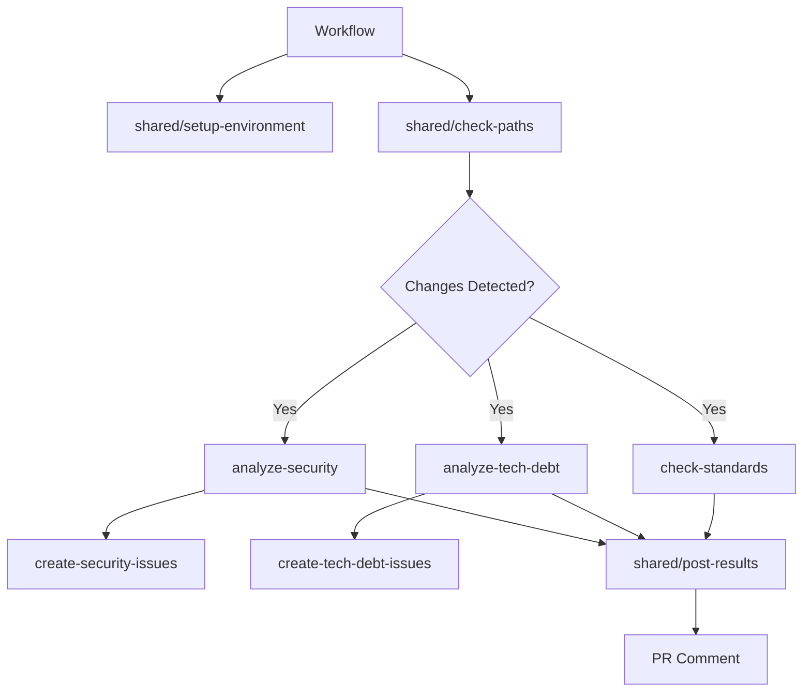

# Module/Directory: .github/actions

**Last Updated:** 2025-07-27

**Parent:** [`.github`](../README.md)

## 1. Purpose & Responsibility

* **What it is:** Collection of custom GitHub Actions that provide reusable automation components for the CI/CD pipeline, focusing on AI-powered analysis and shared infrastructure utilities.
* **Key Responsibilities:** 
    * AI-powered security vulnerability analysis and reporting
    * Technical debt assessment and automatic issue creation
    * Standards compliance checking and validation
    * Shared utility actions for environment setup and result posting
    * Path-based change detection for intelligent workflow triggering
    * Automated issue creation for security and quality findings
* **Why it exists:** To encapsulate complex automation logic into reusable, testable components that can be shared across multiple workflows while maintaining clean separation of concerns.
* **Submodules:**
    * **Shared Utilities:** [`shared/`](./shared/README.md) - Common actions used across multiple workflows
    * **Individual Actions:** Custom actions for specific analysis and automation tasks

## 2. Architecture & Key Concepts

* **High-Level Design:** Actions are organized into two categories:
    * **Analysis Actions** - AI-powered analysis with Claude integration (`analyze-*`, `check-*`)
    * **Infrastructure Actions** - Shared utilities and automation (`shared/*`, `create-*`)
* **Core Action Types:**
    * **Composite Actions** - Multi-step actions combining GitHub Actions and shell commands
    * **Analysis Actions** - AI integration actions that process data and generate reports
    * **Utility Actions** - Reusable infrastructure components for setup and result handling
* **Integration Patterns:**
    * **Input/Output Standardization** - Consistent parameter naming and output formats
    * **Artifact Management** - Standardized artifact creation and consumption
    * **Error Handling** - Graceful degradation and detailed error reporting
    * **AI Service Integration** - Claude AI OAuth integration for analysis actions



## 3. Interface Contract & Assumptions

* **Key Public Interfaces (for workflow callers):**
    * **Analysis Actions** (`analyze-security`, `analyze-tech-debt`, `check-standards`):
        * **Purpose:** AI-powered analysis of code changes with structured reporting
        * **Critical Preconditions:** Source code available, analysis data artifacts present, Claude AI token configured
        * **Critical Postconditions:** Structured markdown reports generated, quality gates evaluated, recommendations provided
        * **Non-Obvious Error Handling:** Graceful degradation when AI services unavailable; generates summary reports with limitations noted
    * **Shared Actions** (`shared/setup-environment`, `shared/check-paths`, `shared/post-results`):
        * **Purpose:** Common infrastructure setup and utility functions
        * **Critical Preconditions:** GitHub Actions runtime environment, proper permissions
        * **Critical Postconditions:** Environment ready for subsequent steps, outputs available for decision making
        * **Non-Obvious Error Handling:** Retry logic for transient failures; clear error messages for configuration issues
    * **Issue Creation Actions** (`create-security-issues`, `create-tech-debt-issues`):
        * **Purpose:** Automated GitHub issue creation for findings that require follow-up
        * **Critical Preconditions:** Analysis results available, GitHub token with issues permission
        * **Critical Postconditions:** Issues created with proper labels and assignments, duplicate detection
        * **Non-Obvious Error Handling:** Prevents duplicate issue creation; handles API rate limiting
* **Critical Assumptions:**
    * **AI Service Availability:** Claude AI API accessible with valid OAuth token
    * **GitHub Permissions:** Repository access, issue creation, PR commenting permissions configured
    * **Artifact Consistency:** Analysis data follows expected JSON schema formats
    * **Network Access:** Internet connectivity for external service integration

## 4. Local Conventions & Constraints (Beyond Global Standards)

* **Configuration:**
    * All actions use `action.yml` manifest with semantic input/output naming
    * Input parameters follow `kebab-case` convention (e.g., `oauth-token`, `analysis-data`)
    * Output variables use `snake_case` convention (e.g., `security_score`, `issues_created`)
    * Secrets handled through GitHub repository configuration
* **Action Structure:**
    * Composite actions preferred for multi-step operations
    * Shell scripts kept minimal with delegation to `Scripts/Pipeline/`
    * AI prompts sourced from `Scripts/Prompts/` for version control
    * Error handling includes both success/failure outputs and detailed logging
* **AI Integration Standards:**
    * Claude AI integration through OAuth token authentication
    * Consistent prompt loading from version-controlled files
    * Structured JSON input/output for analysis data
    * Quality gate evaluation based on AI-generated scores
* **Issue Management:**
    * Automated labeling system for created issues
    * Duplicate detection based on title patterns and content
    * Proper assignment to repository maintainers
    * Integration with project milestones and boards

## 5. How to Work With This Code

* **Setup:**
    * No local setup required - actions run in GitHub infrastructure
    * For testing: Configure repository secrets (e.g., `CLAUDE_CODE_OAUTH_TOKEN`)
    * For development: Use action testing frameworks or manual workflow triggers
    * For debugging: Enable debug logging with `ACTIONS_RUNNER_DEBUG=true`
* **Testing:**
    * **Location:** Actions tested through workflow execution and integration tests
    * **How to Run:** Trigger workflows that use these actions or test with `act` locally
    * **Testing Strategy:** Each action includes validation steps and error case handling
* **Common Usage Patterns:**
    ```yaml
    # Using shared setup action
    - name: Setup environment
      uses: ./.github/actions/shared/setup-environment
      with:
        setup-dotnet: 'true'
        setup-node: 'true'
    
    # Using analysis action
    - name: Run security analysis
      uses: ./.github/actions/analyze-security
      with:
        oauth-token: ${{ secrets.CLAUDE_CODE_OAUTH_TOKEN }}
        analysis-data: './security-analysis-data.json'
    ```
* **Common Pitfalls / Gotchas:**
    * Action caching behavior depends on proper input parameter configuration
    * AI service rate limiting may affect analysis actions during high usage
    * Composite actions must handle working directory context properly
    * Secret availability varies between public and private repositories

## 6. Dependencies

* **Internal Code Dependencies:**
    * [`Scripts/Pipeline/`](../../Scripts/Pipeline/README.md) - Core automation logic executed by actions
    * [`Scripts/Prompts/`](../../Scripts/Prompts/README.md) - AI analysis prompts loaded by analysis actions
    * [`.github/workflows/`](../workflows/README.md) - Workflows that consume these actions
* **External Service Dependencies:**
    * `Claude AI API` - AI-powered analysis for security, tech debt, and standards compliance
    * `GitHub API` - Issue creation, PR commenting, repository operations
    * `Docker Hub` - Container images for analysis tools and environments
    * `Node.js/NPM Registries` - Package installations for environment setup
    * `.NET Package Sources` - NuGet packages for backend tooling
* **Dependents (Impact of Changes):**
    * [`.github/workflows/`](../workflows/README.md) - All workflows depend on shared actions
    * [CI/CD Pipeline] - Quality gates and deployment decisions rely on analysis outputs
    * [Development Workflow] - PR feedback and issue creation affects development process

## 7. Rationale & Key Historical Context

* **Reusability Focus:** Custom actions eliminate code duplication across workflows while providing consistent interfaces
* **AI Integration Strategy:** Centralized AI analysis through custom actions enables consistent reporting and quality gates
* **Composite Action Design:** Using composite actions instead of Docker actions provides faster execution and simpler maintenance
* **Shared Utilities Pattern:** Common actions (setup, path checking, result posting) reduce workflow complexity and ensure consistency
* **Issue Automation:** Automated issue creation for security and quality findings ensures important items don't get lost

## 8. Known Issues & TODOs

* **Action Marketplace:** Consider publishing shared actions to GitHub Marketplace for broader reuse
* **Caching Optimization:** Some actions could benefit from enhanced caching strategies
* **Error Recovery:** More sophisticated retry mechanisms for transient AI service failures
* **Testing Framework:** Dedicated action testing framework would improve development workflow
* **Documentation Automation:** Auto-generate action documentation from manifest files

---