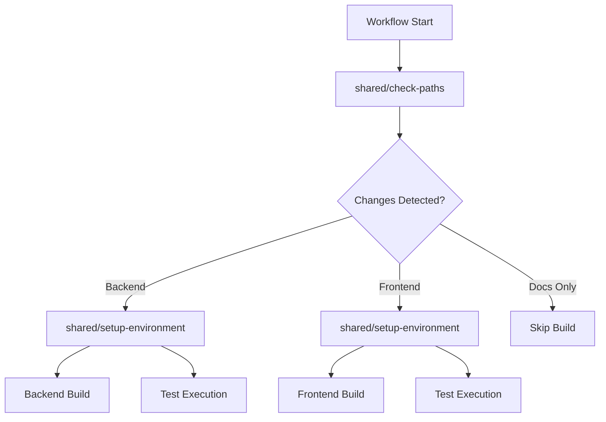

# Module/Directory: .github/actions

**Last Updated:** 2025-07-28

**Parent:** [`.github`](../README.md)

## 1. Purpose & Responsibility

* **What it is:** Collection of shared GitHub Actions providing reusable utility components for the CI/CD pipeline.
* **Key Responsibilities:** 
    * Path-based change detection for intelligent workflow triggering
    * Shared environment setup for consistent build environments
    * Common infrastructure utilities used across multiple workflows
* **Why it exists:** To encapsulate common automation logic into reusable, testable components that can be shared across all workflows while maintaining clean separation of concerns.
* **Submodules:**
    * **Shared Utilities:** [`shared/`](./shared/README.md) - Common actions used across all workflows

## 2. Architecture & Key Concepts

* **High-Level Design:** Actions are organized as utility components:
    * **Infrastructure Actions** - Shared utilities for setup and path detection (`shared/*`)
    * **Composite Actions** - Multi-step actions combining shell commands and GitHub Actions
* **Core Action Types:**
    * **Environment Setup** - Consistent development environment configuration
    * **Path Analysis** - Intelligent change detection for workflow optimization
* **Integration Pattern:**
    * Workflows reference actions using relative paths
    * Consistent input/output interfaces across actions
    * Error handling with graceful degradation



## 3. Interface Contract & Assumptions

* **Key Public Interfaces (for workflow callers):**
    * **`shared/check-paths`**:
        * **Purpose:** Analyze changed files to determine which components need building
        * **Critical Preconditions:** Git repository with commit history, proper checkout depth
        * **Critical Postconditions:** Output variables set for backend/frontend/docs changes
        * **Outputs:** `backend-changed`, `frontend-changed`, `docs-only`, `changed-files`
    * **`shared/setup-environment`**:
        * **Purpose:** Configure consistent build environment with required tools
        * **Critical Preconditions:** GitHub Actions runner environment
        * **Critical Postconditions:** .NET SDK and/or Node.js configured as requested
        * **Inputs:** `setup-dotnet`, `setup-node`, `dotnet-version`, `node-version`
* **Critical Assumptions:**
    * GitHub Actions runtime environment available
    * Repository structure follows expected conventions
    * Network access for tool downloads
    * Sufficient runner permissions for environment setup

## 4. Local Conventions & Constraints (Beyond Global Standards)

* **Configuration:**
    * All actions use `action.yml` manifest
    * Input parameters follow `kebab-case` convention
    * Output variables use `kebab-case` convention
    * Boolean inputs accept string values ('true'/'false')
* **Action Structure:**
    * Composite actions for all shared utilities
    * Minimal shell scripting within actions
    * Clear action names describing their purpose
    * Version pinning for external action dependencies
* **Error Handling:**
    * Actions continue on non-critical errors
    * Clear error messages in logs
    * Default values for optional parameters
    * Validation of critical inputs

## 5. How to Work With This Code

* **Setup:**
    * No local setup required - actions run in GitHub infrastructure
    * For testing: Use workflow that calls these actions
    * For development: Edit action.yml and test through workflow execution
* **Testing:**
    * **Location:** Actions tested through workflow execution
    * **How to Run:** Trigger workflows that use these actions
    * **Testing Strategy:** Verify outputs and behavior in workflow context
* **Common Usage Patterns:**
    ```yaml
    # Using path checking
    - name: Check paths
      id: check-paths
      uses: ./.github/actions/shared/check-paths
      with:
        base-ref: ${{ github.event.pull_request.base.sha }}
    
    # Using environment setup
    - name: Setup environment
      uses: ./.github/actions/shared/setup-environment
      with:
        setup-dotnet: 'true'
        setup-node: 'false'
        dotnet-version: '8.0.x'
    ```
* **Common Pitfalls / Gotchas:**
    * Path checking requires sufficient git history (fetch-depth)
    * Boolean inputs must be strings in YAML
    * Relative action paths must start with `./`
    * Changes to actions affect all workflows using them

## 6. Dependencies

* **Internal Code Dependencies:**
    * [`.github/workflows/`](../workflows/README.md) - All workflows use these shared actions
    * Repository structure for path detection logic
* **External Action Dependencies:**
    * `actions/setup-dotnet@v4` - .NET SDK installation
    * `actions/setup-node@v4` - Node.js installation
* **Dependents (Impact of Changes):**
    * [`build.yml`](../workflows/build.yml) - Uses both shared actions
    * [`deploy.yml`](../workflows/deploy.yml) - Uses shared actions
    * [`maintenance.yml`](../workflows/maintenance.yml) - Uses setup-environment

## 7. Rationale & Key Historical Context

* **Reusability Focus:** Shared actions eliminate code duplication across workflows
* **Composite Action Design:** Simple, maintainable approach without Docker overhead
* **Path Detection:** Enables intelligent workflow execution based on actual changes
* **Environment Consistency:** Shared setup ensures all workflows use same tool versions

## 8. Known Issues & TODOs

* **Caching Strategy:** Environment setup could benefit from tool caching
* **Path Detection Enhancement:** More granular detection for specific file types
* **Error Recovery:** More sophisticated retry mechanisms for tool downloads
* **Performance Metrics:** Action execution time tracking for optimization

---