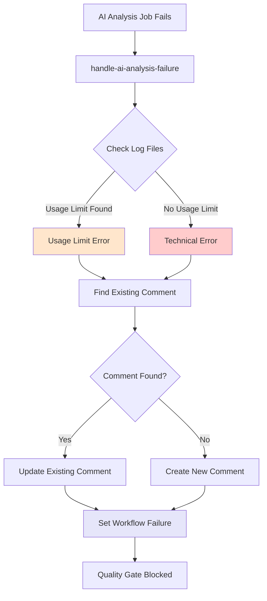

# Module/Directory: .github/actions/handle-ai-analysis-failure

**Last Updated:** 2025-08-05

**Parent:** [`.github/actions`](../README.md)

## 1. Purpose & Responsibility

* **What it is:** A composite GitHub Action that provides centralized error handling for AI analysis job failures across all five AI analysis workflows (TestMaster, StandardsGuardian, DebtSentinel, SecuritySentinel, MergeOrchestrator).
* **Key Responsibilities:** 
    * Detecting and categorizing Claude AI failure types (usage limit vs technical errors)
    * Finding and updating existing error comments on pull requests to avoid duplication
    * Creating appropriately formatted error messages with actionable next steps
    * Failing workflows with descriptive error messages for proper quality gate enforcement
    * Providing consistent error handling behavior across all AI analysis jobs
* **Why it exists:** To eliminate ~500 lines of duplicated error handling code across the 5 AI analysis jobs in build.yml, improving maintainability and ensuring consistent error handling behavior. This composite action replaced identical error handling logic that was copy-pasted across all AI analysis workflows.

## 2. Architecture & Key Concepts

* **High-Level Design:** Single composite action that encapsulates the complete error handling workflow:
    * **Error Detection** - Analyzes Claude execution logs to determine failure type
    * **Comment Management** - Finds existing error comments to update rather than create duplicates
    * **Message Generation** - Creates contextual error messages based on analysis type and failure cause
    * **Workflow Integration** - Properly fails the calling workflow with descriptive error messages
* **Core Error Handling Flow:**
    1. **Log Analysis** - Checks Claude execution output files for usage limit indicators
    2. **Comment Discovery** - Searches existing PR comments for analysis-specific error comments
    3. **Message Composition** - Builds appropriate error message based on failure type and analysis context
    4. **Comment Management** - Updates existing comment or creates new one as needed
    5. **Workflow Failure** - Sets workflow failure with descriptive error for quality gate enforcement
* **Error Categorization:**
    * **Usage Limit Failures** - Claude AI daily usage limit reached (temporary, retry-able)
    * **Technical Errors** - Infrastructure or integration failures (requires investigation)



## 3. Interface Contract & Assumptions

* **Key Public Interface (for workflow consumption):**
    * **Purpose:** Standardized error handling for AI analysis job failures with PR comment management
    * **Critical Preconditions:** 
        * GitHub Actions context with valid repository and PR information
        * Valid GitHub token with issues:write permission for PR comments
        * Analysis job has failed (checked via calling workflow's failure condition)
        * Workflow run metadata available for error message links
    * **Critical Postconditions:** 
        * Error comment posted or updated on PR with analysis-specific formatting
        * Workflow step failed with descriptive error message
        * No duplicate error comments created for the same analysis type
        * Quality gate properly blocked until issue resolved
    * **Non-Obvious Error Handling:** 
        * Gracefully handles missing log files (treats as technical error)
        * Prevents comment duplication through sophisticated comment filtering
        * Handles GitHub API failures by attempting both update and create operations
* **Input Parameters:**
    * **`github-token`** (required): GitHub token for API operations
    * **`analysis-type`** (required): AI analysis type (TestMaster, StandardsGuardian, DebtSentinel, SecuritySentinel, MergeOrchestrator)
    * **`analysis-emoji`** (required): Emoji identifier for the analysis type
    * **`analysis-name`** (required): Human-readable analysis name for error messages
    * **`standards-link`** (optional): Link to relevant standards documentation
    * **`run-number`** (required): GitHub workflow run number for error message links
    * **`run-id`** (required): GitHub workflow run ID for error message links
* **Critical Assumptions:**
    * **GitHub API Access:** Stable API access for comment operations with proper rate limiting
    * **Log File Locations:** Claude execution logs available at expected paths
    * **PR Context:** Valid pull request context available in GitHub Actions environment
    * **Comment Permissions:** GitHub token has sufficient permissions for issue comment operations

## 4. Local Conventions & Constraints (Beyond Global Standards)

* **Configuration:**
    * Input parameters use kebab-case naming convention for GitHub Actions compatibility
    * Boolean concepts represented as strings due to GitHub Actions YAML limitations
    * Error messages follow consistent markdown formatting with clear sections
    * Comment identification uses specific analysis type markers to prevent cross-contamination
* **Error Message Structure:**
    * **Header:** Analysis type with failure emoji and clear status indicator
    * **Impact Section:** Describes what functionality is affected and manual alternatives
    * **Next Steps:** Actionable remediation steps with specific timeframes
    * **Workflow Link:** Direct link to failed workflow run for debugging
* **Comment Management Logic:**
    * Sophisticated filtering prevents duplicate comments for same analysis type
    * Updates existing error comments rather than creating new ones
    * Handles edge cases like generic error comments that haven't been categorized yet
    * Maintains comment history while updating content for current failure context

## 5. How to Work With This Code

* **Setup:**
    * No local setup required - runs in GitHub Actions infrastructure
    * For testing: Use in actual workflow with failure conditions
    * For development: Modify action.yml and test through workflow execution
    * For debugging: Enable debug logging with `ACTIONS_RUNNER_DEBUG=true`
* **Testing:**
    * **Location:** Tested through integration with actual AI analysis job failures
    * **How to Run:** Trigger AI analysis job failures in test workflows or use manual workflow dispatch
    * **Testing Strategy:** Verify error detection, comment management, and workflow failure behavior
* **Common Usage Pattern:**
    ```yaml
    - name: Handle [Analysis Type] Failure
      if: failure() && steps.claude-[analysis].outcome == 'failure'
      uses: ./.github/actions/handle-ai-analysis-failure
      with:
        github-token: ${{ secrets.GITHUB_TOKEN }}
        analysis-type: 'TestMaster'
        analysis-emoji: '🧪'
        analysis-name: 'Testing Analysis'
        standards-link: 'https://github.com/Zarichney-Development/zarichney-api/blob/main/Docs/Standards/TestingStandards.md'
        run-number: ${{ github.run_number }}
        run-id: ${{ github.run_id }}
    ```
* **Common Pitfalls / Gotchas:**
    * Action only runs when previous step explicitly fails - requires proper failure condition
    * Comment filtering depends on consistent analysis type naming across error handling calls
    * GitHub API rate limiting may affect comment operations during high-frequency failures
    * Standards link parameter is optional but improves user experience when provided

## 6. Dependencies

* **Internal Code Dependencies:**
    * [`.github/workflows/build.yml`](../../workflows/build.yml) - All 5 AI analysis jobs use this action for error handling
    * Analysis-specific prompt files in [`.github/prompts/`](../../prompts/README.md) - Referenced in error messages
* **External Action Dependencies:**
    * `actions/github-script@v7` - Provides Node.js runtime and GitHub API access for comment operations
* **External Service Dependencies:**
    * `GitHub API` - Issues and comments API for PR comment management
    * `GitHub Actions Runtime` - Workflow context and environment variables
* **Dependents (Impact of Changes):**
    * [`claude-testing-analysis`](../../workflows/build.yml) - TestMaster error handling
    * [`claude-standards-analysis`](../../workflows/build.yml) - StandardsGuardian error handling  
    * [`claude-tech-debt-analysis`](../../workflows/build.yml) - DebtSentinel error handling
    * [`claude-security-analysis`](../../workflows/build.yml) - SecuritySentinel error handling
    * [`claude-merge-orchestrator`](../../workflows/build.yml) - MergeOrchestrator error handling

## 7. Rationale & Key Historical Context

* **Tech Debt Resolution:** Created to address medium-priority tech debt identified in PR #75 where ~500 lines of identical error handling logic was duplicated across 5 AI analysis jobs
* **Maintainability Focus:** Centralizing error handling logic ensures consistent behavior and makes future updates easier (single point of change vs 5 locations)
* **DRY Principle:** Eliminates significant code duplication while maintaining all original functionality
* **Consistency Improvement:** Ensures all AI analysis jobs handle errors identically, reducing user confusion and support burden
* **Quality Gate Preservation:** Maintains proper workflow failure behavior to ensure quality gates remain effective

## 8. Known Issues & TODOs

* **Error Recovery:** Could be enhanced with more sophisticated retry mechanisms for transient GitHub API failures
* **Comment Formatting:** Advanced markdown formatting could improve readability of error messages
* **Metrics Collection:** Could benefit from error tracking and analytics for failure pattern analysis
* **Configuration Validation:** Input parameter validation could be more comprehensive with better error messages

---