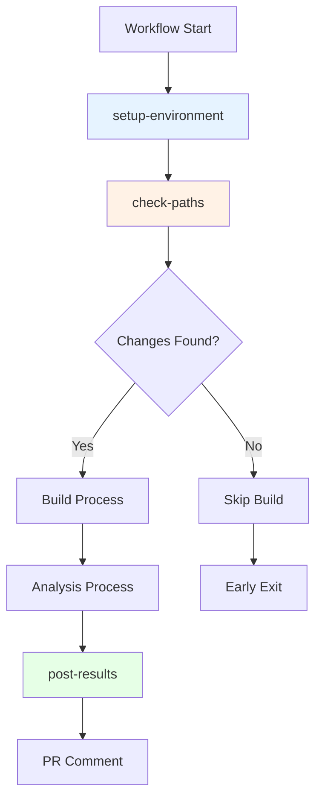

# Module/Directory: .github/actions/shared

**Last Updated:** 2025-08-14

**Parent:** [`.github/actions`](../README.md)

## 1. Purpose & Responsibility

* **What it is:** Collection of reusable composite GitHub Actions that provide common infrastructure utilities used across multiple workflows in the CI/CD pipeline.
* **Key Responsibilities:** 
    * Unified development environment setup for .NET and Node.js
    * Intelligent path-based change detection for workflow optimization
    * Test suite baseline validation with environment-aware thresholds
    * Standardized result posting to pull requests with consistent formatting
    * Common error handling and logging patterns
    * Artifact management and workflow communication
* **Why it exists:** To eliminate code duplication across workflows, ensure consistent behavior in common operations, and provide reliable infrastructure components that can be reused and tested independently.

## 2. Architecture & Key Concepts

* **High-Level Design:** Four core shared actions that form the foundation of workflow automation:
    * **`setup-environment`** - Configures development environment with required tools
    * **`check-paths`** - Analyzes changed files to determine required workflow execution
    * **`validate-test-suite`** - Validates test results against baseline standards (Phase 2)
    * **`post-results`** - Standardizes communication of analysis results to pull requests
* **Core Action Types:**
    * **Composite Actions** - Multi-step actions combining GitHub Actions and shell commands
    * **Environment Actions** - Setup and configuration utilities with automatic tool restoration
    * **Validation Actions** - Test suite and quality gate validation utilities (Phase 2)
    * **Communication Actions** - Result formatting and posting utilities
* **Integration Patterns:**
    * **Input Validation** - Comprehensive input parameter validation with clear error messages
    * **Output Standardization** - Consistent output formats across all shared actions
    * **Error Propagation** - Proper error handling with detailed logging and failure modes
    * **Caching Support** - Built-in caching for performance optimization



## 3. Interface Contract & Assumptions

* **Key Public Interfaces (for workflow consumption):**
    * **`setup-environment`**:
        * **Purpose:** Configure development environment with .NET, Node.js, common tools, and restore .NET local tools
        * **Critical Preconditions:** GitHub Actions runner with sudo access, internet connectivity, optional .config/dotnet-tools.json
        * **Critical Postconditions:** Specified tools installed and configured, .NET local tools restored (if defined), environment variables set
        * **Non-Obvious Error Handling:** Retry logic for package installation failures; version verification after setup; graceful handling when no local tools defined
    * **`check-paths`**:
        * **Purpose:** Analyze file changes to determine which workflows and jobs should execute
        * **Critical Preconditions:** Git repository with valid history, changed files detectable
        * **Critical Postconditions:** Boolean outputs for backend/frontend/docs changes, changed file list available
        * **Non-Obvious Error Handling:** Handles edge cases like new repositories, merge conflicts, large change sets
    * **`validate-test-suite`** *(Phase 2)*:
        * **Purpose:** Validate test results against baseline standards with environment-aware thresholds
        * **Critical Preconditions:** Test results files available, jq and bc tools installed, configuration standards defined
        * **Critical Postconditions:** Baseline validation results generated, violations and recommendations identified
        * **Non-Obvious Error Handling:** Graceful degradation when baseline files missing; environment auto-detection with fallbacks
    * **`post-results`**:
        * **Purpose:** Post analysis results to pull requests with consistent formatting
        * **Critical Preconditions:** Valid analysis data, PR context available, GitHub token with comment permissions
        * **Critical Postconditions:** Comment posted or updated on PR, previous comments managed appropriately
        * **Non-Obvious Error Handling:** Prevents duplicate comments; handles API rate limiting; graceful degradation for large comments
* **Critical Assumptions:**
    * **GitHub Context:** Valid GitHub Actions context with repository and PR information
    * **Permission Model:** Appropriate GitHub token permissions for required operations
    * **File System Access:** Write access to workspace for temporary files and caching
    * **Network Reliability:** Internet access for package downloads and API calls

## 4. Local Conventions & Constraints (Beyond Global Standards)

* **Configuration:**
    * All actions use `action.yml` manifests with comprehensive input/output definitions
    * Input parameters support both required and optional configurations
    * Default values provided for common use cases to reduce workflow complexity
    * Boolean inputs use string representation ('true'/'false') for GitHub Actions compatibility
* **Action Architecture:**
    * Composite actions preferred for multi-step operations
    * Shell scripts embedded directly for simplicity and performance
    * Environment variable usage follows GitHub Actions conventions
    * Caching keys designed for optimal cache hit rates
* **Error Handling Standards:**
    * All actions include proper exit code handling
    * Detailed logging with both info and error messages
    * Graceful degradation when optional features fail
    * Clear error messages with actionable remediation steps
* **Output Conventions:**
    * Boolean outputs use 'true'/'false' string values
    * Complex outputs use JSON format for structured data
    * File paths use absolute paths for consistency
    * Lists use newline-separated format for GitHub Actions compatibility

## 5. How to Work With This Code

* **Setup:**
    * No local setup required - actions run in GitHub infrastructure
    * For testing: Use in actual workflows or test with `act` tool locally
    * For development: Modify `action.yml` files and test through workflow execution
    * For debugging: Enable debug logging with `ACTIONS_RUNNER_DEBUG=true`
* **Testing:**
    * **Location:** Actions tested through integration with actual workflows
    * **How to Run:** Create test workflows or use existing workflows that consume these actions
    * **Testing Strategy:** Each action includes validation steps and error case handling
* **Common Usage Patterns:**
    ```yaml
    # Environment setup with automatic .NET tool restoration
    - name: Setup development environment
      uses: ./.github/actions/shared/setup-environment
      with:
        setup-dotnet: 'true'
        dotnet-version: '8.0.x'
        setup-node: 'true'
        node-version: '18.x'
    # Note: Automatically restores tools from .config/dotnet-tools.json if present
    
    # Path analysis
    - name: Analyze changed paths
      id: paths
      uses: ./.github/actions/shared/check-paths
    
    # Test suite baseline validation (Phase 2)
    - name: Validate test suite baselines
      id: baseline-validation
      uses: ./.github/actions/shared/validate-test-suite
      with:
        test-results-path: './TestResults'
        fail-on-violations: 'false'  # Warning mode
        environment-override: 'unconfigured'
    
    # Result posting
    - name: Post analysis results
      uses: ./.github/actions/shared/post-results
      with:
        analysis-type: 'security'
        results-file: './security-analysis.md'
        pr-number: ${{ github.event.number }}
    ```
* **Common Pitfalls / Gotchas:**
    * Action caching depends on proper cache key generation and input consistency
    * Path analysis accuracy depends on git history and proper fetch depth
    * PR commenting requires appropriate GitHub token permissions
    * Large comments may be truncated due to GitHub API limitations
    * .NET tools (like refitter) require `dotnet tool restore` which is now automatic in setup-environment

## 6. Dependencies

* **Internal Code Dependencies:**
    * [`Scripts/Pipeline/common-functions.sh`](../../../Scripts/Pipeline/README.md) - Shared utility functions used by actions
    * [`.github/workflows/`](../../workflows/README.md) - Workflows that consume these shared actions
* **External Action Dependencies:**
    * `actions/checkout@v4` - Repository checkout functionality
    * `actions/setup-dotnet@v4` - .NET SDK installation
    * `actions/setup-node@v4` - Node.js installation
    * `actions/cache@v3` - Caching functionality for performance
* **External Tool Dependencies:**
    * `git` - Version control operations for path analysis
    * `jq` - JSON processing for structured data handling
    * `curl` - HTTP requests for API interactions
    * `gh` CLI - GitHub API operations for advanced functionality
* **Dependents (Impact of Changes):**
    * [`.github/workflows/01-build.yml`](../../workflows/README.md) - Uses setup-environment and check-paths
    * [`.github/workflows/02-quality.yml`](../../workflows/README.md) - Uses post-results for PR comments
    * [`.github/workflows/03-security.yml`](../../workflows/README.md) - Uses setup-environment for security tools

## 7. Rationale & Key Historical Context

* **Reusability Focus:** Extracted common patterns from multiple workflows to eliminate duplication and ensure consistency
* **Composite Action Choice:** Using composite actions instead of Docker actions provides faster execution and simpler maintenance
* **Path Intelligence:** Smart path detection enables significant performance optimization by skipping unnecessary work
* **Standardized Communication:** Consistent result posting ensures uniform PR feedback experience across all analysis types
* **Error Resilience:** Comprehensive error handling ensures workflows continue gracefully even when optional features fail
* **Tool Restoration:** Added automatic `dotnet tool restore` to prevent failures from missing local tools (e.g., refitter) across all workflows

## 8. Known Issues & TODOs

* **Cache Optimization:** Cache keys could be further optimized for better hit rates across different scenarios
* **Path Pattern Enhancement:** Path detection could support more sophisticated pattern matching
* **Result Formatting:** Enhanced markdown formatting could improve readability of posted results
* **Action Versioning:** Consider implementing semantic versioning for shared actions
* **Performance Monitoring:** Add metrics collection for action execution times and success rates

---