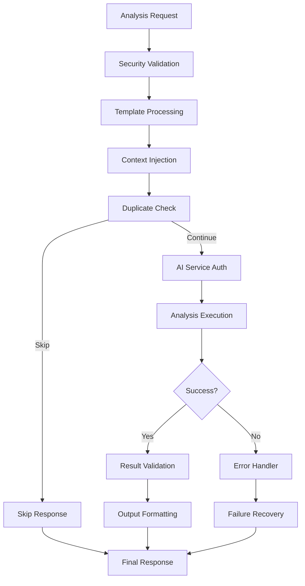

# AI Sentinel Base Framework

**Version:** 1.0.0
**Epic Context:** [Epic #181: Standardize Build Workflows](../../../Docs/Specs/epic-181-build-workflows/README.md)
**Component Spec:** [AI Sentinel Base Specification](../../../Docs/Specs/epic-181-build-workflows/components/ai-sentinel-base.md)

## Overview

The AI Sentinel Base Framework provides foundational infrastructure for all AI-powered code analysis components. It implements comprehensive security controls, template management, and error handling patterns that serve as the foundation for specialized AI Sentinel implementations.

### Core Capabilities

- 🔒 **Security-First Design**: Comprehensive prompt injection prevention and input validation
- 🔧 **Template Processing**: Secure placeholder replacement with context sanitization
- 🔑 **Authentication Management**: Secure AI service token handling and rotation patterns
- 🛡️ **Error Resilience**: Graceful failure recovery with comprehensive logging
- ⚡ **Performance Optimization**: Template caching and intelligent retry mechanisms
- 🔄 **Integration Ready**: Seamless integration with existing shared actions

## Architecture



## Usage

### Basic Usage

```yaml
- name: Execute AI Analysis
  uses: ./.github/actions/shared/ai-sentinel-base
  with:
    analysis_type: testing
    template_path: .github/prompts/testing-analysis.md
    context_data: ${{ toJson(github.event.pull_request) }}
    github_token: ${{ secrets.GITHUB_TOKEN }}
    openai_api_key: ${{ secrets.OPENAI_API_KEY }}
```

### Advanced Configuration

```yaml
- name: Execute AI Analysis with Custom Settings
  uses: ./.github/actions/shared/ai-sentinel-base
  with:
    analysis_type: security
    template_path: .github/prompts/security-analysis.md
    context_data: ${{ toJson(github.event.pull_request) }}
    github_token: ${{ secrets.GITHUB_TOKEN }}
    openai_api_key: ${{ secrets.OPENAI_API_KEY }}
    skip_duplicate: true
    max_retries: 5
    timeout_seconds: 600
    debug_mode: true
```

## Input Parameters

| Parameter | Required | Default | Description |
|-----------|----------|---------|-------------|
| `analysis_type` | ✅ | - | Type of AI analysis (testing, standards, security, debt, merge) |
| `template_path` | ✅ | - | Path to prompt template file within repository |
| `context_data` | ✅ | - | JSON-formatted analysis context and metadata |
| `github_token` | ✅ | - | GitHub token for repository access and PR comments |
| `openai_api_key` | ✅ | - | OpenAI API key for AI service authentication |
| `skip_duplicate` | ❌ | `true` | Enable duplicate analysis prevention |
| `max_retries` | ❌ | `3` | Maximum retry attempts for transient failures |
| `timeout_seconds` | ❌ | `300` | Analysis timeout in seconds |
| `debug_mode` | ❌ | `false` | Enable detailed debug logging |

## Output Parameters

| Output | Description |
|--------|-------------|
| `analysis_result` | Structured AI analysis output in JSON format |
| `analysis_summary` | Human-readable analysis summary for PR comments |
| `recommendations` | JSON array of actionable improvement recommendations |
| `analysis_metadata` | Execution metadata including timing, token usage, version info |
| `skip_reason` | Reason for skipping analysis (if applicable) |
| `error_details` | Detailed error information for failed analyses |

## Security Framework

### Prompt Injection Prevention

The framework implements multiple layers of security to prevent prompt injection attacks:

1. **Template Validation**: Only allows templates from whitelisted directories
2. **Placeholder Whitelisting**: Strict validation of allowed placeholder patterns
3. **Input Sanitization**: Comprehensive filtering and validation of all context data
4. **Content Escaping**: Proper escaping of special characters in JSON payloads

### Authentication Security

- **Token Validation**: Basic format validation for API keys
- **Secure Storage**: Uses GitHub Actions secrets for sensitive data
- **Rotation Ready**: Designed to support token rotation patterns
- **Audit Logging**: Comprehensive security event logging

### Context Sanitization

```bash
# Example of security validation
validate_context_format() {
    local context_data="$1"

    # Size limits
    if [[ ${#context_data} -gt 50000 ]]; then
        return 1  # Context too large
    fi

    # JSON validation
    if ! echo "$context_data" | jq . > /dev/null 2>&1; then
        return 1  # Invalid JSON
    fi

    # Injection pattern detection
    if echo "$context_data" | grep -qE "(system|assistant|user):\s*[\"\']"; then
        # Log warning but don't fail
    fi

    return 0
}
```

## Template System

### Template Structure

Templates must follow the established format with secure placeholder patterns:

```markdown
# AI Analysis Prompt

<context>
**Pull Request Context:**
- PR: #{{PR_NUMBER}} by @{{PR_AUTHOR}}
- Issue: {{ISSUE_REF}}
- Branch: {{SOURCE_BRANCH}} → {{TARGET_BRANCH}}
- Analysis Timestamp: {{TIMESTAMP}}
</context>

<expert_persona>
Your analysis instructions here...
</expert_persona>

<analysis_framework>
Your analysis framework here...
</analysis_framework>
```

### Allowed Placeholders

| Placeholder | Description | Source |
|-------------|-------------|---------|
| `{{PR_NUMBER}}` | Pull request number | GitHub context |
| `{{PR_AUTHOR}}` | PR author username | GitHub context |
| `{{SOURCE_BRANCH}}` | Source branch name | GitHub context |
| `{{TARGET_BRANCH}}` | Target branch name | GitHub context |
| `{{ISSUE_REF}}` | Linked issue reference | PR body parsing |
| `{{CHANGED_FILES_COUNT}}` | Number of changed files | GitHub context |
| `{{LINES_CHANGED}}` | Total lines changed | GitHub context |
| `{{TIMESTAMP}}` | Analysis timestamp | Generated |
| `{{CONTEXT_DATA}}` | Custom context data | Input parameter |

### Template Caching

The framework implements intelligent template caching:

- **Cache Duration**: 1 hour for processed templates
- **Cache Key**: Based on template path and context variables
- **Cache Validation**: Automatic cleanup of expired cache entries
- **Performance**: Reduces processing time for repeated analyses

## Error Handling

### Retry Logic

The framework implements exponential backoff retry logic for transient failures:

```bash
readonly RETRY_DELAYS=(1 2 5 10 15)  # Exponential backoff delays
readonly TRANSIENT_ERROR_CODES=(429 500 502 503 504)
```

### Error Categories

| Category | HTTP Codes | Retry | Description |
|----------|------------|-------|-------------|
| Authentication | 401 | ❌ | Invalid API key - requires intervention |
| Rate Limiting | 429 | ✅ | Temporary rate limit - will retry |
| Server Errors | 500-504 | ✅ | Transient server issues - will retry |
| Client Errors | 400, 403 | ❌ | Invalid request - requires fixing |

### Error Recovery

```yaml
- name: Handle Analysis Failure
  if: failure()
  uses: ./.github/actions/handle-ai-analysis-failure
  with:
    github-token: ${{ secrets.GITHUB_TOKEN }}
    analysis-type: ${{ inputs.analysis_type }}
    run-number: ${{ github.run_number }}
    run-id: ${{ github.run_id }}
```

## Integration Patterns

### With Existing Shared Actions

The framework integrates seamlessly with existing shared actions:

```yaml
# PR context extraction
- uses: ./.github/actions/shared/extract-pr-context

# Duplicate analysis prevention
- uses: ./.github/actions/shared/check-existing-comment

# Error handling
- uses: ./.github/actions/handle-ai-analysis-failure
```

### With AI Sentinel Components

Specialized AI Sentinel components build upon this framework:

```yaml
# Testing analysis
- uses: ./.github/actions/shared/ai-testing-analysis

# Standards analysis
- uses: ./.github/actions/shared/ai-standards-analysis

# Security analysis
- uses: ./.github/actions/shared/ai-security-analysis
```

## Performance Characteristics

### Execution Time

- **Typical Range**: 30-300 seconds depending on analysis complexity
- **Timeout Protection**: Configurable timeout with default 300 seconds
- **Template Processing**: <5 seconds for standard templates
- **Cache Hit**: <1 second for cached templates

### Resource Usage

- **Memory**: <500MB during analysis processing
- **Network**: Optimized for large context data transmission
- **CPU**: Minimal overhead for template processing
- **Storage**: Temporary files cleaned up automatically

## Debugging and Troubleshooting

### Debug Mode

Enable detailed logging with `debug_mode: true`:

```yaml
- uses: ./.github/actions/shared/ai-sentinel-base
  with:
    debug_mode: true
    # ... other parameters
```

### Common Issues

| Issue | Symptoms | Solution |
|-------|----------|----------|
| Invalid API Key | 401 Authentication Error | Verify `OPENAI_API_KEY` secret |
| Template Not Found | Template loading failed | Check template path and permissions |
| Context Too Large | Validation failed | Reduce context data size |
| Rate Limiting | 429 errors | Wait for rate limit reset |

### Log Analysis

Security logs are written to `/tmp/ai-sentinel-security.log`:

```bash
[2024-09-22 10:30:15 UTC] [SECURITY-INFO] Validating analysis type: testing
[2024-09-22 10:30:15 UTC] [SECURITY-INFO] Template path validation passed: .github/prompts/testing-analysis.md
[2024-09-22 10:30:16 UTC] [SECURITY-INFO] Context data validation passed
```

## Development Guidelines

### Adding New Analysis Types

1. Add to whitelist in `security-validation.sh`:
   ```bash
   readonly ALLOWED_ANALYSIS_TYPES=("testing" "standards" "security" "debt" "merge" "new-type")
   ```

2. Create corresponding template in `.github/prompts/`

3. Test security validation and template processing

### Security Considerations

1. **Never log sensitive data** in debug mode
2. **Validate all inputs** before processing
3. **Use secure temp files** with proper cleanup
4. **Monitor for injection attempts** in logs

### Testing

```bash
# Unit test security functions
./test/test-security-validation.sh

# Integration test template processing
./test/test-template-processor.sh

# End-to-end test with mock API
./test/test-ai-service-client.sh
```

## Related Documentation

- [Epic #181 Overview](../../../Docs/Specs/epic-181-build-workflows/README.md)
- [AI Sentinel Base Specification](../../../Docs/Specs/epic-181-build-workflows/components/ai-sentinel-base.md)
- [Shared Actions README](../README.md)
- [Security Standards](../../../Docs/Standards/CodingStandards.md#security)

## Version History

| Version | Date | Changes |
|---------|------|---------|
| 1.0.0 | 2024-09-22 | Initial implementation with comprehensive security framework |

---

**Foundation for Epic #181**: This component serves as the foundation for all AI Sentinel implementations, enabling iterative AI code review capabilities while maintaining the highest security standards.