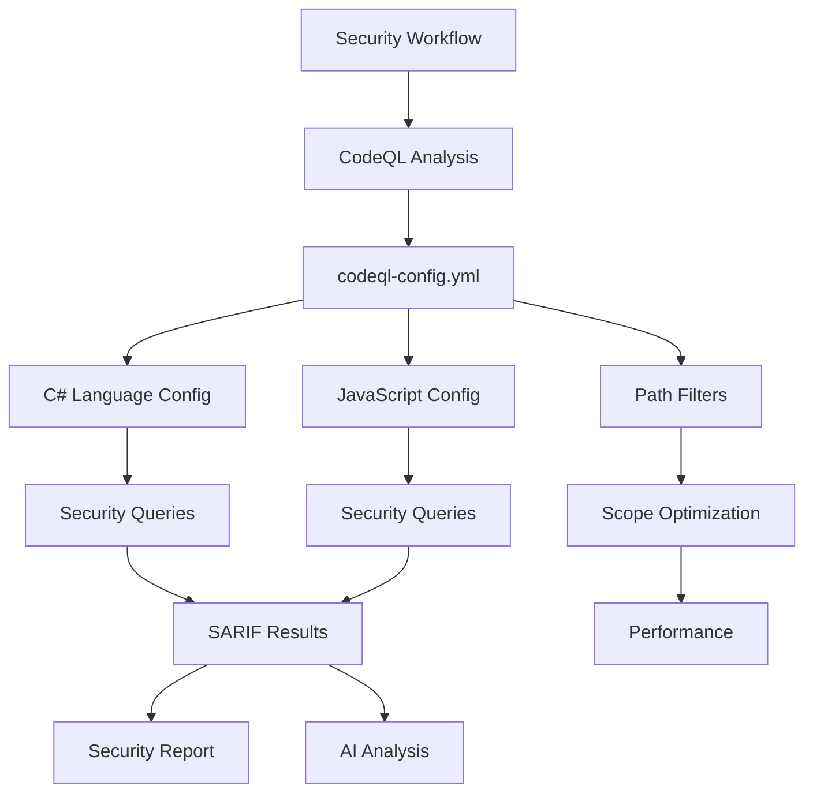

# Module/Directory: .github/codeql

**Last Updated:** 2025-07-28

**Parent:** [`.github`](../README.md)

## 1. Purpose & Responsibility

* **What it is:** CodeQL static analysis security scanning configuration directory that defines comprehensive security analysis rules and settings for multi-language code analysis.
* **Key Responsibilities:** 
    * Configuration of CodeQL security analysis for C# and JavaScript/TypeScript
    * Definition of security query suites for comprehensive vulnerability detection
    * Path filtering configuration to optimize scan scope and performance
    * Integration settings for CI/CD pipeline security workflow
    * Custom query configuration for project-specific security requirements
* **Why it exists:** To provide centralized, version-controlled configuration for CodeQL security scanning that ensures consistent, comprehensive vulnerability detection across all supported languages in the codebase.

## 2. Architecture & Key Concepts

* **High-Level Design:** CodeQL configuration following GitHub's security scanning best practices:
    * **`codeql-config.yml`** - Main configuration file defining languages, queries, and paths
    * **Query Suite Selection** - Security-focused query suites for maximum vulnerability coverage
    * **Path Configuration** - Optimized path inclusion/exclusion for relevant code analysis
    * **Language Matrix** - Multi-language support for C# backend and JavaScript/TypeScript frontend
* **Core Security Coverage:**
    * **C# Analysis** - ASP.NET security vulnerabilities, injection attacks, authentication flaws
    * **JavaScript/TypeScript Analysis** - XSS vulnerabilities, prototype pollution, dependency issues
    * **Cross-Language Issues** - Configuration vulnerabilities, secrets detection, access control
* **Integration Architecture:**
    ```
    Security Workflow → CodeQL Action → codeql-config.yml → Query Execution → SARIF Results → Security Analysis
    ```



## 3. Interface Contract & Assumptions

* **Key Public Interfaces (for security workflow integration):**
    * **`codeql-config.yml`**:
        * **Purpose:** Configure CodeQL analysis behavior, languages, queries, and scope
        * **Critical Preconditions:** Valid YAML syntax, supported language configurations, accessible query suites
        * **Critical Postconditions:** CodeQL analysis configured correctly, appropriate queries selected, optimized path scanning
        * **Non-Obvious Error Handling:** Invalid configuration causes CodeQL to fall back to default analysis with warnings
    * **Query Suite Integration**:
        * **Purpose:** Define comprehensive security query coverage for vulnerability detection
        * **Critical Preconditions:** Query suites exist and are compatible with CodeQL version
        * **Critical Postconditions:** Security queries executed against codebase, results in SARIF format
        * **Non-Obvious Error Handling:** Missing queries log warnings but continue with available query set
    * **Path Filtering**:
        * **Purpose:** Optimize analysis scope by including relevant code and excluding generated/third-party code
        * **Critical Preconditions:** Path patterns valid and match actual repository structure
        * **Critical Postconditions:** Analysis focused on relevant codebase areas, improved performance
        * **Non-Obvious Error Handling:** Invalid path patterns logged but don't fail the analysis
* **Critical Assumptions:**
    * **CodeQL Version Compatibility:** Configuration compatible with GitHub's CodeQL action version
    * **Language Support:** Configured languages actually present in repository
    * **Query Availability:** Required query suites available in CodeQL query packs
    * **Path Stability:** Repository structure remains consistent with path filter patterns

## 4. Local Conventions & Constraints (Beyond Global Standards)

* **Configuration Standards:**
    * YAML format following CodeQL configuration schema
    * Language specification uses official CodeQL language identifiers
    * Query suites selected for maximum security coverage
    * Path patterns use glob syntax for flexibility
* **Security Query Selection:**
    * `security-extended` query suite for comprehensive vulnerability detection
    * `security-and-quality` query suite for additional code quality checks
    * Custom queries for project-specific security requirements
    * Regular updates to query suites for latest vulnerability patterns
* **Path Optimization:**
    * Include all source code directories (`Code/**`)
    * Exclude generated code (`**/bin/**`, `**/obj/**`, `**/node_modules/**`)
    * Exclude third-party code and build artifacts
    * Include configuration files for security analysis
* **Performance Considerations:**
    * Path filtering reduces analysis time significantly
    * Query suite selection balances coverage with execution time
    * Incremental analysis supported for pull request scanning
    * Matrix strategy enables parallel language analysis

## 5. How to Work With This Code

* **Setup:**
    * No local setup required - CodeQL runs in GitHub Actions environment
    * For testing: CodeQL CLI can be installed for local analysis
    * For development: Modify `codeql-config.yml` and test through workflow execution
    * For validation: Use YAML linter to verify configuration syntax
* **Testing:**
    * **Location:** Configuration tested through security workflow execution
    * **How to Run:** Trigger security workflow or push to main branch for automatic scanning
    * **Testing Strategy:** Verify query execution, path filtering effectiveness, and result accuracy
* **Common Usage Patterns:**
    ```yaml
    # Language configuration
    queries:
      - uses: security-extended
      - uses: security-and-quality
    
    # Path filtering
    paths:
      - 'Code/**'
      - '.github/**'
    paths-ignore:
      - '**/bin/**'
      - '**/node_modules/**'
      - '**/test-results/**'
    ```
* **Common Pitfalls / Gotchas:**
    * Path patterns are case-sensitive and must match actual repository structure
    * Query suite names must match exactly with available CodeQL query packs
    * Language detection depends on file extensions and content analysis
    * Large repositories may require additional path filtering for performance

## 6. Dependencies

* **Internal Code Dependencies:**
    * [`build.yml`](../workflows/build.yml) - Consolidated workflow that runs security scanning
    * [`Scripts/Pipeline/run-security-scans.sh`](../../Scripts/Pipeline/README.md) - Security scanning script
    * [`Code/Zarichney.Server/`](../../Code/Zarichney.Server/README.md) - C# codebase analyzed by CodeQL
    * [`Code/Zarichney.Website/`](../../Code/Zarichney.Website/README.md) - JavaScript/TypeScript codebase analyzed
* **External Service Dependencies:**
    * `GitHub CodeQL Service` - Cloud-based static analysis engine
    * `CodeQL Query Packs` - Security query definitions and rules
    * `GitHub Security Dashboard` - Results visualization and management
* **Dependents (Impact of Changes):**
    * [Security Scanning Jobs] - Configuration changes affect security scanning behavior
    * [Claude AI Security Analysis] - CodeQL results feed into AI-powered security assessment
    * [Deployment Gates] - Security findings influence deployment decisions

## 7. Rationale & Key Historical Context

* **Comprehensive Security Coverage:** Configuration includes both security-extended and security-and-quality query suites for maximum vulnerability detection
* **Multi-Language Support:** Covers both backend (C#) and frontend (JavaScript/TypeScript) security concerns
* **Performance Optimization:** Path filtering significantly reduces analysis time while maintaining comprehensive coverage
* **CI/CD Integration:** Configuration designed to work seamlessly with automated security workflows
* **Incremental Analysis:** Supports both full repository scans and pull request differential analysis

## 8. Known Issues & TODOs

* **Custom Query Development:** Project-specific security queries could enhance detection capabilities
* **Query Suite Updates:** Automated tracking of new query suite releases for enhanced security coverage
* **Configuration Validation:** Automated validation of CodeQL configuration syntax and compatibility
* **Performance Monitoring:** Metrics collection for analysis execution time and resource usage
* **Result Correlation:** Enhanced correlation between CodeQL findings and other security scan results

---