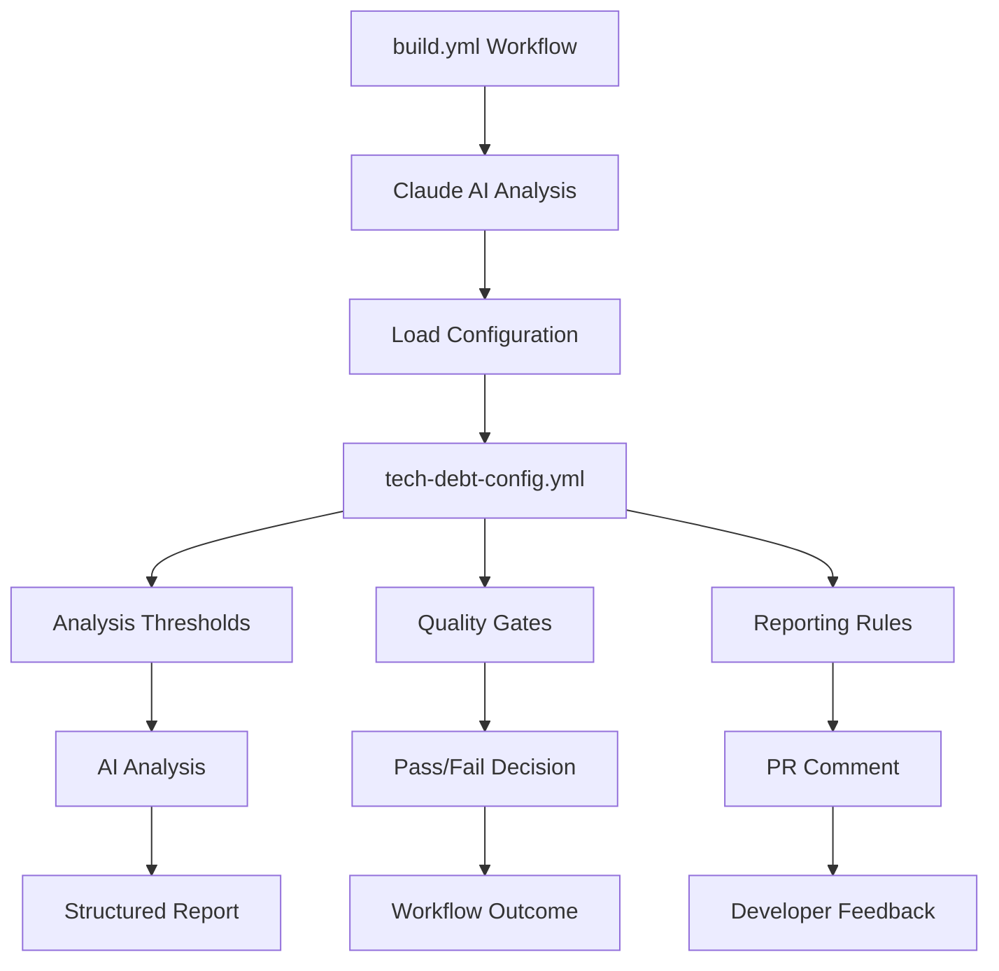

# Module/Directory: .github/config

**Last Updated:** 2025-07-28

**Parent:** [`.github`](../README.md)

## 1. Purpose & Responsibility

* **What it is:** Configuration directory containing YAML configuration files that define quality gates, analysis parameters, and automation behavior for the CI/CD pipeline.
* **Key Responsibilities:** 
    * Tech debt analysis configuration including thresholds and quality gates
    * Quality assessment parameters for automated analysis
    * Analysis tool configuration for consistent behavior
    * Threshold management for compliance scanning
    * Automation behavior configuration for workflow decisions
* **Why it exists:** To centralize configuration management for analysis tools, enabling easy adjustment of quality gates and analysis parameters without modifying workflow files.

## 2. Architecture & Key Concepts

* **High-Level Design:** Configuration files organized by analysis type:
    * **`tech-debt-config.yml`** - Technical debt analysis parameters and thresholds
    * **Quality Gate Definitions** - Thresholds for various quality metrics
    * **Analysis Tool Settings** - Configuration for AI-powered analysis
* **Core Configuration Categories:**
    * **Quality Thresholds** - Numeric limits for debt scores, complexity, coverage
    * **Analysis Behavior** - How tools should process and report findings
    * **Issue Creation Rules** - When and how to flag issues for follow-up
    * **Workflow Integration** - How configuration affects analysis outcomes
* **Configuration Usage Pattern:**
    ```
    Workflow → Claude AI Analysis → Configuration File → Analysis Parameters → Quality Assessment
    ```



## 3. Interface Contract & Assumptions

* **Key Public Interfaces (for configuration consumption):**
    * **`tech-debt-config.yml`**:
        * **Purpose:** Define technical debt analysis behavior, thresholds, and quality gates
        * **Critical Preconditions:** Valid YAML syntax, numeric thresholds within reasonable ranges
        * **Critical Postconditions:** Analysis tools configured with consistent parameters
        * **Non-Obvious Error Handling:** Invalid configuration may be ignored by Claude AI with defaults applied
    * **Configuration Loading**:
        * **Purpose:** Provide consistent configuration access for Claude AI analysis
        * **Critical Preconditions:** Configuration files exist and are valid
        * **Critical Postconditions:** Configuration available for analysis context
        * **Non-Obvious Error Handling:** Missing configuration doesn't fail analysis
* **Critical Assumptions:**
    * File available in repository during workflow execution
    * YAML maintains valid syntax
    * Thresholds set to achievable values
    * Claude AI can access and interpret configuration

## 4. Local Conventions & Constraints (Beyond Global Standards)

* **Configuration Format:**
    * YAML preferred for human-readable configuration
    * Numeric thresholds use integer values
    * Boolean flags use explicit true/false
    * Comments explain business rationale
* **File Organization:**
    * One configuration file per major analysis type
    * Descriptive filenames following `{purpose}-config.yml` pattern
    * Version comments in file headers
    * Related configurations grouped logically
* **Parameter Conventions:**
    * Threshold values use intuitive scales (0-100 for percentages)
    * Default values documented in comments
    * Parameter names use snake_case
    * Clear descriptions for each parameter
* **Quality Gate Standards:**
    * Critical thresholds for blocking issues
    * Warning thresholds for improvement areas
    * Info thresholds for awareness
    * Regular review and adjustment based on project maturity

## 5. How to Work With This Code

* **Setup:**
    * No special setup required - configuration files are text-based
    * For validation: Use YAML linters to verify syntax
    * For testing: Modify thresholds and observe Claude AI behavior
* **Testing:**
    * **Location:** Configuration tested through workflow execution
    * **How to Run:** Modify values and trigger analysis workflows
    * **Testing Strategy:** Validate Claude AI uses configuration appropriately
* **Common Usage Patterns:**
    ```yaml
    # Adjusting tech debt thresholds
    complexity:
      method_max_cyclomatic: 10
      class_max_lines: 500
      
    # Configuring issue severity
    issue_creation:
      auto_create_threshold: "medium"
      max_issues_per_pr: 5
      
    # Setting quality gates
    quality_gates:
      critical_threshold: 20
      deployment_threshold: 50
    ```
* **Common Pitfalls / Gotchas:**
    * YAML syntax sensitive to indentation
    * Changes affect all subsequent analyses
    * Claude AI may not use all configuration values
    * Extreme thresholds can make analysis unhelpful

## 6. Dependencies

* **Internal Code Dependencies:**
    * [`build.yml`](../workflows/build.yml) - Workflow that runs Claude AI analysis
    * Claude AI analysis jobs consume configuration for context
* **External Tool Dependencies:**
    * `YAML Parser` - For parsing configuration files
    * `Claude AI` - Interprets configuration for analysis
* **Dependents (Impact of Changes):**
    * [Claude AI Tech Debt Analysis] - Uses thresholds for assessment
    * [Quality Analysis Jobs] - Configuration affects all quality assessments
    * [PR Feedback] - Thresholds influence what gets reported

## 7. Rationale & Key Historical Context

* **Centralized Configuration:** Moving configuration out of workflow files enables adjustment without code changes
* **Threshold Management:** Explicit threshold configuration allows fine-tuning as project evolves
* **Analysis Consistency:** Shared configuration ensures consistent behavior across analyses
* **Version Control Benefits:** Configuration changes tracked in git
* **AI Context:** Configuration provides Claude AI with project-specific quality expectations

## 8. Known Issues & TODOs

* **Configuration Usage:** Verify Claude AI actually uses all configuration values
* **Validation Tools:** Automated validation of configuration syntax
* **Dynamic Thresholds:** Support for branch-specific thresholds
* **Documentation Generation:** Auto-document available configuration options
* **Threshold Optimization:** Data-driven threshold recommendations

---