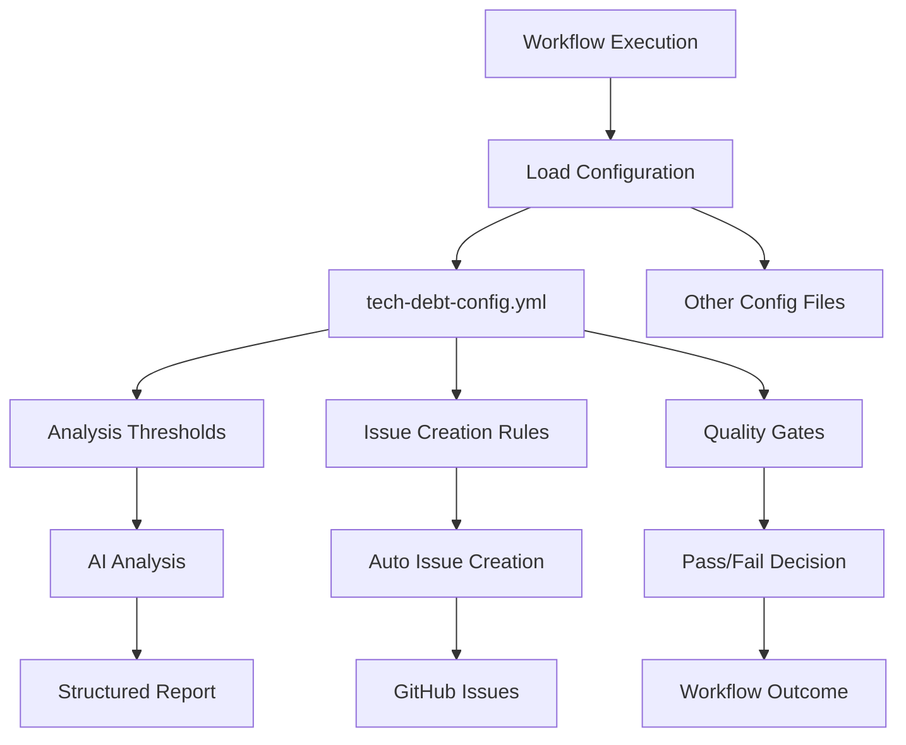

# Module/Directory: .github/config

**Last Updated:** 2025-07-27

**Parent:** [`.github`](../README.md)

## 1. Purpose & Responsibility

* **What it is:** Configuration directory containing YAML/JSON configuration files that define quality gates, analysis parameters, and automation behavior for the CI/CD pipeline.
* **Key Responsibilities:** 
    * Tech debt analysis configuration including thresholds and quality gates
    * Quality assessment parameters for automated analysis
    * Analysis tool configuration for consistent behavior
    * Threshold management for security and compliance scanning
    * Automation behavior configuration for issue creation and workflow decisions
* **Why it exists:** To centralize configuration management for analysis tools, enabling easy adjustment of quality gates and analysis parameters without modifying workflow files or action code.

## 2. Architecture & Key Concepts

* **High-Level Design:** Configuration files organized by analysis type and tool:
    * **`tech-debt-config.yml`** - Technical debt analysis parameters and thresholds
    * **Quality Gate Definitions** - Thresholds for various quality metrics
    * **Analysis Tool Settings** - Configuration for AI-powered analysis tools
* **Core Configuration Categories:**
    * **Quality Thresholds** - Numeric limits for debt scores, complexity, coverage
    * **Analysis Behavior** - How tools should process and report findings
    * **Issue Creation Rules** - When and how to create automated issues
    * **Workflow Integration** - How configuration affects workflow decisions
* **Configuration Usage Pattern:**
    ```
    Workflow → Custom Action → Configuration File → Analysis Logic → Quality Gate Decision
    ```



## 3. Interface Contract & Assumptions

* **Key Public Interfaces (for configuration consumption):**
    * **`tech-debt-config.yml`**:
        * **Purpose:** Define technical debt analysis behavior, thresholds, and quality gates
        * **Critical Preconditions:** Valid YAML syntax, numeric thresholds within reasonable ranges
        * **Critical Postconditions:** Analysis tools configured with consistent parameters, quality gates enforced
        * **Non-Obvious Error Handling:** Invalid configuration causes analysis to fall back to default values with warnings
    * **Configuration Loading**:
        * **Purpose:** Provide consistent configuration access across all analysis actions
        * **Critical Preconditions:** Configuration files exist and are valid, proper file permissions
        * **Critical Postconditions:** Configuration loaded and validated, defaults applied where needed
        * **Non-Obvious Error Handling:** Missing configuration files trigger default behavior with notifications
* **Critical Assumptions:**
    * **File Availability:** Configuration files available in repository during workflow execution
    * **YAML Validity:** Configuration files maintain valid YAML/JSON syntax
    * **Threshold Reasonableness:** Numeric thresholds set to achievable and meaningful values
    * **Version Compatibility:** Configuration format remains compatible with analysis tools

## 4. Local Conventions & Constraints (Beyond Global Standards)

* **Configuration Format:**
    * YAML preferred for human-readable configuration with comments
    * JSON used for structured data exchange with analysis tools
    * Numeric thresholds use integer values for simplicity
    * Boolean flags use explicit true/false values
* **File Organization:**
    * One configuration file per major analysis type
    * Descriptive filenames following `{tool}-config.{yml|json}` pattern
    * Version comments included in file headers
    * Related configurations grouped logically within files
* **Parameter Conventions:**
    * Threshold values use intuitive scales (0-100 for percentages, absolute numbers for counts)
    * Default values provided for all optional parameters
    * Parameter names use snake_case for consistency
    * Comments explain business rationale for threshold choices
* **Quality Gate Standards:**
    * Critical thresholds block deployment/merge
    * Warning thresholds create issues for follow-up
    * Info thresholds provide guidance without enforcement
    * Thresholds regularly reviewed and adjusted based on project evolution

## 5. How to Work With This Code

* **Setup:**
    * No special setup required - configuration files are text-based
    * For validation: Use YAML/JSON linters to verify syntax
    * For testing: Modify thresholds and observe workflow behavior
    * For development: Standard text editor with YAML syntax highlighting
* **Testing:**
    * **Location:** Configuration tested through workflow execution with different scenarios
    * **How to Run:** Modify configuration values and trigger analysis workflows
    * **Testing Strategy:** Validate configuration loading, threshold enforcement, and quality gate behavior
* **Common Usage Patterns:**
    ```yaml
    # Adjusting tech debt thresholds
    complexity:
      method_max_cyclomatic: 10
      class_max_lines: 500
      
    # Configuring issue creation
    issue_creation:
      auto_create_threshold: "medium"
      max_issues_per_pr: 5
      
    # Setting quality gates
    quality_gates:
      critical_threshold: 20
      deployment_threshold: 50
    ```
* **Common Pitfalls / Gotchas:**
    * YAML syntax is sensitive to indentation and special characters
    * Threshold changes affect all subsequent analysis runs
    * Some configuration changes may require workflow restart
    * Invalid thresholds can cause analysis failures

## 6. Dependencies

* **Internal Code Dependencies:**
    * [`.github/actions/analyze-tech-debt`](../actions/README.md) - Consumes tech-debt-config.yml
    * [`.github/actions/check-standards`](../actions/README.md) - Uses quality threshold configurations
    * [`.github/workflows/02-quality.yml`](../workflows/README.md) - Quality workflow uses configuration for decisions
* **External Tool Dependencies:**
    * `YAML Parser` - For parsing configuration files in workflows and actions
    * `JSON Parser` - For structured data exchange with analysis tools
* **Dependents (Impact of Changes):**
    * [Quality Analysis Workflows] - Configuration changes affect all quality analysis outcomes
    * [Automated Issue Creation] - Threshold modifications change issue creation behavior
    * [Deployment Decisions] - Quality gate thresholds directly impact deployment approvals

## 7. Rationale & Key Historical Context

* **Centralized Configuration:** Moving configuration out of workflow files enables adjustment without code changes
* **Threshold Management:** Explicit threshold configuration allows fine-tuning of quality gates as project matures
* **Analysis Consistency:** Shared configuration ensures consistent behavior across all analysis tools
* **Version Control Benefits:** Configuration changes tracked in git with proper review process
* **Flexibility Design:** Configuration structure supports evolution of analysis tools and requirements

## 8. Known Issues & TODOs

* **Configuration Validation:** Automated validation of configuration syntax and value ranges needed
* **Dynamic Thresholds:** Support for environment-specific or branch-specific thresholds
* **Configuration Documentation:** Auto-generated documentation from configuration schemas
* **Threshold Optimization:** Data-driven approach to optimal threshold setting based on project metrics
* **Configuration Templates:** Template configurations for different project types or phases

---