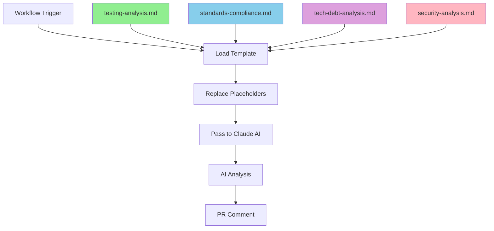

# Module/Directory: .github/prompts

**Last Updated:** 2025-08-04

**Parent:** [`.github`](../README.md)

## 1. Purpose & Responsibility

* **What it is:** Template-based prompt management system for Claude AI analysis workflows, providing centralized, maintainable prompt definitions with dynamic context injection.
* **Key Responsibilities:** 
    * Store reusable Claude AI analysis prompt templates for testing, standards, tech debt, and security analysis
    * Provide consistent placeholder-based dynamic context injection across all AI workflows
    * Enable version-controlled prompt evolution and maintenance separate from workflow logic
    * Support template validation and reuse across multiple workflows or analysis contexts
* **Why it exists:** To separate static prompt content from dynamic workflow logic, improving maintainability, enabling prompt versioning, and providing a single source of truth for AI analysis instructions. This refactoring supports the DevOps infrastructure consolidation by making prompts more manageable and workflows cleaner.

## 2. Architecture & Key Concepts

* **High-Level Design:** Template-based system with placeholder substitution pattern:
    * **Markdown Templates** contain static analysis instructions with `{{PLACEHOLDER}}` markers
    * **Workflow Steps** load templates and perform string replacement with actual values
    * **Consistent Interface** ensures all Claude AI jobs follow the same loading pattern
* **Template Structure:** Each prompt follows a consistent format:
    * Header with dynamic PR information
    * Mission statement and analysis focus
    * Specific analysis criteria and data sources
    * Standardized output format requirements
* **Placeholder System:** Standardized placeholders for dynamic context:
    * `{{PR_NUMBER}}` - Pull request number
    * `{{PR_AUTHOR}}` - Pull request author login
    * `{{ISSUE_REF}}` - Associated issue reference
    * `{{SOURCE_BRANCH}}` - Source branch name
    * `{{TARGET_BRANCH}}` - Target branch name
* **Integration Pattern:** Workflows load and process templates using bash string replacement:
    ```bash
    PROMPT_TEMPLATE=$(cat .github/prompts/template-name.md)
    PROMPT="${PROMPT_TEMPLATE//\{\{PLACEHOLDER\}\}/actual_value}"
    ```



## 3. Interface Contract & Assumptions

* **Key Public Interfaces:**
    * **Template Files**:
        * **Purpose:** Provide reusable, version-controlled prompt templates with placeholder injection
        * **Critical Preconditions:** Valid markdown format, consistent placeholder syntax `{{NAME}}`
        * **Critical Postconditions:** Templates load successfully, placeholders replaceable via string substitution
        * **Non-Obvious Error Handling:** Missing placeholders result in literal `{{PLACEHOLDER}}` in final prompt
    * **Placeholder System**:
        * **Purpose:** Enable dynamic context injection while maintaining static template content
        * **Critical Preconditions:** Placeholders must use double brace format: `{{PLACEHOLDER_NAME}}`
        * **Critical Postconditions:** All placeholders replaced with actual values before passing to Claude AI
        * **Non-Obvious Error Handling:** Unreplaced placeholders appear literally in AI prompts
* **Critical Assumptions:**
    * **Template Availability:** All referenced template files exist and are readable
    * **Placeholder Consistency:** Workflows provide values for all placeholders used in templates
    * **String Replacement:** Bash string replacement handles all placeholder patterns correctly
    * **Template Stability:** Template structure remains consistent for workflow compatibility

## 4. Local Conventions & Constraints (Beyond Global Standards)

* **File Naming:**
    * Templates use kebab-case naming: `analysis-type.md`
    * Names match the corresponding workflow job function
    * Extensions always `.md` for markdown formatting and readability
* **Placeholder Format:**
    * Always use double braces: `{{PLACEHOLDER_NAME}}`
    * Placeholder names use UPPER_SNAKE_CASE convention
    * Standard placeholders documented and reused across templates
* **Template Structure:**
    * All templates follow consistent section structure
    * Header with PR context using standard placeholders
    * Mission statement explaining analysis purpose
    * Analysis focus with specific criteria
    * Output format requirements with emoji sections
* **Integration Requirements:**
    * Templates must be loadable via `cat` command
    * Placeholders must be replaceable via bash string substitution
    * Final processed prompts must be valid for Claude AI action input

## 5. How to Work With This Code

* **Setup:**
    * No special setup required - templates are static markdown files
    * Templates automatically loaded by workflow steps during execution
    * Version control handles template management and change tracking
* **Testing:**
    * **Location:** Templates tested through actual workflow execution
    * **How to Test:** Create PR to trigger workflows that use the templates
    * **Validation:** Verify AI analysis produces expected output format and quality
    * **Local Testing:** Use bash string replacement to test placeholder substitution:
        ```bash
        # Test template loading and placeholder replacement
        TEMPLATE=$(cat .github/prompts/testing-analysis.md)
        TEST_PROMPT="${TEMPLATE//\{\{PR_NUMBER\}\}/123}"
        echo "$TEST_PROMPT" | head -10
        ```
* **Common Usage Patterns:**
    ```bash
    # Load template in workflow
    PROMPT_TEMPLATE=$(cat .github/prompts/template-name.md)
    
    # Replace all standard placeholders
    PROMPT="${PROMPT_TEMPLATE//\{\{PR_NUMBER\}\}/${{ github.event.number }}}"
    PROMPT="${PROMPT//\{\{PR_AUTHOR\}\}/${{ github.event.pull_request.user.login }}}"
    # ... etc for all placeholders
    
    # Output for Claude AI action
    echo "prompt<<EOF" >> $GITHUB_OUTPUT
    echo "$PROMPT" >> $GITHUB_OUTPUT
    echo "EOF" >> $GITHUB_OUTPUT
    ```
* **Prompt Template Files:**
    * `testing-analysis.md` - Testing coverage and quality analysis
    * `standards-compliance.md` - Code standards and formatting compliance
    * `tech-debt-analysis.md` - Technical debt assessment and recommendations
    * `security-analysis.md` - Security vulnerability analysis and deployment decisions
* **Common Pitfalls / Gotchas:**
    * Placeholder syntax must exactly match `{{NAME}}` - extra spaces break replacement
    * Missing placeholders result in literal text in final prompts
    * Template changes affect all workflows that use them
    * Bash string replacement is case-sensitive for placeholder names

## 6. Dependencies

* **Internal Code Dependencies:**
    * [`.github/workflows/`](../workflows/README.md) - Workflows that load and use these templates
    * No dependencies on other internal modules - templates are standalone
* **External Service Dependencies:**
    * No external dependencies - templates are static files
    * Templates designed for consumption by `grll/claude-code-action@beta`
* **Consumers (Impact of Changes):**
    * [`.github/workflows/build.yml`](../workflows/build.yml) - Consolidated workflow using all 4 templates
    * Any future workflows requiring Claude AI analysis with consistent prompting
    * Template changes immediately affect all consuming workflows

## 7. Rationale & Key Historical Context

* **Refactoring Decision:** Extracted inline prompts from `build.yml` to separate files for maintainability and version control visibility
* **Template System:** Chose placeholder-based approach over complex parameter passing for simplicity and bash compatibility
* **Centralized Location:** Placed in `.github/prompts/` to keep infrastructure-related files organized within GitHub directory
* **Markdown Format:** Selected markdown for readability, version control diffs, and AI prompt formatting compatibility
* **Standard Placeholders:** Established consistent placeholder naming to enable reuse and reduce workflow complexity

## 8. Known Issues & TODOs

* **Template Validation:** No automated validation of placeholder syntax or template structure
* **Placeholder Documentation:** Could benefit from centralized placeholder registry or validation
* **Template Testing:** Limited ability to test templates in isolation from full workflow execution
* **Cross-Template Consistency:** No enforcement of consistent section structure across templates
* **Version Management:** Template versioning strategy could be enhanced for compatibility management

---