# Module/Directory: AI-Powered Code Review System

**Last Updated:** 2025-08-04

**Parent:** [`.github`](../README.md)

## 1. Purpose & Responsibility

* **What it is:** Sophisticated AI-powered code review system featuring four specialized AI agents that provide comprehensive analysis of pull requests using advanced prompt engineering techniques.
* **Key Responsibilities:** 
    * **Technical Debt Analysis**: Identify and categorize debt across architecture, code, testing, and documentation
    * **Standards Compliance**: Enforce coding standards, SOLID principles, and project-specific conventions
    * **Test Quality Assessment**: Analyze test coverage, patterns, and quality impact
    * **Security Analysis**: Assess vulnerabilities, threats, and deployment security decisions
    * **AI Coder Education**: Reinforce sustainable development patterns for AI-assisted codebases
* **Why it exists:** To provide contextual, comprehensive code review that goes beyond traditional linting by understanding project intent, architectural patterns, and long-term maintainability. This AI-first approach eliminates crude programmatic checks in favor of intelligent, educational analysis.

## 2. Architecture & Key Concepts

### **The Four AI Sentinels**
* **🔍 DebtSentinel** (`tech-debt-analysis.md`, ~270 lines): Technical debt analysis with GitHub label strategic context and epic-aware prioritization
* **🛡️ StandardsGuardian** (`standards-compliance.md`, ~350 lines): Standards compliance with component-specific analysis and epic alignment
* **🧪 TestMaster** (`testing-analysis.md`, ~370 lines): Test quality assessment with coverage phase intelligence and progressive testing strategy
* **🔒 SecuritySentinel** (`security-analysis.md`, ~370 lines): Security vulnerability assessment with automation context awareness and component-specific threat modeling

### **Advanced Prompt Engineering Features**
Based on academic research in AI-driven technical debt analysis:
* **Expert Personas**: Principal-level expertise (15-20+ years) with AI coder mentorship specialization
* **Context Ingestion**: Comprehensive project documentation analysis before evaluation
* **Chain-of-Thought Analysis**: 5-6 step structured reasoning processes with evidence-based conclusions
* **Project-Specific Taxonomies**: Tailored to .NET 8/Angular 19 tech stack and monorepo architecture
* **Decision Matrices**: Objective prioritization frameworks (Critical/High/Medium/Low/Celebrate)
* **Educational Focus**: AI coder learning reinforcement and sustainable development patterns

### **GitHub Label Integration**
All four AI agents now leverage GitHub issue labels for enhanced contextual analysis:
* **Epic-Aware Analysis**: `epic:testing-coverage-to-90`, `epic:performance-optimization` labels provide long-term strategic context for prioritization and alignment
* **Component-Specific Intelligence**: `component:backend-api`, `component:frontend-ui`, `component:database`, `component:security` labels enable targeted analysis with component-specific standards and threat models
* **Coverage Phase Intelligence**: `coverage:phase-1` through `coverage:phase-6` labels inform progressive testing strategy and phase-appropriate expectations  
* **Automation Context Awareness**: `automation:ci-environment`, `automation:github-actions` labels help security analysis understand execution context
* **Strategic Prioritization**: `priority:critical`, `priority:high`, `quality:performance`, `quality:maintainability` labels adjust analysis rigor and deployment decision thresholds

### **Technical Implementation**
* **Template System**: Markdown prompts with `{{PLACEHOLDER}}` dynamic context injection
* **Workflow Integration**: GitHub Actions jobs load templates and perform string replacement
* **Branch-Aware Activation**: 
  - Feature branches: Build + Test only
  - Develop PRs: Testing + Standards + Tech Debt analysis
  - Main PRs: Full analysis including Security assessment
* **Quality Gates**: Critical findings can block deployment with specific remediation guidance



```mermaid
graph TD
    A[PR Created] --> B{Target Branch?}
    B -->|Feature| C[Build + Test Only]
    B -->|Develop| D[Build + Test + Quality Analysis]
    B -->|Main| E[Build + Test + Quality + Security]

    D --> F[🧪 TestMaster]
    D --> G[🛡️ StandardsGuardian]
    D --> H[🔍 DebtSentinel]

    E --> F
    E --> G
    E --> H
    E --> I[🔒 SecuritySentinel]

    F --> J[Context Ingestion]
    G --> J
    H --> J
    I --> J

    J --> J1[GitHub Label Context]
    J1 --> J2[Epic Labels: strategic context]
    J1 --> J3[Component Labels: targeted analysis]
    J1 --> J4[Coverage Phase Labels: progressive strategy]
    J1 --> J5[Priority Labels: analysis rigor]

    J2 --> K[Chain-of-Thought Analysis]
    J3 --> K
    J4 --> K
    J5 --> K

    K --> L[Decision Matrix]
    L --> M[GitHub PR Comments]
    L --> N[Quality Gates]

    N -->|Critical Issues| O[Block Merge]
    N -->|Clean| P[Allow Merge]

    style F fill:#90EE90
    style G fill:#87CEEB
    style H fill:#DDA0DD
    style I fill:#FFB6C1
    style J1 fill:#FFD700
    style O fill:#FF6B6B
    style P fill:#51CF66
```

## 3. Interface Contract & Assumptions

### **AI Analysis Input Requirements**
* **Git Context**: PR number, author, source/target branches, linked issues, git diff with file changes
* **GitHub Label Context**: Issue labels providing strategic, component, and priority context for targeted analysis
* **Project Documentation**: Access to `CLAUDE.md`, `/Docs/Standards/`, module `README.md` files
* **Build Artifacts**: Test results, coverage reports, security scan results (when available)
* **Branch Context**: Target branch determines analysis depth and security requirements

### **AI Analysis Output Guarantees**
* **Standardized Format**: GitHub markdown comments with consistent structure and emoji indicators
* **Specific References**: File:line locations with actionable remediation steps
* **Objective Prioritization**: Critical/High/Medium/Low categorization with clear justification
* **Educational Value**: AI coder learning insights and pattern reinforcement
* **Deployment Decisions**: Clear recommendations for merge/block with security assessment

### **Quality Gate Contracts**
* **Critical Issues**: Automatically block merge until resolved (security vulnerabilities, breaking standards violations)
* **High Priority**: Must be addressed in current PR or immediate follow-up with tracking
* **Medium/Low Priority**: Tracked for future improvement with backlog integration
* **Celebration**: Positive reinforcement for excellent patterns and debt reduction wins

### **Context Ingestion Requirements**
Each AI agent MUST perform comprehensive context analysis before evaluation:
1. Read project documentation (`CLAUDE.md`, standards documents, module READMEs)
2. Understand established patterns and architectural decisions
3. Synthesize project-specific rules and quality gates
4. Apply evidence-based analysis using established frameworks
5. Generate educational feedback aligned with project standards

## 4. Advanced Prompt Engineering Standards

### **Research Foundation**
Based on `/Docs/Research/Tech_Debt_Analysis_Prompt_Research.md` - academic research in AI-driven technical debt analysis:
* **Persona Principle**: Expert role assignment frames AI's analytical perspective and priorities
* **Context Ingestion**: Project-specific knowledge transforms generic analysis into relevant, actionable feedback
* **Chain-of-Thought Reasoning**: Multi-step analytical process ensures evidence-based conclusions
* **Structured Output**: Consistent markdown formatting enables downstream automation and human consumption

### **Prompt Architecture Standards**
Each AI agent follows consistent structural patterns:
* **`<persona>`**: Expert identity (Principal + AI Coder Mentor) with specific domain expertise and educational tone
* **`<context_ingestion>`**: Critical first step requiring comprehensive project documentation analysis
* **`<analysis_instructions>`**: 5-6 step chain-of-thought reasoning with specific taxonomies and decision matrices
* **`<output_format>`**: Standardized GitHub comment format with categorized findings and actionable recommendations

### **Quality Standards**
* **Prompt Length**: 240-350 lines for comprehensive coverage without context window strain
* **Educational Focus**: Every analysis must include AI coder learning insights and pattern reinforcement
* **Objectivity**: Evidence-based conclusions using established decision matrices and priority frameworks
* **Actionability**: Specific file:line references with clear remediation steps and reasoning
* **Project Alignment**: Deep integration with established standards, patterns, and architectural decisions

## 5. How to Work With This Code

### **Automatic Operation**
* **No Manual Setup**: AI analysis triggers automatically on PR creation targeting `develop` or `main` branches
* **Branch-Aware Logic**: System intelligently selects appropriate analysis depth based on PR target
* **Parallel Execution**: All applicable AI agents run simultaneously for optimal performance
* **GitHub Integration**: Results appear as comprehensive comments on PR conversations

### **Understanding AI Analysis Output**
Each AI agent provides structured analysis with consistent formatting:
* **Executive Summary**: Overall assessment with clear metrics and quality indicators
* **Categorized Findings**: Critical/High/Medium/Low priority issues with specific file:line references
* **Educational Insights**: AI coder learning patterns and reinforcement guidance
* **Actionable Recommendations**: Specific steps for remediation with reasoning and examples

### **Working with AI Feedback**
* **Critical Issues**: Must be resolved before merge - these block deployment
* **High Priority**: Address in current PR or create immediate follow-up issues
* **Medium/Low Priority**: Add to backlog for future improvement sprints
* **Celebration Sections**: Positive reinforcement for excellent patterns to replicate

### **Prompt Evolution and Customization**
When modifying AI analysis capabilities:
```bash
# Test prompt structure locally
TEMPLATE=$(cat .github/prompts/tech-debt-analysis.md)
echo "Prompt length: $(echo "$TEMPLATE" | wc -l) lines"
echo "Has persona section: $(echo "$TEMPLATE" | grep -c '<persona>')"
echo "Has context ingestion: $(echo "$TEMPLATE" | grep -c '<context_ingestion>')"

# Validate placeholder usage
echo "Standard placeholders used:"
grep -o '{{[^}]*}}' .github/prompts/*.md | sort -u
```

### **Integration Testing**
* **End-to-End Validation**: Create test PRs targeting different branches to verify analysis depth
* **Quality Assessment**: Review AI output for accuracy, actionability, and educational value
* **Performance Monitoring**: Ensure analysis completes within timeout constraints (30 minutes per agent)

## 6. Dependencies & Integration

### **Core Dependencies**
* **Project Documentation**: `/Docs/Standards/` - Standards that inform AI analysis criteria
* **Research Foundation**: `/Docs/Research/Tech_Debt_Analysis_Prompt_Research.md` - Academic foundation for prompt engineering
* **Workflow Integration**: `.github/workflows/build.yml` - CI/CD pipeline that executes AI analysis
* **Claude AI Service**: `grll/claude-code-action@beta` - AI analysis execution engine

### **Consumer Impact**
* **Immediate Impact**: All PR analysis for `develop` and `main` branches
* **Quality Gates**: Changes affect deployment blocking logic and merge requirements
* **Development Workflow**: Updates influence AI coder learning and pattern reinforcement
* **Standards Evolution**: Prompt changes immediately reflect in project-wide analysis

## 7. Rationale & Key Historical Context

### **Evolution from Script-Based to AI-First Analysis**
* **Original Problem**: Crude programmatic quality checks (`run-quality-checks.sh`) provided limited value
* **Research Integration**: Applied academic findings on AI-driven technical debt analysis
* **Architectural Decision**: Eliminated script-based checks in favor of contextual AI understanding
* **Educational Focus**: Designed system to teach sustainable patterns for AI-assisted development

### **Prompt Engineering Approach**
* **Research-Based**: Grounded in academic research rather than ad-hoc approaches
* **Context-Aware**: Deep integration with project documentation and established patterns
* **Evidence-Based**: Chain-of-thought reasoning ensures objective, defensible conclusions
* **Educational Value**: Each analysis reinforces learning for sustainable AI-assisted development

### **System Architecture Benefits**
* **Maintainability**: Version-controlled prompts separate from workflow logic
* **Scalability**: Branch-aware activation prevents performance degradation
* **Consistency**: Standardized output format enables automation and human consumption
* **Evolution**: Context ingestion ensures analysis stays current with project changes

## 8. Future Enhancements & Research

### **Continuous Improvement Areas**
* **Prompt Validation**: Automated structure and quality validation for prompt consistency
* **Performance Metrics**: Analysis effectiveness measurement and optimization
* **Pattern Learning**: Integration with project pattern evolution and documentation updates
* **Cross-Project Applicability**: Framework generalization for other AI-assisted codebases

### **Research Integration Opportunities**
* **Advanced Taxonomies**: Deeper integration of domain-specific debt categorization
* **Predictive Analysis**: Trend analysis for proactive technical debt management
* **Learning Feedback Loops**: AI coder pattern effectiveness measurement and reinforcement
* **Quality Correlation**: Relationship analysis between AI feedback and actual code quality outcomes

---