# Module/Directory: AI-Powered Code Review System

**Last Updated:** 2025-09-23

**Parent:** [`.github`](../README.md)

## 1. Purpose & Responsibility

* **What it is:** Sophisticated AI-powered code review system featuring four specialized AI agents that provide comprehensive analysis of pull requests using advanced prompt engineering techniques.
* **Key Responsibilities:**
    * **Technical Debt Analysis**: Identify and categorize debt across architecture, code, testing, and documentation
    * **Standards Compliance**: Enforce coding standards, SOLID principles, and project-specific conventions
    * **Test Quality Assessment**: Analyze test coverage, patterns, and quality impact
    * **Security Analysis**: Assess vulnerabilities, threats, and deployment security decisions
    * **AI Coder Education**: Reinforce sustainable development patterns for AI-assisted codebases
* **Why it exists:** To provide contextual, comprehensive code review that goes beyond traditional linting by understanding project intent, architectural patterns, and long-term maintainability. This AI-first approach eliminates crude programmatic checks in favor of intelligent, educational analysis.

## 2. Architecture & Key Concepts

### **The AI Sentinels & Orchestration Framework**
* **🔍 DebtSentinel** (`tech-debt-analysis.md`, ~270 lines): Technical debt analysis with GitHub label strategic context and epic-aware prioritization
* **🛡️ StandardsGuardian** (`standards-compliance.md`, ~350 lines): Standards compliance with component-specific analysis and epic alignment
* **🧪 TestMaster** (`testing-analysis.md`, ~370 lines): Test quality assessment with coverage phase intelligence and progressive testing strategy
* **🔒 SecuritySentinel** (`security-analysis.md`, ~370 lines): Security vulnerability assessment with automation context awareness and component-specific threat modeling
* **🔄 CoverageAuditor** (formerly IterativeReviewer, `iterative-coverage-auditor.md`, ~580 lines): Strict technical gatekeeper for iterative coverage improvements, now using the coverage auditor template for zero-tolerance quality enforcement and continuous excellence AI orchestration framework integration

### **Advanced Prompt Engineering Features**
Based on academic research in AI-driven technical debt analysis:
* **Expert Personas**: Principal-level expertise (15-20+ years) with AI coder mentorship specialization
* **Context Ingestion**: Comprehensive project documentation analysis before evaluation
* **Chain-of-Thought Analysis**: 5-6 step structured reasoning processes with evidence-based conclusions
* **Project-Specific Taxonomies**: Tailored to .NET 8/Angular 19 tech stack and monorepo architecture
* **Decision Matrices**: Objective prioritization frameworks (Critical/High/Medium/Low/Celebrate)
* **Educational Focus**: AI coder learning reinforcement and sustainable development patterns

### **GitHub Label Integration**
All four AI agents now leverage GitHub issue labels for enhanced contextual analysis:
* **Excellence-Aware Analysis**: `epic:testing-coverage`, `epic:performance-optimization` labels provide long-term strategic context for prioritization and alignment through continuous improvement
* **Component-Specific Intelligence**: `component:backend-api`, `component:frontend-ui`, `component:database`, `component:security` labels enable targeted analysis with component-specific standards and threat models
* **Coverage Phase Intelligence**: `coverage:phase-1` through `coverage:phase-6` labels inform progressive testing strategy and phase-appropriate expectations
* **Automation Context Awareness**: `automation:ci-environment`, `automation:github-actions` labels help security analysis understand execution context
* **Strategic Prioritization**: `priority:critical`, `priority:high`, `quality:performance`, `quality:maintainability` labels adjust analysis rigor and deployment decision thresholds

### **Technical Implementation**
* **Template System**: Markdown prompts with `{{PLACEHOLDER}}` dynamic context injection
* **Workflow Integration**: GitHub Actions jobs load templates and perform string replacement
* **Branch-Aware Activation**:
  - Feature branches: Build + Test only
  - Develop PRs: Testing + Standards + Tech Debt analysis
  - Main PRs: Full analysis including Security assessment
* **Quality Gates**: Critical findings can block deployment with specific remediation guidance
* **Iterative Review System**: NEW - Multi-iteration context preservation with to-do list management and continuous excellence alignment

### **Continuous Excellence AI Orchestration Framework (COMPLETE)**
**COMPREHENSIVE AI FRAMEWORK** - Complete autonomous development cycle support with strict quality enforcement:

#### **🎯 Coverage Auditor** (`iterative-coverage-auditor.md`, ~580 lines)
**NEW - Issue #186 Implementation**: Strict technical gatekeeper for iterative coverage improvements, completing the continuous excellence AI orchestration framework:

**Core Features:**
* **Zero-Tolerance Quality Enforcement**: Uncompromising technical standards with Principal Testing Architect expertise (20+ years)
* **Advanced To-Do List Management**: JSON-structured audit items with priority categorization (CRITICAL/HIGH/MEDIUM/LOW/COMPLETED)
* **Continuous Excellence Integration**: Phase-aware coverage assessment supporting comprehensive backend coverage excellence progression
* **Strict Audit Decision Matrix**: APPROVED/REQUIRES_ITERATION/BLOCKED decisions with objective advancement criteria
* **Technical Debt Prevention**: Zero tolerance for superficial coverage or framework violations

**Template Variable Integration:**
* **AI Framework Variables** (Issue #184): {{BASELINE_COVERAGE}}, {{NEW_COVERAGE}}, {{COVERAGE_ANALYSIS}}, {{STANDARDS_COMPLIANCE}}
* **Iterative Context Variables** (Issue #185): {{ITERATION_COUNT}}, {{PREVIOUS_ITERATIONS}}, {{HISTORICAL_CONTEXT}}, {{CURRENT_TODO_LIST}}
* **Coverage Analysis Variables** (Issue #187): {{COVERAGE_DATA}}, {{COVERAGE_TRENDS}}, {{COVERAGE_DELTA}}
* **Auditor-Specific Variables**: {{AUDIT_PHASE}}, {{COVERAGE_EXCELLENCE_CONTEXT}}, {{BLOCKING_ITEMS}}, {{AUDIT_HISTORY}}

Implementation note (Issue #187): these coverage variables are populated from structured artifacts
(`coverage_results.json`, `coverage_delta.json`, and `health_trends.json`). See
Docs/Specs/epic-181-build-workflows/issue-187-coverage-delta.md and
Docs/Templates/schemas/coverage_delta.schema.json for details.

#### **🔄 Iterative Reviewer** (`iterative-coverage-auditor.md`, ~580 lines)
**Issue #185 - Advanced iterative review system**:
* **Historical Context Preservation**: Development journey tracking across multiple PR iterations
* **Running To-Do List Management**: Structured action item tracking with priority and completion status
* **Continuous Excellence Alignment**: Direct integration with autonomous development cycle objectives
* **Progressive Quality Assessment**: Incremental improvement tracking and continuous excellence progression
* **Multi-Agent Coordination**: Enhanced team workflow integration through structured context management

**Framework Integration Context Variables:**
* **Iteration Management**: {{ITERATION_COUNT}}, {{PREVIOUS_ITERATIONS}}, {{HISTORICAL_CONTEXT}}
* **To-Do Coordination**: {{CURRENT_TODO_LIST}} with JSON-structured action items
* **PR Context**: {{PR_NUMBER}}, {{PR_AUTHOR}}, {{SOURCE_BRANCH}}, {{TARGET_BRANCH}}
* **Quality Gates**: PR status management with merge blocking logic and pattern recognition

```mermaid
graph TD
    A[PR Created] --> B{Target Branch?}
    B -->|Feature| C[Build + Test Only]
    B -->|Develop| D[Build + Test + Quality Analysis]
    B -->|Main| E[Build + Test + Quality + Security]

    D --> F[🧪 TestMaster]
    D --> G[🛡️ StandardsGuardian]
    D --> H[🔍 DebtSentinel]

    E --> F
    E --> G
    E --> H
    E --> I[🔒 SecuritySentinel]

    F --> J[Context Ingestion]
    G --> J
    H --> J
    I --> J

    J --> J1[GitHub Label Context]
    J1 --> J2[Epic Labels: strategic context]
    J1 --> J3[Component Labels: targeted analysis]
    J1 --> J4[Coverage Phase Labels: progressive strategy]
    J1 --> J5[Priority Labels: analysis rigor]

    J2 --> K[Chain-of-Thought Analysis]
    J3 --> K
    J4 --> K
    J5 --> K

    K --> L[Decision Matrix]
    L --> M[GitHub PR Comments]
    L --> N[Quality Gates]

    N -->|Critical Issues| O[Block Merge]
    N -->|Clean| P[Allow Merge]

    style F fill:#90EE90
    style G fill:#87CEEB
    style H fill:#DDA0DD
    style I fill:#FFB6C1
    style J1 fill:#FFD700
    style O fill:#FF6B6B
    style P fill:#51CF66
```



## 3. Interface Contract & Assumptions

### **AI Analysis Input Requirements**
* **Git Context**: PR number, author, source/target branches, linked issues, git diff with file changes
* **Diff Stats**: `{{CHANGED_FILES_COUNT}}` and `{{LINES_CHANGED}}` passed into prompts
* **GitHub Label Context**: Issue labels providing strategic, component, and priority context for targeted analysis
* **Project Documentation**: Access to `CLAUDE.md`, `/Docs/Standards/`, module `README.md` files
* **Build Artifacts**: Test results, coverage reports, security scan results (when available)
* **Branch Context**: Target branch determines analysis depth and security requirements
* **Iterative Context** (for iterative-coverage-auditor.md): Previous iteration results, running to-do lists, historical context preservation

### **AI Analysis Output Guarantees**
* **Unified Header**: `## Code Review Report - <Agent Name> Analysis`
* **Action-First**: `Status: [✅ MERGE / 🚫 BLOCK]` (BLOCK if any Do Now)
* **Two Buckets**: Do Now (Required) and Do Later (Backlog), with concise tables
* **Specific References**: File:Line with clear Required Change/Suggested Action
* **Concise Summary**: Final counts for Do Now [N] and Do Later [M]

### **Quality Gate Contracts**
* **Deterministic Decision**: Any Do Now items ⇒ `Status: 🚫 BLOCK`; otherwise `✅ MERGE`
* **Do Now**: Must be resolved in this PR before merge
* **Do Later**: Tracked as backlog items; non-blocking
* **No Fluff**: No celebrations, praise, or long narratives

### **Context Ingestion Requirements**
Each AI agent MUST perform comprehensive context analysis before evaluation:
1. Read project documentation (`CLAUDE.md`, standards documents, module READMEs)
2. Understand established patterns and architectural decisions
3. Synthesize project-specific rules and quality gates
4. Apply evidence-based analysis using established frameworks
5. Generate educational feedback aligned with project standards

## 4. Advanced Prompt Engineering Standards

### **Research Foundation**
Based on `/Docs/Research/Tech_Debt_Analysis_Prompt_Research.md` - academic research in AI-driven technical debt analysis:
* **Persona Principle**: Expert role assignment frames AI's analytical perspective and priorities
* **Context Ingestion**: Project-specific knowledge transforms generic analysis into relevant, actionable feedback
* **Chain-of-Thought Reasoning**: Multi-step analytical process ensures evidence-based conclusions
* **Structured Output**: Consistent markdown formatting enables downstream automation and human consumption

### **Prompt Architecture Standards**
Each AI agent follows consistent structural patterns:
* **`<persona>`**: Expert identity (Principal + AI Coder Mentor) with specific domain expertise and educational tone
* **`<context_ingestion>`**: Critical first step requiring comprehensive project documentation analysis
* **`<analysis_instructions>`**: 5-6 step chain-of-thought reasoning with specific taxonomies and decision matrices
* **`<output_format>`**: Standardized GitHub comment format with categorized findings and actionable recommendations

### **Quality Standards**
* **Prompt Length**: 240-350 lines for comprehensive coverage without context window strain
* **Educational Focus**: Every analysis must include AI coder learning insights and pattern reinforcement
* **Objectivity**: Evidence-based conclusions using established decision matrices and priority frameworks
* **Actionability**: Specific file:line references with clear remediation steps and reasoning
* **Project Alignment**: Deep integration with established standards, patterns, and architectural decisions

## 5. How to Work With This Code

### **Automatic Operation**
* **No Manual Setup**: AI analysis triggers automatically on PR creation targeting `develop` or `main` branches
* **Branch-Aware Logic**: System intelligently selects appropriate analysis depth based on PR target
* **Parallel Execution**: All applicable AI agents run simultaneously for optimal performance
* **GitHub Integration**: Results appear as comprehensive comments on PR conversations

### **Understanding AI Analysis Output**
Each AI agent outputs a concise, standardized report:
* **Header**: `## Code Review Report - <Agent Name> Analysis`
* **Decision**: `Status: [✅ MERGE / 🚫 BLOCK]` with implicit rule
* **Action Lists**: Do Now and Do Later tables (top 10, summarize remainder)
* **Summary**: Count of Do Now [N], Do Later [M]

### **Working with AI Feedback**
* **Do Now**: Resolve before merge (merging is blocked until cleared)
* **Do Later**: Create follow-up issues and prioritize in backlog
* **Clarity**: Prefer precise Required Change/Suggested Action over narrative

### **Prompt Evolution and Customization**
When modifying AI analysis capabilities:
```bash
# Test prompt structure locally
TEMPLATE=$(cat .github/prompts/tech-debt-analysis.md)
echo "Prompt length: $(echo "$TEMPLATE" | wc -l) lines"
echo "Has persona section: $(echo "$TEMPLATE" | grep -c '<persona>')"
echo "Has context ingestion: $(echo "$TEMPLATE" | grep -c '<context_ingestion>')"

# Validate placeholder usage
echo "Standard placeholders used:"
grep -o '{{[^}]*}}' .github/prompts/*.md | sort -u
```

### **Integration Testing**
* **End-to-End Validation**: Create test PRs targeting different branches to verify analysis depth
* **Quality Assessment**: Review AI output for accuracy, actionability, and educational value
* **Performance Monitoring**: Ensure analysis completes within timeout constraints (30 minutes per agent)

## 6. Dependencies & Integration

### **Core Dependencies**
* **Project Documentation**: `/Docs/Standards/` - Standards that inform AI analysis criteria
* **Research Foundation**: `/Docs/Research/Tech_Debt_Analysis_Prompt_Research.md` - Academic foundation for prompt engineering
* **Workflow Integration**: `.github/workflows/build.yml` - CI/CD pipeline that executes AI analysis
* **Claude AI Service**: `anthropics/claude-code-action@v1` - AI analysis execution engine

### Header Detection & De‑Duplication
- Canonical headers used for detection (must match exactly):
  - `## Code Review Report - Standards Compliance Analysis`
  - `## Code Review Report - Tech Debt Analysis`
  - `## Code Review Report - Testing Analysis`
  - `## Code Review Report - Security Analysis`
  - `## Code Review Report - PR Merge Review Analysis`
  - `## Iterative Coverage Audit Report - Issue #[NUMBER]` (iterative-coverage-auditor.md)
- Workflows skip reruns by searching PR comments for these headers plus basic body markers (`Status`, `Do Now`, `Do Later`). If found, the analysis job is skipped to prevent duplicates.
- CI check: `AI Headers • Contract Check` runs `./.github/scripts/validate-ai-headers.sh` to ensure prompts and workflow detection strings stay in sync.
- Continuous Excellence Framework: Iterative auditor uses unique headers per issue to support multiple audits on same PR

### **Continuous Testing Excellence Framework Architecture**
Complete AI orchestration framework implementation for continuous testing excellence:

* **🔧 AI Framework Foundation** (Issue #184): `ai-sentinel-base.md`, `ai-testing-analysis.md`, `ai-standards-analysis.md`
  - Secure template processing and error handling
  - Coverage analysis integration patterns
  - Standards compliance validation framework

* **🔄 Iterative AI Review Action** (Issue #185): `iterative-ai-review.md` integration
  - Context management and historical iteration data preservation
  - PR status integration and quality gate automation
  - Multi-agent coordination through structured context management

* **🎯 Iterative Coverage Auditor** (Issue #186): `iterative-coverage-auditor.md`
  - Strict technical gatekeeper with zero-tolerance quality enforcement
  - Advanced to-do list management and audit decision matrix
  - Continuous testing excellence autonomous development cycle completion

* **📊 Coverage Delta Analysis** (Issue #187): Coverage metrics integration
  - Comprehensive coverage data processing and delta analysis
  - Progressive coverage evolution patterns and quality assessment
  - Comprehensive backend coverage excellence tracking

### **Consumer Impact**
* **Immediate Impact**: All PR analysis for `develop` and `main` branches, enhanced with continuous testing excellence autonomous development cycle support
* **Quality Gates**: Enhanced deployment blocking logic with strict auditor gatekeeping and iterative improvement requirements
* **Development Workflow**: Complete AI-assisted autonomous development with pattern learning and technical debt prevention
* **Standards Evolution**: Prompt changes immediately reflect in project-wide analysis with comprehensive framework integration
* **Testing Coverage Integration**: Direct support for continuous backend coverage excellence through strict auditor enforcement

## 7. Rationale & Key Historical Context

### **Evolution from Script-Based to AI-First Analysis**
* **Original Problem**: Crude programmatic quality checks (`run-quality-checks.sh`) provided limited value
* **Research Integration**: Applied academic findings on AI-driven technical debt analysis
* **Architectural Decision**: Eliminated script-based checks in favor of contextual AI understanding
* **Educational Focus**: Designed system to teach sustainable patterns for AI-assisted development

### **Prompt Engineering Approach**
* **Research-Based**: Grounded in academic research rather than ad-hoc approaches
* **Context-Aware**: Deep integration with project documentation and established patterns
* **Evidence-Based**: Chain-of-thought reasoning ensures objective, defensible conclusions
* **Educational Value**: Each analysis reinforces learning for sustainable AI-assisted development

### **Continuous Testing Excellence AI Orchestration Framework Achievement**
* **Comprehensive Framework Completion**: All continuous testing excellence components implemented
* **Autonomous Development Cycle**: Complete AI-assisted development workflow with strict quality enforcement
* **Iterative Coverage Intelligence**: Advanced coverage auditing with zero-tolerance technical debt prevention
* **Multi-Agent Coordination**: Enhanced team workflow integration through structured context management
* **Comprehensive Coverage Excellence Support**: Direct integration with backend coverage progression tracking

### **System Architecture Benefits**
* **Maintainability**: Version-controlled prompts separate from workflow logic
* **Scalability**: Branch-aware activation prevents performance degradation
* **Consistency**: Standardized output format enables automation and human consumption
* **Evolution**: Context ingestion ensures analysis stays current with project changes
* **Framework Integration**: Complete continuous testing excellence AI orchestration with autonomous development capability
* **Quality Assurance**: Strict auditor gatekeeping prevents technical debt introduction

## 8. Future Enhancements & Research

### **Production Readiness Status**
**Continuous Testing Excellence Implementation Complete:**
* **Integration Testing**: 17 comprehensive integration tests with 100% pass rate (Issue #186)
* **Template Variable Validation**: All AI framework variables tested and validated
* **Audit Decision Logic**: APPROVED/REQUIRES_ITERATION/BLOCKED logic verified
* **End-to-End Framework Testing**: Complete AI orchestration workflow validated
* **Testing Coverage Support**: Production-ready support for continuous testing coverage excellence

### **Continuous Improvement Areas**
* **Prompt Validation**: Automated structure and quality validation for prompt consistency
* **Performance Metrics**: Analysis effectiveness measurement and optimization
* **Pattern Learning**: Integration with project pattern evolution and documentation updates
* **Cross-Project Applicability**: Framework generalization for other AI-assisted codebases
* **Autonomous Development Expansion**: Scaling continuous testing excellence autonomous cycles to additional domains

### **Research Integration Opportunities**
* **Advanced Taxonomies**: Deeper integration of domain-specific debt categorization
* **Predictive Analysis**: Trend analysis for proactive technical debt management
* **Learning Feedback Loops**: AI coder pattern effectiveness measurement and reinforcement
* **Quality Correlation**: Relationship analysis between AI feedback and actual code quality outcomes
* **Autonomous Cycle Optimization**: Continuous testing excellence autonomous development pattern refinement and scaling

---
