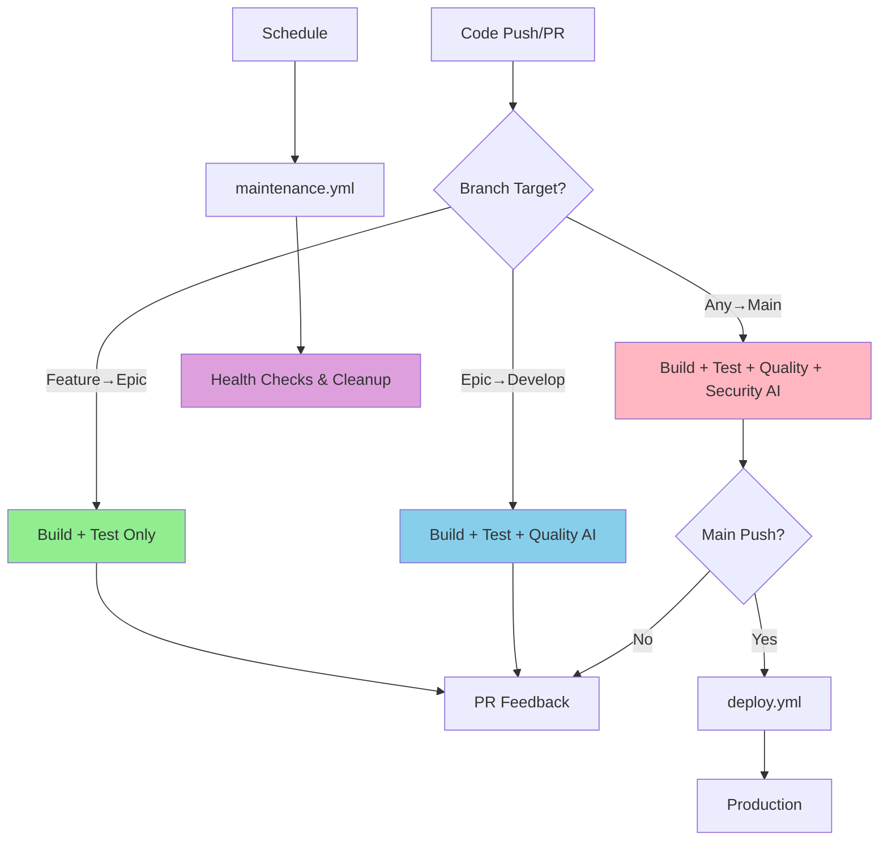

# Module/Directory: .github/workflows

**Last Updated:** 2025-08-30

**Parent:** [`.github`](../README.md)

## 1. Purpose & Responsibility

* **What it is:** Consolidated CI/CD pipeline architecture with intelligent branch-aware automation for build, test, analysis, deployment, and maintenance operations, designed to support the **11-agent orchestrated development workflow**.
* **Key Responsibilities:** 
    * Unified build and test execution with integrated AI-powered analysis
    * Branch-aware conditional logic for appropriate analysis depth
    * Automated deployment with security gates and health checks
    * Scheduled maintenance tasks including cleanup and dependency monitoring
    * **Agent-triggered automation** supporting WorkflowEngineer agent and coverage epic automation
* **Why it exists:** To provide a streamlined, maintainable CI/CD pipeline that consolidates all analysis into a single workflow for optimal Claude AI integration, **supports multi-agent coordination**, and enables intelligent automation with clear separation of concerns.

## 2. Architecture & Key Concepts

* **High-Level Design:** Six core workflows with clear responsibilities:
    * **build.yml** - Consolidated mega build pipeline with all AI analysis using template-based prompts
    * **deploy.yml** - Conditional deployment based on build results
    * **maintenance.yml** - Scheduled system maintenance and monitoring
    * **claude-dispatch.yml** - Remote agent execution with enhanced environment preparation supporting **strategic codebase manager coordination**
    * **coverage-epic-automation.yml** - Automated test coverage improvement via **TestEngineer agent** (workflow_dispatch only) 
    * **coverage-epic-scheduler.yml** - Intelligent scheduler that triggers coverage automation every 6 hours with **agent activity detection**
* **Branch-Aware Execution Logic:**
    * **Feature → Epic PRs**: Build + Test only (no AI analysis)
    * **Epic → Develop PRs**: Build + Test + Quality Analysis (Testing, Standards, Tech Debt)
    * **Any → Main PRs**: Build + Test + Quality + Security Analysis (Full AI suite)
* **Core Workflow Dependencies:** 
    ```
    build.yml (All PRs and pushes)
        ↓
    deploy.yml (Main branch only, after successful build)
    
    maintenance.yml (Scheduled, independent)
    
    claude-dispatch.yml (Repository dispatch, independent)
    
    coverage-epic-scheduler.yml (Scheduled, 4x daily)
        ↓
    coverage-epic-automation.yml (Workflow dispatch only)
    ```
* **Concurrency Control:**
    * Automatic cancellation of previous runs when new commits are pushed
    * Resource optimization and faster feedback
    * Clean workflow run history
* **AI Prompt Management:**
    * Template-based prompt system with dynamic context injection
    * Centralized prompt files in `.github/prompts/` directory
    * Consistent placeholder replacement pattern across all analysis jobs



## 3. Interface Contract & Assumptions

* **Key Public Interfaces (for workflow orchestration):**
    * **build.yml**:
        * **Purpose:** Consolidated build, test, and AI analysis with branch-aware logic using template-based prompts
        * **Triggers:** Pull requests to any branch, pushes to main
        * **Critical Preconditions:** Valid source code, configured secrets (CLAUDE_CODE_OAUTH_TOKEN), prompt templates available
        * **Critical Postconditions:** Build artifacts created, AI analysis posted to PRs using processed templates
        * **Concurrency:** Automatically cancels previous runs for same ref
        * **Prompt Loading:** Each AI analysis job loads template from `.github/prompts/` and replaces placeholders
    * **deploy.yml**:
        * **Purpose:** Production deployment with security gates
        * **Triggers:** Successful build.yml completion on main branch
        * **Critical Preconditions:** Successful build, security clearance, AWS credentials
        * **Critical Postconditions:** Application deployed, health checks passed
    * **maintenance.yml**:
        * **Purpose:** Scheduled maintenance and health monitoring
        * **Triggers:** Cron schedule (weekly/monthly) or manual dispatch
        * **Critical Preconditions:** Repository access, issue creation permissions
        * **Critical Postconditions:** Cleanup completed, health issues reported
    * **claude-dispatch.yml**:
        * **Purpose:** Remote Claude AI agent execution with full environment preparation
        * **Triggers:** Repository dispatch event (claude-dispatch)
        * **Critical Preconditions:** Valid dispatch event, GitHub token permissions
        * **Critical Postconditions:** Environment prepared with dependencies and tools, test baseline generated, results captured
    * **coverage-epic-automation.yml**:
        * **Purpose:** Automated test coverage improvement through AI-driven test generation
        * **Triggers:** Workflow dispatch only (triggered by scheduler or manually)
        * **Critical Preconditions:** Epic branch exists, test environment valid, Claude OAuth tokens configured
        * **Critical Postconditions:** Coverage improvements implemented, PR created for review
        * **Input Parameters:** scheduled_trigger, trigger_source, trigger_reason for tracking automation source
    * **coverage-epic-scheduler.yml**:
        * **Purpose:** Intelligent scheduler that checks repository activity and triggers coverage automation
        * **Triggers:** Scheduled 4x daily (every 6 hours) or manual dispatch with force option
        * **Critical Preconditions:** Repository access, workflow dispatch permissions
        * **Critical Postconditions:** Coverage automation triggered if activity detected (or forced)
        * **Intelligence:** Only triggers if commits within 72 hours, reducing unnecessary runs
* **Critical Assumptions:**
    * GitHub Actions runners provide consistent environment
    * Claude AI OAuth token remains valid for analysis
    * AWS infrastructure available for deployments
    * Repository structure maintained for path filtering

## 4. Local Conventions & Constraints (Beyond Global Standards)

* **Workflow Organization:**
    * Simple naming without numbers: `build.yml`, `deploy.yml`, `maintenance.yml`
    * Single mega build workflow contains all analysis logic
    * `workflow_run` trigger for deployment workflow
    * `workflow_dispatch` support for manual testing
* **Branch-Aware Analysis:**
    * Conditional job execution based on PR target branch
    * Progressive analysis depth: feature < develop < main
    * Security analysis reserved for main branch only
* **Claude AI Integration:**
    * Direct use of `grll/claude-code-action@beta` in workflow
    * OAuth authentication for Claude Max plan
    * Separate jobs for each analysis type with template-based prompts
    * Consistent prompt loading pattern: `cat .github/prompts/{type}.md` → placeholder replacement → Claude AI
* **Concurrency Management:**
    ```yaml
    concurrency:
      group: ${{ github.workflow }}-${{ github.ref }}
      cancel-in-progress: true
    ```

## 5. How to Work With This Code

* **Setup:**
    * Configure repository secrets: `CLAUDE_CODE_OAUTH_TOKEN`, `CLAUDE_REFRESH_TOKEN`, AWS credentials
    * Ensure branch protection rules align with deployment gates
    * No local setup required - GitHub-hosted execution
* **Testing:**
    * **Location:** Workflows tested through actual repository execution
    * **How to Run:** Push to branch, create PR, or use manual dispatch
    * **Verify Analysis:** Check PR comments for Claude AI insights
* **Common Usage Patterns:**
    ```bash
    # Trigger specific workflow manually
    gh workflow run "Build & Test"
    
    # Monitor workflow status
    gh run list --workflow="build.yml" --limit 5
    
    # View workflow run details
    gh run view <run-id> --log
    
    # Check deployment status
    gh workflow view deploy.yml
    
    # Test path filtering locally
    ./.github/scripts/test-path-filtering.sh
    ```
* **Common Pitfalls / Gotchas:**
    * Claude AI analysis only runs on PRs to develop/main branches
    * Security analysis only runs on PRs to main branch
    * Deployment requires successful security gates
    * Concurrency control may cancel runs during rapid commits
    * Claude-dispatch requires full environment setup including .NET tool restoration
    * Coverage automation depends on refitter tool being available (handled by setup-environment)

## 6. Dependencies

* **Internal Code Dependencies:**
    * [`.github/scripts/`](../scripts/README.md) - Core automation logic executed by workflows
    * [`.github/actions/shared/`](../actions/shared/README.md) - Shared utility actions including:
        * `run-tests` - Standardized test execution with structured outputs
        * `setup-environment` - Environment preparation with tool restoration
        * `validate-test-suite` - Test baseline validation
        * `check-paths` - Intelligent path filtering
    * [`.github/prompts/`](../prompts/README.md) - AI analysis prompt templates with placeholder system
    * [`Code/Zarichney.Server/`](../../Code/Zarichney.Server/README.md) - Backend application
    * [`Code/Zarichney.Website/`](../../Code/Zarichney.Website/README.md) - Frontend application
* **External Service Dependencies:**
    * `GitHub Actions Runtime` - Workflow execution environment
    * `Claude AI API` - AI-powered analysis via OAuth
    * `AWS Services` - Deployment targets (EC2, S3)
    * `Docker Hub` - Container images for testing
    * `Package Registries` - NPM, NuGet for dependencies
* **GitHub Actions Used:**
    * `grll/claude-code-action@beta` - Claude AI analysis
    * `actions/checkout@v4` - Repository checkout
    * `actions/setup-dotnet@v4` - .NET SDK setup
    * `actions/setup-node@v4` - Node.js setup
    * `github/codeql-action` - Security scanning

## 7. Rationale & Key Historical Context

* **Workflow Consolidation:** Merged separate quality and security workflows into single mega build for Claude AI compatibility
* **Claude AI Integration:** Moved from `workflow_run` triggers to direct `pull_request` events for proper OAuth support
* **Prompt Refactoring:** Extracted inline Claude AI prompts to separate template files for maintainability and version control
* **Template System:** Implemented placeholder-based prompt loading for consistent dynamic context injection
* **Branch-Aware Logic:** Progressive analysis depth based on PR target prevents unnecessary analysis on feature branches
* **Concurrency Control:** Added to prevent duplicate runs and optimize resource usage
* **Simplified Naming:** Removed workflow numbering for cleaner, more intuitive interface
* **Logic Extraction:** Moving complex logic to `.github/scripts/` enables local testing and easier debugging
* **Environment Preparation:** Enhanced claude-dispatch with full dependency restoration and test baseline generation for better AI context
* **Tool Management:** Centralized .NET tool restoration in setup-environment action to prevent tool-related failures across all workflows
* **Coverage Epic Architecture:** Split scheduled coverage automation into two workflows to resolve Claude Code action incompatibility with schedule events
* **11-Agent Development Integration:** Workflows designed to support the strategic codebase manager orchestration model with specialized agent coordination
* **Agent-Triggered Automation:** Coverage epic automation specifically designed for TestEngineer agent execution with comprehensive environment preparation
* **WorkflowEngineer Integration:** CI/CD pipeline architecture that supports the WorkflowEngineer agent's automation and optimization responsibilities

## 8. Known Issues & TODOs

* **Performance Optimization:** Large workflow could benefit from further parallelization
* **Cache Strategy:** Workflow-level caching could reduce execution times
* **Analysis Consolidation:** Consider combining multiple Claude AI calls into single analysis
* **Deployment Rollback:** Automated rollback mechanism could enhance reliability
* **Metrics Collection:** Workflow performance metrics would aid optimization
* **Coverage Scheduler Enhancement:** Could add more sophisticated activity detection and PR conflict avoidance

---