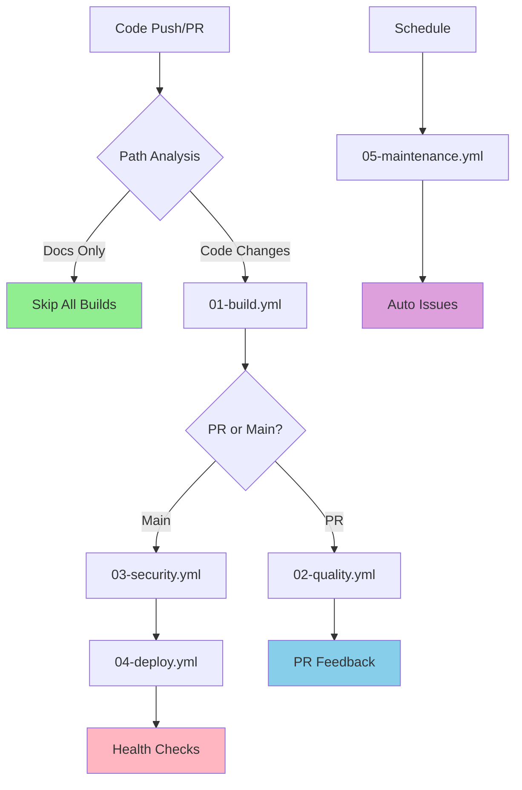

# Module/Directory: .github/workflows

**Last Updated:** 2025-07-27

**Parent:** [`.github`](../README.md)

## 1. Purpose & Responsibility

* **What it is:** Clean CI/CD pipeline architecture consisting of 5 focused workflows that replaced 8 complex workflow files, providing intelligent path-based triggering and comprehensive automation.
* **Key Responsibilities:** 
    * Build and test automation for backend (.NET) and frontend (Angular) applications
    * AI-powered quality analysis including standards compliance and tech debt assessment
    * Comprehensive security scanning with CodeQL, dependency analysis, and secrets detection
    * Conditional deployment with health checks and rollback capabilities
    * Scheduled maintenance tasks including cleanup and dependency monitoring
* **Why it exists:** To provide a maintainable, efficient CI/CD pipeline that reduces complexity (75% reduction in workflow lines), eliminates unnecessary runs (30%+ efficiency gain), and enables intelligent automation with clear separation of concerns.

## 2. Architecture & Key Concepts

* **High-Level Design:** Five sequential workflows with smart dependencies and path-based triggering:
    * **01-build.yml** - Foundation build and test execution
    * **02-quality.yml** - AI-powered quality analysis (PR-triggered)
    * **03-security.yml** - Comprehensive security scanning (main branch)
    * **04-deploy.yml** - Conditional deployment with health validation
    * **05-maintenance.yml** - Scheduled cleanup and monitoring
* **Core Workflow Dependencies:** 
    ```
    01-build.yml (Code changes)
        ↓
    02-quality.yml (After build success, PRs only)
        ↓
    03-security.yml (Main branch pushes)
        ↓  
    04-deploy.yml (Security approval required)
    
    05-maintenance.yml (Scheduled, independent)
    ```
* **Intelligent Path Filtering:**
    * **Documentation-only changes** (`*.md`, `Docs/**`) → Skip all expensive builds
    * **Backend changes** (`Code/Zarichney.Server/**`) → Backend build + analysis
    * **Frontend changes** (`Code/Zarichney.Website/**`) → Frontend build + analysis
    * **Pipeline changes** (`Scripts/Pipeline/**`, `.github/**`) → Full validation
    * **Mixed changes** → Run all applicable workflows intelligently
* **Logic Delegation:** Complex automation logic delegated to `Scripts/Pipeline/` for local testing and maintainability



## 3. Interface Contract & Assumptions

* **Key Public Interfaces (for workflow orchestration):**
    * **01-build.yml**:
        * **Purpose:** Foundation build and test execution with intelligent path-based triggering
        * **Critical Preconditions:** Valid source code, .NET 8 SDK, Node.js 18.x, Docker available
        * **Critical Postconditions:** Build artifacts created, test results available, path analysis outputs set
        * **Non-Obvious Error Handling:** Handles Docker group membership issues; creates artifacts even on test failures
    * **02-quality.yml**:
        * **Purpose:** AI-powered quality analysis for pull requests
        * **Critical Preconditions:** Successful build completion, Claude AI token configured, build artifacts available
        * **Critical Postconditions:** Quality reports posted to PR, quality gates evaluated, issues created for violations
        * **Non-Obvious Error Handling:** Graceful degradation when AI services unavailable; provides partial analysis
    * **03-security.yml**:
        * **Purpose:** Comprehensive security scanning for main branch changes
        * **Critical Preconditions:** Main branch push, CodeQL analysis tools, dependency scanning capabilities
        * **Critical Postconditions:** Security reports generated, vulnerabilities identified, deployment gates set
        * **Non-Obvious Error Handling:** Continues with available scans if individual tools fail; prioritizes critical findings
* **Critical Assumptions:**
    * **Environment Consistency:** GitHub Actions runners provide consistent environment with required tools
    * **External Service Access:** Internet access for package downloads, AI services, deployment targets
    * **Repository Structure:** Expected directory structure maintained for path filtering accuracy
    * **Secret Management:** Required secrets configured in repository settings

## 4. Local Conventions & Constraints (Beyond Global Standards)

* **Configuration:**
    * Workflows numbered sequentially (01-05) for clear execution order
    * Professional naming pattern: "NN • Description" for clean presentation
    * Environment variables defined at workflow level for consistency
    * Permissions explicitly declared with minimal required access
* **Workflow Organization:**
    * Single responsibility per workflow with clear boundaries
    * `workflow_run` triggers for dependent workflows
    * `workflow_dispatch` support for manual testing and debugging
    * Consistent job naming patterns for clarity
* **Path Filtering Standards:**
    * Explicit path patterns for all triggers
    * Docs-only optimization to prevent unnecessary builds
    * Component-specific filtering for backend/frontend isolation
    * Pipeline change detection for infrastructure updates
* **Output Standards:**
    * Consistent artifact naming conventions
    * Standardized output variables across workflows
    * Structured logging for debugging and monitoring
    * Quality gate results in standardized format

## 5. How to Work With This Code

* **Setup:**
    * No local setup required - GitHub-hosted execution
    * Configure repository secrets: `CLAUDE_CODE_OAUTH_TOKEN`, AWS credentials
    * Ensure proper branch protection rules align with workflow gates
    * Configure notification settings for workflow failures
* **Testing:**
    * **Location:** Workflows tested through actual repository execution
    * **How to Run:** Push to feature branch, create PR, or use manual dispatch
    * **Testing Strategy:** Each workflow includes validation steps and proper error handling
* **Common Usage Patterns:**
    ```bash
    # Trigger specific workflow manually
    gh workflow run "01 • Build & Test"
    
    # Monitor workflow status
    gh run list --workflow="01-build.yml" --limit 5
    
    # View workflow run details
    gh run view <run-id> --log
    
    # Test path filtering locally
    ./Scripts/Pipeline/test-path-filtering.sh
    ```
* **Common Pitfalls / Gotchas:**
    * Path filters are case-sensitive and must match actual file paths
    * `workflow_run` triggers have different context than direct triggers
    * Workflow permissions affect action capabilities (issues, PRs, deployments)
    * AI service availability impacts quality analysis workflows

## 6. Dependencies

* **Internal Code Dependencies:**
    * [`Scripts/Pipeline/`](../../Scripts/Pipeline/README.md) - Core automation logic executed by workflows
    * [`.github/actions/`](../actions/README.md) - Custom actions used throughout workflows
    * [`Code/Zarichney.Server/`](../../Code/Zarichney.Server/README.md) - Backend application source
    * [`Code/Zarichney.Website/`](../../Code/Zarichney.Website/README.md) - Frontend application source
* **External Service Dependencies:**
    * `GitHub Actions Runtime` - Workflow execution environment
    * `Claude AI API` - AI-powered analysis services
    * `AWS Services` - Deployment targets (EC2, S3)
    * `Docker Hub` - Container images for testing and analysis
    * `Package Registries` - NPM, NuGet for dependency management
* **Dependents (Impact of Changes):**
    * [Development Process] - PR feedback and merge gates depend on workflow results
    * [Deployment Pipeline] - Production deployments controlled by workflow outcomes
    * [Quality Assurance] - Automated quality gates enforce project standards

## 7. Rationale & Key Historical Context

* **Workflow Consolidation:** Reduced 8 complex workflows (1,670+ lines) to 5 focused workflows (~400 lines) for maintainability
* **Path-Based Optimization:** Intelligent filtering prevents 30%+ of unnecessary workflow runs while maintaining comprehensive coverage
* **Logic Extraction:** Moving complex logic to `Scripts/Pipeline/` enables local testing and easier debugging
* **AI Integration:** Centralized AI analysis provides consistent quality assessment across all code changes
* **Dependency Architecture:** Clear workflow dependencies ensure proper execution order and resource utilization

## 8. Known Issues & TODOs

* **Frontend Testing Integration:** Structure ready for Playwright test automation when frontend testing is implemented
* **Workflow Performance:** Some parallel execution opportunities not yet fully optimized
* **Error Recovery:** Enhanced retry mechanisms could improve resilience to transient failures
* **Monitoring Integration:** Additional observability and alerting could be beneficial
* **Cache Optimization:** Workflow-level caching could reduce execution times further

---