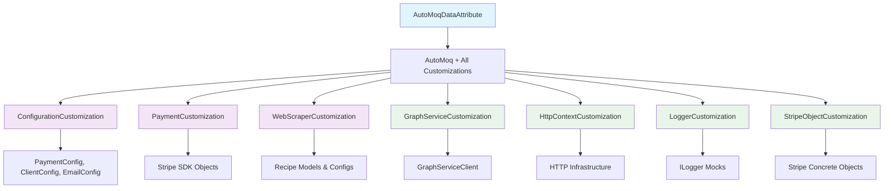

# README: /Framework/TestData/AutoFixtureCustomizations Directory

**Version:** 2.0
**Last Updated:** 2025-09-20
**Parent:** `../README.md`

## 1. Purpose & Responsibility

This directory houses **8 production AutoFixture customizations** for the `Zarichney.Server.Tests` project, providing comprehensive test data generation across all application domains. These customizations implement `AutoFixture.ISpecimenBuilder` and `AutoFixture.ICustomization` interfaces to ensure consistent, realistic test data.

**Current Customizations (8 total):**
- **PaymentCustomization** (Framework) - Stripe payment entities and configurations
- **WebScraperCustomization** (Framework) - Recipe scraping models and configurations
- **ConfigurationCustomization** (TestData) - Application configuration objects
- **GraphServiceCustomization** (TestData) - Microsoft Graph SDK objects
- **AutoMoqDataAttribute** (TestData) - Enhanced AutoData with mocking integration
- **HttpContextCustomization** (TestData) - HTTP infrastructure types
- **LoggerCustomization** (TestData) - ILogger dependency mocking
- **StripeObjectCustomization** (TestData) - Stripe SDK concrete objects

**Primary Responsibilities:**
* **Simplify complex test data generation** for domain models, EF Core entities, and DTOs across unit and integration tests
* **Encapsulate domain-specific data rules** ensuring payment configurations, recipe models, and service dependencies have realistic test values
* **Handle integration challenges** such as Stripe SDK objects, Microsoft Graph clients, and HTTP infrastructure that cannot be directly instantiated
* **Provide unified test experience** through AutoMoqDataAttribute that combines all customizations with automatic mocking

This implementation supports testing excellence goals and aligns with `/Docs/Standards/TestingStandards.md` requirements for comprehensive test data management.


## 2. Architecture & Key Concepts

### Implementation Patterns

Our 8 customizations follow three primary patterns for AutoFixture extensibility:

**1. ICustomization Pattern (7 customizations):**
* **Domain-Specific Customizations**: PaymentCustomization, WebScraperCustomization provide realistic data for Stripe payments and recipe scraping
* **Infrastructure Customizations**: ConfigurationCustomization, GraphServiceCustomization, HttpContextCustomization handle complex object creation
* **Testing Infrastructure**: LoggerCustomization, StripeObjectCustomization provide mock and concrete object creation

**2. Enhanced AutoData Attribute (1 customization):**
* **AutoMoqDataAttribute**: Unified attribute combining all 7 customizations with AutoMoq for comprehensive test setup

**3. Domain Architecture:**


### Key Benefits

* **Realistic Test Data**: Payment configurations use proper Stripe format patterns, recipe configs have reasonable test values
* **Infrastructure Handling**: Complex objects like GraphServiceClient and HttpResponseHeaders created properly
* **Unified Experience**: Single [AutoMoqData] attribute provides all customizations plus automatic mocking
* **Domain Accuracy**: Each customization ensures domain-specific invariants (payment amounts, recipe counts, etc.)

## 3. Interface Contract & Assumptions

* **Interface for Test Writers:**
    * Test developers will primarily use these components by applying `ICustomization` instances to their `IFixture` objects (often obtained via `_fixture` in base test classes or from `[AutoData]` attributes).
    * `var fixture = new Fixture().Customize(new EntityFrameworkCoreCustomization());`
    * Alternatively, if custom `[AutoData]` attributes are created incorporating these customizations, developers will use those attributes on their test methods.
* **Assumptions:**
    * The customizations implemented here are thoroughly tested to ensure they produce valid and meaningful objects according to the domain rules and database constraints of the `Zarichney.Server`.
    * Developers understand when and how to apply these customizations to effectively generate data for their specific test scenarios.
    * These customizations correctly handle EF Core specifics, such as navigation properties and concurrency tokens, to avoid issues during testing with `DatabaseFixture`.

## 4. Local Conventions & Constraints

* **Naming:**
    * Specimen Builders: `[TargetType]SpecimenBuilder.cs` (e.g., `RecipeEntitySpecimenBuilder.cs`).
    * Customizations: `[DomainAreaOrPurpose]Customization.cs` (e.g., `CookbookDomainCustomization.cs`, `EfCoreCustomization.cs`).
* **Location:** All shared, advanced AutoFixture customizations (`ISpecimenBuilder`, `ICustomization`) should reside directly within this directory.
* **Focus:** Each customization or builder should be focused on a specific domain area or a particular aspect of data generation (e.g., handling all EF Core related concerns).
* **Testing:** Customizations and specimen builders containing complex logic **must** have their own unit tests, likely located in `../../Unit/Framework/TestData/AutoFixtureCustomizations/`.
* **Documentation:** Each public customization and builder must have clear XML documentation explaining its purpose, what it configures, and any notable behaviors. This README should provide an overview of available customizations.

## 5. How to Work With This Code

### Current Customization Catalog

#### Framework Location Customizations

**PaymentCustomization** - Stripe Payment Entities
```csharp
// Provides realistic Stripe test data
fixture.Customize(new PaymentCustomization());
var paymentConfig = fixture.Create<PaymentConfig>(); // sk_test_*, proper URLs
var session = fixture.Create<Session>(); // cs_test_*, complete status
var paymentIntent = fixture.Create<PaymentIntent>(); // pi_test_*, succeeded
```

**WebScraperCustomization** - Recipe Scraping Models
```csharp
// Provides realistic recipe and webscraper configs
fixture.Customize(new WebScraperCustomization());
var scrapedRecipe = fixture.Create<ScrapedRecipe>(); // Uses ScrapedRecipeBuilder
var webConfig = fixture.Create<WebscraperConfig>(); // Reduced parallel tasks for tests
var recipeConfig = fixture.Create<RecipeConfig>(); // Reasonable test thresholds
```

#### TestData Location Customizations

**ConfigurationCustomization** - Application Configuration
```csharp
// Creates all major configuration objects
fixture.Customize(new ConfigurationCustomization());
var paymentConfig = fixture.Create<PaymentConfig>(); // Via PaymentConfigBuilder
var clientConfig = fixture.Create<ClientConfig>(); // test.example.com
var emailConfig = fixture.Create<EmailConfig>(); // Azure test credentials
```

**GraphServiceCustomization** - Microsoft Graph SDK
```csharp
// Handles GraphServiceClient creation
fixture.Customize(new GraphServiceCustomization());
var graphClient = fixture.Create<GraphServiceClient>(); // Concrete instance with HttpClient
// Note: ITemplateService, IMailCheckClient use AutoMoq
```

**HttpContextCustomization** - HTTP Infrastructure
```csharp
// Handles non-instantiable HTTP types
fixture.Customize(new HttpContextCustomization());
var headers = fixture.Create<HttpResponseHeaders?>(); // Returns null safely
// Prevents AutoFixture creation errors with Stripe objects
```

**LoggerCustomization** - ILogger Dependencies
```csharp
// Ensures proper logger mocking
fixture.Customize(new LoggerCustomization());
var logger = fixture.Create<ILogger<PaymentService>>(); // Proper mock
// Works with AutoMoq for other ILogger<T> types
```

**StripeObjectCustomization** - Stripe SDK Objects
```csharp
// Creates concrete Stripe objects
fixture.Customize(new StripeObjectCustomization());
var session = fixture.Create<Session>(); // Concrete with metadata
var event = fixture.Create<Event>(); // checkout.session.completed with data
```

**AutoMoqDataAttribute** - Enhanced AutoData Integration
```csharp
// Single attribute provides all customizations + AutoMoq
[Theory, AutoMoqData]
public async Task EmailService_SendEmail_WithGraphClient(
    [Frozen] Mock<ITemplateService> mockTemplate,
    EmailConfig emailConfig, // From ConfigurationCustomization
    GraphServiceClient graphClient, // From GraphServiceCustomization
    EmailService sut)
{
    // All infrastructure properly configured
    // All interfaces automatically mocked
    // All configuration objects have realistic test data
}
```

### Recommended Usage Patterns

**1. Use AutoMoqDataAttribute (Recommended)**
```csharp
[Theory, AutoMoqData]
public async Task PaymentService_ProcessPayment_Success(
    [Frozen] Mock<IStripeService> mockStripe,
    PaymentConfig paymentConfig, // Automatically configured
    PaymentService sut)
{
    // All customizations applied automatically
    // PaymentConfig has realistic test values
    // IStripeService is mocked via AutoMoq
    Assert.NotNull(paymentConfig.StripeSecretKey);
    Assert.StartsWith("sk_test_", paymentConfig.StripeSecretKey);
}
```

**2. Individual Customizations (For Specific Needs)**
```csharp
[Fact]
public void WebScraper_Config_HasValidTestValues()
{
    var fixture = new Fixture();
    fixture.Customize(new WebScraperCustomization());

    var config = fixture.Create<WebscraperConfig>();

    Assert.Equal(3, config.MaxNumResultsPerQuery);
    Assert.Equal(2, config.MaxParallelTasks); // Reduced for tests
}
```

**3. Combined Customizations (For Complex Scenarios)**
```csharp
var fixture = new Fixture();
fixture.Customize(new AutoMoqCustomization());
fixture.Customize(new PaymentCustomization());
fixture.Customize(new ConfigurationCustomization());
fixture.Customize(new StripeObjectCustomization());

// Now create complex payment test scenarios
var paymentService = fixture.Create<PaymentService>();
var stripeSession = fixture.Create<Session>();
```

## 6. Dependencies

### Internal Dependencies

* **`Zarichney.Server` Project:** The domain models, DTOs, and EF Core entity classes defined in the `Zarichney.Server` project are the primary targets for these customizations.
* **`../../Unit/` and `../../Integration/` Tests:** These tests are the primary consumers of the customizations defined here, using them to generate test data.

### Key External Libraries

* **`AutoFixture`**: The core library providing `ISpecimenBuilder`, `ICustomization`, `IFixture`, and related interfaces and classes.

## 7. Rationale & Key Historical Context

This dedicated directory and the strategy of creating advanced AutoFixture customizations are being adopted to address TDD FRMK-002. The rationale includes:

* **Improved Realism:** To generate test data that more closely mimics real-world data and adheres to complex domain invariants and database constraints.
* **Reduced Boilerplate:** To significantly reduce repetitive data setup code within individual tests, making tests cleaner and more focused on their specific assertions.
* **Enhanced Maintainability:** To centralize data generation logic. If a domain rule changes, the corresponding customization can be updated in one place, rather than modifying numerous tests.
* **Handling Complex Object Graphs:** To effectively manage the creation of complex interconnected objects, especially EF Core entities with navigation properties and potential circular dependencies.

This approach is based on established best practices for test data management using AutoFixture, as highlighted in the "Research Report" (Sec 4.1) and testing guides.

## 8. Known Issues & TODOs

### Current Status: Complete Implementation ✅

**TDD FRMK-002 Implementation Complete:** All major domain areas now have comprehensive AutoFixture customizations:
* ✅ **Payment Domain**: PaymentCustomization + StripeObjectCustomization provide complete Stripe SDK support
* ✅ **Recipe Domain**: WebScraperCustomization handles recipe scraping models and configurations
* ✅ **Configuration Domain**: ConfigurationCustomization covers PaymentConfig, ClientConfig, EmailConfig
* ✅ **Infrastructure Domain**: HTTP, logging, and Graph SDK handled by specialized customizations
* ✅ **Integration Pattern**: AutoMoqDataAttribute provides unified experience with automatic mocking

### Integration with Testing Excellence Initiative

**Current Customizations Support Comprehensive Coverage Goals:**
* All service dependencies properly mocked via AutoMoqDataAttribute
* Realistic configuration data enables comprehensive integration testing
* Stripe SDK objects support payment service testing scenarios
* Microsoft Graph integration supports email service testing

### Future Enhancements (As Needed)

* **EF Core Entity Patterns**: Consider adding specific entity customizations if database testing expands
* **Authentication Models**: Add auth-specific customizations if identity testing scenarios increase
* **Performance Optimizations**: Monitor AutoFixture creation performance in large test suites
* **Documentation Examples**: Add more complex integration examples as testing patterns evolve

### Cross-References

* See `/Docs/Standards/TestingStandards.md` for testing strategy integration
* Review `../Builders/README.md` for test data builder patterns that work with these customizations
* Check `../../Unit/Services/` for examples of AutoMoqDataAttribute usage patterns

---
