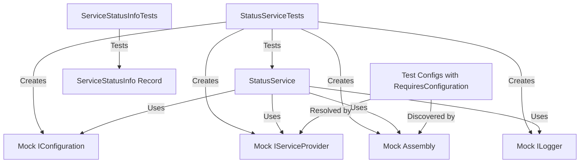

# Module/Directory: /Code/Zarichney.Server.Tests/Unit/Services/Status

**Last Updated:** 2025-05-16

> **Parent:** [`/Code/Zarichney.Server.Tests/Unit/Services/`](../README.md)

## 1. Purpose & Responsibility

* **What it is:** Unit tests for the Status Service module, which provides runtime configuration status and availability information for system features and external services.
* **Key Responsibilities:**
  * Testing `StatusService` functionality for checking configuration values
  * Validating enum-based service status reporting (using `ExternalServices` enum)
  * Testing service status caching and retrieval methods
  * Verifying proper handling of `[RequiresConfiguration]` attributes
  * Ensuring feature availability checks function correctly
* **Why it exists:** To verify that the Status Service correctly determines whether features are properly configured and available, supporting the system's ability to report its health and gracefully handle missing configurations.

## 2. Architecture & Key Concepts

* **High-Level Design:** The test suite uses mocked dependencies to isolate and verify the behavior of the `StatusService` class in various scenarios.
* **Core Tests:**
  * `ServiceStatusInfoTests` - Verifies the behavior of the `ServiceStatusInfo` record with different constructor parameters
  * `StatusServiceTests` - Tests the primary functionality of the `StatusService` class
* **Key Testing Patterns:**
  * Mocking configuration values to test different configuration states
  * Setting up mock service providers to return test config instances
  * Using reflection via a mocked assembly to control which config types are "discovered"
  * Verifying proper caching behavior for service status information
  * Testing both dictionary lookup and list enumeration patterns for service status

## 3. Interface Contract & Assumptions

* **Key Methods Tested:**
  * `GetConfigurationStatusAsync()` - Tests verify it returns correct configuration status list
  * `GetServiceStatusAsync()` - Tests verify it returns a dictionary of `ExternalServices` to `ServiceStatusInfo`
  * `GetFeatureStatus(ExternalServices)` - Tests verify it returns the correct status for a specific service
  * `IsFeatureAvailable(ExternalServices)` - Tests verify it correctly reports if a service is available
* **Critical Assumptions:**
  * Tests assume the `StatusService` properly reflects its cache expiration time
  * Test config classes use the `[RequiresConfiguration]` attribute to associate properties with services
  * Tests assume the service correctly uses reflection to find and analyze config types
  * Mock `IServiceProvider` returns test config objects that mimic real ones
  * Testing with enum-based service identifiers rather than string-based (post-refactoring)

## 4. Local Conventions & Constraints

* **Mock Configuration:** Tests set up mock configuration to return specific values using `_mockConfiguration.Setup(c => c["Key"]).Returns("Value")`
* **Test Configuration Classes:** Inner classes `TestService1Config` and `TestService2Config` define test configuration objects with `[RequiresConfiguration]` attributes
* **Helper Methods:** Tests use setup helper methods like `SetupEmptyServiceProvider()`, `SetupServiceProviderWithTestConfigs()`, etc.
* **Initialization Pattern:** The `StatusServiceTests` constructor sets up common mocks, and individual test methods configure them for specific scenarios

## 5. How to Work With This Code

* **Setup:** No special setup required beyond standard test project dependencies
* **Testing:**
  * Location: `/Code/Zarichney.Server.Tests/Unit/Services/Status/`
  * How to Run: `dotnet test --filter "FullyQualifiedName~StatusServiceTests"`
  * Testing Strategy: Focus on verifying correct behavior with different configuration states and service availability scenarios
* **Common Pitfalls / Gotchas:**
  * The service uses reflection - test setup is sensitive to the exact configuration of mock assemblies and service providers
  * Tests rely on proper configuration of the mock service provider to return test config instances
  * When adding new enum values to `ExternalServices`, update test config classes accordingly

## 6. Dependencies

* **Internal Code Dependencies:**
  * ../Zarichney.Server/Services/Status/`](../../../../Zarichney.Server/Services/Status/README.md) - The module being tested
  * ../Zarichney.Server/Config/`](../../../../Zarichney.Server/Config/README.md) - For `ConfigurationExtensions` and configuration-related attributes
* **External Library Dependencies:**
  * `Xunit` - Testing framework
  * `FluentAssertions` - Assertions library
  * `Moq` - Mocking framework
* **Dependents (Impact of Changes):**
  * [`/Code/Zarichney.Server.Tests/Framework/Helpers/ConfigurationStatusHelper.cs`](../../../Framework/Helpers/README.md) - Relies on the status service behavior for integration tests

## 7. Rationale & Key Historical Context

* The tests were updated to handle the transition from string-based service identifiers to the enum-based approach (`ExternalServices` enum)
* Previously, tests checked dictionaries with string keys; now they verify dictionary lookups with enum keys
* The `ServiceStatusInfo` record was updated to include the `serviceName` parameter, requiring updates to test assertions
* Tests were modified to support the new structure while maintaining the same verification logic

## 8. Known Issues & TODOs

* Consider adding tests for handling caching failures or exceptions during cache refresh
* Add tests for the new list-based client API response format to verify proper conversion between internal dictionary and external list representation
* Consider expanding tests to cover more edge cases around service resolution failures