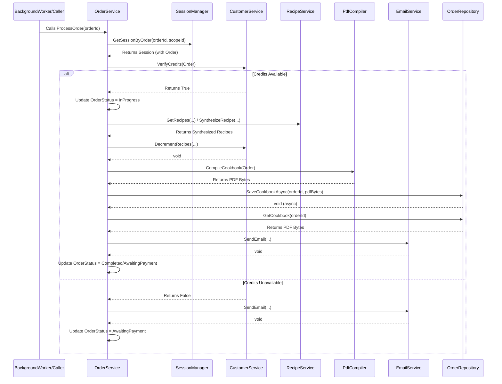

# Module/Directory: /Cookbook/Orders

**Last Updated:** 2025-04-20

> **Parent:** [`/Cookbook`](../README.md)

## 1. Purpose & Responsibility

* **What it is:** This module is responsible for managing the entire lifecycle of a cookbook order within the Cookbook Factory feature.
* **Key Responsibilities:**
    * Defining the structure of cookbook orders (`CookbookOrder`, `CookbookOrderSubmission`, `CookbookContent`, `CookbookDetails`, `UserDetails`) and their status (`OrderStatus`).
    * Processing incoming cookbook submissions, validating inputs (like email via `IEmailService`), and creating order records.
    * Orchestrating the core cookbook generation process by interacting with other services:
        * Generating the recipe list using `ILlmService` and `ProcessOrderPrompt`.
        * Checking and decrementing customer credits via `ICustomerService`.
        * Requesting recipe fetching and synthesis via `IRecipeService`.
        * Compiling the final PDF using `PdfCompiler`.
        * Emailing notifications and the final cookbook PDF via `IEmailService`.
    * Managing the state and status (`OrderStatus`) of orders throughout the process.
    * Persisting order data and generated artifacts (individual recipe markdown, final cookbook markdown/PDF) using `IOrderRepository` (currently file-based).
    * Queuing long-running order processing tasks using `IBackgroundWorker`.
* **Why it exists:** To centralize the complex orchestration logic required for creating a personalized cookbook, separating it from the specifics of recipe management, customer management, or low-level service interactions.

## 2. Architecture & Key Concepts

* **Core Component:** `OrderService` implements `IOrderService` and contains the primary business logic for order processing.
* **Orchestration Flow:** `OrderService.ProcessSubmission` typically initiates the process. It may queue the main processing logic (`OrderService.ProcessOrder`) via `IBackgroundWorker`. `ProcessOrder` then coordinates calls to `ICustomerService` (credits), `IRecipeService` (get/synthesize recipes), `PdfCompiler` (generate PDF), and `IEmailService` (send notifications/cookbook).
* **AI Interaction:** `OrderService.GetOrderRecipes` calls `ILlmService.CallFunction` to generate recipe lists and now captures the `conversationId` from the returned `LlmResult<T>`. This ID is stored in `CookbookOrder.LlmConversationId` to enable subsequent AI interactions to leverage existing conversation history.
* **Data Persistence:** `OrderFileRepository` implements `IOrderRepository` using `IFileService` to store order details (`Order.json`), individual synthesized recipe markdown files (`recipes/*.md`), the combined cookbook markdown (`Cookbook.md`), and the final PDF (`Cookbook.pdf`) within a directory named after the `OrderId` under `Data/Orders/`.
* **State Management:** Order state is tracked via the `OrderStatus` enum within the `CookbookOrder` object and persisted to `Order.json`. Session management (`ISessionManager`) is used to associate processing tasks with specific order contexts, especially during background execution.
* **Background Processing:** Long-running tasks like recipe synthesis and PDF compilation are typically offloaded to background tasks via `IBackgroundWorker` to keep API responses fast.
* **Configuration:** Uses `OrderConfig` (registered via `IConfig`) for settings like maximum parallel tasks during processing.
* **ProcessOrder Workflow Diagram:**

## 3. Interface Contract & Assumptions

  * **Key Public Interfaces:** `IOrderService` is the primary contract for interacting with this module.
      * `ProcessSubmission(submission, processOrder)`: Creates an order record. If `processOrder` is true, queues background processing. Assumes valid submission data and functional email validation. Postcondition: Order record saved (via SessionManager-\>Repository on session end), background task potentially queued.
      * `ProcessOrder(orderId)`: Orchestrates recipe synthesis, PDF generation, and emailing for the specified order. Assumes order exists and dependent services (`ICustomerService`, `IRecipeService`, etc.) are functional. Assumes sufficient customer credits if order `RequiresPayment` is false. Postcondition: Order status updated, recipes synthesized (up to available credits), PDF generated/saved, email sent. Updates customer credits.
      * `GetOrder(orderId)`: Retrieves order state. Assumes order exists.
      * `CompilePdf(order, waitForWrite)`: Generates/regenerates the PDF. Assumes order and synthesized recipes exist. Postcondition: PDF file saved via repository.
      * `EmailCookbook(orderId)`: Sends the existing PDF via email. Assumes order and PDF exist. Postcondition: Email sent via `IEmailService`.
      * `GetPdf(orderId)`: Retrieves PDF bytes. Assumes PDF exists.
      * `QueueOrderProcessing(orderId)`: Queues an order for background processing. Assumes order exists. Postcondition: Background task queued via `IBackgroundWorker` that will resolve `IOrderService` from a new scope and call `ProcessOrder(orderId)`.
  * **Data Models:**
      * `CookbookOrder` now includes a `LlmConversationId` property that stores the conversation ID associated with the initial recipe list generation. This enables multi-turn AI interactions that leverage existing conversation history.
  * **Assumptions:**
      * **Dependency Functionality:** Assumes all injected services (`ICustomerService`, `IRecipeService`, `IEmailService`, `IOrderRepository`, `PdfCompiler`, `IBackgroundWorker`, `ISessionManager`, `ILlmService`) are correctly implemented and functional.
      * **Configuration:** Assumes `OrderConfig` and configurations for dependent services are correctly provided.
      * **Credit System:** Assumes the credit checking logic via `ICustomerService` accurately reflects the user's ability to pay for recipes. Handles partial processing based on available credits.
      * **File System:** Assumes write access to the configured `OutputDirectory` for storing order artifacts.
      * **Background Tasks:** Relies on the `BackgroundTaskService` and `IBackgroundWorker` infrastructure to execute queued tasks reliably.

## 4. Local Conventions & Constraints (Beyond Global Standards)

  * **Persistence:** Strictly file-based under `Data/Orders/{OrderId}/`.
  * **Configuration:** Requires `OrderConfig` section in application configuration.
  * **Order Status:** Uses the `OrderStatus` enum to track the stage of processing.
  * **Error Handling:** Uses Polly for retries on potentially transient operations like emailing. Relies on logging and potentially email notifications for critical processing errors.

## 5. How to Work With This Code

  * **Primary Interaction:** Use `IOrderService` for managing orders.
  * **Core Logic:** The main orchestration logic resides in `OrderService.ProcessOrder`.
  * **Modifications:** Changes to the order processing flow, status transitions, or interactions with other services typically involve modifying `OrderService`. Changes to data persistence involve `OrderRepository`. Changes to the order data structure involve `OrderModels`.
  * **Testing:** Requires extensive mocking of dependencies (`ICustomerService`, `IRecipeService`, `IOrderRepository`, `IEmailService`, `PdfCompiler`, `IBackgroundWorker`, `ILlmService`, `ISessionManager`) to unit test `OrderService`. Integration tests are valuable for verifying the end-to-end flow, including background task execution.

## 6. Dependencies

* **Internal Code Dependencies:**
    * [`/Cookbook/Customers`](../Customers/README.md): Consumes `ICustomerService`.
    * [`/Cookbook/Recipes`](../Recipes/README.md): Consumes `IRecipeService`.
    * [`/Cookbook/Prompts`](../Prompts/README.md): Uses `ProcessOrderPrompt`.
    * [`/Services/Email`](../../Services/Email/README.md): Consumes `IEmailService`.
    * [`/Services/Sessions`](../../Services/Sessions/README.md): Consumes `ISessionManager`, `IScopeContainer`.
    * [`/Services/AI`](../../Services/AI/README.md): Consumes `ILlmService`.
    * [`/Services/Payment`](../../Services/Payment/README.md): Indirect dependency via `ICustomerService`.
    * [`/Services`](../../Services/README.md): Consumes `IFileService` (via Repository), `IBackgroundWorker`, `PdfCompiler`.
    * [`/Config`](../../Config/README.md): Consumes `OrderConfig`, `EmailConfig`.
* **External Library Dependencies:**
    * `Polly`: Used for retry logic.
    * `Microsoft.Graph.Models`: Used for email attachments (via EmailService).
* **Dependents (Impact of Changes):**
    * [`/Controllers/CookbookController.cs`](../../Controllers/CookbookController.cs): Primary consumer of `IOrderService`.
    * [`/Controllers/PaymentController.cs`](../../Controllers/PaymentController.cs): Consumes `IOrderService`.
    * Background task execution relies on `OrderService.ProcessOrder`.

## 7. Rationale & Key Historical Context

  * **Orchestration Layer:** `OrderService` acts as an orchestrator, keeping the complex multi-step process of cookbook generation manageable and separating it from individual concerns like recipe scraping or customer credit updates.
  * **Background Processing:** Offloading `ProcessOrder` to a background task ensures the initial API request (`ProcessSubmission`) returns quickly, providing a better user experience.
  * **Credit Check Integration:** Verifying and decrementing credits is integrated directly into the `ProcessOrder` flow to ensure recipes are only synthesized if the user has sufficient credits or has paid.

## 8. Known Issues & TODOs

  * The file-based `OrderRepository` might face scalability challenges with a very high volume of orders or very large generated files.
  * Error handling within the background `ProcessOrder` task could be enhanced to provide more detailed feedback or allow partial recovery if only *some* recipes fail during synthesis.
  * The dependency graph for `OrderService` is quite large, making unit testing complex. Consider further refactoring or alternative patterns if complexity increases.

