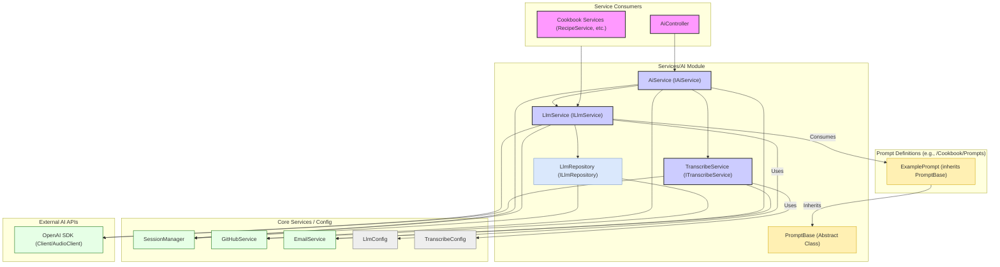

# Module/Directory: /Services/AI

**Last Updated:** 2025-01-20

> **Parent:** [`/Services`](../README.md)

## 1. Purpose & Responsibility

* **What it is:** This module provides centralized services for interacting with external Artificial Intelligence (AI) platforms, primarily OpenAI.
* **Key Responsibilities:**
    * Providing an interface (`ILlmService`) for interacting with OpenAI's chat completion models (GPT-3.5, GPT-4, etc.), including support for standard completions and structured output via function calling. [cite: Zarichney.Server/Services/AI/LlmService.cs]
    * Implementing support for OpenAI's Assistants API workflow (Assistants, Threads, Runs, Tool Calls). [cite: Zarichney.Server/Services/AI/LlmService.cs]
    * Providing an interface (`ITranscribeService`) for audio transcription using OpenAI's Whisper models. [cite: Zarichney.Server/Services/AI/TranscribeService.cs]
    * Defining configuration models (`LlmConfig`, `TranscribeConfig`) for AI service settings. [cite: Zarichney.Server/Services/AI/LlmService.cs, Zarichney.Server/Services/AI/TranscribeService.cs]
    * Providing an interface (`ILlmRepository`) and implementation (`LlmRepository`) for persisting LLM conversation logs (currently using GitHub). [cite: Zarichney.Server/Services/AI/LlmRepository.cs]
    * Defining data structures for conversation logging (`LlmConversation`, `LlmMessage`). [cite: Zarichney.Server/Services/AI/LlmRepository.cs]
    * Defining the base class for prompt definitions (`PromptBase`) used throughout the application. [cite: Zarichney.Server/Services/AI/PromptBase.cs]
* **Why it exists:** To abstract the complexities of interacting with specific AI APIs, provide a consistent interface for other application modules, and centralize AI-related configuration and utilities.

## 2. Architecture & Key Concepts

* **Core Services:**
    * `AiService`: Implements `IAiService` as a high-level orchestration service that integrates various AI-related services. Provides a simplified interface for audio transcription workflows (`ProcessAudioTranscriptionAsync`) and LLM completion operations (`GetCompletionAsync`) by coordinating `ILlmService`, `ITranscribeService`, `IGitHubService`, `IEmailService`, and `ISessionManager`. Used by `AiController` to reduce controller complexity and improve separation of concerns. [cite: Zarichney.Server/Services/AI/AiService.cs]
    * `LlmService`: Implements `ILlmService` using the official `OpenAI` .NET library (`OpenAIClient`). Handles chat completions, function calling (leveraging `PromptBase` definitions), and the stateful Assistants API flow. Incorporates Polly for retry logic. [cite: Zarichney.Server/Services/AI/LlmService.cs]
    * `TranscribeService`: Implements `ITranscribeService` using the `OpenAI` library's `AudioClient`. Handles audio file validation, transcription processing, filename generation, and error handling. Provides comprehensive methods for validating audio files (`ValidateAudioFile`) and processing complete audio files with metadata generation (`ProcessAudioFileAsync`). Uses Polly for retries and integrates with `IEmailService` for error notifications. [cite: Zarichney.Server/Services/AI/TranscribeService.cs]
    * `LlmRepository`: Implements `ILlmRepository` for saving conversation history. Currently delegates persistence to `IGitHubService`. [cite: Zarichney.Server/Services/AI/LlmRepository.cs, Zarichney.Server/Services/GitHub/GitHubService.cs]
* **Prompt Base Class:** `PromptBase` defines a standard structure for creating prompt definitions used with the `LlmService`. It standardizes properties like system instructions, model name, and function definitions. [cite: Zarichney.Server/Services/AI/PromptBase.cs]
* **Configuration:** Uses `LlmConfig` and `TranscribeConfig` classes (registered via `IConfig`) injected via DI to configure API keys, model names, and retry attempts. [cite: Zarichney.Server/Services/AI/LlmService.cs, Zarichney.Server/Services/AI/TranscribeService.cs]
* **Integration with Prompts:** `LlmService` consumes `PromptBase` implementations (defined elsewhere, e.g., [`/Cookbook/Prompts`](../../Cookbook/Prompts/README.md)) to get system instructions and function definitions for specific AI tasks. [cite: Zarichney.Server/Services/AI/LlmService.cs, Zarichney.Server/Services/AI/PromptBase.cs]
* **Session Management:** `LlmService` interacts with `ISessionManager` to initialize and retrieve conversation context (`LlmConversation`) stored within user sessions. `LlmRepository` requires the `Session` object to determine the storage path for logs. [cite: Zarichney.Server/Services/AI/LlmService.cs, Zarichney.Server/Services/AI/LlmRepository.cs, Zarichney.Server/Services/Sessions/SessionManager.cs]
* **Component Diagram:**

## 3. Interface Contract & Assumptions

* **Key Public Interfaces:**
    * `IAiService`: High-level service interface for AI operations. Provides coordinated methods for audio transcription workflows and LLM completions that leverage multiple underlying services.
    * `ILlmService`: Provides methods for interacting with OpenAI's LLM models.
    * `ITranscribeService`: Provides methods for audio transcription, validation, and processing. Includes `TranscribeAudioAsync` for basic transcription, `ValidateAudioFile` for audio file validation, and `ProcessAudioFileAsync` for full audio processing workflow with metadata generation.
    * `ILlmRepository`: Provides methods for persisting LLM conversation logs.
    * `PromptBase`: Base class for creating structured prompts for LLM interactions.
    * `IChatCompletionWrapper`: Interface abstraction for ChatCompletion objects that eliminates reflection usage. Provides standard properties (Content, Role, CreatedAt) for test scenarios. Implemented by ChatCompletionWrapper for production and TestChatCompletionWrapper in test framework.
* **Return Types:**
    * `CallFunction<T>` and `GetCompletionContent(List<ChatMessage>...)` now return an `LlmResult<T>` object containing both the primary `Data` and the `ConversationId`. This facilitates multi-turn conversations managed by the caller without requiring manual history reconstruction.
    * The single-prompt overload `GetCompletionContent(string userPrompt...)` continues to return just the completion string for backward compatibility.
* **Runtime Configuration Exceptions:**
    * All methods in `LlmService` will throw `ConfigurationMissingException` if the required API key is missing or invalid, resulting in the `OpenAIClient` being null.
    * Similarly, `TranscribeService.TranscribeAudioAsync()` will throw `ConfigurationMissingException` if the `AudioClient` is null due to missing API key configuration.
    * These exceptions are thrown at runtime when the methods are called, rather than at startup, allowing the application to start with partial functionality even when some configuration is missing.
* **Wrapper Pattern Contract**: Tests should use `AiServiceMockFactory.CreateChatCompletionWrapper()` instead of `CreateMockChatCompletion()` to avoid reflection-based object creation. The wrapper provides clean interface-based mocking with proper null handling and content extraction.
* **Assumptions:**
    * **API Keys:** Valid and correctly configured OpenAI API keys are essential (`LlmConfig.ApiKey`). [cite: Zarichney.Server/Services/AI/LlmService.cs]
    * **OpenAI Client Availability:** The injected `OpenAIClient` and `AudioClient` instances might be `null` if the required API key configuration is missing or invalid. The `LlmService` and `TranscribeService` implementations will need to handle this possibility appropriately by checking for null before using these clients. [cite: Zarichney.Server/Startup/ServiceStartup.cs]
    * **Network:** Reliable network connectivity to OpenAI API endpoints is required.
    * **Model Availability:** Assumes the specified AI models (`LlmConfig.ModelName`, `TranscribeConfig.ModelName`) are available and accessible via the provided API key.
    * **Prompt Validity:** `LlmService` assumes the provided `PromptBase` objects contain valid system prompts and function schemas (when used).
    * **GitHub Service (for Logging):** `LlmRepository` assumes the `IGitHubService` is correctly configured and functional for saving conversation logs. [cite: Zarichney.Server/Services/AI/LlmRepository.cs]
    * **Input Validity:** `TranscribeService` assumes the input `Stream` contains valid audio data in a format supported by Whisper. `LlmService` assumes input prompts are appropriate and do not violate OpenAI's content policies (though it handles `OpenAiContentFilterException`). [cite: Zarichney.Server/Services/AI/LlmService.cs]

## 4. Local Conventions & Constraints (Beyond Global Standards)

* **Configuration:** Requires `LlmConfig` and `TranscribeConfig` sections in application configuration. [cite: Zarichney.Server/appsettings.json]
* **External Dependency:** Tightly coupled to the OpenAI platform and its .NET SDK.
* **Retry Logic:** Uses Polly for handling transient errors during API calls. [cite: Zarichney.Server/Services/AI/LlmService.cs, Zarichney.Server/Services/AI/TranscribeService.cs]
* **Logging Persistence:** Conversation logging is currently implemented via `LlmRepository` using `IGitHubService`. Changes to logging destination would require modifying `LlmRepository`. [cite: Zarichney.Server/Services/AI/LlmRepository.cs]
* **Prompt Definition:** New AI prompts should be defined by inheriting from `PromptBase` and implementing all abstract members. These prompt classes are typically registered with DI during application startup. [cite: Zarichney.Server/Services/AI/PromptBase.cs, Zarichney.Server/Startup/Configuration/ConfigurationStartup.cs]

## 5. How to Work With This Code

* **Consumption:** Inject `ILlmService` for text/function-based AI interactions or `ITranscribeService` for audio transcription.
* **AI Task Definition:** Define new AI tasks by creating implementations of `PromptBase` (typically in domain-specific modules like `/Cookbook/Prompts`).
* **Configuration:** Ensure `LlmConfig` (API Key, Model Name) and `TranscribeConfig` are correctly set in application configuration (user secrets, environment variables, etc.).
* **Creating a New Prompt:** 
    1. Create a new class that inherits from `PromptBase`
    2. Implement all abstract members: `Name`, `Description`, `SystemPrompt`, `Model`, and `GetFunction()`
    3. Define the function schema in `GetFunction()` if using function calling
    4. The prompt is automatically registered via DI during startup (via `AddPrompts` method)
* **Testing:** Requires mocking `OpenAIClient`, `AudioClient`, `IGitHubService` (for `LlmRepository`), and potentially `ISessionManager`. Mocking `ILlmService` itself is common when testing services that consume it. Testing actual AI interactions requires careful consideration due to cost and latency.
* **Testing with Wrapper Pattern**: Use `IChatCompletionWrapper` for test scenarios requiring ChatCompletion objects. The `TestChatCompletionWrapper` class provides interface-based testing without reflection. Production code uses `ChatCompletionWrapper` to wrap OpenAI SDK objects.
* **Migration from Reflection**: Replace `AiServiceMockFactory.CreateMockChatCompletion()` calls with `CreateChatCompletionWrapper()` for clean interface-based testing. The new approach eliminates reflection usage identified as technical debt in PR #179.
* **Common Pitfalls / Gotchas:** Invalid or missing API keys. OpenAI API rate limits or downtime. Errors in function definition schemas provided by `PromptBase` implementations. Incorrect state management when using the Assistants API flow. OpenAI content filtering unexpectedly blocking requests or responses. Issues with `IGitHubService` preventing conversation log persistence.

## 6. Dependencies

* **Internal Code Dependencies:**
    * [`/Config`](../../Config/README.md): Consumes `LlmConfig`, `TranscribeConfig`.
    * [`/Services/GitHub`](../GitHub/README.md): Consumed by `LlmRepository`.
    * [`/Services/Sessions`](../Sessions/README.md): Consumed by `LlmService` and `LlmRepository`.
    * [`/Startup/Configuration`](../../Startup/ConfigurationStartup.cs): For registration of prompts via DI.
    * [`/Tests/Framework/Mocks`](../../Tests/Framework/Mocks/README.md): Test framework provides `TestChatCompletionWrapper` implementation and `AiServiceMockFactory` wrapper methods for interface-based testing.
* **External Library Dependencies:**
    * `OpenAI`: The official .NET SDK for interacting with OpenAI APIs.
    * `Polly`: Used for implementing retry logic.
    * `System.Text.Json`: Used for handling JSON data (e.g., function arguments).
    * `AutoMapper`: Used for mapping between `FunctionDefinition` and OpenAI's `FunctionToolDefinition`.
* **Dependents (Impact of Changes):**
    * [`/Cookbook`](../../Cookbook/README.md): Multiple services (`RecipeService`, `OrderService`, `RecipeRepository`, `WebScraperService`) consume `ILlmService`.
    * [`/Controllers/AiController.cs`](../../Controllers/AiController.cs): Now uses the high-level `IAiService` interface instead of directly integrating with multiple services. This improved architecture reduces the controller's responsibilities and provides better separation of concerns.
    * [`/Cookbook/Prompts`](../../Cookbook/Prompts/README.md): Contains implementations of `PromptBase`.
    * Changes to `IAiService`, `ILlmService`, `ITranscribeService`, or `PromptBase` interfaces would impact all consuming modules.

## 7. Rationale & Key Historical Context

* **Centralization:** Consolidates all direct AI API interactions into dedicated services, abstracting the specifics from the rest of the application.
* **Abstraction (`ILlmService`, `ITranscribeService`):** Provides stable interfaces, allowing consuming code to be less dependent on the specific AI provider or SDK details.
* **Logging Decoupling (`LlmRepository`):** Separates the concern of *how* conversations are logged from the core AI interaction logic in `LlmService`. Currently uses GitHub, but could be swapped to a different persistence mechanism by changing only `LlmRepository`.
* **PromptBase Relocation:** `PromptBase` was moved from `/Config` to this module where it more logically belongs with other AI-related functionality.

## 8. Known Issues & TODOs

* The Assistants API implementation in `LlmService` might require further refinement for robust state handling across multiple requests or complex tool interactions.
* Error handling for `OpenAiContentFilterException` could be made more sophisticated in consuming services. [cite: Zarichney.Server/Services/AI/LlmService.cs]
* The `LlmRepository`'s dependency on `IGitHubService` makes conversation logging dependent on GitHub availability and configuration. Consider alternative logging destinations (database, dedicated logging service) for better robustness or scalability.
* Lack of support for streaming responses from the LLM, which could improve perceived latency for longer completions.
* Could be extended to support other AI models or providers if needed in the future.
* Migration opportunity: Production code could be gradually migrated to use IChatCompletionWrapper pattern for improved testability, though current wrapper approach maintains compatibility with OpenAI SDK.