# Module/Directory: /Auth

**Last Updated:** 2025-05-22

> **Parent:** [`Server`](../README.md)

## 1. Purpose & Responsibility

* **What it is:** This directory contains the core authentication and authorization logic for the Zarichney API, managing users, roles, API keys, and session tokens. [cite: Docs/AuthSystemMaintenance.md, Zarichney.Server/Controllers/AuthController.cs]
* **Key Responsibilities:**
    * User registration, login, email confirmation, and password reset flows. [cite: Zarichney.Server/Auth/Commands/RegisterCommand.cs, Zarichney.Server/Auth/Commands/LoginCommand.cs, Zarichney.Server/Auth/Commands/ConfirmEmailCommand.cs, Zarichney.Server/Auth/Commands/ForgotPasswordCommand.cs, Zarichney.Server/Auth/Commands/ResetPasswordCommand.cs]
    * JWT access token generation and validation. [cite: Zarichney.Server/Auth/AuthService.cs]
    * Refresh token generation, storage (database), validation, usage tracking, and revocation. [cite: Zarichney.Server/Auth/AuthService.cs, Zarichney.Server/Auth/Models/RefreshToken.cs, Zarichney.Server/Auth/Commands/RefreshTokenCommand.cs, Zarichney.Server/Auth/Commands/RevokeTokenCommand.cs]
    * Management of JWT and refresh tokens via secure, HttpOnly cookies. [cite: Zarichney.Server/Auth/CookieAuthManager.cs, Docs/AuthRefactoring.md]
    * API Key generation, validation, and revocation for non-interactive authentication. [cite: Zarichney.Server/Auth/ApiKeyService.cs, Zarichney.Server/Auth/Commands/ApiKeyCommands.cs]
    * Role definition (e.g., "admin") and management (assigning/removing roles). [cite: Zarichney.Server/Auth/RoleManager.cs, Zarichney.Server/Auth/Commands/RoleCommands.cs]
    * Database schema management for identity entities using EF Core. [cite: Zarichney.Server/Auth/UserDbContext.cs, Zarichney.Server/Auth/Migrations/]
    * Middleware for API Key and general authentication. [cite: Zarichney.Server/Services/Auth/AuthenticationMiddleware.cs]
* **Why it exists:** To centralize all authentication and authorization concerns, separating them from other application logic like cookbook or payment processing. Provides a secure and maintainable way to manage user identity and access control. [cite: Docs/AuthRefactoring.md]
* **Submodules:**
    * [`Commands`](./Commands/README.md) - Contains MediatR command handlers for auth operations (Register, Login, etc.).
    * [`Models`](./Models/README.md) - Defines data transfer objects and database entities related to authentication (ApiKey, RefreshToken, AuthResult).
    * [`Migrations`](./Migrations/README.md) - Holds Entity Framework Core database migration files for the UserDbContext.

## 2. Architecture & Key Concepts

* **Core Technology:** ASP.NET Core Identity provides the foundation for user management (users, roles, password hashing, claims). [cite: Zarichney.Server/Auth/AuthConfigurations.cs, Zarichney.Server/Auth/UserDbContext.cs]
* **Database:** PostgreSQL via Entity Framework Core (`UserDbContext`) stores user accounts, roles, refresh tokens, and API keys. [cite: Zarichney.Server/Auth/UserDbContext.cs, Zarichney.Server/Auth/Models/RefreshToken.cs, Zarichney.Server/Auth/Models/ApiKey.cs]
* **Authentication Mechanisms:**
    * **JWT Bearer Tokens:** Standard mechanism using short-lived access tokens. [cite: Zarichney.Server/Auth/AuthConfigurations.cs]
    * **Refresh Tokens:** Long-lived tokens stored in the database, used to obtain new access tokens. [cite: Zarichney.Server/Auth/Models/RefreshToken.cs, Zarichney.Server/Auth/AuthService.cs]
    * **API Keys:** For server-to-server or non-interactive clients via `X-Api-Key` header. [cite: Zarichney.Server/Services/Auth/AuthenticationMiddleware.cs, Zarichney.Server/Auth/ApiKeyService.cs]
    * **Mock Authentication:** Configurable fallback authentication system for non-Production environments when Identity Database is unavailable. Requires explicit enabling via `MockAuth:Enabled=true` configuration. Provides authenticated access for development and testing with configurable mock user roles. Supports dynamic role assignment via `X-Mock-Roles` header in Development environment. [cite: Zarichney.Server/Services/Auth/MockAuthHandler.cs, Zarichney.Server/Startup/AuthenticationStartup.cs, Zarichney.Server/Config/ConfigModels.cs]
* **Token Transport:** JWT access tokens and refresh tokens are primarily handled via secure, HttpOnly cookies (`AuthAccessToken`, `AuthRefreshToken`) managed by `CookieAuthManager`. [cite: Zarichney.Server/Auth/CookieAuthManager.cs, Docs/AuthRefactoring.md]
* **Design Pattern:** CQRS (Command Query Responsibility Segregation) implemented using MediatR. Authentication actions are handled by specific command handlers in the `Commands` directory. [cite: Zarichney.Server/Auth/Commands/, Docs/AuthRefactoring.md]
* **Key Classes:**
    * `AuthController`: Exposes HTTP endpoints for authentication actions. [cite: Zarichney.Server/Controllers/AuthController.cs]
    * `AuthService`: Provides core token generation and refresh token DB operations. [cite: Zarichney.Server/Auth/AuthService.cs]
    * `ApiKeyService`: Manages API key lifecycle, validation, and authentication. [cite: Zarichney.Server/Auth/ApiKeyService.cs]
    * `CookieAuthManager`: Handles setting/clearing authentication cookies. [cite: Zarichney.Server/Auth/CookieAuthManager.cs]
    * `RoleManager`: Manages application roles. [cite: Zarichney.Server/Auth/RoleManager.cs]
    * `UserDbContext`: EF Core database context for Identity entities. [cite: Zarichney.Server/Auth/UserDbContext.cs]
    * `AuthenticationMiddleware`: Middleware to handle authentication via `X-Api-Key` header or JWT. Respects endpoints marked with the `[AllowAnonymous]` attribute and skips authentication for them. [cite: Zarichney.Server/Services/Auth/AuthenticationMiddleware.cs]
    * `RefreshTokenCleanupService`: Background service to remove expired/used tokens. [cite: Zarichney.Server/Auth/RefreshTokenCleanupService.cs]
    * `MockAuthHandler`: Authentication handler for non-Production environments when Identity DB is unavailable. Creates mock authenticated users with configurable roles. [cite: Zarichney.Server/Services/Auth/MockAuthHandler.cs]
    * `RoleInitializer`: Hosted service that initializes application roles and seeds a default administrator user in non-Production environments when a real database is available. [cite: Zarichney.Server/Auth/RoleInitializer.cs]
* **Core Logic Flow (Login):**
    1.  `AuthController.Login` receives email/password. [cite: Zarichney.Server/Controllers/AuthController.cs]
    2.  Delegates to `LoginCommandHandler` (MediatR). [cite: Zarichney.Server/Auth/Commands/LoginCommand.cs]
    3.  Handler uses `UserManager` to validate credentials and check email confirmation.
    4.  If valid, calls `AuthService.GenerateJwtTokenAsync` and `AuthService.GenerateRefreshToken`.
    5.  Saves refresh token via `AuthService.SaveRefreshTokenAsync`.
    6.  Handler returns `AuthResult` with tokens.
    7.  `AuthController` calls `CookieAuthManager.SetAuthCookies` to store tokens in response cookies. [cite: Zarichney.Server/Controllers/AuthController.cs, Zarichney.Server/Auth/CookieAuthManager.cs]
* **Component Diagram**:

```mermaid
%% Component diagram for the Auth Services module
graph TD
    subgraph AuthServices ["Services/Auth Module"]
        direction LR
        AuthSvc["AuthService (IAuthService)"]
        ApiKeySvc["ApiKeyService (IApiKeyService)"]
        CookieMgr["CookieAuthManager"]
        RoleMgrSvc["RoleManager (IRoleManager)"]
        RoleInit["RoleInitializer"]
        CleanupSvc["RefreshTokenCleanupService"]
        UserDbCtx["UserDbContext"]
        AuthMw["AuthenticationMiddleware"]
        CmdHandlers["Command Handlers (MediatR)"]
        
        %% Auth Models
        AppUser["ApplicationUser"]
        RefreshTokenModel["RefreshToken"]
        ApiKeyModel["ApiKey"]
        JwtSettingsModel["JwtSettings"]
    end

    subgraph ExternalConsumers ["Service Consumers / Triggers"]
        AuthController["AuthController"]
        OtherControllers["Other Controllers (using [Authorize])"]
        Scheduler["BackgroundService Scheduler"]
        Startup["ApplicationStartup"]
    end

    subgraph CoreServices ["Core Services / Config / External"]
        AspNetIdentity["ASP.NET Core Identity"]
        MediatR["MediatR"]
        EmailSvc["EmailService"]
        PostgresDB[("PostgreSQL Database")]
        JwtConfig["JwtSettings Configuration"]
    end

    %% Interactions within Auth Module
    AuthSvc --> UserDbCtx
    AuthSvc --> AppUser
    AuthSvc --> RefreshTokenModel
    AuthSvc -- Uses --> JwtSettingsModel
    AuthSvc -- Uses --> AspNetIdentity

    ApiKeySvc --> UserDbCtx
    ApiKeySvc --> ApiKeyModel
    ApiKeySvc --> AppUser
    ApiKeySvc --> AspNetIdentity

    CookieMgr -- Uses --> JwtSettingsModel

    RoleMgrSvc --> AspNetIdentity
    RoleMgrSvc --> UserDbCtx
    
    RoleInit --> RoleMgrSvc

    CleanupSvc --> UserDbCtx
    CleanupSvc --> RefreshTokenModel

    CmdHandlers --> AuthSvc
    CmdHandlers --> ApiKeySvc
    CmdHandlers --> RoleMgrSvc
    CmdHandlers --> EmailSvc
    CmdHandlers --> UserDbCtx
    CmdHandlers --> AspNetIdentity
    CmdHandlers -- Returns --> CookieMgr

    AuthMw -- Uses --> ApiKeySvc
    AuthMw -- Checks --> JwtSettingsModel

    UserDbCtx -- Contains --> AppUser
    UserDbCtx -- Contains --> RefreshTokenModel
    UserDbCtx -- Contains --> ApiKeyModel
    UserDbCtx -- Interacts With --> PostgresDB

    JwtSettingsModel -- Loaded From --> JwtConfig

    %% External Interactions
    AuthController --> MediatR
    MediatR -- Routes To --> CmdHandlers
    AuthController --> CookieMgr

    OtherControllers -- Authenticated By --> AuthMw
    OtherControllers -- Authorized Via --> AspNetIdentity

    Scheduler --> CleanupSvc
    
    Startup --> RoleInit
    Startup --> AuthMw
    Startup --> UserDbCtx

    %% Styling
    classDef service fill:#ccf,stroke:#333,stroke-width:2px;
    classDef middleware fill:#eee,stroke:#666,stroke-width:1px;
    classDef consumer fill:#f9f,stroke:#333,stroke-width:2px;
    classDef db fill:#f5deb3,stroke:#8b4513,stroke-width:2px;
    classDef external fill:#e6ffe6,stroke:#006400,stroke-width:1px;
    classDef config fill:#eee,stroke:#666,stroke-width:1px;
    classDef handler fill:#dae8fc,stroke:#6c8ebf,stroke-width:1px;
    classDef model fill:#d5e8d4,stroke:#82b366,stroke-width:1px;

    class AuthSvc,ApiKeySvc,CookieMgr,RoleMgrSvc,CleanupSvc,RoleInit service;
    class UserDbCtx db;
    class AuthMw middleware;
    class CmdHandlers handler;
    class AuthController,OtherControllers,Scheduler,Startup consumer;
    class AspNetIdentity,MediatR,EmailSvc external;
    class PostgresDB db;
    class JwtConfig,JwtSettingsModel config;
    class AppUser,RefreshTokenModel,ApiKeyModel model;
```

## 3. Interface Contract & Assumptions

* **Key Public Interfaces (for external callers):** Primarily the HTTP endpoints defined in `AuthController` (e.g., `/register`, `/login`, `/refresh`, `/api-keys`). Secondary interfaces include `IApiKeyService` and `IRoleManager` if consumed directly by other internal services (though most interaction is via `AuthController`).
    * `POST /api/auth/login`:
        * **Purpose:** Authenticate user, set auth cookies.
        * **Preconditions:** User must exist and have a confirmed email address. Request body must contain valid email/password.
        * **Postconditions:** On success, HttpOnly `AuthAccessToken` and `AuthRefreshToken` cookies are set in the response. Refresh token is stored in the database.
        * **Error Handling:** Returns 400 Bad Request for invalid credentials, unconfirmed email, or missing input.
    * `POST /api/auth/refresh`:
        * **Purpose:** Obtain new access/refresh tokens using existing valid refresh token cookie.
        * **Preconditions:** Valid, non-expired, non-used, non-revoked `AuthRefreshToken` cookie must be present in the request. Associated user must exist.
        * **Postconditions:** On success, new HttpOnly `AuthAccessToken` and `AuthRefreshToken` cookies are set. Old refresh token is marked as used in DB, new one is stored.
        * **Error Handling:** Returns 401 Unauthorized if refresh token cookie is missing, invalid, expired, used, or revoked. Auth cookies are cleared on failure.
    * `POST /api/auth/api-keys` (Admin Only):
        * **Purpose:** Create an API key for the calling admin user.
        * **Preconditions:** Caller must be authenticated via JWT and have the 'admin' role. Request body must contain required fields (`Name`).
        * **Postconditions:** New API key record created in the database. The API key *value* is returned in the response (only time it's shown).
        * **Error Handling:** Returns 401/403 if not authenticated/authorized. Returns 400 for invalid input.
    * Any endpoint using `[Authorize]`:
        * **Purpose:** Secure access to resources/actions.
        * **Preconditions:** Request must include a valid, non-expired `AuthAccessToken` cookie OR a valid, active `X-Api-Key` header.
        * **Postconditions:** User identity (ID, roles, etc.) is populated in `HttpContext.User`.
        * **Error Handling:** Returns 401 Unauthorized if no valid token/key is provided or if the token/key is invalid/expired. Returns 403 Forbidden if authenticated but lacks required roles (`[Authorize(Roles = "...")]`).
    * Any endpoint using `[AllowAnonymous]`:
        * **Purpose:** Allow access without authentication.
        * **Preconditions:** None. Endpoint can be accessed without any authentication.
        * **Postconditions:** No user identity is required. The authentication middleware will skip validation for these endpoints.
        * **Error Handling:** Standard response based on the controller/action logic, not related to authentication.
* **Critical Assumptions:**
    * **External Systems/Config:** Assumes PostgreSQL database is available and connection string (`IdentityConnection`) is correct. Assumes `JwtSettings` (SecretKey, Issuer, Audience, Expiry) are configured securely for production environments. For development/testing, the system will generate a temporary JWT signing key if `JwtSettings:SecretKey` is missing or invalid, but this is not suitable for production use. Assumes `IEmailService` is configured and functional for registration/password reset flows.
    * **Data Integrity:** Assumes `UserDbContext` schema matches the entities defined in `Models/`. Relies on EF Core Identity for password hashing and token generation integrity. Assumes uniqueness constraints (Email, API Key value) are enforced by the database.
    * **Implicit Constraints:** Assumes client browsers correctly handle HttpOnly, Secure, SameSite=Lax cookies. Assumes clock synchronization between server instances for JWT validation (minimal skew allowed by default). `RefreshTokenCleanupService` relies on `BackgroundService` infrastructure.

## 4. Local Conventions & Constraints (Beyond Global Standards)

* **Configuration:** Requires `ConnectionStrings:UserDatabase` and `JwtSettings` section in configuration (`appsettings.json`, user secrets, environment variables, AWS SSM/Secrets Manager). Optional `MockAuth` section for configuring mock authentication when Identity Database is unavailable in non-Production environments. [cite: Zarichney.Server/Startup/AuthenticationStartup.cs, Zarichney.Server/Config/ConfigModels.cs]
* **Directory Structure:** Commands in `Commands/`, DB context/entities/DTOs in `Models/`, Migrations in `Migrations/`.
* **Technology Choices:** ASP.NET Core Identity, EF Core with PostgreSQL (`Npgsql.EntityFrameworkCore.PostgreSQL`), MediatR for CQRS, JWT for access tokens.
* **Security Notes:** 
    * JWT Secret Key is critical; must be kept confidential. If not provided (null, empty, whitespace, or placeholder), the system will generate a secure random key for the current instance's lifetime. This temporary key is logged as a warning and is suitable only for development/testing purposes.
    * Temporary keys are not suitable for production environments as they will cause token validation failures across application restarts or in multi-instance deployments.
    * Always configure a proper secret key for production using user secrets, environment variables, or other secure configuration methods.
    * Refresh tokens are stored in the DB but should be treated as sensitive. 
    * API Keys are stored hashed/validated securely. 
    * Password reset and email confirmation tokens have limited validity. 
    * `setup-admin` endpoint is potentially insecure and should be reviewed/removed post-setup. [cite: Zarichney.Server/Controllers/AuthController.cs] 
    * HttpOnly cookies mitigate XSS risk for tokens.
* **Database Migrations:** Managed via EF Core CLI (`dotnet ef migrations add`, `dotnet ef database update`). Production migrations applied via SQL script generated by pipeline. [cite: Zarichney.Server/Auth/Migrations/ApplyMigrations.sh, Docs/PostgreSqlMaintenance.md]

## 5. How to Work With This Code

* **Setup:** Requires a running PostgreSQL instance. Configure `ConnectionStrings:UserDatabase` and `JwtSettings` (especially `SecretKey`) via user secrets or environment variables for local development. For quick development starts, you can omit the `JwtSettings:SecretKey` and the system will generate a temporary key, but this is not recommended for anything beyond local testing. Run EF Core migrations (`dotnet ef database update --context UserDbContext`). For mock authentication when database is unavailable, create `appsettings.Development.json` with MockAuth configuration: `{"MockAuth": {"Enabled": true, "DefaultRoles": ["User", "Admin"], "DefaultUsername": "MockUser", "DefaultEmail": "mock@example.com", "DefaultUserId": "mock-user-id"}}`. [cite: Docs/PostgreSqlMaintenance.md]
* **Testing:** Requires mocking `UserManager`, `RoleManager`, `IAuthService`, `IEmailService`, `UserDbContext` (or using an in-memory provider/test database). Test command handlers individually. Integration tests needed for full flows (register -> confirm -> login -> refresh). Test scripts available in `Scripts/` (`test-auth-endpoints.*`). [cite: Zarichney.Server/Scripts/test-auth-endpoints.ps1, Zarichney.Server/Scripts/test-auth-endpoints.sh, Zarichney.Server/Scripts/TestAuthEndpoints.cs]
* **Common Pitfalls / Gotchas:** JWT secret mismatch between generation and validation (especially when using temporary keys in multi-instance environments). Incorrect cookie settings (`HttpOnly`, `Secure`, `SameSite`). Database connection issues. Migration mismatches. Handling token expiry and refresh logic correctly on the client-side (triggering `/refresh` on 401). Ensuring background cleanup service (`RefreshTokenCleanupService`) is running. Forgetting to include `credentials: 'include'` in frontend fetch calls.

## 6. Dependencies

* **Internal Code Dependencies:**
    * [`/Config`](../../Config/README.md) - Consumes `JwtSettings`, `ClientConfig`, `ServerConfig`.
    * [`/Services/Email`](../Email/README.md) - Used by commands for sending confirmation/password reset emails.
* **External Library Dependencies:**
    * `Microsoft.AspNetCore.Identity.EntityFrameworkCore`: Core Identity framework.
    * `Microsoft.AspNetCore.Authentication.JwtBearer`: JWT validation middleware.
    * `Npgsql.EntityFrameworkCore.PostgreSQL`: EF Core provider for PostgreSQL.
    * `MediatR`: CQRS implementation.
    * `System.IdentityModel.Tokens.Jwt`: JWT generation.
* **Dependents (Impact of Changes):**
    * `/Controllers/` (Any using `[Authorize]`): Rely on this module's authentication middleware and claims principal setup.
    * `Program.cs`: Configures Identity, JWT authentication, API Key middleware, registers auth services.
    * `/Services/Sessions/SessionMiddleware.cs`: Uses `HttpContext.User` populated by this module's authentication.
    * `/Services/Auth/AuthenticationMiddleware.cs`: Relies on `IApiKeyService`.

## 7. Rationale & Key Historical Context

* **CQRS with MediatR:** Chosen to break down the monolithic `AuthService` into smaller, more manageable, testable command handlers, improving maintainability. [cite: Docs/AuthRefactoring.md]
* **HttpOnly Cookies:** Implemented to enhance security against Cross-Site Scripting (XSS) attacks by preventing client-side JavaScript from accessing tokens. [cite: Docs/AuthRefactoring.md]
* **Database-Stored Refresh Tokens:** Provides persistence and allows for features like revocation and tracking usage across devices. Enables longer user sessions without compromising access token security. [cite: Docs/AuthRefactoring.md, Zarichney.Server/Auth/Models/RefreshToken.cs]
* **API Keys:** Added to support non-interactive authentication scenarios (e.g., automated scripts, server-to-server). [cite: Docs/ApiKeyAuthentication.md]
* **ASP.NET Core Identity:** Leveraged for its robust, built-in features for user management, password hashing, role management, and token providers (email confirmation, password reset).
* **[AllowAnonymous] Attribute Recognition:** Replaced the hardcoded route bypass list with standard ASP.NET Core `[AllowAnonymous]` attribute checking to improve maintainability and ensure all endpoints marked for anonymous access work correctly without API key validation.
* **Centralized Authentication Middleware:** Renamed from `ApiKeyAuthMiddleware` to `AuthenticationMiddleware` to better reflect its general authentication role. API key authentication logic was moved into the `ApiKeyService` class for better separation of concerns and maintainability.

## 8. Known Issues & TODOs

* Refresh token cleanup depends on the `RefreshTokenCleanupService` background task running reliably. Failures could lead to DB bloat.
* Consider adding Multi-Factor Authentication (MFA) support.
* Consider adding social login provider integration (Google, etc.).
* API key management currently relies on JWT auth for the admin; consider if API key auth should also be allowed for admins to manage keys.
