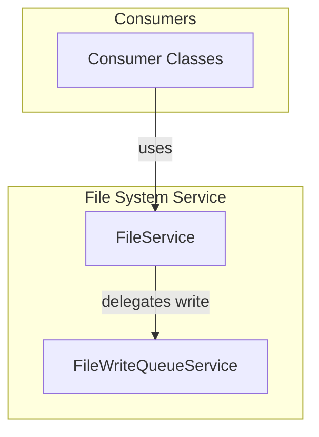

# Module/Directory: /Services/FileSystem

**Last Updated:** 2025-04-24

> **Parent:** [`/Services`](../README.md)

## 1. Purpose & Responsibility

* **What it is:** This module provides a comprehensive abstraction layer for file system operations, including both direct synchronous file access and a queue-based asynchronous writing mechanism.
* **Key Responsibilities:**
  * Defines `IFileService` for general file I/O operations.
  * Defines `IFileWriteQueueService` for background-safe, serialized write operations.
  * Implements `FileService` which exposes read, delete, list, and format-specific write functions.
  * Delegates write operations from `FileService` to `FileWriteQueueService` while preserving interface compatibility.
  * Implements `FileWriteQueueService` to manage a background-safe queue for write operations.
* **Why it exists:** To unify all file operations under one interface for consumer convenience, while internally separating concurrency concerns into a specialized component.

## 2. Architecture & Key Concepts

* `FileService` is the main consumer-facing class.
* `FileWriteQueueService` handles background queuing and concurrency-safe file writing.
* Writes are delegated from `FileService` to `FileWriteQueueService`.

## 3. Interface Contract & Assumptions

* `IFileService`
  * `WriteToFile(...)`: Delegates to `IFileWriteQueueService.WriteToFileAndWaitAsync`.
  * `WriteToFileAsync(...)`: Delegates to `IFileWriteQueueService.QueueWrite`.
  * Consumers assume the interface is a single point for all file operations.
* `IFileWriteQueueService`
  * `QueueWrite(...)`: Fire-and-forget queue-based write.
  * `WriteToFileAndWaitAsync(...)`: Awaitable background-safe write.
* **Assumptions:**
  * Files are accessed within valid OS paths.
  * Callers assume write durability after `WriteToFile` completes.
  * JSON-serializable types are passed to `.json` writes.
  * Application has access rights for specified file paths.

## 4. Local Conventions & Constraints

* All writes are serialized via a background queue to ensure thread safety.
* Queue uses `TaskCompletionSource<bool>` for signaling write completion.
* JSON is serialized using `System.Text.Json` with relaxed encoding.
* `WriteToFile` and `WriteToFileAsync` must not be renamed despite delegation (contract preservation).

## 5. How to Work With This Code

* Inject `IFileService` for general file access.
* Use `WriteToFile` when you need to ensure file is written before proceeding.
* Use `WriteToFileAsync` when fire-and-forget behavior is acceptable.
* All write methods internally queue the operation via `IFileWriteQueueService`.
* To test `FileService`, mock `IFileWriteQueueService`.
* To test `FileWriteQueueService`, mock `IFileService.CreateFile()`.

## 6. Dependencies

* **Internal:**
  * [`../PdfGeneration/README.md`](../PdfGeneration/README.md) (calls `FileService.CreateFile`)
  * [`../Email/README.md`](../Email/README.md) (template file read/write)
* **External:**
  * `System.Text.Json` – JSON handling
  * `Serilog` – Logging
  * `Polly` – Retry policy for reads
  * `SixLabors.ImageSharp` – JPEG encoding for file generation

## 7. Rationale & Key Historical Context

* Originally, `FileService` handled both reading and writing, including concurrency management.
* A separation was introduced to delegate write responsibilities to `FileWriteQueueService`, improving cohesion and allowing `FileService` to remain consumer-friendly.
* This change also ensured backward compatibility for existing consumers using `IFileService`.

## 8. Known Issues & TODOs

* **TODO:** Consider adding persistent queuing to `FileWriteQueueService` to ensure write durability across process restarts.
* **TODO:** Benchmark the queue’s throughput under heavy concurrent load.
* **KNOWN ISSUE:** Queue is memory-only and writes are lost if the app shuts down before completion.
* **TODO:** Add metrics/logging around queue length and write durations for observability.
