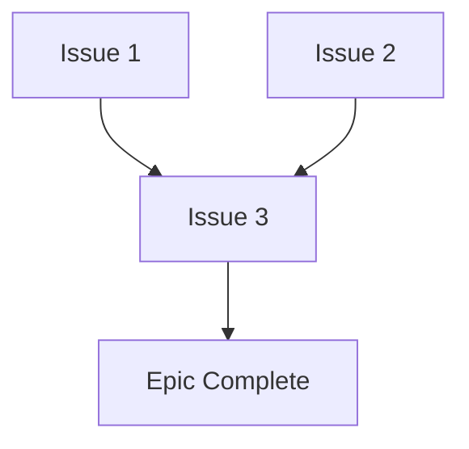

# Epic #291 - Issue #309 Execution Plan

**Issue:** #309 - Iteration 1.3: GitHub Workflow Skill - Issue Creation
**Epic:** #291 - Agent Skills & Slash Commands Integration
**Iteration:** 1 - Foundation
**Branch:** `section/iteration-1` (continuing from Issues #311, #310)
**Created:** 2025-10-25

---

## 1. Mission Objective

Create `github-issue-creation` skill that streamlines GitHub issue creation with automated context collection, template application, and proper labeling, eliminating manual "hand bombing" of context (5 min → 1 min, 80% reduction).

**Expected Outcome:** Comprehensive 4-phase workflow enabling automated issue creation with all 5 issue type templates, label compliance automation, and seamless /create-issue command integration preparation.

---

## 2. Dependencies

**Depends On:**
- ✅ Issue #310 complete (documentation-grounding, core-issue-focus skills operational)
- ✅ Issue #311 complete (working-directory-coordination skill operational)
- ✅ Epic branch exists: `epic/skills-commands-291`
- ✅ Section branch exists: `section/iteration-1`
- ✅ Official skills structure established

**Blocks:**
- Issue #305 (Iteration 2.3: Workflow Commands - Status & Coverage Report)
- /create-issue command implementation

---

## 3. CRITICAL STRUCTURE CORRECTION

**⚠️ IMPORTANT:** Issue #309 body references creating `metadata.json` file, but this is **INCORRECT** per official Claude Code skills structure established in Issues #311 and #310.

**CORRECT STRUCTURE (per official-skills-structure.md):**
- ✅ YAML frontmatter at top of SKILL.md
- ✅ Required fields: name, description
- ❌ NO separate metadata.json file

**Action:** PromptEngineer must follow official structure, not issue body specification error.

---

## 4. Execution Strategy

### Approach
**Single Agent Engagement:** PromptEngineer creates complete skill on `section/iteration-1` branch with individual commits per major deliverable.

### Agent Assignment
- **Primary:** PromptEngineer (skill creation, SKILL.md authoring, template development)
- **Validation:** BugInvestigator or ArchitecturalAnalyst (integration testing)
- **Quality:** ComplianceOfficer (section-level validation after all Iteration 1 complete)

### Branch Strategy
Continue using `section/iteration-1` branch:
- All commits for Issue #309 go on this branch
- Individual commits per logical group
- Section PR created after Issues #311, #310, #309, #308 all complete

---

## 5. Detailed Task Breakdown

### Skill: github-issue-creation

**Location:** `.claude/skills/github/github-issue-creation/`

**Directory Structure:**
```bash
.claude/skills/github/github-issue-creation/
├── SKILL.md (with YAML frontmatter, ~3,000 tokens, <500 lines)
└── resources/
    ├── templates/
    │   ├── feature-request-template.md
    │   ├── bug-report-template.md
    │   ├── epic-template.md
    │   ├── technical-debt-template.md
    │   └── documentation-request-template.md
    ├── examples/
    │   ├── comprehensive-feature-example.md
    │   ├── bug-with-reproduction.md
    │   └── epic-milestone-example.md
    └── documentation/
        ├── issue-creation-guide.md
        ├── label-application-guide.md
        └── context-collection-patterns.md
```

---

### Subtask 1: Create Directory Structure and SKILL.md

**YAML Frontmatter Required:**
```yaml
---
name: github-issue-creation
description: Streamline GitHub issue creation with automated context collection, template application, and proper labeling. Use when creating feature requests, documenting bugs, proposing architectural improvements, tracking technical debt, or creating epic milestones.
---
```

**SKILL.md Required Sections (~3,000 tokens, <500 lines):**

1. **Purpose & Mission**
   - Eliminate manual "hand bombing" of context
   - 5 min → 1 min issue creation (80% reduction)
   - Comprehensive context collection automation
   - Template-driven consistency

2. **When to Use**
   - Creating new feature requests from user requirements
   - Documenting bugs with comprehensive reproduction context
   - Proposing architectural improvements with analysis
   - Tracking technical debt items systematically
   - Creating epic milestones with progression tracking

3. **4-Phase Workflow**

   **Phase 1: Context Collection**
   - Gather user requirements and pain points
   - Analyze existing codebase for related functionality
   - Review similar issues and PRs for patterns
   - Collect relevant code snippets and file paths
   - Identify acceptance criteria and success metrics
   - Automated grep/glob for context discovery

   **Phase 2: Template Selection**
   - Feature Request Template (enhancement, new capability)
   - Bug Report Template (defect, unexpected behavior)
   - Epic Template (milestone, multi-issue initiative)
   - Technical Debt Template (refactoring, improvement)
   - Documentation Request Template (knowledge gap, guide missing)

   **Phase 3: Issue Construction**
   - Title: Clear, actionable, follows naming conventions
   - Description: Comprehensive context using selected template
   - Labels: Apply per GitHubLabelStandards.md (type, priority, effort, component MANDATORY)
   - Milestone: Link to epic if applicable
   - Assignees: Identify domain experts
   - Related Issues: Link dependencies (blocks, depends on)

   **Phase 4: Validation & Submission**
   - Verify all template sections completed
   - Validate label compliance with GitHubLabelStandards.md
   - Check for duplicate issues (search by title keywords)
   - Confirm acceptance criteria clarity
   - Submit via gh CLI: `gh issue create --title "..." --body "..." --label "..." --milestone "..."`

4. **Target Agent Patterns**
   - **Claude (Codebase Manager):** Epic creation, comprehensive issue planning
   - **BugInvestigator:** Bug reports with root cause analysis
   - **ArchitecturalAnalyst:** Technical debt, architecture improvements
   - **TestEngineer:** Test coverage issues, quality improvements

5. **Label Compliance Automation**
   - Type labels: `type: feature`, `type: bug`, `type: epic`, `type: debt`, `type: docs`
   - Priority labels: `priority: critical`, `priority: high`, `priority: medium`, `priority: low`
   - Effort labels: `effort: tiny`, `effort: small`, `effort: medium`, `effort: large`, `effort: epic`
   - Component labels: `component: api`, `component: website`, `component: docs`, `component: ci-cd`, etc.
   - Status labels: `status: ready`, `status: blocked`, `status: in-progress`

6. **Integration with /create-issue Command**
   - Command interface: `/create-issue <type> [--title "..."] [--description "..."]`
   - Skill provides implementation logic
   - Command handles argument parsing, user interaction
   - Seamless delegation pattern

7. **Resources References**
   - Templates: 5 issue type templates for immediate use
   - Examples: 3 comprehensive examples demonstrating workflow
   - Documentation: 3 guides for context collection, labels, process

8. **Progressive Loading Integration**
   - Metadata discovery: ~100 tokens
   - Full instructions: ~3,000 tokens
   - Resources: on-demand (2,000-4,000 tokens)

**Commit:** `feat: create github-issue-creation skill (#309)`

---

### Subtask 2: Create Issue Type Templates (resources/templates/)

**1. feature-request-template.md**
```markdown
# Feature Request: [Feature Name]

## User Value Proposition
**As a** [user type]
**I want** [specific capability]
**So that** [business value or outcome]

## Current Pain Point
[What problem does this solve? What's the current workaround?]

## Proposed Solution
### High-Level Approach
[How should this be implemented at a conceptual level?]

### Acceptance Criteria
- [ ] [Specific testable outcome 1]
- [ ] [Specific testable outcome 2]
- [ ] [Specific testable outcome 3]

### Technical Considerations
- **Affected Components:** [List modules/services impacted]
- **Dependencies:** [External libraries, APIs, services needed]
- **Performance Impact:** [Expected load, scalability concerns]
- **Security Considerations:** [Auth, validation, data protection]

## Integration Points
- **Existing Functionality:** [How does this integrate with current features?]
- **API Changes:** [New endpoints, modified contracts]
- **Database Changes:** [Schema updates, migrations needed]

## Success Metrics
- **User Impact:** [How many users benefit? Usage frequency?]
- **Performance Target:** [Response time, throughput expectations]
- **Quality Gate:** [Test coverage, documentation completeness]

## Additional Context
[Screenshots, mockups, user feedback, related issues]

---
**Labels:** type: feature, priority: [high/medium/low], effort: [tiny/small/medium/large], component: [relevant]
**Milestone:** [Epic if applicable]
**Related Issues:** [Links to dependencies or blockers]
```

**2. bug-report-template.md**
```markdown
# Bug Report: [Brief Description]

## Environment
- **Platform:** [OS, browser, device]
- **Version:** [Application version, commit hash]
- **Configuration:** [Relevant settings, environment variables]

## Expected Behavior
[What should happen?]

## Actual Behavior
[What actually happens?]

## Reproduction Steps
1. [Step 1 with specific details]
2. [Step 2 with specific details]
3. [Step 3 - point where bug occurs]

**Reproducibility:** [Always / Sometimes / Rare]

## Error Messages
```
[Exact error text, stack traces, logs]
```

## Impact Assessment
- **Severity:** [Critical / High / Medium / Low]
  - Critical: System down, data loss
  - High: Major functionality broken
  - Medium: Workaround exists
  - Low: Cosmetic, edge case
- **Affected Users:** [All / Subset / Edge case]
- **Business Impact:** [Revenue, operations, reputation]

## Root Cause Analysis (if known)
[Technical explanation of why this occurs]

## Suggested Fix
[Proposed solution if you have one]

## Additional Context
[Screenshots, videos, related issues, workarounds]

---
**Labels:** type: bug, priority: [critical/high/medium/low], effort: [tiny/small/medium], component: [relevant]
**Assignee:** [Domain expert if known]
**Related Issues:** [Similar bugs, root cause issues]
```

**3. epic-template.md**
```markdown
# Epic: [Epic Name]

## Vision & Strategic Context
[Why is this epic important? How does it align with organizational goals?]

## Success Criteria
- [ ] [High-level outcome 1]
- [ ] [High-level outcome 2]
- [ ] [High-level outcome 3]

## Component Breakdown

### Issue 1: [Component Name]
- **Purpose:** [What this component delivers]
- **Dependencies:** [What must be complete first]
- **Estimate:** [Effort sizing]

### Issue 2: [Component Name]
- **Purpose:** [What this component delivers]
- **Dependencies:** [What must be complete first]
- **Estimate:** [Effort sizing]

### Issue 3: [Component Name]
- **Purpose:** [What this component delivers]
- **Dependencies:** [What must be complete first]
- **Estimate:** [Effort sizing]

## Dependency Graph


## Milestones & Phasing
- **Phase 1:** [Foundation - Issues X, Y, Z]
- **Phase 2:** [Core Functionality - Issues A, B, C]
- **Phase 3:** [Integration & Validation - Issues D, E]

## Acceptance Criteria
- [ ] All component issues complete and integrated
- [ ] Comprehensive testing passed
- [ ] Documentation updated
- [ ] No regressions introduced

## Risk Assessment
- **Technical Risks:** [Complexity, unknowns, dependencies]
- **Resource Risks:** [Availability, skills, timeline]
- **Integration Risks:** [Breaking changes, coordination]

## Success Metrics
- **Quantitative:** [Performance, usage, coverage targets]
- **Qualitative:** [User satisfaction, code quality, maintainability]

---
**Labels:** type: epic, priority: high, component: [multiple]
**Milestone:** [Project milestone name]
**Related Issues:** [All component issues linked]
```

**4. technical-debt-template.md**
```markdown
# Technical Debt: [Debt Description]

## Current State (The Problem)
[What is the current suboptimal implementation?]

## Ideal State (The Goal)
[What should it be?]

## Rationale for Original Decision
[Why was it implemented this way initially?]
- Time constraints?
- Limited knowledge?
- Changed requirements?
- Proof of concept that stuck?

## Impact of NOT Addressing
- **Development Velocity:** [How does this slow down future work?]
- **Code Quality:** [Maintainability, readability, testability impact]
- **Performance:** [Runtime, memory, scalability concerns]
- **Security:** [Vulnerabilities, compliance risks]

## Proposed Refactoring
### Approach
[High-level refactoring strategy]

### Affected Components
- [Component 1 - changes needed]
- [Component 2 - changes needed]
- [Component 3 - changes needed]

### Migration Path
[How to transition from current to ideal state without breaking functionality]

## Acceptance Criteria
- [ ] [Refactoring complete for component X]
- [ ] [All tests pass with no regressions]
- [ ] [Performance benchmarks meet targets]
- [ ] [Documentation updated]

## Risk Mitigation
- **Breaking Changes:** [How to avoid or manage]
- **Testing Strategy:** [Regression prevention]
- **Rollback Plan:** [If issues discovered post-deploy]

---
**Labels:** type: debt, priority: [high/medium/low], effort: [small/medium/large], component: [relevant]
**Milestone:** [Tech debt cleanup milestone if exists]
```

**5. documentation-request-template.md**
```markdown
# Documentation Request: [Topic]

## Knowledge Gap
[What documentation is missing or unclear?]

## User Impact
**Who needs this documentation?**
- [ ] New developers onboarding
- [ ] Existing team members
- [ ] External contributors
- [ ] End users
- [ ] Operations/DevOps

**What are they trying to do?**
[Specific task or understanding needed]

## Proposed Documentation
### Content Outline
1. [Section 1: Overview/Introduction]
2. [Section 2: Step-by-step instructions]
3. [Section 3: Examples/Use cases]
4. [Section 4: Troubleshooting]

### Location
[Where should this documentation live?]
- `/Docs/Development/`
- `/Docs/Standards/`
- README.md in specific module
- Wiki/external documentation

### Format
- [ ] Guide (step-by-step)
- [ ] Reference (API documentation)
- [ ] Conceptual (architectural explanation)
- [ ] Tutorial (hands-on learning)

## Current Workarounds
[How do people currently figure this out? Tribal knowledge? Code spelunking?]

## Success Criteria
- [ ] Documentation complete and reviewed
- [ ] Cross-references to related docs added
- [ ] Examples tested and validated
- [ ] Accessible from relevant entry points

---
**Labels:** type: docs, priority: [high/medium/low], effort: [tiny/small/medium], component: docs
**Assignee:** DocumentationMaintainer (suggested)
```

**Commit:** `feat: add github-issue-creation templates (#309)`

---

### Subtask 3: Create Examples (resources/examples/)

**1. comprehensive-feature-example.md**
- Full feature request demonstrating complete context collection
- User value proposition clear
- Acceptance criteria specific and testable
- Technical considerations comprehensive
- Labels applied per GitHubLabelStandards.md

**2. bug-with-reproduction.md**
- Complete bug report with environment details
- Reproduction steps specific and reliable
- Error messages and stack traces included
- Impact assessment thorough
- Root cause analysis (if known)

**3. epic-milestone-example.md**
- Epic with clear vision and strategic context
- Component breakdown with dependencies
- Milestones and phasing defined
- Success metrics quantitative and qualitative
- Risk assessment comprehensive

**Commit:** `feat: add github-issue-creation examples (#309)`

---

### Subtask 4: Create Documentation (resources/documentation/)

**1. issue-creation-guide.md**
- Step-by-step process for creating issues
- Phase 1-4 workflow detailed
- Context collection best practices
- Template selection decision tree
- Validation checklist

**2. label-application-guide.md**
- GitHubLabelStandards.md integration
- Mandatory label requirements (type, priority, effort, component)
- Label selection logic
- Automation patterns
- Validation rules

**3. context-collection-patterns.md**
- Automated context gathering strategies
- Grep/glob patterns for discovering related code
- Similar issue/PR analysis
- Code snippet extraction
- Acceptance criteria identification

**Commit:** `feat: add github-issue-creation documentation (#309)`

---

### Subtask 5: Update Skills Directory Documentation

**Update `.claude/skills/README.md`:**
- Add github/ category if not exists
- Reference github-issue-creation skill
- Update skill count and token savings

**Create `.claude/skills/github/README.md`** (if new category):
- Category purpose (GitHub workflow automation)
- Current skills (github-issue-creation)
- When to create GitHub workflow skills
- Maintenance notes
- Related documentation

**Commit:** `docs: update skills directory for github-issue-creation (#309)`

---

## 6. Agent-Specific Context Package

### PromptEngineer Context Package

```yaml
CORE_ISSUE: "Create github-issue-creation skill per Epic #291 Issue #309 specifications"
INTENT_ANALYSIS: COMMAND - Direct skill creation (PromptEngineer owns .claude/ directory)
TARGET_FILES:
  - .claude/skills/github/github-issue-creation/SKILL.md
  - All resource files (5 templates, 3 examples, 3 documentation)
AGENT_SELECTION: PromptEngineer (exclusive .claude/ authority)
FLEXIBLE_AUTHORITY: Full skill creation authority
MINIMAL_SCOPE: Create complete skill with 4-phase workflow and all resources
SUCCESS_TEST: Skill loadable, /create-issue command integration ready, 5 min → 1 min time savings

Mission Objective: Create github-issue-creation skill enabling automated GitHub issue creation with comprehensive context collection

GitHub Issue Context: Issue #309, Epic #291 Iteration 1.3, blocks Issue #305

Technical Constraints:
- CRITICAL: Use YAML frontmatter in SKILL.md (NOT separate metadata.json despite issue body)
- Official Skills Structure: Per Docs/Specs/epic-291-skills-commands/official-skills-structure.md
- SKILL.md <500 lines recommended
- Frontmatter: name (max 64 chars), description (max 1024 chars, includes WHAT and WHEN)
- Progressive loading: frontmatter (~100 tokens) → instructions (~3,000 tokens) → resources (on-demand)

STRUCTURE CORRECTION:
- Issue body incorrectly references metadata.json
- CORRECT: YAML frontmatter at top of SKILL.md
- Follow official structure from Issues #311, #310

Working Directory Discovery: Check Issue #310, #311 completion artifacts for established patterns
Working Directory Communication: Report skill creation progress immediately using standardized format

Integration Requirements:
- Coordinate with GitHubLabelStandards.md for label compliance
- Integration with /create-issue command (Iteration 2.4)
- 4-phase workflow (Context Collection, Template Selection, Issue Construction, Validation)
- All 5 issue type templates (feature, bug, epic, debt, docs)

Standards Context:
- GitHubLabelStandards.md: Label compliance automation
- TaskManagementStandards.md: GitHub workflow integration
- DocumentationStandards.md: Template structure
- Official Skills Structure: Docs/Specs/epic-291-skills-commands/official-skills-structure.md

Module Context:
- .claude/skills/README.md: Skills architecture
- Review working-directory-coordination, documentation-grounding, core-issue-focus as reference

Quality Gates:
- ✅ YAML frontmatter valid (NOT metadata.json)
- ✅ SKILL.md <500 lines
- ✅ All 5 templates created
- ✅ All 3 examples created
- ✅ All 3 documentation files created
- ✅ /create-issue command integration prepared
```

---

## 7. Success Metrics

### Acceptance Criteria from Issue #309

- ✅ Skill enables comprehensive issue creation workflow automatically
- ✅ All 5 issue type templates created and validated
- ✅ Label compliance automated per GitHubLabelStandards.md
- ✅ Context collection eliminates manual "hand bombing"
- ✅ Integration with /create-issue command prepared
- ✅ Issue creation time reduced 5 min → 1 min (80% reduction)

### Deliverables Checklist

- ✅ Complete SKILL.md with YAML frontmatter (~3,000 tokens)
- ✅ 5 templates created (feature, bug, epic, debt, docs)
- ✅ 3 examples created (comprehensive-feature, bug-reproduction, epic-milestone)
- ✅ 3 documentation files created (issue-creation-guide, label-application-guide, context-collection-patterns)
- ✅ Skills directory README updated
- ✅ GitHub category README created (if new)
- ✅ Integration preparation for /create-issue command documented

---

## 8. Risk Mitigation

### Identified Risks

1. **Issue body specifies metadata.json (incorrect)**
   - Mitigation: PromptEngineer follows official structure, corrects in execution
   - Validation: No metadata.json file created, YAML frontmatter only

2. **Template comprehensiveness vs. brevity**
   - Mitigation: Balance detailed guidance with actionable structure
   - Validation: Templates immediately usable, not overwhelming

3. **Label compliance automation complexity**
   - Mitigation: Clear GitHubLabelStandards.md integration in SKILL.md
   - Validation: Label application logic straightforward

4. **Context collection automation depth**
   - Mitigation: Practical grep/glob patterns in context-collection-patterns.md
   - Validation: Automation reduces time, doesn't increase complexity

---

## 9. Next Actions & Handoffs

**Upon Completion:**
- Update working directory with Issue #309 completion summary
- Ready for Issue #308 (Iteration 1.4: Validation Framework & Templates)
- Section PR creation after Issue #308 complete

**Iteration 2 Integration:**
- /create-issue command (Issue #305) will delegate to github-issue-creation skill
- Command handles CLI interface, skill provides implementation logic

---

**Execution Plan Status:** ✅ READY FOR EXECUTION

**Next Action:** Engage PromptEngineer to create github-issue-creation skill following official structure (YAML frontmatter, NOT metadata.json).
