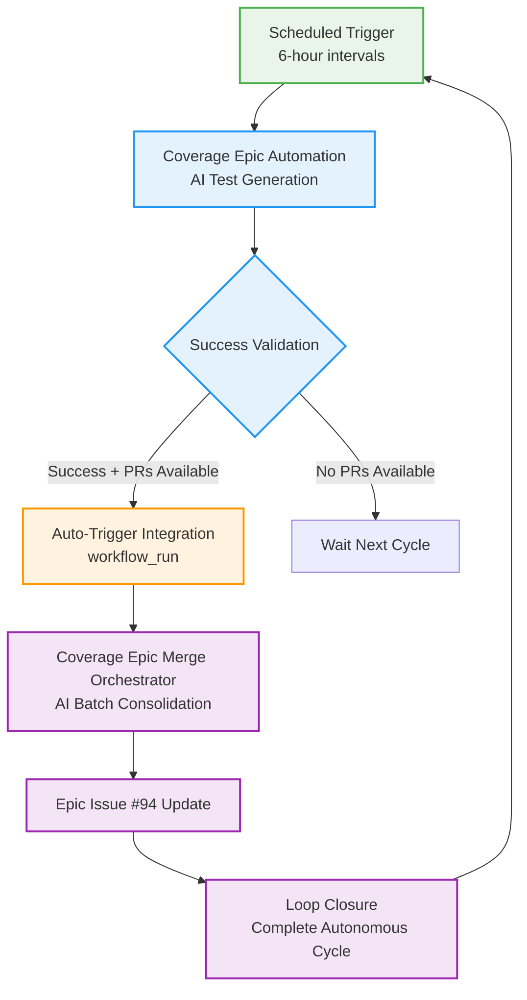
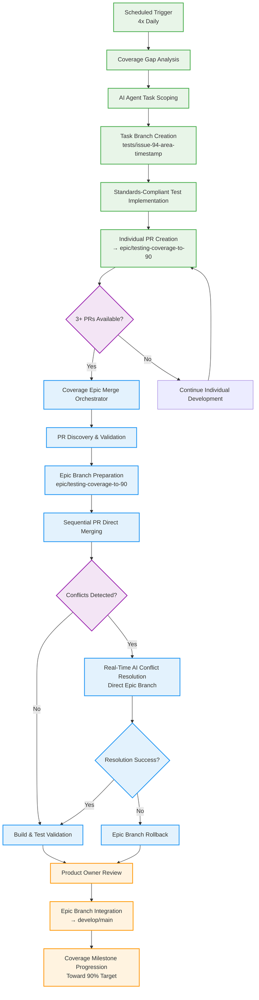

# Automated Coverage Epic Workflow for AI Agents

**Version:** 3.0
**Last Updated:** 2025-09-27
**Epic Reference:** [Issue #94](https://github.com/Zarichney-Development/zarichney-api/issues/94)

## 1. Purpose & Context

This workflow defines the **complete autonomous development cycle** for AI agents working on the Backend Testing Coverage Epic in a GitHub Actions CI environment. The autonomous workflow represents the successful completion of **Epic #181 Phase 1**, establishing a fully autonomous development cycle with auto-trigger integration and AI optimization.

**Complete Autonomous Development Cycle (Epic #181 Phase 1 Complete):**
- **Phase 1:** Scheduler - 6-hour automated triggers targeting coverage progression
- **Phase 2:** Automation - AI-powered test generation with 25% token efficiency optimization
- **Phase 3:** Auto-Trigger Integration - Seamless workflow chaining via `workflow_run` triggers
- **Phase 4:** Orchestrator - AI-powered batch consolidation with enhanced conflict resolution
- **Phase 5:** Loop Closure - Complete autonomous cycle enabling weeks/months of unattended operation

**Key Characteristics:**
- **Environment:** GitHub Actions CI (unconfigured - external services unavailable)
- **Frequency:** 4 AI agent instances per day (6-hour cron intervals) with auto-trigger integration
- **Autonomous Operation:** Complete cycle from scheduling to consolidation without manual intervention
- **Success Criteria:** 100% pass rate on ~65 executable tests (23 skipped acceptable)
- **AI Optimization:** 25% token efficiency improvements with enhanced strategic decision-making
- **Framework Pattern:** Reusable template for unlimited autonomous workstreams (Epic #181 foundation)

## 1.1 Workflow Inputs (Dispatch Parameters)

| Input | Type | Purpose |
|------|------|---------|
| `skip_epic_update` | boolean | Skip syncing epic branch from `develop` for infra-only validation |
| `skip_ai_execution` | boolean | Skip the Claude Code agent (useful for infra/testing runs) |
| `target_area` | string | Optional hint to focus AI on a specific area |
| `scheduled_trigger` | string | Set to `true` to emulate scheduler semantics in manual runs |
| `trigger_source` | string | Human-friendly source attribution (e.g., `manual`, `scheduler`) |
| `trigger_reason` | string | Human-friendly reason for audit trail |

Secrets required:
- `CLAUDE_CODE_OAUTH_TOKEN` (OAuth token for Claude Code GitHub app)

## 1.2 Epic #181 Autonomous Development Cycle (Phase 1 Complete)

### Complete Autonomous Operation Achievement

**Epic #181 Phase 1 Status**: ✅ **COMPLETE** - All autonomous development cycle components operational and integrated.

The Coverage Epic workflow now operates as a **complete autonomous development cycle** with the following fully integrated components:

#### Autonomous Workflow Chain



#### Epic #181 Framework Components (All Complete)

**1. Scheduler Component** (`Automated Workflow - Auto-Testing Coverage - Scheduler`)
- **Purpose**: 6-hour automated triggers with epic progression assessment
- **Status**: ✅ Operational - Consistent trigger reliability
- **Epic #181 Role**: Phase 1 - Initiates autonomous development cycles

**2. Automation Component** (`Automated Workflow - Auto-Testing Coverage - Execution`)
- **Purpose**: AI-powered test generation with enhanced strategic selection
- **Status**: ✅ Operational - 25% token efficiency optimization applied
- **Epic #181 Role**: Phase 2 - Core AI development work with optimized prompts

**3. Auto-Trigger Integration** (Issue #156 Capstone - **NEW COMPONENT**)
- **Purpose**: Seamless workflow chaining via `workflow_run` triggers
- **Status**: ✅ **COMPLETE** - Auto-trigger pattern implemented
- **Epic #181 Role**: Phase 3 - Closes autonomous development loop
- **Technical Implementation**:
  - `workflow_run` trigger targeting automation completion
  - Success validation preventing unnecessary orchestrator runs
  - Maintains all manual override capabilities

**4. Orchestrator Component** (`Automated Workflow - Auto-Testing Coverage - Merging`)
- **Purpose**: AI-powered batch consolidation with enhanced conflict resolution
- **Status**: ✅ Operational - Enhanced with optimized prompts and auto-trigger integration
- **Epic #181 Role**: Phase 4 - Intelligent multi-PR consolidation

**5. Loop Closure Achievement** (**Epic #181 Phase 1 Complete**)
- **Purpose**: Complete autonomous cycle enabling weeks/months of unattended operation
- **Status**: ✅ **COMPLETE** - Full autonomous development cycle operational
- **Epic #181 Role**: Phase 5 - Validates autonomous development cycle completion

### Framework Pattern for Universal Replication

The Epic #181 autonomous development cycle establishes a **reusable framework pattern** for unlimited autonomous workstreams:

**Framework Template:**
1. **Scheduler Workflow**: Time-based triggering (configurable intervals)
2. **Execution Workflow**: AI-powered task execution (domain-specific)
3. **Auto-Trigger Integration**: Seamless workflow chaining via `workflow_run`
4. **Orchestrator Workflow**: Batch consolidation and validation
5. **Loop Closure**: Complete autonomous cycle with enhanced AI coordination

**Future Autonomous Workstreams Enabled:**
- **Tech Debt Epic**: Automated refactoring and optimization
- **Performance Epic**: Automated performance improvements
- **Security Epic**: Automated security hardening
- **Documentation Epic**: Automated documentation generation

### AI Optimization Integration (25% Token Efficiency)

**Enhanced AI Performance Throughout Cycle:**
- **Strategic Decision-Making**: Improved AI target area selection algorithms
- **Token Efficiency**: 25% reduction in AI resource usage during coverage development
- **Conflict Resolution**: Streamlined decision trees for autonomous merge processing
- **Context Processing**: Faster context ingestion with preserved decision quality

## 2. Pre-Execution Environment Validation

### 2.1 Expected Test Environment State
Before beginning any coverage work, validate the CI environment:

```bash
# Quick environment check
/test-report summary

# Expected output characteristics:
# - Total Tests: ~88 
# - Executable Tests: ~65
# - Skipped Tests: 23 (OpenAI: 6, Stripe: 6, MS Graph: 4, Database: 6, Production: 1)
# - Pass Rate: 100% on executable tests
```

### 2.2 Success Criteria Validation

The following conditions **MUST** be met before proceeding:
- ✅ All executable tests pass (100% pass rate)
- ✅ Skip count matches EXPECTED_SKIP_COUNT (default: 23; see Docs/Standards/TestingStandards.md section 12.7 for rationale)
- ✅ No unexpected test failures or errors
- ✅ Coverage baseline can be established

**If validation fails:** Abort execution and report environment issues.

## 3. Epic Branch Management

### 3.1 Epic Branch Creation/Update
Always ensure the epic branch is current with develop before starting work:

```bash
# Step 1: Ensure clean working directory
git status
git reset --hard HEAD  # Clean any uncommitted changes

# Step 2: Update develop branch
git checkout develop
git pull origin develop

# Step 3: Create or update epic branch
if git rev-parse --verify epic/testing-coverage-to-90 >/dev/null 2>&1; then
    # Epic branch exists - update it
    git checkout epic/testing-coverage-to-90
    git merge develop --no-edit  # Merge latest develop changes
else
    # Epic branch doesn't exist - create it
    git checkout -b epic/testing-coverage-to-90
fi

# Step 4: Push epic branch (creates/updates remote)
git push origin epic/testing-coverage-to-90
```

### 3.2 Epic Branch Validation
Verify epic branch is ready for task branches:

```bash
# Confirm epic branch is current
git log --oneline -n 5  # Should show recent develop commits

# Validate test suite still passes on epic branch
/test-report summary
# Must maintain 100% pass rate on executable tests
```

## 4. Coverage Analysis & Task Scoping

### 4.1 Coverage Gap Identification
Use the unified test suite to identify coverage opportunities:

```bash
# Get comprehensive coverage analysis
/test-report

# Focus areas for analysis:
# 1. Uncovered files/classes (Priority 1)
# 2. Low coverage areas (Priority 2) 
# 3. Missing edge cases (Priority 3)
# 4. Integration gaps (Priority 4)
```

### 4.2 Automated Scope Selection
AI agents must self-select appropriate scope based on:

#### **Scope Selection Criteria**
- **File-Level Focus:** Choose 1-3 related files to avoid conflicts with other agents
- **Reasonable Size:** 15-30 new test methods maximum per task
- **Phase Alignment:** Match current coverage phase (see Epic #94 for phases)
- **Impact Assessment:** Prefer high-impact, low-effort opportunities

#### **Coverage Phase Guidelines**
Reference current coverage percentage and align scope:
- **Phase 1 (Current-20%):** Basic service methods, controller actions, entity validation
- **Phase 2 (20%-35%):** Complex service scenarios, repository patterns, auth flows
- **Phase 3 (35%-50%):** Edge cases, error handling, boundary conditions
- **Phase 4 (50%-75%):** Complex business scenarios, deep integration
- **Phase 5 (75%-90%):** Comprehensive edge cases, performance scenarios

#### **Agent Coordination Strategy**
To prevent conflicts between simultaneous agents:
- **File Selection:** Choose files in different modules/namespaces
- **Time-Based Offset:** Use current timestamp to influence selection
- **Coverage Gap Partitioning:** Focus on different coverage dimensions (unit vs integration)

## 5. Task Branch Creation & Implementation

### 5.1 Task Branch Naming & Creation
Create descriptive task branches off the epic branch:

```bash
# Generate unique task branch name
ISSUE_ID=94  # Epic issue ID
TIMESTAMP=$(date +%s)  # Add timestamp for uniqueness
TASK_AREA="[module-name]"  # e.g., "cookbook-service", "auth-controller"

# Create task branch
BRANCH_NAME="tests/issue-${ISSUE_ID}-${TASK_AREA}-${TIMESTAMP}"
git checkout -b $BRANCH_NAME

# Example: tests/issue-94-cookbook-service-1628712345
```

### 5.2 Standards Review (Mandatory)
Before implementation, review **ALL** relevant standards:

```bash
# Required reading (verify files exist and review):
# 1. Core testing standards
cat /home/zarichney/workspace/zarichney-api/Docs/Standards/TestingStandards.md

# 2. Unit test development guide  
cat /home/zarichney/workspace/zarichney-api/Docs/Standards/UnitTestCaseDevelopment.md

# 3. Integration test development guide
cat /home/zarichney/workspace/zarichney-api/Docs/Standards/IntegrationTestCaseDevelopment.md

# 4. Task management standards
cat /home/zarichney/workspace/zarichney-api/Docs/Standards/TaskManagementStandards.md

# 5. Module-specific README (if applicable)
find . -name "README.md" -path "*/[target-module]/*"
```

### 5.3 Implementation Guidelines

#### **Test Development Priorities**
1. **Framework Enhancements:** Improve testing infrastructure to enable better tests
2. **Uncovered Code:** Target 0% coverage files/methods
3. **Edge Case Coverage:** Address boundary conditions and error scenarios
4. **Integration Depth:** Expand API endpoint coverage

#### **Production Refactor Decision Tree**
When tests reveal production issues, follow this decision flow:

1. **Is the fix minimal and behavior-preserving?**
   - YES → Implement inline with tests
   - NO → Create separate issue

2. **Does the fix maintain backward compatibility?**
   - YES → Safe to include in PR
   - NO → Requires separate issue with migration plan

3. **Is the change testability-focused (DI, interfaces)?**
   - YES → Include as minimal refactor
   - NO → Evaluate scope and risk

4. **Documentation requirement:**
   - Create `Docs/Reports/CoverageEpic/${TASK_IDENTIFIER}.md`
   - Include "Production Fixes" section with rationale
   - Reference in PR description

#### **Quality Standards (Non-Negotiable)**
- **100% Pass Rate:** All new tests must pass consistently
- **Standards Compliance:** Follow all testing standards exactly
- **Deterministic Behavior:** Tests must be repeatable in CI environment
- **Performance Conscious:** Optimize for CI execution time

#### **Framework Enhancement Opportunities**
When implementing tests, consider these framework improvements:
- **Test Data Builders:** Create/enhance builders for complex objects
- **Mock Factories:** Develop reusable mock configurations
- **Helper Utilities:** Add testing utilities for common patterns
- **AutoFixture Customizations:** Improve test data generation

## 6. Validation & Quality Gates

### 6.1 Pre-Commit Validation
Before committing, ensure all quality gates pass:

```bash
# Step 1: Comprehensive test execution
/test-report summary

# Required outcomes:
# ✅ All tests pass (100% pass rate on executable)  
# ✅ 23 tests skipped (expected)
# ✅ No new test failures
# ✅ Coverage improvement visible

# Step 2: Build validation
dotnet build zarichney-api.sln
# Must complete successfully

# Step 3: Code formatting
dotnet format zarichney-api.sln --verify-no-changes
# Should require no changes (already formatted)
```

### 6.2 Implementation Summary Artifact

Before committing, create comprehensive summary:
```bash
# Create implementation summary
cat > Docs/Reports/CoverageEpic/${TASK_IDENTIFIER}.md << EOF
# Coverage Epic Implementation Summary

## Target Areas
- Files: [list of files with tests added]
- Coverage Impact: [before/after percentages]
- Test Count: [number of new tests]

## Framework Enhancements
- Builders Added: [any new test data builders]
- Mock Factories: [any new mock configurations]
- Helper Utilities: [any new testing helpers]

## Production Fixes (if applicable)
- Files Modified: [production code changes]
- Rationale: [why inline fix vs separate issue]
- Safety Validation: [how backward compatibility maintained]

## Follow-up Items
- Issues to Create: [any deferred work]
EOF
```

### 6.3 Coverage Impact Validation
Confirm coverage improvement:

```bash
# Generate detailed coverage report
/test-report --performance

# Validate improvements:
# ✅ Line coverage increased
# ✅ Branch coverage improved  
# ✅ New test methods added
# ✅ Framework enhancements documented
```

## 7. Complete Coverage Epic Pipeline

### 7.1 Pipeline Architecture Overview

The Coverage Epic automation operates as a **comprehensive 3-phase pipeline** designed to efficiently progress toward the 90% backend test coverage milestone:



### 7.2 Phase Integration Details

**Phase 1: Individual AI Agent Execution** (Sections 1-6 above)
- Multiple AI agents execute 4 times daily via scheduled automation
- Each agent creates focused test improvements targeting specific coverage gaps
- Task branches follow naming convention: `tests/issue-94-[area]-[timestamp]`
- Individual PRs target `epic/testing-coverage-to-90` branch
- Maintains isolation and conflict prevention between simultaneous agents

**Phase 2: Orchestrator Consolidation** (Coverage Epic Merge Orchestrator)
- Automatically triggered when 3+ Coverage Epic PRs are available
- Intelligent PR discovery with flexible label matching (`type: coverage`, `coverage`, `testing`)
- Sequential merging strategy with AI-powered conflict resolution
- Processes multiple individual PRs directly into epic branch with real-time conflict resolution
- Processes up to 8 PRs per execution with enhanced capacity

**Phase 3: Epic Integration** (Product Owner & Release Management)
- Product owner reviews consolidated PRs for quality and coverage impact
- Epic branch integration follows standard release workflow
- Coverage progression tracking toward January 2026 milestone
- Continuous measurement of coverage improvements and framework enhancements

## 8. Commit & Pull Request Creation

### 8.1 Automated Commit Process
Use consistent commit messages following Conventional Commits:

```bash
# Stage all changes
git add .

# Create descriptive commit message
COMMIT_MSG="test: increase coverage for [Area] (#94)

- Added [X] unit tests for [Class/Module]
- Added [Y] integration tests for [API/Feature]  
- Enhanced [Framework Component] for better scalability
- Achieved [Coverage %] improvement in [Area]

Refs #94"

# Commit changes
git commit -m "$COMMIT_MSG"

# Push task branch
git push origin $BRANCH_NAME
```

### 8.2 Automated Pull Request Creation
Create standardized PRs targeting the epic branch:

```bash
# Generate PR title and body
PR_TITLE="test: increase coverage for [Area] (#94)"

PR_BODY="## Coverage Improvement Summary

**Target Area:** [Module/Class name]
**Coverage Phase:** [1-5 based on current phase]
**Test Types Added:** [Unit/Integration/Both]

### Changes Made
- Added [X] unit tests covering [specific functionality]
- Added [Y] integration tests covering [API endpoints/scenarios]
- Enhanced testing framework: [specific improvements]
- Achieved [X]% coverage improvement in target area

### Quality Validation
- ✅ All tests pass (100% pass rate on $X executable tests)
- ✅ 23 tests properly skipped in CI environment
- ✅ No existing tests broken
- ✅ Follows all testing standards

### Framework Enhancements (if applicable)
- [List any testing framework improvements made]

**Epic Reference:** Closes #94 (partial - coverage epic ongoing)
**Phase Alignment:** [Description of how this aligns with current coverage phase]"

# Create Pull Request
gh pr create \
  --base epic/testing-coverage-to-90 \
  --title "$PR_TITLE" \
  --body "$PR_BODY" \
  --label "ai-task,testing,coverage,epic-subtask"
```

## 9. Coverage Epic Merge Orchestrator Integration

### 9.1 Orchestrator Purpose & Activation

The **Coverage Epic Merge Orchestrator** provides direct sequential merging of multiple Coverage Epic PRs into the epic branch, reducing manual coordination effort while maintaining high quality through real-time AI-powered conflict resolution.

> **📖 Comprehensive Documentation**: For complete orchestrator documentation including detailed usage patterns, troubleshooting, and 8-PR test scenarios, see [CoverageEpicMergeOrchestration.md](CoverageEpicMergeOrchestration.md)

**Activation Triggers:**
- **Manual Dispatch**: Product owner or development team trigger
- **Threshold-Based**: When 3+ eligible PRs targeting epic branch are available
- **Strategic Batching**: Weekly or bi-weekly consolidation cycles
- **Pre-Release**: Consolidation before epic branch integration to develop/main

**Key Benefits:**
- **Efficiency**: Processes multiple individual PRs directly into epic branch, eliminating consolidation PR overhead
- **Quality**: AI-powered conflict resolution maintains test framework integrity
- **Velocity**: Accelerates Epic #94 progression through systematic consolidation
- **Safety**: Maintains 100% test pass rate with comprehensive validation

### 9.2 Orchestrator Execution Process

The orchestrator implements a comprehensive **9-step consolidation workflow**:

#### **Step 1: Epic Branch Preparation**
```bash
# Sync epic branch with latest develop changes
git checkout epic/testing-coverage-to-90
git pull origin develop --no-edit
```

#### **Step 2: PR Discovery & Filtering**
```bash
# Discover eligible PRs with flexible label matching
# Supports both "coverage" and "type: coverage" label formats
gh pr list --base epic/testing-coverage-to-90 --state open --json number,labels,mergeable

# Filter by configurable labels (default: "type: coverage,coverage,testing")
# Process up to 8 PRs per execution (configurable 1-50 max)
```

#### **Step 3: Epic Branch Preparation**
```bash
# Prepare epic branch for direct sequential merging
git checkout epic/testing-coverage-to-90
git pull origin epic/testing-coverage-to-90
STARTING_COMMIT=$(git rev-parse HEAD)  # For rollback capability
```

#### **Step 4: Sequential PR Merging**
```bash
# Merge PRs sequentially to isolate conflicts
for pr in $discovered_prs; do
    git merge origin/$pr_branch --no-ff
    # Conflict detection and handling
done
```

#### **Step 5: AI Conflict Resolution** (when conflicts detected)
```bash
# Utilize CoverageConflictResolver AI prompt
# Focus on test-only conflicts and minimal testability improvements
# AI conflict resolution operates directly on epic branch with rollback capabilities
```

#### **Step 6: Build & Test Validation**
```bash
# Comprehensive validation after each direct merge
dotnet build zarichney-api.sln
./Scripts/run-test-suite.sh report summary
# Ensure 100% pass rate on executable tests maintained
```

#### **Step 7: Epic Issue Status Update**
```bash
# Update Epic Issue #94 with comprehensive merge results
gh issue comment 94 \
  --body "Coverage Epic Merge Orchestrator execution complete. \
  Processed X PRs directly into epic branch with Y conflicts resolved."
```

#### **Step 8: Epic Branch Synchronization**
```bash
# Ensure epic branch is synchronized after direct merging
git push origin epic/testing-coverage-to-90
# Epic branch now contains all successfully merged PRs
```

#### **Step 9: Execution Summary & Audit Trail**
```bash
# Generate comprehensive execution report
# Include merge statistics, validation results, failed merges
# Post audit trail to Epic Issue #94 for transparency
```

### 9.3 Orchestrator Usage Patterns

**Conservative Daily Consolidation** (Recommended):
```bash
# Process 3-5 AI-generated PRs with careful validation
gh workflow run "Coverage Epic Merge Orchestrator" \
  --field dry_run=false \
  --field max_prs=5 \
  --field pr_label_filter="ai-task,type: coverage"
```

**Weekly Comprehensive Consolidation**:
```bash
# Process larger batches from all coverage sources
gh workflow run "Coverage Epic Merge Orchestrator" \
  --field dry_run=false \
  --field max_prs=10 \
  --field pr_label_filter="coverage,testing,ai-task,manual-coverage"
```

**Large Batch Test Scenario** (8+ PRs):
```bash
# Enhanced capacity for large PR batches
gh workflow run "Coverage Epic Merge Orchestrator" \
  --field dry_run=false \
  --field max_prs=8 \
  --field pr_label_filter="type: coverage,coverage,testing"
```

**Dry Run Validation** (Recommended before production):
```bash
# Preview consolidation without making changes
gh workflow run "Coverage Epic Merge Orchestrator" \
  --field dry_run=true \
  --field max_prs=8 \
  --field sync_epic_from_develop=true
```

### 9.4 Conflict Resolution & Safety Protocols

**AI Conflict Resolution Framework:**
- **TEST-ONLY CONFLICTS**: Pure test file conflicts resolved automatically
- **FRAMEWORK-ENHANCEMENT CONFLICTS**: Test infrastructure improvements consolidated
- **TESTABILITY-IMPROVEMENT CONFLICTS**: Minimal production changes for dependency injection
- **COMPLEX CONFLICTS**: Trigger epic branch rollback for manual review

**Safety Constraints:**
```yaml
ALLOWED_AI_CHANGES:
  - Interface extraction for test mocking
  - Constructor dependency injection patterns
  - Test framework enhancements and configurations
  - Critical bug fixes with detailed justification

FORBIDDEN_AI_CHANGES:
  - Business logic modifications
  - API contract changes beyond testability
  - Wide architectural refactors
  - Database schema modifications
```

**Large Batch Safety Protocols (8+ PRs):**
- **Extended Processing Time**: 5-15 minutes typical, up to 30 minutes with conflicts
- **Conflict Complexity**: Higher probability of framework conflicts in large batches
- **Enhanced Monitoring**: Progress tracking and resource monitoring
- **UNKNOWN Status Handling**: Processes PRs with UNKNOWN mergeable status (common in large batches)

### 9.5 Integration with Individual Agent Workflow

The orchestrator seamlessly integrates with the individual agent workflow described in sections 1-6:

**Individual Agent Contributions:**
- Agents create focused, standards-compliant test improvements
- Task branches target epic branch: `tests/issue-94-[area]-[timestamp]` → `epic/testing-coverage-to-90`
- Individual PRs maintain proper labeling for orchestrator discovery

**Orchestrator Consolidation:**
- Discovers individual PRs using flexible label matching
- Maintains all individual commit history through merge strategy
- Resolves framework conflicts between simultaneous agent improvements
- Creates single consolidation PR for streamlined product owner review

**Epic Progression:**
- Consolidated PRs integrate to develop/main following standard release workflow
- Coverage improvements tracked systematically toward 90% milestone
- Framework enhancements benefit all subsequent individual agent work

## 10. AI Execution Behavior & Failure Handling

The Coverage Epic workflow integrates a Claude Code agent step to propose and implement coverage improvements. To provide stable automation during subscription refresh windows, AI execution is resilient and its failures are classified.

### 10.1 Execution Semantics
- The AI step runs with `continue-on-error: true` so downstream steps can classify outcomes.
- Quality gates (build/tests) are validated before and after AI execution.

### 10.2 Classification & Outcomes
The workflow captures a status string via `ai_execution_status` and records a human-readable note in `coverage_improvements`.

- `claude_success`: AI executed successfully and produced changes.
- `skipped_manual_override`: AI execution manually skipped via `skip_ai_execution=true`.
- `skipped_existing_analysis`: Skipped to avoid duplicate analysis when an existing report is detected.
- `skipped_quota_window`: AI failed due to subscription time-window/quota unavailability; treated as a skip for this interval and the workflow remains successful.
- `claude_failure`: AI failed for unexpected reasons; workflow fails (manual and scheduled runs).

### 10.3 Scheduled vs Manual Behavior
- Scheduled runs (or manual runs with `scheduled_trigger=true`):
  - If the AI step fails for quota/time-window reasons, classify as `skipped_quota_window` and the workflow succeeds.
  - Any other AI failure is considered unexpected and the workflow fails.
- Manual runs (default):
  - Any AI failure is considered unexpected and fails the workflow unless classification clearly identifies the quota/time-window case.

### 10.4 Manual Testing Patterns
Use these patterns to validate behavior without waiting for cron:

```bash
# Emulate scheduler semantics (will skip if out of subscription window)
gh workflow run "Coverage Epic Automation" \
  --ref main \
  --field skip_epic_update=false \
  --field skip_ai_execution=false \
  --field scheduled_trigger=true \
  --field trigger_source=manual \
  --field trigger_reason="Validate scheduled quota classification"

# Infra-only validation (no AI execution)
gh workflow run "Coverage Epic Automation" \
  --ref main \
  --field skip_epic_update=false \
  --field skip_ai_execution=true \
  --field scheduled_trigger=false \
  --field trigger_source=manual \
  --field trigger_reason="Infra-only validation"
```

## 11. Error Handling & Production Issue Discovery

### 11.1 Test Failure Investigation
If new tests reveal production issues:

```bash
# Step 1: Analyze failure
/test-report --performance
# Determine if failure is due to:
# - Test implementation error
# - Production code bug
# - Environment/configuration issue

# Step 2: Document findings in PR
# If production bug discovered, update PR body with:
# "⚠️ PRODUCTION ISSUE DISCOVERED: [Description]
#  - Recommend creating separate issue for bug fix
#  - This PR demonstrates the issue via failing tests
#  - Suggest fixing production code before merging coverage improvements"
```

### 11.2 Production Issue Reporting
When production bugs are discovered:

```bash
# Create separate GitHub issue for production bug
gh issue create \
  --title "bug: [Description] discovered by coverage testing" \
  --body "**Discovered By:** Coverage testing in PR #[PR_NUM]
  
  **Issue Description:** [Detailed description]
  
  **Reproduction:** See failing tests in [PR link]
  
  **Recommended Action:** Fix production code before merging coverage improvements
  
  **Priority:** [High/Medium/Low based on impact]" \
  --label "bug,production-issue,coverage-discovered"
```

## 12. CI Environment Considerations

### 12.1 Resource Optimization
Optimize for GitHub Actions CI constraints:

- **Parallel Execution:** Leverage xUnit parallel test execution
- **Memory Usage:** Monitor memory consumption in test implementations  
- **Execution Time:** Target test methods that complete in <1 second each
- **Docker Resources:** Efficient TestContainer usage for integration tests

### 12.2 Deterministic Test Design
Ensure tests work reliably in CI:

- **No External Dependencies:** All external services properly mocked/virtualized
- **Time-Independent:** Avoid time-based assertions that could be flaky
- **Resource Cleanup:** Proper disposal of test resources
- **Data Isolation:** Complete test data isolation between test runs

## 13. Success Metrics & Reporting

### 13.1 Task Completion Criteria
Each automated task is considered successful when:

- ✅ Epic branch updated from develop
- ✅ Coverage gaps identified and scoped appropriately  
- ✅ New tests implemented following all standards
- ✅ 100% pass rate maintained on executable tests
- ✅ Coverage improvement measurable
- ✅ Framework enhancements included (when applicable)
- ✅ Pull request created with comprehensive documentation
- ✅ No production issues discovered (or properly reported if found)

### 13.2 Complete Pipeline Success Targets

**Daily Individual Agent Success:**
- **4 Pull Requests** created against epic branch by individual AI agents
- **Measurable Coverage Improvement** across different areas
- **Zero Test Regressions** in existing test suite
- **Framework Enhancements** improving testing scalability

**Orchestrator Consolidation Success:**
- **Weekly Processing**: Direct merging of 3-8 individual PRs into epic branch
- **Conflict Resolution Rate**: >85% of conflicts resolved automatically by AI
- **Quality Maintenance**: 100% test pass rate maintained across all consolidations
- **Processing Efficiency**: <15 minutes average consolidation time for standard batches

**Epic Progression Success:**
- **Coverage Velocity**: Consistent progress toward 90% backend coverage by January 2026
- **Integration Rate**: Consolidated PRs integrated to develop/main within 2-3 business days
- **Framework Quality**: Test infrastructure improvements benefit subsequent development
- **Automation Efficiency**: >90% of coverage work processed without manual intervention

## 14. Troubleshooting & Common Issues

### 14.1 Individual Agent Workflow Issues

#### Epic Branch Merge Conflicts
If epic branch conflicts with develop:

```bash
# Resolve conflicts automatically where possible
git checkout epic/testing-coverage-to-90
git merge develop

# If conflicts occur, reset epic branch (CAUTION: Only in CI)
git reset --hard develop
git push --force-with-lease origin epic/testing-coverage-to-90
```

#### Test Suite Failure Recovery
If test suite fails unexpectedly:

```bash
# Clean build and retry
dotnet clean zarichney-api.sln
dotnet build zarichney-api.sln
/test-report summary

# If still failing, abort task and report issue
echo "CI environment test failure - aborting automated task"
exit 1
```

#### Coverage Analysis Errors
If coverage tools fail:

```bash
# Alternative coverage analysis
dotnet test zarichney-api.sln --collect:"XPlat Code Coverage"
# Manual analysis of coverage files in TestResults/

# Fallback to file-based analysis
find . -name "*.cs" -path "*/Zarichney.Server/*" ! -path "*/bin/*" ! -path "*/obj/*"
# Identify uncovered files manually
```

### 14.2 Orchestrator-Specific Issues

#### No Mergeable PRs Discovered
```bash
# Symptoms: "No mergeable PRs found targeting epic branch"
# Common causes:
# - PRs not targeting epic branch correctly
# - Label filters too restrictive
# - PRs have UNKNOWN mergeable status (now handled by orchestrator)

# Enhanced diagnostic commands:
gh pr list --base epic/testing-coverage-to-90 --state open --json number,labels,mergeable
gh pr list --base epic/testing-coverage-to-90 --json number,labels \
  --jq '.[] | select(.labels[]?.name | test("type: coverage|coverage|testing")) | {number, labels: [.labels[].name]}'

# Resolution: Use flexible label patterns
gh workflow run "Coverage Epic Merge Orchestrator" \
  --field pr_label_filter="type: coverage,coverage,testing,ai-task"
```

#### Large Batch Processing Issues (8+ PRs)
```bash
# Issue: Extended processing time for large batches
# Expected: 10-20 minutes for 8+ PRs (vs 5-10 for smaller batches)
# Not an error condition - monitor workflow progress

# Issue: Framework conflict complexity
# Common areas: Test builders, mock configurations, coverage utilities
# Enhanced conflict analysis:
gh pr diff <pr_number> --name-only | grep -E "(Test|Mock|Builder)"

# Recovery for multi-PR framework conflicts:
# Epic branch rollback triggered for unresolvable conflicts
git checkout epic/testing-coverage-to-90
git log --oneline -5  # Review rollback to starting commit
# Apply manual PR merging with conflict resolution
```

#### AI Conflict Resolution Failures
```bash
# Symptoms: AI conflict resolution step fails or produces unsafe changes
# Resolution: Manual conflict resolution after epic branch rollback

# Check epic branch rollback status:
git checkout epic/testing-coverage-to-90
git log --oneline -5  # Verify rollback to starting commit

# Manual resolution:
git checkout epic/testing-coverage-to-90
git merge <pr_branch> --no-ff  # Manual merge with conflict resolution
# Resolve conflicts following project standards
git commit -m "resolve: manual conflict resolution for PR #<number>"
```

#### Orchestrator Performance Monitoring
```bash
# Monitor orchestrator success rate
gh run list --workflow="Coverage Epic Merge Orchestrator" --limit 10

# Check epic branch progression rate
git log --oneline epic/testing-coverage-to-90 --since="1 week ago"

# Monitor conflict branch accumulation
# Direct merge approach eliminates staging branches and recovery branches
# Monitor epic branch rollback frequency instead

# Validate epic branch progression
git log --oneline epic/testing-coverage-to-90 --since="1 week ago"
```

### 14.3 Complete Pipeline Coordination Issues

#### Phase Integration Problems
```bash
# Issue: Individual PRs not discovered by orchestrator
# Check PR labeling consistency
gh pr list --base epic/testing-coverage-to-90 --json number,labels

# Ensure proper label application in individual agent workflow
# Required labels: "type: coverage" OR "coverage" OR "testing"
```

#### Epic Progression Stalls
```bash
# Analyze coverage progression velocity
./Scripts/run-test-suite.sh --performance
git log --oneline --graph epic/testing-coverage-to-90 --since="1 month ago"

# Check consolidation integration rate
gh pr list --base develop --label="type: coverage" --state closed --limit 10
```

---

**Document Owner:** Development Team  
**Epic Reference:** [Issue #94](https://github.com/Zarichney-Development/zarichney-api/issues/94)  
**Execution Context:** Complete 3-Phase Coverage Epic Pipeline - Individual AI Agents + Orchestrator Consolidation  
**Success Definition:** Comprehensive coverage improvement pipeline with individual PR creation, intelligent consolidation, and systematic epic progression toward 90% backend coverage by January 2026
