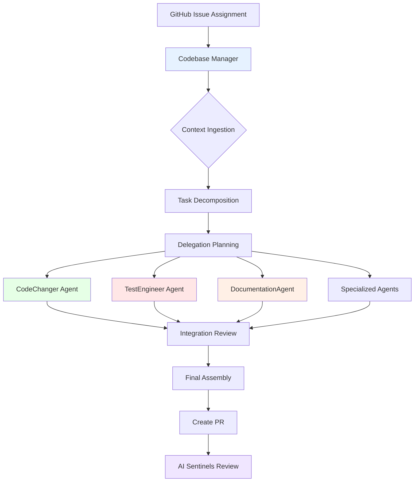
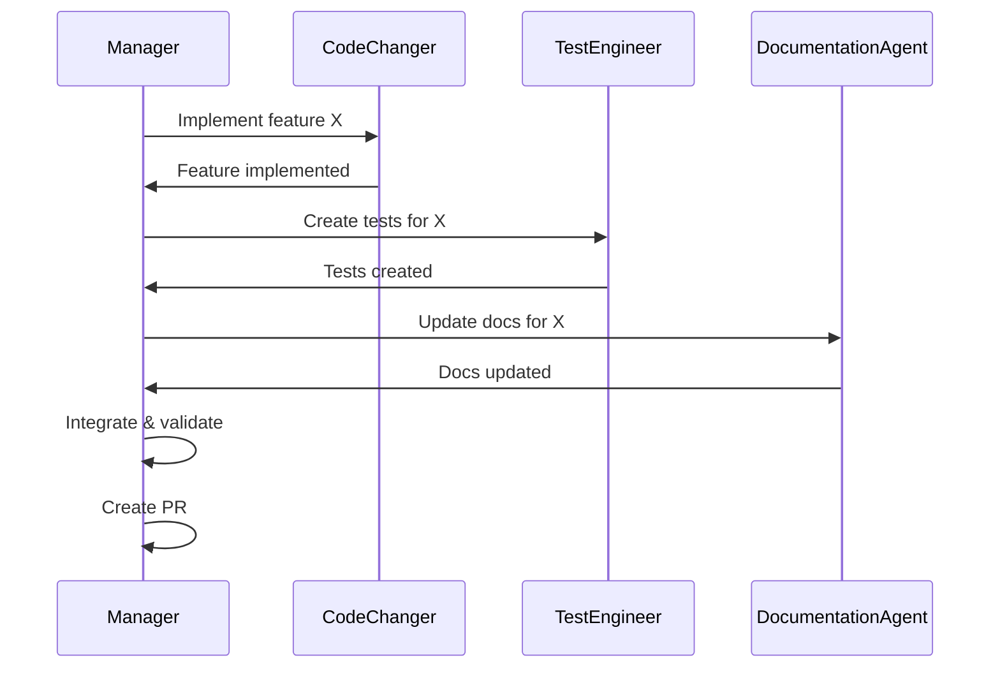

# Codebase Manager Evolution: From Executor to Orchestrator

**Version:** 1.0  
**Last Updated:** 2025-01-29  
**Status:** Active Implementation

## 1. Executive Summary

This document defines the evolution of Claude from a direct code executor to a strategic codebase manager using specialized subagents. This architectural shift preserves context window capacity for strategic oversight while delegating implementation details to purpose-built subagents, enabling handling of complex, multi-component GitHub issues with greater efficiency and comprehensive completion.

## 2. Problem Statement

### Current Limitations
- **Context Window Saturation:** Complex issues consume significant context performing implementation details
- **Memory Compaction:** When context fills, session restarts with summarized history, losing nuance
- **Monolithic Execution:** Single agent handles all aspects from planning to implementation
- **Cognitive Overload:** Mixing strategic planning with tactical implementation

### Opportunity
Claude Code subagents enable:
- **Isolated Context Windows:** Each subagent operates in separate context
- **Specialized Expertise:** Subagents optimized for specific domains
- **Parallel Processing:** Multiple subagents can work concurrently
- **Strategic Focus:** Main session maintains mission oversight

## 3. New Operating Model

### 3.1 Codebase Manager Role

**Primary Responsibilities:**
1. **Mission Understanding:** Comprehend GitHub issue requirements and acceptance criteria
2. **Context Ingestion:** Load relevant codebase knowledge into working memory
3. **Task Decomposition:** Break complex issues into specialized subtasks
4. **Delegation Strategy:** Assign subtasks to appropriate subagents with context
5. **Integration Oversight:** Ensure coherent integration of subagent outputs, performing edits to adjust the deliverable of one with another
6. **Quality Assurance:** Validate completion before PR creation
7. **Final Assembly:** Commit, push, and trigger AI Sentinel review

**What the Manager Does NOT Do:**
- Write code directly (delegates to CodeChanger/specialists)
- Create tests (delegates to TestEngineer)
- Update documentation (delegates to DocumentationAgent)
- Investigate bugs in detail (delegates to BugInvestigator)
- Only exception is to edits files for integration/cohesion purposes

### 3.2 Workflow Architecture



## 4. Specialized Subagent Ecosystem

### 4.1 Core Development Agents

#### **CodeChanger** (Primary Development)
- **Purpose:** Feature implementation, bug fixes, refactoring
- **Expertise:** Language-agnostic code modifications
- **Tools:** Full file editing, code generation, refactoring
- **Context Requirements:** Issue requirements, affected files, coding standards

#### **TestEngineer** (Quality Assurance)
- **Purpose:** Test coverage, test infrastructure, quality gates
- **Expertise:** Testing frameworks, coverage analysis, test patterns
- **Tools:** Test execution, coverage reporting, test generation
- **Context Requirements:** Code changes, test standards, coverage targets

#### **DocumentationAgent** (Standards Compliance)
- **Purpose:** README updates, inline documentation, standards alignment
- **Expertise:** Documentation standards, diagramming, clarity
- **Tools:** Markdown editing, diagram generation
- **Context Requirements:** Code changes, documentation standards, affected modules

### 4.2 Specialized Domain Agents

#### **FrontendSpecialist** (UI/UX Development)
- **Purpose:** Angular components, TypeScript, SSR, NgRx
- **Expertise:** Angular 19, Material Design, reactive patterns
- **Tools:** Component generation, state management, styling
- **Context Requirements:** UI requirements, design patterns, Angular conventions

#### **BackendSpecialist** (.NET Development)
- **Purpose:** API endpoints, services, database operations
- **Expertise:** .NET 8, C#, EF Core, ASP.NET Core
- **Tools:** Controller creation, service implementation, migrations
- **Context Requirements:** API contracts, service patterns, database schema

#### **SecurityAuditor** (Security Compliance)
- **Purpose:** Security hardening, vulnerability assessment, compliance
- **Expertise:** OWASP, authentication, authorization, encryption
- **Tools:** Security scanning, configuration audit, secret management
- **Context Requirements:** Security policies, threat model, compliance requirements

#### **WorkflowEngineer** (CI/CD Automation)
- **Purpose:** GitHub Actions, build pipelines, deployment
- **Expertise:** YAML workflows, composite actions, automation
- **Tools:** Workflow creation, action development, script automation
- **Context Requirements:** CI/CD requirements, existing workflows, deployment targets

### 4.3 Analysis & Investigation Agents

#### **BugInvestigator** (Root Cause Analysis)
- **Purpose:** Debug issues, analyze failures, trace problems
- **Expertise:** Debugging, log analysis, stack trace interpretation
- **Tools:** Log parsing, debugging commands, diagnostic queries
- **Output:** Detailed analysis report with recommendations
- **Context Requirements:** Bug report, logs, stack traces, reproduction steps

#### **ArchitecturalAnalyst** (Design Analysis)
- **Purpose:** Architectural decisions, design patterns, system analysis
- **Expertise:** System design, patterns, architectural principles
- **Tools:** Code analysis, dependency mapping, architecture diagrams
- **Output:** Design recommendations and impact analysis
- **Context Requirements:** Proposed changes, existing architecture, standards

## 5. Delegation Patterns

### 5.1 Context Packaging

When delegating to a subagent, the manager must provide:

```yaml
Delegation Package:
  Mission:
    - Specific subtask objective
    - Acceptance criteria
    - Constraints and boundaries
  
  Context:
    - Relevant files and code sections
    - Applicable standards documents
    - Dependencies and relationships
    - Previous related work
  
  Integration:
    - How this fits into larger issue
    - Dependencies on other subtasks
    - Expected output format
    - Integration points
```

### 5.2 Subagent Invocation

```python
# Example delegation pattern
subagent_task = {
    "agent": "CodeChanger",
    "objective": "Implement UserService.GetUserByEmail method",
    "context": {
        "issue": "#123",
        "files": ["Services/UserService.cs", "IUserService.cs"],
        "standards": ["CodingStandards.md"],
        "requirements": "Method should handle null email gracefully"
    },
    "constraints": {
        "no_breaking_changes": True,
        "maintain_test_coverage": True,
        "follow_existing_patterns": True
    }
}
```

### 5.3 Multi-Agent Coordination

For complex issues requiring multiple agents:



## 6. Implementation Strategy

### 6.1 Phase 1: Foundation (Current)
- [x] Document new architecture
- [x] Update CLAUDE.md with new role
- [ ] Define subagent configurations
- [ ] Test basic delegation workflow

### 6.2 Phase 2: Core Agents
- [ ] Implement CodeChanger agent
- [ ] Implement TestEngineer agent
- [ ] Implement DocumentationAgent
- [ ] Validate integration patterns

### 6.3 Phase 3: Specialized Agents
- [ ] Deploy domain-specific agents
- [ ] Implement investigation agents
- [ ] Optimize context packaging
- [ ] Measure efficiency gains

### 6.4 Phase 4: Advanced Orchestration
- [ ] Parallel agent execution
- [ ] Dynamic agent selection
- [ ] Learning and optimization
- [ ] Performance monitoring

## 7. Success Metrics

### Efficiency Metrics
- **Context Preservation:** >80% reduction in manager context usage
- **Completion Rate:** 100% of issue requirements addressed
- **Integration Quality:** Zero integration conflicts
- **Time to PR:** Reduced by delegation parallelism

### Quality Metrics
- **Test Coverage:** Maintained or improved
- **Documentation Compliance:** 100% standards adherence
- **Code Quality:** Pass all AI Sentinel reviews
- **Bug Discovery:** Proactive identification and reporting

## 8. Risk Mitigation

### Identified Risks

| Risk | Mitigation Strategy |
|------|-------------------|
| Context loss between agents | Comprehensive context packages |
| Integration conflicts | Manager validates all outputs |
| Subagent failures | Fallback to direct execution |
| Over-delegation | Clear boundaries and constraints |
| Quality degradation | Mandatory quality gates |

## 9. Migration Path

### From Current State to Target State

1. **Gradual Adoption:** Start with simple issues, expand scope
2. **Hybrid Mode:** Manager can still execute directly when needed
3. **Learning Period:** Refine delegation patterns based on outcomes
4. **Full Migration:** Complete transition for all issue types

## 10. Configuration Management

### Subagent Definition Format

```yaml
agent:
  name: "CodeChanger"
  description: "Primary code implementation agent"
  expertise:
    - "Feature development"
    - "Bug fixes"
    - "Refactoring"
  tools:
    - "Edit"
    - "Write"
    - "MultiEdit"
  system_prompt: |
    You are a specialized code implementation agent.
    Focus solely on the code changes required.
    Follow all provided standards and patterns.
  constraints:
    max_files: 10
    require_tests: true
    documentation_update: delegate
```

## 11. Integration with Existing Systems

### GitHub Issues
- Manager reads full issue context
- Delegates based on issue labels
- Updates issue with progress

### AI Sentinels
- Final PR triggers 5 AI reviewers
- Manager ensures PR readiness
- Addresses review feedback

### Epic Management
- Supports epic branch strategy
- Coordinates multi-issue work
- Maintains epic context

## 12. Future Enhancements

### Planned Capabilities
- **Adaptive Learning:** Improve delegation based on outcomes
- **Predictive Planning:** Anticipate required agents from issue
- **Cross-Issue Coordination:** Manage dependencies between issues
- **Performance Analytics:** Track agent efficiency and quality

### Research Areas
- **Natural Language Delegation:** Conversational agent interaction
- **Autonomous Agents:** Self-directed task completion
- **Swarm Intelligence:** Multi-agent collaborative problem solving

## 13. References

- [Claude Code Subagents Documentation](https://docs.anthropic.com/en/docs/claude-code/subagents)
- [Project Task Management Standards](../Standards/TaskManagementStandards.md)
- [Testing Standards](../Standards/TestingStandards.md)
- [Documentation Standards](../Standards/DocumentationStandards.md)
- [GitHub Label Standards](../Standards/GitHubLabelStandards.md)

---

**Implementation Status:** This architecture is actively being implemented. The codebase manager role is operational, and specialized subagents are being deployed incrementally based on issue complexity and requirements.