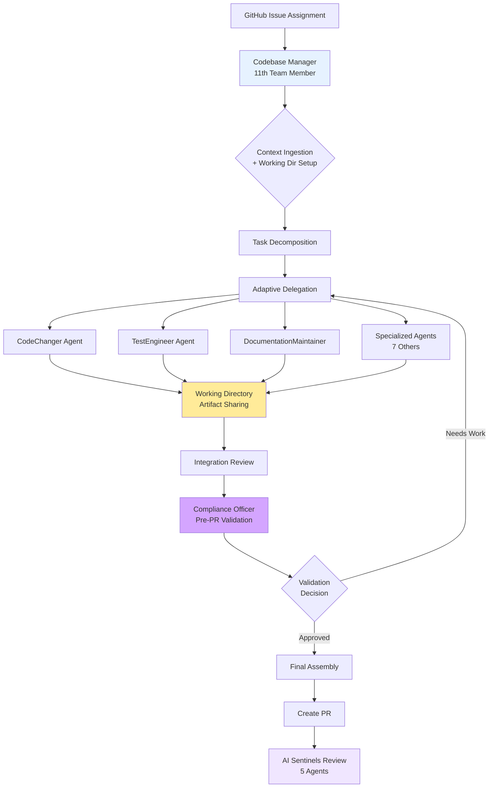
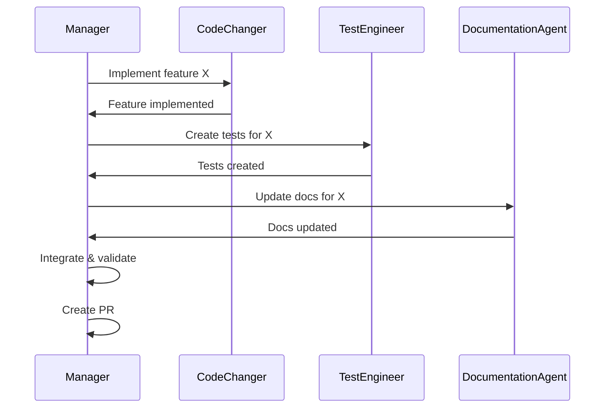

# Codebase Manager Evolution: From Executor to Orchestrator

**Version:** 2.0  
**Last Updated:** 2025-08-31  
**Status:** Active Implementation - 11-Agent Model

## 1. Executive Summary

This document defines the evolution of Claude from a direct code executor to a strategic codebase manager orchestrating an **11-agent development team**. Claude serves as both the orchestrator AND the 11th team member, while 10 specialized subagents handle implementation details. This architectural shift preserves context window capacity for strategic oversight, enables adaptive coordination based on subagent feedback, and introduces pre-PR validation through the Compliance Officer partnership.

## 2. Problem Statement

### Current Limitations
- **Context Window Saturation:** Complex issues consume significant context performing implementation details
- **Memory Compaction:** When context fills, session restarts with summarized history, losing nuance
- **Monolithic Execution:** Single agent handles all aspects from planning to implementation
- **Cognitive Overload:** Mixing strategic planning with tactical implementation

### Opportunity
Claude Code subagents enable:
- **Isolated Context Windows:** Each subagent operates in separate context
- **Specialized Expertise:** Subagents optimized for specific domains
- **Parallel Processing:** Multiple subagents can work concurrently
- **Strategic Focus:** Main session maintains mission oversight

## 3. New Operating Model - 11-Agent Team

### 3.1 Codebase Manager Role (11th Team Member)

**Claude as Orchestrator AND Team Member:**

The Codebase Manager (Claude) is not separate from the team but rather the **11th member** with the unique responsibility of orchestration, coordination, and adaptive planning. This dual role emphasizes collaborative teamwork while maintaining centralized communication.

**Primary Responsibilities:**
1. **Mission Understanding:** Comprehend GitHub issue requirements and acceptance criteria
2. **Context Ingestion:** Load relevant codebase knowledge into working memory
3. **Task Decomposition:** Break complex issues into specialized subtasks
4. **Delegation Strategy:** Assign subtasks to appropriate subagents with context
5. **Adaptive Coordination:** Dynamically adjust plans based on subagent recommendations and discoveries
6. **Integration Oversight:** Ensure coherent integration of subagent outputs, performing edits to adjust deliverables
7. **Pre-PR Validation:** Partner with Compliance Officer for dual validation before PR creation
8. **Final Assembly:** Commit, push, and trigger AI Sentinel review

**Adaptive Coordination Skills:**
- Responds to subagent recommendations for plan amendments
- Spawns additional specialist agents when needs are identified
- Maintains session state in `/working-dir/session-state.md`
- Adjusts task priorities based on discoveries and blockers

**What the Manager Does NOT Do:**
- Write code directly (delegates to CodeChanger/specialists)
- Create tests (delegates to TestEngineer)
- Update documentation (delegates to DocumentationMaintainer)
- Investigate bugs in detail (delegates to BugInvestigator)
- Exception: Makes integration edits for cohesion between subagent deliverables

### 3.2 Workflow Architecture with Pre-PR Validation



## 4. Specialized Subagent Ecosystem (10 Subagents + 1 Orchestrator)

### 4.1 Validation & Compliance Agent

#### **ComplianceOfficer** (Pre-PR Validation) - NEW
- **Purpose:** Final validation before PR creation, dual verification with Codebase Manager
- **Expertise:** Standards compliance, requirement validation, quality gates
- **Tools:** Validation checklists, test execution, standards verification
- **Context Requirements:** GitHub issue requirements, all subagent deliverables, working directory artifacts
- **Unique Role:** Provides "second pair of eyes" as soft gate before PR creation

### 4.2 Core Development Agents

#### **CodeChanger** (Primary Development)
- **Purpose:** Feature implementation, bug fixes, refactoring
- **Expertise:** Language-agnostic code modifications
- **Tools:** Full file editing, code generation, refactoring
- **Context Requirements:** Issue requirements, affected files, coding standards

#### **TestEngineer** (Quality Assurance)
- **Purpose:** Test coverage, test infrastructure, quality gates
- **Expertise:** Testing frameworks, coverage analysis, test patterns
- **Tools:** Test execution, coverage reporting, test generation
- **Context Requirements:** Code changes, test standards, coverage targets

#### **DocumentationMaintainer** (Standards Compliance)
- **Purpose:** README updates, inline documentation, standards alignment
- **Expertise:** Documentation standards, diagramming, clarity
- **Tools:** Markdown editing, diagram generation
- **Context Requirements:** Code changes, documentation standards, affected modules

### 4.3 Specialized Domain Agents

#### **FrontendSpecialist** (UI/UX Development)
- **Purpose:** Angular components, TypeScript, SSR, NgRx
- **Expertise:** Angular 19, Material Design, reactive patterns
- **Tools:** Component generation, state management, styling
- **Context Requirements:** UI requirements, design patterns, Angular conventions

#### **BackendSpecialist** (.NET Development)
- **Purpose:** API endpoints, services, database operations
- **Expertise:** .NET 8, C#, EF Core, ASP.NET Core
- **Tools:** Controller creation, service implementation, migrations
- **Context Requirements:** API contracts, service patterns, database schema

#### **SecurityAuditor** (Security Compliance)
- **Purpose:** Security hardening, vulnerability assessment, compliance
- **Expertise:** OWASP, authentication, authorization, encryption
- **Tools:** Security scanning, configuration audit, secret management
- **Context Requirements:** Security policies, threat model, compliance requirements

#### **WorkflowEngineer** (CI/CD Automation)
- **Purpose:** GitHub Actions, build pipelines, deployment
- **Expertise:** YAML workflows, composite actions, automation
- **Tools:** Workflow creation, action development, script automation
- **Context Requirements:** CI/CD requirements, existing workflows, deployment targets

### 4.4 Analysis & Investigation Agents

#### **BugInvestigator** (Root Cause Analysis)
- **Purpose:** Debug issues, analyze failures, trace problems
- **Expertise:** Debugging, log analysis, stack trace interpretation
- **Tools:** Log parsing, debugging commands, diagnostic queries
- **Output:** Detailed analysis report with recommendations
- **Context Requirements:** Bug report, logs, stack traces, reproduction steps

#### **ArchitecturalAnalyst** (Design Analysis)
- **Purpose:** Architectural decisions, design patterns, system analysis
- **Expertise:** System design, patterns, architectural principles
- **Tools:** Code analysis, dependency mapping, architecture diagrams
- **Output:** Design recommendations and impact analysis
- **Context Requirements:** Proposed changes, existing architecture, standards

## 5. Working Directory Communication System

### 5.1 Purpose and Architecture

The `/working-dir/` serves as a shared artifact space enabling direct inter-agent communication without overloading the Codebase Manager's context window. This reduces the "telephone game" effect and preserves rich context between agent handoffs.

**Directory Structure:**
```
/working-dir/
├── README.md                          # Permanent file explaining usage
├── session-state.md                   # Current session progress tracking
├── bug-analysis-{timestamp}.md        # Investigation reports
├── design-decisions-{timestamp}.md    # Architectural rationales
├── implementation-notes-{issue}.md    # Development context
├── validation-checklist-{issue}.md    # Compliance tracking
└── *-handoff-*.md                     # Inter-agent communication
```

### 5.2 Communication Protocols

**Agent Artifact Creation:**
- BugInvestigator creates detailed analysis reports
- ArchitecturalAnalyst documents design decisions
- CodeChanger adds implementation notes
- TestEngineer provides test scenario rationales
- All agents can update shared artifacts

**Supervisor Awareness:**
- Claude monitors working directory for critical updates
- Agents report artifact creation in their responses
- Session state tracks all artifact references
- Critical decisions escalated directly to Claude

## 6. Delegation Patterns

### 6.1 Context Packaging with Working Directory

When delegating to a subagent, the manager provides:

```yaml
Delegation Package:
  Mission:
    - Specific subtask objective
    - Acceptance criteria
  Working Directory:
    - Relevant artifacts to review
    - Expected outputs to create
    - Handoff protocols to follow
    - Constraints and boundaries
  
  Context:
    - Relevant files and code sections
    - Applicable standards documents
    - Dependencies and relationships
    - Previous related work
  
  Integration:
    - How this fits into larger issue
    - Dependencies on other subtasks
    - Expected output format
    - Integration points
```

### 5.2 Subagent Invocation

```python
# Example delegation pattern
subagent_task = {
    "agent": "CodeChanger",
    "objective": "Implement UserService.GetUserByEmail method",
    "context": {
        "issue": "#123",
        "files": ["Services/UserService.cs", "IUserService.cs"],
        "standards": ["CodingStandards.md"],
        "requirements": "Method should handle null email gracefully"
    },
    "constraints": {
        "no_breaking_changes": True,
        "maintain_test_coverage": True,
        "follow_existing_patterns": True
    }
}
```

### 5.3 Multi-Agent Coordination

For complex issues requiring multiple agents:



## 6. Implementation Strategy

### 6.1 Phase 1: Foundation (Current)
- [x] Document new architecture
- [x] Update CLAUDE.md with new role
- [ ] Define subagent configurations
- [ ] Test basic delegation workflow

### 6.2 Phase 2: Core Agents
- [ ] Implement CodeChanger agent
- [ ] Implement TestEngineer agent
- [ ] Implement DocumentationAgent
- [ ] Validate integration patterns

### 6.3 Phase 3: Specialized Agents
- [ ] Deploy domain-specific agents
- [ ] Implement investigation agents
- [ ] Optimize context packaging
- [ ] Measure efficiency gains

### 6.4 Phase 4: Advanced Orchestration
- [ ] Parallel agent execution
- [ ] Dynamic agent selection
- [ ] Learning and optimization
- [ ] Performance monitoring

## 7. Success Metrics

### Efficiency Metrics
- **Context Preservation:** >80% reduction in manager context usage
- **Completion Rate:** 100% of issue requirements addressed
- **Integration Quality:** Zero integration conflicts
- **Time to PR:** Reduced by delegation parallelism

### Quality Metrics
- **Test Coverage:** Maintained or improved
- **Documentation Compliance:** 100% standards adherence
- **Code Quality:** Pass all AI Sentinel reviews
- **Bug Discovery:** Proactive identification and reporting

## 8. Risk Mitigation

### Identified Risks

| Risk | Mitigation Strategy |
|------|-------------------|
| Context loss between agents | Comprehensive context packages |
| Integration conflicts | Manager validates all outputs |
| Subagent failures | Fallback to direct execution |
| Over-delegation | Clear boundaries and constraints |
| Quality degradation | Mandatory quality gates |

## 9. Migration Path

### From Current State to Target State

1. **Gradual Adoption:** Start with simple issues, expand scope
2. **Hybrid Mode:** Manager can still execute directly when needed
3. **Learning Period:** Refine delegation patterns based on outcomes
4. **Full Migration:** Complete transition for all issue types

## 10. Configuration Management

### Subagent Definition Format

```yaml
agent:
  name: "CodeChanger"
  description: "Primary code implementation agent"
  expertise:
    - "Feature development"
    - "Bug fixes"
    - "Refactoring"
  tools:
    - "Edit"
    - "Write"
    - "MultiEdit"
  system_prompt: |
    You are a specialized code implementation agent.
    Focus solely on the code changes required.
    Follow all provided standards and patterns.
  constraints:
    max_files: 10
    require_tests: true
    documentation_update: delegate
```

## 11. Integration with Existing Systems

### GitHub Issues
- Manager reads full issue context
- Delegates based on issue labels
- Updates issue with progress

### AI Sentinels
- Final PR triggers 5 AI reviewers
- Manager ensures PR readiness
- Addresses review feedback

### Epic Management
- Supports epic branch strategy
- Coordinates multi-issue work
- Maintains epic context

## 12. Future Enhancements

### Planned Capabilities
- **Adaptive Learning:** Improve delegation based on outcomes
- **Predictive Planning:** Anticipate required agents from issue
- **Cross-Issue Coordination:** Manage dependencies between issues
- **Performance Analytics:** Track agent efficiency and quality

### Research Areas
- **Natural Language Delegation:** Conversational agent interaction
- **Autonomous Agents:** Self-directed task completion
- **Swarm Intelligence:** Multi-agent collaborative problem solving

## 13. References

- [Claude Code Subagents Documentation](https://docs.anthropic.com/en/docs/claude-code/subagents)
- [Project Task Management Standards](../Standards/TaskManagementStandards.md)
- [Testing Standards](../Standards/TestingStandards.md)
- [Documentation Standards](../Standards/DocumentationStandards.md)
- [GitHub Label Standards](../Standards/GitHubLabelStandards.md)

---

**Implementation Status:** This architecture is actively being implemented. The codebase manager role is operational, and specialized subagents are being deployed incrementally based on issue complexity and requirements.