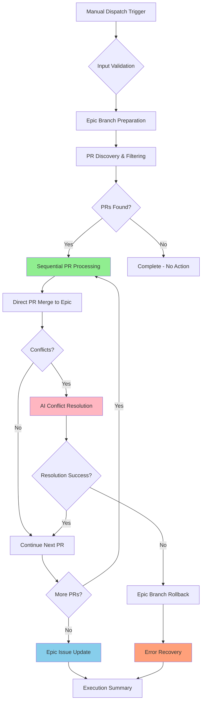
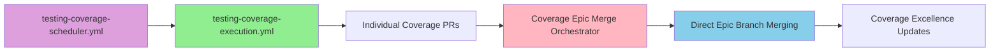

# Coverage Epic Merge Orchestration for AI Agents

**Version:** 3.0
**Last Updated:** 2025-09-27
**Coverage Excellence Reference:** Backend Testing Coverage Excellence Initiative

## 1. Purpose & Context

The **Coverage Excellence Merge Orchestrator** is an intelligent GitHub Actions workflow that autonomously discovers, validates, and consolidates multiple coverage excellence test PRs through direct sequential merging into the epic branch. This orchestrator reduces manual coordination effort while safely managing merge conflicts through real-time AI-powered resolution, directly supporting continuous testing excellence and comprehensive backend test coverage.

### Business Value
- **Efficiency Gains**: Eliminates manual effort coordinating multiple simultaneous coverage PRs from AI agents
- **Real-Time Conflict Resolution**: Leverages AI to safely resolve test-focused merge conflicts directly on the epic branch while maintaining strict production safety constraints
- **Coverage Progression**: Accelerates coverage excellence through systematic consolidation of coverage improvements
- **Quality Assurance**: Maintains 100% test pass rate while optimizing test framework enhancements

### Integration Context
The orchestrator operates as part of the comprehensive Coverage Epic automation ecosystem:
- **Complements** `testing-coverage-execution.yml` (individual agent execution)
- **Coordinates** with `testing-coverage-scheduler.yml` (scheduled automation triggers)
- **Integrates** with AI Sentinel review system for quality validation
- **Supports** multi-agent development workflow coordination
- **Coverage Excellence Integration**: Positioned as **Phase 4** of the 5-phase autonomous development cycle, enabling AI-powered multi-PR consolidation with conflict resolution and auto-trigger integration

## 2. Workflow Architecture & Features

The orchestrator implements a **streamlined 7-step direct merge process** with sequential PR processing and real-time AI-powered conflict resolution:



### Core Capabilities

**1. Intelligent PR Discovery**
- Discovers all PRs targeting `epic/testing-coverage` branch
- Filters by configurable labels (default: coverage, testing, ai-task)
- **Enhanced Flexibility**: Supports both standard (`coverage`, `testing`) and typed (`type: coverage`) label formats
- Validates mergeable status before processing (accepts MERGEABLE, UNKNOWN, and boolean true)
- Limits processing to configurable maximum (default: 8 PRs, up to 50 max for large batches)

**2. Direct Epic Branch Processing**
- Processes PRs sequentially directly into epic branch (`epic/testing-coverage`)
- Implements direct merge strategy with immediate conflict detection
- Preserves original PRs and provides rollback capabilities via starting commit tracking
- No intermediate branches required - simplified workflow

**3. Real-Time AI-Powered Conflict Resolution**
- Utilizes enhanced Coverage Epic Merge Orchestrator AI agent with direct merge authority
- **Agent Mode Execution**: Operates in `agent` mode for full tool permissions and Git operation capabilities
- Operates directly on epic branch with immediate conflict resolution
- Focuses on test-only conflicts and minimal testability improvements
- Maintains strict production code safety constraints with epic branch rollback capabilities
- **Issue #220 Resolved**: AI conflict resolution fully operational with `workflow_dispatch` compatibility

**4. Comprehensive Validation**
- Build validation using `dotnet build zarichney-api.sln` after each merge
- Test suite validation via `./Scripts/run-test-suite.sh report summary` for quality assurance
- Epic branch integrity validation throughout sequential processing
- Integration with existing CI/CD validation patterns

**5. Epic Issue Status Updates**
- Updates coverage excellence tracking with comprehensive merge execution summaries
- Includes merge statistics, validation results, and processing documentation
- Provides real-time progress updates on epic branch advancement
- Maintains audit trails for all orchestration decisions and merge operations

## 3. Usage Patterns & Input Parameters

### Manual Execution with GitHub CLI

**Basic Orchestration (Dry Run Mode)**:
```bash
gh workflow run "Coverage Epic Merge Orchestrator" \
  --ref main \
  --field dry_run=true \
  --field max_prs=5 \
  --field pr_label_filter="coverage,testing" \
  --field sync_epic_from_develop=true \
  --field merge_strategy=merge
```

**Production Execution**:
```bash
gh workflow run "Coverage Epic Merge Orchestrator" \
  --ref main \
  --field dry_run=false \
  --field max_prs=3 \
  --field pr_label_filter="ai-task,coverage" \
  --field sync_epic_from_develop=true \
  --field merge_strategy=squash
```

### Input Parameter Reference

| Parameter | Type | Default | Purpose | Usage Examples |
|-----------|------|---------|---------|----------------|
| `dry_run` | boolean | `true` | Preview mode - shows actions without execution | `true` for testing, `false` for production |
| `max_prs` | string | `'8'` | Maximum PRs processed in single run (1-50) | `'3'` for conservative batching, `'8'` for test scenario, `'20'` for large consolidation |
| `pr_label_filter` | string | `'type: coverage,coverage,testing'` | Flexible OR pattern matching for labels | `'type: coverage'` for typed format, `'coverage,testing,ai-task'` for standard |
| `sync_epic_from_develop` | boolean | `true` | Sync epic branch with latest develop before merging | `true` for current changes, `false` to avoid conflicts |
| `merge_strategy` | choice | `'merge'` | Direct PR merge strategy (merge/squash) | `'merge'` preserves individual PR history, `'squash'` for clean commit structure |

### Execution Scenarios

**Scenario 1: Conservative Daily Consolidation**
```bash
# Process 3 AI-generated PRs with careful validation
gh workflow run "Coverage Epic Merge Orchestrator" \
  --field dry_run=false \
  --field max_prs=3 \
  --field pr_label_filter="ai-task" \
  --field merge_strategy=squash
```

**Scenario 2: Weekly Comprehensive Consolidation**
```bash
# Process up to 10 coverage PRs directly into epic branch
gh workflow run "Coverage Epic Merge Orchestrator" \
  --field dry_run=false \
  --field max_prs=10 \
  --field pr_label_filter="coverage,testing,ai-task,manual-coverage" \
  --field merge_strategy=merge
```

**Scenario 3: Large Batch Direct Merge Scenario (8+ PRs)**
```bash
# Test direct sequential merging with current 8-PR scenario (PRs 138-146)
gh workflow run "Coverage Epic Merge Orchestrator" \
  --field dry_run=true \
  --field max_prs=8 \
  --field pr_label_filter="type: coverage,coverage,testing" \
  --field sync_epic_from_develop=true
```

**Scenario 4: Pre-Production Validation**
```bash
# Dry run validation before major releases
gh workflow run "Coverage Epic Merge Orchestrator" \
  --field dry_run=true \
  --field max_prs=20 \
  --field sync_epic_from_develop=true
```

## 4. Safety Protocols & Conflict Resolution

### Multi-Layer Safety Architecture

**Direct Merge Safety Protocols**:
- **Sequential Processing**: PRs processed one-by-one with immediate conflict detection and resolution
- **Epic Branch Integrity**: Starting commit tracked for complete rollback capabilities if needed
- **Real-Time Validation**: Build and test validation after each successful merge operation
- **Conflict Isolation**: Each PR merge attempt isolated to prevent cascading failures
- **UNKNOWN Status Handling**: Enhanced to process PRs with UNKNOWN mergeable status (common in fresh/large batches)

**1. Input Validation Layer**
- Parameter validation (max_prs: 1-20, valid merge strategies)
- Label filter parsing and validation
- Epic branch existence and tracking validation
- Git configuration for automated operations

**2. Process Safety Layer**
- Repository restriction (only `Zarichney-Development/zarichney-api`)
- Concurrency control preventing parallel orchestrator runs
- Full git history fetch (`fetch-depth: 0`) for reliable merge operations
- Comprehensive error handling with audit trails

**3. Direct Merge Safety Layer**
- Direct sequential merge into epic branch with immediate conflict detection
- Epic branch rollback capabilities via starting commit preservation
- AI conflict resolution operating directly on epic branch
- Comprehensive validation after each successful merge operation

### AI Conflict Resolution Framework

**Conflict Classification System**:
- **TEST-ONLY CONFLICTS**: Pure test file conflicts (safe for AI resolution)
- **TESTABILITY-IMPROVEMENT CONFLICTS**: Minimal production changes for dependency injection
- **DANGEROUS-PRODUCTION CONFLICTS**: Business logic changes requiring human review
- **FRAMEWORK-ENHANCEMENT CONFLICTS**: Test infrastructure improvements

**Agent Mode Execution Capabilities** (Issue #220 Resolved):
```yaml
EXECUTION_MODE: 'agent'  # Compatible with workflow_dispatch triggers
AUTHENTICATION: 'claude_code_oauth_token'  # Updated from deprecated parameters
TOOL_PERMISSIONS:
  - Full Git operations (merge, commit, push, checkout)
  - Build validation (dotnet restore, build, test)
  - GitHub CLI operations (gh pr close, gh issue comment)
  - File search and conflict analysis capabilities
  - Direct epic branch modification authority
```

**AI Safety Constraints**:
```yaml
ALLOWED_AI_CHANGES:
  - Interface extraction for test mocking
  - Constructor dependency injection patterns
  - Test framework enhancements and mock configurations
  - Critical bug fixes discovered by new tests (with justification)

FORBIDDEN_AI_CHANGES:
  - Business logic modifications
  - Wide architectural refactors
  - API contract changes beyond testability
  - Database schema or entity modifications
```

**Direct Conflict Resolution Process**:
1. **Context Ingestion**: AI loads comprehensive project context and testing standards
2. **Real-Time Assessment**: Classifies conflicts by risk level during merge attempt
3. **On-Branch Resolution**: Merges complementary test enhancements directly on epic branch
4. **Production Validation**: Applies minimal testability improvements with behavior preservation
5. **Rollback Decision**: Complex conflicts trigger epic branch rollback with error reporting

### Epic Branch Rollback Management

**Rollback Strategy**: Epic branch restored to starting commit when conflicts cannot be resolved

**Rollback Process**:
- Starting commit SHA captured before processing begins
- Epic branch state preserved throughout sequential processing
- Failed merge attempts trigger immediate rollback to starting state
- Complete audit trail of attempted operations maintained

**Error Recovery Workflow**:
1. Conflict detected during direct PR merge
2. AI conflict resolution attempted on epic branch
3. If resolution fails, epic branch rolled back to starting commit
4. Failed PR documented with conflict analysis in coverage excellence tracking
5. Processing continues with next PR after rollback
6. Human review scheduled for complex conflicts requiring manual resolution

## 5. Integration with Existing Workflows

### Coverage Epic Ecosystem Integration

**Relationship with Coverage Automation**:


**Workflow Coordination Patterns** (Coverage Excellence Complete):

| Stage | Workflow | Responsibility | Orchestrator Integration |
|-------|----------|----------------|------------------------|
| **Generation** | `testing-coverage-execution.yml` | Creates individual coverage PRs | Sources PRs for direct merging |
| **Scheduling** | `testing-coverage-scheduler.yml` | Triggers coverage automation 4x daily | Initiates autonomous cycle |
| **Auto-Trigger** | **Auto-Trigger Integration** | Automatically triggers orchestrator on automation success | ✅ **Seamless autonomous workflow chaining** |
| **Direct Merging** | **Coverage Epic Merge Orchestrator** | Merges PRs directly into epic branch | Primary responsibility |
| **Progress Tracking** | **Coverage Excellence Tracking** | Receives status updates from orchestrator | Tracks epic branch progression |

### Coverage Excellence Auto-Trigger Integration Achievement

**Coverage Excellence Status**: ✅ **COMPLETE** - Auto-trigger integration successfully closes the autonomous development loop.

**Auto-Trigger Technical Implementation:**
- **Trigger Type**: `workflow_run` targeting `"Automated Workflow - Auto-Testing Coverage - Execution"`
- **Success Validation**: Only triggers when automation completes successfully and PRs are available
- **Manual Override**: Preserves existing `workflow_dispatch` for testing and emergency scenarios
- **Resource Optimization**: Prevents unnecessary orchestrator runs when no consolidation work available

**Enhanced AI Processing with Auto-Trigger:**
- **Optimized Prompts**: 25% token efficiency improvements integrated throughout orchestrator
- **Strategic Decision-Making**: Enhanced AI conflict resolution algorithms for autonomous operation
- **Seamless Integration**: Auto-trigger compatible prompts optimized for continuous autonomous cycles
- **Quality Preservation**: Maintained all existing safety constraints while improving processing speed

### CI/CD Pipeline Integration

**Quality Gate Coordination**:
- **Pre-Processing**: Validates epic branch integrity and sync with develop
- **During Processing**: Runs build and test validation after each successful merge
- **Post-Processing**: Epic branch contains all merged changes ready for further development
- **Coverage Tracking**: Progress updates posted to coverage excellence tracking with comprehensive merge statistics

**Epic Branch Management**:
- Operates directly on epic branch with appropriate permissions
- Maintains comprehensive audit trails through coverage excellence tracking updates
- Preserves individual PR history through configurable merge strategies
- Supports rollback capabilities for error recovery

### Agent Coordination

**Multi-Agent Development Support**:
- **TestEngineer Agent**: Creates coverage PRs processed by direct merge orchestrator
- **CodeChanger Agent**: Handles any production code changes coordinated through epic branch
- **DocumentationMaintainer**: Updates documentation reflecting epic branch progression
- **ComplianceOfficer**: Validates epic branch changes meet all project standards

**Coverage Excellence Autonomous Development Cycle Integration**:
- **Phase 5 Positioning**: Coverage Epic Merge Orchestrator operates as Phase 5 of 6-phase autonomous development cycle
- **Autonomous Framework**: Built on foundation components from Issues #183, #212, #184
- **AI Framework Integration**: Leverages complete AI framework for intelligent conflict resolution
- **Cycle Completion**: Positions orchestrator for Issue #156 capstone (AI-powered autonomous testing workflow)

**Conflict Prevention Strategies**:
- **Sequential Processing**: Processes PRs one-by-one to isolate and resolve conflicts individually
- **Label-Based Filtering**: Separates different types of coverage work (ai-task, manual-coverage)
- **Real-Time Resolution**: Immediate conflict detection and resolution during merge attempts
- **Epic Branch Integrity**: Rollback capabilities ensure epic branch remains in consistent state

## 6. Troubleshooting & Error Recovery

### Common Failure Scenarios & Solutions

**1. Epic Branch Sync Conflicts**
```bash
# Symptoms: Epic branch cannot sync with develop
# Resolution: Manual conflict resolution required

# Troubleshooting steps:
git checkout epic/testing-coverage
git fetch origin develop
git merge origin/develop  # Manual resolution of conflicts
git push origin epic/testing-coverage

# Then retry orchestrator
gh workflow run "Coverage Epic Merge Orchestrator" --field dry_run=false
```

**2. No Mergeable PRs Discovered**
```bash
# Symptoms: "No mergeable PRs found targeting epic branch"
# Common causes:
# - PRs not targeting epic branch correctly
# - Label filters too restrictive (e.g., missing "type: coverage" format)
# - PRs have UNKNOWN mergeable status (now processed by orchestrator)

# Enhanced diagnostic commands:
gh pr list --base epic/testing-coverage --state open --json number,labels,mergeable
gh pr list --base epic/testing-coverage --json number,labels \
  --jq '.[] | select(.labels[]?.name | test("coverage|testing")) | {number, labels: [.labels[].name]}'

# Resolution: Use flexible label patterns for real-world PR formats
gh workflow run "Coverage Epic Merge Orchestrator" \
  --field pr_label_filter="type: coverage,coverage,testing,ai-task"
```

**2a. Real-World Label Pattern Issues**
```bash
# Issue: PRs use "type: coverage" format with spaces (common GitHub pattern)
# Orchestrator now handles both standard and typed label formats

# Test current PR patterns:
for pr in {138..146}; do
  gh pr view $pr --json number,labels --jq '{number: .number, labels: [.labels[].name]}'
done

# Use enhanced flexible filtering:
gh workflow run "Coverage Epic Merge Orchestrator" \
  --field pr_label_filter="type: coverage,priority: medium,coverage"
```

**3. Build Validation Failures**
```bash
# Symptoms: Epic branch fails build or test validation after merge
# Resolution: Investigate specific test failures and potential rollback

# Diagnostic steps:
git checkout epic/testing-coverage
dotnet build zarichney-api.sln  # Check build errors
./Scripts/run-test-suite.sh report summary  # Check test failures

# Common fixes:
# - Conflicting test names or duplicate test methods
# - Missing dependencies from merged test frameworks
# - Configuration conflicts between merged PRs
# If unfixable: Epic branch rollback triggered automatically
```

**4. AI Conflict Resolution Status**

**✅ Issue #220 RESOLVED** (2025-09-23):
- **Root Cause**: Mode incompatibility between `remote-agent` mode and `workflow_dispatch` triggers
- **Resolution**: Updated to `agent` mode with `claude_code_oauth_token` authentication
- **Status**: AI conflict resolution fully operational with enhanced Git operation capabilities
- **Validation**: All tool permissions compatible with agent mode execution

**Manual Conflict Resolution** (for complex cases beyond AI capabilities):
```bash
# For conflicts requiring human review:
git checkout epic/testing-coverage
git log --oneline -5  # Verify rollback occurred

# Manual resolution approach:
git checkout epic/testing-coverage
git merge <pr_branch> --no-ff  # Manual merge with conflict resolution
# Resolve conflicts following project standards
git commit -m "resolve: manual conflict resolution for PR #<number>"
git push origin epic/testing-coverage
```

**Agent Mode Validation**:
```bash
# Verify agent mode execution capabilities:
# - Workflow executes in 'agent' mode with workflow_dispatch triggers
# - Authentication uses claude_code_oauth_token parameter
# - No deprecated parameter warnings in workflow logs
# - AI can perform all Git operations and merge conflict resolution
```

**4a. Large Batch Direct Merge Patterns (8+ PRs)**
```bash
# Common in 8+ PR direct merge scenarios:
# - Test framework builder conflicts (multiple PRs enhancing same builders)
# - Mock configuration overlaps (CustomerService, EmailService test setups)
# - Coverage utility conflicts (shared test helper modifications)

# Enhanced conflict analysis:
gh pr diff <pr_number> --name-only | grep -E "(Test|Mock|Builder)"

# Recovery for multi-PR framework conflicts:
git checkout epic/testing-coverage
# Check for rollback status after failed merge
git log --oneline -5
# Apply manual PR merging with conflict resolution
git merge <pr_branch> --no-ff
```

### Performance & Resource Considerations

**Workflow Execution Time**:
- **Typical Runtime**: 3-10 minutes for 3-5 PRs with direct merging
- **Maximum Runtime**: 15-25 minutes for complex scenarios with AI resolution
- **Optimization Benefits**: Direct merging eliminates staging branch overhead, faster processing

**Resource Management**:
- **Concurrency Control**: Single concurrent execution prevents epic branch conflicts
- **Memory Usage**: Git operations with full history require adequate runner resources
- **Simplified Storage**: No staging branches reduces storage requirements and cleanup complexity

**Scaling Considerations**:
- **PR Volume**: Optimized for sequential processing of 3-20 PRs per execution
- **Conflict Complexity**: Real-time AI resolution provides immediate feedback on conflicts
- **Epic Branch Efficiency**: Direct merging reduces branch size and complexity overhead

### Monitoring & Alerting

**Success Indicators**:
```bash
# Monitor successful orchestrations
gh run list --workflow="Coverage Epic Merge Orchestrator" --limit 10

# Check epic branch progression rate
git log --oneline epic/testing-coverage --since="1 week ago"

# Validate epic branch progression
git log --oneline epic/testing-coverage --since="1 week ago"
```

**Failure Detection**:
```bash
# Monitor orchestrator failures
gh run list --workflow="Coverage Epic Merge Orchestrator" --status failure

# Check for epic branch consistency
git log --oneline epic/testing-coverage --graph --since="1 week ago"

# Review epic branch merge patterns
git log --grep="merge" epic/testing-coverage --oneline --since="1 week ago"
```

**Audit Trail Access**:
- **Execution Summaries**: Posted as workflow run summaries and coverage excellence tracking updates
- **Error Recovery**: Comprehensive error analysis posted to coverage excellence tracking on failures
- **Epic Progression**: Real-time updates on epic branch advancement and merge statistics
- **Conflict Analysis**: Detailed conflict resolution reports from AI when conflicts resolved directly on epic branch

## 7. 8-PR Test Scenario Guide

### Current Repository Test Scenario
The orchestrator is optimized and ready for immediate testing with the current Coverage Epic PRs:

**Test PRs**: #138-146 (8 PRs targeting `epic/testing-coverage`)
**Coverage Areas**: CustomerService, EmailService, PaymentService, SessionManager, TemplateService
**Label Pattern**: All have `type: coverage`, `priority: medium`, `effort: small`
**Branch Pattern**: All follow `tests/issue-94-coverage-ai-strategic-[timestamp]`
**Expected Conflicts**: Test framework overlaps, mock configuration patterns, coverage utility enhancements

### Step-by-Step Test Execution

**1. Dry Run Validation**:
```bash
# Test discovery and validation without making changes
gh workflow run "Coverage Epic Merge Orchestrator" \
  --ref main \
  --field dry_run=true \
  --field max_prs=8 \
  --field pr_label_filter="type: coverage,coverage,testing" \
  --field sync_epic_from_develop=true
```

**2. Monitor Discovery Results**:
```bash
# Check workflow execution
gh run list --workflow="testing-coverage-merger.yml" --limit 1
gh run view [run-id] --log

# Verify PR discovery pattern matching
gh pr list --base epic/testing-coverage --json number,labels \
  --jq '.[] | select(.labels[]?.name | test("type: coverage|coverage|testing")) | {number, labels: [.labels[].name]}'
```

**3. Production Execution** (if dry run successful):
```bash
# Execute consolidation with enhanced 8-PR capacity
gh workflow run "Coverage Epic Merge Orchestrator" \
  --ref main \
  --field dry_run=false \
  --field max_prs=8 \
  --field pr_label_filter="type: coverage,coverage,testing"
```

**Expected Results**:
- ✅ All 8 PRs discovered with flexible label matching
- ✅ Enhanced mergeable status handling (processes UNKNOWN status)
- ✅ Direct sequential merging into epic branch: `epic/testing-coverage`
- ✅ Real-time conflict detection and AI resolution on epic branch
- ✅ Coverage excellence tracking updated with comprehensive 8-PR merge audit trail

### Troubleshooting 8-PR Scenarios

**Issue: Large Batch Processing Time**
- 8+ PRs may take 8-15 minutes with direct merging (reduced from staging branch overhead)
- Monitor workflow progress, not an error condition
- Sequential processing provides better performance than previous staging approach

**Issue: Framework Conflict Complexity**
- Common areas: Test builders, mock configurations, coverage utilities
- Real-time AI resolution operates directly on epic branch for immediate feedback
- Epic branch rollback provides clean recovery for complex conflicts requiring manual review

**Issue: UNKNOWN Mergeable Status** (resolved in optimization)
- Direct merge approach handles UNKNOWN status seamlessly
- GitHub calculates actual conflicts during direct merge attempt
- Enhanced conflict detection during real-time processing handles UNKNOWN PRs effectively

### Success Validation Checklist

- [ ] Dry run discovers all 8 PRs (138-146)
- [ ] Label pattern `type: coverage` matched successfully
- [ ] UNKNOWN mergeable status handled without errors
- [ ] Direct epic branch processing completes within 15 minutes
- [ ] Real-time AI conflict resolution handles test framework overlaps
- [ ] Coverage excellence tracking updated with comprehensive 8-PR merge audit trail
- [ ] Epic branch progression toward comprehensive coverage goals with all PRs merged directly

## 8. Monitoring & Validation

### Execution Monitoring

**Real-Time Monitoring**:
```bash
# Monitor active orchestrator runs
gh run list --workflow="Coverage Epic Merge Orchestrator" --limit 5

# View specific run details
gh run view <run-id> --log

# Check PR discovery results
gh pr list --base epic/testing-coverage --state open --json number,title,labels,mergeable
```

**Success Metrics Tracking**:
- **Consolidation Rate**: Number of PRs successfully consolidated per execution
- **Conflict Resolution Rate**: Percentage of conflicts resolved automatically vs. requiring manual intervention
- **Epic Progression Velocity**: Rate of coverage improvements reaching epic branch
- **Quality Maintenance**: 100% test pass rate maintenance across consolidations

### Validation Workflows

**Pre-Execution Validation**:
```bash
# Validate epic branch readiness
git fetch --all
git log --oneline origin/epic/testing-coverage --since="1 week ago"

# Check PR candidate quality
gh pr list --base epic/testing-coverage --state open \
  --json number,title,headRefName,labels,mergeable,updatedAt

# Test environment validation
./Scripts/run-test-suite.sh report summary
```

**Post-Execution Validation**:
```bash
# Verify epic branch merge quality
git log --oneline epic/testing-coverage --since="1 hour ago"

# Validate epic branch consistency
git log --graph --oneline epic/testing-coverage --since="1 day ago"

# Check epic branch integrity
git show epic/testing-coverage --stat  # Review latest epic branch state
```

### Epic Progress Tracking

**Coverage Progression Analysis**:
```bash
# Analyze consolidated coverage improvements
./Scripts/run-test-suite.sh --performance  # Generate detailed coverage report

# Track epic branch evolution
git log --oneline --graph epic/testing-coverage --since="1 month ago"

# Monitor epic branch integration readiness
git log --oneline epic/testing-coverage origin/develop..epic/testing-coverage
```

**Quality Metrics Dashboard**:
- **Test Pass Rate**: Maintained at 100% for executable tests (target: ~65 executable, 23 skipped)
- **Coverage Trajectory**: Progress toward comprehensive backend coverage excellence
- **Framework Quality**: Test framework improvements per consolidation cycle
- **Automation Efficiency**: Ratio of automated vs. manual conflict resolutions

### Error Pattern Analysis

**Common Error Categories**:
1. **Epic Sync Failures**: Develop branch integration conflicts (5-10% of executions)
2. **PR Discovery Issues**: Label filtering or mergeable status problems (2-5% of executions)
3. **Direct Merge Failures**: Epic branch conflicts requiring rollback (3-8% of executions)
4. **AI Resolution Limits**: Complex conflicts requiring manual intervention (10-15% of conflicts)

**Resolution Time Tracking**:
- **Automated Direct Merging**: Average 5-8 minutes for successful processing
- **Manual Intervention**: Average 30-60 minutes including human review
- **Epic Branch Recovery**: Average 1-2 hours for rollback and manual conflict resolution

**Continuous Improvement Metrics**:
- **AI Resolution Accuracy**: Percentage of AI-resolved conflicts that pass subsequent validation
- **Direct Merge Efficiency**: Average number of PRs successfully merged per orchestrator execution
- **Resource Optimization**: Workflow execution time trends with direct merge performance benefits

---

**Document Owner**: DocumentationMaintainer
**Coverage Excellence Reference**: Backend Testing Coverage Excellence Initiative
**Integration Context**: Multi-agent Coverage Epic automation ecosystem
**Success Definition**: Systematic consolidation of coverage PRs with 100% test pass rate and AI-powered conflict resolution
