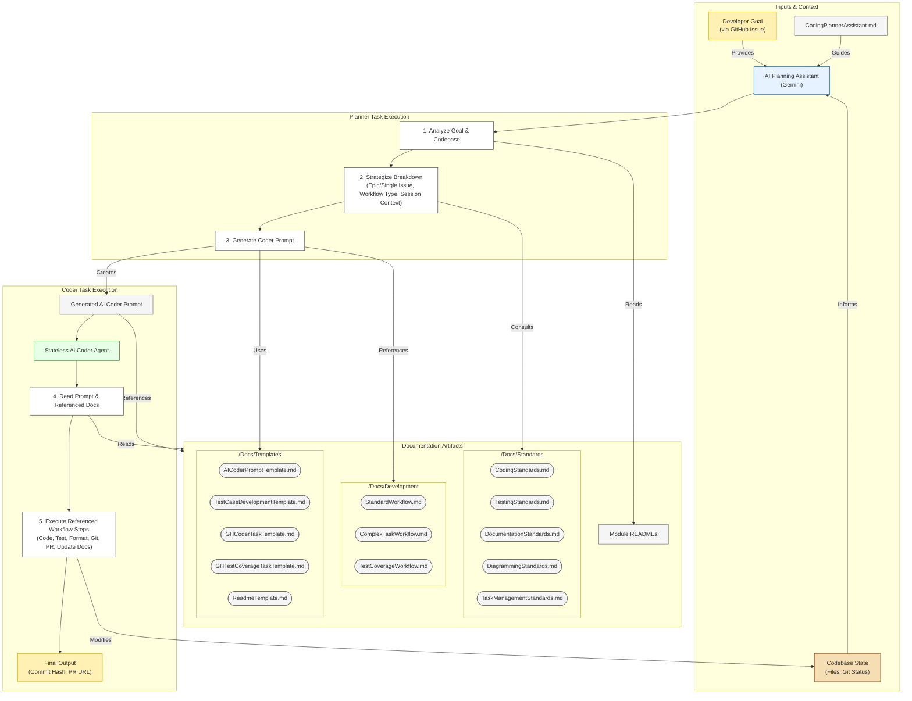

# Module/Directory: Docs/Development

**Last Updated:** 2025-05-04

> **Parent:** [`Docs`](../README.md)

## 1. Purpose & Responsibility

* **What it is:** This directory houses documentation defining the *workflows and processes* specifically governing the development of the Zarichney API application, with a focus on facilitating AI-assisted development.
* **Key Responsibilities:**
    * Outlining the high-level AI-assisted workflow involving planning and coding agents.
    * Providing links to the specific prompts, templates, and detailed workflow steps used in this process.
    * Documenting the short-term technical roadmap and deferred items.
* **Why it exists:** To establish a clear and effective AI-assisted development process, ensuring tasks are well-defined, context is appropriately provided to AI assistants, and standards are consistently referenced.
* **Core Documents within this Directory:**
    * [`CodingPlannerAssistant.md`](./CodingPlannerAssistant.md): Defines the workflow and prompt for the AI assistant responsible for planning and decomposing tasks.
    * [`StandardWorkflow.md`](./StandardWorkflow.md): Details the step-by-step workflow for the AI Coder performing standard development tasks.
    * [`ComplexTaskWorkflow.md`](./ComplexTaskWorkflow.md): Details the step-by-step workflow for the AI Coder performing complex or novel tasks using a TDD/Plan-First approach.
    * [`TestCoverageWorkflow.md`](./TestCoverageWorkflow.md): Details the step-by-step workflow for the AI Coder performing test coverage enhancement tasks.
    * [`ShortTermRoadmap.md`](./ShortTermRoadmap.md): Captures planned enhancements and deferred items for the codebase and development workflow.
* **Related Templates (Located in /Docs/Templates/):**
    * [`../Templates/AICoderPromptTemplate.md`](../Templates/AICoderPromptTemplate.md): The mandatory template structure used by the Planning Assistant to generate prompts for AI Coders performing coding tasks.
    * [`../Templates/TestCaseDevelopmentTemplate.md`](../Templates/TestCaseDevelopmentTemplate.md): The mandatory template structure used by the Planning Assistant to generate prompts for AI Coders performing test coverage tasks.
    * [`../Templates/GHCoderTaskTemplate.md`](../Templates/GHCoderTaskTemplate.md): Template for GitHub Issues related to general coding tasks.
    * [`../Templates/GHTestCoverageTaskTemplate.md`](../Templates/GHTestCoverageTaskTemplate.md): Template for GitHub Issues related to test coverage tasks.
    * [`../Templates/ReadmeTemplate.md`](../Templates/ReadmeTemplate.md): The mandatory template for per-directory READMEs.
* **Core Standards (Located in /Docs/Standards/):**
    * (Links to CodingStandards.md, DocumentationStandards.md, DiagrammingStandards.md, TestingStandards.md, TaskManagementStandards.md)

## 2. AI-Assisted Development Workflow Overview

The core workflow leverages AI assistants in a structured, iterative process, aiming for high quality and consistency through adherence to documented standards and context. The AI Planning Assistant acts as the central orchestrator, analyzing goals and codebase state, and then generating precise instructions for stateless AI Coders by referencing standardized templates and workflow definitions.

* **Workflow Diagram:**
    *(Diagram follows conventions defined in [`../Standards/DiagrammingStandards.md`](../Standards/DiagrammingStandards.md))*

## 3\. How to Use This Directory

  * **AI Planning:** Use [`CodingPlannerAssistant.md`](https://www.google.com/search?q=./CodingPlannerAssistant.md) as the starting prompt when engaging the AI Planning Assistant.
  * **AI Coding Workflows:** Review the detailed steps in [`StandardWorkflow.md`](https://www.google.com/search?q=./StandardWorkflow.md), [`ComplexTaskWorkflow.md`](https://www.google.com/search?q=./ComplexTaskWorkflow.md), and [`TestCoverageWorkflow.md`](https://www.google.com/search?q=./TestCoverageWorkflow.md) to understand the execution process for AI Coders.
  * **Templates:** Refer to files in [`/Docs/Templates/`](https://www.google.com/search?q=../Templates/) for the structure of AI Coder prompts and GitHub Issues.
  * **Future Plans:** Consult [`ShortTermRoadmap.md`](https://www.google.com/search?q=./ShortTermRoadmap.md) for planned features and refactoring efforts impacting the development process or codebase architecture.
  * **Standards:** Always ensure development aligns with the rules defined in [`/Docs/Standards/`](https://www.google.com/search?q=../Standards/).

-----
