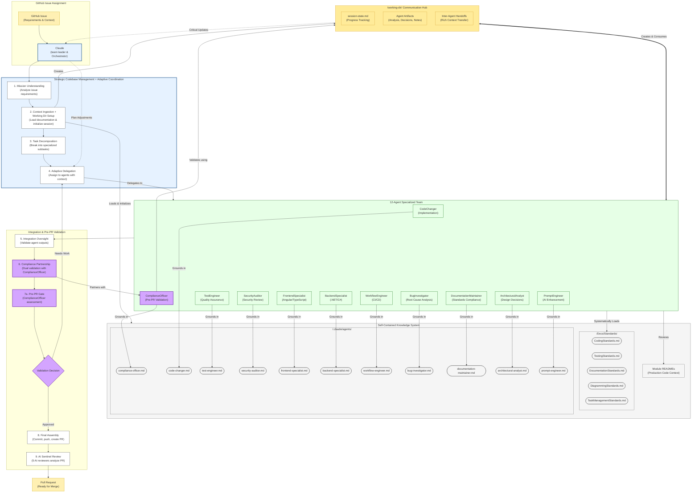

# Module/Directory: Docs/Development

**Last Updated:** 2025-09-01

> **Parent:** [`Docs`](../README.md)

## 1. Purpose & Responsibility

* **What it is:** This directory houses documentation defining the *workflows and processes* specifically governing the development of the Zarichney API application, with a focus on facilitating **12-agent orchestrated development**.
* **Key Responsibilities:**
    * Outlining the strategic codebase manager orchestration model with specialized agent coordination.
    * Documenting the architectural evolution from executor to orchestrator (`CodebaseManagerEvolution.md`).
    * Providing comprehensive documentation grounding protocols that ensure agents maintain contextual awareness.
    * Documenting the short-term technical roadmap and deferred items.
* **Why it exists:** To establish a clear and effective **multi-agent development process**, ensuring tasks are well-defined, agents operate with comprehensive context, and standards are consistently applied across the development team.
* **Core Documents within this Directory:**
    * **[`CodebaseManagerEvolution.md`](./CodebaseManagerEvolution.md): ARCHITECTURAL FOUNDATION** - Documents the evolution from executor to orchestrator model with 12-agent specialization.
    * [`CodingPlannerAssistant.md`](./CodingPlannerAssistant.md): Legacy workflow documentation (superseded by orchestration model).
    * [`StandardWorkflow.md`](./StandardWorkflow.md): Legacy workflow documentation (superseded by specialized agent protocols).
    * [`ComplexTaskWorkflow.md`](./ComplexTaskWorkflow.md): Legacy workflow documentation (superseded by specialized agent protocols).
    * [`TestCoverageWorkflow.md`](./TestCoverageWorkflow.md): Legacy workflow documentation (superseded by TestEngineer agent).
    * [`LoggingGuide.md`](./LoggingGuide.md): Comprehensive guide for the enhanced logging system, including configuration and best practices.
    * [`TestArtifactsGuide.md`](./TestArtifactsGuide.md): Guide for understanding and using CI/CD test artifacts including coverage reports and test results.
    * [`TestSuiteBaselineGuide.md`](./TestSuiteBaselineGuide.md): Practical interpretation guide for test suite baseline validation results, troubleshooting workflows, and actionable guidance for achieving progressive coverage targets.
    * [`TestSuiteEnvironmentSetup.md`](./TestSuiteEnvironmentSetup.md): Comprehensive environment setup requirements for all test classifications, external service configuration, and optimization strategies to minimize skip rates.
    * [`ShortTermRoadmap.md`](./ShortTermRoadmap.md): Captures planned enhancements and deferred items for the codebase and development workflow.
* **Related Templates (Located in /Docs/Templates/):**
    * [`../Templates/AICoderPromptTemplate.md`](../Templates/AICoderPromptTemplate.md): The mandatory template structure used by the Planning Assistant to generate prompts for AI Coders performing coding tasks.
    * [`../Templates/TestCaseDevelopmentTemplate.md`](../Templates/TestCaseDevelopmentTemplate.md): The mandatory template structure used by the Planning Assistant to generate prompts for AI Coders performing test coverage tasks.
    * [`../Templates/GHCoderTaskTemplate.md`](../Templates/GHCoderTaskTemplate.md): Template for GitHub Issues related to general coding tasks.
    * [`../Templates/GHTestCoverageTaskTemplate.md`](../Templates/GHTestCoverageTaskTemplate.md): Template for GitHub Issues related to test coverage tasks.
    * [`../Templates/ReadmeTemplate.md`](../Templates/ReadmeTemplate.md): The mandatory template for per-directory READMEs.
* **Core Standards (Located in /Docs/Standards/):**
    * (Links to CodingStandards.md, DocumentationStandards.md, DiagrammingStandards.md, TestingStandards.md, TaskManagementStandards.md)

## 2. 12-Agent Orchestrated Development Workflow Overview

The core workflow leverages a **strategic codebase manager** (Claude) as the team leader orchestrating 11 specialized AI agents in a structured, coordinated process. This evolution includes pre-PR validation through the Compliance Officer partnership and rich inter-agent communication via the `/working-dir/` system. Each agent employs comprehensive **documentation grounding protocols** to ensure contextual awareness and standards alignment.

* **Orchestration Workflow Diagram:**
    *(Diagram follows conventions defined in [`../Standards/DiagrammingStandards.md`](../Standards/DiagrammingStandards.md))*

## 3. How to Use This Directory

* **Understanding the Architecture:** Start with [`CodebaseManagerEvolution.md`](./CodebaseManagerEvolution.md) to understand the strategic orchestration model and 12-agent specialization (11 subagents + codebase manager).
* **Agent Coordination:** Review the specialized agent instruction files in [`/.claude/agents/`](../../.claude/agents/) to understand individual agent capabilities and documentation grounding protocols.
* **Legacy Workflows:** Historical workflow files (`CodingPlannerAssistant.md`, `StandardWorkflow.md`, etc.) are maintained for reference but have been superseded by the agent orchestration model.
* **Templates:** Refer to files in [`/Docs/Templates/`](../Templates/) for the structure of GitHub Issues and documentation templates.
* **Future Plans:** Consult [`ShortTermRoadmap.md`](./ShortTermRoadmap.md) for planned features and refactoring efforts.
* **Standards:** Always ensure development aligns with the rules defined in [`/Docs/Standards/`](../Standards/) - these are systematically loaded by all agents through documentation grounding protocols.

-----
