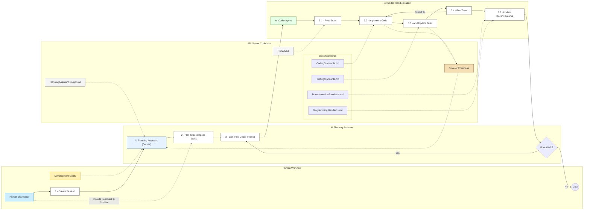

# Module/Directory: Docs/Development

**Last Updated:** 2025-04-20

> **Parent:** [`Docs`](../README.md) [cite: Docs/README.md]

## 1. Purpose & Responsibility

* **What it is:** This directory houses documentation defining the *workflows and processes* specifically governing the development of the Zarichney API application, with a focus on facilitating AI-assisted development.
* **Key Responsibilities:**
    * Outlining the AI-assisted workflow for code planning and implementation (`CodingPlannerAssistant.md`).
    * Providing templates related to specific development tasks (e.g., `TestCaseDevelopmentTemplate.md`).
* **Why it exists:** To establish a clear and effective AI-assisted development process, ensuring tasks are well-defined, context is appropriately provided to AI assistants, and standards are consistently referenced.
* **Documents within this Directory:**
    * [`CodingPlannerAssistant.md`](./CodingPlannerAssistant.md) - Defines the workflow for using an AI assistant to plan coding tasks and generate prompts for AI coders. [cite: Docs/Development/CodingPlannerAssistant.md]
    * [`TestCaseDevelopmentTemplate.md`](./TestCaseDevelopmentTemplate.md) - Template for generating prompts for AI Coder tasks focused on test case implementation.
* **Core Standards (Located in /Docs/Standards/):**
    * [`../Standards/CodingStandards.md`](../Standards/CodingStandards.md) - Defines C# coding rules. [cite: Docs/Standards/CodingStandards.md]
    * [`../Standards/DocumentationStandards.md`](../Standards/DocumentationStandards.md) - Defines README content/structure rules. [cite: Docs/Standards/DocumentationStandards.md]
    * [`../Standards/DiagrammingStandards.md`](../Standards/DiagrammingStandards.md) - Defines Mermaid diagramming rules. [cite: Docs/Standards/DiagrammingStandards.md]
    * [`../Standards/TestingStandards.md`](../Standards/TestingStandards.md) - Defines automated testing rules. [cite: Docs/Standards/TestingStandards.md]
    * [`../Standards/README_template.md`](../Standards/README_template.md) - The mandatory template for per-directory READMEs. [cite: Docs/Standards/README_template.md]

## 2. Architecture & Key Concepts

* **AI-Assisted Development Workflow:** The core workflow leverages AI assistants in a structured, iterative process. This involves a planning phase with one AI assistant and an implementation phase using separate, stateless AI coder instances guided by detailed prompts. The workflow emphasizes adherence to centralized standards and context provided by per-directory documentation.

* **Workflow Diagram:**
    *(Diagram follows conventions defined in [`../Standards/DiagrammingStandards.md`](../Standards/DiagrammingStandards.md))*

* **Documentation-Centric:** Per-directory `README.md` files (based on `README_template.md` in `/Docs/Standards/`) and embedded/linked diagrams are crucial artifacts, providing essential context for both human developers and AI assistants.

## 3. Interface Contract & Assumptions

* Not applicable for this documentation directory. Contracts are defined within the codebase and documented in specific module READMEs.

## 4. Local Conventions & Constraints (Beyond Global Standards)

* Not applicable for this documentation directory. Conventions are defined *within* the standard documents located in `/Docs/Standards/`.

## 5. How to Work With This Documentation

* **Intended Workflow:**
    1.  **Engage with Planning Assistant:** Provide an AI Planning Assistant (like Gemini, with access to the full codebase via file upload) with the `CodingPlannerAssistant.md` prompt from this directory.
    2.  **Define Goals:** Explain the desired changes or features for the codebase.
    3.  **Collaborative Planning:** Work with the Planning Assistant to clarify requirements, validate the plan against existing documentation (module READMEs, standards in `/Docs/Standards/`), and decompose the work into logical, incremental coding tasks.
    4.  **Generate Coder Prompts:** The Planning Assistant will generate detailed, self-contained prompts for each incremental task, following the template in `CodingPlannerAssistant.md`. Use `TestCaseDevelopmentTemplate.md` as a basis for test-focused tasks.
    5.  **Delegate to AI Coder:** Use these generated prompts to delegate the implementation tasks to separate, stateless AI Coder instances.
* **Mandatory Reading (Standards):** Before performing development tasks (or guiding AI), developers and AI assistants **MUST** consult the relevant standards documents located in `/Docs/Standards/`:
    * `CodingStandards.md` (Before Coding)
    * `DocumentationStandards.md` & `README_template.md` (Before Documenting)
    * `DiagrammingStandards.md` (Before Creating/Updating Diagrams)
    * `TestingStandards.md` (Before Testing)
* **AI Collaboration Guidance:** Use `CodingPlannerAssistant.md` as the foundational prompt and guide for interacting with the Planning Assistant.

## 6. Dependencies

* **Parent:** [`Docs`](../README.md) - This directory is a child of the main documentation directory.
* **Standards:** The workflows defined here rely heavily on the standards documents located in [`../Standards/`](../Standards/README.md).

## 7. Rationale & Key Historical Context

* This directory focuses specifically on the *process* of AI-assisted development, separating workflow definitions from the core standards themselves (which now reside in `/Docs/Standards/`).

## 8. Known Issues & TODOs

* **Maintenance:** The workflow documents (`CodingPlannerAssistant.md`, `TestCaseDevelopmentTemplate.md`) require periodic review and updates as the AI collaboration process evolves.
* **Enforcement:** Consistency relies on adherence to the defined workflows and the referenced standards by both human developers and the AI assistants executing tasks.

