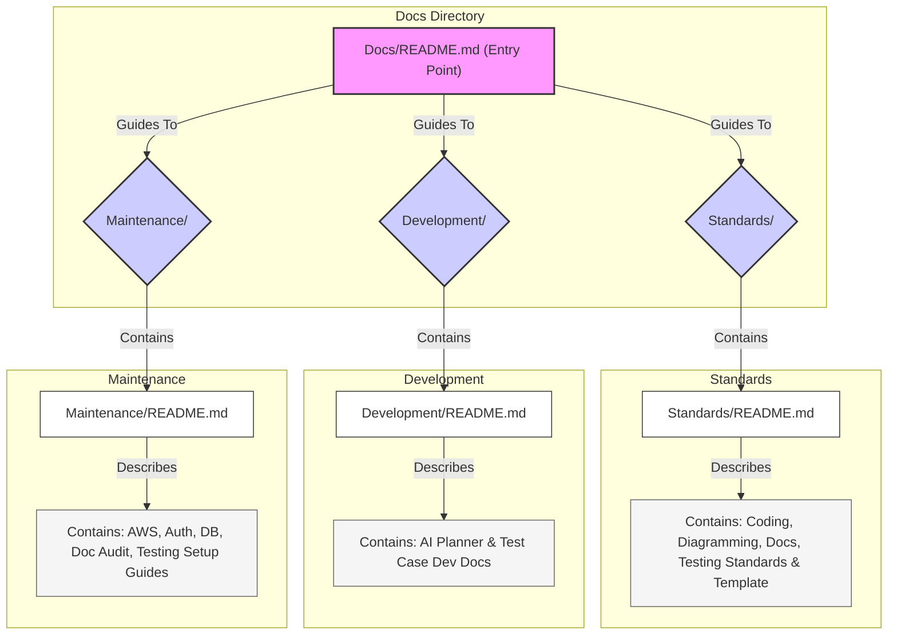

# Module/Directory: Docs

**Last Updated:** 2025-04-20

## 1. Purpose & Responsibility

* **What it is:** This directory is the central repository for all project documentation for the Zarichney API application. It contains standards, guidelines, workflow definitions, templates, and maintenance procedures necessary for understanding, developing, and maintaining the codebase.
* **Rationale:** This documentation is organized into `Standards` (defining *how* to build/document/test), `Development` (defining *workflows* for development), and `Maintenance` (defining operational procedures) to clearly separate different types of project knowledge.
* **Key Responsibilities:**
    * Establishing development, documentation, diagramming, and testing standards.
    * Defining AI-assisted development workflows.
    * Providing templates for consistent documentation.
    * Supplying operational guides for system maintenance (AWS, Database, Authentication - if applicable).
    * Acting as the primary entry point for project-related documentation.
* **Why it exists:** To serve as a single source of truth for project knowledge, facilitate developer onboarding, ensure consistency in development and maintenance practices, and support AI coding assistants by providing necessary context and rules.
* **Key Subdirectories:**
    * [`Standards/`](./Standards/README.md) - **(Mandatory Reading)** Contains all development standards (Coding, Documentation, Diagramming, Testing) and templates.
    * [`Development/`](./Development/README.md) - Defines the AI-assisted development workflow.
    * [`Maintenance/`](./Maintenance/README.md) - (If exists) Contains operational guides for maintaining the application's infrastructure and database.

## 2. How to Work With This Documentation

* **Starting Point:** Use this README as the entry point to navigate the project's documentation.
* **Development Standards & Templates:** Refer to the [`Standards/`](./Standards/README.md) subdirectory for all rules regarding code style, README structure, diagram creation, testing practices, and required templates. **This is essential reading before contributing.**
* **Development Workflow:** Consult the [`Development/`](./Development/README.md) subdirectory for understanding the AI-assisted planning and coding process.
* **Maintenance:** Consult the `Maintenance/` subdirectory (if applicable) for procedures related to infrastructure or database upkeep.
* **New Module Documentation:** Use the `README_template.md` found in [`Standards/`](./Standards/README_template.md), following the guidelines in [`DocumentationStandards.md`](./Standards/DocumentationStandards.md) and [`DiagrammingStandards.md`](./Standards/DiagrammingStandards.md).

