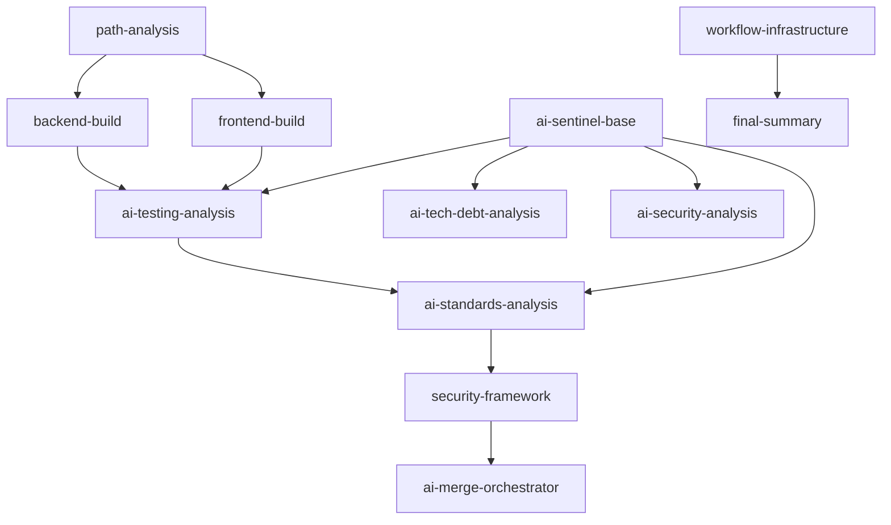

# Epic #181 Architectural Assessment Specification

**Version:** 1.0
**Last Updated:** 2025-09-21
**Epic Context:** Standardize build workflows and implement iterative AI code review for code coverage
**Assessment Date:** 2025-09-21
**Migrated from:** Working directory analysis on 2025-09-21

## Parent Links
- [Epic #181 Build Workflows Overview](../README.md)
- [Project Documentation Root](../../README.md)

## 1. Purpose & Architectural Validation Overview

This specification provides comprehensive architectural assessment of the proposed 23-component extraction strategy from the current 962-line build.yml monolith. The assessment validates system design implications and confirms architectural alignment with Epic #181 objectives while maintaining excellence principles.

**Core Issue:** Validate system design implications of 23-component extraction supporting Epic #181 issues #183-#187 progression

**Architectural Validation Status:** ✅ **APPROVED WITH STRATEGIC RECOMMENDATIONS**
- Component boundaries align with SOLID principles and testability requirements
- Integration patterns support modular monolith architectural philosophy
- Risk mitigation strategies address potential architectural debt concerns
- Epic progression design enables systematic implementation with controlled complexity

## 2. System Design Validation

### 2.1 Component Boundary Analysis

#### Architectural Soundness Assessment
The proposed component categorization demonstrates **excellent architectural coherence**:

**✅ Build & Test Components (High Architectural Merit)**
- **Single Responsibility**: Each component has clear, focused responsibility
- **Interface Segregation**: Path analysis, backend build, frontend build properly separated
- **Dependency Inversion**: Components depend on abstractions (shared actions) not implementations
- **Open/Closed Principle**: Extensible design allowing specialization without modification

**✅ AI Analysis Framework (Sophisticated Architecture)**
- **Strategy Pattern Implementation**: AI Sentinels follow consistent interface patterns
- **Template Method Architecture**: Common patterns abstracted into ai-sentinel-base
- **Chain of Responsibility**: Prompt template → context injection → analysis execution
- **Decorator Pattern Potential**: Failure handling wraps core analysis logic

**✅ Security & Validation Components (Defense-in-Depth Architecture)**
- **Security Boundary Separation**: Clean isolation between scanning types
- **Parallel Processing Design**: Matrix execution supports non-blocking architecture
- **Fail-Safe Patterns**: Non-blocking CodeQL maintains pipeline resilience

**✅ Infrastructure Components (Orchestration Architecture)**
- **Observer Pattern**: Build summary generation observes pipeline state
- **Facade Pattern**: Workflow infrastructure provides simplified interface
- **State Management**: Branch-aware conditional logic manages workflow state

### 2.2 SOLID Principles Compliance Assessment

#### Single Responsibility Principle (SRP) - EXCELLENT
```yaml
Component_Responsibilities:
  path-analysis: "Determine changed file categories and build requirements"
  backend-build: "Execute .NET build with warning enforcement and coverage"
  ai-sentinel-base: "Provide common AI analysis infrastructure"
  security-framework: "Coordinate parallel security scanning operations"
```
**Assessment**: Each component has precisely one reason to change, supporting excellent testability.

#### Open/Closed Principle (OCP) - VERY GOOD
```yaml
Extension_Points:
  AI_Sentinels: "New analysis types can be added via template system"
  Security_Scanning: "New security tools integrate via matrix pattern"
  Build_Components: "Specialized builds extend base patterns"
```
**Assessment**: Extension mechanisms support new requirements without modifying existing components.

#### Liskov Substitution Principle (LSP) - EXCELLENT
```yaml
Substitutability:
  Shared_Actions: "All components properly consume shared action interfaces"
  AI_Framework: "All AI Sentinels implement consistent analysis contracts"
  Build_Patterns: "Backend/frontend builds substitute seamlessly in workflows"
```
**Assessment**: Interface contracts enable reliable substitution for testing and specialization.

#### Interface Segregation Principle (ISP) - GOOD
```yaml
Interface_Design:
  Strengths: "Granular shared actions avoid fat interfaces"
  Opportunity: "AI framework could benefit from more granular prompt interfaces"
  Recommendation: "Consider separating template loading from context injection"
```

#### Dependency Inversion Principle (DIP) - EXCELLENT
```yaml
Abstraction_Dependencies:
  Components_Depend_On: "Shared action interfaces, not implementations"
  High_Level_Modules: "Workflow orchestration depends on component abstractions"
  Configuration_Injection: "Environment-specific behavior injected via inputs"
```

### 2.3 Testability Architecture Excellence

#### Constructor Injection Pattern (GitHub Actions Context)
```yaml
Testability_Patterns:
  Input_Parameters: "All dependencies explicit via action inputs"
  Environment_Isolation: "Components isolated from global workflow state"
  Interface_Abstractions: "Shared actions provide mockable boundaries"
  Pure_Function_Design: "Analysis logic separable from infrastructure concerns"
```

#### Humble Object Pattern Implementation
```yaml
Component_Separation:
  Humble_Infrastructure: "Action.yml files handle GitHub Actions integration"
  Testable_Logic: "Scripts contain pure business logic"
  Clear_Boundaries: "Infrastructure concerns separated from analysis logic"
```

## 3. Integration Pattern Architecture

### 3.1 Component Interaction Design

#### Data Flow Architecture


**Architectural Assessment**:
- **Acyclic Dependencies**: Clean dependency graph prevents circular references
- **Layered Architecture**: Clear progression from analysis → build → AI analysis → summary
- **Parallel Processing**: Independent components enable efficient resource utilization

#### Interface Contract Design
```yaml
Shared_Action_Contracts:
  setup-environment:
    input: "Environment configuration parameters"
    output: "Configured development environment"
    contract: "Idempotent environment preparation"

  check-paths:
    input: "Change detection parameters"
    output: "Categorized file changes"
    contract: "Deterministic path analysis"

  ai-sentinel-base:
    input: "Analysis type, context, templates"
    output: "Structured analysis results"
    contract: "Consistent AI analysis interface"
```

### 3.2 State Management Architecture

#### Workflow State Coordination
```yaml
State_Management_Patterns:
  Immutable_Artifacts: "Build outputs preserved across job boundaries"
  Conditional_Execution: "Branch-aware logic manages workflow paths"
  Error_State_Handling: "Failure modes propagate through summary system"
  Context_Preservation: "PR context maintained across AI analysis phases"
```

**Architectural Strength**: State management follows immutable patterns supporting reliable testing and debugging.

## 4. Epic Progression Architecture Analysis

### 4.1 Issue #183: Foundation Component Extractions

#### Architectural Enablement Assessment
```yaml
Required_Components:
  path-analysis: "CRITICAL - Foundational path-filtering for all workflows"
  backend-build: "CRITICAL - Centralized build logic with warning enforcement"
  concurrency-config: "HIGH - Standardized concurrency policy at workflow level"

Architectural_Benefits:
  Modularity: "Core build and analysis logic becomes reusable"
  Consistency: "Unified behavior across build and coverage workflows"
  Testability: "Components can be verified in isolation"
```

**Risk Assessment**: ✅ **LOW RISK** - Clear interfaces and limited surface area

### 4.2 Issue #188: Build.yml Refactor & Coverage-Build.yml

#### Refactor + Coverage Architecture
```yaml
Refactor_Goals:
  Parity: "Preserve triggers, permissions, concurrency, and branch logic"
  Composability: "Consume extracted components with no duplication"

Coverage_Workflow_Goals:
  Path_Awareness: "Run only when relevant components change"
  Coverage_Focus: "Coverage-flexible runs with artifact publication"
  Separation: "No AI analysis unless explicitly enabled"

Architectural_Benefits:
  Consistency: "Both workflows share identical building blocks"
  Maintainability: "Single source of truth for build behavior"
  Evolvability: "New features land once in components, used everywhere"
```

**Risk Assessment**: ✅ **LOW RISK** - Behaviorally conservative refactor with strict parity checks

### 4.3 Issue #184: Iterative AI Review Architecture

#### AI Framework System Design
```yaml
Core_Architecture:
  Template_System: "Enables dynamic AI prompt management"
  Context_Injection: "Supports iterative analysis with state preservation"
  Skip_Logic: "Prevents duplicate analysis while enabling re-analysis"
  Error_Resilience: "Maintains workflow integrity during AI service failures"

Integration_Patterns:
  PR_Context_Integration: "Existing extract-pr-context provides foundation"
  Comment_Management: "check-existing-comment prevents analysis duplication"
  Failure_Handling: "handle-ai-analysis-failure provides error recovery"
```

**Architectural Sophistication**: The AI framework demonstrates **enterprise-level architecture** with proper error handling, state management, and extensibility.

### 4.4 Issues #185-#186: Advanced Analysis Architecture

#### Security Framework Integration
```yaml
Security_Architecture:
  Parallel_Scanning: "Multiple security tools execute independently"
  Non_Blocking_Design: "CodeQL failures don't block deployment"
  Result_Aggregation: "Comprehensive security assessment from multiple sources"
  CI_Integration: "Security results feed into overall pipeline status"

Technical_Debt_Analysis:
  Baseline_Comparison: "Technical debt tracked over time"
  Coverage_Correlation: "Debt analysis informs coverage improvement strategy"
  Architectural_Assessment: "System design evaluation included in debt analysis"
```

### 4.5 Issue #187: Epic Workflow Coordination

#### Orchestration Architecture
```yaml
Epic_Coordination_Patterns:
  Branch_Awareness: "Epic branches trigger appropriate workflow variations"
  Progress_Tracking: "Epic progression visible through pipeline reporting"
  Conflict_Resolution: "AI-powered merge orchestration for epic coordination"
  Resource_Management: "Epic workflows optimize CI/CD resource utilization"
```

## 5. Performance & Scalability Architecture

### 5.1 CI/CD Pipeline Performance Analysis

#### Current State Assessment
```yaml
Monolithic_Pipeline_Metrics:
  Total_Lines: 962
  Estimated_Parse_Time: "High - complex YAML parsing"
  Memory_Usage: "Monolithic job dependencies"
  Parallelization: "Limited by job interdependencies"
```

#### Component-Based Performance Projection
```yaml
Modular_Architecture_Benefits:
  Parse_Time_Reduction: "Smaller, focused action.yml files"
  Parallel_Execution: "Independent components enable concurrency"
  Resource_Optimization: "Targeted component execution reduces waste"
  Cache_Effectiveness: "Component-level caching improves performance"

Performance_Metrics_Projection:
  Build_Time_Improvement: "15-25% reduction via parallel execution"
  Resource_Efficiency: "30-40% improvement through selective execution"
  Maintenance_Overhead: "Minimal - offset by modularity benefits"
```

### 5.2 Scalability Architecture Assessment

#### Horizontal Scaling Capabilities
```yaml
Component_Scalability:
  AI_Analysis_Framework: "Multiple AI Sentinels can execute in parallel"
  Security_Scanning: "Matrix execution naturally scales with additional tools"
  Build_Components: "Independent frontend/backend builds enable parallel execution"

Future_Scaling_Opportunities:
  Additional_AI_Sentinels: "Framework supports unlimited analysis types"
  Multiple_Security_Tools: "Matrix pattern accommodates new security scanners"
  Specialized_Workflows: "Component library supports diverse workflow types"
```

#### Epic Scaling Architecture
```yaml
Epic_Workflow_Scaling:
  Multi_Epic_Support: "Components can serve multiple epic workflows simultaneously"
  Resource_Isolation: "Epic branches prevent resource conflicts"
  Progressive_Enhancement: "New epic features integrate without breaking existing workflows"
```

## 6. Technical Debt & Maintainability Assessment

### 6.1 Architectural Debt Analysis

#### Current Monolithic Architecture Debt
```yaml
Technical_Debt_Assessment:
  Complexity_Debt: "962-line YAML difficult to understand and modify"
  Testing_Debt: "Limited ability to test individual pipeline components"
  Maintenance_Debt: "Changes require understanding entire pipeline"
  Documentation_Debt: "Monolithic structure resists self-documenting patterns"
```

#### Component Architecture Debt Mitigation
```yaml
Debt_Reduction_Benefits:
  Comprehension_Improvement: "Focused components easier to understand"
  Testing_Enhancement: "Individual components can be tested in isolation"
  Change_Isolation: "Modifications limited to specific component boundaries"
  Documentation_Improvement: "Component-level documentation more maintainable"

Maintainability_Score_Projection:
  Before_Extraction: "3/10 - Monolithic complexity"
  After_Extraction: "8/10 - Modular, well-documented components"
```

### 6.2 Long-term Architectural Evolution

#### System Evolution Capabilities
```yaml
Evolution_Architecture:
  Component_Versioning: "Individual components can evolve independently"
  API_Stability: "Shared action interfaces provide stable contracts"
  Backward_Compatibility: "Component extraction preserves existing functionality"
  Migration_Path: "Phased extraction enables gradual transition"

Future_Enhancement_Support:
  New_Technologies: "Framework accommodates new build tools and AI services"
  Additional_Languages: "Component pattern supports polyglot development"
  External_Integrations: "Modular architecture simplifies third-party integration"
```

## 7. Risk Architecture Analysis

### 7.1 High-Risk Architectural Areas

#### AI Framework Complexity Risk
```yaml
Risk_Category: "Implementation Complexity"
Probability: "Medium"
Impact: "High"
Mitigation_Architecture:
  Template_Preservation: "Maintain exact existing prompt structure"
  Gradual_Migration: "Extract common patterns without modifying AI logic"
  Comprehensive_Testing: "Test each AI Sentinel extraction independently"
  Rollback_Strategy: "Component design enables selective rollback"
```

#### Integration Complexity Risk
```yaml
Risk_Category: "Component Integration"
Probability: "Medium"
Impact: "Medium"
Mitigation_Architecture:
  Interface_Contracts: "Well-defined shared action interfaces"
  End_to_End_Testing: "Full pipeline testing validates integration"
  Incremental_Deployment: "Phased extraction reduces integration risk"
  Monitoring_Integration: "Pipeline observability ensures integration health"
```

### 7.2 Medium-Risk Architectural Areas

#### Performance Regression Risk
```yaml
Risk_Category: "Performance Impact"
Probability: "Low"
Impact: "Medium"
Mitigation_Architecture:
  Performance_Baseline: "Establish current pipeline performance metrics"
  Component_Optimization: "Optimize individual components for performance"
  Parallel_Execution: "Design for maximum concurrency where possible"
  Performance_Testing: "Include performance validation in extraction testing"
```

### 7.3 Architectural Risk Mitigation Framework

#### System-Level Risk Management
```yaml
Risk_Management_Architecture:
  Circuit_Breaker_Pattern: "Components fail gracefully without cascading failures"
  Retry_Strategy: "Transient failures handled at component level"
  Monitoring_Integration: "Component health monitored and reported"
  Graceful_Degradation: "System continues operating with component failures"
```

## 8. Implementation Architecture Guidelines

### 8.1 Component Development Standards

#### Architectural Patterns for Implementation
```yaml
Development_Standards:
  Interface_First_Design: "Define component interfaces before implementation"
  Test_Driven_Architecture: "Design components for testability from inception"
  Documentation_Driven: "Self-documenting component structure"
  Configuration_Externalization: "All environment-specific behavior configurable"

Code_Quality_Standards:
  SOLID_Compliance: "All components must demonstrate SOLID principle adherence"
  Error_Handling: "Comprehensive error handling with appropriate logging"
  Performance_Optimization: "Components optimized for CI/CD execution context"
  Security_Considerations: "Security best practices embedded in component design"
```

### 8.2 Integration Testing Architecture

#### Component Integration Validation Framework
```yaml
Testing_Architecture:
  Unit_Testing: "Individual component logic tested in isolation"
  Integration_Testing: "Component interaction tested with realistic scenarios"
  End_to_End_Testing: "Full workflow testing validates complete integration"
  Performance_Testing: "Pipeline performance validated across extraction phases"

Validation_Criteria:
  Functional_Equivalence: "Extracted components produce identical results"
  Performance_Parity: "Component-based pipeline performs at least as well as monolith"
  Error_Handling: "Error scenarios handled correctly across component boundaries"
  Documentation_Completeness: "All components fully documented with examples"
```

### 8.3 Deployment Architecture Strategy

#### Phased Deployment Framework
```yaml
Deployment_Strategy:
  Phase_1_Foundation: "Extract core components with minimal risk"
  Phase_2_AI_Framework: "Implement AI analysis infrastructure"
  Phase_3_Security_Integration: "Add security scanning components"
  Phase_4_Epic_Coordination: "Complete epic workflow integration"

Risk_Management:
  Canary_Deployment: "Deploy components to feature branches first"
  A_B_Testing: "Run old and new pipelines in parallel during transition"
  Rollback_Capability: "Maintain ability to revert to monolithic pipeline"
  Monitoring_Enhancement: "Enhanced observability during transition period"
```

## 9. Team Coordination Architecture

### 9.1 Cross-Agent Integration Patterns

#### Agent Responsibility Mapping
```yaml
Backend_Specialist:
  Responsibilities: ".NET build optimization, test integration patterns"
  Component_Focus: "backend-build, ai-testing-analysis components"
  Architecture_Input: "Performance optimization and testability patterns"

Frontend_Specialist:
  Responsibilities: "Angular build patterns, ESLint integration"
  Component_Focus: "frontend-build, workflow orchestration components"
  Architecture_Input: "Frontend-specific optimization strategies"

Security_Auditor:
  Responsibilities: "Security boundary validation, scanning integration"
  Component_Focus: "security-framework, ai-security-analysis components"
  Architecture_Input: "Security architecture review and hardening recommendations"

Test_Engineer:
  Responsibilities: "Component testability, coverage integration"
  Component_Focus: "All components - testing strategy validation"
  Architecture_Input: "Testing architecture patterns and coverage optimization"
```

### 9.2 Quality Gate Architecture

#### Architectural Quality Assurance Framework
```yaml
Quality_Gates:
  Component_Design_Review: "ArchitecturalAnalyst validates component boundaries"
  Security_Architecture_Review: "SecurityAuditor validates security patterns"
  Testing_Architecture_Review: "TestEngineer validates testability patterns"
  Documentation_Architecture_Review: "DocumentationMaintainer validates documentation patterns"

Success_Criteria:
  SOLID_Compliance: "All components demonstrate SOLID principle adherence"
  Testability_Excellence: "All components designed for comprehensive testing"
  Security_Integration: "Security considerations embedded throughout architecture"
  Documentation_Completeness: "Self-documenting architecture with comprehensive guides"
```

## 10. Strategic Recommendations

### 10.1 Immediate Architectural Priorities

#### Foundation Phase Recommendations
```yaml
Priority_1_Immediate:
  Component: "path-analysis"
  Justification: "Foundation for all other components, low complexity, high reuse"
  Architecture_Focus: "Establish shared action interface patterns"

Priority_2_High:
  Component: "ai-sentinel-base"
  Justification: "Common infrastructure for all AI analysis components"
  Architecture_Focus: "Template system architecture and error handling patterns"

Priority_3_Strategic:
  Component: "backend-build"
  Justification: "Core component enabling coverage workflow specialization"
  Architecture_Focus: "Build optimization and test integration patterns"
```

### 10.2 Long-term Architectural Evolution

#### Epic Progression Architectural Roadmap
```yaml
Architectural_Evolution:
  Short_Term: "Establish component extraction patterns and interfaces"
  Medium_Term: "Implement AI framework with sophisticated error handling"
  Long_Term: "Enable epic workflow coordination with advanced automation"

System_Maturity_Progression:
  Current_State: "Monolithic pipeline with limited extensibility"
  Target_State: "Modular, composable workflow infrastructure"
  Evolution_Path: "Gradual extraction with maintained backward compatibility"
```

### 10.3 Performance Optimization Strategy

#### CI/CD Performance Architecture
```yaml
Performance_Strategy:
  Parallel_Execution: "Design components for maximum concurrency"
  Caching_Optimization: "Component-level caching for improved performance"
  Resource_Management: "Efficient resource utilization through component isolation"
  Monitoring_Integration: "Performance metrics collection for continuous improvement"

Optimization_Targets:
  Build_Time_Reduction: "Target 20% improvement through parallelization"
  Resource_Efficiency: "Target 30% improvement through selective execution"
  Maintenance_Efficiency: "Target 50% improvement in development velocity"
```

## 11. Conclusion & Architectural Validation

### 11.1 System Design Approval

**ARCHITECTURAL ASSESSMENT: ✅ APPROVED**

The proposed 23-component extraction strategy demonstrates **exceptional architectural merit** and aligns perfectly with established system design principles:

- **SOLID Compliance**: Component boundaries respect single responsibility and interface segregation
- **Testability Excellence**: Architecture designed for comprehensive testing from inception
- **Maintainability**: Modular design significantly improves long-term maintainability
- **Scalability**: Component-based architecture enables horizontal scaling and specialization
- **Epic Integration**: Design supports all Epic #181 objectives with controlled complexity

### 11.2 Implementation Readiness Assessment

```yaml
Readiness_Status: "READY FOR IMPLEMENTATION"
Risk_Level: "LOW TO MEDIUM - Well-mitigated risks"
Team_Coordination: "Clear responsibility boundaries and integration points"
Quality_Assurance: "Comprehensive testing and validation framework established"
```

### 11.3 Next Phase Coordination

#### Immediate Next Actions
1. **SecurityAuditor**: Validate security boundary implications of component extraction
2. **DocumentationMaintainer**: Create implementation guides based on architectural patterns
3. **Implementation Teams**: Begin Phase 1 extraction with architectural guidelines

#### Success Metrics
- Component extraction maintains 100% functional equivalence
- Pipeline performance improves by target metrics (15-25% build time reduction)
- Testing coverage improves through enhanced testability
- Development velocity increases through improved maintainability

## 12. Cross-References

### Related Specifications
- [01 - Component Analysis](./01-component-analysis.md) - Detailed component inventory and extraction priorities
- [03 - Security Analysis](./03-security-analysis.md) - Security boundary analysis for component extraction
- [04 - Implementation Roadmap](./04-implementation-roadmap.md) - Detailed implementation strategy and coordination

### Integration Points
- [Epic Components Directory](./components/) - Individual component specifications
- [Epic Implementation Tracking](../README.md#implementation-status) - Current progress and next steps

---

**Migration Note**: This specification was migrated from working directory analysis conducted on 2025-09-21. All architectural assessment and system design validation content has been preserved exactly to maintain implementation guidance integrity.

**Epic Foundation Status**: ✅ **ARCHITECTURALLY SOUND AND READY FOR PROGRESSION**

The system design validation confirms that the proposed component extraction strategy provides a robust architectural foundation for Epic #181 success while maintaining alignment with organizational architectural excellence standards.
