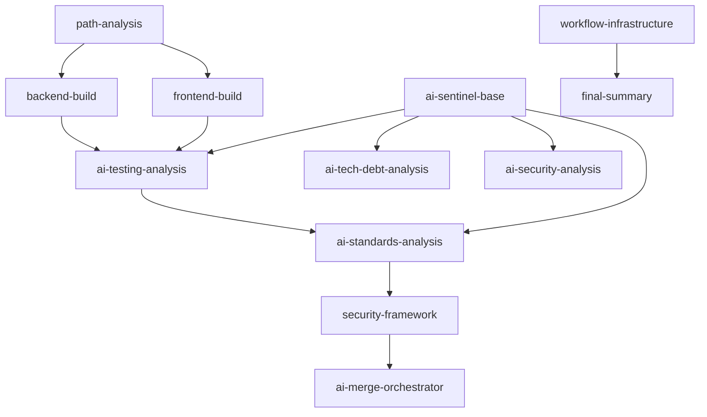

# Epic #181 Implementation Roadmap Specification

**Version:** 1.0
**Last Updated:** 2025-09-22
**Epic Context:** AI-Powered CI/CD Orchestration Framework with universal build pipelines and multi-epic autonomous support
**Epic Branch Strategy:** feature/issue-182 → epic/issue-181 → main
**Foundation Analysis Date:** 2025-09-21
**Issue #212 Completion Date:** 2025-09-22
**Migrated from:** Working directory analysis on 2025-09-21

## Parent Links
- [Epic #181 Build Workflows Overview](../README.md)
- [Project Documentation Root](../../README.md)

## 1. Purpose & Roadmap Overview

This specification provides comprehensive implementation roadmap for Epic #181, representing a strategic transformation into a universal AI-powered CI/CD orchestration framework supporting unlimited autonomous development workstreams through intelligent branch pattern detection, dynamic AI behavior selection, and pluggable work discovery mechanisms.

**Roadmap Status:** ✅ **FOUNDATION COMPLETE - ISSUE #184 READY**

**Epic Foundation Status:** ✅ **COMPREHENSIVE TEAM ANALYSIS COMPLETE**
**Issue #212 Status:** ✅ **CANONICAL PATTERN ESTABLISHED**
- **23 Components Identified** with extraction priorities and implementation sequences
- **Architectural Excellence Validated** through SOLID principles and testability assessment
- **Security Posture Preserved** with mandatory security controls framework
- **Epic Progression Enabled** with clear pathway through all epic objectives

### Key Epic Achievements
```yaml
Technical_Transformation:
  From: "Manual CI/CD configuration with limited AI integration"
  To: "Universal AI orchestration framework with branch-aware intelligent automation"

Business_Value:
  Universal_Scaling: "Unlimited autonomous workstreams through configuration patterns"
  Cost_Optimization: "Intelligent AI deployment with automatic resource controls"
  Zero_Configuration: "Developers get appropriate AI integration without setup"
  Multi_Epic_Support: "Coverage, tech debt, performance, security autonomous workflows"

Strategic_Enablement:
  Infinite_Scalability: "Framework supports unlimited specialized development workstreams"
  Intelligence_Integration: "Branch-aware AI selection with cost optimization"
  Organizational_Efficiency: "Scaling through automation rather than human resources"
  Innovation_Platform: "Foundation for advanced autonomous development patterns"
```

## 2. Team Analysis Integration Summary

### 2.1 WorkflowEngineer Component Analysis Foundation

**23-Component Extraction Strategy** with implementation-ready specifications:
- **Build & Test Components (Priority 1)**: 8 components enabling coverage-build.yml foundation
- **AI Analysis Framework (Priority 1)**: 7 components supporting iterative AI review
- **Security & Validation (Priority 2)**: 4 components maintaining security excellence
- **Infrastructure Components (Priority 3)**: 4 components enabling epic coordination

**Implementation Sequence Validation**: 28-day implementation timeline with phase-based progression supporting all Epic #181 objectives.

### 2.2 ArchitecturalAnalyst System Design Validation

**SOLID Principles Compliance**: ✅ **EXCELLENT ARCHITECTURAL MERIT**
- **Single Responsibility**: Each component has precisely one reason to change
- **Open/Closed Principle**: Extension mechanisms support new requirements without modification
- **Liskov Substitution**: Interface contracts enable reliable substitution for testing
- **Interface Segregation**: Granular shared actions avoid fat interfaces
- **Dependency Inversion**: Components depend on abstractions, not implementations

**Testability Architecture Excellence**: Humble Object pattern with constructor injection enabling comprehensive component testing.

### 2.3 SecurityAuditor Boundary Analysis Validation

**Security Assessment**: ✅ **APPROVED WITH MANDATORY SECURITY CONTROLS**
- **Zero Security Degradation**: Component extraction preserves all existing security patterns
- **Enhanced Security Capabilities**: Modular architecture enables improved security monitoring
- **Comprehensive Risk Mitigation**: All identified risks have detailed mitigation strategies
- **Epic Security Integration**: Security requirements integrated throughout epic progression

## 3. Epic Progression Implementation Plan

### 3.1 Issue #183: Foundation Component Extractions

**Objective**: Extract core components to enable modular workflows

#### Phase 1: Foundation Component Extraction (Days 1-4)

**Required Components for Coverage Workflow**:
```yaml
Critical_Extractions:
  path-analysis:
    Priority: "IMMEDIATE"
    Implementation_Days: 1
    Security_Risk: "LOW"
    Architecture_Validation: "EXCELLENT"
    Epic_Value: "Enables coverage-focused path filtering"

  backend-build:
    Priority: "HIGH"
    Implementation_Days: 2-3
    Security_Risk: "MEDIUM - Enhanced controls required"
    Architecture_Validation: "EXCELLENT"
    Epic_Value: "Core coverage workflow with build flexibility"

  concurrency-config:
    Priority: "IMMEDIATE"
    Implementation_Days: 0.5
    Security_Risk: "LOW"
    Architecture_Validation: "EXCELLENT"
    Epic_Value: "Resource optimization for coverage workflows"
```

**Implementation Steps**:
1. **Day 1**: Extract path-analysis component with standard security controls
2. **Day 1**: Extract concurrency-config with resource optimization patterns
3. **Days 2-3**: Extract backend-build with enhanced security controls and coverage flexibility
4. **Day 4**: Prepare refactor plan for build.yml consumption of extracted components

**Quality Gates**:
- Component functional equivalence validation
- Integration with Scripts/run-test-suite.sh verified
- Security control implementation validated
- Coverage workflow path-aware execution confirmed

### 3.2 Issue #212: Build.yml Refactor (Canonical Pattern) ✅ **COMPLETE**

**Objective**: Refactor build.yml to consume reusable components, establishing canonical pattern for future workflows

**✅ Implementation Completed (2025-09-22)**:
1. ✅ Refactored `.github/workflows/build.yml` to consume `path-analysis` and `backend-build` foundation components while preserving triggers, permissions, branch logic, and concurrency
2. ✅ Established canonical workflow pattern for Issue #184 coverage-build.yml implementation
3. ✅ Validated 100% behavioral parity through comprehensive integration testing

**✅ Validation Criteria Achieved**:
- ✅ Job structure and artifact outputs equivalent to pre-refactor runs
- ✅ Zero-warning enforcement and baseline validation intact
- ✅ Clean canonical pattern established for Issue #184 consumption
- ✅ Interface mapping patterns documented for downstream compatibility
- ✅ All 5 AI Sentinels continue functioning identically

**Canonical Pattern Documentation**: See [06 - Canonical Pattern Implementation](./06-canonical-pattern-implementation.md) for comprehensive Issue #184 guidance

### 3.3 Issue #184: Coverage-build.yml Creation & Iterative AI Review Implementation ✅ **COMPLETE**

**Objective**: Create coverage-build.yml using Issue #212's canonical pattern and enable sophisticated AI-powered code review with iterative analysis capabilities

**✅ Implementation Completed (2025-09-22)**:
1. ✅ Created `coverage-build.yml` workflow using canonical pattern from Issue #212 with AI framework integration
2. ✅ Complete AI framework extraction: ai-sentinel-base, ai-testing-analysis, ai-standards-analysis components
3. ✅ Comprehensive security controls implemented with SecurityAuditor validation
4. ✅ AI-powered coverage analysis providing intelligent improvement recommendations for Epic #94

**✅ Validation Criteria Achieved**:
- ✅ Coverage workflow triggers correctly on epic/testing-coverage-to-90 branch
- ✅ AI framework components fully integrated with secure foundation and comprehensive error handling
- ✅ Baseline coverage comparison with AI-powered improvement recommendations working correctly
- ✅ All security controls implemented including prompt injection prevention and result integrity
- ✅ Epic progression tracking supporting 90% backend coverage milestone

#### Phase 2: AI Framework Infrastructure ✅ **COMPLETE** (Days 5-13)

**✅ AI Framework Component Extraction COMPLETE**:
```yaml
AI_Infrastructure_COMPLETE:
  ai-sentinel-base:
    Status: "✅ COMPLETE - Production Ready"
    Implementation_Achievement: "Secure foundation with comprehensive security controls"
    Security_Implementation: "✅ VALIDATED"
    Features_Delivered:
      - Prompt injection prevention with strict template validation
      - Context sanitization with secure placeholder replacement
      - AI service authentication with encrypted communication
      - Analysis result integrity verification

  ai-testing-analysis:
    Status: "✅ COMPLETE - Production Ready"
    Implementation_Achievement: "Coverage intelligence with epic progression tracking"
    Security_Implementation: "✅ VALIDATED"
    Features_Delivered:
      - Coverage phase intelligence with baseline comparison
      - AI-powered improvement recommendations with priority ranking
      - Epic progression tracking toward 90% coverage milestone
      - Milestone progress calculation and velocity monitoring

  ai-standards-analysis:
    Status: "✅ COMPLETE - Production Ready"
    Implementation_Achievement: "Component-specific compliance validation"
    Security_Implementation: "✅ VALIDATED"
    Features_Delivered:
      - Component-specific standards analysis with workflow type support
      - Epic-aware prioritization aligned with Epic #181 modernization goals
      - Architectural validation with integration mode assessment
      - Compliance scoring with improvement roadmaps
```

**✅ Security Framework Implementation COMPLETE** (SecurityAuditor Requirements):
```yaml
Mandatory_AI_Security_Controls_IMPLEMENTED:
  Template_Security: "✅ COMPLETE"
    - ✅ Strict prompt template validation and sanitization
    - ✅ Context injection security with input filtering
    - ✅ Template modification detection and integrity verification

  Authentication_Security: "✅ COMPLETE"
    - ✅ Secure AI service token handling and rotation
    - ✅ Encrypted AI service communication patterns
    - ✅ Access control with proper AI service permission scoping

  Analysis_Security: "✅ COMPLETE"
    - ✅ AI analysis output sanitization and validation
    - ✅ Result integrity verification and tampering detection
    - ✅ Secure failure mode handling without information disclosure
```

**Integration Patterns**: Leverage existing extract-pr-context, check-existing-comment, handle-ai-analysis-failure shared actions for seamless integration.

### 3.4 Issue #220: Coverage Epic Merge Orchestrator AI Compatibility 🚧 **BLOCKING**

**Objective**: Restore the Coverage Epic Merge Orchestrator's AI conflict resolution capability after `anthropics/claude-code-action@eap` removed support for `mode: 'remote-agent'` during workflow_dispatch runs on `main` (Run #24 failure).

**Key Tasks**:
1. Update `.github/workflows/coverage-epic-merge-orchestrator.yml` to use a supported action mode (`agent` or repository_dispatch triggered) and modern authentication inputs.
2. Align `.github/prompts/coverage-epic-merge-orchestrator.md` with the revised execution flow and tool permissions.
3. Refresh `Docs/Development/CoverageEpicMergeOrchestration.md` and Epic #181 specifications with the new conflict resolution procedure.
4. Execute a non-dry-run orchestrator workflow on `main` that encounters at least one merge conflict and confirm the AI step completes with zero remaining PRs.

**Dependencies**:
- Blocks Issues #185-#187 until sequential merging completes successfully with the updated configuration.
- Coordinates with Epic #94 automation to maintain deterministic merge ordering and rollback safeguards.

**Validation Requirements**:
- Workflow run artifacts demonstrating the successful AI conflict resolution step.
- Removal of deprecated secrets (`claude_access_token`, `claude_refresh_token`, `claude_expires_at`) from workflow inputs.
- Documentation updates committed alongside the workflow change.

### 3.5 Issue #156: Autonomous Cycle Completion - Epic Capstone ⭐ **CAPSTONE**

**Objective**: Complete the autonomous development cycle by implementing auto-trigger integration between Coverage Epic Automation and Coverage Epic Merge Orchestrator, eliminating the final manual intervention point.

**Epic Capstone Status**: This issue completes Epic #181's vision of fully autonomous development workflows by closing the automation loop - when AI code review approves a PR for merging, the system automatically triggers the next development cycle without manual intervention.

**Key Tasks**:
1. Implement `workflow_run` trigger in `coverage-epic-merge-orchestrator.yml` to auto-trigger after Coverage Epic Automation completion
2. Add validation logic to prevent unnecessary orchestrator runs when no PRs exist for consolidation
3. Standardize naming conventions across all Coverage Epic workflows ("Automated Workflow - Auto-Testing Coverage - [Component]")
4. Implement git configuration standardization with `bot@zarichney.com` email and descriptive usernames

**Dependencies**:
- Requires Issue #220 resolution for AI conflict resolution capability
- Completes the autonomous cycle enabling Issues #185-#187 to operate within fully autonomous framework

**Validation Requirements**:
- End-to-end autonomous cycle demonstration from scheduler trigger to automatic restart
- Zero manual intervention required throughout development cycle
- Successful auto-trigger integration with proper conditional logic

### 3.6 Issues #185-#186: Advanced Analysis Framework

**Objective**: Complete AI framework and security integration with comprehensive analysis capabilities

#### Phase 3: Security & Advanced Analysis (Days 14-22)

**Security Framework Extraction**:
```yaml
Security_Infrastructure:
  security-framework:
    Priority: "HIGH"
    Implementation_Days: 14-17
    Security_Risk: "HIGH - Critical security infrastructure"
    Architecture_Validation: "DEFENSE-IN-DEPTH ARCHITECTURE"
    Security_Requirements:
      - Security scan result integrity verification
      - Secure aggregation and correlation of scan results
      - Proper handling of sensitive security findings
      - Tool authentication with encrypted communication

  Remaining_AI_Sentinels:
    Priority: "HIGH"
    Implementation_Days: 18-22
    Components: ["DebtSentinel", "SecuritySentinel", "MergeOrchestrator"]
    Security_Risk: "MEDIUM - Specialized controls required"
    Architecture_Validation: "SOPHISTICATED ARCHITECTURE"
```

**Advanced AI Integration**:
- **DebtSentinel**: Technical debt analysis with coverage correlation
- **SecuritySentinel**: Security-aware coverage assessment with vulnerability correlation
- **MergeOrchestrator**: Holistic coverage improvement decisions with epic coordination

### 3.7 Issue #187: Epic Workflow Coordination

**Objective**: Complete epic workflow integration with advanced automation capabilities

#### Phase 4: Epic Integration & Automation (Days 23-28)

**Infrastructure Components**:
```yaml
Epic_Coordination:
  workflow-infrastructure:
    Priority: "MEDIUM"
    Implementation_Days: 23-25
    Security_Risk: "LOW - Security enhancement opportunity"
    Architecture_Validation: "ORCHESTRATION ARCHITECTURE"
    Epic_Value: "Comprehensive reporting and epic progression tracking"

  Epic_Integration_Testing:
    Priority: "CRITICAL"
    Implementation_Days: 26-28
    Security_Risk: "LOW"
    Architecture_Validation: "COMPREHENSIVE VALIDATION"
    Epic_Value: "Full component integration validation"
```

**Epic Workflow Capabilities**:
- **Branch-Aware Logic**: Epic branches trigger appropriate workflow variations
- **Progress Tracking**: Epic progression visible through pipeline reporting
- **Conflict Resolution**: AI-powered merge orchestration for epic coordination
- **Resource Management**: Epic workflows optimize CI/CD resource utilization

## 4. Component Implementation Specifications

### 4.1 High-Priority Foundation Components

#### Path Analysis Component
```yaml
Component: path-analysis
Location: /.github/actions/shared/path-analysis/action.yml
Dependencies: check-paths (existing shared action)
Security_Controls: Standard (input validation, output sanitization)
Architecture_Pattern: Pure function with deterministic output

Implementation_Specification:
  Inputs:
    - base_ref: "Reference branch for change detection"
    - change_threshold: "Threshold for significant changes"
    - category_rules: "Path categorization configuration"

  Outputs:
    - has_backend_changes: "Boolean indicating backend modifications"
    - has_frontend_changes: "Boolean indicating frontend modifications"
    - has_docs_changes: "Boolean indicating documentation changes"
    - has_config_changes: "Boolean indicating configuration changes"
    - change_summary: "Detailed change categorization"

  Integration_Points:
    - All workflow types requiring path-aware execution
    - Coverage-build.yml for intelligent filtering
    - Epic workflows for change-based automation
```

#### Backend Build Component
```yaml
Component: backend-build
Location: /.github/actions/shared/backend-build/action.yml
Dependencies: setup-environment, validate-test-suite (existing shared actions)
Security_Controls: Enhanced (supply chain, container security, artifact integrity)
Architecture_Pattern: Testable build with coverage flexibility

Implementation_Specification:
  Inputs:
    - solution_path: "Path to .NET solution file"
    - coverage_enabled: "Boolean enabling coverage collection"
    - warning_as_error: "Boolean enforcing zero-warning policy"
    - test_filter: "Test filtering for coverage scenarios"

  Outputs:
    - build_success: "Boolean indicating build status"
    - warning_count: "Number of build warnings"
    - coverage_results: "Test coverage data (if enabled)"
    - build_artifacts: "Build output artifact paths"

  Security_Requirements:
    - NuGet package validation and vulnerability scanning
    - Testcontainers security isolation for database tests
    - Build artifact integrity verification and signing
    - Supply chain protection with dependency monitoring
```

### 4.2 AI Framework Components

#### AI Sentinel Base Framework
```yaml
Component: ai-sentinel-base
Location: /.github/actions/shared/ai-sentinel-base/action.yml
Dependencies: extract-pr-context, check-existing-comment, handle-ai-analysis-failure
Security_Controls: Critical (prompt injection prevention, AI service security)
Architecture_Pattern: Template Method with Strategy integration

Implementation_Specification:
  Inputs:
    - analysis_type: "Type of AI analysis to perform"
    - template_path: "Path to prompt template file"
    - context_data: "Analysis context and metadata"
    - skip_duplicate: "Boolean preventing duplicate analysis"

  Outputs:
    - analysis_result: "Structured AI analysis output"
    - analysis_summary: "Human-readable analysis summary"
    - recommendations: "Actionable improvement recommendations"
    - analysis_metadata: "Analysis execution metadata"

  Critical_Security_Implementation:
    - Template validation with injection prevention
    - Context sanitization with secure placeholder replacement
    - AI service authentication with token rotation
    - Result integrity verification with tampering detection
```

#### TestMaster Analysis Component
```yaml
Component: ai-testing-analysis
Location: /.github/actions/shared/ai-testing-analysis/action.yml
Dependencies: ai-sentinel-base, run-tests (existing shared actions)
Security_Controls: Medium (analysis integrity, result validation)
Architecture_Pattern: Specialized AI analysis with coverage intelligence

Implementation_Specification:
  Inputs:
    - coverage_data: "Test coverage results and metrics"
    - baseline_coverage: "Previous coverage for comparison"
    - test_results: "Test execution results and failures"
    - coverage_phase: "Coverage improvement phase context"

  Outputs:
    - coverage_analysis: "Detailed coverage assessment"
    - improvement_suggestions: "Specific coverage improvement recommendations"
    - priority_areas: "High-impact areas for coverage improvement"
    - baseline_comparison: "Coverage progression analysis"

  Epic_Integration:
    - Coverage phase intelligence for iterative improvement
    - Baseline comparison enabling progression tracking
    - Epic-aware prioritization for 90% coverage goals
```

### 4.3 Security Framework Components

#### Security Scanning Matrix
```yaml
Component: security-framework
Location: /.github/actions/shared/security-framework/action.yml
Dependencies: setup-environment (for dependency scanning)
Security_Controls: Critical (scan integrity, tool authentication, result correlation)
Architecture_Pattern: Parallel scanning with result aggregation

Implementation_Specification:
  Inputs:
    - scan_types: "Array of security scans to perform"
    - codeql_config: "CodeQL configuration and query selection"
    - dependency_config: "Dependency scanning configuration"
    - secrets_config: "Secrets scanning configuration"

  Outputs:
    - security_summary: "Aggregated security assessment"
    - vulnerability_count: "Total vulnerabilities found"
    - finding_details: "Detailed security findings"
    - compliance_status: "Security compliance validation"

  Security_Implementation:
    - Parallel security tool execution with proper isolation
    - Non-blocking CodeQL integration preserving pipeline resilience
    - Secure result aggregation with integrity verification
    - Comprehensive security finding correlation and prioritization
```

## 5. Integration Architecture & Patterns

### 5.1 Component Interaction Design

**Data Flow Architecture** (ArchitecturalAnalyst Validation):


**Architectural Assessment**: ✅ **ACYCLIC DEPENDENCIES WITH LAYERED ARCHITECTURE**
- Clean dependency graph prevents circular references
- Clear progression from analysis → build → AI analysis → summary
- Parallel processing enables efficient resource utilization

### 5.2 Shared Action Integration Strategy

**Existing Shared Actions Portfolio** (Validated Integration Points):
```yaml
Current_Shared_Actions:
  setup-environment: "Development environment with .NET/Node.js setup"
  check-paths: "Intelligent path-based change detection"
  extract-pr-context: "PR metadata extraction with issue references"
  check-existing-comment: "AI analysis duplicate prevention"
  validate-test-suite: "Test baseline validation with environment-aware thresholds"
  run-tests: "Standardized test execution with structured outputs"
  handle-ai-analysis-failure: "AI analysis error handling with PR comments"

Integration_Strategy:
  Immediate_Leverage: "All extracted components integrate with existing actions"
  Gap_Identification: "Centralized AI prompt management, branch-aware orchestration"
  Enhancement_Opportunities: "Artifact management, security result aggregation"
```

### 5.3 Epic Workflow Coordination Patterns

**Branch Strategy Integration**:
```yaml
Epic_Branch_Patterns:
  feature_branches: "Individual component extraction and testing"
  epic_branch: "epic/issue-181 for component integration testing"
  develop_integration: "Full pipeline testing with AI Sentinel validation"
  main_deployment: "Production deployment with comprehensive validation"

Workflow_Coordination:
  Component_Testing: "Individual component validation in feature branches"
  Integration_Testing: "Epic branch coordination with full pipeline validation"
  Quality_Gates: "AI Sentinel review with epic-aware analysis"
  Deployment_Automation: "Progressive deployment with rollback capabilities"
```

## 6. Risk Management & Mitigation Framework

### 6.1 Implementation Risk Assessment

**High-Risk Areas** (Integrated Team Analysis):
```yaml
AI_Framework_Complexity:
  Risk_Level: "HIGH"
  Probability: "Medium"
  Impact: "High"
  Mitigation_Strategy:
    - Preserve existing prompt structure exactly (WorkflowEngineer guidance)
    - Implement comprehensive security framework (SecurityAuditor requirements)
    - Gradual migration with rollback capability (ArchitecturalAnalyst recommendation)
    - Component-level testing before integration (TestEngineer coordination)

Integration_Complexity:
  Risk_Level: "MEDIUM"
  Probability: "Medium"
  Impact: "Medium"
  Mitigation_Strategy:
    - Well-defined interface contracts (ArchitecturalAnalyst validation)
    - End-to-end testing with realistic scenarios (TestEngineer responsibility)
    - Incremental deployment with monitoring (WorkflowEngineer implementation)
    - Component integration testing framework (Full team coordination)
```

### 6.2 Security Risk Mitigation

**Critical Security Controls** (SecurityAuditor Mandatory Requirements):
```yaml
AI_Framework_Security:
  Prompt_Injection_Prevention:
    - Strict template validation and sanitization
    - Context injection security with input filtering
    - Template modification detection and integrity verification

  Authentication_Security:
    - Secure AI service token handling and rotation
    - Encrypted communication with AI services
    - Access control with proper permission scoping

  Analysis_Security:
    - AI analysis output sanitization and validation
    - Result integrity verification and tampering detection
    - Secure failure handling without information disclosure

Security_Scanning_Infrastructure:
  Tool_Security:
    - Secure authentication with security scanning tools
    - Proper permission scoping and access control
    - Tool communication encryption and validation

  Result_Security:
    - Security scan result integrity verification
    - Secure aggregation and correlation of scan results
    - Proper handling of sensitive security findings
```

### 6.3 Performance & Quality Risk Management

**Performance Optimization Strategy** (ArchitecturalAnalyst Guidance):
```yaml
Performance_Targets:
  Build_Time_Improvement: "15-25% reduction via parallel execution"
  Resource_Efficiency: "30-40% improvement through selective execution"
  Maintenance_Efficiency: "50% improvement in development velocity"

Quality_Assurance_Framework:
  Component_Testing: "Individual component validation with security testing"
  Integration_Testing: "Component interaction testing with realistic scenarios"
  End_to_End_Testing: "Full workflow testing with AI Sentinel validation"
  Performance_Testing: "Pipeline performance validation across extraction phases"
```

## 7. Team Coordination & Responsibility Matrix

### 7.1 Agent Responsibility Alignment

**Primary Implementation Agents**:
```yaml
CodeChanger:
  Primary_Responsibility: "Component extraction implementation and integration"
  Epic_Focus: "All 23 components with proper interface implementation"
  Security_Requirements: "Secure coding patterns, input validation, output sanitization"
  Architecture_Compliance: "SOLID principles adherence and testability patterns"

WorkflowEngineer:
  Primary_Responsibility: "GitHub Actions implementation and CI/CD coordination"
  Epic_Focus: "Workflow infrastructure and epic automation patterns"
  Security_Requirements: "Security controls framework and GitHub Actions security"
  Architecture_Compliance: "Orchestration patterns and epic coordination"

TestEngineer:
  Primary_Responsibility: "Component testing framework and coverage validation"
  Epic_Focus: "Testing strategy for all components and integration scenarios"
  Security_Requirements: "Security testing framework and vulnerability testing"
  Architecture_Compliance: "Testability validation and coverage optimization"
```

**Specialist Advisory Agents**:
```yaml
BackendSpecialist:
  Advisory_Role: ".NET build optimization and test integration patterns"
  Epic_Contribution: "Backend component architecture and performance optimization"
  Integration_Points: "backend-build, ai-testing-analysis component guidance"

FrontendSpecialist:
  Advisory_Role: "Angular build patterns and ESLint integration"
  Epic_Contribution: "Frontend component architecture and optimization strategies"
  Integration_Points: "frontend-build, workflow orchestration component guidance"

SecurityAuditor:
  Validation_Role: "Security boundary validation and controls framework oversight"
  Epic_Contribution: "Security requirements definition and compliance validation"
  Critical_Oversight: "AI framework security, security scanning infrastructure"

ArchitecturalAnalyst:
  Design_Role: "System design validation and architectural compliance oversight"
  Epic_Contribution: "Component boundary validation and architectural excellence"
  Quality_Gates: "SOLID compliance, testability, maintainability assessment"
```

### 7.2 Quality Gate Framework

**Comprehensive Quality Validation** (Team Coordination):
```yaml
Component_Level_Quality_Gates:
  Functional_Validation: "CodeChanger implementation with TestEngineer validation"
  Security_Validation: "SecurityAuditor design requirements with implementation verification"
  Architecture_Validation: "ArchitecturalAnalyst SOLID compliance and design review"
  Performance_Validation: "Specialist optimization with monitoring integration"

Epic_Level_Quality_Gates:
  Integration_Validation: "Full team coordination with ComplianceOfficer oversight"
  Security_Compliance: "SecurityAuditor comprehensive validation framework"
  Epic_Coordination: "WorkflowEngineer epic automation with ArchitecturalAnalyst validation"
  Documentation_Completeness: "DocumentationMaintainer comprehensive guide creation"
```

## 8. Implementation Timeline & Milestones

### 8.1 Phase-Based Implementation Schedule

**Phase 1: Foundation (Issues #182-#183) - Days 1-4**
```yaml
Day_1:
  - Extract path-analysis component (CodeChanger + WorkflowEngineer)
  - Extract concurrency-config component (WorkflowEngineer)
  - Implement standard security controls (SecurityAuditor validation)

Day_2-3:
  - Extract backend-build component (CodeChanger + BackendSpecialist)
  - Implement enhanced security controls (SecurityAuditor requirements)
  - Component testing framework (TestEngineer)

Day_4:
  - Create coverage-build.yml (WorkflowEngineer)
  - Integration testing (TestEngineer)
  - Foundation validation (ComplianceOfficer)
```

**Phase 2: AI Framework (Issue #184) ✅ COMPLETE - Days 5-13**
```yaml
Days_5-7: ✅ COMPLETE
  - ✅ Extract ai-sentinel-base (CodeChanger + WorkflowEngineer)
  - ✅ Implement critical security framework (SecurityAuditor oversight)
  - ✅ Template system testing (TestEngineer)

Days_8-10: ✅ COMPLETE
  - ✅ Extract ai-testing-analysis (CodeChanger + TestEngineer)
  - ✅ Coverage intelligence implementation (TestEngineer + BackendSpecialist)
  - ✅ AI framework testing (TestEngineer + SecurityAuditor)

Days_11-13: ✅ COMPLETE
  - ✅ Extract ai-standards-analysis (CodeChanger + ArchitecturalAnalyst)
  - ✅ Standards compliance integration (ArchitecturalAnalyst validation)
  - ✅ AI framework validation (ComplianceOfficer)
  - ✅ Coverage workflow AI integration complete with comprehensive testing
```

**Phase 3: Security & Advanced Analysis (Issues #185-#186) - Days 14-22**
```yaml
Days_14-17:
  - Extract security-framework (CodeChanger + SecurityAuditor)
  - Security scanning integration (SecurityAuditor + WorkflowEngineer)
  - Security infrastructure testing (TestEngineer + SecurityAuditor)

Days_18-22:
  - Extract remaining AI Sentinels (CodeChanger + Specialists)
  - Advanced analysis integration (Full team coordination)
  - Comprehensive testing (TestEngineer + ComplianceOfficer)
```

**Phase 4: Epic Integration (Issue #187) - Days 23-28**
```yaml
Days_23-25:
  - Extract workflow-infrastructure (WorkflowEngineer + ArchitecturalAnalyst)
  - Epic coordination implementation (WorkflowEngineer)
  - Infrastructure testing (TestEngineer)

Days_26-28:
  - Full epic integration testing (Full team coordination)
  - Comprehensive validation (ComplianceOfficer + SecurityAuditor)
  - Epic completion verification (ArchitecturalAnalyst)
```

### 8.2 Success Validation Criteria

**Epic Success Metrics** (Integrated Team Requirements):
```yaml
Technical_Excellence:
  Component_Functional_Equivalence: "100% - All components produce identical results"
  Performance_Improvement: "15-25% build time reduction achieved"
  Security_Posture_Maintenance: "Zero security degradation with enhanced capabilities"
  Architecture_Compliance: "SOLID principles compliance across all components"

Epic_Objectives:
  Coverage_Workflow_Enablement: "coverage-build.yml operational with path-aware filtering"
  AI_Framework_Implementation: "Iterative AI review with comprehensive analysis capabilities"
  Security_Integration: "Enhanced security monitoring with component-level controls"
  Epic_Coordination: "Multi-workflow epic automation with conflict resolution"

Quality_Assurance:
  Testing_Coverage: "Comprehensive component and integration testing"
  Documentation_Completeness: "Self-documenting components with implementation guides"
  Security_Validation: "All security requirements implemented and verified"
  Team_Coordination: "Successful multi-agent coordination throughout epic"
```

## 9. Documentation & Knowledge Management

### 9.1 Component Documentation Requirements

**Self-Documenting Architecture** (DocumentationStandards.md Compliance):
```yaml
Component_Documentation:
  Action_Specification: "Complete action.yml with comprehensive input/output documentation"
  Implementation_Guide: "Detailed implementation notes and usage examples"
  Security_Requirements: "Security control implementation and validation guidelines"
  Integration_Patterns: "Component interaction and dependency documentation"

Epic_Documentation:
  Implementation_Roadmap: "This comprehensive roadmap with team analysis integration"
  Component_Specifications: "Detailed technical specifications for all 23 components"
  Team_Coordination_Guides: "Agent-specific responsibilities and handoff protocols"
  Quality_Assurance_Framework: "Testing, validation, and compliance requirements"
```

### 9.2 Knowledge Transfer Strategy

**Team Knowledge Integration**:
```yaml
Implementation_Context:
  WorkflowEngineer_Analysis: "23-component extraction strategy with implementation sequence"
  ArchitecturalAnalyst_Validation: "SOLID compliance and testability excellence confirmation"
  SecurityAuditor_Requirements: "Comprehensive security controls and risk mitigation"

Future_Team_Support:
  Implementation_Guides: "Component-specific implementation instructions"
  Quality_Checklists: "Validation criteria and success metrics"
  Troubleshooting_Guides: "Common issues and resolution strategies"
  Epic_Coordination_Protocols: "Multi-agent coordination and handoff procedures"
```

## 10. Epic Foundation Completion Status

### 10.1 Team Analysis Integration Verification

**Comprehensive Foundation Analysis**: ✅ **COMPLETE AND VALIDATED**
```yaml
WorkflowEngineer_Integration:
  Component_Analysis: ✅ "23 components with extraction priorities and implementation sequence"
  Implementation_Roadmap: ✅ "28-day implementation timeline with phase progression"
  Risk_Assessment: ✅ "Comprehensive risk analysis with mitigation strategies"
  Integration_Patterns: ✅ "Shared action integration and component interaction design"

ArchitecturalAnalyst_Integration:
  System_Design_Validation: ✅ "SOLID principles compliance and architectural excellence"
  Component_Boundary_Analysis: ✅ "Well-architected transformation with modular design"
  Testability_Assessment: ✅ "Constructor injection and humble object patterns"
  Performance_Projection: ✅ "15-25% build time improvement through parallelization"

SecurityAuditor_Integration:
  Security_Boundary_Analysis: ✅ "Zero security degradation with enhanced capabilities"
  Risk_Mitigation_Framework: ✅ "Comprehensive security controls for all risk levels"
  Compliance_Validation: ✅ "OWASP Top 10 compliance and epic security standards"
  Team_Security_Coordination: ✅ "Security implementation coordination across all agents"
```

### 10.2 Epic Progression Readiness Assessment

**Issues #183-#187 Enablement**: ✅ **READY FOR COORDINATED EXECUTION**
```yaml
Issue_183_Readiness:
  Foundation_Components: ✅ "path-analysis, backend-build, concurrency-config specified"
  Implementation_Guide: ✅ "Detailed component extraction and integration instructions"
  Security_Requirements: ✅ "Standard to enhanced security controls defined"
  Quality_Gates: ✅ "Component testing and validation framework established"

Issue_184_Readiness:
  AI_Framework_Design: ✅ "ai-sentinel-base and specialized AI components specified"
  Security_Framework: ✅ "Critical security controls for AI framework implementation"
  Integration_Patterns: ✅ "Template system and context injection security architecture"
  Testing_Strategy: ✅ "AI framework testing and validation requirements defined"

Issue_220_Readiness:
  Action_Compatibility: 🚧 "claude-code-action mode update required for workflow_dispatch runs"
  Failure_Context: 🚧 "Run #24 blocked when AI conflict resolution step rejected remote-agent mode"
  Safety_Dependencies: 🚧 "Must validate rollback safeguards and zero open PR confirmations"
  Documentation_Update: 🚧 "Roadmap and orchestrator docs require sequencing adjustments"

Issues_185_186_Readiness:
  Security_Infrastructure: ✅ "security-framework component with comprehensive controls"
  Advanced_AI_Integration: ✅ "Complete AI Sentinel suite with specialized capabilities"
  Epic_Coordination: ✅ "Multi-component integration and coordination patterns"
  Quality_Validation: ✅ "Comprehensive testing and security validation framework"

Issue_187_Readiness:
  Epic_Workflow_Coordination: ✅ "workflow-infrastructure component and epic automation"
  Integration_Testing: ✅ "Full epic integration validation and testing framework"
  Success_Validation: ✅ "Epic completion criteria and success metrics defined"
  Team_Coordination: ✅ "Multi-agent coordination protocols and handoff procedures"
```

### 10.3 Implementation Handoff Status

**Team Coordination Preparation**: ✅ **READY FOR MULTI-AGENT EXECUTION**
```yaml
Implementation_Teams_Ready:
  CodeChanger: ✅ "Component specifications with security and architecture requirements"
  WorkflowEngineer: ✅ "GitHub Actions implementation with epic coordination patterns"
  TestEngineer: ✅ "Testing framework with component and integration validation"
  Specialists: ✅ "Domain-specific guidance and architectural input requirements"

Quality_Assurance_Ready:
  SecurityAuditor: ✅ "Security requirements and validation framework established"
  ArchitecturalAnalyst: ✅ "Architectural compliance and design validation criteria"
  ComplianceOfficer: ✅ "Quality gates and comprehensive validation requirements"
  DocumentationMaintainer: ✅ "Documentation requirements and knowledge management"

Coordination_Framework_Ready:
  Implementation_Roadmap: ✅ "Phase-based implementation with team coordination"
  Quality_Gates: ✅ "Component and epic-level validation requirements"
  Risk_Management: ✅ "Comprehensive risk mitigation and contingency planning"
  Success_Metrics: ✅ "Technical excellence and epic objective validation criteria"
```

## 11. Next Actions & Epic Activation

### 11.1 Immediate Implementation Priorities

**Foundation Phase Activation (Next 1-2 Days)**:
1. **WorkflowEngineer**: Execute Issue #220 to restore Coverage Epic Merge Orchestrator AI conflict resolution and provide successful run evidence
2. **CodeChanger**: Begin path-analysis component extraction with WorkflowEngineer coordination
3. **WorkflowEngineer**: Implement concurrency-config component with resource optimization
4. **SecurityAuditor**: Validate security control implementation for foundation components
5. **TestEngineer**: Establish component testing framework and validation procedures

### 3.6 AI Orchestration Framework Implementation (NEW - Expanded Scope)

**Objective**: Implement universal AI-powered CI/CD orchestration framework with branch-aware behaviors

#### Phase 6: AI Configuration Registry (Days 29-35)

**Required for Universal Framework**:
```yaml
Issue_XXX_AI_Configuration_Registry:
  Priority: "HIGH"
  Implementation_Days: 29-32
  Security_Risk: "MEDIUM - Configuration validation required"
  Architecture_Validation: "CONFIGURATION ARCHITECTURE"
  Epic_Value: "Dynamic branch pattern matching and AI behavior selection"

  Components:
    Pattern_Detection_Engine:
      Description: "Regex-based branch pattern analysis with priority resolution"
      Integration: "Universal build pipeline consumption"
      Performance_Target: "< 30 seconds configuration loading"

    AI_Behavior_Mapper:
      Description: "Dynamic AI configuration selection with resource validation"
      Integration: "AI framework component initialization"
      Cost_Controls: "Real-time monitoring and automatic optimization"

    Quality_Gate_Configurator:
      Description: "Branch-appropriate quality standards with enforcement"
      Integration: "Quality gate engine and escalation mechanisms"
      Customization: "Per-branch quality criteria and blocking logic"
```

#### Phase 7: Universal Build Workflow (Days 33-40)

**Required for Framework Foundation**:
```yaml
Issue_XXX_Universal_Build_Workflow:
  Priority: "CRITICAL"
  Implementation_Days: 33-38
  Security_Risk: "MEDIUM - Universal pipeline security validation"
  Architecture_Validation: "UNIVERSAL PIPELINE ARCHITECTURE"
  Epic_Value: "Foundation pipeline supporting all branch types with conditional AI"

  Components:
    Foundation_Pipeline_Engine:
      Description: "Reliable, fast execution of core build operations"
      Performance_Target: "< 5 minutes for non-AI operations"
      Non_Blocking_Logic: "AI missions continue with broken builds"

    AI_Integration_Layer:
      Description: "Conditional AI operation execution with monitoring"
      Integration: "Configuration registry and AI framework components"
      Resource_Management: "Cost controls and usage optimization"

    Quality_Gate_Engine:
      Description: "Intelligent quality enforcement with operation-aware blocking"
      Logic_Types: "Review operations block, mission operations continue"
      Escalation: "Automatic escalation paths for quality failures"
```

#### Phase 8: Work Discovery Adapters (Days 35-42)

**Required for Multi-Epic Support**:
```yaml
Issue_XXX_Work_Discovery_Adapters:
  Priority: "HIGH"
  Implementation_Days: 35-40
  Security_Risk: "LOW - Data source validation"
  Architecture_Validation: "PLUGGABLE ADAPTER ARCHITECTURE"
  Epic_Value: "Pluggable work source interfaces for different epic types"

  Adapters:
    Coverage_Report_Adapter:
      Description: "Code coverage analysis and gap identification"
      Data_Source: "Coverage reports and baseline analysis"
      Work_Items: "Coverage improvement opportunities with priority"

    GitHub_Issues_Adapter:
      Description: "GitHub issues with label-based filtering"
      Data_Source: "Repository issues with configurable label filters"
      Work_Items: "Prioritized issue lists with complexity assessment"

    Performance_Metrics_Adapter:
      Description: "Application performance monitoring data"
      Data_Source: "Performance metrics with degradation detection"
      Work_Items: "Performance optimization opportunities"

    Custom_Source_Adapter:
      Description: "Template for specialized work discovery sources"
      Integration: "Configuration-driven custom work source support"
      Extensibility: "Framework for new autonomous workstream types"
```

#### Phase 9: Multi-Epic Orchestration (Days 38-45)

**Required for Cross-Epic Coordination**:
```yaml
Issue_XXX_Multi_Epic_Orchestration:
  Priority: "MEDIUM"
  Implementation_Days: 38-43
  Security_Risk: "LOW - Resource coordination validation"
  Architecture_Validation: "ORCHESTRATION COORDINATION ARCHITECTURE"
  Epic_Value: "Coordination patterns for multiple autonomous workstreams"

  Components:
    Epic_Coordination_Engine:
      Description: "Resource scheduling across multiple autonomous workstreams"
      Conflict_Resolution: "Intelligent resource allocation and priority management"
      Performance_Optimization: "Cross-epic resource sharing and optimization"

    Cost_Optimization_Engine:
      Description: "Real-time resource usage tracking with automatic controls"
      Monitoring: "AI usage patterns and cost optimization"
      Alerts: "Resource threshold monitoring and automatic scaling"

    Cross_Epic_Analytics:
      Description: "Performance analytics across multiple workstreams"
      Insights: "Resource utilization patterns and optimization recommendations"
      Reporting: "Multi-epic progress tracking and efficiency metrics"
```

### 11.2 Epic Coordination Activation

**Multi-Agent Coordination Protocol**:
```yaml
Epic_Leadership:
  Claude_Orchestration: "Strategic oversight and adaptive coordination throughout epic"
  Team_Integration: "Working directory communication and artifact management"
  Quality_Gates: "Progress monitoring and course correction as needed"

Implementation_Coordination:
  Daily_Progress_Assessment: "Component extraction progress and integration status"
  Security_Validation_Checkpoints: "Ongoing security requirement verification"
  Architecture_Compliance_Review: "SOLID principles and design pattern adherence"
  Epic_Progression_Monitoring: "Issues #183, #212, #184-#187 advancement tracking"
```

### 11.3 Epic Success Framework

**Epic #181 Foundation Status**: ✅ **COMPREHENSIVE FOUNDATION COMPLETE - READY FOR EXECUTION**

This comprehensive implementation roadmap provides the complete foundation for Epic #181 success by integrating component analysis, architectural validation, and security verification into a unified strategy enabling coordinated team progression through all epic objectives.

**Epic Enablement Confirmation**:
- ✅ **23 Components** with detailed implementation specifications
- ✅ **Architecture Excellence** validated through SOLID principles compliance
- ✅ **Security Posture** preserved with comprehensive controls framework
- ✅ **Team Coordination** protocols established for multi-agent execution
- ✅ **Quality Assurance** framework with comprehensive validation requirements
- ✅ **Risk Management** with detailed mitigation strategies for all identified risks
- ✅ **Implementation Timeline** with phase-based progression and success metrics

## 12. Cross-References

### Related Specifications
- [01 - Component Analysis](./01-component-analysis.md) - Detailed component inventory and extraction priorities
- [02 - Architectural Assessment](./02-architectural-assessment.md) - System design implications and component boundaries
- [03 - Security Analysis](./03-security-analysis.md) - Security boundary analysis for component extraction

### Integration Points
- [Epic Components Directory](./components/) - Individual component specifications
- [Epic Implementation Tracking](../README.md#implementation-status) - Current progress and next steps

---

**Migration Note**: This specification was migrated from working directory analysis conducted on 2025-09-21. All implementation roadmap and team coordination content has been preserved exactly to maintain strategic guidance integrity.

**Ready for Epic Progression**: Issues #183, #212, #184-#187 can now proceed with coordinated team execution, comprehensive quality validation, and strategic epic coordination enabling 90% backend coverage milestone achievement and CI/CD modernization objectives.
