# Epic #181: Autonomous Development Cycle Specification

**Last Updated:** 2025-09-22
**Version:** 1.0
**Epic Context:** Build Workflows Enhancement & Autonomous Development Cycle
**Status:** Foundation Complete - Implementation Sequence Defined

> **Parent:** [`Epic #181 Build Workflows`](./README.md)

## 1. Purpose & Responsibility

* **What it is:** Comprehensive specification for Epic #181's autonomous development cycle - a fully automated workflow ecosystem that handles the complete development lifecycle from test creation through deployment without manual intervention.
* **Key Objectives:**
  - **Primary: Complete Automation Loop** - Establish 6-phase autonomous cycle handling test development, code review, conflict resolution, and deployment
  - **Intelligent AI Integration** - Deploy sophisticated AI-powered analysis, iteration management, and quality enforcement
  - **Scalable Foundation** - Create patterns applicable to tech debt remediation, performance optimization, and security hardening workstreams
  - **Zero-Touch Operations** - Enable development progression through scheduled automation with human oversight only for strategic decisions
* **Success Criteria:**
  - **Fully Autonomous Test Development Cycle** - Complete 6-hour scheduled cycles creating, reviewing, and merging test coverage improvements
  - **AI-Powered Quality Enforcement** - Iterative code review with automated improvement cycles until quality standards achieved
  - **Intelligent Conflict Resolution** - Automated conflict detection and resolution across multiple concurrent PRs
  - **Epic Progression Automation** - Seamless progression toward 90% backend coverage goal through coordinated automation
* **Why it exists:** To establish the foundational pattern for autonomous development that eliminates manual coordination overhead while maintaining quality standards, enabling the organization to scale development capabilities through intelligent automation rather than additional human resources.

> **Implementation Foundation:** Built upon comprehensive AI framework from Issue #184 (ai-sentinel-base, ai-testing-analysis, ai-standards-analysis) and foundation components from Issues #183 and #212.

### Autonomous Development Vision

Epic #181's autonomous development cycle represents a paradigm shift from manual coordination to intelligent automation:

```yaml
Vision_Statement:
  From: "Manual test development, review coordination, and merge management"
  To: "Fully autonomous 6-hour cycles with AI-powered quality enforcement"

Strategic_Value:
  Development_Velocity: "Continuous progression without manual intervention"
  Quality_Assurance: "AI-powered iterative improvement until standards met"
  Resource_Optimization: "Human focus on strategic decisions while automation handles execution"
  Scalability: "Foundation patterns applicable to all development workstreams"
```

## 2. Architecture & Key Concepts

* **High-Level Design:** Six-phase autonomous cycle orchestrated through GitHub Actions with intelligent AI-powered components providing analysis, iteration management, conflict resolution, and quality enforcement throughout the development lifecycle.

### Complete Autonomous Development Cycle

```mermaid
graph TD
    A[Phase 1: Scheduler Trigger] --> B[Phase 2: AI Development]
    B --> C[Phase 3: Build/Test Validation]
    C --> D[Phase 4: AI Code Review]
    D --> E[Phase 5: Merge Orchestrator]
    E --> F[Phase 6: Auto-Trigger]
    F --> A

    subgraph "Phase 1: Scheduler (6-hour cycles)"
        A1[Scheduled Trigger] --> A2[Epic Status Check]
        A2 --> A3[Workload Assessment]
        A3 --> A4[AI Development Initiation]
    end

    subgraph "Phase 2: AI Development (Test Creation/Resume)"
        B1[Test Strategy Analysis] --> B2[Gap Identification]
        B2 --> B3[Test Implementation]
        B3 --> B4[Coverage Validation]
        B4 --> B5[PR Creation]
    end

    subgraph "Phase 3: Build/Test Validation (PR Status Management)"
        C1[Automated Testing] --> C2[Coverage Analysis]
        C2 --> C3[Standards Compliance]
        C3 --> C4{Quality Gates}
        C4 -->|Pass| C5[Ready for Review]
        C4 -->|Fail| C6[Status: Changes Requested]
    end

    subgraph "Phase 4: AI Code Review (Iterative Improvement)"
        D1[AI Review Analysis] --> D2[Quality Assessment]
        D2 --> D3{Standards Met?}
        D3 -->|No| D4[Iterative Improvement]
        D4 --> D5[Update Implementation]
        D5 --> D3
        D3 -->|Yes| D6[Approve for Merge]
    end

    subgraph "Phase 5: Merge Orchestrator (Conflict Resolution)"
        E1[PR Discovery] --> E2[Conflict Detection]
        E2 --> E3[AI Conflict Resolution]
        E3 --> E4[Batch Consolidation]
        E4 --> E5[Epic Branch Merge]
    end

    subgraph "Phase 6: Auto-Trigger (Issue #156 - Restart Cycle)"
        F1[Deployment Validation] --> F2[Epic Progress Assessment]
        F2 --> F3[Next Cycle Planning]
        F3 --> F4[Scheduler Reset]
    end

    classDef phaseBox fill:#e1f5fe,stroke:#01579b,stroke-width:2px
    classDef aiComponent fill:#f3e5f5,stroke:#4a148c,stroke-width:2px
    classDef automationComponent fill:#e8f5e8,stroke:#1b5e20,stroke-width:2px

    class A1,A2,A3,A4,F1,F2,F3,F4 automationComponent
    class B1,B2,B3,B4,D1,D2,D4,D5,E3 aiComponent
    class C1,C2,C3,E1,E2,E4,E5 phaseBox
```



### Component Integration Architecture

```mermaid
graph TB
    subgraph "AI Framework Foundation (Issue #184)"
        AI1[ai-sentinel-base] --> AI2[Security & Authentication]
        AI3[ai-testing-analysis] --> AI4[Coverage Intelligence]
        AI5[ai-standards-analysis] --> AI6[Compliance Validation]
    end

    subgraph "Foundation Components (Issue #183)"
        FC1[path-analysis] --> FC2[Change Detection]
        FC3[backend-build] --> FC4[Build Orchestration]
        FC5[concurrency-config] --> FC6[Resource Management]
    end

    subgraph "Canonical Patterns (Issue #212)"
        CP1[build.yml] --> CP2[Proven Foundation Usage]
        CP3[Interface Mapping] --> CP4[Legacy Compatibility]
    end

    subgraph "Autonomous Cycle Components"
        AC1[Scheduler] --> AC2[6-hour Trigger Management]
        AC3[AI Development] --> AC4[Test Creation & Resume]
        AC5[Quality Gates] --> AC6[Validation Orchestration]
        AC7[AI Review] --> AC8[Iterative Improvement]
        AC9[Merge Orchestrator] --> AC10[Conflict Resolution]
        AC11[Auto-Trigger] --> AC12[Cycle Restart Logic]
    end

    AI2 --> AC4
    AI4 --> AC6
    AI6 --> AC8
    FC2 --> AC4
    FC4 --> AC6
    FC6 --> AC10
    CP2 --> AC12
    CP4 --> AC2

    classDef foundation fill:#e3f2fd,stroke:#1565c0,stroke-width:2px
    classDef aiFramework fill:#f3e5f5,stroke:#4a148c,stroke-width:2px
    classDef autonomous fill:#e8f5e8,stroke:#2e7d32,stroke-width:2px

    class AI1,AI3,AI5,AI2,AI4,AI6 aiFramework
    class FC1,FC3,FC5,FC2,FC4,FC6,CP1,CP3,CP2,CP4 foundation
    class AC1,AC3,AC5,AC7,AC9,AC11,AC2,AC4,AC6,AC8,AC10,AC12 autonomous
```



### Phase Interaction and State Management

* **State Persistence:** Each phase maintains state in working directory artifacts with comprehensive context for next phase
* **Error Recovery:** Built-in retry mechanisms and failure escalation paths preserve cycle integrity
* **Progress Tracking:** Continuous assessment of epic progression (90% backend coverage goal) guides cycle prioritization
* **Quality Enforcement:** AI-powered iterative improvement ensures all deliverables meet standards before progression

## 3. Interface Contract & Assumptions

* **Key Autonomous Cycle Interfaces:**
  - **Scheduler Interface:**
    * **Purpose:** Manage 6-hour autonomous development cycles with epic progression assessment
    * **Dependencies:** GitHub Actions scheduling, epic branch status, workload assessment capabilities
    * **Outputs:** Development initiation triggers, epic status reports, cycle planning artifacts
    * **Quality Gates:** Epic progression validation, resource availability confirmation, conflict-free initiation

  - **AI Development Interface:**
    * **Purpose:** Intelligent test creation and implementation with coverage gap analysis
    * **Dependencies:** AI framework components (Issue #184), foundation components (Issue #183), test strategy patterns
    * **Outputs:** Test implementations, coverage improvements, PR creation with comprehensive context
    * **Quality Gates:** Coverage targets achieved, test quality standards met, integration validation passed

  - **AI Code Review Interface:**
    * **Purpose:** Iterative code review with automated improvement cycles until standards achieved
    * **Dependencies:** AI sentinel framework, standards compliance patterns, iteration management capabilities
    * **Outputs:** Quality assessments, improvement implementations, approval decisions, iteration tracking
    * **Quality Gates:** All quality standards met, no blocking issues identified, comprehensive review completion

  - **Merge Orchestrator Interface:**
    * **Purpose:** Intelligent conflict resolution and batch consolidation across multiple concurrent PRs
    * **Dependencies:** AI conflict resolution, PR discovery patterns, epic branch management
    * **Outputs:** Resolved conflicts, consolidated PRs, epic branch updates, deployment readiness
    * **Quality Gates:** All conflicts resolved, no regression introduction, epic progression maintained

* **Critical Assumptions:**
  - **Technical Assumptions:** AI framework provides sufficient intelligence for autonomous decision-making and quality enforcement
  - **Resource Assumptions:** GitHub Actions infrastructure supports 6-hour scheduled cycles with adequate compute resources
  - **Integration Assumptions:** Epic progression tracking accurately reflects development status and enables informed cycle decisions
  - **Quality Assumptions:** AI-powered review cycles achieve equivalent quality to manual review while maintaining development velocity

## 4. Local Conventions & Constraints (Beyond Global Standards)

* **Autonomous Cycle Standards:**
  - All phases must include comprehensive error handling and automatic retry mechanisms
  - AI components must provide transparent decision-making with audit trails for quality assurance
  - State management between phases requires persistent working directory artifacts with full context
  - Quality enforcement must include escalation paths for complex issues requiring human intervention
* **Technology Constraints:**
  - GitHub Actions as primary automation platform with 6-hour scheduled trigger reliability
  - AI framework components must operate within security boundaries established in Issue #184
  - Foundation components must maintain compatibility with existing build and test infrastructure
* **Timeline Constraints:**
  - 6-hour cycle discipline maintained for predictable development progression
  - Quality gates must not compromise cycle timing while ensuring standards compliance
  - Epic progression assessment must accurately reflect actual coverage improvements

## 5. How to Work With This Autonomous Cycle

* **Implementation Approach:**
  - **Foundation Validation:** Ensure Issues #183, #212, and #184 implementations provide required autonomous cycle foundation
  - **Blocking Resolution:** Address Issue #220 to enable Coverage Epic Merge Orchestrator integration
  - **Capstone Implementation:** Execute Issue #156 to close autonomous development loop
  - **Advanced Framework:** Implement Issues #185-#187 to enable sophisticated AI analysis and iteration management
* **Quality Assurance:**
  - **Testing Strategy:** Comprehensive validation of each phase in isolation and full cycle integration testing
  - **Validation Approach:** Epic progression tracking validation ensuring actual coverage improvements align with goals
  - **Performance Validation:** Cycle timing analysis and resource utilization optimization for sustainable automation
* **Common Implementation Pitfalls:**
  - Autonomous complexity can obscure failure points - maintain clear observability and intervention capabilities
  - AI decision-making requires human oversight patterns to prevent quality degradation
  - Cycle timing discipline essential to prevent resource conflicts and ensure predictable progression

## 6. Dependencies

* **Completed Foundation Dependencies:**
  - [`Issue #183`](./04-implementation-roadmap.md#issue-183) - Foundation components (path-analysis, backend-build, concurrency-config) - **COMPLETE**
  - [`Issue #212`](./05-issue-212-build-refactor.md) - Canonical pattern with build.yml refactor - **COMPLETE**
  - [`Issue #184`](./06-canonical-pattern-implementation.md) - AI framework components (ai-sentinel-base, ai-testing-analysis, ai-standards-analysis) - **COMPLETE**

* **Blocking Dependencies:**
  - **Issue #220:** Coverage Epic Merge Orchestrator AI conflict resolution - **BLOCKING CURRENT PHASE**
    * **Impact:** Phase 5 (Merge Orchestrator) cannot function without AI conflict resolution capability
    * **Resolution Path:** Restore AI conflict resolution functionality for multi-PR consolidation
    * **Criticality:** Blocks progression to autonomous cycle implementation

* **Critical Path Dependencies:**
  - **Issue #156:** AI-powered autonomous testing workflow - **EPIC CAPSTONE**
    * **Impact:** Phase 6 (Auto-Trigger) requires Issue #156 to close autonomous development loop
    * **Integration:** Provides cycle restart logic and continuous progression management
    * **Criticality:** Essential for complete autonomous cycle functionality

* **Advanced Framework Dependencies (Ready After Blocking Resolved):**
  - **Issue #185:** Iterative AI Code Review Action - Enables Phase 4 sophisticated review capabilities
  - **Issue #186:** AI Prompt Design - Provides optimized AI persona and quality enforcement patterns
  - **Issue #187:** Coverage Baseline vs Delta - Enables precise progress tracking and cycle optimization

* **External Dependencies:**
  - GitHub Actions scheduling reliability for 6-hour cycle discipline
  - Epic branch (`epic/testing-coverage-to-90`) maintenance and conflict resolution capabilities
  - AI framework security boundaries and authentication mechanisms from Issue #184

## 7. Rationale & Key Historical Context

* **Strategic Context:** Autonomous development cycle prioritized to establish foundation for scaling development capabilities through intelligent automation rather than additional human resources, enabling organizational growth without proportional staffing increases.
* **Evolution from Manual Coordination:** Autonomous cycle concept emerged from analysis of manual coordination overhead in Epic #181 implementation, identifying opportunities to eliminate human bottlenecks while maintaining quality standards.
* **AI Framework Integration:** Decision to build autonomous cycle on Issue #184 AI framework ensures security, reliability, and intelligent decision-making capabilities required for unsupervised operation.
* **6-Hour Cycle Discipline:** 6-hour scheduling chosen to balance development velocity with resource availability, enabling continuous progression without overwhelming infrastructure or creating coordination conflicts.

### Epic Progression Through Autonomous Cycles

The autonomous development cycle directly serves Epic #181's core mission of establishing modular, composable workflow components while achieving the organization's 90% backend coverage goal:

```yaml
Strategic_Alignment:
  Epic_Mission: "Transform CI/CD from monolithic to modular while achieving coverage goals"
  Autonomous_Value: "Eliminate coordination overhead while maintaining quality and velocity"
  Coverage_Integration: "Direct contribution to 90% backend coverage through intelligent automation"
  Foundation_Leverage: "Built upon proven foundation components and AI framework"
```

## 8. Known Issues & TODOs

* **Implementation Status:**
  - ✅ **Foundation Complete:** Issues #183, #212, #184 provide comprehensive autonomous cycle foundation
  - ✅ **AI Framework Operational:** Complete 3-component AI framework ready for autonomous cycle integration
  - ✅ **Canonical Patterns Proven:** build.yml refactor demonstrates foundation component consumption patterns
  - 🚧 **Current Blocking:** Issue #220 must be resolved before autonomous cycle implementation can proceed

* **Blocking Dependencies Resolution Required:**
  - **Issue #220: Coverage Epic Merge Orchestrator AI Conflict Resolution**
    * **Status:** BLOCKING - Phase 5 (Merge Orchestrator) cannot function without AI conflict resolution
    * **Impact:** Prevents autonomous cycle from handling multiple concurrent PRs
    * **Resolution:** Restore AI conflict resolution functionality for multi-PR consolidation
    * **Priority:** CRITICAL - Must be resolved before Issue #156 implementation

* **Critical Path Implementation Sequence:**
  ```yaml
  Immediate_Priority:
    Issue_220: "Restore Coverage Epic Merge Orchestrator AI conflict resolution"
    Outcome: "Enables Phase 5 (Merge Orchestrator) autonomous conflict handling"

  Epic_Capstone:
    Issue_156: "AI-powered autonomous testing workflow"
    Outcome: "Closes autonomous development loop with Phase 6 (Auto-Trigger)"
    Dependencies: "Requires Issue #220 resolution"

  Advanced_Framework:
    Issues_185_187: "Iterative AI capabilities and enhanced analysis"
    Outcome: "Sophisticated AI review and iteration management"
    Status: "Ready after blocking dependencies resolved"
  ```

* **Future Autonomous Workstream Patterns:**
  - **Tech Debt Remediation:** Autonomous cycle patterns applicable to technical debt identification and resolution
  - **Performance Optimization:** Intelligent performance analysis and optimization through autonomous cycles
  - **Security Hardening:** Automated security vulnerability detection and remediation workflows
  - **Documentation Maintenance:** AI-powered documentation accuracy validation and improvement cycles

* **Success Criteria Validation:**
  - **Autonomous Cycle Completion:** Successful 6-hour cycles with zero manual intervention required
  - **Quality Maintenance:** AI-powered review maintains equivalent quality to manual review processes
  - **Epic Progression:** Continuous advancement toward 90% backend coverage goal through automated cycles
  - **Scalability Demonstration:** Foundation patterns proven applicable to additional autonomous workstreams

> **Implementation Readiness:** Autonomous cycle specification complete and ready for implementation once Issue #220 blocking dependency resolved. Epic capstone (Issue #156) implementation will close autonomous development loop and enable fully autonomous development capabilities.

---