# Epic #181: Autonomous Development Cycle Specification

**Last Updated:** 2025-09-27
**Version:** 1.1
**Epic Context:** AI-Powered CI/CD Orchestration Framework - Phase 1 Coverage-Specific Implementation
**Status:** Phase 1 Active Implementation - Coverage Epic Autonomous Workflow

> **Parent:** [`Epic #181 Build Workflows`](./README.md)

## 1. Purpose & Responsibility

* **What it is:** Coverage-specific autonomous development cycle providing intelligent AI orchestration for test coverage development - Phase 1 implementation establishing foundation for future universal framework capabilities.
* **Phase 1 Objectives (ACTIVE):**
  - **Primary: Coverage Epic Autonomous Development** - 6-hour cycles with AI test creation targeting coverage gaps
  - **Quality Assurance Integration** - AI-powered review cycles ensuring high standards without manual intervention
  - **Coverage Progression Management** - Systematic advancement toward 90% backend coverage goal
  - **Zero-Configuration Operation** - Autonomous cycles for coverage epic without manual setup
  - **Proven Stability Foundation** - Establish robust operation for weeks/months before Phase 2 expansion
* **Phase 1 Success Criteria:**
  - **Autonomous Coverage Operation** - Coverage epic runs without manual intervention for weeks/months
  - **Quality Maintenance** - AI review maintains equivalent quality to manual processes
  - **Coverage Progression** - Continuous advancement toward 90% backend coverage
  - **System Stability** - Zero degradation of existing build/test functionality
  - **Foundation Readiness** - Proven stability enabling future Phase 2 universal framework expansion
* **Why it exists:** To establish a robust autonomous development foundation for coverage epic development that proves stability and effectiveness before scaling to universal framework capabilities in Phase 2.

> **Framework Integration:** Enhanced with AI Configuration Registry (Issue #XXX) and Universal Build Pipeline (Issue #XXX) built upon comprehensive AI framework from Issue #184 and foundation components from Issues #183 and #212.

### Two-Phase Implementation Strategy

Epic #181 implements autonomous development through a strategic two-phase approach:

```yaml
Phase_1_Vision_ACTIVE:
  From: "Manual coverage development coordination"
  To: "Autonomous coverage development with AI-powered quality assurance"

Phase_1_Coverage_Focus:
  Coverage_Development: "Autonomous test creation targeting coverage gaps"
  Quality_Review: "AI-powered iterative review ensuring high standards"
  Coverage_Progression: "Systematic advancement toward 90% backend goal"
  Stability_Proof: "Weeks/months of robust autonomous operation"

Phase_2_Vision_FUTURE:
  From: "Proven coverage autonomous workflow"
  To: "Universal framework supporting unlimited autonomous workstreams"

Phase_2_Universal_Support:
  Multi_Epic_Workstreams: "Coverage, tech debt, performance, security autonomous cycles"
  Branch_Aware_Intelligence: "Configurable AI behavior based on branch patterns"
  Pluggable_Work_Discovery: "Adaptive work source integration for diverse contexts"
  Zero_Configuration_Scaling: "Automatic activation for any epic pattern"
```

### Mission vs. Review Execution Rules

* **Scheduled mission workflows (AI builders/fixers):** Always bootstrap the full environment, run dependency installation, build, and tests, but treat those steps as advisory. Failures are captured as context for the agent rather than failing the workflow so the bot can diagnose the broken state. Missions target draft pull requests that match the branch pattern defined in configuration and will resume the most recent draft when a run begins.
* **PR review workflows:** Triggered by a ready-for-review pull request. The same environment setup and validation steps execute, but failures are blocking; if build or tests fail, the workflow flips the PR back to draft, records the failure signal for the next mission run, and skips AI review.
* **Quality gatekeeper:** Once validation passes, the review AI produces a checklist. The PR cannot exit draft or merge until the checklist is cleared by subsequent mission runs and the review AI emits a passing status.

## 2. Architecture & Key Concepts

* **High-Level Design:** Six-phase autonomous cycle orchestrated through GitHub Actions specifically for coverage epic development - Phase 1 implementation establishing foundation for future universal framework capabilities.

### Phase 1: Coverage-Specific Autonomous Development Cycle

```mermaid
graph TD
    A[Phase 1: Scheduler Trigger] --> B[Phase 2: AI Development]
    B --> C[Phase 3: Build/Test Validation]
    C --> D[Phase 4: AI Code Review]
    D --> E[Phase 5: Merge Orchestrator]
    E --> F[Phase 6: Auto-Trigger]
    F --> A

    subgraph "Phase 1: Scheduler (6-hour cycles)"
        A1[Scheduled Trigger] --> A2[Epic Status Check]
        A2 --> A3[Workload Assessment]
        A3 --> A4[AI Development Initiation]
    end

    subgraph "Phase 2: AI Coverage Development (Test Creation/Resume)"
        B1[Coverage Strategy Analysis] --> B2[Coverage Gap Identification]
        B2 --> B3[Test Implementation]
        B3 --> B4[Coverage Validation]
        B4 --> B5[PR Creation]
    end

    subgraph "Phase 3: Build/Test Validation (PR Status Management)"
        C1[Automated Testing] --> C2[Coverage Analysis]
        C2 --> C3[Standards Compliance]
        C3 --> C4{Quality Gates}
        C4 -->|Pass| C5[Ready for Review]
        C4 -->|Fail| C6[Status: Changes Requested]
    end

    subgraph "Phase 4: AI Code Review (Iterative Improvement) ✅ IMPLEMENTED"
        D1[AI Review Analysis] --> D2[Quality Assessment]
        D2 --> D3{Standards Met?}
        D3 -->|No| D4[Iterative Improvement]
        D4 --> D5[Update Implementation]
        D5 --> D3
        D3 -->|Yes| D6[Approve for Merge]
        D7[Historical Context] --> D1
        D8[To-Do Management] --> D4
        D9[Comment Lifecycle] --> D6
    end

    subgraph "Phase 5: Merge Orchestrator (Conflict Resolution)"
        E1[PR Discovery] --> E2[Conflict Detection]
        E2 --> E3[AI Conflict Resolution]
        E3 --> E4[Batch Consolidation]
        E4 --> E5[Epic Branch Merge]
    end

    subgraph "Phase 6: Auto-Trigger (Issue #156 - Restart Cycle)"
        F1[Deployment Validation] --> F2[Epic Progress Assessment]
        F2 --> F3[Next Cycle Planning]
        F3 --> F4[Scheduler Reset]
    end

    classDef phaseBox fill:#e1f5fe,stroke:#01579b,stroke-width:2px
    classDef aiComponent fill:#f3e5f5,stroke:#4a148c,stroke-width:2px
    classDef automationComponent fill:#e8f5e8,stroke:#1b5e20,stroke-width:2px

    class A1,A2,A3,A4,F1,F2,F3,F4 automationComponent
    class B1,B2,B3,B4,D1,D2,D4,D5,E3 aiComponent
    class C1,C2,C3,E1,E2,E4,E5 phaseBox
```



### Component Integration Architecture

```mermaid
graph TB
    subgraph "AI Framework Foundation (Issue #184)"
        AI1[ai-sentinel-base] --> AI2[Security & Authentication]
        AI3[ai-testing-analysis] --> AI4[Coverage Intelligence]
        AI5[ai-standards-analysis] --> AI6[Compliance Validation]
    end

    subgraph "Foundation Components (Issue #183)"
        FC1[path-analysis] --> FC2[Change Detection]
        FC3[backend-build] --> FC4[Build Orchestration]
        FC5[concurrency-config] --> FC6[Resource Management]
    end

    subgraph "Canonical Patterns (Issue #212)"
        CP1[build.yml] --> CP2[Proven Foundation Usage]
        CP3[Interface Mapping] --> CP4[Legacy Compatibility]
    end

    subgraph "Autonomous Cycle Components"
        AC1[Scheduler] --> AC2[6-hour Trigger Management]
        AC3[AI Development] --> AC4[Test Creation & Resume]
        AC5[Quality Gates] --> AC6[Validation Orchestration]
        AC7[AI Review] --> AC8[Iterative Improvement]
        AC9[Merge Orchestrator] --> AC10[Conflict Resolution]
        AC11[Auto-Trigger] --> AC12[Cycle Restart Logic]
    end

    AI2 --> AC4
    AI4 --> AC6
    AI6 --> AC8
    FC2 --> AC4
    FC4 --> AC6
    FC6 --> AC10
    CP2 --> AC12
    CP4 --> AC2

    classDef foundation fill:#e3f2fd,stroke:#1565c0,stroke-width:2px
    classDef aiFramework fill:#f3e5f5,stroke:#4a148c,stroke-width:2px
    classDef autonomous fill:#e8f5e8,stroke:#2e7d32,stroke-width:2px

    class AI1,AI3,AI5,AI2,AI4,AI6 aiFramework
    class FC1,FC3,FC5,FC2,FC4,FC6,CP1,CP3,CP2,CP4 foundation
    class AC1,AC3,AC5,AC7,AC9,AC11,AC2,AC4,AC6,AC8,AC10,AC12 autonomous
```



### Phase Interaction and State Management

* **Scheduler Orchestration:** A default-branch controller workflow owns the cron trigger, locates the matching epic branch, and decides whether to create a fresh mission branch or resume the most recent draft pull request.
* **State Persistence:** Each run stores hand-off artifacts (coverage diffs, failing test logs, review checklists) so the next phase can resume contextually.
* **Error Recovery:** Built-in retry mechanisms and failure escalation paths preserve cycle integrity without abandoning partially complete work.
* **Progress Tracking:** Continuous assessment of epic progression (90% backend coverage goal) guides cycle prioritization.
* **Quality Enforcement:** AI-powered iterative improvement ensures all deliverables meet standards before progression.

## 3. Interface Contract & Assumptions

* **Phase 1 Coverage-Specific Interfaces:**
  - **Coverage Scheduler Interface:**
    * **Purpose:** Manage 6-hour autonomous coverage development cycles with coverage progression assessment
    * **Dependencies:** GitHub Actions scheduling, coverage epic branch status, coverage workload assessment
    * **Outputs:** Coverage development initiation triggers, coverage status reports, cycle planning artifacts
    * **Quality Gates:** Coverage progression validation, resource availability confirmation, conflict-free initiation

  - **AI Coverage Development Interface:**
    * **Purpose:** Intelligent test creation and implementation targeting coverage gaps specifically
    * **Dependencies:** AI framework components (Issue #184), foundation components (Issue #183), coverage strategy patterns
    * **Outputs:** Test implementations targeting coverage gaps, coverage improvements, PR creation with coverage context
    * **Quality Gates:** Coverage targets achieved, test quality standards met, coverage integration validation passed

  - **AI Code Review Interface:**
    * **Purpose:** Iterative code review with automated improvement cycles until standards achieved
    * **Dependencies:** AI sentinel framework, standards compliance patterns, iteration management capabilities
    * **Outputs:** Quality assessments, improvement implementations, approval decisions, iteration tracking
    * **Quality Gates:** All quality standards met, no blocking issues identified, comprehensive review completion

  - **Merge Orchestrator Interface:**
    * **Purpose:** Intelligent conflict resolution and batch consolidation across multiple concurrent PRs
    * **Dependencies:** AI conflict resolution, PR discovery patterns, epic branch management
    * **Outputs:** Resolved conflicts, consolidated PRs, epic branch updates, deployment readiness
    * **Quality Gates:** All conflicts resolved, no regression introduction, epic progression maintained

* **Phase 1 Critical Assumptions:**
  - **Technical Assumptions:** AI framework provides sufficient intelligence for autonomous coverage development decision-making
  - **Resource Assumptions:** GitHub Actions infrastructure supports 6-hour scheduled coverage cycles with adequate compute resources
  - **Integration Assumptions:** Coverage progression tracking accurately reflects coverage development status and enables informed cycle decisions
  - **Quality Assumptions:** AI-powered review cycles achieve equivalent quality to manual review for coverage-focused development

## 4. Local Conventions & Constraints (Beyond Global Standards)

* **Phase 1 Coverage Cycle Standards:**
  - All coverage development phases must include comprehensive error handling and automatic retry mechanisms
  - AI components must provide transparent coverage-focused decision-making with audit trails for quality assurance
  - State management between phases requires persistent working directory artifacts with full coverage context
  - Quality enforcement must include escalation paths for complex coverage issues requiring human intervention
* **Technology Constraints:**
  - GitHub Actions as primary automation platform with 6-hour scheduled trigger reliability
  - AI framework components must operate within security boundaries established in Issue #184
  - Foundation components must maintain compatibility with existing build and test infrastructure
* **Phase 1 Timeline Constraints:**
  - 6-hour cycle discipline maintained for predictable coverage development progression
  - Quality gates must not compromise cycle timing while ensuring coverage standards compliance
  - Coverage progression assessment must accurately reflect actual coverage improvements toward 90% backend goal

## 5. How to Work With This Autonomous Cycle

* **Phase 1 Implementation Approach:**
  - **Foundation Validation:** Ensure Issues #183, #212, and #184 implementations provide required coverage autonomous cycle foundation
  - **Phase 1 Completion:** Complete Issues #240, #233, #234, #187 for full coverage-specific autonomous workflow
  - **Stability Demonstration:** Achieve weeks/months of robust autonomous coverage development operation
  - **Phase 2 Readiness:** Establish proven foundation for future universal framework expansion
* **Quality Assurance:**
  - **Testing Strategy:** Comprehensive validation of each phase in isolation and full cycle integration testing
  - **Validation Approach:** Epic progression tracking validation ensuring actual coverage improvements align with goals
  - **Performance Validation:** Cycle timing analysis and resource utilization optimization for sustainable automation
* **Common Implementation Pitfalls:**
  - Autonomous complexity can obscure failure points - maintain clear observability and intervention capabilities
  - AI decision-making requires human oversight patterns to prevent quality degradation
  - Cycle timing discipline essential to prevent resource conflicts and ensure predictable progression

## 6. Dependencies

* **Completed Foundation Dependencies:**
  - [`Issue #183`](./04-implementation-roadmap.md#issue-183) - Foundation components (path-analysis, backend-build, concurrency-config) - **COMPLETE**
  - [`Issue #212`](./05-issue-212-build-refactor.md) - Canonical pattern with build.yml refactor - **COMPLETE**
  - [`Issue #184`](./06-canonical-pattern-implementation.md) - AI framework components (ai-sentinel-base, ai-testing-analysis, ai-standards-analysis) - **COMPLETE**

* **Phase 1 Active Dependencies:**
  - **Issue #240:** Replace Iterative Reviewer with Coverage Auditor - **CRITICAL FOR PHASE 1**
    * **Impact:** Coverage-specific auditor required for Phase 1 autonomous coverage development
    * **Resolution Path:** Update iterative-ai-review action to use coverage auditor
    * **Criticality:** Essential for Phase 1 coverage-focused quality assurance

  - **Issue #233:** Rebrand Coverage Ecosystem - **HIGH PRIORITY FOR PHASE 1**
    * **Impact:** Consistent messaging for coverage autonomous workflow
    * **Resolution Path:** Update all coverage components to remove milestone-specific language
    * **Criticality:** Important for Phase 1 continuous excellence approach

  - **Issue #234:** Auto-Ratcheting Coverage Baseline - **CRITICAL FOR PHASE 1**
    * **Impact:** Coverage baseline management essential for autonomous progression
    * **Resolution Path:** Implement baseline comparison and automatic ratcheting
    * **Criticality:** Essential for Phase 1 coverage progression tracking

  - **Issue #187:** Coverage Delta Analysis - **CRITICAL FOR PHASE 1**
    * **Impact:** Precise coverage progression tracking required for autonomous decisions
    * **Resolution Path:** Implement baseline vs delta coverage comparison
    * **Criticality:** Essential for Phase 1 intelligent coverage development

* **Phase 2 Future Dependencies (Universal Framework):**
  - **Multi-Epic Support:** Universal framework capability for coverage, tech debt, performance, security workstreams
  - **Branch-Aware Intelligence:** Configurable AI behavior based on branch patterns
  - **Pluggable Work Discovery:** Adaptive work source integration for diverse development contexts
  - **Zero-Configuration Scaling:** Automatic activation for any epic pattern

* **Phase 1 External Dependencies:**
  - GitHub Actions scheduling reliability for 6-hour coverage cycle discipline
  - Coverage epic branch (`epic/testing-coverage-to-90`) maintenance and conflict resolution capabilities
  - AI framework security boundaries and authentication mechanisms from Issue #184
  - Coverage Epic Merge Orchestrator for multi-PR consolidation with AI conflict resolution

## 7. Rationale & Key Historical Context

* **Phase 1 Strategic Context:** Coverage-specific autonomous development cycle prioritized to prove stability and effectiveness before scaling to universal framework capabilities, establishing foundation for future expansion while minimizing risk to existing functionality.
* **Phase 1 Evolution from Manual Coordination:** Coverage autonomous cycle emerged from analysis of manual coordination overhead in coverage development, identifying opportunities to eliminate human bottlenecks while maintaining quality standards specifically for test coverage progression.
* **Phase 1 AI Framework Integration:** Decision to build coverage autonomous cycle on Issue #184 AI framework ensures security, reliability, and intelligent decision-making capabilities required for unsupervised coverage development operation.
* **Phase 1 6-Hour Cycle Discipline:** 6-hour scheduling chosen to balance coverage development velocity with resource availability, enabling continuous coverage progression without overwhelming infrastructure or creating coordination conflicts.

### Phase 1 Coverage Progression Through Autonomous Cycles

The Phase 1 coverage-specific autonomous development cycle directly serves Epic #181's coverage mission while establishing foundation for future universal capabilities:

```yaml
Phase_1_Strategic_Alignment:
  Coverage_Mission: "Achieve 90% backend coverage through autonomous development cycles"
  Autonomous_Value: "Eliminate coverage development coordination overhead while maintaining quality"
  Coverage_Integration: "Direct contribution to 90% backend coverage through intelligent automation"
  Foundation_Leverage: "Built upon proven foundation components and AI framework"
  Phase_2_Foundation: "Establish proven stability for future universal framework expansion"
```

## 8. Known Issues & TODOs

* **Phase 1 Implementation Status:**
  - ✅ **Foundation Complete:** Issues #183, #212, #184 provide comprehensive coverage autonomous cycle foundation
  - ✅ **AI Framework Operational:** Complete 3-component AI framework ready for coverage autonomous cycle integration
  - ✅ **Canonical Patterns Proven:** build.yml refactor demonstrates foundation component consumption patterns
  - ✅ **Coverage Build Implementation:** Issue #185 iterative AI review action implemented and integrated into coverage-build.yml
  - 🚧 **Phase 1 Active Implementation:** Issues #240, #233, #234, #187 required for Phase 1 completion

* **Phase 1 Completion Dependencies:**
  - **Issue #240: Replace Iterative Reviewer with Coverage Auditor**
    * **Status:** PENDING - Coverage-specific auditor required for Phase 1
    * **Impact:** Essential for coverage-focused quality assurance in autonomous cycles
    * **Priority:** CRITICAL - Required for Phase 1 coverage autonomous workflow

  - **Issue #233: Rebrand Coverage Ecosystem**
    * **Status:** PENDING - Consistent messaging for coverage autonomous workflow
    * **Impact:** Alignment with continuous excellence approach vs milestone-specific language
    * **Priority:** HIGH - Important for Phase 1 messaging consistency

  - **Issue #234: Auto-Ratcheting Coverage Baseline**
    * **Status:** PENDING - Coverage baseline management for autonomous progression
    * **Impact:** Essential for autonomous coverage progression tracking
    * **Priority:** CRITICAL - Required for Phase 1 intelligent coverage development

  - **Issue #187: Coverage Delta Analysis**
    * **Status:** PENDING - Precise coverage progression tracking
    * **Impact:** Required for autonomous coverage development decisions
    * **Priority:** CRITICAL - Essential for Phase 1 coverage analysis

* **Phase 1 Success Criteria:**
  ```yaml
  Phase_1_Completion:
    Issues_240_233_234_187: "Complete all Phase 1 outstanding issues"
    Outcome: "Full coverage-specific autonomous workflow operational"

  Operational_Validation:
    Autonomous_Operation: "4+ weeks of uninterrupted coverage autonomous cycles"
    Quality_Maintenance: "AI review quality equivalent to manual processes"
    Coverage_Progression: "Measurable advancement toward 90% backend coverage"
    System_Stability: "Zero degradation of existing build/test functionality"

  Phase_2_Readiness:
    Proven_Stability: "8+ weeks of robust Phase 1 operation"
    Risk_Assessment: "Comprehensive evaluation before Phase 2 initiation"
    Business_Justification: "Clear organizational need for universal framework"
  ```

* **Phase 2 Future Autonomous Workstream Patterns (After Phase 1 Proven):**
  - **Tech Debt Remediation:** Universal autonomous cycle patterns for technical debt identification and resolution
  - **Performance Optimization:** Intelligent performance analysis and optimization through configurable autonomous cycles
  - **Security Hardening:** Automated security vulnerability detection and remediation workflows
  - **Documentation Maintenance:** AI-powered documentation accuracy validation and improvement cycles
  - **Multi-Epic Coordination:** Unlimited autonomous workstreams operating simultaneously without conflicts

* **Phase 1 Success Criteria Validation:**
  - **Coverage Autonomous Cycle Completion:** Successful 6-hour coverage cycles with zero manual intervention required
  - **Quality Maintenance:** AI-powered review maintains equivalent quality to manual review processes for coverage development
  - **Coverage Progression:** Continuous advancement toward 90% backend coverage goal through automated cycles
  - **Stability Foundation:** Proven operational patterns establishing foundation for Phase 2 universal framework

> **Phase 1 Implementation Readiness:** Coverage-specific autonomous cycle specification complete and ready for final implementation through Issues #240, #233, #234, #187. Phase 1 success will establish proven foundation for Phase 2 universal framework expansion after weeks/months of stable operation.

---
