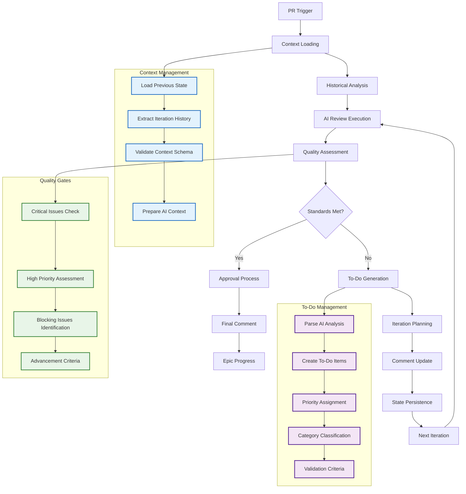
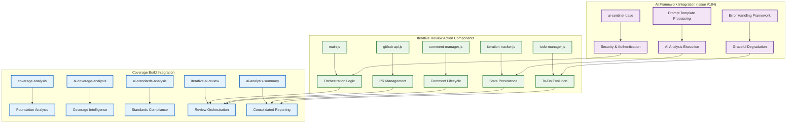

# Epic #181: Iterative AI Review Protocols

**Last Updated:** 2025-09-23
**Version:** 1.0
**Epic Context:** Build Workflows Enhancement & Autonomous Development Cycle
**Status:** Complete Implementation - Issue #185

> **Parent:** [`Epic #181 Build Workflows`](./README.md)

## 1. Purpose & Responsibility

* **What it is:** Comprehensive documentation for Epic #181's iterative AI review protocols implemented through Issue #185, enabling autonomous Phase 4 (AI Code Review) capabilities with historical context preservation, to-do list management, and intelligent comment lifecycle control.
* **Key Objectives:**
  - **Primary: Autonomous AI Code Review** - Enable iterative AI-powered code review with context preservation across PR development cycles
  - **Historical Context Management** - Maintain development journey tracking across multiple review iterations
  - **To-Do List Evolution** - Structured task tracking with priority-based progression and completion validation
  - **Quality Gate Enforcement** - Automated PR status management with intelligent draft/ready/approved transitions
* **Success Criteria:**
  - **Iterative Context Preservation** - Complete development history maintained across review cycles
  - **Intelligent Quality Assessment** - AI-powered evaluation with iterative improvement until standards achieved
  - **Automated PR Status Management** - Smart status transitions based on quality gates and blocking issue resolution
  - **Epic Integration Excellence** - Direct support for Epic #181's autonomous development cycle objectives
* **Why it exists:** To provide the AI Code Review phase of Epic #181's autonomous development cycle, eliminating manual code review coordination while maintaining quality standards through iterative AI-powered improvement cycles.

> **Implementation Success:** Issue #185 successfully delivered complete iterative AI review action with coverage-build.yml integration, enabling Phase 4 autonomous development capabilities.

### Integration with Autonomous Development Cycle

The iterative AI review protocols serve as the critical Phase 4 component in Epic #181's 6-phase autonomous development cycle:

```yaml
Phase_4_Integration:
  Purpose: "AI-powered iterative code review until quality standards achieved"
  Inputs: "PR from Phase 3 (Build/Test Validation) with initial quality assessment"
  Process: "Iterative improvement cycles with historical context and to-do management"
  Outputs: "Quality-approved PR ready for Phase 5 (Merge Orchestrator)"
  Epic_Alignment: "Direct contribution to 90% backend coverage through intelligent review"
```

## 2. Architecture & Key Concepts

* **High-Level Design:** Composite GitHub Action providing iterative AI code review with sophisticated state management, historical context preservation, and intelligent quality gate enforcement integrated into the coverage-build.yml workflow.

### Iterative Review Architecture



### Component Integration Architecture



### State Management and Persistence

* **Iteration Context Schema:** JSON-based state management with comprehensive metadata, historical tracking, and validation
* **To-Do Item Lifecycle:** Structured to-do evolution with priority classification, category management, and completion validation
* **Comment Lifecycle Management:** Intelligent update vs create decision logic with historical context integration
* **Quality Gate Framework:** Automated PR status transitions based on quality assessment and blocking issue resolution

## 3. Interface Contract & Assumptions

* **Key Iterative Review Interfaces:**
  - **Action Input Interface:**
    * **Purpose:** Configure iterative review behavior with comprehensive parameterization
    * **Dependencies:** GitHub token, OpenAI API key, PR context, epic alignment configuration
    * **Inputs:** pr_number, iteration_trigger (auto/manual), max_iterations, quality_threshold, epic_context, debug_mode, force_new_iteration
    * **Quality Gates:** Input validation, API authentication, parameter compatibility verification

  - **AI Analysis Interface:**
    * **Purpose:** Execute AI-powered code review with template-driven analysis and context injection
    * **Dependencies:** ai-sentinel-base framework, iterative-coverage-auditor.md prompt template, historical context
    * **Outputs:** Quality assessment, to-do items, improvement recommendations, blocking issue identification
    * **Quality Gates:** Analysis completion validation, template processing verification, context preservation

  - **Comment Management Interface:**
    * **Purpose:** Manage PR comment lifecycle with historical context and structured content generation
    * **Dependencies:** GitHub API access, comment pattern recognition, content template processing
    * **Outputs:** Updated PR comments, historical context preservation, iteration tracking
    * **Quality Gates:** Comment format validation, context preservation verification, update vs create logic

  - **State Persistence Interface:**
    * **Purpose:** Maintain iteration state across review cycles with comprehensive context management
    * **Dependencies:** GitHub cache storage, state schema validation, context serialization
    * **Outputs:** Persisted iteration state, context for next iteration, historical tracking data
    * **Quality Gates:** Schema validation, context integrity, state consistency verification

* **Critical Assumptions:**
  - **AI Framework Reliability:** ai-sentinel-base provides consistent AI analysis execution with security controls
  - **GitHub API Stability:** Comment and PR management APIs maintain compatibility across iterations
  - **Template Processing:** iterative-coverage-auditor.md template supports dynamic placeholder replacement
  - **State Management:** GitHub cache provides reliable storage for iteration context persistence

## 4. Local Conventions & Constraints (Beyond Global Standards)

* **Iterative Review Standards:**
  - All iterations must preserve complete historical context with no information loss between cycles
  - To-do items must include validation criteria and explicit completion conditions
  - Quality gates must enforce Epic #181 alignment and 90% backend coverage progression
  - Comment lifecycle must maintain professional formatting with clear iteration tracking
* **Technology Constraints:**
  - GitHub Actions composite action framework with multi-step execution and error handling
  - AI framework security boundaries with input validation and rate limiting
  - Coverage-build.yml integration with conditional execution and parallel job coordination
* **Performance Constraints:**
  - 15-minute timeout for comprehensive iterative analysis with graceful degradation
  - Maximum 5 iterations per PR with safety limits and escalation paths
  - Efficient API usage with rate limiting and caching optimization

## 5. How to Work With This Iterative Review

* **Usage Approach:**
  - **Automatic Integration:** Iterative review executes automatically on coverage epic PRs when quality gates met
  - **Manual Testing:** Use workflow_dispatch with enable_iterative_review='true' for development testing
  - **Iteration Management:** Review cycles continue until quality standards achieved or max iterations reached
  - **Epic Coordination:** Integration with Coverage Epic Merge Orchestrator for multi-PR consolidation
* **Quality Assurance:**
  - **Testing Strategy:** Comprehensive validation of iteration cycles, state management, and quality gate enforcement
  - **Validation Approach:** Epic progression tracking with measurable coverage improvement validation
  - **Performance Validation:** Timeout management and resource utilization optimization for sustainable operation
* **Common Usage Patterns:**
  - **Development Workflow:** PR creation triggers automatic iterative review until quality standards achieved
  - **Coverage Epic Integration:** Seamless integration with epic/testing-coverage-to-90 branch workflow
  - **Quality Improvement:** AI-guided iterative enhancement recommendations with completion tracking
  - **Team Coordination:** Clear PR status progression supporting multi-agent collaboration

### Workflow Integration Examples

#### Automatic PR Review (Primary Usage)
```yaml
# Triggered automatically on PR events to epic/testing-coverage-to-90
- PR created → coverage-analysis → iterative-ai-review → quality assessment
- Iterations continue until standards met → ready for merge orchestrator
```

#### Manual Testing and Development
```yaml
# Manual workflow_dispatch for testing and development
- workflow_dispatch with enable_iterative_review='true'
- force_new_iteration='true' to skip existing comment detection
- debug_mode='true' for enhanced logging and troubleshooting
```

#### Epic Coordination Pattern
```yaml
# Integration with Coverage Epic Merge Orchestrator
- Multiple PRs with iterative review completion
- Consolidated AI analysis summary with iteration status
- Ready for multi-PR consolidation and epic branch merge
```

## 6. Dependencies

* **Completed Dependencies:**
  - [`Issue #184`](./06-canonical-pattern-implementation.md) - AI framework (ai-sentinel-base, ai-testing-analysis, ai-standards-analysis) - **COMPLETE**
  - [`Issue #183`](./04-implementation-roadmap.md#issue-183) - Foundation components (path-analysis, backend-build, concurrency-config) - **COMPLETE**
  - [`Issue #212`](./05-issue-212-build-refactor.md) - Canonical workflow patterns with foundation component integration - **COMPLETE**

* **Integration Dependencies:**
  - **coverage-build.yml Workflow:** Provides foundation for iterative review integration with conditional execution
  - **GitHub Actions Infrastructure:** Supports composite action execution with multi-step workflows and error handling
  - **OpenAI API Access:** Enables AI-powered analysis with prompt template processing and security controls

* **Future Enhancement Dependencies:**
  - **Issue #186:** AI Prompt Design - Enhanced persona optimization and quality enforcement patterns
  - **Issue #187:** Coverage Baseline vs Delta - Precise progress tracking and optimization for iterative cycles
  - **Issue #220:** Coverage Epic Merge Orchestrator - AI conflict resolution for multi-PR consolidation
  - **Issue #156:** Auto-Trigger capabilities for autonomous cycle completion

* **External Dependencies:**
  - GitHub Actions platform reliability for scheduled and event-driven execution
  - OpenAI API availability and rate limiting compatibility
  - Epic branch management with conflict resolution capabilities

## 7. Rationale & Key Historical Context

* **Strategic Context:** Iterative AI review protocols prioritized to establish Phase 4 of Epic #181's autonomous development cycle, enabling continuous quality improvement without manual coordination overhead while maintaining Epic progression toward 90% backend coverage.
* **Evolution from Manual Review:** Iterative protocols emerged from analysis of manual code review bottlenecks in Epic #181 implementation, identifying opportunities to maintain quality standards through AI-powered iteration rather than manual reviewer availability.
* **AI Framework Foundation:** Decision to build iterative review on Issue #184 AI framework ensures security, reliability, and consistent analysis quality required for autonomous operation while maintaining integration with existing AI Sentinels.
* **Historical Context Preservation:** Emphasis on iteration tracking and context preservation enables learning from development history and continuous improvement of review quality over time.

### Design Decision Rationale

The iterative AI review implementation makes several key architectural decisions:

```yaml
Historical_Context_Priority:
  Decision: "Preserve complete development journey across iterations"
  Rationale: "Enables AI learning and continuous improvement of review quality"
  Implementation: "JSON state schema with comprehensive metadata and validation"

To_Do_Management_Structure:
  Decision: "Structured to-do items with priority, category, and validation criteria"
  Rationale: "Provides clear completion conditions and Epic alignment tracking"
  Implementation: "Comprehensive to-do lifecycle with automated quality assessment"

Comment_Lifecycle_Intelligence:
  Decision: "Smart update vs create logic based on existing comment detection"
  Rationale: "Maintains clean PR comment history while preserving iteration context"
  Implementation: "Pattern-based comment detection with content generation templates"

Quality_Gate_Automation:
  Decision: "Automated PR status transitions based on quality assessment"
  Rationale: "Enables autonomous progression while maintaining quality standards"
  Implementation: "Intelligent blocking issue detection with escalation paths"
```

## 8. Known Issues & TODOs

* **Implementation Status:**
  - ✅ **Complete Action Implementation:** 92,531 bytes across 6 files with comprehensive functionality
  - ✅ **Coverage-Build Integration:** Seamless integration with conditional execution and parallel job coordination
  - ✅ **AI Framework Integration:** Built upon ai-sentinel-base with security controls and error handling
  - ✅ **State Management Schema:** JSON-based persistence with comprehensive validation and historical tracking
  - ✅ **Quality Gate Framework:** Automated PR status management with intelligent blocking issue detection

* **Operational Readiness:**
  - ✅ **Workflow Integration:** Ready for automatic execution on coverage epic PRs
  - ✅ **Manual Testing:** workflow_dispatch support with comprehensive parameter configuration
  - ✅ **Error Handling:** Graceful degradation with handle-ai-analysis-failure integration
  - ✅ **Epic Alignment:** Direct support for Epic #181 autonomous development cycle objectives

* **Future Enhancement Opportunities:**
  - **Advanced Quality Gates:** Enhanced blocking issue detection with automated resolution recommendations
  - **Context Compression:** Historical data management optimization for long-running epic development
  - **Performance Optimization:** Analysis caching and template processing efficiency improvements
  - **Integration Extensions:** Additional AI Sentinel coordination and cross-PR context sharing

* **Monitoring and Observability:**
  - **Iteration Metrics:** Track iteration counts, quality progression, and completion rates
  - **Performance Monitoring:** Analyze timeout adequacy and resource utilization patterns
  - **Quality Assessment:** Validate AI review quality against manual review standards
  - **Epic Progression:** Monitor contribution to 90% backend coverage milestone advancement

> **Implementation Success:** Issue #185 successfully delivered complete iterative AI review protocols enabling Epic #181's Phase 4 autonomous development capabilities. Ready for Epic progression and advanced framework integration.

---