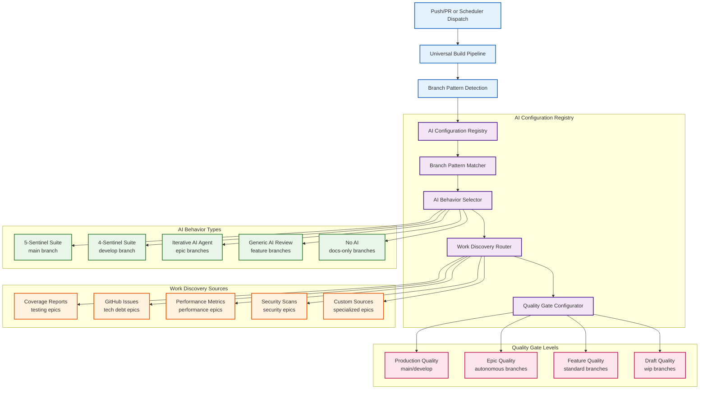
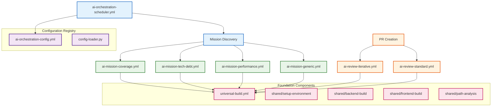

# Epic #181: AI-Powered CI/CD Orchestration Framework

**Last Updated:** 2025-09-23
**Version:** 1.0
**Epic Context:** AI-Powered CI/CD Orchestration Framework
**Status:** Vision Documented - Implementation Ready

> **Parent:** [`Epic #181 Build Workflows`](./README.md)

## 1. Purpose & Responsibility

* **What it is:** Comprehensive AI-powered CI/CD orchestration framework that provides universal build pipelines with configurable AI integration, enabling unlimited autonomous development workstreams with branch-aware AI behaviors and intelligent work discovery.
* **Key Objectives:**
  - **Primary: Universal AI Orchestration** - Create configurable CI/CD framework supporting any branch pattern with appropriate AI integration
  - **Branch-Aware AI Selection** - Different branches receive different AI behaviors (sentinels, iterative review, generic review)
  - **Multi-Epic Autonomous Support** - Enable unlimited epic workflows with specialized AI agents and work discovery
  - **Non-Blocking Build Philosophy** - AI missions can work on broken code while AI reviews require working builds
  - **Intelligent Work Discovery** - Pluggable work source adapters for coverage reports, GitHub issues, performance metrics, etc.
  - **Cost-Controlled Iteration** - Configurable iteration limits and auto-merge criteria per branch type
* **Success Criteria:**
  - **Universal Branch Support** - Any branch gets appropriate AI integration without configuration changes
  - **Multi-Epic Scaling** - Support for coverage, tech debt, performance, security, and custom autonomous workstreams
  - **Intelligent Cost Management** - Expensive AI operations only where configured with proper controls
  - **Self-Healing Workflows** - AI missions can diagnose and fix broken builds automatically
  - **Configurable Quality Gates** - Per-branch quality standards with automated enforcement
* **Why it exists:** To create a scalable, intelligent CI/CD framework that eliminates manual coordination overhead while providing appropriate AI integration for every development scenario, from simple feature branches to complex autonomous epic workflows.

> **Expanded Vision:** This framework transforms Epic #181 from build workflow standardization into a comprehensive AI-powered development orchestration system supporting unlimited autonomous workstreams.

### Strategic Architecture Vision

Epic #181's AI orchestration framework enables organizational scaling through intelligent automation:

```yaml
Framework_Philosophy:
  Universal_Coverage: "Every branch gets appropriate AI integration automatically"
  Intelligent_Selection: "Branch patterns determine AI behavior without manual configuration"
  Cost_Optimization: "Expensive operations only where valuable and controlled"
  Self_Healing: "AI can work on broken builds to fix them"

Strategic_Benefits:
  Development_Velocity: "Eliminate coordination overhead through intelligent automation"
  Quality_Assurance: "AI-powered quality enforcement appropriate to each branch type"
  Resource_Efficiency: "Targeted AI usage with cost controls and optimization"
  Infinite_Scaling: "Framework supports unlimited autonomous workstreams"
```

## 2. Architecture & Key Concepts

* **High-Level Design:** Universal build pipeline with dynamic AI configuration layer that maps branch patterns to appropriate AI behaviors, work discovery mechanisms, and quality enforcement levels.

### Complete AI Orchestration Architecture



### Execution Topology

* **Default-Branch Dispatcher:** Cron-based workflow that reads the configuration registry, finds matching epic branches, and launches mission workflows with the correct prompts and context.
* **Mission Workflows:** Branch-specific YAML definitions that inherit the base build steps, run them with advisory failure handling, and execute AI builders/fixers against draft PRs.
* **Review Workflows:** PR-triggered YAML definitions that reuse the same foundation but require passing builds/tests before running review AI and producing merge checklists.
* **Generic Review:** Lightweight fallback workflow that applies a single-pass review to branches without bespoke behavior.
* **Shared Artifacts:** Coverage diffs, test logs, and review TODO lists persist between workflows so the dispatcher can resume partial work.

### Branch Pattern Configuration Matrix

```yaml
Branch_Patterns:
  main:
    ai_behavior: "5-sentinel-suite"
    sentinels: [debt, standards, testing, security, merge]
    iterative: false
    auto_merge: false
    quality_gates: "production"
    work_discovery: "none"

  develop:
    ai_behavior: "4-sentinel-suite"
    sentinels: [debt, standards, testing, merge]
    iterative: false
    auto_merge: false
    quality_gates: "staging"
    work_discovery: "none"

  "epic/testing-coverage-*":
    ai_behavior: "iterative-autonomous"
    ai_prompt: "coverage-builder"
    ai_review: "iterative-code-review"
    iterative: true
    max_iterations: 5
    scheduler: "6h"
    auto_merge: true  # orchestrator merges only after review AI success
    quality_gates: "epic"
    work_discovery: "coverage_reports"

  "epic/tech-debt-*":
    ai_behavior: "iterative-autonomous"
    ai_prompt: "tech-debt-resolver"
    ai_review: "iterative-code-review"
    iterative: true
    max_iterations: 3
    scheduler: "12h"
    auto_merge: true  # orchestrator merges only after review AI success
    quality_gates: "epic"
    work_discovery: "github_issues"
    work_filters: ["tech-debt", "maintenance"]

  "epic/performance-*":
    ai_behavior: "iterative-autonomous"
    ai_prompt: "performance-optimizer"
    ai_review: "iterative-code-review"
    iterative: true
    max_iterations: 4
    scheduler: "24h"
    auto_merge: true  # orchestrator merges only after review AI success
    quality_gates: "epic"
    work_discovery: "performance_metrics"

  "feature/*":
    ai_behavior: "single-review"
    ai_prompt: "generic-code-review"
    iterative: false
    auto_merge: false
    quality_gates: "feature"
    work_discovery: "none"

  "hotfix/*":
    ai_behavior: "security-focused"
    ai_prompt: "security-hotfix-review"
    iterative: false
    auto_merge: false
    quality_gates: "production"
    work_discovery: "none"

  "docs/*":
    ai_behavior: "documentation-review"
    ai_prompt: "documentation-review"
    iterative: false
    auto_merge: false
    quality_gates: "documentation"
    work_discovery: "none"

  default:
    ai_behavior: "generic-review"
    ai_prompt: "generic-code-review"
    iterative: false
    auto_merge: false
    quality_gates: "basic"
    work_discovery: "none"
```

### Universal Build Pipeline Components

```mermaid
graph LR
    A[Environment Setup] --> B[Dependency Resolution]
    B --> C[Build Execution]
    C --> D[Test Execution]
    D --> E[AI Configuration Loading]
    E --> F[AI Orchestration]
    F --> G[Quality Gate Assessment]
    G --> H[Deployment Decision]

    subgraph "Always Execute (Non-Blocking for AI Missions)"
        A
        B
        C
        D
    end

    subgraph "Conditional AI Integration"
        E
        F
    end

    subgraph "Quality Enforcement"
        G
        H
    end

    classDef always fill:#e8f5e8,stroke:#2e7d32,stroke-width:2px
    classDef conditional fill:#f3e5f5,stroke:#4a148c,stroke-width:2px
    classDef quality fill:#fff3e0,stroke:#e65100,stroke-width:2px

    class A,B,C,D always
    class E,F conditional
    class G,H quality
```



## 3. GitHub Actions Technical Constraints

### 3.1 Workflow Execution Limits and Timeouts

```yaml
GitHub_Actions_Limits:
  workflow_timeout: "6 hours maximum per workflow"
  job_timeout: "6 hours maximum per job"
  step_timeout: "configurable per step"
  scheduler_timeout: "15 minutes for orchestration discovery"
  mission_timeout: "45 minutes for AI missions"
  review_timeout: "30 minutes for PR reviews"

Recommended_Timeouts:
  foundation_pipeline: "25 minutes"  # Build + test + analysis
  ai_configuration: "2 minutes"     # Configuration loading
  ai_execution: "15 minutes"        # Per AI operation
  artifact_storage: "5 minutes"     # Artifact upload/download
```

### 3.2 Concurrent Job Limitations

```yaml
Concurrency_Controls:
  global_ai_operations:
    group: "ai-operations-global"
    cancel_in_progress: false
    max_parallel: 2  # Prevent resource exhaustion

  per_epic_missions:
    group: "ai-mission-coverage-{branch}"
    cancel_in_progress: false  # Allow scheduled missions to complete

  scheduler_controller:
    group: "ai-orchestration-scheduler"
    cancel_in_progress: true   # New discovery cancels old

Resource_Management:
  mission_workflow_limits:
    max_parallel: 2
    fail_fast: false
    strategy_matrix: "dynamic based on discovered work"

  cost_control_implementation:
    monitoring: "per-operation cost tracking"
    limits: "configurable by branch pattern (unlimited/high/medium/low)"
    quotas: "GitHub Actions minutes + AI API calls"
```

### 3.3 Secret Management Requirements

```yaml
Required_Secrets:
  GITHUB_TOKEN: "Repository access for PR management"
  OPENAI_API_KEY: "AI service authentication"

Optional_Secrets:
  COST_TRACKING_API: "External cost monitoring service"
  NOTIFICATION_WEBHOOK: "Team alerting integration"

Permissions_Strategy:
  minimal_required:
    contents: read
    actions: write        # Workflow dispatch only
    pull_requests: write  # Comment and label management
    id_token: write       # OIDC token for secure authentication

  explicitly_excluded:
    issues: write
    packages: write
    deployments: write
```

## 4. Implementation Architecture

### 4.1 Workflow File Relationships



### 4.2 Configuration Registry Integration

* **Dynamic Configuration Loading:** Python-based configuration loader (`config-loader.py`) provides branch pattern matching and behavior selection
* **YAML Configuration Structure:** Centralized configuration file (`ai-orchestration-config.yml`) defines branch patterns, AI behaviors, quality gates, and cost controls
* **Runtime Behavior Selection:** Workflows dynamically load appropriate AI configuration based on branch patterns without manual configuration
* **Validation and Fallbacks:** Configuration syntax validation with graceful degradation to default behaviors

### 4.3 Artifact-Based Storage Strategy

```yaml
Artifact_Management:
  mission_artifacts:
    name: "ai-mission-artifacts-{run_number}"
    content: ["coverage_reports", "analysis_results", "failure_context"]
    retention: "7 days"

  review_artifacts:
    name: "ai-review-artifacts-{pr_number}"
    content: ["review_results", "quality_assessments", "approval_status"]
    retention: "30 days"

  cross_workflow_state:
    mechanism: "GitHub API + artifact storage"
    persistence: "Mission status, work discovery, iteration tracking"
    coordination: "Scheduler reads artifacts to resume partial work"
```

## 5. Mission vs Review Execution Semantics

### 5.1 Mission Execution (Non-Blocking Philosophy)

```yaml
Mission_Characteristics:
  continue_on_error: true  # Can work on broken builds
  failure_handling: "advisory - log but continue"
  quality_gates: "epic-level standards"
  auto_merge: "enabled with AI review success"

Implementation_Pattern:
  foundation_steps:
    environment_setup: "required - failure terminates mission"
    dependency_resolution: "continue-on-error: true"
    build_execution: "continue-on-error: true"
    test_execution: "continue-on-error: true"

  ai_execution:
    work_discovery: "always execute regardless of foundation status"
    ai_development: "can diagnose and fix foundation failures"
    draft_pr_creation: "even with test failures"

  scheduled_trigger_handling:
    quota_window_classification: "skipped_quota_window during subscription refresh"
    manual_vs_scheduled: "different failure semantics"
    retry_logic: "automatic retry on next scheduler cycle"
```

### 5.2 Review Execution (Blocking Validation)

```yaml
Review_Characteristics:
  continue_on_error: false  # Requires working builds
  failure_handling: "blocking - must pass foundation"
  quality_gates: "branch-appropriate standards"
  auto_merge: "manual approval required"

Implementation_Pattern:
  foundation_validation:
    build_success: "required for AI review"
    test_success: "required for AI review"
    coverage_threshold: "branch-pattern dependent"

  pr_state_management:
    foundation_failure: "convert PR to draft automatically"
    foundation_success: "mark PR ready for review"
    manual_override: "/ai-review-override comment support"

  blocking_semantics:
    failed_foundation: "AI review skipped entirely"
    annotation_strategy: "clear failure reasons with remediation steps"
```

### 5.3 PR Draft Conversion Logic

```yaml
Draft_Conversion_Triggers:
  automatic_draft_conversion:
    foundation_failure: "build or test failures"
    security_scan_failure: "critical security issues"
    coverage_regression: "below branch-pattern threshold"

  ready_for_review_triggers:
    foundation_success: "all foundation steps pass"
    ai_review_completion: "positive AI analysis"
    manual_override: "developer /ready command"

  notification_strategy:
    draft_conversion: "automated comment with failure context"
    ready_conversion: "automated comment with review summary"
    manual_override_available: "clear instructions for bypass"
```

## 6. Workflow Orchestration Patterns

### 6.1 Scheduler Dispatch Mechanism

```yaml
Scheduler_Operation:
  discovery_phase:
    branch_enumeration: "git branch -r | grep epic/"
    work_discovery: "per-branch work source adapters"
    mission_matrix_generation: "JSON matrix for parallel execution"

  dispatch_phase:
    mission_workflow_selection: "pattern-based workflow routing"
    parallel_execution: "max-parallel: 2 for resource control"
    health_check_integration: "scheduler health validation"

  coordination_phase:
    artifact_monitoring: "cross-workflow state tracking"
    retry_logic: "failed missions retry on next cycle"
    cost_monitoring: "aggregate resource usage tracking"
```

### 6.2 Mission-to-Review Context Handoff

```yaml
Context_Transfer_Patterns:
  mission_completion:
    artifact_storage: "analysis results, code changes, test status"
    pr_metadata: "mission type, iteration count, AI decisions"
    branch_state: "foundation status, work remaining"

  review_trigger:
    artifact_retrieval: "download previous mission artifacts"
    context_reconstruction: "rebuild mission context for review"
    continuity_validation: "ensure review applies to mission output"

  state_consistency:
    pr_synchronization: "mission changes reflected in review context"
    conflict_detection: "identify merge conflicts or state divergence"
    recovery_mechanisms: "handle interrupted workflows"
```

### 6.3 Auto-Merge Quality Gate Integration

```yaml
Auto_Merge_Criteria:
  foundation_requirements:
    build_success: true
    test_success: true
    coverage_threshold: "branch-pattern dependent"

  ai_review_requirements:
    review_completion: "iterative AI review success"
    quality_assessment: "meets branch-pattern standards"
    security_validation: "no critical security issues"

  orchestrator_validation:
    merge_conflict_check: "no conflicts with target branch"
    branch_protection_compliance: "all required checks pass"
    cost_budget_compliance: "within configured limits"

Merge_Execution:
  orchestrator_responsibility: "WorkflowEngineer Coverage Epic Merge Orchestrator"
  ai_conflict_resolution: "intelligent merge conflict handling"
  batch_processing: "8+ PR consolidation capability"
```

## 7. Configuration Integration Details

### 7.1 YAML Configuration Loading

```yaml
Configuration_Loading_Process:
  validation_phase:
    syntax_validation: "Python YAML parser with error handling"
    schema_validation: "required sections and structure verification"
    pattern_compilation: "regex pattern pre-compilation for performance"

  resolution_phase:
    pattern_matching: "priority-based branch pattern evaluation"
    behavior_selection: "AI behavior configuration extraction"
    quality_gate_mapping: "branch-appropriate quality standards"

  caching_strategy:
    configuration_caching: "per-workflow run caching"
    pattern_caching: "compiled regex pattern reuse"
    fallback_handling: "graceful degradation to defaults"
```

### 7.2 Dynamic Behavior Selection Implementation

```yaml
Behavior_Selection_Logic:
  pattern_priority_resolution:
    high_priority: "main (100), develop (90)"
    epic_priority: "coverage (80), tech-debt (75), performance (75)"
    feature_priority: "hotfix (60), feature (50)"
    fallback_priority: "default (0)"

  configuration_override:
    manual_dispatch: "workflow_dispatch inputs override patterns"
    emergency_override: "admin-level behavior forcing"
    cost_limit_enforcement: "hard limits regardless of configuration"

  runtime_adaptation:
    cost_monitoring: "real-time cost tracking with circuit breakers"
    performance_monitoring: "execution time tracking and optimization"
    failure_adaptation: "automatic degradation on repeated failures"
```

### 7.3 Branch Pattern Matching Technical Details

```yaml
Pattern_Matching_Implementation:
  regex_compilation:
    pattern_validation: "compile-time regex syntax validation"
    performance_optimization: "pre-compiled patterns for runtime efficiency"
    case_sensitivity: "configurable per-pattern case handling"

  matching_algorithm:
    priority_sorting: "highest priority patterns evaluated first"
    exact_matching: "^main$ for precise branch matching"
    prefix_matching: "^epic/testing-coverage-.* for epic families"

  fallback_strategy:
    no_match_handling: "default configuration application"
    malformed_pattern: "error logging with graceful degradation"
    configuration_errors: "validation errors with clear messaging"
```

## 8. Dependencies and Blockers

### 8.1 Critical Blocking Dependencies

**Issue #220: Coverage Epic Merge Orchestrator (HIGH PRIORITY BLOCKER)**
```yaml
Blocker_Details:
  impact: "Multi-PR consolidation workflows cannot function"
  affected_components:
    - "Phase 5 merge orchestration"
    - "AI conflict resolution"
    - "8+ PR batch processing"
  mitigation_required:
    - "Prioritize Issue #220 resolution before full framework deployment"
    - "Implement fallback manual merge process for interim period"
    - "Develop comprehensive testing for AI conflict resolution"
  timeline_impact: "Framework deployment blocked until resolution"
```

### 8.2 Foundation Component Dependencies

**Issue Dependencies (COMPLETE)**
```yaml
Foundation_Readiness:
  issue_183: "✅ Foundation components - COMPLETE"
  issue_212: "✅ Canonical build patterns - COMPLETE"
  issue_184: "✅ AI framework components - COMPLETE"
  issue_185: "✅ Iterative AI review protocols - COMPLETE"

Implementation_Ready:
  shared_actions: "environment setup, build, test, path analysis"
  workflow_patterns: "universal build pipeline foundation"
  ai_integration: "iterative review and mission frameworks"
  quality_gates: "foundation validation and quality enforcement"
```

### 8.3 Dependency Chain for Framework Deployment

```yaml
Deployment_Dependencies:
  phase_1_prerequisites:
    - "Issue #220 resolution (BLOCKING)"
    - "AI Configuration Registry implementation"
    - "Universal Build Workflow creation"

  phase_2_prerequisites:
    - "Work Discovery Adapters development"
    - "Mission Workflow Templates completion"
    - "Review Workflow Specifications implementation"

  phase_3_prerequisites:
    - "End-to-end integration testing"
    - "Performance validation under load"
    - "Security boundary verification"

  critical_path:
    blocking_items: ["Issue #220"]
    parallel_development: ["Configuration Registry", "Universal Pipeline"]
    validation_requirements: ["Integration Testing", "Security Review"]
```

## 9. Interface Contract & Assumptions

* **Key AI Orchestration Interfaces:**
  - **Universal Build Interface:**
    * **Purpose:** Provide consistent build foundation for all branches with conditional AI integration
    * **Dependencies:** GitHub Actions environment, Docker runtime, AI framework components
    * **Outputs:** Build artifacts, test results, AI configuration, quality assessments
    * **Quality Gates:** Branch-appropriate quality standards with configurable enforcement

  - **AI Configuration Registry Interface:**
    * **Purpose:** Dynamic AI behavior selection based on branch patterns and repository state
    * **Dependencies:** Branch pattern matching, AI prompt templates, work discovery adapters
    * **Outputs:** AI behavior configuration, prompt selection, iteration controls, quality criteria
    * **Quality Gates:** Configuration validation, security boundary enforcement, cost controls

  - **Work Discovery Interface:**
    * **Purpose:** Pluggable work source adapters enabling different autonomous workstreams
    * **Dependencies:** Repository analysis tools, external data sources, filtering criteria
    * **Outputs:** Work item lists, priority rankings, progress tracking, completion criteria
    * **Quality Gates:** Work item validation, scope boundaries, completion verification

  - **AI Orchestration Interface:**
    * **Purpose:** Execute appropriate AI behavior based on configuration with iteration management
    * **Dependencies:** AI framework components, prompt templates, context management, state persistence
    * **Outputs:** AI analysis results, iteration tracking, quality assessments, improvement recommendations
    * **Quality Gates:** AI service validation, response quality checks, safety controls

* **Critical Assumptions:**
  - **Technical Assumptions:** AI framework provides sufficient intelligence for autonomous decision-making across diverse development scenarios
  - **Resource Assumptions:** GitHub Actions infrastructure supports variable AI workloads with intelligent cost optimization
  - **Integration Assumptions:** Branch pattern matching accurately captures organizational development patterns
  - **Quality Assumptions:** Configurable quality gates maintain appropriate standards for each development context

## 9. Local Conventions & Constraints (Beyond Global Standards)

* **AI Orchestration Standards:**
  - All AI integrations must include transparent decision-making with audit trails
  - Configuration changes must be testable and reversible without code modifications
  - Resource consumption must be monitored and controlled with automatic optimization
  - Security boundaries must be maintained across all AI integration scenarios
* **Technology Constraints:**
  - GitHub Actions as universal platform with variable resource allocation
  - AI framework components must operate within established security and performance boundaries
  - Work discovery adapters must provide consistent interfaces regardless of data source
* **Operational Constraints:**
  - Universal pipeline must maintain sub-5-minute execution for non-AI operations
  - AI operations must include configurable timeouts and resource limits
  - Error handling must provide graceful degradation with clear escalation paths

## 10. How to Work With This Framework

* **Implementation Approach:**
  - **Foundation Integration:** Build upon Issues #183, #212, #184 foundation components
  - **Configuration Layer:** Implement AI configuration registry with branch pattern matching
  - **Universal Pipeline:** Create base build workflow supporting all branch types
  - **AI Integration:** Develop dynamic AI orchestration with configurable behaviors
  - **Work Discovery:** Implement pluggable work source adapters for different epic types
* **Quality Assurance:**
  - **Universal Testing:** Validate framework behavior across all supported branch patterns
  - **Configuration Validation:** Ensure AI configuration loading and behavior selection accuracy
  - **Performance Testing:** Validate resource utilization and cost optimization across workload types
* **Common Implementation Pitfalls:**
  - Over-configuring AI behaviors can obscure simple development workflows
  - Universal pipeline complexity requires clear separation of concerns and modularity
  - Work discovery abstraction must maintain performance while providing flexibility

## 10. Dependencies

*Note: Detailed dependency information is covered in Section 8. This section provides implementation-focused dependency context.*

* **Foundation Dependencies (COMPLETE):**
  - [`Issue #183`](./04-implementation-roadmap.md#issue-183) - Foundation components - **COMPLETE**
  - [`Issue #212`](./05-issue-212-build-refactor.md) - Canonical build patterns - **COMPLETE**
  - [`Issue #184`](./06-canonical-pattern-implementation.md) - AI framework components - **COMPLETE**
  - [`Issue #185`](./08-iterative-ai-review-protocols.md) - Iterative AI review - **COMPLETE**

* **Critical Implementation Blockers:**
  - **Issue #220:** Coverage Epic Merge Orchestrator - **BLOCKING FRAMEWORK DEPLOYMENT**
  - AI Configuration Registry implementation - Dynamic branch pattern matching required
  - Universal Build Workflow creation - Foundation for all AI integration

* **External Integration Dependencies:**
  - GitHub Actions platform scalability for variable AI workloads with concurrent job management
  - AI service reliability with comprehensive retry logic and fallback strategies
  - Repository analysis tools for work discovery with pluggable adapter architecture

## 11. Rationale & Key Historical Context

* **Strategic Context:** AI orchestration framework prioritized to eliminate coordination overhead while scaling development capabilities through intelligent automation rather than additional human resources.
* **Evolution from Build Standardization:** Framework concept emerged from Issue #185 testing requirements, recognizing need for universal CI/CD with appropriate AI integration for every development scenario.
* **Multi-Epic Vision:** Decision to support unlimited autonomous workstreams enables organizational scaling through pattern replication rather than custom implementations.
* **Branch-Aware Design:** Branch pattern approach ensures appropriate AI behavior without manual configuration or development workflow disruption.

### Framework Benefits Across Development Scenarios

The AI orchestration framework serves diverse development needs through intelligent behavior selection:

```yaml
Development_Scenarios:
  Production_Releases: "Full 5-sentinel suite with comprehensive quality enforcement"
  Feature_Development: "Generic AI review with basic quality gates"
  Epic_Workstreams: "Autonomous iterative AI with specialized work discovery"
  Documentation_Updates: "Documentation-focused AI with content validation"
  Hotfix_Deployment: "Security-focused AI with expedited quality gates"

Universal_Benefits:
  Developer_Experience: "Appropriate AI integration without configuration burden"
  Quality_Assurance: "Consistent quality enforcement appropriate to each scenario"
  Resource_Efficiency: "Intelligent AI usage with cost optimization"
  Operational_Scaling: "Unlimited workstream support through pattern replication"
```

## 12. Known Issues & TODOs

* **Implementation Status:**
  - ✅ **Foundation Complete:** Issues #183, #212, #184, #185 provide comprehensive framework foundation
  - ✅ **Iterative AI Ready:** Issue #185 implementation demonstrates sophisticated AI integration patterns
  - 🚧 **Framework Design:** AI orchestration framework specification complete, implementation pending
  - 🎯 **Universal Pipeline:** Base build workflow design and configuration layer development required

* **Implementation Roadmap:**
  ```yaml
  Phase_1_Foundation:
    AI_Configuration_Registry: "Dynamic branch pattern matching and behavior selection"
    Universal_Build_Workflow: "Base pipeline supporting all branch types"

  Phase_2_Integration:
    Work_Discovery_Adapters: "Pluggable interfaces for coverage, issues, metrics"
    Multi_Epic_Orchestration: "Coordination patterns for autonomous workstreams"

  Phase_3_Optimization:
    Cost_Optimization_Engine: "Resource monitoring and intelligent usage control"
    Performance_Analytics: "Framework performance tracking and optimization"

  Phase_4_Scaling:
    Custom_Workstream_Support: "Tools for creating new autonomous epic patterns"
    Cross_Repository_Support: "Framework extension to multiple repositories"
  ```

* **Critical Success Factors:**
  - **Universal Compatibility:** Framework must support all existing development workflows without disruption
  - **Intelligent Resource Usage:** AI operations must be cost-effective and performance-optimized
  - **Configuration Simplicity:** Branch pattern approach must eliminate manual configuration requirements
  - **Quality Maintenance:** Automated quality enforcement must maintain standards across all scenarios

* **Future Framework Extensions:**
  - **Cross-Repository Support:** Extend framework patterns to multiple repositories
  - **Advanced Work Discovery:** Machine learning-enhanced work prioritization and discovery
  - **Predictive Quality Gates:** AI-powered quality prediction and optimization
  - **Developer Experience Analytics:** Framework usage patterns and optimization recommendations

> **Implementation Readiness:** AI orchestration framework specification complete and ready for implementation. Framework provides foundation for unlimited autonomous development workstreams with intelligent resource management and appropriate quality enforcement.

---

*This document establishes the comprehensive vision for Epic #181's transformation into an AI-powered CI/CD orchestration framework, enabling unlimited autonomous development workstreams through intelligent branch-aware AI integration.*
