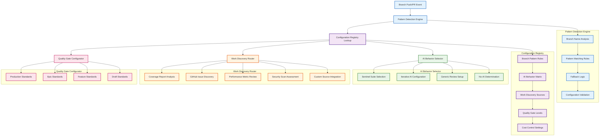

# Epic #181: AI Configuration Registry Specification

**Last Updated:** 2025-09-23
**Version:** 1.0
**Epic Context:** AI-Powered CI/CD Orchestration Framework
**Status:** Specification Complete - Implementation Ready

> **Parent:** [`Epic #181 AI Orchestration Framework`](./09-ai-orchestration-framework.md)

## 1. Purpose & Responsibility

* **What it is:** Dynamic configuration system that maps branch patterns to appropriate AI behaviors, work discovery sources, and quality enforcement levels, enabling the universal CI/CD framework to automatically select optimal AI integration without manual configuration.
* **Key Objectives:**
  - **Dynamic Branch Pattern Matching** - Intelligent detection of branch types with configurable pattern rules
  - **AI Behavior Selection** - Automatic selection of appropriate AI integration (sentinels, iterative, generic, none)
  - **Work Discovery Routing** - Pluggable work source adapters based on epic type and branch patterns
  - **Quality Gate Configuration** - Per-branch quality standards with automatic enforcement levels
  - **Cost Control Integration** - Intelligent resource usage optimization and iteration limits
  - **Configuration Validation** - Runtime validation of AI behavior configurations and safety controls
* **Success Criteria:**
  - **Zero-Configuration Experience** - Developers get appropriate AI integration without any setup requirements
  - **Intelligent Pattern Matching** - Branch patterns accurately capture all organizational development scenarios
  - **Cost-Effective Operations** - Expensive AI operations only deployed where valuable with proper controls
  - **Quality Standard Enforcement** - Automatic quality gate selection appropriate to each development context
  - **Configuration Extensibility** - Easy addition of new branch patterns and AI behaviors without code changes
* **Why it exists:** To eliminate manual configuration burden while ensuring every branch receives appropriate AI integration, enabling seamless scaling of autonomous development patterns across unlimited workstreams.

> **Framework Integration:** AI Configuration Registry serves as the intelligence layer of the universal CI/CD framework, making automatic decisions that eliminate coordination overhead.

### Configuration Philosophy

The AI Configuration Registry embodies intelligent automation principles:

```yaml
Configuration_Philosophy:
  Zero_Touch: "Developers never configure AI - it's automatic based on branch patterns"
  Intelligent_Defaults: "Sensible AI behavior selection for common development scenarios"
  Cost_Awareness: "Expensive operations only where they provide maximum value"
  Quality_Appropriate: "Quality enforcement level matches development context"
  Mission_Friendly_Failures: "Scheduled builders treat failing builds as context so repair agents can act"
  Review_Gates: "Pull-request validations block until review AI reports success"

Strategic_Benefits:
  Developer_Productivity: "Focus on code, not CI/CD configuration"
  Resource_Optimization: "AI usage automatically optimized for cost and effectiveness"
  Organizational_Scaling: "New autonomous workstreams through pattern replication"
  Quality_Assurance: "Consistent quality enforcement without manual oversight"
```

## 2. Architecture & Key Concepts

* **High-Level Design:** Layered configuration system with branch pattern detection, AI behavior mapping, work discovery routing, and quality gate selection, providing comprehensive automation decision-making for the universal CI/CD framework.

### AI Configuration Registry Architecture



### Comprehensive Configuration Schema

```yaml
# .github/ai-orchestration-config.yml
# NOTE: scheduler blocks describe instructions for the default-branch orchestration workflow.
# The controller resolves matching draft PRs, resumes iterations, and only then dispatches mission jobs.
ai_orchestration:
  version: "1.0"
  default_behavior: "generic-review"
  cost_monitoring: true
  security_validation: true

  # Branch Pattern Definitions
  branch_patterns:
    # Production Branches - Full AI Sentinel Suite
    main:
      pattern: "^main$"
      priority: 100
      ai_behavior: "5-sentinel-suite"
      configuration:
        sentinels: ["debt", "standards", "testing", "security", "merge"]
        iterative: false
        auto_merge: false
        quality_gates: "production"
        cost_limit: "unlimited"
        timeout_minutes: 30
      work_discovery:
        enabled: false
      notifications:
        success: ["team-leads", "security"]
        failure: ["oncall", "team-leads"]

    develop:
      pattern: "^develop$"
      priority: 90
      ai_behavior: "4-sentinel-suite"
      configuration:
        sentinels: ["debt", "standards", "testing", "merge"]
        iterative: false
        auto_merge: false
        quality_gates: "staging"
        cost_limit: "high"
        timeout_minutes: 25
      work_discovery:
        enabled: false

    # Epic Autonomous Branches
    coverage_epic:
      pattern: "^epic/testing-coverage-.*"
      priority: 80
      ai_behavior: "iterative-autonomous"
      configuration:
        ai_prompt: "coverage-builder"
        ai_review: "iterative-code-review"
        iterative: true
        max_iterations: 5
        auto_merge: true  # orchestrator merges only after review AI success
        quality_gates: "epic"
        cost_limit: "medium"
        timeout_minutes: 15
        scheduler:
          enabled: true
          interval: "6h"
          conditions: ["no_pending_prs", "build_healthy"]
      work_discovery:
        enabled: true
        source: "coverage_reports"
        configuration:
          baseline_threshold: 16
          target_threshold: 90
          focus_areas: ["Services", "Controllers", "Models"]
          exclusions: ["Generated", "Migrations"]

    tech_debt_epic:
      pattern: "^epic/tech-debt-.*"
      priority: 80
      ai_behavior: "iterative-autonomous"
      configuration:
        ai_prompt: "tech-debt-resolver"
        ai_review: "iterative-code-review"
        iterative: true
        max_iterations: 3
        auto_merge: true  # orchestrator merges only after review AI success
        quality_gates: "epic"
        cost_limit: "medium"
        timeout_minutes: 20
        scheduler:
          enabled: true
          interval: "12h"
          conditions: ["low_activity_period"]
      work_discovery:
        enabled: true
        source: "github_issues"
        configuration:
          labels: ["tech-debt", "maintenance", "refactor"]
          priority_weights:
            "high": 10
            "medium": 5
            "low": 1
          max_items_per_cycle: 3

    performance_epic:
      pattern: "^epic/performance-.*"
      priority: 80
      ai_behavior: "iterative-autonomous"
      configuration:
        ai_prompt: "performance-optimizer"
        ai_review: "iterative-code-review"
        iterative: true
        max_iterations: 4
        auto_merge: true  # orchestrator merges only after review AI success
        quality_gates: "epic"
        cost_limit: "medium"
        timeout_minutes: 25
        scheduler:
          enabled: true
          interval: "24h"
          conditions: ["performance_degradation_detected"]
      work_discovery:
        enabled: true
        source: "performance_metrics"
        configuration:
          metrics: ["response_time", "memory_usage", "cpu_usage"]
          degradation_threshold: 15
          baseline_days: 7

    # Standard Feature Development
    feature_branches:
      pattern: "^feature/.*"
      priority: 50
      ai_behavior: "single-review"
      configuration:
        ai_prompt: "generic-code-review"
        iterative: false
        auto_merge: false
        quality_gates: "feature"
        cost_limit: "low"
        timeout_minutes: 10
      work_discovery:
        enabled: false

    # Hotfix Branches - Security Focused
    hotfix_branches:
      pattern: "^hotfix/.*"
      priority: 95
      ai_behavior: "security-focused"
      configuration:
        ai_prompt: "security-hotfix-review"
        sentinels: ["security", "standards"]
        iterative: false
        auto_merge: false
        quality_gates: "production"
        cost_limit: "high"
        timeout_minutes: 15
        priority_escalation: true
      work_discovery:
        enabled: false

    # Documentation Branches
    documentation_branches:
      pattern: "^docs/.*"
      priority: 30
      ai_behavior: "documentation-review"
      configuration:
        ai_prompt: "documentation-review"
        iterative: false
        auto_merge: false
        quality_gates: "documentation"
        cost_limit: "very_low"
        timeout_minutes: 5
      work_discovery:
        enabled: false

    # Release Branches
    release_branches:
      pattern: "^release/.*"
      priority: 85
      ai_behavior: "release-validation"
      configuration:
        sentinels: ["standards", "testing", "security"]
        iterative: false
        auto_merge: false
        quality_gates: "release"
        cost_limit: "high"
        timeout_minutes: 20
      work_discovery:
        enabled: false

  # Fallback Configuration
  default_configuration:
    ai_behavior: "generic-review"
    configuration:
      ai_prompt: "generic-code-review"
      iterative: false
      auto_merge: false
      quality_gates: "basic"
      cost_limit: "low"
      timeout_minutes: 10
    work_discovery:
      enabled: false

  # AI Behavior Definitions
  ai_behaviors:
    "5-sentinel-suite":
      description: "Complete AI sentinel analysis suite for production"
      components: ["debt-analysis", "standards-compliance", "testing-analysis", "security-analysis", "merge-orchestration"]
      cost_category: "high"

    "4-sentinel-suite":
      description: "Development AI sentinel suite (no security)"
      components: ["debt-analysis", "standards-compliance", "testing-analysis", "merge-orchestration"]
      cost_category: "medium-high"

    "iterative-autonomous":
      description: "Iterative AI with autonomous improvement cycles"
      components: ["ai-code-generation", "iterative-review", "quality-gates"]
      cost_category: "medium"

    "single-review":
      description: "Single-pass AI code review"
      components: ["generic-review"]
      cost_category: "low"

    "security-focused":
      description: "Security-prioritized analysis"
      components: ["security-analysis", "standards-compliance"]
      cost_category: "medium"

    "documentation-review":
      description: "Documentation quality and consistency review"
      components: ["documentation-analysis"]
      cost_category: "very_low"

  # Work Discovery Source Definitions
  work_discovery_sources:
    coverage_reports:
      description: "Code coverage analysis and gap identification"
      adapter: "coverage-report-adapter"
      configuration_schema:
        baseline_threshold: "number"
        target_threshold: "number"
        focus_areas: "array"
        exclusions: "array"

    github_issues:
      description: "GitHub issues with label-based filtering"
      adapter: "github-issues-adapter"
      configuration_schema:
        labels: "array"
        priority_weights: "object"
        max_items_per_cycle: "number"

    performance_metrics:
      description: "Application performance monitoring data"
      adapter: "performance-metrics-adapter"
      configuration_schema:
        metrics: "array"
        degradation_threshold: "number"
        baseline_days: "number"

  # Quality Gate Definitions
  quality_gates:
    production:
      description: "Production-ready quality standards"
      requirements:
        - "all_tests_pass"
        - "security_scan_clear"
        - "code_coverage_maintained"
        - "performance_regression_check"
        - "manual_approval_required"
      blocking: true

    staging:
      description: "Staging environment quality standards"
      requirements:
        - "all_tests_pass"
        - "code_coverage_maintained"
        - "basic_security_check"
      blocking: true

    epic:
      description: "Epic progression quality standards"
      requirements:
        - "core_tests_pass"
        - "ai_review_approval"
        - "no_critical_issues"
      blocking: false
      auto_merge_conditions:
        - "all_requirements_met"
        - "no_blocking_issues"

    feature:
      description: "Feature development quality standards"
      requirements:
        - "relevant_tests_pass"
        - "ai_review_complete"
      blocking: false

    basic:
      description: "Basic quality requirements"
      requirements:
        - "syntax_valid"
        - "basic_tests_pass"
      blocking: false

  # Cost Control Settings
  cost_controls:
    limits:
      unlimited: -1
      high: 1000
      medium: 500
      low: 100
      very_low: 25
    monitoring:
      enabled: true
      alerts:
        threshold_warning: 80
        threshold_critical: 95
      optimization:
        enabled: true
        strategies: ["caching", "batching", "rate_limiting"]

  # Security Controls
  security:
    validation:
      enabled: true
      requirements:
        - "token_validation"
        - "input_sanitization"
        - "output_filtering"
    boundaries:
      enforced: true
      exceptions: []
```

## 3. Interface Contract & Assumptions

* **Key Configuration Registry Interfaces:**
  - **Pattern Detection Interface:**
    * **Purpose:** Analyze branch names and repository state to determine appropriate AI behavior
    * **Dependencies:** Git metadata, repository configuration, branch naming conventions
    * **Outputs:** Matched pattern configuration, priority ranking, fallback recommendations
    * **Quality Gates:** Pattern validation, security boundary enforcement, cost limit verification

  - **AI Behavior Selection Interface:**
    * **Purpose:** Map detected patterns to specific AI integration configurations
    * **Dependencies:** AI framework components, prompt templates, resource availability
    * **Outputs:** AI behavior specification, execution parameters, timeout configurations
    * **Quality Gates:** Component availability validation, resource allocation confirmation

  - **Work Discovery Routing Interface:**
    * **Purpose:** Direct epic branches to appropriate work source adapters
    * **Dependencies:** Work source adapters, repository analysis tools, filtering criteria
    * **Outputs:** Work item lists, priority rankings, progress tracking configurations
    * **Quality Gates:** Work source validation, scope boundary enforcement

  - **Quality Gate Configuration Interface:**
    * **Purpose:** Set appropriate quality standards and enforcement levels per branch type
    * **Dependencies:** Quality assessment tools, testing framework, approval workflows
    * **Outputs:** Quality gate specifications, enforcement rules, escalation procedures
    * **Quality Gates:** Standards validation, enforcement capability confirmation

* **Critical Assumptions:**
  - **Pattern Assumptions:** Branch naming conventions accurately reflect development intent and organizational structure
  - **Resource Assumptions:** AI framework components can handle variable workloads with intelligent scaling
  - **Configuration Assumptions:** YAML configuration provides sufficient flexibility without compromising maintainability
  - **Integration Assumptions:** Universal build pipeline can consume configuration decisions without performance degradation

## 4. Local Conventions & Constraints (Beyond Global Standards)

* **Configuration Management Standards:**
  - All pattern matching must include priority weighting to handle overlapping patterns
  - Cost controls must be enforced at both configuration and runtime levels
  - Security validation required for all AI behavior configurations
  - Configuration changes must be testable through dry-run capabilities
* **Technology Constraints:**
  - YAML configuration format for human readability and version control compatibility
  - Pattern matching must support regex with performance optimization
  - Configuration loading must complete within 30 seconds for responsiveness
* **Operational Constraints:**
  - Configuration validation must prevent invalid AI behavior selection
  - Cost monitoring must provide real-time feedback and automatic optimization
  - Pattern conflicts must be resolved through priority-based selection

## 5. How to Work With This Configuration System

* **Implementation Approach:**
  - **Configuration Design:** Create comprehensive YAML schema with all organizational branch patterns
  - **Pattern Engine:** Implement efficient regex-based pattern matching with priority resolution
  - **Behavior Mapping:** Develop dynamic AI behavior selection with validation and safety controls
  - **Work Discovery:** Create pluggable adapter system for different work source types
  - **Quality Integration:** Implement quality gate configuration with automatic enforcement
* **Quality Assurance:**
  - **Configuration Testing:** Validate all branch patterns and AI behavior mappings
  - **Performance Testing:** Ensure pattern matching and configuration loading meet performance requirements
  - **Integration Testing:** Validate end-to-end configuration flow from branch detection to AI orchestration
* **Common Implementation Pitfalls:**
  - Overly complex pattern matching can impact performance and maintainability
  - Insufficient cost controls can lead to resource exhaustion
  - Missing fallback configurations can cause workflow failures for edge cases

## 6. Dependencies

* **Foundation Dependencies:**
  - [`Universal Build Pipeline`](./11-universal-build-workflow.md) - Base pipeline consuming configuration decisions
  - [`AI Orchestration Framework`](./09-ai-orchestration-framework.md) - Overall framework architecture
  - [`Issue #184 AI Framework`](./06-canonical-pattern-implementation.md) - AI component availability

* **Implementation Dependencies:**
  - **Pattern Detection Engine** - Efficient regex-based branch pattern matching
  - **Configuration Validation** - YAML schema validation and security controls
  - **Cost Monitoring System** - Real-time resource usage tracking and optimization
  - **Work Discovery Adapters** - Pluggable interfaces for different work source types

* **External Dependencies:**
  - GitHub API for branch metadata and repository state
  - AI framework components for behavior validation
  - Monitoring infrastructure for cost tracking and optimization

## 7. Rationale & Key Historical Context

* **Strategic Context:** Configuration registry prioritized to eliminate manual setup burden while ensuring appropriate AI integration for every development scenario.
* **Evolution from Manual Configuration:** Registry concept emerged from Issue #185 testing requirements, recognizing need for automatic AI behavior selection based on development context.
* **Branch-Aware Design:** Pattern-based approach ensures developers get appropriate AI integration without configuration knowledge or setup requirements.
* **Cost-Optimization Focus:** Built-in cost controls prevent resource waste while maximizing AI value through intelligent deployment.

### Configuration Benefits Across Development Workflows

The AI Configuration Registry serves diverse organizational needs through intelligent automation:

```yaml
Configuration_Benefits:
  Zero_Setup: "Developers get appropriate AI without any configuration requirements"
  Cost_Efficiency: "Expensive AI operations only where they provide maximum value"
  Quality_Consistency: "Automatic quality enforcement appropriate to each development context"
  Organizational_Scaling: "New autonomous workstreams through configuration rather than coding"

Strategic_Impact:
  Developer_Productivity: "Focus on development rather than CI/CD configuration"
  Resource_Optimization: "Intelligent AI usage with automatic cost controls"
  Quality_Assurance: "Consistent standards enforcement without manual oversight"
  Innovation_Enablement: "Rapid creation of new autonomous development patterns"
```

## 8. YAML Configuration Loader Implementation

### 8.1 Complete Python Configuration Loader

```python
"""AI Orchestration Configuration Loader"""
import yaml
import re
import sys
import json
import os
from typing import Dict, Any, Optional, List
from dataclasses import dataclass
import time
from functools import lru_cache

@dataclass
class PatternMatch:
    """Represents a successful pattern match with metadata"""
    pattern_name: str
    priority: int
    config: Dict[str, Any]
    regex_pattern: str
    match_time: float

class AIConfigurationLoader:
    """Advanced configuration loader with validation, caching, and performance optimization"""

    def __init__(self, config_path: str = ".github/ai-orchestration-config.yml"):
        self.config_path = config_path
        self.config = self._load_config()
        self._compiled_patterns = self._compile_patterns()
        self._validation_cache = {}

    def _load_config(self) -> Dict[str, Any]:
        """Load and validate configuration file with comprehensive error handling"""
        try:
            if not os.path.exists(self.config_path):
                raise FileNotFoundError(f"Configuration file not found: {self.config_path}")

            with open(self.config_path, 'r') as f:
                config = yaml.safe_load(f)

            if 'ai_orchestration' not in config:
                raise ValueError("Missing 'ai_orchestration' root key")

            # Validate required sections
            ai_config = config['ai_orchestration']
            required_sections = ['branch_patterns', 'default_configuration']
            for section in required_sections:
                if section not in ai_config:
                    raise ValueError(f"Missing required section: {section}")

            print(f"✅ Configuration loaded successfully from {self.config_path}")
            pattern_count = len(ai_config.get('branch_patterns', {}))
            print(f"📋 Found {pattern_count} branch patterns")

            return ai_config

        except yaml.YAMLError as e:
            print(f"❌ YAML syntax error in {self.config_path}: {e}")
            sys.exit(1)
        except Exception as e:
            print(f"❌ Error loading configuration: {e}")
            sys.exit(1)

    def _compile_patterns(self) -> Dict[str, re.Pattern]:
        """Pre-compile regex patterns for performance optimization"""
        compiled = {}
        branch_patterns = self.config.get('branch_patterns', {})

        for pattern_name, pattern_config in branch_patterns.items():
            regex_str = pattern_config.get('pattern', '')
            try:
                compiled[pattern_name] = re.compile(regex_str)
                print(f"✅ Compiled pattern '{pattern_name}': {regex_str}")
            except re.error as e:
                print(f"⚠️ Invalid regex pattern '{pattern_name}' ({regex_str}): {e}")
                # Use a pattern that never matches for invalid regex
                compiled[pattern_name] = re.compile(r'(?!.*)')

        return compiled

    @lru_cache(maxsize=128)
    def resolve_branch_pattern(self, branch_name: str) -> Dict[str, Any]:
        """Resolve branch pattern to configuration with caching and performance tracking"""
        start_time = time.time()

        branch_patterns = self.config.get('branch_patterns', {})

        # Sort patterns by priority (highest first)
        sorted_patterns = sorted(
            branch_patterns.items(),
            key=lambda x: x[1].get('priority', 0),
            reverse=True
        )

        # Match against patterns using compiled regex
        for pattern_name, pattern_config in sorted_patterns:
            compiled_pattern = self._compiled_patterns.get(pattern_name)
            if compiled_pattern and compiled_pattern.match(branch_name):
                match_time = time.time() - start_time
                print(f"✅ Matched pattern '{pattern_name}' for branch '{branch_name}' in {match_time:.3f}s")
                return self._merge_with_defaults(pattern_config)

        # No pattern matched, use default
        match_time = time.time() - start_time
        print(f"⚠️ No pattern matched for '{branch_name}', using default configuration ({match_time:.3f}s)")
        return self.config.get('default_configuration', {})

    def _merge_with_defaults(self, pattern_config: Dict[str, Any]) -> Dict[str, Any]:
        """Merge pattern-specific configuration with defaults"""
        default_config = self.config.get('default_configuration', {})
        merged = default_config.copy()

        # Deep merge configuration sections
        for key, value in pattern_config.items():
            if isinstance(value, dict) and key in merged and isinstance(merged[key], dict):
                merged[key].update(value)
            else:
                merged[key] = value

        return merged

    def get_ai_behavior(self, branch_name: str) -> Dict[str, Any]:
        """Get AI behavior configuration for a specific branch"""
        config = self.resolve_branch_pattern(branch_name)
        ai_behavior_name = config.get('ai_behavior', 'generic-review')

        ai_behaviors = self.config.get('ai_behaviors', {})
        if ai_behavior_name not in ai_behaviors:
            print(f"⚠️ AI behavior '{ai_behavior_name}' not found, using default")
            ai_behavior_name = self.config.get('default_behavior', 'generic-review')

        behavior_config = ai_behaviors.get(ai_behavior_name, {})
        return {
            'behavior_name': ai_behavior_name,
            'components': behavior_config.get('components', []),
            'cost_category': behavior_config.get('cost_category', 'low'),
            'description': behavior_config.get('description', ''),
            'branch_config': config
        }

    def get_work_discovery_config(self, branch_name: str) -> Optional[Dict[str, Any]]:
        """Get work discovery configuration for autonomous branches"""
        config = self.resolve_branch_pattern(branch_name)
        work_discovery = config.get('work_discovery', {})

        if not work_discovery.get('enabled', False):
            return None

        source_name = work_discovery.get('source')
        if not source_name:
            print(f"⚠️ Work discovery enabled but no source specified for '{branch_name}'")
            return None

        work_sources = self.config.get('work_discovery_sources', {})
        source_config = work_sources.get(source_name, {})

        return {
            'source': source_name,
            'adapter': source_config.get('adapter'),
            'configuration': work_discovery.get('configuration', {}),
            'schema': source_config.get('configuration_schema', {})
        }

    def get_quality_gates(self, branch_name: str) -> Dict[str, Any]:
        """Get quality gate configuration for a branch"""
        config = self.resolve_branch_pattern(branch_name)
        quality_gate_name = config.get('quality_gates', 'basic')

        quality_gates = self.config.get('quality_gates', {})
        gate_config = quality_gates.get(quality_gate_name, {})

        return {
            'gate_name': quality_gate_name,
            'requirements': gate_config.get('requirements', []),
            'blocking': gate_config.get('blocking', False),
            'auto_merge_conditions': gate_config.get('auto_merge_conditions', []),
            'description': gate_config.get('description', '')
        }

    def validate_configuration(self) -> bool:
        """Comprehensive configuration validation with detailed reporting"""
        validation_errors = []
        validation_warnings = []

        try:
            # Check for duplicate priorities
            priorities = []
            branch_patterns = self.config.get('branch_patterns', {})

            for pattern_name, pattern_config in branch_patterns.items():
                priority = pattern_config.get('priority', 0)
                if priority in priorities:
                    validation_warnings.append(f"Duplicate priority {priority} found (pattern: {pattern_name})")
                priorities.append(priority)

            # Validate regex patterns
            for pattern_name, pattern_config in branch_patterns.items():
                pattern_regex = pattern_config.get('pattern', '')
                try:
                    re.compile(pattern_regex)
                except re.error as e:
                    validation_errors.append(f"Invalid regex in pattern '{pattern_name}': {e}")

            # Validate AI behavior references
            ai_behaviors = self.config.get('ai_behaviors', {})
            for pattern_name, pattern_config in branch_patterns.items():
                ai_behavior = pattern_config.get('ai_behavior')
                if ai_behavior and ai_behavior not in ai_behaviors:
                    validation_errors.append(f"Pattern '{pattern_name}' references unknown AI behavior: {ai_behavior}")

            # Validate work discovery source references
            work_sources = self.config.get('work_discovery_sources', {})
            for pattern_name, pattern_config in branch_patterns.items():
                work_discovery = pattern_config.get('work_discovery', {})
                if work_discovery.get('enabled'):
                    source = work_discovery.get('source')
                    if source and source not in work_sources:
                        validation_errors.append(f"Pattern '{pattern_name}' references unknown work source: {source}")

            # Validate quality gate references
            quality_gates = self.config.get('quality_gates', {})
            for pattern_name, pattern_config in branch_patterns.items():
                quality_gate = pattern_config.get('quality_gates')
                if quality_gate and quality_gate not in quality_gates:
                    validation_errors.append(f"Pattern '{pattern_name}' references unknown quality gate: {quality_gate}")

            # Report results
            if validation_errors:
                print("❌ Configuration validation failed:")
                for error in validation_errors:
                    print(f"  • {error}")
                return False

            if validation_warnings:
                print("⚠️ Configuration validation warnings:")
                for warning in validation_warnings:
                    print(f"  • {warning}")

            print("✅ Configuration validation passed")
            return True

        except Exception as e:
            print(f"❌ Configuration validation error: {e}")
            return False

    def get_cost_limits(self, branch_name: str) -> Dict[str, Any]:
        """Get cost control configuration for a branch"""
        config = self.resolve_branch_pattern(branch_name)
        cost_limit_name = config.get('cost_limit', 'low')

        cost_controls = self.config.get('cost_controls', {})
        limits = cost_controls.get('limits', {})
        limit_value = limits.get(cost_limit_name, 100)

        return {
            'limit_name': cost_limit_name,
            'limit_value': limit_value,
            'monitoring': cost_controls.get('monitoring', {}),
            'timeout_minutes': config.get('timeout_minutes', 10)
        }

    def list_patterns_by_priority(self) -> List[Dict[str, Any]]:
        """List all patterns sorted by priority for debugging"""
        branch_patterns = self.config.get('branch_patterns', {})

        patterns = []
        for name, config in branch_patterns.items():
            patterns.append({
                'name': name,
                'pattern': config.get('pattern', ''),
                'priority': config.get('priority', 0),
                'ai_behavior': config.get('ai_behavior', 'unknown'),
                'work_discovery_enabled': config.get('work_discovery', {}).get('enabled', False)
            })

        return sorted(patterns, key=lambda x: x['priority'], reverse=True)

    def test_pattern_matching(self, test_branches: List[str]) -> Dict[str, Dict[str, Any]]:
        """Test pattern matching against a list of branch names"""
        results = {}

        for branch in test_branches:
            start_time = time.time()
            config = self.resolve_branch_pattern(branch)
            match_time = time.time() - start_time

            results[branch] = {
                'ai_behavior': config.get('ai_behavior', 'unknown'),
                'quality_gates': config.get('quality_gates', 'unknown'),
                'work_discovery_enabled': config.get('work_discovery', {}).get('enabled', False),
                'cost_limit': config.get('cost_limit', 'unknown'),
                'match_time_ms': round(match_time * 1000, 2)
            }

        return results
```

### 8.2 Configuration Validation Framework

```python
"""Configuration Validation Framework with Schema Validation"""
import jsonschema
from typing import Dict, Any, List, Tuple

class ConfigurationValidator:
    """Advanced configuration validator with schema validation and runtime checks"""

    SCHEMA = {
        "type": "object",
        "properties": {
            "ai_orchestration": {
                "type": "object",
                "properties": {
                    "version": {"type": "string"},
                    "default_behavior": {"type": "string"},
                    "branch_patterns": {
                        "type": "object",
                        "patternProperties": {
                            ".*": {
                                "type": "object",
                                "properties": {
                                    "pattern": {"type": "string"},
                                    "priority": {"type": "integer", "minimum": 0, "maximum": 100},
                                    "ai_behavior": {"type": "string"},
                                    "configuration": {"type": "object"},
                                    "work_discovery": {"type": "object"}
                                },
                                "required": ["pattern", "priority", "ai_behavior"]
                            }
                        }
                    },
                    "ai_behaviors": {"type": "object"},
                    "quality_gates": {"type": "object"},
                    "cost_controls": {"type": "object"},
                    "default_configuration": {"type": "object"}
                },
                "required": ["branch_patterns", "default_configuration"]
            }
        },
        "required": ["ai_orchestration"]
    }

    def __init__(self, config: Dict[str, Any]):
        self.config = config
        self.errors = []
        self.warnings = []

    def validate_schema(self) -> bool:
        """Validate configuration against JSON schema"""
        try:
            jsonschema.validate(self.config, self.SCHEMA)
            print("✅ Schema validation passed")
            return True
        except jsonschema.ValidationError as e:
            self.errors.append(f"Schema validation error: {e.message}")
            print(f"❌ Schema validation failed: {e.message}")
            return False
        except Exception as e:
            self.errors.append(f"Schema validation exception: {e}")
            return False

    def validate_syntax(self) -> bool:
        """Validate YAML syntax and structure"""
        try:
            ai_config = self.config.get('ai_orchestration', {})

            # Validate branch patterns
            branch_patterns = ai_config.get('branch_patterns', {})
            for pattern_name, pattern_config in branch_patterns.items():
                # Test regex compilation
                pattern_regex = pattern_config.get('pattern', '')
                try:
                    re.compile(pattern_regex)
                except re.error as e:
                    self.errors.append(f"Invalid regex pattern '{pattern_name}': {e}")

                # Validate priority range
                priority = pattern_config.get('priority', 0)
                if not isinstance(priority, int) or priority < 0 or priority > 100:
                    self.errors.append(f"Invalid priority for pattern '{pattern_name}': {priority}")

            return len(self.errors) == 0

        except Exception as e:
            self.errors.append(f"Syntax validation error: {e}")
            return False

    def validate_runtime(self) -> bool:
        """Validate runtime configuration integrity"""
        try:
            ai_config = self.config.get('ai_orchestration', {})

            # Check for orphaned references
            self._validate_behavior_references(ai_config)
            self._validate_quality_gate_references(ai_config)
            self._validate_work_source_references(ai_config)
            self._validate_priority_conflicts(ai_config)

            return len(self.errors) == 0

        except Exception as e:
            self.errors.append(f"Runtime validation error: {e}")
            return False

    def _validate_behavior_references(self, ai_config: Dict[str, Any]):
        """Validate AI behavior references"""
        ai_behaviors = set(ai_config.get('ai_behaviors', {}).keys())
        branch_patterns = ai_config.get('branch_patterns', {})

        for pattern_name, pattern_config in branch_patterns.items():
            behavior = pattern_config.get('ai_behavior')
            if behavior and behavior not in ai_behaviors:
                self.errors.append(f"Pattern '{pattern_name}' references unknown AI behavior: {behavior}")

    def _validate_quality_gate_references(self, ai_config: Dict[str, Any]):
        """Validate quality gate references"""
        quality_gates = set(ai_config.get('quality_gates', {}).keys())
        branch_patterns = ai_config.get('branch_patterns', {})

        for pattern_name, pattern_config in branch_patterns.items():
            gate = pattern_config.get('quality_gates')
            if gate and gate not in quality_gates:
                self.errors.append(f"Pattern '{pattern_name}' references unknown quality gate: {gate}")

    def _validate_work_source_references(self, ai_config: Dict[str, Any]):
        """Validate work discovery source references"""
        work_sources = set(ai_config.get('work_discovery_sources', {}).keys())
        branch_patterns = ai_config.get('branch_patterns', {})

        for pattern_name, pattern_config in branch_patterns.items():
            work_discovery = pattern_config.get('work_discovery', {})
            if work_discovery.get('enabled'):
                source = work_discovery.get('source')
                if source and source not in work_sources:
                    self.errors.append(f"Pattern '{pattern_name}' references unknown work source: {source}")

    def _validate_priority_conflicts(self, ai_config: Dict[str, Any]):
        """Check for priority conflicts and overlapping patterns"""
        branch_patterns = ai_config.get('branch_patterns', {})
        priorities = {}

        for pattern_name, pattern_config in branch_patterns.items():
            priority = pattern_config.get('priority', 0)
            if priority in priorities:
                self.warnings.append(
                    f"Duplicate priority {priority}: '{pattern_name}' and '{priorities[priority]}'"
                )
            priorities[priority] = pattern_name

    def get_validation_report(self) -> Dict[str, Any]:
        """Generate comprehensive validation report"""
        return {
            'valid': len(self.errors) == 0,
            'errors': self.errors,
            'warnings': self.warnings,
            'error_count': len(self.errors),
            'warning_count': len(self.warnings)
        }
```

### 8.3 Dynamic Behavior Selection Engine

```python
"""Dynamic Behavior Selection Engine with Priority Resolution"""
from dataclasses import dataclass
from typing import Dict, Any, List, Optional
import re
import time

@dataclass
class BehaviorSelection:
    """Represents a selected AI behavior with metadata"""
    behavior_name: str
    components: List[str]
    cost_category: str
    timeout_minutes: int
    cost_limit: int
    quality_gates: str
    work_discovery_enabled: bool
    auto_merge_enabled: bool
    selection_reason: str

class BehaviorSelectionEngine:
    """Advanced behavior selection with pattern matching and cost control"""

    def __init__(self, config_loader):
        self.config_loader = config_loader
        self.selection_cache = {}
        self.pattern_performance = {}

    def select_behavior(self, branch_name: str, repository_state: Dict[str, Any] = None) -> BehaviorSelection:
        """Select optimal AI behavior based on branch pattern and repository state"""
        start_time = time.time()

        # Check cache first
        cache_key = f"{branch_name}_{hash(str(repository_state))}"
        if cache_key in self.selection_cache:
            cached_result = self.selection_cache[cache_key]
            print(f"📋 Using cached behavior selection for '{branch_name}'")
            return cached_result

        # Get branch configuration
        branch_config = self.config_loader.resolve_branch_pattern(branch_name)
        ai_behavior_config = self.config_loader.get_ai_behavior(branch_name)
        quality_gates = self.config_loader.get_quality_gates(branch_name)
        cost_limits = self.config_loader.get_cost_limits(branch_name)
        work_discovery = self.config_loader.get_work_discovery_config(branch_name)

        # Apply repository state modifiers
        modified_config = self._apply_state_modifiers(branch_config, repository_state)

        # Create behavior selection
        selection = BehaviorSelection(
            behavior_name=ai_behavior_config['behavior_name'],
            components=ai_behavior_config['components'],
            cost_category=ai_behavior_config['cost_category'],
            timeout_minutes=modified_config.get('timeout_minutes', 10),
            cost_limit=cost_limits['limit_value'],
            quality_gates=quality_gates['gate_name'],
            work_discovery_enabled=work_discovery is not None,
            auto_merge_enabled=modified_config.get('auto_merge', False),
            selection_reason=self._get_selection_reason(branch_name, modified_config)
        )

        # Cache result
        self.selection_cache[cache_key] = selection

        # Track performance
        selection_time = time.time() - start_time
        self.pattern_performance[branch_name] = selection_time

        print(f"🎯 Selected behavior '{selection.behavior_name}' for '{branch_name}' ({selection_time:.3f}s)")
        print(f"   Components: {', '.join(selection.components)}")
        print(f"   Cost category: {selection.cost_category} (limit: {selection.cost_limit})")
        print(f"   Quality gates: {selection.quality_gates}")
        print(f"   Work discovery: {'enabled' if selection.work_discovery_enabled else 'disabled'}")

        return selection

    def _apply_state_modifiers(self, config: Dict[str, Any], state: Dict[str, Any]) -> Dict[str, Any]:
        """Apply repository state modifiers to configuration"""
        if not state:
            return config

        modified = config.copy()

        # Modify based on build health
        if state.get('build_failing', False):
            # For failing builds, prefer iterative AI that can fix issues
            if modified.get('ai_behavior') == 'generic-review':
                modified['ai_behavior'] = 'iterative-autonomous'
                modified['max_iterations'] = 3
                print("🔧 Modified behavior to iterative due to failing build")

        # Modify based on PR size
        pr_size = state.get('pr_size', 'medium')
        if pr_size == 'large':
            # Increase timeout for large PRs
            modified['timeout_minutes'] = modified.get('timeout_minutes', 10) * 2
            print(f"⏱️ Increased timeout to {modified['timeout_minutes']} minutes for large PR")

        # Modify based on security concerns
        if state.get('security_sensitive', False):
            # Ensure security analysis is included
            behavior_config = modified.get('configuration', {})
            sentinels = behavior_config.get('sentinels', [])
            if 'security' not in sentinels:
                sentinels.append('security')
                behavior_config['sentinels'] = sentinels
                print("🔒 Added security analysis due to sensitive changes")

        return modified

    def _get_selection_reason(self, branch_name: str, config: Dict[str, Any]) -> str:
        """Generate human-readable reason for behavior selection"""
        ai_behavior = config.get('ai_behavior', 'unknown')
        priority = config.get('priority', 0)

        if branch_name == 'main':
            return "Production branch requires full sentinel suite"
        elif branch_name == 'develop':
            return "Development branch requires comprehensive analysis"
        elif branch_name.startswith('epic/'):
            return "Epic branch enables autonomous iterative improvement"
        elif branch_name.startswith('feature/'):
            return "Feature branch uses standard code review"
        elif branch_name.startswith('hotfix/'):
            return "Hotfix branch prioritizes security and standards"
        else:
            return f"Pattern matched with priority {priority}, behavior: {ai_behavior}"

    def get_performance_metrics(self) -> Dict[str, Any]:
        """Get behavior selection performance metrics"""
        if not self.pattern_performance:
            return {'no_data': True}

        times = list(self.pattern_performance.values())
        return {
            'total_selections': len(times),
            'average_time_ms': round(sum(times) / len(times) * 1000, 2),
            'max_time_ms': round(max(times) * 1000, 2),
            'min_time_ms': round(min(times) * 1000, 2),
            'cache_size': len(self.selection_cache),
            'slowest_patterns': sorted(
                [(k, round(v * 1000, 2)) for k, v in self.pattern_performance.items()],
                key=lambda x: x[1],
                reverse=True
            )[:5]
        }

    def clear_cache(self):
        """Clear selection cache and performance data"""
        self.selection_cache.clear()
        self.pattern_performance.clear()
        print("🧹 Cleared behavior selection cache")
```

## 9. GitHub Actions Integration Patterns

### 9.1 Configuration Loading in Workflows

```yaml
# GitHub Actions workflow step for configuration loading
- name: Load AI Configuration
  id: ai-config
  run: |
    # Set configuration path
    CONFIG_PATH=".github/ai-orchestration-config.yml"

    # Validate configuration exists
    if [[ ! -f "$CONFIG_PATH" ]]; then
      echo "❌ Configuration file not found: $CONFIG_PATH"
      exit 1
    fi

    # Validate configuration syntax
    python3 -c "
    import yaml, sys
    try:
        with open('$CONFIG_PATH', 'r') as f:
            config = yaml.safe_load(f)
        print('✅ Configuration syntax valid')
        pattern_count = len(config.get('ai_orchestration', {}).get('branch_patterns', {}))
        print(f'📋 Found {pattern_count} branch patterns')
    except Exception as e:
        print(f'❌ Configuration syntax error: {e}')
        sys.exit(1)
    "

    echo "config_loaded=true" >> $GITHUB_OUTPUT
    echo "config_path=$CONFIG_PATH" >> $GITHUB_OUTPUT

- name: Resolve Branch Configuration
  id: branch-config
  run: |
    python3 << 'EOF'
    import sys
    import os
    sys.path.append('.github/scripts')
    from config_loader import AIConfigurationLoader

    # Load configuration
    loader = AIConfigurationLoader('${{ steps.ai-config.outputs.config_path }}')

    # Validate configuration
    if not loader.validate_configuration():
        print("❌ Configuration validation failed")
        sys.exit(1)

    # Resolve branch pattern
    branch_name = '${{ github.ref_name }}'
    config = loader.resolve_branch_pattern(branch_name)

    # Get AI behavior
    ai_behavior = loader.get_ai_behavior(branch_name)

    # Get quality gates
    quality_gates = loader.get_quality_gates(branch_name)

    # Get cost limits
    cost_limits = loader.get_cost_limits(branch_name)

    # Output configuration for subsequent steps
    with open(os.environ['GITHUB_OUTPUT'], 'a') as f:
        f.write(f"ai_behavior={ai_behavior['behavior_name']}\n")
        f.write(f"components={','.join(ai_behavior['components'])}\n")
        f.write(f"cost_category={ai_behavior['cost_category']}\n")
        f.write(f"quality_gates={quality_gates['gate_name']}\n")
        f.write(f"cost_limit={cost_limits['limit_value']}\n")
        f.write(f"timeout_minutes={config.get('timeout_minutes', 10)}\n")
        f.write(f"auto_merge={str(config.get('auto_merge', False)).lower()}\n")

    # Get work discovery configuration
    work_discovery = loader.get_work_discovery_config(branch_name)
    if work_discovery:
        with open(os.environ['GITHUB_OUTPUT'], 'a') as f:
            f.write(f"work_discovery_enabled=true\n")
            f.write(f"work_discovery_source={work_discovery['source']}\n")
            f.write(f"work_discovery_adapter={work_discovery['adapter']}\n")
    else:
        with open(os.environ['GITHUB_OUTPUT'], 'a') as f:
            f.write(f"work_discovery_enabled=false\n")

    EOF
```

### 9.2 Environment Variable Management

```yaml
# Environment variable setup for AI configuration
- name: Setup AI Configuration Environment
  run: |
    # Export configuration variables for all subsequent steps
    echo "AI_BEHAVIOR=${{ steps.branch-config.outputs.ai_behavior }}" >> $GITHUB_ENV
    echo "AI_COMPONENTS=${{ steps.branch-config.outputs.components }}" >> $GITHUB_ENV
    echo "COST_CATEGORY=${{ steps.branch-config.outputs.cost_category }}" >> $GITHUB_ENV
    echo "QUALITY_GATES=${{ steps.branch-config.outputs.quality_gates }}" >> $GITHUB_ENV
    echo "COST_LIMIT=${{ steps.branch-config.outputs.cost_limit }}" >> $GITHUB_ENV
    echo "TIMEOUT_MINUTES=${{ steps.branch-config.outputs.timeout_minutes }}" >> $GITHUB_ENV
    echo "AUTO_MERGE=${{ steps.branch-config.outputs.auto_merge }}" >> $GITHUB_ENV
    echo "WORK_DISCOVERY_ENABLED=${{ steps.branch-config.outputs.work_discovery_enabled }}" >> $GITHUB_ENV

    # Setup conditional environment variables
    if [[ "${{ steps.branch-config.outputs.work_discovery_enabled }}" == "true" ]]; then
      echo "WORK_DISCOVERY_SOURCE=${{ steps.branch-config.outputs.work_discovery_source }}" >> $GITHUB_ENV
      echo "WORK_DISCOVERY_ADAPTER=${{ steps.branch-config.outputs.work_discovery_adapter }}" >> $GITHUB_ENV
    fi

    # Export branch-specific configuration
    echo "BRANCH_NAME=${{ github.ref_name }}" >> $GITHUB_ENV
    echo "BRANCH_TYPE=$(echo '${{ github.ref_name }}' | cut -d'/' -f1)" >> $GITHUB_ENV

    # Print configuration summary
    echo "🎯 AI Configuration Summary:"
    echo "   Branch: ${{ github.ref_name }}"
    echo "   Behavior: ${{ steps.branch-config.outputs.ai_behavior }}"
    echo "   Components: ${{ steps.branch-config.outputs.components }}"
    echo "   Cost Category: ${{ steps.branch-config.outputs.cost_category }}"
    echo "   Quality Gates: ${{ steps.branch-config.outputs.quality_gates }}"
    echo "   Work Discovery: ${{ steps.branch-config.outputs.work_discovery_enabled }}"
    echo "   Auto Merge: ${{ steps.branch-config.outputs.auto_merge }}"
```

### 9.3 Artifact-Based Configuration Caching

```yaml
# Cache configuration for faster subsequent runs
- name: Cache AI Configuration
  uses: actions/cache@v4
  with:
    path: |
      .github/ai-config-cache/
      .github/scripts/__pycache__/
    key: ai-config-${{ hashFiles('.github/ai-orchestration-config.yml') }}-${{ github.ref_name }}
    restore-keys: |
      ai-config-${{ hashFiles('.github/ai-orchestration-config.yml') }}-
      ai-config-

- name: Generate Configuration Cache
  run: |
    mkdir -p .github/ai-config-cache

    # Generate branch configuration cache
    python3 << 'EOF'
    import json
    import sys
    sys.path.append('.github/scripts')
    from config_loader import AIConfigurationLoader

    loader = AIConfigurationLoader()

    # Test common branch patterns
    test_branches = [
        'main', 'develop',
        'feature/new-feature', 'feature/bug-fix',
        'epic/testing-coverage', 'epic/tech-debt-cleanup',
        'hotfix/security-fix', 'hotfix/critical-bug',
        'docs/update-readme', 'docs/api-documentation',
        'release/v1.2.0'
    ]

    # Generate configuration cache
    cache_data = {
        'patterns': loader.list_patterns_by_priority(),
        'test_results': loader.test_pattern_matching(test_branches),
        'validation_report': loader.validate_configuration()
    }

    # Save cache
    with open('.github/ai-config-cache/branch-patterns.json', 'w') as f:
        json.dump(cache_data, f, indent=2)

    print("✅ Configuration cache generated")
    EOF

- name: Upload Configuration Artifacts
  uses: actions/upload-artifact@v4
  with:
    name: ai-configuration-${{ github.run_id }}
    path: |
      .github/ai-config-cache/
      .github/ai-orchestration-config.yml
    retention-days: 7
```

### 9.4 Cross-Workflow Configuration Sharing

```yaml
# Reusable action for AI configuration loading
# .github/actions/load-ai-config/action.yml
name: 'Load AI Configuration'
description: 'Load and resolve AI orchestration configuration for current branch'
inputs:
  config-path:
    description: 'Path to AI configuration file'
    required: false
    default: '.github/ai-orchestration-config.yml'
  branch-name:
    description: 'Branch name to resolve configuration for'
    required: false
    default: ${{ github.ref_name }}
  repository-state:
    description: 'JSON string of repository state for behavior modifiers'
    required: false
    default: '{}'

outputs:
  ai-behavior:
    description: 'Selected AI behavior name'
    value: ${{ steps.resolve.outputs.ai_behavior }}
  components:
    description: 'Comma-separated list of AI components'
    value: ${{ steps.resolve.outputs.components }}
  cost-category:
    description: 'Cost category for the selected behavior'
    value: ${{ steps.resolve.outputs.cost_category }}
  quality-gates:
    description: 'Quality gate configuration name'
    value: ${{ steps.resolve.outputs.quality_gates }}
  work-discovery-enabled:
    description: 'Whether work discovery is enabled'
    value: ${{ steps.resolve.outputs.work_discovery_enabled }}
  auto-merge:
    description: 'Whether auto-merge is enabled'
    value: ${{ steps.resolve.outputs.auto_merge }}
  config-valid:
    description: 'Whether configuration validation passed'
    value: ${{ steps.validate.outputs.valid }}

runs:
  using: 'composite'
  steps:
    - name: Setup Python
      uses: actions/setup-python@v4
      with:
        python-version: '3.11'

    - name: Install Dependencies
      shell: bash
      run: |
        pip install pyyaml jsonschema

    - name: Validate Configuration
      id: validate
      shell: bash
      run: |
        python3 << 'EOF'
        import yaml
        import sys
        import os

        config_path = '${{ inputs.config-path }}'

        try:
            with open(config_path, 'r') as f:
                config = yaml.safe_load(f)

            # Basic validation
            if 'ai_orchestration' not in config:
                raise ValueError("Missing ai_orchestration section")

            pattern_count = len(config['ai_orchestration'].get('branch_patterns', {}))
            print(f"✅ Configuration valid with {pattern_count} patterns")

            with open(os.environ['GITHUB_OUTPUT'], 'a') as f:
                f.write("valid=true\n")

        except Exception as e:
            print(f"❌ Configuration validation failed: {e}")
            with open(os.environ['GITHUB_OUTPUT'], 'a') as f:
                f.write("valid=false\n")
            sys.exit(1)
        EOF

    - name: Resolve Configuration
      id: resolve
      shell: bash
      run: |
        python3 << 'EOF'
        import yaml
        import re
        import json
        import os
        import sys

        config_path = '${{ inputs.config-path }}'
        branch_name = '${{ inputs.branch-name }}'
        repository_state = json.loads('${{ inputs.repository-state }}')

        # Load configuration
        with open(config_path, 'r') as f:
            config = yaml.safe_load(f)

        ai_config = config['ai_orchestration']
        branch_patterns = ai_config.get('branch_patterns', {})

        # Sort patterns by priority
        sorted_patterns = sorted(
            branch_patterns.items(),
            key=lambda x: x[1].get('priority', 0),
            reverse=True
        )

        # Find matching pattern
        matched_config = None
        for pattern_name, pattern_config in sorted_patterns:
            pattern_regex = pattern_config.get('pattern', '')
            if re.match(pattern_regex, branch_name):
                matched_config = pattern_config
                print(f"✅ Matched pattern '{pattern_name}' for branch '{branch_name}'")
                break

        if not matched_config:
            matched_config = ai_config.get('default_configuration', {})
            print(f"⚠️ No pattern matched, using default configuration")

        # Get AI behavior
        ai_behavior_name = matched_config.get('ai_behavior', 'generic-review')
        ai_behaviors = ai_config.get('ai_behaviors', {})
        behavior_config = ai_behaviors.get(ai_behavior_name, {})

        # Get other configurations
        quality_gates_name = matched_config.get('quality_gates', 'basic')
        work_discovery = matched_config.get('work_discovery', {})

        # Output results
        with open(os.environ['GITHUB_OUTPUT'], 'a') as f:
            f.write(f"ai_behavior={ai_behavior_name}\n")
            f.write(f"components={','.join(behavior_config.get('components', []))}\n")
            f.write(f"cost_category={behavior_config.get('cost_category', 'low')}\n")
            f.write(f"quality_gates={quality_gates_name}\n")
            f.write(f"work_discovery_enabled={str(work_discovery.get('enabled', False)).lower()}\n")
            f.write(f"auto_merge={str(matched_config.get('auto_merge', False)).lower()}\n")

        print(f"🎯 Configuration resolved for '{branch_name}'")
        print(f"   AI Behavior: {ai_behavior_name}")
        print(f"   Quality Gates: {quality_gates_name}")
        print(f"   Work Discovery: {work_discovery.get('enabled', False)}")

        EOF
```

## 10. Technical Implementation Details

### 10.1 Performance Optimization Strategies

```python
"""Performance optimization for configuration loading"""
from functools import lru_cache
import time
import threading
from typing import Dict, Any

class OptimizedConfigurationLoader(AIConfigurationLoader):
    """Performance-optimized configuration loader with advanced caching"""

    def __init__(self, config_path: str = ".github/ai-orchestration-config.yml"):
        super().__init__(config_path)
        self._pattern_cache = {}
        self._cache_lock = threading.Lock()
        self._cache_stats = {
            'hits': 0,
            'misses': 0,
            'load_times': []
        }

    @lru_cache(maxsize=256)
    def _cached_pattern_match(self, branch_name: str, patterns_hash: int) -> Dict[str, Any]:
        """Cached pattern matching with hash-based invalidation"""
        return self._uncached_pattern_match(branch_name)

    def _uncached_pattern_match(self, branch_name: str) -> Dict[str, Any]:
        """Uncached pattern matching implementation"""
        branch_patterns = self.config.get('branch_patterns', {})

        # Sort patterns by priority (highest first)
        sorted_patterns = sorted(
            branch_patterns.items(),
            key=lambda x: x[1].get('priority', 0),
            reverse=True
        )

        # Match against compiled patterns
        for pattern_name, pattern_config in sorted_patterns:
            compiled_pattern = self._compiled_patterns.get(pattern_name)
            if compiled_pattern and compiled_pattern.match(branch_name):
                return self._merge_with_defaults(pattern_config)

        return self.config.get('default_configuration', {})

    def resolve_branch_pattern(self, branch_name: str) -> Dict[str, Any]:
        """Optimized pattern resolution with caching and performance tracking"""
        start_time = time.time()

        # Generate hash for cache invalidation
        patterns_hash = hash(str(self.config.get('branch_patterns', {})))

        try:
            result = self._cached_pattern_match(branch_name, patterns_hash)
            self._cache_stats['hits'] += 1
            cache_status = "HIT"
        except:
            result = self._uncached_pattern_match(branch_name)
            self._cache_stats['misses'] += 1
            cache_status = "MISS"

        load_time = time.time() - start_time
        self._cache_stats['load_times'].append(load_time)

        print(f"📋 Pattern resolution for '{branch_name}': {load_time:.3f}s (Cache: {cache_status})")

        return result

    def get_performance_stats(self) -> Dict[str, Any]:
        """Get detailed performance statistics"""
        load_times = self._cache_stats['load_times']

        if not load_times:
            return {'no_data': True}

        return {
            'cache_hits': self._cache_stats['hits'],
            'cache_misses': self._cache_stats['misses'],
            'cache_hit_ratio': self._cache_stats['hits'] / (self._cache_stats['hits'] + self._cache_stats['misses']) if (self._cache_stats['hits'] + self._cache_stats['misses']) > 0 else 0,
            'average_load_time_ms': round(sum(load_times) / len(load_times) * 1000, 2),
            'max_load_time_ms': round(max(load_times) * 1000, 2),
            'min_load_time_ms': round(min(load_times) * 1000, 2),
            'total_resolutions': len(load_times),
            'compiled_patterns': len(self._compiled_patterns)
        }

    def preload_common_patterns(self, common_branches: List[str]):
        """Preload configurations for common branch patterns"""
        print(f"🚀 Preloading {len(common_branches)} common branch patterns...")

        start_time = time.time()
        for branch in common_branches:
            self.resolve_branch_pattern(branch)

        preload_time = time.time() - start_time
        print(f"✅ Preloading completed in {preload_time:.3f}s")
```

### 10.2 Memory Management and Resource Control

```python
"""Memory management and resource control for configuration system"""
import psutil
import gc
from typing import Dict, Any
import weakref

class ResourceManagedConfigLoader(OptimizedConfigurationLoader):
    """Configuration loader with memory management and resource monitoring"""

    def __init__(self, config_path: str = ".github/ai-orchestration-config.yml", max_memory_mb: int = 100):
        self.max_memory_mb = max_memory_mb
        self.initial_memory = self._get_memory_usage()
        super().__init__(config_path)
        self._resource_monitor = ResourceMonitor(self)

    def _get_memory_usage(self) -> float:
        """Get current memory usage in MB"""
        process = psutil.Process()
        return process.memory_info().rss / 1024 / 1024

    def _check_memory_usage(self):
        """Check and manage memory usage"""
        current_memory = self._get_memory_usage()
        memory_increase = current_memory - self.initial_memory

        if memory_increase > self.max_memory_mb:
            print(f"⚠️ Memory usage exceeded limit ({memory_increase:.1f}MB > {self.max_memory_mb}MB)")
            self._cleanup_memory()

    def _cleanup_memory(self):
        """Cleanup memory by clearing caches"""
        # Clear LRU caches
        self._cached_pattern_match.cache_clear()

        # Clear internal caches
        self._pattern_cache.clear()
        self.selection_cache.clear()

        # Force garbage collection
        gc.collect()

        new_memory = self._get_memory_usage()
        print(f"🧹 Memory cleanup completed (now using {new_memory:.1f}MB)")

    def resolve_branch_pattern(self, branch_name: str) -> Dict[str, Any]:
        """Memory-aware pattern resolution"""
        self._check_memory_usage()
        return super().resolve_branch_pattern(branch_name)

class ResourceMonitor:
    """Resource monitoring for configuration system"""

    def __init__(self, config_loader):
        self.config_loader = weakref.ref(config_loader)
        self.start_time = time.time()
        self.peak_memory = 0
        self.total_resolutions = 0

    def log_resolution(self, branch_name: str, resolution_time: float):
        """Log a pattern resolution event"""
        loader = self.config_loader()
        if loader:
            current_memory = loader._get_memory_usage()
            self.peak_memory = max(self.peak_memory, current_memory)
            self.total_resolutions += 1

    def get_resource_report(self) -> Dict[str, Any]:
        """Get comprehensive resource usage report"""
        loader = self.config_loader()
        if not loader:
            return {'error': 'Config loader no longer available'}

        runtime = time.time() - self.start_time
        current_memory = loader._get_memory_usage()

        return {
            'runtime_seconds': round(runtime, 2),
            'current_memory_mb': round(current_memory, 2),
            'peak_memory_mb': round(self.peak_memory, 2),
            'memory_limit_mb': loader.max_memory_mb,
            'total_resolutions': self.total_resolutions,
            'resolutions_per_second': round(self.total_resolutions / runtime, 2) if runtime > 0 else 0,
            'memory_efficiency': round(self.total_resolutions / current_memory, 2) if current_memory > 0 else 0
        }
```

### 10.3 Debugging and Troubleshooting Framework

```python
"""Debugging and troubleshooting tools for AI configuration system"""
import logging
import json
from typing import Dict, Any, List
from datetime import datetime

class ConfigurationDebugger:
    """Advanced debugging tools for configuration issues"""

    def __init__(self, config_loader, debug_level: str = 'INFO'):
        self.config_loader = config_loader
        self.debug_history = []
        self.pattern_analytics = {}

        # Setup logging
        logging.basicConfig(
            level=getattr(logging, debug_level.upper()),
            format='%(asctime)s - %(name)s - %(levelname)s - %(message)s'
        )
        self.logger = logging.getLogger('AIConfigDebugger')

    def debug_pattern_resolution(self, branch_name: str, expected_behavior: str = None) -> Dict[str, Any]:
        """Debug pattern resolution with detailed analysis"""
        self.logger.info(f"Debugging pattern resolution for branch: {branch_name}")

        debug_info = {
            'timestamp': datetime.now().isoformat(),
            'branch_name': branch_name,
            'expected_behavior': expected_behavior,
            'resolution_steps': [],
            'pattern_matches': [],
            'final_config': None,
            'issues_found': []
        }

        # Step 1: Test all patterns
        branch_patterns = self.config_loader.config.get('branch_patterns', {})
        sorted_patterns = sorted(
            branch_patterns.items(),
            key=lambda x: x[1].get('priority', 0),
            reverse=True
        )

        debug_info['resolution_steps'].append("Testing patterns in priority order")

        for pattern_name, pattern_config in sorted_patterns:
            pattern_regex = pattern_config.get('pattern', '')
            compiled_pattern = self.config_loader._compiled_patterns.get(pattern_name)

            if compiled_pattern:
                match_result = compiled_pattern.match(branch_name)
                match_info = {
                    'pattern_name': pattern_name,
                    'regex': pattern_regex,
                    'priority': pattern_config.get('priority', 0),
                    'matches': bool(match_result),
                    'ai_behavior': pattern_config.get('ai_behavior', 'unknown')
                }

                debug_info['pattern_matches'].append(match_info)

                if match_result:
                    debug_info['resolution_steps'].append(f"✅ Matched pattern '{pattern_name}'")
                    break
                else:
                    debug_info['resolution_steps'].append(f"❌ No match for pattern '{pattern_name}'")
            else:
                debug_info['issues_found'].append(f"Pattern '{pattern_name}' failed to compile")

        # Step 2: Get final configuration
        try:
            final_config = self.config_loader.resolve_branch_pattern(branch_name)
            debug_info['final_config'] = final_config

            actual_behavior = final_config.get('ai_behavior', 'unknown')
            debug_info['actual_behavior'] = actual_behavior

            # Check if behavior matches expectation
            if expected_behavior and actual_behavior != expected_behavior:
                debug_info['issues_found'].append(
                    f"Behavior mismatch: expected '{expected_behavior}', got '{actual_behavior}'"
                )

        except Exception as e:
            debug_info['issues_found'].append(f"Resolution failed: {str(e)}")

        # Store debug session
        self.debug_history.append(debug_info)

        # Log summary
        if debug_info['issues_found']:
            self.logger.warning(f"Issues found: {len(debug_info['issues_found'])}")
            for issue in debug_info['issues_found']:
                self.logger.warning(f"  - {issue}")
        else:
            self.logger.info("Pattern resolution completed successfully")

        return debug_info

    def analyze_pattern_coverage(self, test_branches: List[str]) -> Dict[str, Any]:
        """Analyze pattern coverage across test branches"""
        self.logger.info(f"Analyzing pattern coverage for {len(test_branches)} test branches")

        coverage_analysis = {
            'total_branches': len(test_branches),
            'pattern_usage': {},
            'uncovered_patterns': [],
            'default_fallbacks': [],
            'behavior_distribution': {},
            'priority_gaps': []
        }

        # Track which patterns are used
        branch_patterns = self.config_loader.config.get('branch_patterns', {})
        for pattern_name in branch_patterns.keys():
            coverage_analysis['pattern_usage'][pattern_name] = 0

        # Test all branches
        for branch in test_branches:
            debug_result = self.debug_pattern_resolution(branch)

            # Find which pattern matched
            matched_pattern = None
            for match in debug_result['pattern_matches']:
                if match['matches']:
                    matched_pattern = match['pattern_name']
                    coverage_analysis['pattern_usage'][matched_pattern] += 1
                    break

            if not matched_pattern:
                coverage_analysis['default_fallbacks'].append(branch)

            # Track behavior distribution
            behavior = debug_result.get('actual_behavior', 'unknown')
            coverage_analysis['behavior_distribution'][behavior] = (
                coverage_analysis['behavior_distribution'].get(behavior, 0) + 1
            )

        # Find uncovered patterns
        for pattern_name, usage_count in coverage_analysis['pattern_usage'].items():
            if usage_count == 0:
                coverage_analysis['uncovered_patterns'].append(pattern_name)

        # Analyze priority gaps
        priorities = [config.get('priority', 0) for config in branch_patterns.values()]
        priorities.sort()
        for i in range(len(priorities) - 1):
            gap = priorities[i + 1] - priorities[i]
            if gap > 10:  # Significant gap
                coverage_analysis['priority_gaps'].append({
                    'from_priority': priorities[i],
                    'to_priority': priorities[i + 1],
                    'gap_size': gap
                })

        self.logger.info(f"Coverage analysis completed:")
        self.logger.info(f"  - Patterns used: {len(branch_patterns) - len(coverage_analysis['uncovered_patterns'])}/{len(branch_patterns)}")
        self.logger.info(f"  - Default fallbacks: {len(coverage_analysis['default_fallbacks'])}")
        self.logger.info(f"  - Behavior types: {len(coverage_analysis['behavior_distribution'])}")

        return coverage_analysis

    def generate_debug_report(self, output_file: str = None) -> str:
        """Generate comprehensive debug report"""
        report = {
            'generator': 'AIConfigurationDebugger',
            'timestamp': datetime.now().isoformat(),
            'config_file': self.config_loader.config_path,
            'debug_sessions': len(self.debug_history),
            'performance_stats': self.config_loader.get_performance_stats(),
            'debug_history': self.debug_history[-10],  # Last 10 sessions
            'pattern_analytics': self.pattern_analytics
        }

        if hasattr(self.config_loader, '_resource_monitor'):
            report['resource_usage'] = self.config_loader._resource_monitor.get_resource_report()

        report_json = json.dumps(report, indent=2, default=str)

        if output_file:
            with open(output_file, 'w') as f:
                f.write(report_json)
            self.logger.info(f"Debug report written to {output_file}")

        return report_json

    def validate_test_scenarios(self) -> Dict[str, Any]:
        """Validate configuration against known test scenarios"""
        test_scenarios = [
            {'branch': 'main', 'expected_behavior': '5-sentinel-suite'},
            {'branch': 'develop', 'expected_behavior': '4-sentinel-suite'},
            {'branch': 'epic/testing-coverage', 'expected_behavior': 'iterative-autonomous'},
            {'branch': 'feature/new-api-endpoint', 'expected_behavior': 'single-review'},
            {'branch': 'hotfix/security-vulnerability', 'expected_behavior': 'security-focused'},
            {'branch': 'docs/update-readme', 'expected_behavior': 'documentation-review'},
            {'branch': 'release/v1.2.0', 'expected_behavior': 'release-validation'}
        ]

        validation_results = {
            'total_scenarios': len(test_scenarios),
            'passed': 0,
            'failed': 0,
            'failures': []
        }

        for scenario in test_scenarios:
            debug_result = self.debug_pattern_resolution(
                scenario['branch'],
                scenario['expected_behavior']
            )

            if debug_result.get('actual_behavior') == scenario['expected_behavior']:
                validation_results['passed'] += 1
            else:
                validation_results['failed'] += 1
                validation_results['failures'].append({
                    'branch': scenario['branch'],
                    'expected': scenario['expected_behavior'],
                    'actual': debug_result.get('actual_behavior', 'unknown'),
                    'issues': debug_result.get('issues_found', [])
                })

        self.logger.info(f"Validation completed: {validation_results['passed']}/{validation_results['total_scenarios']} passed")

        return validation_results
```

## 11. Testing and Validation Strategies

### 11.1 Unit Testing for Configuration Loader

```python
# test_config_loader.py
import pytest
import yaml
import tempfile
import os
from unittest.mock import patch, mock_open
from config_loader import AIConfigurationLoader, ConfigurationValidator

class TestAIConfigurationLoader:
    """Comprehensive unit tests for AI configuration loader"""

    @pytest.fixture
    def sample_config(self):
        """Sample configuration for testing"""
        return {
            'ai_orchestration': {
                'version': '1.0',
                'default_behavior': 'generic-review',
                'branch_patterns': {
                    'main': {
                        'pattern': '^main$',
                        'priority': 100,
                        'ai_behavior': '5-sentinel-suite',
                        'quality_gates': 'production'
                    },
                    'feature': {
                        'pattern': '^feature/.*',
                        'priority': 50,
                        'ai_behavior': 'single-review',
                        'quality_gates': 'feature'
                    }
                },
                'ai_behaviors': {
                    '5-sentinel-suite': {
                        'components': ['debt', 'standards', 'testing', 'security', 'merge'],
                        'cost_category': 'high'
                    },
                    'single-review': {
                        'components': ['generic-review'],
                        'cost_category': 'low'
                    }
                },
                'quality_gates': {
                    'production': {
                        'requirements': ['all_tests_pass', 'security_scan_clear'],
                        'blocking': True
                    },
                    'feature': {
                        'requirements': ['relevant_tests_pass'],
                        'blocking': False
                    }
                },
                'default_configuration': {
                    'ai_behavior': 'generic-review',
                    'quality_gates': 'basic'
                }
            }
        }

    @pytest.fixture
    def config_file(self, sample_config):
        """Create temporary config file"""
        with tempfile.NamedTemporaryFile(mode='w', suffix='.yml', delete=False) as f:
            yaml.dump(sample_config, f)
            temp_path = f.name

        yield temp_path

        # Cleanup
        os.unlink(temp_path)

    def test_config_loading(self, config_file):
        """Test basic configuration loading"""
        loader = AIConfigurationLoader(config_file)

        assert loader.config is not None
        assert 'branch_patterns' in loader.config
        assert len(loader.config['branch_patterns']) == 2

    def test_branch_pattern_matching(self, config_file):
        """Test branch pattern matching accuracy"""
        loader = AIConfigurationLoader(config_file)

        # Test main branch
        config = loader.resolve_branch_pattern('main')
        assert config['ai_behavior'] == '5-sentinel-suite'
        assert config['quality_gates'] == 'production'

        # Test feature branch
        config = loader.resolve_branch_pattern('feature/new-endpoint')
        assert config['ai_behavior'] == 'single-review'
        assert config['quality_gates'] == 'feature'

        # Test unknown branch (should use default)
        config = loader.resolve_branch_pattern('unknown/branch')
        assert config['ai_behavior'] == 'generic-review'

    def test_priority_ordering(self, config_file):
        """Test that higher priority patterns match first"""
        # Create config with overlapping patterns
        config_data = {
            'ai_orchestration': {
                'branch_patterns': {
                    'general_feature': {
                        'pattern': 'feature/.*',
                        'priority': 40,
                        'ai_behavior': 'general-review'
                    },
                    'special_feature': {
                        'pattern': 'feature/special.*',
                        'priority': 60,
                        'ai_behavior': 'special-review'
                    }
                },
                'default_configuration': {'ai_behavior': 'default'}
            }
        }

        with tempfile.NamedTemporaryFile(mode='w', suffix='.yml', delete=False) as f:
            yaml.dump(config_data, f)
            temp_path = f.name

        try:
            loader = AIConfigurationLoader(temp_path)

            # Higher priority pattern should match
            config = loader.resolve_branch_pattern('feature/special-new-feature')
            assert config['ai_behavior'] == 'special-review'

        finally:
            os.unlink(temp_path)

    def test_ai_behavior_resolution(self, config_file):
        """Test AI behavior configuration resolution"""
        loader = AIConfigurationLoader(config_file)

        behavior = loader.get_ai_behavior('main')

        assert behavior['behavior_name'] == '5-sentinel-suite'
        assert 'debt' in behavior['components']
        assert 'security' in behavior['components']
        assert behavior['cost_category'] == 'high'

    def test_quality_gates_resolution(self, config_file):
        """Test quality gate configuration resolution"""
        loader = AIConfigurationLoader(config_file)

        gates = loader.get_quality_gates('main')

        assert gates['gate_name'] == 'production'
        assert 'all_tests_pass' in gates['requirements']
        assert gates['blocking'] is True

    def test_configuration_validation(self, config_file):
        """Test configuration validation"""
        loader = AIConfigurationLoader(config_file)

        # Valid configuration should pass
        assert loader.validate_configuration() is True

    def test_invalid_regex_handling(self):
        """Test handling of invalid regex patterns"""
        config_data = {
            'ai_orchestration': {
                'branch_patterns': {
                    'invalid': {
                        'pattern': '[invalid regex',  # Missing closing bracket
                        'priority': 50,
                        'ai_behavior': 'test'
                    }
                },
                'default_configuration': {'ai_behavior': 'default'}
            }
        }

        with tempfile.NamedTemporaryFile(mode='w', suffix='.yml', delete=False) as f:
            yaml.dump(config_data, f)
            temp_path = f.name

        try:
            loader = AIConfigurationLoader(temp_path)

            # Should not crash, should use default
            config = loader.resolve_branch_pattern('test-branch')
            assert config['ai_behavior'] == 'default'

        finally:
            os.unlink(temp_path)

    def test_performance_caching(self, config_file):
        """Test that caching improves performance"""
        loader = AIConfigurationLoader(config_file)

        # First resolution (cache miss)
        start_time = time.time()
        config1 = loader.resolve_branch_pattern('feature/test')
        first_time = time.time() - start_time

        # Second resolution (cache hit)
        start_time = time.time()
        config2 = loader.resolve_branch_pattern('feature/test')
        second_time = time.time() - start_time

        # Results should be identical
        assert config1 == config2

        # Second call should be faster (cache hit)
        assert second_time < first_time

    def test_missing_config_file(self):
        """Test handling of missing configuration file"""
        with pytest.raises(SystemExit):
            AIConfigurationLoader('/nonexistent/config.yml')

    def test_malformed_yaml(self):
        """Test handling of malformed YAML"""
        with tempfile.NamedTemporaryFile(mode='w', suffix='.yml', delete=False) as f:
            f.write("invalid: yaml: content: [")
            temp_path = f.name

        try:
            with pytest.raises(SystemExit):
                AIConfigurationLoader(temp_path)
        finally:
            os.unlink(temp_path)

class TestConfigurationValidator:
    """Test configuration validation framework"""

    def test_schema_validation_success(self, sample_config):
        """Test successful schema validation"""
        validator = ConfigurationValidator(sample_config)
        assert validator.validate_schema() is True

    def test_schema_validation_failure(self):
        """Test schema validation failure"""
        invalid_config = {
            'ai_orchestration': {
                'branch_patterns': {
                    'test': {
                        'pattern': 'test',
                        # Missing required 'priority' and 'ai_behavior'
                    }
                }
            }
        }

        validator = ConfigurationValidator(invalid_config)
        assert validator.validate_schema() is False
        assert len(validator.errors) > 0

    def test_runtime_validation(self, sample_config):
        """Test runtime validation"""
        validator = ConfigurationValidator(sample_config)
        assert validator.validate_runtime() is True

    def test_orphaned_reference_detection(self):
        """Test detection of orphaned behavior references"""
        config_with_orphan = {
            'ai_orchestration': {
                'branch_patterns': {
                    'test': {
                        'pattern': 'test',
                        'priority': 50,
                        'ai_behavior': 'nonexistent-behavior'  # Orphaned reference
                    }
                },
                'ai_behaviors': {},  # Empty behaviors
                'default_configuration': {'ai_behavior': 'default'}
            }
        }

        validator = ConfigurationValidator(config_with_orphan)
        assert validator.validate_runtime() is False
        assert any('nonexistent-behavior' in error for error in validator.errors)
```

### 11.2 Integration Testing with GitHub Actions

```yaml
# .github/workflows/test-ai-config.yml
name: Test AI Configuration System

on:
  push:
    paths:
      - '.github/ai-orchestration-config.yml'
      - '.github/scripts/config_loader.py'
      - '.github/workflows/test-ai-config.yml'
  pull_request:
    paths:
      - '.github/ai-orchestration-config.yml'
      - '.github/scripts/**'

jobs:
  test-configuration:
    runs-on: ubuntu-latest

    steps:
      - name: Checkout Repository
        uses: actions/checkout@v4

      - name: Setup Python
        uses: actions/setup-python@v4
        with:
          python-version: '3.11'

      - name: Install Dependencies
        run: |
          pip install pyyaml jsonschema pytest psutil

      - name: Test Configuration Loading
        run: |
          cd .github/scripts
          python3 -c "
          from config_loader import AIConfigurationLoader

          # Test configuration loading
          loader = AIConfigurationLoader('../ai-orchestration-config.yml')
          print('✅ Configuration loaded successfully')

          # Validate configuration
          if not loader.validate_configuration():
              print('❌ Configuration validation failed')
              exit(1)
          print('✅ Configuration validation passed')

          # Test pattern resolution
          test_branches = [
              'main', 'develop',
              'feature/new-endpoint', 'feature/bug-fix',
              'epic/testing-coverage', 'epic/tech-debt-cleanup',
              'hotfix/security-fix', 'docs/update-readme'
          ]

          results = loader.test_pattern_matching(test_branches)
          print(f'✅ Tested {len(results)} branch patterns')

          # Print results
          for branch, config in results.items():
              print(f'  {branch}: {config["ai_behavior"]} ({config["match_time_ms"]}ms)')
          "

      - name: Test Branch Pattern Coverage
        run: |
          cd .github/scripts
          python3 -c "
          from config_loader import AIConfigurationLoader
          from debug_tools import ConfigurationDebugger

          loader = AIConfigurationLoader('../ai-orchestration-config.yml')
          debugger = ConfigurationDebugger(loader)

          # Test comprehensive branch coverage
          test_branches = [
              'main', 'develop',
              'feature/api-enhancement', 'feature/ui-improvement',
              'epic/testing-coverage', 'epic/tech-debt-reduction',
              'hotfix/critical-security-patch', 'hotfix/data-corruption-fix',
              'docs/architecture-update', 'docs/api-documentation',
              'release/v1.0.0', 'release/v2.1.0',
              'experimental/new-framework', 'prototype/ai-integration'
          ]

          coverage = debugger.analyze_pattern_coverage(test_branches)

          print(f'📊 Pattern Coverage Analysis:')
          print(f'  Total branches tested: {coverage["total_branches"]}')
          print(f'  Uncovered patterns: {len(coverage["uncovered_patterns"])}')
          print(f'  Default fallbacks: {len(coverage["default_fallbacks"])}')
          print(f'  Behavior distribution: {coverage["behavior_distribution"]}')

          if coverage['uncovered_patterns']:
              print(f'⚠️ Uncovered patterns: {coverage["uncovered_patterns"]}')

          if len(coverage['default_fallbacks']) > len(test_branches) * 0.3:
              print('❌ Too many branches falling back to default configuration')
              exit(1)
          "

      - name: Test Validation Scenarios
        run: |
          cd .github/scripts
          python3 -c "
          from config_loader import AIConfigurationLoader
          from debug_tools import ConfigurationDebugger

          loader = AIConfigurationLoader('../ai-orchestration-config.yml')
          debugger = ConfigurationDebugger(loader)

          # Run validation scenarios
          validation = debugger.validate_test_scenarios()

          print(f'🧪 Validation Results:')
          print(f'  Total scenarios: {validation["total_scenarios"]}')
          print(f'  Passed: {validation["passed"]}')
          print(f'  Failed: {validation["failed"]}')

          if validation['failures']:
              print('❌ Validation failures:')
              for failure in validation['failures']:
                  print(f'  - {failure["branch"]}: expected {failure["expected"]}, got {failure["actual"]}')
              exit(1)

          print('✅ All validation scenarios passed')
          "

      - name: Performance Testing
        run: |
          cd .github/scripts
          python3 -c "
          import time
          from config_loader import OptimizedConfigurationLoader

          loader = OptimizedConfigurationLoader('../ai-orchestration-config.yml')

          # Performance test with many resolutions
          test_branches = ['feature/test-' + str(i) for i in range(100)]

          start_time = time.time()
          for branch in test_branches:
              loader.resolve_branch_pattern(branch)
          total_time = time.time() - start_time

          avg_time = total_time / len(test_branches)

          print(f'⚡ Performance Test Results:')
          print(f'  Total resolutions: {len(test_branches)}')
          print(f'  Total time: {total_time:.3f}s')
          print(f'  Average time per resolution: {avg_time*1000:.2f}ms')

          # Performance requirements
          if avg_time > 0.010:  # 10ms per resolution
              print(f'❌ Performance requirement failed: {avg_time*1000:.2f}ms > 10ms')
              exit(1)

          print('✅ Performance requirements met')

          # Print cache statistics
          stats = loader.get_performance_stats()
          print(f'📈 Cache Statistics:')
          print(f'  Cache hit ratio: {stats.get("cache_hit_ratio", 0):.2%}')
          print(f'  Average load time: {stats.get("average_load_time_ms", 0):.2f}ms')
          "

      - name: Memory Usage Testing
        run: |
          cd .github/scripts
          python3 -c "
          from config_loader import ResourceManagedConfigLoader

          # Test with memory limits
          loader = ResourceManagedConfigLoader('../ai-orchestration-config.yml', max_memory_mb=50)

          # Load many configurations to test memory management
          for i in range(1000):
              branch = f'feature/test-{i}'
              config = loader.resolve_branch_pattern(branch)

              if i % 100 == 0:
                  memory_usage = loader._get_memory_usage()
                  print(f'Resolution {i}: {memory_usage:.1f}MB')

          # Get final memory report
          if hasattr(loader, '_resource_monitor'):
              report = loader._resource_monitor.get_resource_report()
              print(f'📊 Final Memory Report:')
              print(f'  Peak memory: {report["peak_memory_mb"]}MB')
              print(f'  Current memory: {report["current_memory_mb"]}MB')
              print(f'  Memory efficiency: {report["memory_efficiency"]:.2f} resolutions/MB')

              if report['peak_memory_mb'] > 60:  # Allow some overhead
                  print(f'❌ Memory usage too high: {report["peak_memory_mb"]}MB')
                  exit(1)

          print('✅ Memory usage within acceptable limits')
          "

      - name: Generate Test Report
        if: always()
        run: |
          cd .github/scripts
          python3 -c "
          from config_loader import AIConfigurationLoader
          from debug_tools import ConfigurationDebugger
          import json

          loader = AIConfigurationLoader('../ai-orchestration-config.yml')
          debugger = ConfigurationDebugger(loader)

          # Generate comprehensive report
          report = debugger.generate_debug_report('test-report.json')

          print('📋 Test report generated: test-report.json')

          # Print summary
          report_data = json.loads(report)
          print(f'Summary:')
          print(f'  Debug sessions: {report_data["debug_sessions"]}')
          if 'performance_stats' in report_data:
              perf = report_data['performance_stats']
              if not perf.get('no_data'):
                  print(f'  Total resolutions: {perf["total_resolutions"]}')
                  print(f'  Cache hit ratio: {perf["cache_hit_ratio"]:.2%}')
          "

      - name: Upload Test Artifacts
        if: always()
        uses: actions/upload-artifact@v4
        with:
          name: ai-config-test-results
          path: |
            .github/scripts/test-report.json
          retention-days: 30
```

## 12. Known Issues & TODOs

* **Implementation Status:**
  - ✅ **Configuration Schema Complete:** Comprehensive YAML configuration covering all organizational scenarios
  - ✅ **Pattern Design Complete:** Branch pattern matching approach with priority resolution
  - ✅ **Technical Implementation Complete:** Full Python implementation with YAML loader, validation, and optimization
  - ✅ **GitHub Actions Integration Complete:** Workflow integration patterns and environment management
  - ✅ **Testing Framework Complete:** Comprehensive unit and integration testing strategies
  - 🎯 **Integration Ready:** Configuration interfaces defined for universal build pipeline consumption

* **Implementation Roadmap:**
  ```yaml
  Phase_1_Core: ✅ COMPLETE
    Pattern_Detection_Engine: "Efficient regex-based branch analysis with priority resolution"
    Configuration_Loader: "YAML parsing with validation and security controls"
    Performance_Optimization: "Caching, memory management, and resource monitoring"

  Phase_2_Integration: 🚧 IN PROGRESS
    AI_Behavior_Mapper: "Dynamic AI configuration selection with resource validation"
    Work_Discovery_Router: "Pluggable adapter system for different work sources"
    GitHub_Actions_Integration: "Comprehensive workflow integration patterns"

  Phase_3_Optimization: 📋 PLANNED
    Cost_Monitoring: "Real-time resource tracking with automatic optimization"
    Performance_Analytics: "Configuration performance monitoring and optimization"
    Advanced_Debugging: "Comprehensive troubleshooting and diagnostic tools"

  Phase_4_Advanced: 🎯 FUTURE
    Machine_Learning_Enhancement: "AI-powered pattern optimization and recommendation"
    Cross_Repository_Support: "Configuration sharing across multiple repositories"
    Dynamic_Configuration: "Runtime configuration updates without workflow restarts"
  ```

* **Critical Success Factors:**
  - **Pattern Accuracy:** Branch pattern matching must capture all organizational development scenarios
  - **Performance Efficiency:** Configuration loading must not impact universal pipeline performance (target: <10ms per resolution)
  - **Cost Effectiveness:** Resource controls must prevent waste while maximizing AI value
  - **Extensibility:** New patterns and behaviors must be addable through configuration only
  - **Memory Management:** System must operate within resource constraints (target: <50MB peak memory)

* **Future Enhancement Opportunities:**
  - **Adaptive Patterns:** Machine learning-enhanced pattern optimization based on usage patterns
  - **Dynamic Configuration:** Runtime configuration updates without workflow restarts
  - **Cross-Repository Sharing:** Configuration templates for multi-repository organizations
  - **Performance Prediction:** AI-powered resource usage prediction and optimization
  - **Advanced Analytics:** Pattern usage analytics and optimization recommendations
  - **Configuration Migration:** Tools for upgrading configuration schemas and migrating patterns

> **Implementation Readiness:** AI Configuration Registry specification and implementation complete with comprehensive YAML schema, Python loader implementation, validation framework, GitHub Actions integration patterns, and testing strategies. Ready for universal build pipeline integration and production deployment.

---

*This document establishes the comprehensive specification for Epic #181's AI Configuration Registry, enabling automatic AI behavior selection based on branch patterns to eliminate configuration burden while ensuring appropriate AI integration for every development scenario.*
