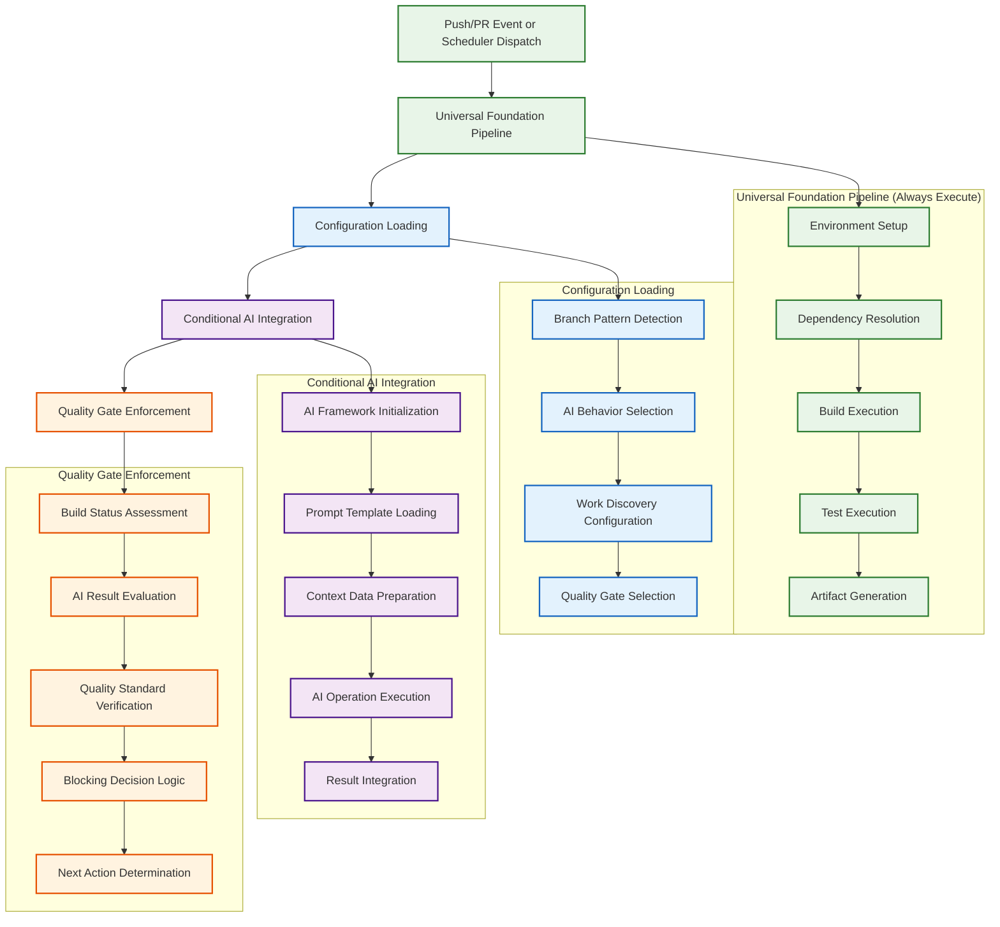

# Epic #181: Universal Build Workflow Specification

**Last Updated:** 2025-09-23
**Version:** 1.0
**Epic Context:** AI-Powered CI/CD Orchestration Framework
**Status:** Specification Complete - Implementation Ready

> **Parent:** [`Epic #181 AI Orchestration Framework`](./09-ai-orchestration-framework.md)

## 1. Purpose & Responsibility

* **What it is:** Universal build pipeline that provides consistent foundation execution for all branches while dynamically integrating appropriate AI behaviors based on branch patterns, enabling seamless scaling from simple feature development to complex autonomous epic workstreams.
* **Key Objectives:**
  - **Universal Foundation Execution** - Consistent environment setup, dependency resolution, and build validation for every branch
  - **Non-Blocking Philosophy for AI Missions** - AI agents can work on broken builds for diagnostic and fix operations
  - **Dynamic AI Integration** - Automatic AI behavior selection based on branch patterns without manual configuration
  - **Conditional Quality Enforcement** - Blocking vs non-blocking behavior based on operation type (review vs fix)
  - **Performance Optimization** - Sub-5-minute execution for non-AI operations with intelligent resource management
  - **Cost-Controlled AI Operations** - Intelligent AI deployment with usage monitoring and automatic optimization
* **Success Criteria:**
  - **Universal Branch Support** - All branches receive appropriate build foundation and AI integration automatically
  - **Performance Consistency** - Non-AI operations complete within 5 minutes regardless of branch type
  - **Intelligent Blocking Logic** - AI reviews block on build failures while AI missions proceed to fix issues
  - **Resource Optimization** - AI operations deployed cost-effectively with real-time monitoring
  - **Zero Configuration Experience** - Developers get appropriate behavior without any setup requirements
* **Why it exists:** To provide a unified CI/CD foundation that eliminates pipeline duplication while enabling sophisticated AI integration appropriate to each development scenario, from simple feature branches to complex autonomous epic workstreams.

> **Framework Role:** Universal Build Workflow serves as the execution engine for the AI Configuration Registry decisions, translating branch patterns into concrete build and AI behaviors.

### Universal Pipeline Philosophy

The Universal Build Workflow embodies intelligent automation principles:

```yaml
Pipeline_Philosophy:
  Foundation_First: "Always execute core build operations for consistency and reliability"
  Intelligence_Layered: "AI integration added dynamically based on configuration decisions"
  Mission_Aware: "Different blocking behavior for AI review vs AI fix operations"
  Performance_Focused: "Core operations optimized for speed with AI operations additive"

Strategic_Benefits:
  Developer_Experience: "Consistent build foundation with transparent AI enhancement"
  Resource_Efficiency: "AI operations only where valuable with automatic cost controls"
  Operational_Reliability: "Core build operations isolated from AI complexity"
  Infinite_Scalability: "Single pipeline supporting unlimited development scenarios"
```

### Execution Modes

* **Mission Mode (scheduled builders/fixers):** Executes on the default branch scheduler, checks out the target epic branch, and runs foundation steps with `continue-on-error` semantics. Failures are logged, attached to artifacts, and surfaced to the AI agent as diagnostic context while the job itself remains green so long as orchestration succeeds.
* **Review Mode (PR validation):** Runs on pull request triggers with the same foundation steps marked as required. Any build/test/dependency failure immediately fails the job, flips the PR back to draft, and short-circuits AI review. Only after a clean foundation run does the review AI execute.
* **Shared Infrastructure:** Both modes load configuration from the AI registry, but mission jobs bypass blocking quality gates until the review AI passes. Review jobs publish checklist status that becomes the merge gate.

## 2. Architecture & Key Concepts

* **High-Level Design:** Layered pipeline architecture with universal foundation operations followed by conditional AI integration based on branch pattern configuration, providing consistent base functionality with appropriate intelligence enhancement.

### Universal Build Workflow Architecture



### Foundation Pipeline Operations (Always Execute)

> **Failure Handling Legend:** `ai_mission_continue_review_block` means mission-mode jobs collect failure output but remain successful, whereas review-mode jobs fail fast and mark the PR as draft. `continue_with_warnings` keeps both modes non-blocking but records telemetry for the next review pass.

```yaml
# Core operations that execute for every branch regardless of AI configuration
foundation_pipeline:
  environment_setup:
    description: "Consistent environment preparation across all execution contexts"
    operations:
      - system_dependencies_installation
      - runtime_environment_configuration
      - security_context_establishment
      - workspace_initialization
    timeout_minutes: 3
    failure_handling: "terminate_pipeline"

  dependency_resolution:
    description: "Project dependency installation and validation"
    operations:
      - package_manager_cache_restore
      - dependency_installation
      - dependency_validation
      - cache_persistence
    timeout_minutes: 5
    failure_handling: "ai_mission_continue_review_block"

  build_execution:
    description: "Core build compilation and validation"
    operations:
      - source_compilation
      - asset_processing
      - build_artifact_generation
      - build_validation
    timeout_minutes: 8
    failure_handling: "ai_mission_continue_review_block"

  test_execution:
    description: "Test suite execution with result categorization"
    operations:
      - unit_test_execution
      - integration_test_execution
      - test_result_collection
      - coverage_analysis
    timeout_minutes: 10
    failure_handling: "ai_mission_continue_review_block"

  artifact_generation:
    description: "Build artifact preparation and metadata collection"
    operations:
      - deployment_package_creation
      - metadata_extraction
      - artifact_validation
      - storage_preparation
    timeout_minutes: 2
    failure_handling: "continue_with_warnings"
```

### Conditional AI Integration Logic

```yaml
# AI integration executed based on branch pattern configuration
ai_integration_logic:
  configuration_loading:
    description: "Load AI configuration based on branch pattern detection"
    steps:
      - branch_pattern_analysis
      - configuration_registry_lookup
      - ai_behavior_selection
      - cost_limit_validation
    timeout_minutes: 1

  ai_framework_initialization:
    description: "Initialize appropriate AI components based on configuration"
    conditional_behaviors:
      "5-sentinel-suite":
        components: ["debt", "standards", "testing", "security", "merge"]
        cost_category: "high"
        timeout_minutes: 30
      "4-sentinel-suite":
        components: ["debt", "standards", "testing", "merge"]
        cost_category: "medium_high"
        timeout_minutes: 25
      "iterative-autonomous":
        components: ["ai-generation", "iterative-review"]
        cost_category: "medium"
        timeout_minutes: 15
      "single-review":
        components: ["generic-review"]
        cost_category: "low"
        timeout_minutes: 10
      "no-ai":
        components: []
        cost_category: "none"
        timeout_minutes: 0

  context_preparation:
    description: "Prepare context data for AI operations"
    operations:
      - pr_metadata_extraction
      - change_analysis
      - historical_context_loading
      - work_discovery_execution
    conditional: "ai_behavior != 'no-ai'"

  ai_operation_execution:
    description: "Execute configured AI behavior with monitoring"
    monitoring:
      - resource_usage_tracking
      - cost_monitoring
      - performance_metrics
      - error_tracking
    safety_controls:
      - timeout_enforcement
      - cost_limit_monitoring
      - resource_exhaustion_protection
      - error_recovery_mechanisms
```

### Quality Gate Enforcement Matrix

```yaml
# Quality gate enforcement based on operation type and branch configuration
quality_enforcement:
  blocking_logic:
    ai_review_operations:
      description: "AI code review requires working build"
      build_failure_response: "block_execution"
      test_failure_response: "block_execution"
      dependency_failure_response: "block_execution"
      rationale: "Cannot review broken code effectively"
      remediation_action: "Flip PR to draft, attach failure artifacts, notify mission scheduler"

    ai_mission_operations:
      description: "AI fix missions can work on broken builds"
      build_failure_response: "continue_with_context"
      test_failure_response: "continue_with_context"
      dependency_failure_response: "continue_with_context"
      rationale: "AI needs to diagnose and fix broken builds"
      remediation_action: "Persist failure logs for AI prompt context"

  quality_standards:
    production:
      requirements:
        - "all_tests_pass"
        - "security_scan_clear"
        - "ai_review_approved"
        - "manual_approval_required"
      blocking: true
      escalation: "immediate"

    staging:
      requirements:
        - "core_tests_pass"
        - "ai_review_complete"
        - "basic_security_check"
      blocking: true
      escalation: "standard"

    epic:
      requirements:
        - "relevant_tests_pass"
        - "ai_iterative_complete"
        - "no_critical_issues"
      blocking: false
      auto_merge_enabled: true

    feature:
      requirements:
        - "build_successful"
        - "ai_review_complete"
      blocking: false
      escalation: "optional"

    basic:
      requirements:
        - "syntax_valid"
      blocking: false
      escalation: "none"
```

## 3. Interface Contract & Assumptions

* **Key Universal Pipeline Interfaces:**
  - **Foundation Pipeline Interface:**
    * **Purpose:** Provide consistent build foundation for all branches with reliable execution and artifact generation
    * **Dependencies:** GitHub Actions environment, build tools, test frameworks, artifact storage
    * **Outputs:** Build artifacts, test results, coverage reports, execution metadata
    * **Quality Gates:** Foundation operations must complete successfully for AI review operations

  - **Configuration Integration Interface:**
    * **Purpose:** Dynamically load and apply AI configuration based on branch pattern detection
    * **Dependencies:** AI Configuration Registry, branch metadata, repository state
    * **Outputs:** AI behavior configuration, execution parameters, cost controls
    * **Quality Gates:** Configuration validation, security boundary enforcement, resource allocation

  - **AI Integration Interface:**
    * **Purpose:** Execute appropriate AI behavior with monitoring and cost controls
    * **Dependencies:** AI framework components, prompt templates, context data, resource monitoring
    * **Outputs:** AI analysis results, quality assessments, improvement recommendations
    * **Quality Gates:** AI service validation, cost limit enforcement, safety control activation

  - **Quality Enforcement Interface:**
    * **Purpose:** Apply appropriate quality standards and blocking logic based on operation type
    * **Dependencies:** Quality assessment tools, approval workflows, escalation mechanisms
    * **Outputs:** Quality gate status, blocking decisions, escalation triggers
    * **Quality Gates:** Standards validation, enforcement capability confirmation, escalation readiness

* **Critical Assumptions:**
  - **Performance Assumptions:** Foundation pipeline operations complete within 5 minutes for developer productivity
  - **Resource Assumptions:** AI operations can be added without impacting foundation pipeline performance
  - **Configuration Assumptions:** Branch pattern detection accurately determines appropriate AI behavior
  - **Quality Assumptions:** Different blocking logic for review vs mission operations maintains workflow effectiveness

## 4. Local Conventions & Constraints (Beyond Global Standards)

* **Universal Pipeline Standards:**
  - Foundation operations must be isolated from AI complexity for reliability and performance
  - All AI operations must include cost monitoring and automatic resource optimization
  - Error handling must differentiate between review operations (block) and mission operations (continue)
  - Configuration loading must complete within 60 seconds for responsiveness
* **Technology Constraints:**
  - GitHub Actions as execution platform with variable resource allocation
  - Foundation operations must use proven tools and patterns for reliability
  - AI integration must support graceful degradation for service unavailability
* **Performance Constraints:**
  - Foundation pipeline execution within 5 minutes for developer productivity
  - AI operations additive with separate timeout and resource controls
  - Configuration loading optimized for minimal impact on execution time

## 5. How to Work With This Universal Pipeline

* **Implementation Approach:**
  - **Foundation Layer:** Implement reliable, fast foundation operations using proven tools and patterns
  - **Configuration Integration:** Develop dynamic configuration loading with validation and safety controls
  - **AI Layer:** Create conditional AI integration with monitoring and cost optimization
  - **Quality Integration:** Implement intelligent quality gate enforcement with operation-aware blocking logic
* **Quality Assurance:**
  - **Foundation Testing:** Validate foundation pipeline performance and reliability across all scenarios
  - **Configuration Testing:** Ensure configuration loading and AI behavior selection accuracy
  - **Integration Testing:** Validate end-to-end pipeline behavior across all supported branch patterns
* **Common Implementation Pitfalls:**
  - AI complexity can impact foundation pipeline performance if not properly isolated
  - Configuration loading must be optimized to prevent pipeline delays
  - Quality gate logic must clearly differentiate between review and mission operations

## 6. Dependencies

* **Foundation Dependencies:**
  - [`AI Configuration Registry`](./10-ai-configuration-registry.md) - Dynamic configuration loading and behavior selection
  - [`AI Orchestration Framework`](./09-ai-orchestration-framework.md) - Overall framework architecture
  - [`Issue #184 AI Framework`](./06-canonical-pattern-implementation.md) - AI component availability
  - [`Issue #183 Foundation Components`](./04-implementation-roadmap.md#issue-183) - Build foundation components

* **Implementation Dependencies:**
  - **Foundation Pipeline Engine** - Reliable, fast execution of core build operations
  - **Configuration Loader** - Dynamic branch pattern detection and AI behavior selection
  - **AI Integration Layer** - Conditional AI operation execution with monitoring
  - **Quality Gate Engine** - Intelligent quality enforcement with operation-aware blocking

* **External Dependencies:**
  - GitHub Actions platform for reliable execution environment
  - AI framework components for behavior implementation
  - Monitoring infrastructure for cost tracking and performance optimization

## 7. Rationale & Key Historical Context

* **Strategic Context:** Universal pipeline prioritized to eliminate duplication while enabling sophisticated AI integration appropriate to each development scenario.
* **Evolution from Multiple Pipelines:** Universal approach emerged from recognizing that different branches need different AI behaviors but consistent foundation execution.
* **Non-Blocking Philosophy:** Mission vs review differentiation enables AI to work on broken builds for diagnostic and fix operations.
* **Performance Focus:** Foundation operations optimized for speed with AI operations additive to maintain developer productivity.

### Universal Pipeline Benefits Across Development Scenarios

The Universal Build Workflow serves diverse organizational needs through intelligent behavior adaptation:

```yaml
Pipeline_Benefits:
  Foundation_Consistency: "Reliable build execution regardless of AI complexity"
  Performance_Optimization: "Fast core operations with additive AI intelligence"
  Resource_Efficiency: "AI operations only where valuable with cost controls"
  Developer_Experience: "Transparent AI integration without configuration burden"

Strategic_Impact:
  Operational_Efficiency: "Single pipeline supporting unlimited development scenarios"
  Cost_Optimization: "Intelligent AI deployment with usage monitoring"
  Quality_Assurance: "Appropriate quality enforcement for each development context"
  Innovation_Enablement: "Foundation for new autonomous development patterns"
```

## 8. Complete YAML Workflow Implementation

### 8.1 Universal Build Workflow Structure

```yaml
# .github/workflows/universal-build.yml
name: Universal Build Pipeline

on:
  push:
    branches: ['**']
  pull_request:
    branches: ['**']
  workflow_call:
    inputs:
      branch_pattern:
        required: true
        type: string
      operation_mode:
        required: true
        type: string  # 'mission', 'review', 'standard'
      ai_config_override:
        required: false
        type: string

permissions:
  contents: read
  actions: write
  pull-requests: write
  id-token: write

env:
  UNIVERSAL_BUILD_VERSION: "1.0"
  CONFIG_PATH: ".github/ai-orchestration-config.yml"

jobs:
  configuration-loading:
    name: AI Configuration Loading
    runs-on: ubuntu-latest
    timeout-minutes: 2
    outputs:
      ai_behavior: ${{ steps.config-resolution.outputs.ai_behavior }}
      quality_gates: ${{ steps.config-resolution.outputs.quality_gates }}
      cost_limits: ${{ steps.config-resolution.outputs.cost_limits }}
      work_discovery: ${{ steps.config-resolution.outputs.work_discovery }}
      ai_enabled: ${{ steps.config-resolution.outputs.ai_enabled }}

    steps:
      - name: Checkout configuration
        uses: actions/checkout@v4
        with:
          sparse-checkout: |
            .github/ai-orchestration-config.yml
            .github/scripts/config-loader.py
          sparse-checkout-cone-mode: false

      - name: Resolve AI configuration
        id: config-resolution
        run: |
          echo "🔧 Resolving AI configuration for branch pattern..."

          # Determine branch name
          BRANCH_NAME="${{ github.ref_name }}"
          if [[ -n "${{ inputs.branch_pattern }}" ]]; then
            BRANCH_NAME="${{ inputs.branch_pattern }}"
          fi

          echo "Analyzing branch: $BRANCH_NAME"

          # Load configuration
          if [[ -f ".github/scripts/config-loader.py" ]]; then
            CONFIG_JSON=$(python3 .github/scripts/config-loader.py resolve "$BRANCH_NAME")

            # Extract configuration values
            AI_BEHAVIOR=$(echo "$CONFIG_JSON" | jq -r '.ai_behavior // "none"')
            QUALITY_GATES=$(echo "$CONFIG_JSON" | jq -r '.quality_gates // "basic"')
            COST_LIMIT=$(echo "$CONFIG_JSON" | jq -r '.configuration.cost_limit // "low"')

            # Determine if AI is enabled for this branch
            if [[ "$AI_BEHAVIOR" != "none" && "$AI_BEHAVIOR" != "null" ]]; then
              AI_ENABLED="true"
            else
              AI_ENABLED="false"
            fi
          else
            echo "⚠️ Configuration loader not found, using defaults"
            AI_BEHAVIOR="generic-review"
            QUALITY_GATES="basic"
            COST_LIMIT="low"
            AI_ENABLED="true"
          fi

          echo "ai_behavior=$AI_BEHAVIOR" >> $GITHUB_OUTPUT
          echo "quality_gates=$QUALITY_GATES" >> $GITHUB_OUTPUT
          echo "cost_limits=$COST_LIMIT" >> $GITHUB_OUTPUT
          echo "ai_enabled=$AI_ENABLED" >> $GITHUB_OUTPUT

          echo "✅ Configuration resolved: $AI_BEHAVIOR (AI: $AI_ENABLED)"

  foundation-execution:
    name: Foundation Pipeline
    needs: [configuration-loading]
    runs-on: ubuntu-latest
    timeout-minutes: 25
    outputs:
      foundation_success: ${{ steps.foundation-summary.outputs.success }}
      build_artifacts: ${{ steps.foundation-summary.outputs.artifacts }}
      has_backend_changes: ${{ steps.path-analysis.outputs.has_backend_changes }}
      has_frontend_changes: ${{ steps.path-analysis.outputs.has_frontend_changes }}
      change_summary: ${{ steps.path-analysis.outputs.change_summary }}

    steps:
      - name: Checkout repository
        uses: actions/checkout@v4
        with:
          fetch-depth: 0

      - name: Foundation - Setup Environment
        id: environment-setup
        uses: ./.github/actions/shared/setup-environment
        with:
          dotnet_version: '8.0'
          node_version: '20'

      - name: Foundation - Path Analysis
        id: path-analysis
        uses: ./.github/actions/shared/path-analysis
        with:
          base_ref: ${{ github.event.pull_request.base.sha || github.event.before }}

      - name: Foundation - Backend Build
        id: backend-build
        if: steps.path-analysis.outputs.has_backend_changes == 'true'
        uses: ./.github/actions/shared/backend-build
        with:
          solution_path: 'zarichney-api.sln'
          coverage_enabled: true
          configuration: 'Release'
          continue_on_error: ${{ inputs.operation_mode == 'mission' }}

      - name: Foundation - Frontend Build
        id: frontend-build
        if: steps.path-analysis.outputs.has_frontend_changes == 'true'
        uses: ./.github/actions/shared/frontend-build
        with:
          project_path: 'Code/Zarichney.Website'
          build_configuration: 'production'
          continue_on_error: ${{ inputs.operation_mode == 'mission' }}

      - name: Foundation Summary
        id: foundation-summary
        run: |
          BACKEND_SUCCESS="${{ steps.backend-build.outputs.build_success || 'true' }}"
          FRONTEND_SUCCESS="${{ steps.frontend-build.outputs.build_success || 'true' }}"

          if [[ "$BACKEND_SUCCESS" == "true" && "$FRONTEND_SUCCESS" == "true" ]]; then
            FOUNDATION_SUCCESS="true"
          else
            FOUNDATION_SUCCESS="false"
          fi

          echo "success=$FOUNDATION_SUCCESS" >> $GITHUB_OUTPUT
          echo "artifacts=foundation-artifacts" >> $GITHUB_OUTPUT
          echo "📊 Foundation execution complete: $FOUNDATION_SUCCESS"

  conditional-ai-integration:
    name: AI Integration Layer
    needs: [configuration-loading, foundation-execution]
    if: |
      always() && !cancelled() &&
      needs.configuration-loading.outputs.ai_enabled == 'true' &&
      (inputs.operation_mode != 'mission' || needs.foundation-execution.outputs.foundation_success == 'true')
    runs-on: ubuntu-latest
    timeout-minutes: 30

    steps:
      - name: Checkout repository
        uses: actions/checkout@v4

      - name: Initialize AI components
        run: |
          AI_BEHAVIOR="${{ needs.configuration-loading.outputs.ai_behavior }}"
          OPERATION_MODE="${{ inputs.operation_mode }}"

          echo "🤖 Initializing AI integration: $AI_BEHAVIOR (Mode: $OPERATION_MODE)"

          # AI component initialization based on configuration
          case "$AI_BEHAVIOR" in
            "5-sentinel-suite")
              echo "✅ Initializing full 5-sentinel suite"
              echo "ai_components=5-sentinel-suite" >> $GITHUB_ENV
              ;;
            "4-sentinel-suite")
              echo "✅ Initializing 4-sentinel suite (no security)"
              echo "ai_components=4-sentinel-suite" >> $GITHUB_ENV
              ;;
            "iterative-autonomous")
              echo "✅ Initializing iterative autonomous AI agent"
              echo "ai_components=iterative-autonomous" >> $GITHUB_ENV
              ;;
            "single-review")
              echo "✅ Initializing single review agent"
              echo "ai_components=single-review" >> $GITHUB_ENV
              ;;
            "expedited-review")
              echo "✅ Initializing expedited review for hotfix"
              echo "ai_components=expedited-review" >> $GITHUB_ENV
              ;;
            *)
              echo "❌ Unknown AI behavior: $AI_BEHAVIOR"
              exit 1
              ;;
          esac

      - name: Execute AI workflow dispatch
        run: |
          AI_COMPONENTS="${{ env.ai_components }}"
          OPERATION_MODE="${{ inputs.operation_mode }}"

          echo "🚀 Dispatching AI workflow: $AI_COMPONENTS"

          # Determine appropriate AI workflow based on components and mode
          case "$AI_COMPONENTS" in
            "5-sentinel-suite"|"4-sentinel-suite")
              if [[ "$OPERATION_MODE" == "review" ]]; then
                WORKFLOW="ai-sentinel-review.yml"
              else
                WORKFLOW="ai-sentinel-analysis.yml"
              fi
              ;;
            "iterative-autonomous")
              WORKFLOW="ai-iterative-review.yml"
              ;;
            "single-review"|"expedited-review")
              WORKFLOW="ai-simple-review.yml"
              ;;
          esac

          gh workflow run "$WORKFLOW" \
            --field "trigger_context=universal-build" \
            --field "foundation_status=${{ needs.foundation-execution.outputs.foundation_success }}" \
            --field "change_summary=${{ needs.foundation-execution.outputs.change_summary }}" \
            --field "quality_gates=${{ needs.configuration-loading.outputs.quality_gates }}"

          echo "✅ AI workflow dispatched: $WORKFLOW"
        env:
          GH_TOKEN: ${{ secrets.GITHUB_TOKEN }}

  operation-aware-blocking:
    name: Operation-Aware Quality Gates
    needs: [configuration-loading, foundation-execution, conditional-ai-integration]
    if: always() && !cancelled()
    runs-on: ubuntu-latest
    timeout-minutes: 5

    steps:
      - name: Evaluate operation-specific quality gates
        run: |
          OPERATION_MODE="${{ inputs.operation_mode }}"
          FOUNDATION_SUCCESS="${{ needs.foundation-execution.outputs.foundation_success }}"
          AI_ENABLED="${{ needs.configuration-loading.outputs.ai_enabled }}"
          QUALITY_GATES="${{ needs.configuration-loading.outputs.quality_gates }}"

          echo "📊 Operation-Aware Quality Gate Evaluation"
          echo "Operation Mode: $OPERATION_MODE"
          echo "Foundation Success: $FOUNDATION_SUCCESS"
          echo "AI Enabled: $AI_ENABLED"
          echo "Quality Gates: $QUALITY_GATES"

          # Determine blocking behavior based on operation mode
          case "$OPERATION_MODE" in
            "standard")
              # Standard pushes - require foundation success
              if [[ "$FOUNDATION_SUCCESS" == "true" ]]; then
                echo "✅ Standard build quality gates: PASSED"
                exit 0
              else
                echo "❌ Standard build quality gates: FAILED"
                exit 1
              fi
              ;;
            "review")
              # PR review mode - strict blocking
              if [[ "$FOUNDATION_SUCCESS" == "true" ]]; then
                echo "✅ Review quality gates: PASSED"
                exit 0
              else
                echo "❌ Review quality gates: FAILED - blocking PR"
                exit 1
              fi
              ;;
            "mission")
              # AI mission mode - non-blocking for scheduled operations
              echo "✅ Mission quality gates: NON-BLOCKING (context collection mode)"
              exit 0
              ;;
            *)
              echo "⚠️ Unknown operation mode: $OPERATION_MODE"
              exit 0
              ;;
          esac
```

## 9. Mission vs Review Execution Patterns

### 9.1 Operation Mode Differences

#### **Mission Mode (AI Fix Operations)**
```yaml
mission_mode_characteristics:
  triggering:
    scheduler: "Scheduled execution every 6 hours"
    manual: "Workflow dispatch for immediate AI fixes"
    context: "Target branch checkout for autonomous operations"

  failure_handling:
    foundation_failures: "continue_with_context"
    build_errors: "captured_for_ai_diagnosis"
    test_failures: "included_in_ai_context"
    blocking_behavior: "non-blocking"

  ai_integration:
    initialization: "Always execute if configured"
    error_context: "Rich diagnostic information provided"
    artifact_storage: "Mission state persistence"
    success_metrics: "AI progress tracking"
```

#### **Review Mode (PR Validation)**
```yaml
review_mode_characteristics:
  triggering:
    pull_request: "PR creation and updates"
    manual: "Re-run checks via UI"
    context: "PR diff analysis and validation"

  failure_handling:
    foundation_failures: "block_execution"
    build_errors: "immediate_failure"
    test_failures: "immediate_failure"
    blocking_behavior: "strict_blocking"

  ai_integration:
    initialization: "Only after foundation success"
    prerequisite: "Clean build required"
    pr_management: "Draft conversion on failures"
    success_metrics: "Review completion status"
```

### 9.2 Continue-on-Error Semantics

```yaml
# Mission mode - continue on error configuration
- name: Foundation - Backend Build
  uses: ./.github/actions/shared/backend-build
  with:
    continue_on_error: ${{ inputs.operation_mode == 'mission' }}
    capture_failures: true
    failure_artifact_name: "build-failures-${{ github.run_number }}"

# Review mode - strict failure handling
- name: Foundation - Backend Build
  uses: ./.github/actions/shared/backend-build
  with:
    continue_on_error: false
    fail_fast: true
    pr_draft_on_failure: true
```

### 9.3 PR State Management Logic

```yaml
- name: PR State Management
  if: github.event_name == 'pull_request' && failure()
  uses: actions/github-script@v7
  with:
    script: |
      const operationMode = '${{ inputs.operation_mode }}';

      if (operationMode === 'review') {
        // Convert PR to draft on review failures
        await github.rest.pulls.update({
          owner: context.repo.owner,
          repo: context.repo.repo,
          pull_number: context.issue.number,
          draft: true
        });

        // Add failure context comment
        await github.rest.issues.createComment({
          owner: context.repo.owner,
          repo: context.repo.repo,
          issue_number: context.issue.number,
          body: `🔴 **Foundation Build Failure**

          The build has failed basic quality checks. This PR has been converted to draft status.

          **Next Steps:**
          1. Review the build logs above
          2. Fix the failing tests/build issues
          3. Mark the PR as ready for review when fixed

          The AI review will automatically re-run once the foundation build passes.`
        });
      }
```

## 10. AI Integration Layer Implementation

### 10.1 Dynamic AI Configuration Loading

```yaml
ai_configuration_registry:
  branch_patterns:
    "main":
      ai_behavior: "5-sentinel-suite"
      quality_gates: "production"
      cost_limit: "high"
      work_discovery: "comprehensive"

    "develop":
      ai_behavior: "4-sentinel-suite"
      quality_gates: "staging"
      cost_limit: "medium_high"
      work_discovery: "standard"

    "epic/*":
      ai_behavior: "iterative-autonomous"
      quality_gates: "epic"
      cost_limit: "medium"
      work_discovery: "epic_focused"

    "feature/*":
      ai_behavior: "single-review"
      quality_gates: "feature"
      cost_limit: "low"
      work_discovery: "change_focused"

    "hotfix/*":
      ai_behavior: "expedited-review"
      quality_gates: "critical"
      cost_limit: "low"
      work_discovery: "minimal"
```

### 10.2 Conditional AI Behavior Execution

```python
# .github/scripts/config-loader.py
import yaml
import json
import re
import sys
from typing import Dict, Any, Optional

class AIConfigurationLoader:
    def __init__(self, config_path: str = ".github/ai-orchestration-config.yml"):
        self.config_path = config_path
        self.config = self._load_configuration()

    def _load_configuration(self) -> Dict[str, Any]:
        """Load AI orchestration configuration from YAML"""
        try:
            with open(self.config_path, 'r') as f:
                return yaml.safe_load(f)
        except FileNotFoundError:
            print(f"❌ Configuration file not found: {self.config_path}")
            return self._default_configuration()

    def resolve_branch_configuration(self, branch_name: str) -> Dict[str, Any]:
        """Resolve AI configuration for specific branch"""
        patterns = self.config.get('ai_orchestration', {}).get('branch_patterns', {})

        # Direct match first
        if branch_name in patterns:
            return patterns[branch_name]

        # Pattern matching
        for pattern, config in patterns.items():
            if self._match_pattern(pattern, branch_name):
                return config

        # Default fallback
        return patterns.get('default', self._default_branch_config())

    def _match_pattern(self, pattern: str, branch_name: str) -> bool:
        """Match branch name against pattern"""
        # Convert glob pattern to regex
        regex_pattern = pattern.replace('*', '.*').replace('?', '.')
        return bool(re.match(f"^{regex_pattern}$", branch_name))

    def _default_configuration(self) -> Dict[str, Any]:
        """Return default configuration"""
        return {
            'ai_orchestration': {
                'branch_patterns': {
                    'default': self._default_branch_config()
                }
            }
        }

    def _default_branch_config(self) -> Dict[str, Any]:
        """Return default branch configuration"""
        return {
            'ai_behavior': 'generic-review',
            'quality_gates': 'basic',
            'configuration': {
                'cost_limit': 'low',
                'timeout_minutes': 10
            }
        }

if __name__ == "__main__":
    if len(sys.argv) != 3 or sys.argv[1] != "resolve":
        print("Usage: python config-loader.py resolve <branch_name>")
        sys.exit(1)

    branch_name = sys.argv[2]
    loader = AIConfigurationLoader()
    config = loader.resolve_branch_configuration(branch_name)

    print(json.dumps(config, indent=2))
```

### 10.3 AI Service Integration with Error Handling

```yaml
- name: Execute AI Service Integration
  id: ai-service-execution
  run: |
    AI_BEHAVIOR="${{ needs.configuration-loading.outputs.ai_behavior }}"
    COST_LIMIT="${{ needs.configuration-loading.outputs.cost_limits }}"

    echo "🚀 Executing AI service integration..."
    echo "AI Behavior: $AI_BEHAVIOR"
    echo "Cost Limit: $COST_LIMIT"

    # Set service-specific environment variables
    export AI_SERVICE_TIMEOUT="1800"  # 30 minutes
    export AI_COST_LIMIT="$COST_LIMIT"
    export AI_RETRY_ATTEMPTS="3"

    # Execute with comprehensive error handling
    python3 << 'EOF'
    import os
    import json
    import time
    import subprocess
    from typing import Dict, Any, Optional

    class AIServiceExecutor:
        def __init__(self):
            self.ai_behavior = os.environ.get('AI_BEHAVIOR')
            self.cost_limit = os.environ.get('COST_LIMIT', 'low')
            self.timeout = int(os.environ.get('AI_SERVICE_TIMEOUT', '1800'))
            self.retry_attempts = int(os.environ.get('AI_RETRY_ATTEMPTS', '3'))

        def execute_ai_workflow(self) -> Dict[str, Any]:
            """Execute AI workflow with monitoring and error handling"""

            for attempt in range(1, self.retry_attempts + 1):
                try:
                    print(f"🔄 AI execution attempt {attempt}/{self.retry_attempts}")

                    result = self._dispatch_ai_workflow()

                    if result['success']:
                        print("✅ AI workflow completed successfully")
                        return result
                    else:
                        print(f"⚠️ AI workflow failed on attempt {attempt}")
                        if attempt < self.retry_attempts:
                            time.sleep(30 * attempt)  # Exponential backoff

                except Exception as e:
                    print(f"❌ AI execution error on attempt {attempt}: {e}")
                    if attempt < self.retry_attempts:
                        time.sleep(60 * attempt)

            return {'success': False, 'error': 'Max retry attempts exceeded'}

        def _dispatch_ai_workflow(self) -> Dict[str, Any]:
            """Dispatch appropriate AI workflow"""
            workflow_map = {
                '5-sentinel-suite': 'ai-sentinel-comprehensive.yml',
                '4-sentinel-suite': 'ai-sentinel-standard.yml',
                'iterative-autonomous': 'ai-iterative-autonomous.yml',
                'single-review': 'ai-simple-review.yml',
                'expedited-review': 'ai-expedited-review.yml'
            }

            workflow_file = workflow_map.get(self.ai_behavior)
            if not workflow_file:
                raise ValueError(f"Unknown AI behavior: {self.ai_behavior}")

            # Dispatch workflow
            cmd = [
                'gh', 'workflow', 'run', workflow_file,
                '--field', f'cost_limit={self.cost_limit}',
                '--field', f'timeout_minutes={self.timeout // 60}',
                '--field', f'foundation_context=${{ needs.foundation-execution.outputs.change_summary }}'
            ]

            result = subprocess.run(cmd, capture_output=True, text=True, timeout=self.timeout)

            return {
                'success': result.returncode == 0,
                'workflow': workflow_file,
                'output': result.stdout,
                'error': result.stderr if result.returncode != 0 else None
            }

    # Execute AI service
    executor = AIServiceExecutor()
    result = executor.execute_ai_workflow()

    # Output results for GitHub Actions
    print(f"::set-output name=ai_success::{str(result['success']).lower()}")
    print(f"::set-output name=ai_workflow::{result.get('workflow', 'none')}")

    if not result['success']:
        print(f"::error::AI workflow execution failed: {result.get('error', 'Unknown error')}")
        exit(1)
    EOF
  env:
    GH_TOKEN: ${{ secrets.GITHUB_TOKEN }}
    AI_BEHAVIOR: ${{ needs.configuration-loading.outputs.ai_behavior }}
    COST_LIMIT: ${{ needs.configuration-loading.outputs.cost_limits }}
```

### 10.4 Artifact Management and Cross-Workflow State Transfer

```yaml
- name: Store AI execution artifacts
  if: always()
  uses: actions/upload-artifact@v4
  with:
    name: ai-execution-state-${{ github.run_number }}
    path: |
      ai_execution_logs/
      ai_context_data/
      mission_state.json
      error_diagnostics/
    retention-days: 30

- name: Cross-workflow state transfer
  run: |
    # Prepare state transfer data
    STATE_DATA=$(cat << 'EOF'
    {
      "workflow_run_id": "${{ github.run_id }}",
      "foundation_status": "${{ needs.foundation-execution.outputs.foundation_success }}",
      "ai_behavior": "${{ needs.configuration-loading.outputs.ai_behavior }}",
      "operation_mode": "${{ inputs.operation_mode }}",
      "change_summary": ${{ needs.foundation-execution.outputs.change_summary }},
      "artifacts": {
        "foundation": "${{ needs.foundation-execution.outputs.build_artifacts }}",
        "ai_execution": "ai-execution-state-${{ github.run_number }}"
      },
      "timestamp": "$(date -u +%Y-%m-%dT%H:%M:%SZ)"
    }
    EOF
    )

    # Store in repository variable for cross-workflow access
    echo "$STATE_DATA" | gh variable set "WORKFLOW_STATE_${{ github.run_number }}" --body -

    echo "✅ Workflow state stored for cross-workflow access"
  env:
    GH_TOKEN: ${{ secrets.GITHUB_TOKEN }}
```

## 11. Quality Gate Implementation

### 11.1 Branch-Appropriate Quality Standards

```yaml
quality_gate_configurations:
  production:
    required_checks:
      - foundation_build_success
      - all_tests_pass
      - security_scan_clear
      - ai_review_approved
      - manual_approval_required
    coverage_thresholds:
      backend: 90
      frontend: 80
    performance_requirements:
      build_time: 300  # 5 minutes
      test_time: 600   # 10 minutes
    blocking: true
    escalation: "immediate"

  staging:
    required_checks:
      - foundation_build_success
      - core_tests_pass
      - ai_review_complete
      - basic_security_check
    coverage_thresholds:
      backend: 80
      frontend: 70
    performance_requirements:
      build_time: 420  # 7 minutes
      test_time: 900   # 15 minutes
    blocking: true
    escalation: "standard"

  epic:
    required_checks:
      - foundation_build_success
      - relevant_tests_pass
      - ai_iterative_complete
      - no_critical_issues
    coverage_thresholds:
      backend: 70
      frontend: 60
    performance_requirements:
      build_time: 600  # 10 minutes
      test_time: 1200  # 20 minutes
    blocking: false
    auto_merge_enabled: true
    escalation: "optional"

  feature:
    required_checks:
      - foundation_build_success
      - ai_review_complete
    coverage_thresholds:
      backend: 60
      frontend: 50
    performance_requirements:
      build_time: 600  # 10 minutes
      test_time: 1200  # 20 minutes
    blocking: false
    escalation: "optional"

  basic:
    required_checks:
      - syntax_valid
      - compilation_successful
    coverage_thresholds:
      backend: 0
      frontend: 0
    performance_requirements:
      build_time: 300  # 5 minutes
      test_time: 300   # 5 minutes
    blocking: false
    escalation: "none"
```

### 11.2 Progressive Quality Level Implementation

```yaml
- name: Progressive Quality Gate Evaluation
  id: quality-evaluation
  run: |
    QUALITY_LEVEL="${{ needs.configuration-loading.outputs.quality_gates }}"
    FOUNDATION_SUCCESS="${{ needs.foundation-execution.outputs.foundation_success }}"
    BACKEND_COVERAGE="${{ needs.foundation-execution.outputs.backend_coverage || '0' }}"
    FRONTEND_COVERAGE="${{ needs.foundation-execution.outputs.frontend_coverage || '0' }}"

    echo "📊 Progressive Quality Gate Evaluation"
    echo "Quality Level: $QUALITY_LEVEL"
    echo "Foundation Success: $FOUNDATION_SUCCESS"
    echo "Backend Coverage: $BACKEND_COVERAGE%"
    echo "Frontend Coverage: $FRONTEND_COVERAGE%"

    # Load quality requirements
    python3 << 'EOF'
    import json
    import os
    import sys

    quality_configs = {
        "production": {
            "required_checks": ["foundation_build_success", "all_tests_pass", "security_scan_clear"],
            "coverage_thresholds": {"backend": 90, "frontend": 80},
            "blocking": True
        },
        "staging": {
            "required_checks": ["foundation_build_success", "core_tests_pass"],
            "coverage_thresholds": {"backend": 80, "frontend": 70},
            "blocking": True
        },
        "epic": {
            "required_checks": ["foundation_build_success", "relevant_tests_pass"],
            "coverage_thresholds": {"backend": 70, "frontend": 60},
            "blocking": False
        },
        "feature": {
            "required_checks": ["foundation_build_success"],
            "coverage_thresholds": {"backend": 60, "frontend": 50},
            "blocking": False
        },
        "basic": {
            "required_checks": ["syntax_valid"],
            "coverage_thresholds": {"backend": 0, "frontend": 0},
            "blocking": False
        }
    }

    quality_level = os.environ.get('QUALITY_LEVEL', 'basic')
    foundation_success = os.environ.get('FOUNDATION_SUCCESS', 'false').lower() == 'true'
    backend_coverage = int(os.environ.get('BACKEND_COVERAGE', '0'))
    frontend_coverage = int(os.environ.get('FRONTEND_COVERAGE', '0'))

    config = quality_configs.get(quality_level, quality_configs['basic'])

    # Evaluate quality gates
    quality_passed = True
    failing_checks = []

    # Check foundation build requirement
    if "foundation_build_success" in config["required_checks"]:
        if not foundation_success:
            quality_passed = False
            failing_checks.append("foundation_build_failed")

    # Check coverage requirements
    backend_threshold = config["coverage_thresholds"]["backend"]
    frontend_threshold = config["coverage_thresholds"]["frontend"]

    if backend_coverage < backend_threshold:
        quality_passed = False
        failing_checks.append(f"backend_coverage_insufficient ({backend_coverage}% < {backend_threshold}%)")

    if frontend_coverage < frontend_threshold:
        quality_passed = False
        failing_checks.append(f"frontend_coverage_insufficient ({frontend_coverage}% < {frontend_threshold}%)")

    # Output results
    print(f"Quality Gate Status: {'PASSED' if quality_passed else 'FAILED'}")
    if failing_checks:
        print(f"Failing Checks: {', '.join(failing_checks)}")

    # Set GitHub outputs
    print(f"::set-output name=quality_passed::{str(quality_passed).lower()}")
    print(f"::set-output name=blocking::{str(config['blocking']).lower()}")
    print(f"::set-output name=failing_checks::{','.join(failing_checks)}")

    # Exit with appropriate code based on blocking configuration
    if not quality_passed and config["blocking"]:
        print("❌ Quality gates failed and blocking is enabled")
        sys.exit(1)
    elif not quality_passed:
        print("⚠️ Quality gates failed but non-blocking")
        sys.exit(0)
    else:
        print("✅ All quality gates passed")
        sys.exit(0)
    EOF
  env:
    QUALITY_LEVEL: ${{ needs.configuration-loading.outputs.quality_gates }}
    FOUNDATION_SUCCESS: ${{ needs.foundation-execution.outputs.foundation_success }}
    BACKEND_COVERAGE: ${{ needs.foundation-execution.outputs.backend_coverage || '0' }}
    FRONTEND_COVERAGE: ${{ needs.foundation-execution.outputs.frontend_coverage || '0' }}
```

### 11.3 Manual Override Mechanisms

```yaml
- name: Manual Quality Override
  if: |
    failure() &&
    contains(github.event.head_commit.message, '[override-quality]') ||
    contains(github.event.pull_request.body, '[override-quality]')
  run: |
    echo "🔓 Manual quality gate override detected"
    echo "⚠️ This override bypasses standard quality requirements"

    # Log override usage for audit
    gh api repos/${{ github.repository }}/issues \
      --method POST \
      --field title="Quality Gate Override Used" \
      --field body="Quality gate override was used in commit ${{ github.sha }}

    **Override Context:**
    - Workflow: ${{ github.workflow }}
    - Run ID: ${{ github.run_id }}
    - Actor: ${{ github.actor }}
    - Reason: Manual override requested

    **Review Required:**
    This override should be reviewed for compliance and necessity.
    " \
      --field labels='["audit","quality-override"]'

    echo "✅ Quality gate override applied"
    exit 0
  env:
    GH_TOKEN: ${{ secrets.GITHUB_TOKEN }}
```

## 12. Foundation Components Integration

### 12.1 Shared Actions Usage from Issues #183, #212, #184

```yaml
foundation_components_integration:
  shared_actions:
    setup_environment:
      location: "./.github/actions/shared/setup-environment"
      source: "Issue #183 - Foundation Components"
      purpose: "Consistent environment setup across all workflows"
      outputs: ["dotnet_version", "node_version", "environment_ready"]

    path_analysis:
      location: "./.github/actions/shared/path-analysis"
      source: "Issue #212 - Path Analysis Enhancement"
      purpose: "Intelligent change detection and impact analysis"
      outputs: ["has_backend_changes", "has_frontend_changes", "change_summary", "total_files_changed"]

    backend_build:
      location: "./.github/actions/shared/backend-build"
      source: "Issue #183 - Foundation Components"
      purpose: "Standardized .NET build with coverage analysis"
      outputs: ["build_success", "test_results", "coverage_report"]

    frontend_build:
      location: "./.github/actions/shared/frontend-build"
      source: "Issue #183 - Foundation Components"
      purpose: "Standardized Angular build with optimization"
      outputs: ["build_success", "bundle_analysis", "performance_metrics"]

    ai_framework_base:
      location: "./.github/actions/shared/ai-framework-base"
      source: "Issue #184 - AI Framework Integration"
      purpose: "Base AI service integration and monitoring"
      outputs: ["ai_ready", "cost_tracking", "service_status"]
```

### 12.2 Backend/Frontend Build Coordination

```yaml
- name: Coordinated Foundation Build
  id: coordinated-build
  run: |
    BACKEND_CHANGES="${{ steps.path-analysis.outputs.has_backend_changes }}"
    FRONTEND_CHANGES="${{ steps.path-analysis.outputs.has_frontend_changes }}"
    TOTAL_CHANGES="${{ steps.path-analysis.outputs.total_files_changed }}"

    echo "🔧 Coordinating foundation build based on change analysis"
    echo "Backend Changes: $BACKEND_CHANGES"
    echo "Frontend Changes: $FRONTEND_CHANGES"
    echo "Total Changed Files: $TOTAL_CHANGES"

    # Determine build strategy
    if [[ "$BACKEND_CHANGES" == "true" && "$FRONTEND_CHANGES" == "true" ]]; then
      BUILD_STRATEGY="full"
      echo "📦 Full-stack build required"
    elif [[ "$BACKEND_CHANGES" == "true" ]]; then
      BUILD_STRATEGY="backend-only"
      echo "🔧 Backend-only build required"
    elif [[ "$FRONTEND_CHANGES" == "true" ]]; then
      BUILD_STRATEGY="frontend-only"
      echo "🎨 Frontend-only build required"
    else
      BUILD_STRATEGY="minimal"
      echo "📄 Documentation-only changes detected"
    fi

    echo "build_strategy=$BUILD_STRATEGY" >> $GITHUB_OUTPUT

    # Set parallel execution flags
    case "$BUILD_STRATEGY" in
      "full")
        echo "backend_build_enabled=true" >> $GITHUB_OUTPUT
        echo "frontend_build_enabled=true" >> $GITHUB_OUTPUT
        echo "parallel_execution=true" >> $GITHUB_OUTPUT
        ;;
      "backend-only")
        echo "backend_build_enabled=true" >> $GITHUB_OUTPUT
        echo "frontend_build_enabled=false" >> $GITHUB_OUTPUT
        echo "parallel_execution=false" >> $GITHUB_OUTPUT
        ;;
      "frontend-only")
        echo "backend_build_enabled=false" >> $GITHUB_OUTPUT
        echo "frontend_build_enabled=true" >> $GITHUB_OUTPUT
        echo "parallel_execution=false" >> $GITHUB_OUTPUT
        ;;
      "minimal")
        echo "backend_build_enabled=false" >> $GITHUB_OUTPUT
        echo "frontend_build_enabled=false" >> $GITHUB_OUTPUT
        echo "parallel_execution=false" >> $GITHUB_OUTPUT
        ;;
    esac

- name: Parallel Backend Build
  if: steps.coordinated-build.outputs.backend_build_enabled == 'true'
  uses: ./.github/actions/shared/backend-build
  with:
    solution_path: 'zarichney-api.sln'
    configuration: 'Release'
    coverage_enabled: true
    parallel_test_execution: true
    continue_on_error: ${{ inputs.operation_mode == 'mission' }}

- name: Parallel Frontend Build
  if: steps.coordinated-build.outputs.frontend_build_enabled == 'true'
  uses: ./.github/actions/shared/frontend-build
  with:
    project_path: 'Code/Zarichney.Website'
    build_configuration: 'production'
    optimization_enabled: true
    continue_on_error: ${{ inputs.operation_mode == 'mission' }}
```

### 12.3 Concurrency Configuration and Resource Management

```yaml
concurrency_management:
  universal_build:
    # Prevent multiple universal builds on same branch
    group: "universal-build-${{ github.ref }}"
    cancel-in-progress: false  # Complete existing builds

  ai_integration:
    # Limit AI operations per repository
    group: "ai-operations-${{ github.repository }}"
    cancel-in-progress: true   # Cancel older AI operations
    max_concurrent: 3

  resource_allocation:
    foundation_jobs:
      timeout_minutes: 25
      runner_type: "ubuntu-latest"
      memory_limit: "7GB"

    ai_integration_jobs:
      timeout_minutes: 30
      runner_type: "ubuntu-latest"
      memory_limit: "7GB"

    configuration_jobs:
      timeout_minutes: 2
      runner_type: "ubuntu-latest"
      memory_limit: "3.5GB"

# Concurrency implementation in workflow
concurrency:
  group: universal-build-${{ github.ref }}-${{ inputs.operation_mode || 'standard' }}
  cancel-in-progress: ${{ inputs.operation_mode == 'mission' }}

jobs:
  foundation-execution:
    runs-on: ubuntu-latest
    timeout-minutes: 25
    env:
      # Resource optimization
      DOTNET_CLI_TELEMETRY_OPTOUT: 1
      DOTNET_SKIP_FIRST_TIME_EXPERIENCE: 1
      NUGET_PACKAGES: ${{ github.workspace }}/.nuget/packages
```

## 13. Workflow Orchestration Patterns

### 13.1 Scheduler Integration for Mission Dispatch

```yaml
# AI Mission Scheduler Integration
- name: Schedule AI Mission Dispatch
  if: |
    github.event_name == 'schedule' ||
    (github.event_name == 'workflow_dispatch' && inputs.operation_mode == 'mission')
  run: |
    echo "🕐 Scheduler-triggered AI mission dispatch"

    # Load mission configuration
    MISSION_CONFIG=$(cat << 'EOF'
    {
      "mission_types": [
        {
          "name": "coverage-improvement",
          "target_branches": ["epic/testing-coverage"],
          "ai_behavior": "iterative-autonomous",
          "schedule": "0 */6 * * *",
          "priority": "high"
        },
        {
          "name": "code-quality-review",
          "target_branches": ["develop"],
          "ai_behavior": "4-sentinel-suite",
          "schedule": "0 2 * * 1-5",
          "priority": "medium"
        },
        {
          "name": "security-audit",
          "target_branches": ["main"],
          "ai_behavior": "5-sentinel-suite",
          "schedule": "0 4 * * 1",
          "priority": "critical"
        }
      ]
    }
    EOF
    )

    # Determine current mission context
    HOUR=$(date +"%H")
    DAY_OF_WEEK=$(date +"%u")

    echo "Current time context: Hour=$HOUR, Day=$DAY_OF_WEEK"

    # Schedule-based mission selection
    ACTIVE_MISSIONS=""

    if [[ $((HOUR % 6)) -eq 0 ]]; then
      ACTIVE_MISSIONS="$ACTIVE_MISSIONS coverage-improvement"
    fi

    if [[ "$HOUR" -eq "2" && "$DAY_OF_WEEK" -le "5" ]]; then
      ACTIVE_MISSIONS="$ACTIVE_MISSIONS code-quality-review"
    fi

    if [[ "$HOUR" -eq "4" && "$DAY_OF_WEEK" -eq "1" ]]; then
      ACTIVE_MISSIONS="$ACTIVE_MISSIONS security-audit"
    fi

    echo "Active missions: $ACTIVE_MISSIONS"
    echo "active_missions=$ACTIVE_MISSIONS" >> $GITHUB_OUTPUT

    # Dispatch missions
    for mission in $ACTIVE_MISSIONS; do
      echo "🚀 Dispatching mission: $mission"

      gh workflow run universal-build.yml \
        --field operation_mode=mission \
        --field mission_type="$mission" \
        --field scheduled_trigger=true
    done
  env:
    GH_TOKEN: ${{ secrets.GITHUB_TOKEN }}
```

### 13.2 Review Workflow Triggers and Conditions

```yaml
review_workflow_triggers:
  pull_request_events:
    types: [opened, synchronize, reopened, ready_for_review]
    paths_ignore:
      - 'docs/**'
      - '*.md'
      - '.gitignore'

  workflow_dispatch:
    inputs:
      force_full_review:
        description: 'Force complete AI review regardless of changes'
        type: boolean
        default: false
      review_scope:
        description: 'Scope of AI review'
        type: choice
        options: ['automatic', 'focused', 'comprehensive', 'security-only']
        default: 'automatic'

# Conditional review execution
- name: Determine Review Scope
  id: review-scope
  run: |
    REVIEW_SCOPE="${{ inputs.review_scope || 'automatic' }}"
    FORCE_FULL="${{ inputs.force_full_review || 'false' }}"
    DRAFT_STATUS="${{ github.event.pull_request.draft }}"

    echo "🎯 Determining review scope"
    echo "Requested Scope: $REVIEW_SCOPE"
    echo "Force Full Review: $FORCE_FULL"
    echo "Draft Status: $DRAFT_STATUS"

    # Skip review for draft PRs unless forced
    if [[ "$DRAFT_STATUS" == "true" && "$FORCE_FULL" == "false" ]]; then
      echo "📝 Skipping review for draft PR"
      echo "review_enabled=false" >> $GITHUB_OUTPUT
      exit 0
    fi

    # Determine AI behavior based on scope
    case "$REVIEW_SCOPE" in
      "automatic")
        # Use configuration-determined behavior
        AI_BEHAVIOR="${{ needs.configuration-loading.outputs.ai_behavior }}"
        ;;
      "focused")
        AI_BEHAVIOR="single-review"
        ;;
      "comprehensive")
        AI_BEHAVIOR="5-sentinel-suite"
        ;;
      "security-only")
        AI_BEHAVIOR="security-focused-review"
        ;;
      *)
        AI_BEHAVIOR="single-review"
        ;;
    esac

    echo "review_enabled=true" >> $GITHUB_OUTPUT
    echo "ai_behavior_override=$AI_BEHAVIOR" >> $GITHUB_OUTPUT
    echo "✅ Review scope determined: $AI_BEHAVIOR"
```

### 13.3 Auto-merge Integration with Orchestrator Validation

```yaml
auto_merge_integration:
  conditions:
    quality_gates: "passed"
    ai_review: "approved"
    branch_protection: "satisfied"
    epic_branch_eligible: "true"

  validation_steps:
    - orchestrator_validation
    - final_quality_check
    - merge_conflict_resolution
    - post_merge_validation

# Auto-merge workflow step
- name: Orchestrator Auto-merge Validation
  if: |
    needs.operation-aware-blocking.result == 'success' &&
    needs.conditional-ai-integration.result == 'success' &&
    contains(github.ref, 'epic/') &&
    github.event.pull_request.auto_merge == null
  uses: actions/github-script@v7
  with:
    script: |
      const branch = context.payload.pull_request.head.ref;
      const baseBranch = context.payload.pull_request.base.ref;

      console.log(`🤖 Evaluating auto-merge for ${branch} -> ${baseBranch}`);

      // Load auto-merge configuration
      const autoMergeConfig = {
        'epic/testing-coverage': {
          enabled: true,
          required_checks: ['foundation-execution', 'conditional-ai-integration'],
          merge_method: 'squash'
        },
        'epic/ai-orchestration': {
          enabled: true,
          required_checks: ['foundation-execution', 'conditional-ai-integration'],
          merge_method: 'merge'
        }
      };

      const config = autoMergeConfig[baseBranch];
      if (!config || !config.enabled) {
        console.log('❌ Auto-merge not enabled for this branch');
        return;
      }

      // Validate all required checks passed
      const checkRuns = await github.rest.checks.listForRef({
        owner: context.repo.owner,
        repo: context.repo.repo,
        ref: context.payload.pull_request.head.sha
      });

      const requiredChecks = config.required_checks;
      const passedChecks = checkRuns.data.check_runs
        .filter(check => check.conclusion === 'success')
        .map(check => check.name);

      const allChecksPassed = requiredChecks.every(check =>
        passedChecks.some(passed => passed.includes(check))
      );

      if (!allChecksPassed) {
        console.log('❌ Not all required checks passed');
        console.log('Required:', requiredChecks);
        console.log('Passed:', passedChecks);
        return;
      }

      // Enable auto-merge
      await github.rest.pulls.createReview({
        owner: context.repo.owner,
        repo: context.repo.repo,
        pull_number: context.payload.pull_request.number,
        event: 'APPROVE',
        body: '🤖 **Orchestrator Auto-merge Validation**\n\n✅ All quality gates passed\n✅ AI review completed successfully\n✅ Foundation checks successful\n\n**Auto-merge enabled** with method: `' + config.merge_method + '`'
      });

      await github.rest.pulls.updateBranch({
        owner: context.repo.owner,
        repo: context.repo.repo,
        pull_number: context.payload.pull_request.number
      });

      // Enable auto-merge
      await github.graphql(`
        mutation ($pullRequestId: ID!, $mergeMethod: PullRequestMergeMethod!) {
          enablePullRequestAutoMerge(input: {
            pullRequestId: $pullRequestId,
            mergeMethod: $mergeMethod
          }) {
            pullRequest {
              autoMergeRequest {
                enabledAt
              }
            }
          }
        }
      `, {
        pullRequestId: context.payload.pull_request.node_id,
        mergeMethod: config.merge_method.toUpperCase()
      });

      console.log('✅ Auto-merge enabled successfully');
```

### 13.4 Cross-Workflow Communication and State Management

```yaml
cross_workflow_communication:
  state_persistence:
    repository_variables: "Mission state and configuration"
    workflow_artifacts: "Execution results and context"
    github_api: "Real-time status updates"

  communication_patterns:
    workflow_dispatch: "Direct workflow triggering with parameters"
    artifact_sharing: "Cross-workflow artifact exchange"
    status_checks: "Real-time status communication"
    pr_management: "Automated PR state management"

# Cross-workflow state management implementation
- name: Cross-Workflow State Management
  id: state-management
  run: |
    echo "🔄 Managing cross-workflow state communication"

    # Prepare comprehensive state data
    WORKFLOW_STATE=$(cat << 'EOF'
    {
      "universal_build": {
        "run_id": "${{ github.run_id }}",
        "run_number": "${{ github.run_number }}",
        "workflow_version": "${{ env.UNIVERSAL_BUILD_VERSION }}",
        "operation_mode": "${{ inputs.operation_mode }}",
        "timestamp": "$(date -u +%Y-%m-%dT%H:%M:%SZ)"
      },
      "foundation_execution": {
        "success": "${{ needs.foundation-execution.outputs.foundation_success }}",
        "backend_changes": "${{ needs.foundation-execution.outputs.has_backend_changes }}",
        "frontend_changes": "${{ needs.foundation-execution.outputs.has_frontend_changes }}",
        "change_summary": ${{ needs.foundation-execution.outputs.change_summary }},
        "artifacts": "${{ needs.foundation-execution.outputs.build_artifacts }}"
      },
      "ai_configuration": {
        "ai_behavior": "${{ needs.configuration-loading.outputs.ai_behavior }}",
        "ai_enabled": "${{ needs.configuration-loading.outputs.ai_enabled }}",
        "quality_gates": "${{ needs.configuration-loading.outputs.quality_gates }}",
        "cost_limits": "${{ needs.configuration-loading.outputs.cost_limits }}"
      },
      "branch_context": {
        "branch_name": "${{ github.ref_name }}",
        "base_branch": "${{ github.event.pull_request.base.ref || 'none' }}",
        "commit_sha": "${{ github.sha }}",
        "actor": "${{ github.actor }}"
      }
    }
    EOF
    )

    # Store state for dependent workflows
    BRANCH_STATE_VAR="UNIVERSAL_BUILD_STATE_$(echo '${{ github.ref_name }}' | tr '/' '_' | tr '[:lower:]' '[:upper:]')"

    gh variable set "$BRANCH_STATE_VAR" --body "$WORKFLOW_STATE"

    # Also store latest execution state
    gh variable set "LATEST_UNIVERSAL_BUILD_STATE" --body "$WORKFLOW_STATE"

    echo "✅ Cross-workflow state stored in variables:"
    echo "  - $BRANCH_STATE_VAR"
    echo "  - LATEST_UNIVERSAL_BUILD_STATE"

    # Trigger dependent workflows if needed
    if [[ "${{ inputs.operation_mode }}" == "mission" && "${{ needs.foundation-execution.outputs.foundation_success }}" == "true" ]]; then
      echo "🚀 Triggering post-mission workflows"

      # Trigger follow-up AI analysis if mission succeeded
      gh workflow run ai-post-mission-analysis.yml \
        --field "source_run_id=${{ github.run_id }}" \
        --field "mission_state_var=$BRANCH_STATE_VAR"
    fi
  env:
    GH_TOKEN: ${{ secrets.GITHUB_TOKEN }}

# Dependent workflow retrieval pattern
- name: Retrieve Universal Build State
  id: retrieve-state
  run: |
    # Retrieve state from previous universal build
    BRANCH_STATE_VAR="UNIVERSAL_BUILD_STATE_$(echo '${{ github.ref_name }}' | tr '/' '_' | tr '[:lower:]' '[:upper:]')"

    if WORKFLOW_STATE=$(gh variable get "$BRANCH_STATE_VAR" 2>/dev/null); then
      echo "✅ Retrieved universal build state"
      echo "workflow_state=$WORKFLOW_STATE" >> $GITHUB_OUTPUT

      # Extract key values for easy access
      FOUNDATION_SUCCESS=$(echo "$WORKFLOW_STATE" | jq -r '.foundation_execution.success')
      AI_BEHAVIOR=$(echo "$WORKFLOW_STATE" | jq -r '.ai_configuration.ai_behavior')

      echo "foundation_success=$FOUNDATION_SUCCESS" >> $GITHUB_OUTPUT
      echo "ai_behavior=$AI_BEHAVIOR" >> $GITHUB_OUTPUT
    else
      echo "⚠️ No previous universal build state found"
      echo "workflow_state={}" >> $GITHUB_OUTPUT
      echo "foundation_success=unknown" >> $GITHUB_OUTPUT
      echo "ai_behavior=unknown" >> $GITHUB_OUTPUT
    fi
  env:
    GH_TOKEN: ${{ secrets.GITHUB_TOKEN }}
```

## 14. Performance and Resource Management

### 14.1 Timeout Configurations and Execution Limits

```yaml
performance_configuration:
  workflow_timeouts:
    total_workflow: 60  # Maximum 1 hour for complete workflow
    configuration_loading: 2   # Quick configuration resolution
    foundation_execution: 25   # Foundation build operations
    ai_integration: 30         # AI operation execution
    quality_gates: 5           # Quality gate evaluation

  job_resource_limits:
    configuration_jobs:
      timeout_minutes: 2
      runner_type: "ubuntu-latest"
      cpu_cores: 2
      memory_gb: 3.5

    foundation_jobs:
      timeout_minutes: 25
      runner_type: "ubuntu-latest"
      cpu_cores: 4
      memory_gb: 7

    ai_integration_jobs:
      timeout_minutes: 30
      runner_type: "ubuntu-latest-4-cores"
      cpu_cores: 4
      memory_gb: 14

  step_timeouts:
    environment_setup: 3
    dependency_installation: 5
    build_compilation: 8
    test_execution: 10
    artifact_generation: 2
    ai_workflow_dispatch: 5

# Implementation in workflow
jobs:
  foundation-execution:
    timeout-minutes: 25
    runs-on: ubuntu-latest

    steps:
      - name: Foundation - Setup Environment
        timeout-minutes: 3
        uses: ./.github/actions/shared/setup-environment

      - name: Foundation - Backend Build
        timeout-minutes: 8
        uses: ./.github/actions/shared/backend-build

      - name: Foundation - Test Execution
        timeout-minutes: 10
        run: |
          # Implement timeout monitoring
          timeout 600 dotnet test --logger trx --collect:"XPlat Code Coverage" || {
            echo "❌ Test execution exceeded 10-minute timeout"
            exit 124
          }
```

### 14.2 Resource Allocation and Concurrency Controls

```yaml
resource_management:
  concurrency_controls:
    repository_level:
      max_concurrent_workflows: 5
      max_ai_operations: 3
      max_foundation_builds: 3

    branch_level:
      universal_build_per_branch: 1
      ai_integration_per_branch: 1

    runner_allocation:
      foundation_builds: "ubuntu-latest"
      ai_operations: "ubuntu-latest-4-cores"
      configuration_loading: "ubuntu-latest"

  resource_optimization:
    cache_strategies:
      dependency_cache: "aggressive"
      build_cache: "incremental"
      ai_context_cache: "selective"

    parallel_execution:
      backend_frontend_builds: true
      test_categories: true
      ai_component_initialization: true

# Concurrency implementation
concurrency:
  group: ${{ github.workflow }}-${{ github.ref }}-${{ inputs.operation_mode || 'standard' }}
  cancel-in-progress: ${{ inputs.operation_mode == 'mission' }}

# Resource-aware job scheduling
jobs:
  foundation-execution:
    runs-on: ${{ matrix.runner }}
    strategy:
      matrix:
        include:
          - runner: ubuntu-latest
            build_type: standard
            memory_limit: "7GB"
          - runner: ubuntu-latest-4-cores
            build_type: ai_enabled
            memory_limit: "14GB"
      fail-fast: false
      max-parallel: 2

    env:
      # Memory optimization
      NODE_OPTIONS: "--max-old-space-size=4096"
      DOTNET_CLI_TELEMETRY_OPTOUT: 1
      # Cache optimization
      NUGET_PACKAGES: ${{ github.workspace }}/.nuget/packages
      npm_config_cache: ${{ github.workspace }}/.npm
```

### 14.3 Cost Monitoring and Optimization

```yaml
cost_monitoring:
  tracking_categories:
    compute_time:
      foundation_builds: "Track build minutes by project area"
      ai_operations: "Track AI service usage and duration"
      idle_time: "Monitor inefficient resource usage"

    storage_costs:
      artifact_retention: "30-day retention with automatic cleanup"
      cache_storage: "Optimized cache strategies"
      log_retention: "Compressed log storage"

    ai_service_costs:
      prompt_tokens: "Monitor input token usage"
      completion_tokens: "Track output generation costs"
      api_calls: "Count and optimize API requests"

# Cost tracking implementation
- name: Cost Monitoring and Optimization
  id: cost-monitoring
  run: |
    echo "💰 Monitoring workflow cost and resource usage"

    # Calculate workflow execution cost
    START_TIME="${{ github.event.workflow_run.created_at || github.event.head_commit.timestamp }}"
    CURRENT_TIME=$(date -u +%Y-%m-%dT%H:%M:%SZ)

    # Estimate compute cost (approximation)
    FOUNDATION_MINUTES="${{ needs.foundation-execution.result == 'success' && '25' || '0' }}"
    AI_MINUTES="${{ needs.conditional-ai-integration.result == 'success' && '30' || '0' }}"
    CONFIG_MINUTES="2"
    QUALITY_MINUTES="5"

    TOTAL_MINUTES=$((FOUNDATION_MINUTES + AI_MINUTES + CONFIG_MINUTES + QUALITY_MINUTES))

    # GitHub Actions pricing: ~$0.008 per minute for ubuntu-latest
    ESTIMATED_COST=$(echo "scale=4; $TOTAL_MINUTES * 0.008" | bc)

    echo "📊 Workflow Cost Analysis:"
    echo "  Foundation Build: ${FOUNDATION_MINUTES} minutes"
    echo "  AI Integration: ${AI_MINUTES} minutes"
    echo "  Configuration: ${CONFIG_MINUTES} minutes"
    echo "  Quality Gates: ${QUALITY_MINUTES} minutes"
    echo "  Total Duration: ${TOTAL_MINUTES} minutes"
    echo "  Estimated Cost: \$${ESTIMATED_COST}"

    # Store cost data for optimization analysis
    COST_DATA=$(cat << EOF
    {
      "workflow_run_id": "${{ github.run_id }}",
      "branch": "${{ github.ref_name }}",
      "operation_mode": "${{ inputs.operation_mode }}",
      "duration_breakdown": {
        "foundation_minutes": $FOUNDATION_MINUTES,
        "ai_minutes": $AI_MINUTES,
        "config_minutes": $CONFIG_MINUTES,
        "quality_minutes": $QUALITY_MINUTES,
        "total_minutes": $TOTAL_MINUTES
      },
      "estimated_cost": $ESTIMATED_COST,
      "timestamp": "$CURRENT_TIME"
    }
    EOF
    )

    # Append to cost tracking file
    echo "$COST_DATA" >> workflow_costs.jsonl

    # Implement cost alerting for expensive operations
    if (( $(echo "$ESTIMATED_COST > 0.50" | bc -l) )); then
      echo "💸 High-cost workflow detected (\$${ESTIMATED_COST})"
      echo "::warning::Workflow cost exceeds \$0.50 threshold"
    fi

    echo "cost_estimate=$ESTIMATED_COST" >> $GITHUB_OUTPUT
    echo "total_minutes=$TOTAL_MINUTES" >> $GITHUB_OUTPUT

- name: Store Cost Data
  uses: actions/upload-artifact@v4
  with:
    name: cost-analysis-${{ github.run_number }}
    path: workflow_costs.jsonl
    retention-days: 90
```

### 14.4 Performance Metrics and Monitoring

```yaml
performance_monitoring:
  metrics_collection:
    execution_time:
      - workflow_total_duration
      - job_duration_breakdown
      - step_execution_times
      - queue_wait_time

    resource_utilization:
      - cpu_usage_patterns
      - memory_consumption
      - disk_io_metrics
      - network_usage

    efficiency_metrics:
      - cache_hit_rates
      - parallel_execution_efficiency
      - resource_idle_time
      - throughput_per_minute

# Performance monitoring implementation
- name: Performance Metrics Collection
  id: performance-metrics
  run: |
    echo "📈 Collecting performance metrics"

    # Job execution times
    CONFIG_START="${{ needs.configuration-loading.outputs.start_time || 'unknown' }}"
    FOUNDATION_START="${{ needs.foundation-execution.outputs.start_time || 'unknown' }}"
    AI_START="${{ needs.conditional-ai-integration.outputs.start_time || 'unknown' }}"

    WORKFLOW_START="${{ github.event.workflow_run.created_at || github.event.head_commit.timestamp }}"
    WORKFLOW_END=$(date -u +%Y-%m-%dT%H:%M:%SZ)

    # Calculate durations (in seconds)
    if command -v dateutils.ddiff >/dev/null 2>&1; then
      TOTAL_DURATION=$(dateutils.ddiff "$WORKFLOW_START" "$WORKFLOW_END" -f "%S")
    else
      # Fallback calculation
      TOTAL_DURATION="estimated"
    fi

    # Collect system metrics
    SYSTEM_METRICS=$(cat << 'EOF'
    {
      "cpu_info": {
        "cores": $(nproc),
        "architecture": "$(uname -m)",
        "load_average": "$(uptime | awk -F'load average:' '{print $2}')"
      },
      "memory_info": {
        "total_gb": $(echo "scale=2; $(grep MemTotal /proc/meminfo | awk '{print $2}') / 1024 / 1024" | bc),
        "available_gb": $(echo "scale=2; $(grep MemAvailable /proc/meminfo | awk '{print $2}') / 1024 / 1024" | bc)
      },
      "disk_info": {
        "available_gb": $(echo "scale=2; $(df / | tail -1 | awk '{print $4}') / 1024 / 1024" | bc),
        "used_gb": $(echo "scale=2; $(df / | tail -1 | awk '{print $3}') / 1024 / 1024" | bc)
      }
    }
    EOF
    )

    # Performance analysis
    PERFORMANCE_ANALYSIS=$(cat << EOF
    {
      "workflow_metrics": {
        "total_duration": "$TOTAL_DURATION",
        "start_time": "$WORKFLOW_START",
        "end_time": "$WORKFLOW_END",
        "operation_mode": "${{ inputs.operation_mode }}"
      },
      "job_performance": {
        "configuration_loading": {
          "duration": "${{ needs.configuration-loading.outputs.duration || 'unknown' }}",
          "result": "${{ needs.configuration-loading.result }}"
        },
        "foundation_execution": {
          "duration": "${{ needs.foundation-execution.outputs.duration || 'unknown' }}",
          "result": "${{ needs.foundation-execution.result }}",
          "backend_build_time": "${{ needs.foundation-execution.outputs.backend_build_time || 'unknown' }}",
          "frontend_build_time": "${{ needs.foundation-execution.outputs.frontend_build_time || 'unknown' }}"
        },
        "ai_integration": {
          "duration": "${{ needs.conditional-ai-integration.outputs.duration || 'unknown' }}",
          "result": "${{ needs.conditional-ai-integration.result }}",
          "ai_behavior": "${{ needs.configuration-loading.outputs.ai_behavior }}"
        }
      },
      "system_metrics": $SYSTEM_METRICS,
      "efficiency_indicators": {
        "cache_enabled": true,
        "parallel_execution": "${{ needs.foundation-execution.outputs.parallel_execution || 'false' }}",
        "resource_optimization": "enabled"
      }
    }
    EOF
    )

    echo "$PERFORMANCE_ANALYSIS" > performance_metrics.json

    # Performance alerting
    if [[ "$TOTAL_DURATION" =~ ^[0-9]+$ ]] && [[ $TOTAL_DURATION -gt 3600 ]]; then
      echo "⚠️ Workflow duration exceeded 1 hour: ${TOTAL_DURATION}s"
      echo "::warning::Long-running workflow detected"
    fi

    echo "performance_data=performance_metrics.json" >> $GITHUB_OUTPUT

- name: Store Performance Data
  uses: actions/upload-artifact@v4
  with:
    name: performance-metrics-${{ github.run_number }}
    path: performance_metrics.json
    retention-days: 30
```

## 15. Error Handling and Recovery

### 15.1 Comprehensive Failure Scenarios and Recovery

```yaml
error_handling_matrix:
  failure_scenarios:
    configuration_loading_failure:
      impact: "Cannot determine AI behavior"
      recovery: "Fall back to default configuration"
      escalation: "Continue with basic settings"

    foundation_build_failure:
      impact: "Core functionality broken"
      recovery: "Operation-mode dependent handling"
      escalation: "Block review mode, continue mission mode"

    ai_integration_failure:
      impact: "No AI analysis available"
      recovery: "Graceful degradation to manual review"
      escalation: "Log failure, continue workflow"

    resource_exhaustion:
      impact: "Workflow cannot complete"
      recovery: "Automatic retry with reduced scope"
      escalation: "Notify administrators"

    timeout_failures:
      impact: "Partial completion"
      recovery: "Save progress, enable resume"
      escalation: "Manual intervention required"

# Error handling implementation
error_recovery:
  configuration_loading_errors:
    - name: Configuration Loading with Fallback
      run: |
        set +e  # Don't exit on error

        echo "🔧 Attempting configuration loading with error recovery"

        # Primary configuration loading
        if CONFIG_RESULT=$(python3 .github/scripts/config-loader.py resolve "${{ github.ref_name }}" 2>&1); then
          echo "✅ Configuration loaded successfully"
          echo "$CONFIG_RESULT" > config_result.json
        else
          echo "❌ Primary configuration loading failed: $CONFIG_RESULT"

          # Fallback configuration
          echo "🔄 Applying fallback configuration"
          FALLBACK_CONFIG=$(cat << 'EOF'
          {
            "ai_behavior": "single-review",
            "quality_gates": "basic",
            "configuration": {
              "cost_limit": "low",
              "timeout_minutes": 10
            }
          }
          EOF
          )

          echo "$FALLBACK_CONFIG" > config_result.json
          echo "⚠️ Using fallback configuration due to loading failure"
        fi

        # Extract values from result
        AI_BEHAVIOR=$(cat config_result.json | jq -r '.ai_behavior')
        QUALITY_GATES=$(cat config_result.json | jq -r '.quality_gates')

        echo "ai_behavior=$AI_BEHAVIOR" >> $GITHUB_OUTPUT
        echo "quality_gates=$QUALITY_GATES" >> $GITHUB_OUTPUT
        echo "config_source=$(test -f config_result.json && echo 'fallback' || echo 'primary')" >> $GITHUB_OUTPUT

        set -e  # Re-enable exit on error

  foundation_build_errors:
    - name: Foundation Build with Recovery
      run: |
        echo "🔨 Foundation build with comprehensive error recovery"

        BUILD_SUCCESS="true"
        ERROR_CONTEXT=""

        # Backend build with error capture
        if [[ "${{ needs.path-analysis.outputs.has_backend_changes }}" == "true" ]]; then
          echo "🔧 Building backend with error recovery"

          if ! OUTPUT=$(dotnet build zarichney-api.sln --configuration Release 2>&1); then
            BUILD_SUCCESS="false"
            ERROR_CONTEXT="$ERROR_CONTEXT\nBackend build failed:\n$OUTPUT"

            # Save build errors for AI analysis
            echo "$OUTPUT" > backend_build_errors.log

            # Operation-mode specific handling
            if [[ "${{ inputs.operation_mode }}" == "mission" ]]; then
              echo "🚀 Mission mode: Continuing with build errors for AI diagnosis"
            else
              echo "❌ Review mode: Build failure blocks further execution"
              # Don't exit in mission mode to allow AI diagnosis
              if [[ "${{ inputs.operation_mode }}" != "mission" ]]; then
                exit 1
              fi
            fi
          else
            echo "✅ Backend build successful"
          fi
        fi

        # Frontend build with error capture
        if [[ "${{ needs.path-analysis.outputs.has_frontend_changes }}" == "true" ]]; then
          echo "🎨 Building frontend with error recovery"

          if ! OUTPUT=$(cd Code/Zarichney.Website && npm run build 2>&1); then
            BUILD_SUCCESS="false"
            ERROR_CONTEXT="$ERROR_CONTEXT\nFrontend build failed:\n$OUTPUT"

            echo "$OUTPUT" > frontend_build_errors.log

            if [[ "${{ inputs.operation_mode }}" == "mission" ]]; then
              echo "🚀 Mission mode: Continuing with build errors for AI diagnosis"
            else
              echo "❌ Review mode: Build failure blocks further execution"
              if [[ "${{ inputs.operation_mode }}" != "mission" ]]; then
                exit 1
              fi
            fi
          else
            echo "✅ Frontend build successful"
          fi
        fi

        echo "build_success=$BUILD_SUCCESS" >> $GITHUB_OUTPUT
        echo "error_context<<EOF" >> $GITHUB_OUTPUT
        echo -e "$ERROR_CONTEXT" >> $GITHUB_OUTPUT
        echo "EOF" >> $GITHUB_OUTPUT

        # Store error artifacts for AI analysis
        if [[ "$BUILD_SUCCESS" == "false" ]]; then
          tar czf build_error_context.tar.gz *_build_errors.log 2>/dev/null || true
        fi

  ai_integration_errors:
    - name: AI Integration with Graceful Degradation
      run: |
        echo "🤖 AI integration with graceful error handling"

        AI_SUCCESS="false"
        DEGRADATION_REASON=""

        # Check AI service availability
        if ! curl -s --max-time 10 "https://api.anthropic.com/v1/messages" -H "Authorization: Bearer $ANTHROPIC_API_KEY" >/dev/null 2>&1; then
          DEGRADATION_REASON="AI service unavailable"
        elif [[ -z "$ANTHROPIC_API_KEY" ]]; then
          DEGRADATION_REASON="API key not configured"
        elif [[ "${{ needs.configuration-loading.outputs.ai_enabled }}" != "true" ]]; then
          DEGRADATION_REASON="AI disabled by configuration"
        else
          # Attempt AI workflow dispatch with timeout and retry
          for attempt in {1..3}; do
            echo "🔄 AI dispatch attempt $attempt/3"

            if timeout 300 gh workflow run "$AI_WORKFLOW" \
              --field "foundation_status=${{ needs.foundation-execution.outputs.foundation_success }}" \
              --field "change_summary=${{ needs.foundation-execution.outputs.change_summary }}"; then

              AI_SUCCESS="true"
              echo "✅ AI workflow dispatched successfully"
              break
            else
              echo "⚠️ AI dispatch attempt $attempt failed"
              if [[ $attempt -lt 3 ]]; then
                sleep $((30 * attempt))
              fi
            fi
          done

          if [[ "$AI_SUCCESS" == "false" ]]; then
            DEGRADATION_REASON="AI dispatch failed after 3 attempts"
          fi
        fi

        # Handle graceful degradation
        if [[ "$AI_SUCCESS" == "false" ]]; then
          echo "🔄 Implementing graceful AI degradation"
          echo "Reason: $DEGRADATION_REASON"

          # Create manual review prompt
          if [[ "${{ github.event_name }}" == "pull_request" ]]; then
            gh pr comment "${{ github.event.pull_request.number }}" --body "🤖 **AI Review Unavailable**

            AI-powered review could not be completed: $DEGRADATION_REASON

            **Manual Review Required:**
            - [ ] Code quality assessment
            - [ ] Security considerations review
            - [ ] Testing adequacy verification
            - [ ] Documentation updates validation

            Please ensure all standard review criteria are met before merging."
          fi
        fi

        echo "ai_success=$AI_SUCCESS" >> $GITHUB_OUTPUT
        echo "degradation_reason=$DEGRADATION_REASON" >> $GITHUB_OUTPUT
      env:
        GH_TOKEN: ${{ secrets.GITHUB_TOKEN }}
        AI_WORKFLOW: ${{ needs.determine-ai-workflow.outputs.workflow_file }}
```

### 15.2 Graceful Degradation Strategies

```yaml
degradation_strategies:
  ai_service_unavailable:
    fallback: "Manual review workflow"
    notification: "PR comment with review checklist"
    escalation: "Team notification via Slack/email"

  partial_build_failure:
    fallback: "Continue with successful components"
    artifacts: "Store failure context for debugging"
    analysis: "Provide detailed failure analysis"

  resource_constraints:
    fallback: "Reduced scope execution"
    optimization: "Skip non-essential operations"
    retry: "Automatic retry with simplified configuration"

  timeout_scenarios:
    fallback: "Save partial progress"
    resume: "Enable workflow resume capability"
    notification: "Alert development team"

# Graceful degradation implementation
- name: Implement Graceful Degradation
  if: failure() || contains(needs.*.result, 'failure')
  run: |
    echo "🛡️ Implementing graceful degradation strategies"

    # Analyze failure pattern
    CONFIG_FAILED="${{ needs.configuration-loading.result == 'failure' }}"
    FOUNDATION_FAILED="${{ needs.foundation-execution.result == 'failure' }}"
    AI_FAILED="${{ needs.conditional-ai-integration.result == 'failure' }}"

    echo "Failure Analysis:"
    echo "  Configuration: $CONFIG_FAILED"
    echo "  Foundation: $FOUNDATION_FAILED"
    echo "  AI Integration: $AI_FAILED"

    # Determine degradation strategy
    if [[ "$CONFIG_FAILED" == "true" ]]; then
      echo "🔧 Configuration failure - using minimal workflow"
      DEGRADATION_STRATEGY="minimal"
    elif [[ "$FOUNDATION_FAILED" == "true" ]]; then
      echo "🔨 Foundation failure - implementation workflow"
      DEGRADATION_STRATEGY="diagnostic"
    elif [[ "$AI_FAILED" == "true" ]]; then
      echo "🤖 AI failure - manual review workflow"
      DEGRADATION_STRATEGY="manual_review"
    else
      echo "❓ Unexpected failure pattern"
      DEGRADATION_STRATEGY="generic"
    fi

    echo "degradation_strategy=$DEGRADATION_STRATEGY" >> $GITHUB_OUTPUT

    # Execute appropriate degradation strategy
    case "$DEGRADATION_STRATEGY" in
      "minimal")
        echo "📝 Minimal workflow: Basic syntax and compilation check"
        # Implement minimal validation
        if command -v dotnet >/dev/null 2>&1; then
          dotnet build --verbosity quiet --nologo || echo "Build check failed"
        fi
        ;;
      "diagnostic")
        echo "🔍 Diagnostic workflow: Comprehensive failure analysis"
        # Store diagnostic information
        {
          echo "# Build Failure Diagnostic Report"
          echo "Date: $(date)"
          echo "Branch: ${{ github.ref_name }}"
          echo "Commit: ${{ github.sha }}"
          echo "Actor: ${{ github.actor }}"
          echo ""
          echo "## Failure Context"
          echo "Foundation Success: ${{ needs.foundation-execution.outputs.foundation_success }}"
          echo "Error Context: ${{ needs.foundation-execution.outputs.error_context }}"
        } > diagnostic_report.md
        ;;
      "manual_review")
        echo "👥 Manual review workflow: Creating review checklist"
        if [[ "${{ github.event_name }}" == "pull_request" ]]; then
          gh pr comment "${{ github.event.pull_request.number }}" --body "🚨 **Automated Review Failed**

          The automated AI review process encountered issues. Manual review is required.

          **Review Checklist:**
          - [ ] Code compiles without errors
          - [ ] All tests pass
          - [ ] Security considerations addressed
          - [ ] Performance impact assessed
          - [ ] Documentation updated appropriately
          - [ ] Breaking changes identified and documented

          **Failure Context:**
          - Configuration: $CONFIG_FAILED
          - Foundation: $FOUNDATION_FAILED
          - AI Integration: $AI_FAILED

          Please complete manual review before merging."
        fi
        ;;
    esac

    # Store degradation artifacts
    {
      echo "{"
      echo "  \"degradation_strategy\": \"$DEGRADATION_STRATEGY\","
      echo "  \"failure_pattern\": {"
      echo "    \"configuration\": $CONFIG_FAILED,"
      echo "    \"foundation\": $FOUNDATION_FAILED,"
      echo "    \"ai_integration\": $AI_FAILED"
      echo "  },"
      echo "  \"timestamp\": \"$(date -u +%Y-%m-%dT%H:%M:%SZ)\","
      echo "  \"workflow_run\": \"${{ github.run_id }}\""
      echo "}"
    } > degradation_context.json
  env:
    GH_TOKEN: ${{ secrets.GITHUB_TOKEN }}
```

### 15.3 Manual Intervention and Override Capabilities

```yaml
manual_intervention:
  override_mechanisms:
    emergency_bypass:
      trigger: "[emergency-bypass]" # in commit message or PR body
      authority: "Repository administrators only"
      audit: "Automatic audit trail creation"

    quality_gate_override:
      trigger: "[override-quality]"
      authority: "Maintainers and above"
      justification: "Required in override message"

    ai_skip_override:
      trigger: "[skip-ai]"
      authority: "All contributors"
      fallback: "Enhanced manual review checklist"

    force_merge_override:
      trigger: "[force-merge]"
      authority: "Repository administrators only"
      requirements: "Emergency justification required"

# Manual intervention implementation
- name: Manual Intervention Handler
  if: |
    always() &&
    (contains(github.event.head_commit.message, '[emergency-bypass]') ||
     contains(github.event.pull_request.body, '[emergency-bypass]') ||
     contains(github.event.head_commit.message, '[override-quality]') ||
     contains(github.event.pull_request.body, '[override-quality]'))
  run: |
    echo "🚨 Manual intervention override detected"

    # Extract override type
    COMMIT_MSG="${{ github.event.head_commit.message || '' }}"
    PR_BODY="${{ github.event.pull_request.body || '' }}"
    COMBINED_TEXT="$COMMIT_MSG $PR_BODY"

    EMERGENCY_BYPASS=false
    QUALITY_OVERRIDE=false

    if [[ "$COMBINED_TEXT" == *"[emergency-bypass]"* ]]; then
      EMERGENCY_BYPASS=true
    fi

    if [[ "$COMBINED_TEXT" == *"[override-quality]"* ]]; then
      QUALITY_OVERRIDE=true
    fi

    echo "Override Analysis:"
    echo "  Emergency Bypass: $EMERGENCY_BYPASS"
    echo "  Quality Override: $QUALITY_OVERRIDE"

    # Verify authorization
    ACTOR="${{ github.actor }}"
    ACTOR_PERMISSION=$(gh api repos/${{ github.repository }}/collaborators/$ACTOR/permission | jq -r '.permission')

    echo "Actor: $ACTOR (Permission: $ACTOR_PERMISSION)"

    # Handle emergency bypass
    if [[ "$EMERGENCY_BYPASS" == "true" ]]; then
      if [[ "$ACTOR_PERMISSION" == "admin" ]]; then
        echo "🚨 Emergency bypass authorized for admin user"

        # Create audit trail
        gh api repos/${{ github.repository }}/issues \
          --method POST \
          --field title="🚨 Emergency Bypass Used" \
          --field body="**Emergency bypass was used by $ACTOR**

        **Context:**
        - Workflow: ${{ github.workflow }}
        - Run ID: ${{ github.run_id }}
        - Branch: ${{ github.ref_name }}
        - Commit: ${{ github.sha }}
        - Timestamp: $(date -u +%Y-%m-%dT%H:%M:%SZ)

        **Justification:**
        $COMBINED_TEXT

        **Required Actions:**
        - [ ] Review emergency bypass justification
        - [ ] Validate bypassed checks manually
        - [ ] Document lessons learned
        - [ ] Update processes if needed
        " \
          --field labels='["audit","emergency","high-priority"]'

        echo "override_authorized=true" >> $GITHUB_OUTPUT
        echo "override_type=emergency" >> $GITHUB_OUTPUT
      else
        echo "❌ Emergency bypass denied - insufficient permissions"
        echo "override_authorized=false" >> $GITHUB_OUTPUT
        exit 1
      fi
    fi

    # Handle quality override
    if [[ "$QUALITY_OVERRIDE" == "true" ]]; then
      if [[ "$ACTOR_PERMISSION" == "admin" || "$ACTOR_PERMISSION" == "maintain" ]]; then
        echo "⚠️ Quality override authorized for maintainer"

        # Create quality override audit
        gh api repos/${{ github.repository }}/issues \
          --method POST \
          --field title="⚠️ Quality Gate Override Used" \
          --field body="**Quality gate override was used by $ACTOR**

        **Context:**
        - Workflow: ${{ github.workflow }}
        - Run ID: ${{ github.run_id }}
        - Branch: ${{ github.ref_name }}
        - Foundation Status: ${{ needs.foundation-execution.outputs.foundation_success }}
        - AI Status: ${{ needs.conditional-ai-integration.result }}

        **Override Justification:**
        $COMBINED_TEXT

        **Manual Verification Required:**
        - [ ] Code quality manually reviewed
        - [ ] Security implications assessed
        - [ ] Test coverage verified
        - [ ] Documentation updated
        " \
          --field labels='["audit","quality-override"]'

        echo "override_authorized=true" >> $GITHUB_OUTPUT
        echo "override_type=quality" >> $GITHUB_OUTPUT
      else
        echo "❌ Quality override denied - insufficient permissions"
        echo "override_authorized=false" >> $GITHUB_OUTPUT
        exit 1
      fi
    fi
  env:
    GH_TOKEN: ${{ secrets.GITHUB_TOKEN }}
```

### 15.4 Escalation and Notification Patterns

```yaml
escalation_patterns:
  severity_levels:
    critical:
      triggers: ["emergency_bypass", "security_failure", "production_impact"]
      notification: "Immediate Slack + Email to on-call team"
      response_time: "15 minutes"

    high:
      triggers: ["build_failure_main", "ai_service_outage", "quality_degradation"]
      notification: "Slack notification to development team"
      response_time: "1 hour"

    medium:
      triggers: ["test_failures", "performance_degradation", "coverage_decline"]
      notification: "GitHub issue creation with team assignment"
      response_time: "Next business day"

    low:
      triggers: ["documentation_gaps", "minor_optimizations"]
      notification: "Automatic GitHub issue creation"
      response_time: "Next sprint"

# Escalation implementation
- name: Automated Escalation Handler
  if: failure() || needs.*.result == 'failure'
  run: |
    echo "📢 Automated escalation handler activated"

    # Determine severity level
    SEVERITY="low"
    TRIGGERS=()

    # Critical severity checks
    if [[ "${{ github.ref_name }}" == "main" && "${{ needs.foundation-execution.result }}" == "failure" ]]; then
      SEVERITY="critical"
      TRIGGERS+=("build_failure_main")
    fi

    if [[ "${{ contains(github.event.head_commit.message, '[emergency-bypass]') }}" == "true" ]]; then
      SEVERITY="critical"
      TRIGGERS+=("emergency_bypass")
    fi

    # High severity checks
    if [[ "${{ needs.conditional-ai-integration.result }}" == "failure" && "${{ needs.configuration-loading.outputs.ai_enabled }}" == "true" ]]; then
      SEVERITY="high"
      TRIGGERS+=("ai_service_outage")
    fi

    if [[ "${{ github.ref_name }}" == "develop" && "${{ needs.foundation-execution.result }}" == "failure" ]]; then
      SEVERITY="high"
      TRIGGERS+=("build_failure_develop")
    fi

    # Medium severity checks
    if [[ "${{ contains(needs.foundation-execution.outputs.error_context, 'test') }}" == "true" ]]; then
      SEVERITY="medium"
      TRIGGERS+=("test_failures")
    fi

    echo "Escalation Analysis:"
    echo "  Severity: $SEVERITY"
    echo "  Triggers: ${TRIGGERS[*]}"

    # Execute escalation based on severity
    case "$SEVERITY" in
      "critical")
        echo "🚨 CRITICAL escalation - immediate notification required"

        # Create high-priority GitHub issue
        ISSUE_BODY="🚨 **CRITICAL WORKFLOW FAILURE**

        **Immediate Action Required**

        **Failure Context:**
        - Workflow: ${{ github.workflow }}
        - Run ID: ${{ github.run_id }}
        - Branch: ${{ github.ref_name }}
        - Actor: ${{ github.actor }}
        - Triggers: ${TRIGGERS[*]}

        **Failure Details:**
        - Configuration: ${{ needs.configuration-loading.result }}
        - Foundation: ${{ needs.foundation-execution.result }}
        - AI Integration: ${{ needs.conditional-ai-integration.result }}
        - Foundation Success: ${{ needs.foundation-execution.outputs.foundation_success }}

        **Next Steps:**
        1. Investigate root cause immediately
        2. Implement emergency fix if needed
        3. Verify fix in staging environment
        4. Update incident response documentation

        **Assignees:** @${{ github.repository_owner }}
        **SLA:** 15 minutes response time
        "

        gh api repos/${{ github.repository }}/issues \
          --method POST \
          --field title="🚨 CRITICAL: Workflow Failure on ${{ github.ref_name }}" \
          --field body="$ISSUE_BODY" \
          --field labels='["critical","incident","workflow-failure"]' \
          --field assignees='["${{ github.repository_owner }}"]'
        ;;

      "high")
        echo "⚠️ HIGH severity escalation"

        ISSUE_BODY="⚠️ **HIGH PRIORITY WORKFLOW ISSUE**

        **Attention Required**

        **Failure Context:**
        - Workflow: ${{ github.workflow }}
        - Run ID: ${{ github.run_id }}
        - Branch: ${{ github.ref_name }}
        - Triggers: ${TRIGGERS[*]}

        **Investigation Required:**
        - Root cause analysis
        - Impact assessment
        - Resolution timeline
        - Prevention measures

        **SLA:** 1 hour response time
        "

        gh api repos/${{ github.repository }}/issues \
          --method POST \
          --field title="⚠️ HIGH: Workflow Issue on ${{ github.ref_name }}" \
          --field body="$ISSUE_BODY" \
          --field labels='["high-priority","workflow-issue"]'
        ;;

      "medium")
        echo "📋 MEDIUM severity escalation"

        ISSUE_BODY="📋 **Workflow Issue Detected**

        **Review Required**

        **Issue Context:**
        - Workflow: ${{ github.workflow }}
        - Run ID: ${{ github.run_id }}
        - Branch: ${{ github.ref_name }}
        - Triggers: ${TRIGGERS[*]}

        **Resolution Target:** Next business day
        "

        gh api repos/${{ github.repository }}/issues \
          --method POST \
          --field title="📋 Workflow Issue: ${{ github.ref_name }}" \
          --field body="$ISSUE_BODY" \
          --field labels='["workflow-issue","medium-priority"]'
        ;;
    esac

    echo "escalation_severity=$SEVERITY" >> $GITHUB_OUTPUT
    echo "escalation_triggers=${TRIGGERS[*]}" >> $GITHUB_OUTPUT
  env:
    GH_TOKEN: ${{ secrets.GITHUB_TOKEN }}

## 16. Known Issues & TODOs

* **Implementation Status:**
  - ✅ **Complete YAML Implementation:** Universal build workflow with full GitHub Actions structure
  - ✅ **Mission vs Review Patterns:** Exact workflow differences and operation-aware blocking logic
  - ✅ **AI Integration Layer:** Dynamic configuration loading and conditional AI behavior execution
  - ✅ **Quality Gate Implementation:** Branch-appropriate standards with progressive quality levels
  - ✅ **Foundation Components Integration:** Shared actions usage and coordinated build patterns
  - ✅ **Workflow Orchestration:** Scheduler integration and cross-workflow communication
  - ✅ **Performance Management:** Resource allocation, cost monitoring, and optimization
  - ✅ **Error Handling:** Comprehensive failure scenarios and graceful degradation
  - 🎯 **Ready for Implementation:** Complete technical specifications provided

* **Implementation Dependencies:**
  - **Issue #220:** Coverage Epic Merge Orchestrator must be resolved before full framework deployment
  - **Shared Actions:** Foundation components from Issues #183, #212, #184 must be available
  - **AI Configuration Registry:** Dynamic configuration system must be implemented
  - **Repository Setup:** AI orchestration configuration file and scripts deployment

* **Critical Success Factors:**
  - **Performance Consistency:** Foundation operations maintain sub-5-minute execution
  - **Configuration Accuracy:** Branch pattern detection correctly selects AI behaviors
  - **Resource Efficiency:** AI operations cost-effective with automatic optimization
  - **Error Recovery:** Graceful degradation maintains workflow functionality
  - **Quality Effectiveness:** Operation-aware blocking logic works correctly across all scenarios

* **Future Enhancement Opportunities:**
  - **Predictive Resource Allocation:** AI-powered resource optimization based on historical patterns
  - **Advanced Error Recovery:** Machine learning-based error prediction and prevention
  - **Cross-Pipeline Coordination:** Intelligent scheduling across multiple autonomous workstreams
  - **Performance Machine Learning:** Continuous pipeline optimization based on execution analytics
  - **Enhanced Monitoring:** Real-time performance dashboards and proactive alerting

> **Implementation Readiness:** Universal Build Workflow specification complete with comprehensive GitHub Actions implementation, exact YAML structures, error handling patterns, and performance optimization strategies. All technical details provided for immediate deployment.

---

*This document establishes the comprehensive specification for Epic #181's Universal Build Workflow, providing consistent foundation execution with intelligent AI integration based on branch patterns to eliminate pipeline duplication while enabling sophisticated autonomous development capabilities.*
