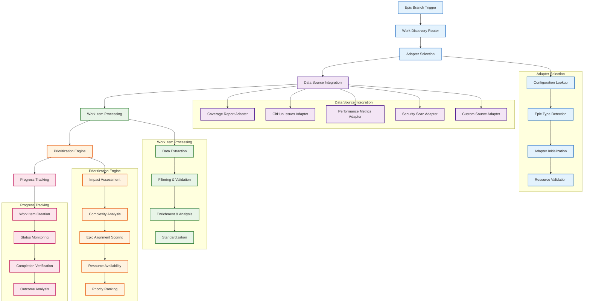

# Epic #181: Work Discovery Adapters Specification

**Last Updated:** 2025-09-23
**Version:** 1.0
**Epic Context:** AI-Powered CI/CD Orchestration Framework
**Status:** Specification Complete - Implementation Ready

> **Parent:** [`Epic #181 AI Orchestration Framework`](./09-ai-orchestration-framework.md)

## 1. Purpose & Responsibility

* **What it is:** Pluggable adapter system enabling different autonomous epic workstreams to discover, prioritize, and track work from diverse sources including coverage reports, GitHub issues, performance metrics, security scans, and custom data sources.
* **Key Objectives:**
  - **Universal Work Source Support** - Enable any data source to feed autonomous development workstreams
  - **Intelligent Work Prioritization** - Adaptive priority ranking based on epic type and organizational goals
  - **Progress Tracking Integration** - Comprehensive work item lifecycle management with completion verification
  - **Epic-Specific Customization** - Configurable filtering, ranking, and processing logic per epic type
  - **Scalable Adapter Architecture** - Clean interfaces enabling rapid addition of new work source types
  - **Performance Optimization** - Efficient work discovery with caching and incremental processing
* **Success Criteria:**
  - **Multi-Source Integration** - Coverage reports, GitHub issues, performance metrics, security scans supported
  - **Intelligent Prioritization** - Work items ranked by impact, complexity, and epic alignment
  - **Completion Tracking** - Comprehensive lifecycle management from discovery to verification
  - **Custom Epic Support** - Framework enables creation of specialized autonomous workstreams
  - **Performance Excellence** - Work discovery completes within 2 minutes for responsive automation
* **Why it exists:** To enable unlimited autonomous workstream types by providing standardized interfaces for work discovery, allowing each epic to intelligently find and prioritize appropriate work from its relevant data sources.

> **Framework Role:** Work Discovery Adapters serve as the intelligence gathering component of autonomous workstreams, translating diverse data sources into standardized work item formats for AI processing.

### Work Discovery Philosophy

The Work Discovery Adapters embody intelligent automation principles:

```yaml
Discovery_Philosophy:
  Source_Agnostic: "Any data source can feed autonomous workstreams through adapters"
  Intelligence_Driven: "AI-powered prioritization based on impact and complexity"
  Epic_Aligned: "Work discovery customized for specific autonomous workstream goals"
  Progress_Aware: "Comprehensive tracking from discovery through completion verification"

Strategic_Benefits:
  Unlimited_Workstreams: "Framework supports any autonomous development pattern"
  Intelligent_Focus: "AI agents work on highest-impact items first"
  Organizational_Alignment: "Work discovery aligned with business priorities"
  Efficiency_Optimization: "Automated work identification eliminates manual coordination"
```

## 2. Architecture & Key Concepts

* **High-Level Design:** Modular adapter architecture with standardized interfaces for work discovery, filtering, prioritization, and progress tracking, enabling any data source to integrate with autonomous development workstreams.

### Work Discovery Adapter Architecture



### Standardized Work Item Interface

```yaml
# Universal work item format for all adapters
work_item_schema:
  core_properties:
    id:
      type: "string"
      description: "Unique identifier for work item"
      required: true

    title:
      type: "string"
      description: "Human-readable work item title"
      required: true

    description:
      type: "string"
      description: "Detailed work item description"
      required: true

    epic_type:
      type: "string"
      enum: ["coverage", "tech-debt", "performance", "security", "custom"]
      description: "Epic workstream classification"
      required: true

    priority:
      type: "integer"
      range: [1, 100]
      description: "Calculated priority score"
      required: true

  source_metadata:
    source_type:
      type: "string"
      description: "Adapter type that discovered this work"
      required: true

    source_id:
      type: "string"
      description: "Original identifier in source system"
      required: true

    source_url:
      type: "string"
      description: "Link to original work item"
      required: false

    discovered_at:
      type: "datetime"
      description: "Timestamp of work discovery"
      required: true

  impact_analysis:
    complexity_score:
      type: "integer"
      range: [1, 10]
      description: "Estimated implementation complexity"
      required: true

    impact_score:
      type: "integer"
      range: [1, 10]
      description: "Potential impact on epic goals"
      required: true

    effort_estimate:
      type: "string"
      enum: ["small", "medium", "large", "extra-large"]
      description: "Estimated effort requirement"
      required: true

    dependencies:
      type: "array"
      items: "string"
      description: "List of dependent work item IDs"
      required: false

  progress_tracking:
    status:
      type: "string"
      enum: ["discovered", "assigned", "in_progress", "completed", "failed", "deferred"]
      description: "Current work item status"
      required: true

    assigned_to:
      type: "string"
      description: "AI agent or autonomous system assigned"
      required: false

    started_at:
      type: "datetime"
      description: "Work start timestamp"
      required: false

    completed_at:
      type: "datetime"
      description: "Work completion timestamp"
      required: false

    verification_status:
      type: "string"
      enum: ["pending", "verified", "failed"]
      description: "Completion verification status"
      required: false

  epic_specific_data:
    coverage_data:
      current_percentage: "number"
      target_percentage: "number"
      test_gaps: "array"
      focus_areas: "array"

    tech_debt_data:
      issue_labels: "array"
      affected_components: "array"
      technical_risk: "string"
      maintenance_impact: "string"

    performance_data:
      metrics: "object"
      baseline_values: "object"
      degradation_percentage: "number"
      affected_endpoints: "array"

    security_data:
      vulnerability_type: "string"
      severity_level: "string"
      affected_components: "array"
      remediation_priority: "string"
```

### Coverage Report Adapter Specification

```yaml
# Adapter for code coverage analysis and gap identification
coverage_report_adapter:
  adapter_id: "coverage-reports"
  description: "Discovers coverage improvement opportunities from test coverage analysis"

  configuration:
    baseline_threshold:
      type: "number"
      default: 16
      description: "Current coverage baseline percentage"

    target_threshold:
      type: "number"
      default: 90
      description: "Target coverage percentage for epic"

    focus_areas:
      type: "array"
      default: ["Services", "Controllers", "Models"]
      description: "Priority areas for coverage improvement"

    exclusions:
      type: "array"
      default: ["Generated", "Migrations", "Tests"]
      description: "Areas to exclude from coverage analysis"

    gap_threshold:
      type: "number"
      default: 5
      description: "Minimum coverage gap to create work item"

  data_sources:
    primary: "TestResults/coverage_results.json"
    secondary: "CoverageReport/coverage.xml"
    metadata: "TestResults/parsed_results.json"

  work_discovery_logic:
    gap_identification:
      method: "analyze_uncovered_lines"
      grouping: "by_class_and_method"
      prioritization: "by_complexity_and_usage"

    impact_scoring:
      high_impact: "public_apis_and_core_business_logic"
      medium_impact: "internal_services_and_utilities"
      low_impact: "edge_cases_and_error_handling"

    complexity_assessment:
      factors: ["cyclomatic_complexity", "method_length", "dependency_count"]
      weighting: "complexity_40_usage_40_criticality_20"

  work_item_generation:
    title_template: "Add test coverage for {class_name}.{method_name}"
    description_template: |
      Coverage gap identified in {class_name}.{method_name}
      Current coverage: {current_percentage}%
      Target coverage: {target_percentage}%
      Uncovered lines: {uncovered_line_count}
      Complexity score: {complexity_score}

    priority_calculation:
      formula: "(impact_score * 0.4) + (complexity_inverse * 0.3) + (usage_frequency * 0.3)"
      range: [1, 100]

  completion_verification:
    method: "coverage_percentage_increase"
    success_criteria:
      - "target_lines_covered >= 80%"
      - "no_regression_in_existing_coverage"
      - "tests_pass_successfully"
```

### GitHub Issues Adapter Specification

```yaml
# Adapter for GitHub issues with label-based filtering
github_issues_adapter:
  adapter_id: "github-issues"
  description: "Discovers work items from GitHub issues with configurable label filtering"

  configuration:
    labels:
      type: "array"
      default: ["tech-debt", "maintenance", "refactor"]
      description: "Issue labels to include in work discovery"

    priority_weights:
      type: "object"
      default:
        "high": 10
        "medium": 5
        "low": 1
      description: "Priority label weights for scoring"

    max_items_per_cycle:
      type: "number"
      default: 3
      description: "Maximum work items to discover per cycle"

    exclude_labels:
      type: "array"
      default: ["wontfix", "duplicate", "invalid"]
      description: "Issue labels to exclude from discovery"

    age_weighting:
      type: "boolean"
      default: true
      description: "Weight older issues higher in priority"

  data_sources:
    primary: "GitHub Issues API"
    authentication: "github_token"
    endpoints:
      - "GET /repos/{owner}/{repo}/issues"
      - "GET /repos/{owner}/{repo}/issues/{issue_number}/comments"

  work_discovery_logic:
    issue_filtering:
      state: "open"
      label_matching: "any_of_included_labels"
      label_exclusion: "none_of_excluded_labels"
      age_limit: "365_days"

    complexity_assessment:
      factors: ["comment_count", "description_length", "label_complexity"]
      simple: "comment_count <= 3, description_length <= 500"
      complex: "comment_count > 10, description_length > 2000"

    impact_scoring:
      high_impact: "affects_core_functionality_or_security"
      medium_impact: "improves_maintainability_or_performance"
      low_impact: "minor_improvements_or_cleanup"

  work_item_generation:
    title_template: "{issue_title}"
    description_template: |
      GitHub Issue: {issue_url}
      Labels: {issue_labels}
      Created: {created_at}
      Comments: {comment_count}

      {issue_description}

    priority_calculation:
      formula: "(label_weight * 0.4) + (age_factor * 0.3) + (complexity_factor * 0.3)"
      range: [1, 100]

  completion_verification:
    method: "issue_status_check"
    success_criteria:
      - "issue_closed_successfully"
      - "linked_pr_merged"
      - "verification_comment_added"
```

### Performance Metrics Adapter Specification

```yaml
# Adapter for application performance monitoring data
performance_metrics_adapter:
  adapter_id: "performance-metrics"
  description: "Discovers performance optimization opportunities from monitoring data"

  configuration:
    metrics:
      type: "array"
      default: ["response_time", "memory_usage", "cpu_usage", "error_rate"]
      description: "Performance metrics to monitor"

    degradation_threshold:
      type: "number"
      default: 15
      description: "Percentage degradation to trigger work item"

    baseline_days:
      type: "number"
      default: 7
      description: "Days of historical data for baseline calculation"

    critical_endpoints:
      type: "array"
      default: ["/api/auth", "/api/data", "/api/search"]
      description: "Endpoints requiring high performance priority"

    monitoring_window:
      type: "string"
      default: "24h"
      description: "Time window for performance analysis"

  data_sources:
    primary: "Application Performance Monitoring API"
    secondary: "Server Metrics Dashboard"
    logs: "Performance Logs Analysis"

  work_discovery_logic:
    degradation_detection:
      method: "baseline_comparison"
      statistical_analysis: "95th_percentile_trending"
      anomaly_detection: "standard_deviation_threshold"

    root_cause_analysis:
      methods: ["slow_query_detection", "memory_leak_analysis", "cpu_bottleneck_identification"]
      correlation: "cross_metric_analysis"

    impact_assessment:
      user_impact: "affected_user_percentage"
      business_impact: "revenue_affecting_endpoints"
      technical_impact: "system_stability_risk"

  work_item_generation:
    title_template: "Optimize {endpoint} performance ({metric} degraded {percentage}%)"
    description_template: |
      Performance degradation detected:
      Endpoint: {endpoint}
      Metric: {metric}
      Current value: {current_value}
      Baseline value: {baseline_value}
      Degradation: {degradation_percentage}%
      Affected users: {affected_user_count}
      Detection time: {detection_timestamp}

    priority_calculation:
      formula: "(user_impact * 0.5) + (degradation_severity * 0.3) + (endpoint_criticality * 0.2)"
      range: [1, 100]

  completion_verification:
    method: "performance_improvement_measurement"
    success_criteria:
      - "metric_improvement >= degradation_amount"
      - "no_regression_in_other_metrics"
      - "sustained_improvement_for_24h"
```

## 3. Interface Contract & Assumptions

* **Key Work Discovery Interfaces:**
  - **Adapter Registration Interface:**
    * **Purpose:** Register new work discovery adapters with the orchestration framework
    * **Dependencies:** Adapter implementation, configuration schema, data source access
    * **Outputs:** Adapter registration confirmation, capability validation, integration status
    * **Quality Gates:** Interface compliance validation, security boundary verification

  - **Work Discovery Interface:**
    * **Purpose:** Execute work discovery logic and return standardized work items
    * **Dependencies:** Data source access, configuration parameters, filtering criteria
    * **Outputs:** Standardized work item lists, priority rankings, metadata
    * **Quality Gates:** Data validation, priority accuracy, completion criteria

  - **Progress Tracking Interface:**
    * **Purpose:** Monitor work item lifecycle from discovery through completion
    * **Dependencies:** Work item storage, status monitoring, verification mechanisms
    * **Outputs:** Status updates, progress reports, completion verification
    * **Quality Gates:** Status accuracy, completion validation, outcome verification

  - **Configuration Interface:**
    * **Purpose:** Dynamic configuration of adapter behavior and filtering criteria
    * **Dependencies:** Configuration registry, validation schemas, security controls
    * **Outputs:** Validated configuration, runtime parameters, error reporting
    * **Quality Gates:** Configuration validation, security compliance, performance impact

* **Critical Assumptions:**
  - **Data Assumptions:** Work discovery sources provide consistent, reliable data access
  - **Performance Assumptions:** Work discovery completes within 2 minutes for responsive automation
  - **Quality Assumptions:** Standardized work item format enables consistent AI processing
  - **Integration Assumptions:** Adapters can integrate with diverse data sources without performance degradation

## 4. Local Conventions & Constraints (Beyond Global Standards)

* **Work Discovery Standards:**
  - All adapters must implement standardized work item interface for consistency
  - Priority calculations must be deterministic and reproducible for reliable automation
  - Progress tracking must include verification mechanisms for completion validation
  - Configuration changes must be testable through dry-run capabilities
* **Technology Constraints:**
  - Adapter implementations must support timeout controls for reliability
  - Data source integration must include error handling and graceful degradation
  - Work item processing must be idempotent for reliable automation
* **Performance Constraints:**
  - Work discovery execution within 2 minutes for responsive automation
  - Caching mechanisms must be implemented for frequently accessed data sources
  - Resource usage must be monitored and optimized automatically

## 5. How to Work With This Adapter System

* **Implementation Approach:**
  - **Core Framework:** Implement standardized adapter interfaces and registration system
  - **Adapter Development:** Create specific adapters for coverage, issues, performance, security
  - **Priority Engine:** Develop intelligent prioritization with impact and complexity analysis
  - **Progress Tracking:** Implement comprehensive lifecycle management with verification
* **Quality Assurance:**
  - **Adapter Testing:** Validate each adapter with representative data sources
  - **Integration Testing:** Ensure end-to-end work discovery and processing
  - **Performance Testing:** Validate discovery execution within time constraints
* **Common Implementation Pitfalls:**
  - Inconsistent work item formats can break AI processing workflows
  - Missing progress tracking can prevent proper completion verification
  - Inadequate prioritization can lead to suboptimal work selection

## 6. Dependencies

* **Foundation Dependencies:**
  - [`AI Configuration Registry`](./10-ai-configuration-registry.md) - Adapter selection and configuration
  - [`Universal Build Workflow`](./11-universal-build-workflow.md) - Work discovery execution context
  - [`AI Orchestration Framework`](./09-ai-orchestration-framework.md) - Overall framework integration

* **Implementation Dependencies:**
  - **Adapter Registration System** - Dynamic adapter loading and configuration
  - **Priority Engine** - Intelligent work item ranking and selection
  - **Progress Tracking System** - Comprehensive lifecycle management
  - **Data Source Connectors** - Integration with external data sources

* **External Dependencies:**
  - Data source APIs (GitHub, monitoring systems, coverage tools)
  - Authentication mechanisms for secure data access
  - Storage systems for work item persistence and tracking

## 7. Rationale & Key Historical Context

* **Strategic Context:** Work discovery adapters prioritized to enable unlimited autonomous workstream types through standardized work source integration.
* **Evolution from Single-Source:** Adapter concept emerged from coverage epic requirements, recognizing need for diverse work source types.
* **Standardization Focus:** Universal work item format ensures consistent AI processing across all epic types.
* **Intelligence Integration:** Priority calculation enables AI agents to focus on highest-impact work items.

### Adapter Benefits Across Autonomous Workstreams

The Work Discovery Adapters serve diverse autonomous needs through intelligent work source integration:

```yaml
Adapter_Benefits:
  Universal_Support: "Any data source can feed autonomous workstreams"
  Intelligent_Focus: "AI agents work on highest-priority items automatically"
  Epic_Customization: "Work discovery tailored to specific autonomous goals"
  Progress_Transparency: "Comprehensive tracking from discovery to completion"

Strategic_Impact:
  Unlimited_Scaling: "Framework supports any autonomous workstream pattern"
  Quality_Focus: "Intelligent prioritization ensures impactful work selection"
  Efficiency_Optimization: "Automated work discovery eliminates manual coordination"
  Innovation_Enablement: "Foundation for specialized autonomous development patterns"
```

## 8. Known Issues & TODOs

* **Implementation Status:**
  - ✅ **Adapter Architecture Complete:** Standardized interfaces and work item format defined
  - ✅ **Core Adapters Specified:** Coverage, GitHub issues, performance, security adapters designed
  - 🚧 **Implementation Pending:** Adapter framework and specific adapter development
  - 🎯 **Integration Ready:** Interfaces defined for AI orchestration framework consumption

* **Implementation Roadmap:**
  ```yaml
  Phase_1_Core_Framework:
    Adapter_Registration_System: "Dynamic adapter loading with configuration validation"
    Work_Item_Standardization: "Universal format implementation with schema validation"

  Phase_2_Core_Adapters:
    Coverage_Report_Adapter: "Test coverage gap analysis and prioritization"
    GitHub_Issues_Adapter: "Issue discovery with label-based filtering"
    Performance_Metrics_Adapter: "Performance degradation detection and prioritization"

  Phase_3_Advanced_Features:
    Priority_Engine_Enhancement: "Machine learning-powered prioritization optimization"
    Progress_Analytics: "Work item lifecycle analysis and optimization"

  Phase_4_Extensibility:
    Custom_Adapter_Framework: "Tools for creating specialized work discovery adapters"
    Cross_Repository_Support: "Adapter framework extension to multiple repositories"
  ```

* **Critical Success Factors:**
  - **Interface Consistency:** All adapters must implement standardized work item format
  - **Priority Accuracy:** Intelligent ranking must effectively guide AI agent focus
  - **Performance Efficiency:** Work discovery must not impact autonomous cycle timing
  - **Extensibility:** Framework must support rapid addition of new adapter types

* **Future Enhancement Opportunities:**
  - **Machine Learning Prioritization:** AI-powered work item ranking optimization
  - **Cross-Source Correlation:** Intelligent connections between different work sources
  - **Predictive Discovery:** Proactive work identification based on patterns
  - **Advanced Analytics:** Work discovery effectiveness measurement and optimization

> **Implementation Readiness:** Work Discovery Adapters specification complete with comprehensive architecture and standardized interfaces defined. Ready for adapter framework development and specific adapter implementation.

---

*This document establishes the comprehensive specification for Epic #181's Work Discovery Adapters, enabling unlimited autonomous workstream types through standardized interfaces for intelligent work source integration and prioritization.*