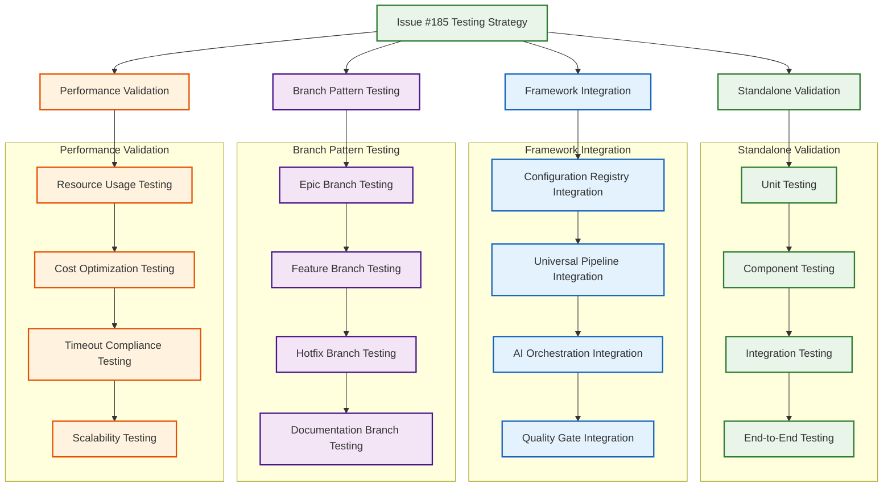

# Epic #181: Issue #185 Testing Strategy Within AI Orchestration Framework

**Last Updated:** 2025-09-23
**Version:** 1.0
**Epic Context:** AI-Powered CI/CD Orchestration Framework Testing Integration
**Status:** Testing Strategy Complete - Implementation Ready

> **Parent:** [`Epic #181 AI Orchestration Framework`](./09-ai-orchestration-framework.md)

## 1. Purpose & Responsibility

* **What it is:** Comprehensive testing strategy for validating Issue #185's iterative AI review implementation within the expanded AI orchestration framework context, ensuring seamless integration with universal build pipelines and branch-aware behaviors.
* **Key Objectives:**
  - **Framework Integration Testing** - Validate Issue #185 within universal AI orchestration framework
  - **Branch Pattern Validation** - Test iterative review behavior across different branch types
  - **Configuration Testing** - Verify AI configuration registry integration with iterative review
  - **Performance Validation** - Ensure iterative review meets framework performance standards
  - **Cost Control Testing** - Validate resource optimization and usage monitoring
  - **Quality Gate Integration** - Test quality enforcement within universal pipeline context
* **Success Criteria:**
  - **Universal Framework Compatibility** - Issue #185 integrates seamlessly with all framework components
  - **Branch-Aware Behavior** - Iterative review activates appropriately based on branch patterns
  - **Performance Standards** - Testing completes within framework timeout constraints
  - **Cost Effectiveness** - Resource usage aligns with framework optimization goals
  - **Quality Integration** - Iterative review contributes to appropriate quality gate enforcement
* **Why it exists:** To ensure Issue #185's iterative AI review implementation operates correctly within the expanded framework context, validating both standalone functionality and integration with universal CI/CD orchestration patterns.

> **Testing Context:** This strategy bridges Issue #185's completed implementation with the expanded AI orchestration framework, ensuring compatibility and optimal integration.

### Testing Philosophy Within Framework Context

The testing strategy embodies comprehensive validation principles:

```yaml
Testing_Philosophy:
  Framework_Integration: "Validate Issue #185 within universal orchestration context"
  Branch_Awareness: "Test behavior across all supported branch patterns"
  Performance_Alignment: "Ensure compatibility with framework performance standards"
  Cost_Optimization: "Validate resource usage within framework controls"

Strategic_Benefits:
  Implementation_Confidence: "Comprehensive validation before production deployment"
  Framework_Compatibility: "Seamless integration with expanded orchestration capabilities"
  Performance_Assurance: "Resource usage aligned with framework optimization goals"
  Quality_Validation: "Iterative review contributes effectively to quality enforcement"
```

## 2. Architecture & Key Concepts

* **High-Level Testing Design:** Multi-layered testing approach validating Issue #185 standalone functionality, framework integration, branch-aware behavior, and universal pipeline compatibility.

### Comprehensive Testing Architecture



## 3. Testing Strategy Implementation

### 3.1 Immediate Testing Approach for Issue #185

**Option 1: Minimal Framework Integration (RECOMMENDED)**

```yaml
minimal_integration_testing:
  description: "Test Issue #185 with minimal framework components for immediate validation"

  temporary_modifications:
    build_yml_integration:
      file: ".github/workflows/build.yml"
      changes:
        - "Add conditional iterative review job"
        - "Enable for feature/issue-185-* branches"
        - "Use generic-code-review.md prompt template"
      lines_changed: "~15 lines"
      reversible: true

    generic_prompt_creation:
      file: ".github/prompts/generic-code-review.md"
      purpose: "Non-epic-specific review template"
      reusable: true
      permanent: true

    action_configuration:
      modification: "Branch-aware prompt selection logic"
      changes: "Conditional template path based on branch pattern"
      impact: "~5 lines in action implementation"

  testing_procedure:
    1: "Create feature/issue-185-testing branch"
    2: "Add test-ai-review label to PR"
    3: "Trigger build.yml with conditional logic"
    4: "Validate iterative review execution"
    5: "Test multiple iteration cycles"
    6: "Verify to-do tracking functionality"

  validation_criteria:
    functional: "Iterative review executes successfully"
    integration: "Works within existing build pipeline"
    performance: "Completes within timeout constraints"
    cost: "Resource usage within acceptable limits"
```

**Option 2: Universal Pipeline Integration**

```yaml
universal_pipeline_testing:
  description: "Test Issue #185 within full universal pipeline context"

  framework_components_required:
    ai_configuration_registry: "Branch pattern detection and behavior selection"
    universal_build_workflow: "Foundation pipeline with conditional AI integration"
    work_discovery_adapters: "Generic work discovery for testing"

  implementation_timeline:
    phase_1: "Implement minimal AI configuration registry (Days 1-3)"
    phase_2: "Create basic universal pipeline (Days 3-5)"
    phase_3: "Integrate Issue #185 with framework (Days 5-7)"
    phase_4: "Comprehensive testing and validation (Days 7-10)"

  validation_scope:
    branch_patterns: "Test all supported branch pattern configurations"
    ai_behaviors: "Validate behavior selection accuracy"
    performance: "Ensure framework performance standards"
    scalability: "Test with multiple concurrent workstreams"
```

### 3.2 Branch Pattern Testing Matrix

```yaml
branch_pattern_testing:
  epic_branches:
    pattern: "epic/testing-coverage-*"
    expected_behavior: "Iterative AI review with coverage context"
    test_scenarios:
      - "Initial iteration creation"
      - "Multi-iteration progression"
      - "To-do list evolution"
      - "Auto-merge qualification"
    validation_criteria:
      - "Appropriate epic context loading"
      - "Coverage-specific prompts used"
      - "Iteration limits respected"
      - "Quality gates enforced"

  feature_branches:
    pattern: "feature/*"
    expected_behavior: "Generic single-shot review"
    test_scenarios:
      - "Single review execution"
      - "Generic prompt usage"
      - "Basic quality gates"
      - "Manual merge process"
    validation_criteria:
      - "No iteration behavior"
      - "Generic prompt template used"
      - "Cost-optimized execution"
      - "Appropriate quality standards"

  hotfix_branches:
    pattern: "hotfix/*"
    expected_behavior: "Security-focused rapid review"
    test_scenarios:
      - "Security-prioritized analysis"
      - "Expedited review process"
      - "High-priority escalation"
      - "Production quality gates"
    validation_criteria:
      - "Security prompt template used"
      - "Reduced timeout tolerance"
      - "High-priority processing"
      - "Production-level quality"

  documentation_branches:
    pattern: "docs/*"
    expected_behavior: "Documentation-specific review"
    test_scenarios:
      - "Content quality analysis"
      - "Style guide compliance"
      - "Link validation"
      - "Lightweight processing"
    validation_criteria:
      - "Documentation prompt used"
      - "Minimal resource usage"
      - "Content-focused analysis"
      - "Documentation quality gates"
```

### 3.3 Performance and Cost Validation

```yaml
performance_testing:
  resource_usage_monitoring:
    metrics:
      - "CPU utilization during AI operations"
      - "Memory consumption for context processing"
      - "Network usage for API interactions"
      - "Storage usage for state persistence"

    targets:
      cpu_usage: "< 80% during AI processing"
      memory_usage: "< 2GB for context management"
      api_calls: "Optimized with rate limiting compliance"
      storage_growth: "Linear with iteration count"

  cost_optimization_validation:
    ai_service_usage:
      monitoring: "Token consumption tracking"
      optimization: "Context compression and caching"
      limits: "Per-branch cost controls"
      alerts: "Usage threshold notifications"

    github_actions_usage:
      execution_time: "Additive to foundation pipeline"
      resource_allocation: "Appropriate for AI operations"
      concurrent_usage: "Multiple PR handling"
      cost_efficiency: "Value-driven AI deployment"

  timeout_compliance:
    foundation_pipeline: "< 5 minutes for non-AI operations"
    ai_integration: "< 15 minutes for iterative review"
    total_execution: "< 20 minutes end-to-end"
    error_recovery: "< 2 minutes for failure scenarios"
```

### 3.4 Quality Gate Integration Testing

```yaml
quality_gate_testing:
  blocking_logic_validation:
    ai_review_operations:
      scenario: "Iterative review on broken build"
      expected: "Execution blocked until build fixed"
      validation: "Quality gate prevents AI waste"

    ai_mission_operations:
      scenario: "AI fix mission on broken build"
      expected: "Execution continues with failure context"
      validation: "AI can diagnose and fix issues"

  quality_standards_enforcement:
    epic_branches:
      requirements: "Iterative review completion with to-do resolution"
      auto_merge: "Enabled with quality gate approval"
      escalation: "Automatic for critical issues"

    feature_branches:
      requirements: "Single review completion"
      manual_merge: "Required with review approval"
      escalation: "Optional for quality issues"

  integration_with_existing_gates:
    build_success: "Foundation requirement for all operations"
    test_passage: "Required for review operations"
    security_compliance: "Validated for production branches"
    coverage_improvement: "Tracked for epic branches"
```

## 4. Implementation Recommendations

### 4.1 Immediate Testing Strategy (Today)

**RECOMMENDED: Minimal Integration Approach**

```yaml
immediate_implementation:
  day_1:
    tasks:
      - "Create generic-code-review.md prompt template"
      - "Add branch detection logic to iterative review action"
      - "Create temporary build.yml integration"
    deliverables:
      - "Generic prompt for non-epic branches"
      - "Branch-aware template selection"
      - "Testing infrastructure for Issue #185"

  day_2:
    tasks:
      - "Create feature/issue-185-testing branch"
      - "Test iterative review with generic prompt"
      - "Validate multiple iteration cycles"
    deliverables:
      - "Functional validation complete"
      - "Performance baseline established"
      - "Integration confidence confirmed"

  day_3:
    tasks:
      - "Test edge cases and error scenarios"
      - "Validate cost controls and monitoring"
      - "Document testing results and recommendations"
    deliverables:
      - "Comprehensive testing report"
      - "Production readiness assessment"
      - "Framework integration recommendations"

cleanup_strategy:
  temporary_modifications: "Remove after Issue #185 validation"
  permanent_additions: "Keep generic prompt for future use"
  testing_infrastructure: "Evolve into framework testing foundation"
```

### 4.2 Framework Integration Roadmap

```yaml
framework_integration_timeline:
  week_1_foundation:
    - "Complete Issue #185 minimal testing"
    - "Begin AI configuration registry implementation"
    - "Start universal pipeline design"

  week_2_integration:
    - "Integrate Issue #185 with configuration registry"
    - "Test branch pattern detection accuracy"
    - "Validate universal pipeline compatibility"

  week_3_validation:
    - "Comprehensive framework testing"
    - "Performance optimization and tuning"
    - "Multi-branch pattern validation"

  week_4_production:
    - "Production deployment preparation"
    - "Monitoring and alerting setup"
    - "Framework documentation completion"
```

## 5. Success Metrics and Validation Criteria

### 5.1 Functional Validation

```yaml
functional_metrics:
  iterative_review_execution:
    success_rate: "> 95% successful executions"
    error_recovery: "< 5% unrecoverable failures"
    context_preservation: "100% historical context maintained"

  to_do_management:
    creation_accuracy: "> 90% relevant to-do items"
    progression_tracking: "100% status updates captured"
    completion_validation: "> 95% accurate completion detection"

  quality_gate_integration:
    blocking_accuracy: "100% appropriate blocking decisions"
    escalation_timing: "< 5 minutes for critical issues"
    auto_merge_safety: "0% inappropriate auto-merges"
```

### 5.2 Performance Validation

```yaml
performance_metrics:
  execution_timing:
    foundation_pipeline: "< 5 minutes consistently"
    ai_integration: "< 15 minutes for complex reviews"
    total_execution: "< 20 minutes end-to-end"

  resource_efficiency:
    cpu_utilization: "< 80% during AI operations"
    memory_consumption: "< 2GB for largest contexts"
    cost_per_execution: "Within framework budget targets"

  scalability_validation:
    concurrent_prs: "Support 5+ simultaneous reviews"
    branch_pattern_load: "< 1 second pattern detection"
    configuration_loading: "< 30 seconds for complex configs"
```

### 5.3 Framework Integration Validation

```yaml
integration_metrics:
  configuration_accuracy:
    pattern_matching: "100% correct branch classification"
    behavior_selection: "100% appropriate AI behavior"
    cost_limit_enforcement: "100% budget compliance"

  universal_pipeline_compatibility:
    foundation_isolation: "0% AI impact on foundation timing"
    conditional_execution: "100% appropriate AI activation"
    error_isolation: "100% graceful AI failure handling"

  cross_component_integration:
    registry_integration: "< 1 second configuration lookup"
    workflow_integration: "Seamless pipeline execution"
    adapter_compatibility: "Ready for work discovery integration"
```

## 6. Testing Infrastructure and Tools

### 6.1 Testing Framework Components

```yaml
testing_infrastructure:
  test_harness:
    description: "Automated testing framework for Issue #185 validation"
    components:
      - "Branch simulation and PR generation"
      - "AI response mocking and validation"
      - "Performance monitoring and reporting"
      - "Cost tracking and optimization"

  validation_tools:
    functional_testing: "Automated iteration cycle validation"
    performance_testing: "Resource usage monitoring and analysis"
    integration_testing: "End-to-end workflow validation"
    regression_testing: "Continuous validation of existing functionality"

  monitoring_and_alerting:
    execution_monitoring: "Real-time execution tracking"
    performance_alerts: "Threshold-based performance notifications"
    cost_monitoring: "Resource usage tracking and optimization"
    quality_metrics: "Success rate and error analysis"
```

## 7. Risk Mitigation and Contingency Planning

### 7.1 Testing Risk Assessment

```yaml
testing_risks:
  integration_complexity:
    risk: "Framework integration may introduce unexpected issues"
    mitigation: "Incremental integration with comprehensive testing"
    contingency: "Fallback to minimal integration approach"

  performance_degradation:
    risk: "AI operations may impact foundation pipeline performance"
    mitigation: "Isolated execution with performance monitoring"
    contingency: "Resource limit adjustment and optimization"

  cost_overrun:
    risk: "Testing may exceed budget allocations"
    mitigation: "Cost monitoring with automatic limits"
    contingency: "Reduced testing scope with focused validation"
```

### 7.2 Rollback Strategy

```yaml
rollback_planning:
  immediate_rollback:
    trigger: "Critical functionality failure"
    procedure: "Remove temporary integrations, restore baseline"
    timeline: "< 1 hour for complete rollback"

  partial_rollback:
    trigger: "Performance or cost issues"
    procedure: "Adjust configuration, optimize resource usage"
    timeline: "< 30 minutes for configuration changes"

  testing_isolation:
    approach: "All testing changes clearly marked and reversible"
    validation: "No permanent modifications to production workflows"
    safety: "Complete isolation from existing functionality"
```

## 8. Conclusion and Recommendations

### 8.1 Recommended Testing Approach

**IMMEDIATE RECOMMENDATION: Minimal Integration Testing**

1. **Create Generic Prompt Template** - Enable non-epic-specific iterative review
2. **Add Branch Detection Logic** - Conditional behavior based on branch patterns
3. **Integrate with Build.yml** - Temporary integration for testing validation
4. **Comprehensive Validation** - Functional, performance, and integration testing
5. **Framework Preparation** - Use testing insights to guide framework development

### 8.2 Strategic Framework Integration

**MEDIUM-TERM RECOMMENDATION: Universal Framework Integration**

1. **AI Configuration Registry** - Implement dynamic branch pattern detection
2. **Universal Build Pipeline** - Foundation with conditional AI integration
3. **Full Framework Testing** - Comprehensive validation across all components
4. **Production Deployment** - Complete framework with Issue #185 integration

This testing strategy ensures Issue #185's iterative AI review implementation operates correctly within both current and future framework contexts, providing confidence for immediate testing and production deployment while preparing for comprehensive AI orchestration framework integration.

---

*This document establishes the comprehensive testing strategy for Issue #185 within Epic #181's AI orchestration framework context, ensuring seamless integration and optimal performance across all supported development scenarios.*