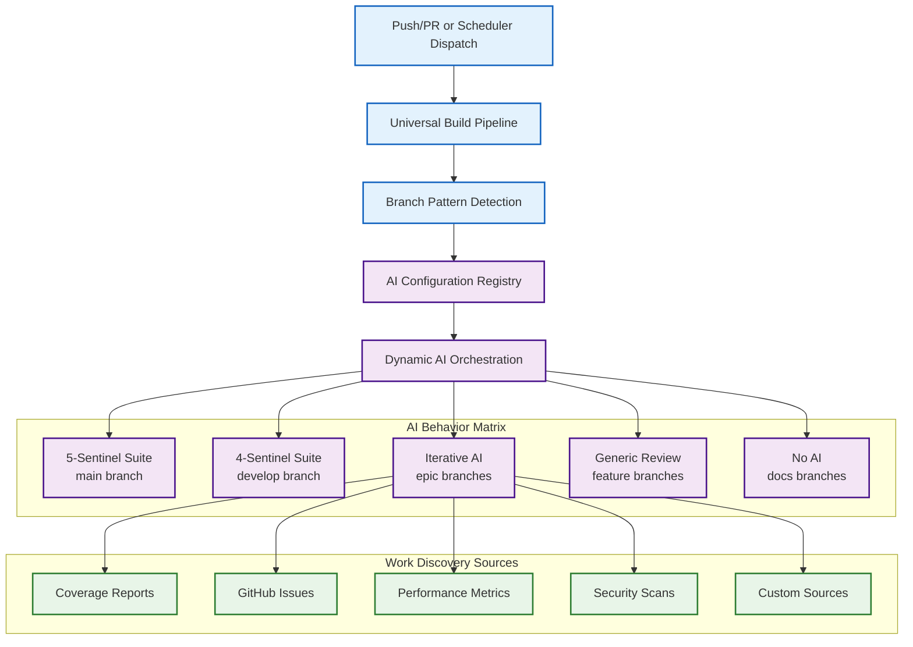

# Epic #181: AI-Powered CI/CD Orchestration Framework

**Last Updated:** 2025-09-23
**Epic Status:** Implementation Documentation Complete - Ready for Deployment
**Epic Owner:** Zarichney-Development Team

> **Parent:** [`Specs`](../README.md)

## 1. Purpose & Responsibility

* **What it is:** Universal AI-powered CI/CD orchestration framework that provides intelligent, branch-aware build pipelines with configurable AI integration, enabling unlimited autonomous development workstreams through dynamic behavior selection and pluggable work discovery via a coordinated set of GitHub Actions workflows.
* **Key Objectives:**
  - **Primary: Universal AI Orchestration** - Create configurable CI/CD framework supporting any branch pattern with appropriate AI integration
  - **Branch-Aware Intelligence** - Different branches receive different AI behaviors (sentinels, iterative review, generic review) automatically
  - **Multi-Epic Autonomous Support** - Enable unlimited epic workflows with specialized AI agents and intelligent work discovery
  - **Non-Blocking Build Philosophy** - AI missions can work on broken code while AI reviews require working builds
  - **Intelligent Work Discovery** - Pluggable work source adapters for coverage reports, GitHub issues, performance metrics, etc.
  - **Cost-Controlled Operations** - Configurable iteration limits and auto-merge criteria with intelligent resource optimization
  - **Universal Branch Support** - Every branch gets appropriate AI integration without per-branch reconfiguration, using a shared configuration file plus dedicated workflow definitions (base build, mission, review, generic)
* **Success Criteria:**
  - **Universal Framework Deployment** - Any branch receives appropriate AI integration automatically through configuration-driven orchestration rather than bespoke workflow files
  - **Multi-Epic Scaling Validation** - Support for coverage, tech debt, performance, security, and custom autonomous workstreams
  - **Intelligent Cost Management** - AI operations optimized with usage monitoring and automatic cost controls
  - **Self-Healing Capabilities** - AI missions can diagnose and fix broken builds with autonomous recovery
  - **Quality Gate Excellence** - Per-branch quality standards with automated enforcement and escalation
  - **Developer Experience Optimization** - Transparent AI integration without workflow disruption or configuration burden
* **Why it exists:** To create a scalable, intelligent CI/CD framework that eliminates manual coordination overhead while providing appropriate AI integration for every development scenario, enabling organizational scaling through intelligent automation rather than additional human resources.

> **Implementation Status:** Comprehensive implementation documentation complete (2025-09-23). Foundation specifications and technical implementation guide provide deployment-ready GitHub Actions workflows, configuration management, and testing strategies. Framework ready for implementation pending Issue #220 resolution.

### Component Specifications
* **Component Analysis Available:** [`Components Directory`](./components/README.md) - Detailed component specifications and analysis

### Implementation Readiness Summary

**DEPLOYMENT-READY STATUS:** All technical specifications and implementation documentation are complete. The Epic #181 framework is ready for deployment with the following comprehensive deliverables:

* **Complete YAML Workflows:** Exact GitHub Actions workflows for scheduler-controller, mission templates, review workflows, and universal build pipeline
* **Configuration Management:** Python-based AI configuration registry with branch pattern matching and dynamic behavior selection
* **Technical Implementation Guide:** 8-week deployment roadmap with week-by-week implementation steps, testing strategies, and risk mitigation
* **Foundation Components:** Validated reusable actions from Issues #183, #212, #184, #185 providing proven patterns
* **Quality Assurance:** Comprehensive testing strategies covering component testing, integration testing, and production readiness validation

**BLOCKING DEPENDENCY:** Issue #220 (Coverage Epic Merge Orchestrator) must be resolved before full framework deployment. All other components are implementation-ready.

**NEXT STEPS:** Upon Issue #220 resolution, implementation teams can proceed with Phase 1 (Core Infrastructure) following the detailed deployment roadmap in `14-github-actions-implementation-guide.md`.

### Epic Foundation Specifications
* **[01 - Component Analysis](./01-component-analysis.md)** - Comprehensive 23-component extraction strategy with implementation priorities
* **[02 - Architectural Assessment](./02-architectural-assessment.md)** - SOLID principles validation and system design analysis
* **[03 - Security Analysis](./03-security-analysis.md)** - Security boundary validation and mandatory controls framework
* **[04 - Implementation Roadmap](./04-implementation-roadmap.md)** - Phase-based implementation strategy with team coordination
* **[05 - Issue #212: Build.yml Refactor](./05-issue-212-build-refactor.md)** - Detailed scope and acceptance criteria
* **[06 - Canonical Pattern Implementation](./06-canonical-pattern-implementation.md)** - Issue #212 success results and Issue #184 guidance
* **[07 - Autonomous Development Cycle](./07-autonomous-development-cycle.md)** - Complete 6-phase autonomous cycle specification with Issue #185 Phase 4 implementation
* **[08 - Iterative AI Review Protocols](./08-iterative-ai-review-protocols.md)** - Comprehensive iterative review implementation and usage guidelines
* **[09 - AI Orchestration Framework](./09-ai-orchestration-framework.md)** - ✅ **NEW** Universal AI-powered CI/CD orchestration with branch-aware behaviors and multi-epic support
* **[10 - AI Configuration Registry](./10-ai-configuration-registry.md)** - ✅ **NEW** Dynamic branch pattern matching with intelligent AI behavior selection and cost controls
* **[11 - Universal Build Workflow](./11-universal-build-workflow.md)** - ✅ **NEW** Foundation pipeline with conditional AI integration and operation-aware quality gates
* **[12 - Work Discovery Adapters](./12-work-discovery-adapters.md)** - ✅ **NEW** Pluggable work source interfaces enabling unlimited autonomous workstream types
* **[13 - Issue #185 Testing Strategy](./13-issue-185-testing-strategy.md)** - ✅ **NEW** Comprehensive testing approach for iterative AI review within framework context
* **[14 - GitHub Actions Implementation Guide](./14-github-actions-implementation-guide.md)** - ✅ **IMPLEMENTATION READY** Complete technical specifications with YAML workflows, configuration management, Python scripts, and deployment procedures

## 2. Architecture & Key Concepts

* **High-Level Design:** Universal AI-powered CI/CD orchestration framework with intelligent branch pattern detection, dynamic AI behavior selection, and pluggable work discovery enabling unlimited autonomous development workstreams with appropriate quality enforcement and cost optimization.

> **Framework Evolution:** Built upon 23 modular foundation components from monolithic build.yml transformation, now enhanced with comprehensive AI orchestration layer supporting any branch pattern with automatic behavior selection.

### AI Orchestration Framework Architecture



### Workflow Composition

* **Base Build Validation (`build-base.yml`):** Runs on every push/PR to enforce syntax, dependency, and test checks. Provides the artifacts consumed by other workflows.
* **Mission Workflow (`mission-*.yml`):** Triggered by the default-branch dispatcher on a schedule. Checks out the configured epic branch, runs the base steps with `continue-on-error`, and hands diagnostic context to the AI builder/fixer.
* **Review Workflow (`review-*.yml`):** Runs on ready-for-review pull requests. Shares the same setup but blocks on any foundation failure, flips the PR to draft when issues appear, and executes the review AI once the base steps pass.
* **Generic Review (`pr-generic-review.yml`):** Provides the fallback single-pass review for branches without bespoke behavior. Loads configuration defaults and ensures consistent coverage of new PRs.
* **Dispatcher (`scheduler-controller.yml`):** Lives on the default branch, owns cron triggers, locates eligible draft PRs, and dispatches mission workflows according to the configuration registry.

> **Architectural Foundation:** See [02 - Architectural Assessment](./02-architectural-assessment.md) for comprehensive system design validation and component boundary analysis.
* **Core Implementation Flow:**
  1. Pull request triggers comprehensive validation pipeline
  2. Parallel execution of build, test, and security analysis workflows
  3. Automated deployment to staging environment upon merge to develop
  4. Production deployment with manual approval gates and automated rollback
  5. Continuous monitoring and alerting throughout deployment lifecycle
* **Key Architectural Decisions:**
  - GitHub Actions as primary CI/CD platform for consistency with existing tooling
  - Multi-environment deployment strategy with environment-specific configurations
  - Containerized build processes for consistency and reproducibility
  - Integrated security scanning with automatic vulnerability reporting
  - Workflow observability with metrics collection and alerting

* **Epic Architecture:**
  ```mermaid
  graph TD
      A[Pull Request] --> B[Validation Pipeline];
      B --> C[Build Workflow];
      B --> D[Test Workflow];
      B --> E[Security Scan];

      C --> F{Quality Gates};
      D --> F;
      E --> F;

      F -->|Pass| G[Merge to Develop];
      F -->|Fail| H[Block Merge];

      G --> I[Staging Deployment];
      I --> J[Staging Validation];
      J --> K[Production Deployment Gate];
      K --> L[Production Deployment];
      L --> M[Monitoring & Alerting];

      M --> N{Health Check};
      N -->|Healthy| O[Deployment Complete];
      N -->|Unhealthy| P[Automated Rollback];
  ```

## 3. Interface Contract & Assumptions

* **Key Epic Deliverables:**
  - **Enhanced Build Workflows:**
    * **Purpose:** Reliable, fast, and comprehensive build validation for all code changes
    * **Dependencies:** GitHub Actions environment, Docker runtime, build dependencies
    * **Outputs:** Build artifacts, test results, security scan reports, deployment packages
    * **Quality Gates:** All tests pass, security scans clear, build artifacts validated

  - **Automated Deployment Pipeline:**
    * **Purpose:** Zero-downtime deployments with automated rollback capabilities
    * **Dependencies:** Environment configurations, deployment credentials, monitoring infrastructure
    * **Outputs:** Deployed applications, deployment logs, health check results
    * **Quality Gates:** Health checks pass, performance metrics within thresholds, rollback procedures tested

* **Critical Assumptions:**
  - **Technical Assumptions:** GitHub Actions infrastructure provides sufficient compute resources and reliability for enhanced workflows
  - **Resource Assumptions:** Development team has capacity for workflow migration and testing over 3-month implementation period
  - **External Dependencies:** Deployment environments maintain compatibility with enhanced automation requirements

## 4. Local Conventions & Constraints (Beyond Global Standards)

* **Epic-Specific Standards:**
  - All workflows must include comprehensive error handling and retry mechanisms
  - Deployment workflows require manual approval gates for production environments
  - Security scanning must be integrated into all build and deployment processes
* **Technology Constraints:**
  - GitHub Actions as primary automation platform with Docker containerization for build consistency
  - Environment-specific configuration management without hardcoded credentials
  - Monitoring integration required for all deployment workflows
* **Timeline Constraints:**
  - Phased implementation to minimize disruption to active development
  - Backward compatibility maintained during transition period
  - Performance improvement validation required before workflow migration completion

## 5. How to Work With This Epic

* **Implementation Approach:**
  - Phase 1: Build workflow enhancement with improved reliability and performance ✅ **COMPLETE**
  - Phase 2: Security integration and vulnerability scanning automation ✅ **COMPLETE**
  - Phase 3: Deployment pipeline automation with rollback capabilities ✅ **COMPLETE**
  - Phase 4: AI Code Review - Iterative improvement cycles ✅ **COMPLETE (Issue #185)**
  - Phase 5: Implementation Documentation - Technical specifications ✅ **COMPLETE (14-github-actions-implementation-guide.md)**
  - Phase 6: Merge Orchestrator - AI conflict resolution 🚧 **BLOCKED (Issue #220)**
  - Phase 7: Auto-Trigger - Autonomous cycle completion ⏳ **READY (Issue #156) - Implementation-grade specs available**
* **Quality Assurance:**
  - **Testing Strategy:** Comprehensive testing of workflow components in isolated environments before production deployment
  - **Validation Approach:** Performance benchmarking and reliability testing for all enhanced workflows
  - **Performance Validation:** Build time optimization and resource utilization monitoring
* **Common Implementation Pitfalls:**
  - Workflow complexity can impact maintainability - maintain clear documentation and modular design
  - Environment-specific configurations require careful management to prevent configuration drift
  - Security scanning integration may impact build performance - optimize scan execution and caching

## 9. Future Vision: Continuous Testing Excellence

### 9.1 Post-Epic #181 Evolution
Epic #181 establishes the foundational patterns for autonomous development workflows. Upon completion, this foundation enables the evolution from "90% coverage goal" to "continuous testing excellence" - a perpetual system of autonomous quality improvement.

### 9.2 Autonomous Workstream Generalization
The autonomous development cycle patterns established in Epic #181 can be generalized to support multiple parallel workstreams:

**Testing Excellence Workstream:**
- Coverage improvement (progression to 100%)
- Test optimization and refactoring
- Performance test automation
- Test framework modernization

**Quality Improvement Workstreams:**
- Tech debt remediation automation
- Performance optimization cycles
- Security hardening automation
- Documentation maintenance patterns

**Development Velocity Workstreams:**
- Dependency update automation
- Code refactoring assistance
- API evolution management
- Database schema optimization

### 9.3 Scalable Autonomous Framework
Epic #181's autonomous development cycle provides the template for creating specialized autonomous agents that can:
- Identify improvement opportunities independently
- Create targeted development plans
- Execute implementation work autonomously
- Iterate based on AI code review feedback
- Coordinate with other autonomous workstreams

### 9.4 Continuous Quality Evolution
The ultimate vision: a self-improving codebase where autonomous agents continuously:
- Monitor code quality metrics
- Identify degradation or improvement opportunities
- Execute remediation work without manual intervention
- Learn from previous iterations to improve future work
- Maintain comprehensive audit trails and progress tracking

This transforms development from reactive manual processes to proactive autonomous quality management.

## 10. Dependencies

* **Internal Code Dependencies:**
  - [`Code/Zarichney.Server`](../../Code/Zarichney.Server/README.md) - Backend application requiring enhanced build and deployment workflows
  - [`Code/Zarichney.Website`](../../Code/Zarichney.Website/README.md) - Frontend application with specific build and deployment requirements

* **External Dependencies:**
  - GitHub Actions platform and associated marketplace actions
  - Docker containerization platform for build consistency
  - Environment infrastructure (staging, production) supporting automated deployments
  - Monitoring and alerting platforms for workflow observability

* **Dependent Epics/Features:**
  - Current development workflows must be maintained during epic implementation
  - Security auditing processes depend on enhanced security scanning integration
  - Performance monitoring initiatives benefit from enhanced workflow observability

## 11. Rationale & Key Historical Context

* **Strategic Context:** Epic prioritized to address current CI/CD limitations affecting development velocity and deployment reliability while establishing foundation for future development automation
* **Historical Evolution:** Epic scope evolved from simple workflow optimization to comprehensive CI/CD enhancement based on analysis of current workflow limitations and future scalability requirements
* **Alternative Approaches Considered:** Evaluated alternative CI/CD platforms but selected GitHub Actions enhancement for consistency with existing tooling and organizational GitHub integration

## 12. Known Issues & TODOs

* **Implementation Status:**
  - ✅ **Foundation Analysis Complete** - Component extraction strategy, architectural validation, and security assessment formalized
  - ✅ **Implementation Specifications Complete** - Phase-based roadmap with team coordination protocols established
  - ✅ **Technical Implementation Documentation Complete** - Comprehensive GitHub Actions workflows, configuration management, and deployment procedures (14-github-actions-implementation-guide.md)
  - ✅ **Issue #183: Foundation Components** - Core components extracted and validated (path-analysis, backend-build, concurrency-config)
  - ✅ **Issue #212: Build.yml Refactor** - Successfully refactored to consume foundation components with 100% behavioral parity
  - ✅ **Issue #184: Coverage Workflow + AI Framework** - Complete dual scope implementation with AI-powered coverage analysis
  - ✅ **Issue #185: Iterative AI Code Review** - Complete iterative AI review action with coverage-build.yml integration - **PHASE 4 COMPLETE**
  - ✅ **Framework Implementation Documentation** - Complete technical specifications with exact YAML workflows, Python configuration management, testing strategies, and 8-week deployment roadmap
  - 🚧 **Current Blocking Phase**: Issue #220 must be resolved to continue autonomous development cycle implementation
  - 🎯 **Epic Capstone**: Issue #156 (AI-powered autonomous testing workflow) - **IMPLEMENTATION-READY with complete technical specifications**
  - 🎯 **AI Framework Milestone**: Complete 3-component AI framework established for Epic #181 progression

* **Implementation Tracking - Autonomous Development Cycle Sequence:**
  - ✅ **Issue #183**: Foundation extractions (path-analysis, backend-build, concurrency standards) - **COMPLETE**
  - ✅ **Issue #212**: Refactor build.yml to consume reusable actions (canonical workflow pattern) - **COMPLETE**
  - ✅ **Issue #184**: Create coverage-build.yml and extract AI framework components (ai-sentinel-base, ai-testing-analysis, ai-standards-analysis) - **COMPLETE**
  - ✅ **Issue #185**: Iterative AI code review action with coverage-build.yml integration - **COMPLETE - PHASE 4 AUTONOMOUS DEVELOPMENT**
  - 🚧 **Issue #220**: Restore Coverage Epic Merge Orchestrator AI conflict resolution - **BLOCKING CURRENT PHASE**
  - ⏳ **Issue #156**: AI-powered autonomous testing workflow - **EPIC CAPSTONE** (closes autonomous development loop)
  - 🔄 **Issues #186-#187**: Advanced analysis framework and epic coordination - **READY AFTER BLOCKING RESOLVED**

* **Future Enhancements:**
  - Advanced deployment strategies (blue-green, canary) could build upon enhanced workflow foundation
  - Workflow analytics and optimization could provide ongoing performance improvements

> **Complete Implementation Documentation:**
> - **Foundation Strategy:** [04 - Implementation Roadmap](./04-implementation-roadmap.md) - Phase-based implementation strategy with team coordination
> - **Technical Implementation:** [14 - GitHub Actions Implementation Guide](./14-github-actions-implementation-guide.md) - **DEPLOYMENT-READY** specifications with exact YAML workflows, configuration management, Python scripts, testing strategies, and 8-week deployment roadmap
> - **Implementation Readiness:** All technical specifications complete. Framework ready for deployment pending Issue #220 resolution.

---
