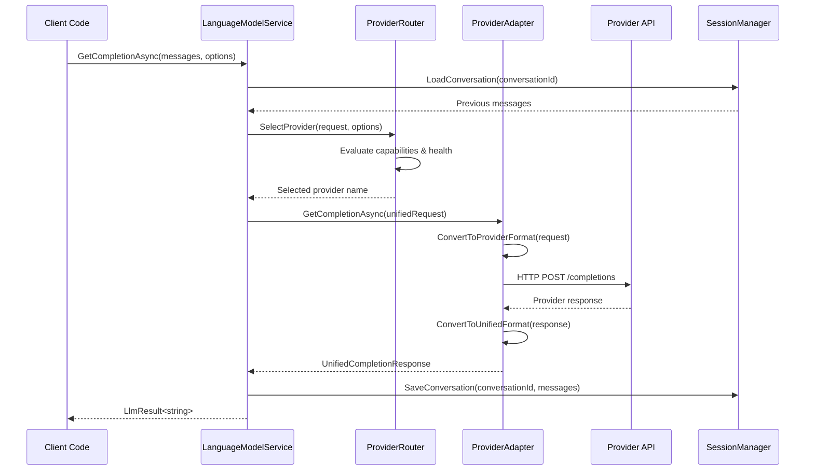

# Epic #246: Core Architecture Design

**Last Updated:** 2025-01-25
**Document Type:** Architecture Specification
**Epic Phase:** Foundation Implementation

> **Parent:** [`Epic #246`](./README.md)

## Purpose & Responsibility

This document defines the core architecture design for LanguageModelService v2, including primary service interfaces, component relationships, unified message protocols, and provider abstraction patterns that enable vendor-agnostic AI interactions.

## 1. Primary Service Interface Design

### 1.1 ILanguageModelService - Core Service Contract

The primary interface that abstracts all provider-specific implementations:

```csharp
/// <summary>
/// Primary interface for vendor-agnostic language model interactions.
/// Abstracts provider-specific implementations behind a unified API.
/// </summary>
public interface ILanguageModelService
{
    /// <summary>
    /// Get chat completion with automatic provider selection based on configuration.
    /// </summary>
    Task<LlmResult<string>> GetCompletionAsync(
        List<UnifiedChatMessage> messages,
        CompletionOptions? options = null,
        string? conversationId = null,
        CancellationToken cancellationToken = default);

    /// <summary>
    /// Get chat completion with explicit provider selection.
    /// </summary>
    Task<LlmResult<string>> GetCompletionAsync(
        List<UnifiedChatMessage> messages,
        string provider,
        CompletionOptions? options = null,
        string? conversationId = null,
        CancellationToken cancellationToken = default);

    /// <summary>
    /// Call function/tool with structured response parsing.
    /// </summary>
    Task<LlmResult<T>> CallToolAsync<T>(
        List<UnifiedChatMessage> messages,
        ToolDefinition toolDefinition,
        CompletionOptions? options = null,
        string? conversationId = null,
        CancellationToken cancellationToken = default);

    /// <summary>
    /// Get streaming chat completion response.
    /// </summary>
    IAsyncEnumerable<StreamingResponse> GetStreamingCompletionAsync(
        List<UnifiedChatMessage> messages,
        CompletionOptions? options = null,
        string? conversationId = null,
        CancellationToken cancellationToken = default);

    /// <summary>
    /// Get available providers and their capabilities.
    /// </summary>
    Task<Dictionary<string, ProviderCapabilities>> GetProviderCapabilitiesAsync();

    /// <summary>
    /// Health check for specific provider.
    /// </summary>
    Task<ProviderHealthStatus> CheckProviderHealthAsync(string provider);
}
```

### 1.2 Design Principles for Core Interface

**Backward Compatibility:**
- Maintains `LlmResult<T>` return type for seamless integration
- Preserves conversation ID patterns for session management
- Supports existing CancellationToken patterns

**Provider Abstraction:**
- No provider-specific types in interface signatures
- Unified message format hides provider differences
- Capability discovery enables intelligent routing

**Async-First Design:**
- All operations support async/await patterns
- CancellationToken propagation for resource management
- Streaming support for real-time applications

## 2. Provider Abstraction Layer

### 2.1 IProviderAdapter - Provider Abstraction

Standardizes provider implementations through adapter pattern:

```csharp
/// <summary>
/// Adapter interface for provider-specific implementations.
/// Handles conversion between unified format and provider-specific APIs.
/// </summary>
public interface IProviderAdapter
{
    /// <summary>
    /// Provider name (e.g., "OpenAI", "Anthropic", "Venice.AI").
    /// </summary>
    string ProviderName { get; }

    /// <summary>
    /// Provider capabilities and feature support.
    /// </summary>
    ProviderCapabilities Capabilities { get; }

    /// <summary>
    /// Check if provider is available and configured.
    /// </summary>
    Task<bool> IsAvailableAsync();

    /// <summary>
    /// Get chat completion from provider.
    /// </summary>
    Task<UnifiedCompletionResponse> GetCompletionAsync(
        UnifiedCompletionRequest request,
        CancellationToken cancellationToken = default);

    /// <summary>
    /// Get streaming completion from provider.
    /// </summary>
    IAsyncEnumerable<UnifiedStreamingChunk> GetStreamingCompletionAsync(
        UnifiedCompletionRequest request,
        CancellationToken cancellationToken = default);

    /// <summary>
    /// Get available models for this provider.
    /// </summary>
    Task<List<string>> GetAvailableModelsAsync();

    /// <summary>
    /// Validate configuration for this provider.
    /// </summary>
    Task<ConfigurationValidationResult> ValidateConfigurationAsync();
}
```

### 2.2 RestProviderAdapterBase - Common Implementation

Template method pattern for consistent provider implementation:

```csharp
/// <summary>
/// Base class for REST-based provider adapters providing common functionality.
/// </summary>
public abstract class RestProviderAdapterBase : IProviderAdapter
{
    protected readonly HttpClient HttpClient;
    protected readonly IProviderConfig Config;
    protected readonly ILogger Logger;
    protected readonly IMessageNormalizer MessageNormalizer;

    public abstract string ProviderName { get; }
    public abstract ProviderCapabilities Capabilities { get; }

    public async Task<UnifiedCompletionResponse> GetCompletionAsync(
        UnifiedCompletionRequest request,
        CancellationToken cancellationToken)
    {
        try
        {
            // Validate request against provider capabilities
            ValidateRequest(request);

            // Convert to provider-specific format
            var providerRequest = ConvertToProviderRequest(request);

            // Execute HTTP request with retry policy
            var httpResponse = await SendRequestToProvider(providerRequest, cancellationToken);

            // Convert response to unified format
            return ConvertToUnifiedResponse(httpResponse, request);
        }
        catch (Exception ex)
        {
            Logger.LogError(ex, "Provider {Provider} completion failed", ProviderName);
            throw MapToProviderException(ex);
        }
    }

    // Abstract methods each provider must implement
    protected abstract object ConvertToProviderRequest(UnifiedCompletionRequest request);
    protected abstract UnifiedCompletionResponse ConvertToUnifiedResponse(object response, UnifiedCompletionRequest request);
    protected abstract HttpRequestMessage CreateHttpRequest(object providerRequest);
    protected abstract void ValidateRequest(UnifiedCompletionRequest request);
    protected abstract ProviderException MapToProviderException(Exception exception);
}
```

### 2.3 SdkProviderAdapterBase - SDK-based Implementation

Provides a template for providers integrated via official SDKs (e.g., OpenAI):

```csharp
/// <summary>
/// Base class for SDK-based adapters providing common capabilities and error mapping.
/// </summary>
public abstract class SdkProviderAdapterBase : IProviderAdapter
{
    protected readonly ILogger Logger;
    protected readonly IMessageNormalizer MessageNormalizer;

    public abstract string ProviderName { get; }
    public abstract ProviderCapabilities Capabilities { get; }

    protected SdkProviderAdapterBase(ILogger logger, IMessageNormalizer messageNormalizer)
    {
        Logger = logger;
        MessageNormalizer = messageNormalizer;
    }

    public abstract Task<UnifiedCompletionResponse> GetCompletionAsync(
        UnifiedCompletionRequest request,
        CancellationToken cancellationToken = default);

    public virtual IAsyncEnumerable<UnifiedStreamingChunk> GetStreamingCompletionAsync(
        UnifiedCompletionRequest request,
        CancellationToken cancellationToken = default) =>
        throw new NotSupportedException("Streaming not implemented");

    public virtual Task<List<string>> GetAvailableModelsAsync() =>
        Task.FromResult(new List<string>());

    public virtual Task<ConfigurationValidationResult> ValidateConfigurationAsync() =>
        Task.FromResult(ConfigurationValidationResult.Success(ProviderName, "Validated"));

    public virtual Task<bool> IsAvailableAsync() => Task.FromResult(true);
}
```

## 3. Unified Message Protocol

### 3.1 UnifiedChatMessage - Common Message Format

Standard message format that adapters translate to/from provider-specific formats:

```csharp
/// <summary>
/// Unified chat message format that abstracts provider differences.
/// </summary>
public record UnifiedChatMessage
{
    /// <summary>
    /// Message role (system, user, assistant, tool).
    /// </summary>
    public required string Role { get; init; }

    /// <summary>
    /// Message content text.
    /// </summary>
    public string? Content { get; init; }

    /// <summary>
    /// Tool calls in this message (for assistant messages).
    /// </summary>
    public List<ToolCall>? ToolCalls { get; init; }

    /// <summary>
    /// Tool call ID this message responds to (for tool role messages).
    /// </summary>
    public string? ToolCallId { get; init; }

    /// <summary>
    /// Provider-specific metadata and extensions.
    /// </summary>
    public Dictionary<string, object>? Metadata { get; init; }

    /// <summary>
    /// Timestamp when message was created.
    /// </summary>
    public DateTimeOffset CreatedAt { get; init; } = DateTimeOffset.UtcNow;
}
```

### 3.2 Message Role Normalization

Handles provider differences in message role terminology:

```csharp
/// <summary>
/// Standard roles used in unified message format.
/// </summary>
public static class MessageRoles
{
    public const string System = "system";
    public const string User = "user";
    public const string Assistant = "assistant";
    public const string Tool = "tool";        // Unified role for tool responses
    public const string Function = "function"; // Legacy OpenAI role (mapped to Tool)
}

/// <summary>
/// Provider-specific role mappings.
/// </summary>
public class RoleMapping
{
    public static readonly Dictionary<string, Dictionary<string, string>> ProviderRoleMappings = new()
    {
        ["OpenAI"] = new Dictionary<string, string>
        {
            [MessageRoles.Tool] = "function",      // OpenAI uses "function" role
            [MessageRoles.Function] = "function"   // Direct mapping for legacy support
        },
        ["Anthropic"] = new Dictionary<string, string>
        {
            [MessageRoles.Tool] = "tool",          // Claude uses "tool" role
            [MessageRoles.Function] = "tool"       // Map legacy function to tool
        },
        ["Venice.AI"] = new Dictionary<string, string>
        {
            [MessageRoles.Tool] = "tool",          // Venice.AI follows Claude pattern
            [MessageRoles.Function] = "tool"
        }
    };
}
```

## 4. Component Architecture Relationships

### 4.1 Component Interaction Flow



### 4.2 Dependency Injection Configuration

Integration with existing DI container patterns:

```csharp
/// <summary>
/// Extension methods for configuring LanguageModelService v2 in DI container.
/// </summary>
public static class ServiceCollectionExtensions
{
    public static IServiceCollection AddLanguageModelServiceV2(
        this IServiceCollection services,
        IConfiguration configuration)
    {
        // Configure main service
        services.Configure<LanguageModelServiceConfig>(
            configuration.GetSection("LanguageModelService"));

        services.AddScoped<ILanguageModelService, LanguageModelService>();

        // Configure supporting services
        services.AddScoped<IProviderRouter, ProviderRouter>();
        services.AddScoped<IMessageNormalizer, MessageNormalizer>();
        services.AddScoped<IProviderAdapterFactory, ProviderAdapterFactory>();

        // Register in-scope provider adapters (Epic 246 scope)
        services.AddScoped<IProviderAdapter, OpenAIProviderAdapter>(); // SDK-based
        services.AddScoped<IProviderAdapter, VeniceAIProviderAdapter>(); // REST-based

        // Configure HttpClient for each provider
        services.AddHttpClient<OpenAIProviderAdapter>(client =>
        {
            client.BaseAddress = new Uri("https://api.openai.com/v1/");
        });

        services.AddHttpClient<VeniceAIProviderAdapter>(client =>
        {
            client.BaseAddress = new Uri("https://api.venice.ai/v1/");
        });

        // Backward compatibility (transitional only; removed by epic completion)
        services.AddScoped<ILegacyLlmServiceAdapter, LegacyLlmServiceAdapter>();

        return services;
    }
}
```

## 5. Provider Capability System

### 5.1 ProviderCapabilities Definition

Enables intelligent routing based on provider features:

```csharp
/// <summary>
/// Describes what features and capabilities a provider supports.
/// </summary>
public record ProviderCapabilities
{
    /// <summary>
    /// Whether provider supports function/tool calling.
    /// </summary>
    public bool SupportsToolCalling { get; init; }

    /// <summary>
    /// Whether provider supports streaming responses.
    /// </summary>
    public bool SupportsStreaming { get; init; }

    /// <summary>
    /// Whether provider supports strict schema validation.
    /// </summary>
    public bool SupportsStrictMode { get; init; }

    /// <summary>
    /// Supported message roles.
    /// </summary>
    public List<string> SupportedRoles { get; init; } = new();

    /// <summary>
    /// Maximum tokens per request.
    /// </summary>
    public int MaxTokens { get; init; }

    /// <summary>
    /// Available models for this provider.
    /// </summary>
    public List<string> AvailableModels { get; init; } = new();

    /// <summary>
    /// Provider-specific features.
    /// </summary>
    public Dictionary<string, bool> Features { get; init; } = new();
}
```

### 5.2 Provider-Specific Capabilities

```csharp
/// <summary>
/// Provider capability definitions.
/// </summary>
public static class ProviderCapabilityDefinitions
{
    public static readonly ProviderCapabilities OpenAI = new()
    {
        SupportsToolCalling = true,
        SupportsStreaming = true,
        SupportsStrictMode = true,
        SupportedRoles = ["system", "user", "assistant", "function"],
        MaxTokens = 128000,
        AvailableModels = ["gpt-4", "gpt-4-turbo", "gpt-3.5-turbo"],
        Features = new Dictionary<string, bool>
        {
            ["ResponseFormats"] = true,
            ["BatchRequests"] = true,
            ["FunctionCallingStrict"] = true
        }
    };

    public static readonly ProviderCapabilities Anthropic = new()
    {
        SupportsToolCalling = true,
        SupportsStreaming = true,
        SupportsStrictMode = false,
        SupportedRoles = ["system", "user", "assistant", "tool"],
        MaxTokens = 200000,
        AvailableModels = ["claude-3-opus", "claude-3-sonnet", "claude-3-haiku"],
        Features = new Dictionary<string, bool>
        {
            ["LongContext"] = true,
            ["MultiModal"] = true,
            ["ToolUse"] = true
        }
    };
}
```

## 6. Error Handling Architecture

### 6.1 Provider Exception Hierarchy

Standardized exception handling across providers:

```csharp
/// <summary>
/// Base exception for provider-related errors.
/// </summary>
public abstract class ProviderException : Exception
{
    public string ProviderName { get; }
    public string? ErrorCode { get; }
    public Dictionary<string, object>? Metadata { get; }

    protected ProviderException(
        string providerName,
        string message,
        string? errorCode = null,
        Exception? innerException = null)
        : base(message, innerException)
    {
        ProviderName = providerName;
        ErrorCode = errorCode;
        Metadata = new Dictionary<string, object>();
    }
}

/// <summary>
/// Exception thrown when provider is unavailable.
/// </summary>
public class ProviderUnavailableException : ProviderException
{
    public ProviderUnavailableException(string providerName, string message)
        : base(providerName, message, "PROVIDER_UNAVAILABLE") { }
}

/// <summary>
/// Exception thrown when API rate limits are exceeded.
/// </summary>
public class RateLimitExceededException : ProviderException
{
    public TimeSpan? RetryAfter { get; }

    public RateLimitExceededException(
        string providerName,
        string message,
        TimeSpan? retryAfter = null)
        : base(providerName, message, "RATE_LIMIT_EXCEEDED")
    {
        RetryAfter = retryAfter;
    }
}
```

## 7. Backward Compatibility Layer

### 7.1 Legacy Interface Adapter

Preserves existing ILlmService interface during migration:

```csharp
/// <summary>
/// Adapter that implements the legacy ILlmService interface using the new architecture.
/// Provides backward compatibility for existing code.
/// </summary>
public class LegacyLlmServiceAdapter : ILlmService
{
    private readonly ILanguageModelService _modernService;
    private readonly ILogger<LegacyLlmServiceAdapter> _logger;
    private string _defaultProvider = "OpenAI";

    public LegacyLlmServiceAdapter(
        ILanguageModelService modernService,
        ILogger<LegacyLlmServiceAdapter> logger)
    {
        _modernService = modernService;
        _logger = logger;
    }

    public void UseProvider(string providerName)
    {
        _defaultProvider = providerName;
    }

    // Implement existing ILlmService methods by converting to new format
    public async Task<LlmResult<string>> GetCompletionAsync(
        List<ChatMessage> messages,
        string? conversationId = null,
        CancellationToken cancellationToken = default)
    {
        // Convert legacy ChatMessage to UnifiedChatMessage
        var unifiedMessages = messages.Select(ConvertToUnifiedMessage).ToList();

        // Use new service with default provider
        return await _modernService.GetCompletionAsync(
            unifiedMessages,
            _defaultProvider,
            options: null,
            conversationId,
            cancellationToken);
    }

    private UnifiedChatMessage ConvertToUnifiedMessage(ChatMessage legacyMessage)
    {
        return new UnifiedChatMessage
        {
            Role = legacyMessage.Role,
            Content = legacyMessage.Content,
            // Map other properties as needed
        };
    }
}
```

## 8. Performance Considerations

### 8.1 Connection Management

Optimized HTTP client usage for provider connections:

```csharp
/// <summary>
/// HTTP client configuration for optimal provider performance.
/// </summary>
public class ProviderHttpClientConfiguration
{
    public static void ConfigureHttpClient(HttpClient client, IProviderConfig config)
    {
        client.Timeout = TimeSpan.FromSeconds(config.TimeoutSeconds);
        client.DefaultRequestHeaders.Add("User-Agent", "Zarichney-API/2.0");

        // Provider-specific headers
        if (config is OpenAIProviderConfig openAIConfig)
        {
            client.DefaultRequestHeaders.Authorization =
                new AuthenticationHeaderValue("Bearer", openAIConfig.ApiKey);
        }

        // Connection pooling optimization
        ServicePointManager.DefaultConnectionLimit = 10;
        ServicePointManager.MaxServicePointIdleTime = 30000;
    }
}
```

### 8.2 Async/Await Optimization

Efficient async patterns for provider operations:

```csharp
/// <summary>
/// Optimized async patterns for provider operations.
/// </summary>
public class AsyncOptimizations
{
    // Use ConfigureAwait(false) for library code
    public async Task<UnifiedCompletionResponse> GetCompletionOptimizedAsync(
        UnifiedCompletionRequest request,
        CancellationToken cancellationToken)
    {
        var httpResponse = await SendRequestAsync(request, cancellationToken)
            .ConfigureAwait(false);

        var response = await ParseResponseAsync(httpResponse, cancellationToken)
            .ConfigureAwait(false);

        return response;
    }

    // Parallel capability checking for multiple providers
    public async Task<Dictionary<string, ProviderCapabilities>> GetAllCapabilitiesAsync(
        IEnumerable<IProviderAdapter> providers)
    {
        var tasks = providers.Select(async provider => new
        {
            Provider = provider.ProviderName,
            Capabilities = provider.Capabilities
        });

        var results = await Task.WhenAll(tasks).ConfigureAwait(false);

        return results.ToDictionary(r => r.Provider, r => r.Capabilities);
    }
}
```

## Implementation Guidelines

### Design Pattern Usage
- **Adapter Pattern**: Isolate provider differences behind common interface
- **Template Method Pattern**: Common functionality in base classes with provider-specific overrides
- **Factory Pattern**: Create provider adapters based on configuration
- **Strategy Pattern**: Provider selection based on capabilities and configuration

### Code Quality Standards
- All interfaces must support async/await with CancellationToken
- Provider adapters must implement comprehensive error handling
- Configuration classes must use IOptions pattern for validation
- All provider communications must include correlation IDs for tracing

### Testing Requirements
- Unit tests for all interface implementations with mock providers
- Integration tests for each provider adapter with real API calls
- Contract tests to validate provider adapter compliance
- Performance tests for async operations and connection management

---

**🗂️ WORKING DIRECTORY ARTIFACT CREATED:**
- **Filename:** 01-architecture-design.md
- **Purpose:** Core architecture specification detailing primary service interfaces, provider abstraction patterns, and unified message protocols
- **Context for Team:** Foundational architecture document providing interface contracts and design patterns for CodeChanger implementation
- **Dependencies:** Builds upon language-model-service-v2-architecture.md and interface-contracts-design.md from working directory
- **Next Actions:** Create provider integration specification (02) and detailed component specifications
