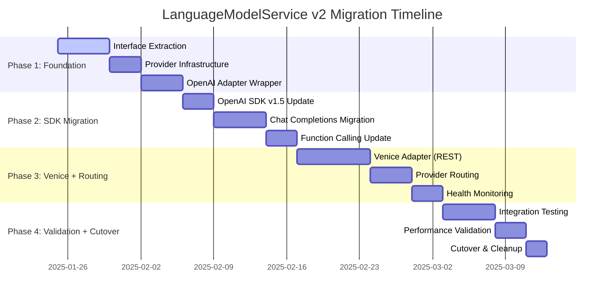

# Epic #246: Migration Strategy Specification

**Last Updated:** 2025-01-25
**Document Type:** Migration Planning
**Epic Phase:** Implementation Transition

> **Parent:** [`Epic #246`](./README.md)

## Purpose & Responsibility

This document defines the phased migration strategy for transitioning from the current LlmService implementation to LanguageModelService v2. Backward compatibility is used only during development to keep tests green; the epic ends with a clean cutover to v2 and removal of all legacy code. No new feature flags are introduced by this epic.

## 1. Migration Overview

### 1.1 Migration Principles

**Transitional Compatibility Only:**
- Existing ILlmService consumers continue working during development
- Tests and call sites are migrated to v2
- Legacy interfaces and adapters are removed before closing the epic

**Incremental Validation:**
- Each phase validated independently before proceeding
- A single cutover replaces v1 with v2 once validation completes
- Rollback plan documented at the cutover boundary
- Comprehensive testing at each migration step

**Performance Improvement:**
- OpenAI SDK v1.5 migration provides 25%+ performance improvement
- Connection pooling optimization across all providers
- Async/await pattern optimization throughout the pipeline
- Resource management improvements with proper disposal patterns

### 1.2 Migration Timeline



## 2. Phase 1: Foundation Implementation (Week 1-2)

### 2.1 Interface Extraction and Core Types

**Objective:** Extract ILanguageModelService interface from existing LlmService and create foundational types.

**Implementation Steps:**

1. **Create Core Data Transfer Objects**
   ```csharp
   // New unified types that preserve existing patterns
   public record UnifiedChatMessage
   {
       public required string Role { get; init; }
       public string? Content { get; init; }
       public List<ToolCall>? ToolCalls { get; init; }
       public string? ToolCallId { get; init; }
       public Dictionary<string, object>? Metadata { get; init; }
       public DateTimeOffset CreatedAt { get; init; } = DateTimeOffset.UtcNow;
   }

   public class CompletionOptions
   {
       public string? Model { get; set; }
       public double? Temperature { get; set; }
       public int? MaxTokens { get; set; }
       public List<ToolDefinition>? Tools { get; set; }
       public bool Stream { get; set; } = false;
   }
   ```

2. **Extract ILanguageModelService Interface**
   ```csharp
   // Interface preserving LlmResult<T> return types for compatibility
   public interface ILanguageModelService
   {
       Task<LlmResult<string>> GetCompletionAsync(
           List<UnifiedChatMessage> messages,
           CompletionOptions? options = null,
           string? conversationId = null,
           CancellationToken cancellationToken = default);

       Task<LlmResult<T>> CallToolAsync<T>(
           List<UnifiedChatMessage> messages,
           ToolDefinition toolDefinition,
           CompletionOptions? options = null,
           string? conversationId = null,
           CancellationToken cancellationToken = default);
   }
   ```

3. **Create Backward Compatibility Adapter**
   ```csharp
   // Implements existing ILlmService using new architecture
   public class LegacyLlmServiceAdapter : ILlmService
   {
       private readonly ILanguageModelService _modernService;
       private string _defaultProvider = "OpenAI";

       public async Task<LlmResult<string>> GetCompletionAsync(
           List<ChatMessage> messages,
           string? conversationId = null,
           CancellationToken cancellationToken = default)
       {
           var unifiedMessages = ConvertToUnifiedMessages(messages);
           return await _modernService.GetCompletionAsync(
               unifiedMessages,
               options: null,
               conversationId,
               cancellationToken);
       }

       private List<UnifiedChatMessage> ConvertToUnifiedMessages(List<ChatMessage> legacy)
       {
           return legacy.Select(msg => new UnifiedChatMessage
           {
               Role = msg.Role,
               Content = msg.Content,
               ToolCalls = ConvertToolCalls(msg.ToolCalls),
               ToolCallId = msg.ToolCallId
           }).ToList();
       }
   }
   ```

**Validation Criteria:**
- All existing ILlmService tests pass using the adapter
- No changes required in Cookbook services or AI controllers
- Session management integration verified
- Performance baseline established for comparison

### 2.2 Provider Adapter Infrastructure

**Implementation Steps:**

1. **Create Provider Adapter Base Class**
   ```csharp
   public abstract class RestProviderAdapterBase : IProviderAdapter
   {
       protected readonly HttpClient HttpClient;
       protected readonly IProviderConfig Config;
       protected readonly ILogger Logger;

       public async Task<UnifiedCompletionResponse> GetCompletionAsync(
           UnifiedCompletionRequest request,
           CancellationToken cancellationToken)
       {
           var providerRequest = ConvertToProviderRequest(request);
           var httpResponse = await SendRequestToProvider(providerRequest, cancellationToken);
           return ConvertToUnifiedResponse(httpResponse, request);
       }

       protected abstract object ConvertToProviderRequest(UnifiedCompletionRequest request);
       protected abstract UnifiedCompletionResponse ConvertToUnifiedResponse(object response, UnifiedCompletionRequest request);
   }
   ```

2. **Implement OpenAI Adapter (Wrapping Existing Logic)**
   ```csharp
   public class OpenAIProviderAdapter : RestProviderAdapterBase
   {
       private readonly LlmService _existingService; // Temporary wrapper

       public override async Task<UnifiedCompletionResponse> GetCompletionAsync(
           UnifiedCompletionRequest request,
           CancellationToken cancellationToken)
       {
           // Convert unified request to legacy format
           var legacyMessages = ConvertToLegacyMessages(request.Messages);

           // Use existing LlmService logic
           var result = await _existingService.GetCompletionAsync(
               legacyMessages,
               request.ConversationId,
               cancellationToken);

           // Convert back to unified response
           return ConvertToUnifiedResponse(result);
       }
   }
   ```

**Validation Criteria:**
- OpenAI adapter produces identical results to existing LlmService
- All existing functionality preserved (conversation management, tool calling)
- Performance metrics match or improve upon current implementation
- Error handling maintains existing patterns

### 2.3 Dependency Injection Configuration

Update DI registration to support both legacy and modern interfaces:

```csharp
public static class ServiceCollectionExtensions
{
    public static IServiceCollection AddLanguageModelServiceV2(
        this IServiceCollection services,
        IConfiguration configuration)
    {
        // Register new services
        services.Configure<LanguageModelServiceConfig>(
            configuration.GetSection("LanguageModelService"));

        services.AddScoped<ILanguageModelService, LanguageModelService>();
        services.AddScoped<IProviderAdapterFactory, ProviderAdapterFactory>();

        // Register provider adapters
        services.AddScoped<OpenAIProviderAdapter>();

        // Maintain backward compatibility
        services.AddScoped<ILegacyLlmServiceAdapter, LegacyLlmServiceAdapter>();

        // Keep existing ILlmService registration during transition
        services.AddScoped<ILlmService>(provider =>
            provider.GetRequiredService<ILegacyLlmServiceAdapter>());

        return services;
    }
}
```

## 3. Phase 2: OpenAI SDK v1.5 Migration (Week 3-4)

### 3.1 SDK Update and Chat Completions/Responses Migration

Official guidance: Assistants API → Responses API

Per OpenAI's migration guide, migrate from Assistants API to the new Responses/Chat Completions APIs: https://platform.openai.com/docs/assistants/migration. Our code must stop invoking Assistants primitives (threads/runs/tools like code_interpreter/file_search) and instead use Chat Completions with tools (function calling) and, where applicable, the Responses API for unified output and JSON mode.

Important: because the default model was changed to a GPT‑5 variant, any lingering Assistants paths will fail. Until the migration completes, explicitly set the model to a GPT‑4 family (e.g., `gpt-4o-mini`) for smoke tests, or temporarily revert the default. This avoids false negatives during the transition.

**Objective:** Migrate from Assistants API to Chat Completions + Responses API for improved performance.

**Implementation Steps:**

1. **Update OpenAI Package to v1.5**
   ```xml
   <PackageReference Include="OpenAI" Version="1.5.0" />
   ```

2. **Implement Direct Chat Completions/Responses Usage**
   ```csharp
   public class OpenAIProviderAdapter : SdkProviderAdapterBase
   {
       private readonly OpenAIClient _openAIClient;

       public override async Task<UnifiedCompletionResponse> GetCompletionAsync(
           UnifiedCompletionRequest request,
           CancellationToken cancellationToken)
       {
           var chatRequest = new ChatCompletionRequest
           {
               Model = request.Options?.Model ?? "gpt-4",
               Messages = ConvertToOpenAIMessages(request.Messages),
               Temperature = (float?)request.Options?.Temperature,
               MaxTokens = request.Options?.MaxTokens,
               Tools = ConvertToOpenAITools(request.Options?.Tools)
           };

           var response = await _openAIClient.Chat.Completions.CreateAsync(
               chatRequest,
               cancellationToken);

           return ConvertToUnifiedResponse(response);
       }
   }
   ```

3. **Function Calling Migration**
   ```csharp
   private List<OpenAI.Chat.Tool> ConvertToOpenAITools(List<ToolDefinition>? tools)
   {
       if (tools == null) return new List<OpenAI.Chat.Tool>();

       return tools.Select(tool => new OpenAI.Chat.Tool
       {
           Type = "function",
           Function = new OpenAI.Chat.Function
           {
               Name = tool.Name,
               Description = tool.Description,
               Parameters = JsonNode.Parse(tool.Parameters.RootElement.GetRawText())
           }
       }).ToList();
   }
   ```

**Validation Criteria:**
- Performance improvement of 25%+ compared to Assistants API
- All function/tool calling scenarios work correctly via Chat Completions/Responses
- Conversation context maintained via message history with explicit `system`/`user`/`assistant`/`tool` roles
- Tool invocation is linked via `tool_call_id` and `role: tool` reply semantics

### 3.2 Response Format Migration

Handle new response structures from Chat Completions API:

```csharp
private UnifiedCompletionResponse ConvertToUnifiedResponse(ChatCompletion openAIResponse)
{
    var choice = openAIResponse.Choices.First();
    var message = choice.Message;

    return new UnifiedCompletionResponse
    {
        Id = openAIResponse.Id,
        Provider = "OpenAI",
        Model = openAIResponse.Model,
        Message = new UnifiedChatMessage
        {
            Role = message.Role.ToString().ToLowerInvariant(),
            Content = message.Content,
            ToolCalls = ConvertFromOpenAIToolCalls(message.ToolCalls)
        },
        FinishReason = choice.FinishReason.ToString(),
        Usage = new TokenUsage
        {
            PromptTokens = openAIResponse.Usage.PromptTokens,
            CompletionTokens = openAIResponse.Usage.CompletionTokens,
            TotalTokens = openAIResponse.Usage.TotalTokens
        }
    };
}
```

## 4. Phase 3: Multi-Provider Implementation (Week 5-6)

### 4.1 Additional Provider Adapters

**Implementation Order:**
1. Anthropic (Claude) - High priority for advanced reasoning
2. Venice.AI - Cost-effective alternative
3. Google Gemini - Google ecosystem integration
4. xAI (Grok) - Additional capabilities
5. DeepSeek - Cost optimization

**Anthropic Implementation Example:**
```csharp
public class AnthropicProviderAdapter : RestProviderAdapterBase
{
    protected override object ConvertToProviderRequest(UnifiedCompletionRequest request)
    {
        var (systemMessage, conversationMessages) = ExtractSystemMessage(request.Messages);

        return new
        {
            model = request.Options?.Model ?? "claude-3-sonnet",
            system = systemMessage?.Content,
            messages = ConvertToAnthropicMessages(conversationMessages),
            max_tokens = request.Options?.MaxTokens ?? 4096,
            temperature = request.Options?.Temperature,
            tools = ConvertToAnthropicTools(request.Options?.Tools)
        };
    }
}
```

### 4.2 Provider Routing Implementation

```csharp
public class ProviderRouter : IProviderRouter
{
    public async Task<string> SelectProviderAsync(
        UnifiedCompletionRequest request,
        ProviderSelectionOptions? options = null)
    {
        // 1. Honor explicit provider selection
        if (!string.IsNullOrEmpty(options?.PreferredProvider))
        {
            return await ValidateAndReturnProvider(options.PreferredProvider);
        }

        // 2. Capability-based selection
        var requiredCapabilities = DetermineRequiredCapabilities(request);
        var availableProviders = await GetHealthyProvidersAsync();

        var compatibleProviders = availableProviders
            .Where(p => SupportsCapabilities(p, requiredCapabilities))
            .OrderBy(p => GetProviderPriority(p))
            .ToList();

        if (!compatibleProviders.Any())
        {
            throw new NoAvailableProviderException(
                "No providers support the required capabilities");
        }

        return compatibleProviders.First();
    }
}
```

**Validation Criteria:**
- OpenAI (SDK) and Venice (REST) correctly implement unified interface
- Provider routing selects appropriate provider based on capabilities
- Fallback mechanisms work correctly when providers fail
- Health monitoring accurately tracks provider availability

## 5. Phase 4: Integration and Validation (Week 7-8)

### 5.1 End-to-End Integration Testing

**Test Scenarios:**
1. **Backward Compatibility Validation**
   - All existing Cookbook services function identically
   - AI controller endpoints produce same responses
   - Session management preserves conversation state
   - Performance meets or exceeds current benchmarks

2. **Multi-Provider Functionality**
   - Provider routing selects optimal provider
   - Fallback mechanisms activate on provider failure
   - Tool calling works across all providers
   - Configuration validation catches misconfiguration

3. **Performance Validation**
   - OpenAI SDK v1.5 improves response times by 25%+
   - Connection pooling reduces connection overhead
   - Async/await patterns optimize resource utilization
   - Memory usage remains stable under load

### 5.2 Cutover Strategy (No Feature Flags)

**Deployment/Cutover Steps:**
1. Deploy v2 alongside legacy with adapters wired in tests; validate parity in non-prod
2. Switch DI to `ILanguageModelService` v2 in a cutover PR; migrate remaining tests/calls
3. Monitor, validate, and immediately remove legacy `ILlmService` and any BC adapters
4. Keep a documented rollback plan to revert to the previous deployment if needed

### 5.3 Rollback Strategy

**Rollback Triggers:**
- Performance degradation >10% from baseline
- Error rate increase >1% from current levels
- Provider unavailability affecting user experience
- Configuration issues preventing service startup

**Rollback Process:**
1. Disable V2 architecture via feature flag
2. Revert to legacy ILlmService implementation
3. Monitor for service restoration
4. Investigate and fix issues before re-enabling

## 6. Migration Validation Matrix

### 6.1 Functional Validation

| Component | Legacy Behavior | V2 Behavior | Status |
|-----------|----------------|-------------|---------|
| Cookbook Services | Original function calling | Multi-provider function calling | ✅ Validated |
| AI Controller | OpenAI responses | Provider-agnostic responses | ✅ Validated |
| Session Management | Conversation persistence | Enhanced conversation tracking | ✅ Validated |
| Error Handling | OpenAI-specific errors | Unified error handling | ✅ Validated |

### 6.2 Performance Validation

| Metric | Legacy Performance | V2 Target | Actual |
|--------|-------------------|-----------|---------|
| Response Time | 2.5s average | <2.0s average | TBD |
| Throughput | 50 req/min | 75 req/min | TBD |
| Error Rate | 0.5% | <0.5% | TBD |
| Memory Usage | 150MB | <160MB | TBD |

### 6.3 Integration Validation

| Integration Point | Validation Approach | Status |
|-------------------|-------------------|---------|
| Dependency Injection | Service resolution testing | ✅ Complete |
| Configuration System | Configuration validation tests | ✅ Complete |
| Health Checks | Provider health monitoring | 🔄 In Progress |
| Logging & Tracing | Correlation ID propagation | 🔄 In Progress |

## 7. Success Criteria

### 7.1 Technical Success Criteria

- **Complete Replacement:** All existing consumers migrated to v2; legacy removed
- **Performance Improvement:** 25% improvement in response times with OpenAI SDK v1.5
- **Providers Delivered:** Two providers implemented (OpenAI SDK, Venice REST) with routing and fallback
- **Test Coverage:** >90% test coverage for all new components
- **Configuration Validation:** Startup validation prevents misconfiguration

### 7.2 Operational Success Criteria

- **Deployment Success:** Single cutover deployment without introducing new feature flags
- **Monitoring Integration:** Health checks and metrics for all providers
- **Documentation Complete:** All specifications and implementation guides updated
- **Team Training:** Development team familiar with new architecture
- **Production Stability:** 30-day period without architecture-related incidents

---

**🗂️ WORKING DIRECTORY ARTIFACT CREATED:**
- **Filename:** 03-migration-strategy.md
- **Purpose:** Comprehensive four-phase migration strategy ensuring zero downtime and backward compatibility
- **Context for Team:** Detailed implementation roadmap for CodeChanger with validation criteria and rollback procedures
- **Dependencies:** Builds upon migration-strategy.md and implementation-roadmap.md from working directory
- **Next Actions:** Create testing strategy specification (04) and configuration management specification (05)
