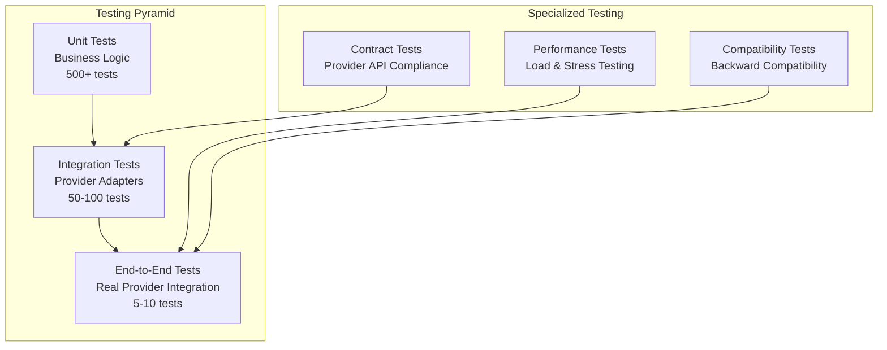

# Epic #246: Testing Strategy Specification

**Last Updated:** 2025-01-25
**Document Type:** Testing Framework Design
**Epic Phase:** Quality Assurance

> **Parent:** [`Epic #246`](./README.md)

## Purpose & Responsibility

This document defines the comprehensive testing strategy for LanguageModelService v2, covering unit testing, integration testing, contract testing, and performance validation to achieve >90% test coverage while ensuring provider adapter compliance and backward compatibility validation.

Scope Note (Epic 246): integration/contract tests target OpenAI (SDK) and Venice.AI (REST). Additional providers will be added in future epics.

## 1. Testing Architecture Overview

### 1.1 Testing Pyramid Structure



### 1.2 Test Coverage Goals

**Coverage Targets:**
- **Overall Coverage:** >90% for Epic #246 components
- **Unit Test Coverage:** >95% for business logic and adapters
- **Integration Test Coverage:** 100% of provider adapters
- **Contract Test Coverage:** 100% of provider API integrations
- **Backward Compatibility:** 100% of existing ILlmService functionality

**Quality Gates:**
- All tests must pass before PR merge
- Performance tests must meet baseline requirements
- Contract tests must validate provider API compliance
- Backward compatibility tests must verify zero breaking changes

## 2. Unit Testing Strategy

### 2.1 Core Service Testing

**ILanguageModelService Implementation Testing:**

```csharp
[TestFixture]
public class LanguageModelServiceTests
{
    private Mock<IProviderRouter> _mockRouter;
    private Mock<IProviderAdapterFactory> _mockFactory;
    private Mock<ISessionManager> _mockSessionManager;
    private LanguageModelService _service;

    [SetUp]
    public void Setup()
    {
        _mockRouter = new Mock<IProviderRouter>();
        _mockFactory = new Mock<IProviderAdapterFactory>();
        _mockSessionManager = new Mock<ISessionManager>();

        _service = new LanguageModelService(
            _mockRouter.Object,
            _mockFactory.Object,
            _mockSessionManager.Object,
            Mock.Of<ILogger<LanguageModelService>>());
    }

    [Test]
    public async Task GetCompletionAsync_WithDefaultProvider_SelectsProviderAndReturnsResult()
    {
        // Arrange
        var messages = CreateTestMessages();
        var mockAdapter = new Mock<IProviderAdapter>();
        var expectedResponse = CreateExpectedResponse();

        _mockRouter.Setup(r => r.SelectProviderAsync(It.IsAny<UnifiedCompletionRequest>(), null))
                  .ReturnsAsync("OpenAI");

        _mockFactory.Setup(f => f.CreateAdapter("OpenAI"))
                   .Returns(mockAdapter.Object);

        mockAdapter.Setup(a => a.GetCompletionAsync(It.IsAny<UnifiedCompletionRequest>(), It.IsAny<CancellationToken>()))
                  .ReturnsAsync(expectedResponse);

        // Act
        var result = await _service.GetCompletionAsync(messages);

        // Assert
        Assert.That(result.IsSuccess, Is.True);
        Assert.That(result.Data, Is.EqualTo(expectedResponse.Message.Content));

        _mockRouter.Verify(r => r.SelectProviderAsync(It.IsAny<UnifiedCompletionRequest>(), null), Times.Once);
        mockAdapter.Verify(a => a.GetCompletionAsync(It.IsAny<UnifiedCompletionRequest>(), It.IsAny<CancellationToken>()), Times.Once);
    }

    [Test]
    public async Task GetCompletionAsync_WithProviderFailure_AttemptsFailover()
    {
        // Arrange
        var messages = CreateTestMessages();
        var mockAdapter = new Mock<IProviderAdapter>();

        _mockRouter.Setup(r => r.SelectProviderAsync(It.IsAny<UnifiedCompletionRequest>(), null))
                  .ReturnsAsync("OpenAI");

        _mockFactory.Setup(f => f.CreateAdapter("OpenAI"))
                   .Returns(mockAdapter.Object);

        mockAdapter.Setup(a => a.GetCompletionAsync(It.IsAny<UnifiedCompletionRequest>(), It.IsAny<CancellationToken>()))
                  .ThrowsAsync(new ProviderUnavailableException("OpenAI", "Service unavailable"));

        _mockRouter.Setup(r => r.GetFallbackProviderAsync("OpenAI", It.IsAny<UnifiedCompletionRequest>()))
                  .ReturnsAsync("Anthropic");

        // Act & Assert
        var ex = await Assert.ThrowsAsync<ProviderUnavailableException>(
            () => _service.GetCompletionAsync(messages));

        _mockRouter.Verify(r => r.GetFallbackProviderAsync("OpenAI", It.IsAny<UnifiedCompletionRequest>()), Times.Once);
    }
}
```

### 2.2 Provider Adapter Testing

**Provider Adapter Unit Tests with Mocked HTTP:**

```csharp
[TestFixture]
public class OpenAIProviderAdapterTests
{
    private Mock<HttpMessageHandler> _mockHttpHandler;
    private HttpClient _httpClient;
    private Mock<IOptions<OpenAIProviderConfig>> _mockConfig;
    private OpenAIProviderAdapter _adapter;

    [SetUp]
    public void Setup()
    {
        _mockHttpHandler = new Mock<HttpMessageHandler>();
        _httpClient = new HttpClient(_mockHttpHandler.Object)
        {
            BaseAddress = new Uri("https://api.openai.com/v1/")
        };

        var config = new OpenAIProviderConfig
        {
            ApiKey = "test-key",
            DefaultModel = "gpt-4",
            TimeoutSeconds = 30
        };

        _mockConfig = new Mock<IOptions<OpenAIProviderConfig>>();
        _mockConfig.Setup(c => c.Value).Returns(config);

        _adapter = new OpenAIProviderAdapter(
            _httpClient,
            _mockConfig.Object,
            Mock.Of<ILogger<OpenAIProviderAdapter>>());
    }

    [Test]
    public async Task GetCompletionAsync_WithValidRequest_ReturnsUnifiedResponse()
    {
        // Arrange
        var request = CreateTestRequest();
        var openAIResponse = CreateMockOpenAIResponse();

        _mockHttpHandler.SetupRequest(HttpMethod.Post, "https://api.openai.com/v1/chat/completions")
                       .ReturnsJsonResponse(openAIResponse);

        // Act
        var result = await _adapter.GetCompletionAsync(request, CancellationToken.None);

        // Assert
        Assert.That(result.Provider, Is.EqualTo("OpenAI"));
        Assert.That(result.Message.Content, Is.EqualTo("Test response"));
        Assert.That(result.Usage.TotalTokens, Is.EqualTo(100));
    }

    [Test]
    public async Task GetCompletionAsync_WithToolCalls_ConvertsToolCallsCorrectly()
    {
        // Arrange
        var request = CreateTestRequestWithTools();
        var openAIResponseWithTools = CreateMockOpenAIResponseWithTools();

        _mockHttpHandler.SetupRequest(HttpMethod.Post, "https://api.openai.com/v1/chat/completions")
                       .ReturnsJsonResponse(openAIResponseWithTools);

        // Act
        var result = await _adapter.GetCompletionAsync(request, CancellationToken.None);

        // Assert
        Assert.That(result.Message.ToolCalls, Is.Not.Null);
        Assert.That(result.Message.ToolCalls.Count, Is.EqualTo(1));
        Assert.That(result.Message.ToolCalls[0].Function.Name, Is.EqualTo("get_weather"));
    }
}
```

### 2.3 Message Normalization Testing

**Message Format Conversion Testing:**

```csharp
[TestFixture]
public class MessageNormalizerTests
{
    private MessageNormalizer _normalizer;

    [SetUp]
    public void Setup()
    {
        _normalizer = new MessageNormalizer(Mock.Of<ILogger<MessageNormalizer>>());
    }

    [Test]
    public void ConvertToProviderFormat_OpenAI_MapsRolesCorrectly()
    {
        // Arrange
        var unifiedMessages = new List<UnifiedChatMessage>
        {
            new() { Role = MessageRoles.Tool, Content = "Tool response", ToolCallId = "call_123" }
        };

        // Act
        var result = _normalizer.ConvertToProviderFormat(unifiedMessages, "OpenAI") as List<OpenAIMessage>;

        // Assert
        Assert.That(result[0].Role, Is.EqualTo("function"));
        Assert.That(result[0].Content, Is.EqualTo("Tool response"));
        Assert.That(result[0].ToolCallId, Is.EqualTo("call_123"));
    }

    [Test]
    public void ConvertToProviderFormat_Anthropic_HandlesSystemMessagesSeparately()
    {
        // Arrange
        var unifiedMessages = new List<UnifiedChatMessage>
        {
            new() { Role = MessageRoles.System, Content = "You are a helpful assistant" },
            new() { Role = MessageRoles.User, Content = "Hello" }
        };

        // Act
        var result = _normalizer.ConvertToProviderFormat(unifiedMessages, "Anthropic") as AnthropicRequest;

        // Assert
        Assert.That(result.System, Is.EqualTo("You are a helpful assistant"));
        Assert.That(result.Messages.Count, Is.EqualTo(1));
        Assert.That(result.Messages[0].Role, Is.EqualTo("user"));
    }
}
```

## 3. Integration Testing Strategy

### 3.1 Provider Integration Tests

**Real Provider API Integration Testing:**

```csharp
[TestFixture]
[Category("Integration")]
public class ProviderIntegrationTests
{
    private readonly Dictionary<string, IProviderAdapter> _adapters = new();

    [OneTimeSetUp]
    public void OneTimeSetup()
    {
        // Configure real adapters with test API keys
        var config = LoadTestConfiguration();

        _adapters["OpenAI"] = CreateOpenAIAdapter(config.OpenAI);
        _adapters["Anthropic"] = CreateAnthropicAdapter(config.Anthropic);
        _adapters["Venice.AI"] = CreateVeniceAdapter(config.Venice);
    }

    [Test]
    [TestCase("OpenAI")]
    [TestCase("Anthropic")]
    [TestCase("Venice.AI")]
    public async Task Provider_BasicCompletion_ReturnsValidResponse(string providerName)
    {
        // Arrange
        var adapter = _adapters[providerName];
        var request = new UnifiedCompletionRequest
        {
            Messages = new List<UnifiedChatMessage>
            {
                new() { Role = MessageRoles.User, Content = "Say 'Hello, World!'" }
            },
            Options = new CompletionOptions { MaxTokens = 50 }
        };

        // Act
        var response = await adapter.GetCompletionAsync(request, CancellationToken.None);

        // Assert
        Assert.That(response.Provider, Is.EqualTo(providerName));
        Assert.That(response.Message.Content, Is.Not.Null.And.Not.Empty);
        Assert.That(response.Usage.TotalTokens, Is.GreaterThan(0));
    }

    [Test]
    [TestCase("OpenAI")]
    [TestCase("Anthropic")]
    public async Task Provider_ToolCalling_ExecutesToolCorrectly(string providerName)
    {
        // Arrange
        var adapter = _adapters[providerName];
        var weatherTool = CreateWeatherToolDefinition();

        var request = new UnifiedCompletionRequest
        {
            Messages = new List<UnifiedChatMessage>
            {
                new() { Role = MessageRoles.User, Content = "What's the weather in Paris?" }
            },
            Options = new CompletionOptions
            {
                Tools = new List<ToolDefinition> { weatherTool },
                ToolChoice = ToolChoice.Auto
            }
        };

        // Act
        var response = await adapter.GetCompletionAsync(request, CancellationToken.None);

        // Assert
        Assert.That(response.Message.ToolCalls, Is.Not.Null);
        Assert.That(response.Message.ToolCalls.Count, Is.GreaterThan(0));
        Assert.That(response.Message.ToolCalls[0].Function.Name, Is.EqualTo("get_weather"));
    }
}
```

### 3.2 End-to-End Service Testing

**Complete Service Integration Testing:**

```csharp
[TestFixture]
[Category("EndToEnd")]
public class LanguageModelServiceE2ETests
{
    private IServiceProvider _serviceProvider;
    private ILanguageModelService _service;

    [SetUp]
    public void Setup()
    {
        var services = new ServiceCollection();

        services.AddLanguageModelServiceV2(CreateTestConfiguration());
        services.AddLogging(builder => builder.AddConsole());

        _serviceProvider = services.BuildServiceProvider();
        _service = _serviceProvider.GetRequiredService<ILanguageModelService>();
    }

    [Test]
    public async Task GetCompletionAsync_WithAutoProviderSelection_ReturnsValidResponse()
    {
        // Arrange
        var messages = new List<UnifiedChatMessage>
        {
            new() { Role = MessageRoles.User, Content = "Explain quantum computing in one sentence." }
        };

        // Act
        var result = await _service.GetCompletionAsync(messages);

        // Assert
        Assert.That(result.IsSuccess, Is.True);
        Assert.That(result.Data, Is.Not.Null.And.Not.Empty);
        Assert.That(result.ConversationId, Is.Not.Null.And.Not.Empty);
    }

    [Test]
    public async Task GetCompletionAsync_WithConversationId_MaintainsConversationState()
    {
        // Arrange
        var initialMessages = new List<UnifiedChatMessage>
        {
            new() { Role = MessageRoles.User, Content = "My name is Alice." }
        };

        var followUpMessages = new List<UnifiedChatMessage>
        {
            new() { Role = MessageRoles.User, Content = "What's my name?" }
        };

        // Act
        var firstResult = await _service.GetCompletionAsync(initialMessages);
        var secondResult = await _service.GetCompletionAsync(followUpMessages, conversationId: firstResult.ConversationId);

        // Assert
        Assert.That(firstResult.IsSuccess, Is.True);
        Assert.That(secondResult.IsSuccess, Is.True);
        Assert.That(secondResult.Data.ToLowerInvariant(), Does.Contain("alice"));
    }
}
```

## 4. Contract Testing Strategy

### 4.1 Provider API Contract Validation

**Provider Contract Compliance Testing:**

```csharp
[TestFixture]
[Category("Contract")]
public class ProviderContractTests
{
    [Test]
    [TestCase("OpenAI")]
    [TestCase("Anthropic")]
    [TestCase("Venice.AI")]
    public async Task Provider_ImplementsRequiredCapabilities(string providerName)
    {
        // Arrange
        var adapter = CreateProviderAdapter(providerName);

        // Act
        var capabilities = adapter.Capabilities;

        // Assert
        Assert.That(capabilities.SupportsToolCalling, Is.True.Or.False);
        Assert.That(capabilities.SupportsStreaming, Is.True.Or.False);
        Assert.That(capabilities.SupportedRoles, Is.Not.Empty);
        Assert.That(capabilities.MaxTokens, Is.GreaterThan(0));
        Assert.That(capabilities.AvailableModels, Is.Not.Empty);
    }

    [Test]
    [TestCase("OpenAI")]
    [TestCase("Anthropic")]
    public async Task Provider_ValidateConfigurationCorrectly(string providerName)
    {
        // Arrange
        var adapter = CreateProviderAdapter(providerName);

        // Act
        var validationResult = await adapter.ValidateConfigurationAsync();

        // Assert
        Assert.That(validationResult.IsValid, Is.True);
        Assert.That(validationResult.Errors, Is.Empty);
    }

    [Test]
    [TestCase("OpenAI")]
    [TestCase("Anthropic")]
    public async Task Provider_HandlesRateLimitingGracefully(string providerName)
    {
        // Arrange
        var adapter = CreateProviderAdapter(providerName);
        var rapidRequests = Enumerable.Range(0, 100)
            .Select(_ => CreateBasicRequest())
            .ToList();

        // Act & Assert
        var tasks = rapidRequests.Select(req =>
            adapter.GetCompletionAsync(req, CancellationToken.None));

        await Assert.DoesNotThrowAsync(async () =>
        {
            var results = await Task.WhenAll(tasks);
            // Verify that rate limited requests are handled gracefully
            Assert.That(results.All(r => r != null), Is.True);
        });
    }
}
```

### 4.2 Provider Response Format Validation

**Response Format Contract Testing:**

```csharp
[TestFixture]
public class ResponseFormatContractTests
{
    [Test]
    [TestCase("OpenAI")]
    [TestCase("Anthropic")]
    public async Task Provider_ResponseFormatCompliance(string providerName)
    {
        // Arrange
        var adapter = CreateProviderAdapter(providerName);
        var request = CreateBasicRequest();

        // Act
        var response = await adapter.GetCompletionAsync(request, CancellationToken.None);

        // Assert - Validate unified response format
        Assert.That(response.Id, Is.Not.Null.And.Not.Empty);
        Assert.That(response.Provider, Is.EqualTo(providerName));
        Assert.That(response.Model, Is.Not.Null.And.Not.Empty);
        Assert.That(response.Message, Is.Not.Null);
        Assert.That(response.Message.Role, Is.EqualTo(MessageRoles.Assistant));
        Assert.That(response.Message.Content, Is.Not.Null);
        Assert.That(response.FinishReason, Is.Not.Null.And.Not.Empty);
        Assert.That(response.Usage, Is.Not.Null);
        Assert.That(response.CreatedAt, Is.Not.EqualTo(default(DateTimeOffset)));
    }
}
```

## 5. Backward Compatibility Testing

### 5.1 Legacy Interface Compatibility

**ILlmService Compatibility Validation:**

```csharp
[TestFixture]
[Category("BackwardCompatibility")]
public class BackwardCompatibilityTests
{
    private ILlmService _legacyService;
    private ILlmService _modernService;

    [SetUp]
    public void Setup()
    {
        // Setup legacy service
        _legacyService = CreateLegacyLlmService();

        // Setup modern service through adapter
        var modernService = CreateLanguageModelServiceV2();
        _modernService = new LegacyLlmServiceAdapter(modernService);
    }

    [Test]
    public async Task LegacyInterface_ProducesSameResults()
    {
        // Arrange
        var messages = new List<ChatMessage>
        {
            new() { Role = "user", Content = "What is 2+2?" }
        };

        // Act
        var legacyResult = await _legacyService.GetCompletionAsync(messages);
        var modernResult = await _modernService.GetCompletionAsync(messages);

        // Assert
        Assert.That(modernResult.IsSuccess, Is.EqualTo(legacyResult.IsSuccess));
        Assert.That(modernResult.Data, Is.Not.Null.And.Not.Empty);
        // Note: Exact content may differ, but structure should be identical
    }

    [Test]
    public async Task LegacyInterface_ToolCallingCompatibility()
    {
        // Arrange
        var messages = CreateLegacyToolCallingMessages();

        // Act
        var legacyResult = await _legacyService.CallToolAsync<WeatherResponse>(
            messages, CreateLegacyWeatherTool());
        var modernResult = await _modernService.CallToolAsync<WeatherResponse>(
            messages, CreateLegacyWeatherTool());

        // Assert
        Assert.That(modernResult.IsSuccess, Is.EqualTo(legacyResult.IsSuccess));
        Assert.That(modernResult.Data, Is.TypeOf<WeatherResponse>());
    }
}
```

### 5.2 Cookbook Service Compatibility

**Cookbook Integration Compatibility Testing:**

```csharp
[TestFixture]
[Category("CookbookCompatibility")]
public class CookbookCompatibilityTests
{
    [Test]
    public async Task CookbookServices_WorkWithModernArchitecture()
    {
        // Test all existing cookbook services with V2 architecture
        var cookbookServices = GetAllCookbookServices();

        foreach (var service in cookbookServices)
        {
            // Verify each service can still execute its primary functions
            var result = await service.ExecutePrimaryFunction();
            Assert.That(result.IsSuccess, Is.True,
                $"Cookbook service {service.GetType().Name} failed with modern architecture");
        }
    }
}
```

## 6. Performance Testing Strategy

### 6.1 Load Testing

**Provider Performance Under Load:**

```csharp
[TestFixture]
[Category("Performance")]
public class PerformanceTests
{
    [Test]
    public async Task Provider_HandlesHighConcurrency()
    {
        // Arrange
        var adapter = CreateOpenAIAdapter();
        var concurrentRequests = 50;
        var request = CreateBasicRequest();

        // Act
        var stopwatch = Stopwatch.StartNew();

        var tasks = Enumerable.Range(0, concurrentRequests)
            .Select(_ => adapter.GetCompletionAsync(request, CancellationToken.None))
            .ToArray();

        var results = await Task.WhenAll(tasks);
        stopwatch.Stop();

        // Assert
        Assert.That(results.Length, Is.EqualTo(concurrentRequests));
        Assert.That(results.All(r => r.Message.Content != null), Is.True);
        Assert.That(stopwatch.ElapsedMilliseconds, Is.LessThan(30000)); // 30 seconds max

        // Calculate average response time
        var averageResponseTime = stopwatch.ElapsedMilliseconds / (double)concurrentRequests;
        Assert.That(averageResponseTime, Is.LessThan(2000)); // 2 seconds average
    }

    [Test]
    public async Task ProviderRouting_PerformanceOverhead()
    {
        // Arrange
        var service = CreateLanguageModelService();
        var directAdapter = CreateOpenAIAdapter();
        var request = CreateBasicRequest();
        var iterations = 100;

        // Act - Measure direct adapter performance
        var directStopwatch = Stopwatch.StartNew();
        for (int i = 0; i < iterations; i++)
        {
            await directAdapter.GetCompletionAsync(request, CancellationToken.None);
        }
        directStopwatch.Stop();

        // Act - Measure service with routing performance
        var routedStopwatch = Stopwatch.StartNew();
        for (int i = 0; i < iterations; i++)
        {
            await service.GetCompletionAsync(request.Messages);
        }
        routedStopwatch.Stop();

        // Assert - Routing overhead should be minimal (<10%)
        var overhead = (routedStopwatch.ElapsedMilliseconds - directStopwatch.ElapsedMilliseconds)
                      / (double)directStopwatch.ElapsedMilliseconds;

        Assert.That(overhead, Is.LessThan(0.1), "Routing overhead exceeds 10%");
    }
}
```

### 6.2 Memory and Resource Testing

**Resource Usage Validation:**

```csharp
[TestFixture]
[Category("ResourceTesting")]
public class ResourceUsageTests
{
    [Test]
    public async Task Service_MemoryUsageStaysStable()
    {
        // Arrange
        var service = CreateLanguageModelService();
        var initialMemory = GC.GetTotalMemory(true);

        // Act - Simulate extended usage
        for (int i = 0; i < 1000; i++)
        {
            var result = await service.GetCompletionAsync(CreateBasicMessages());
            // Force occasional garbage collection
            if (i % 100 == 0) GC.Collect();
        }

        var finalMemory = GC.GetTotalMemory(true);

        // Assert - Memory usage should not grow significantly
        var memoryGrowth = finalMemory - initialMemory;
        var maxAcceptableGrowth = 50 * 1024 * 1024; // 50MB

        Assert.That(memoryGrowth, Is.LessThan(maxAcceptableGrowth),
            $"Memory usage grew by {memoryGrowth / 1024 / 1024}MB, exceeding 50MB limit");
    }
}
```

## 7. Test Data Management

### 7.1 Test Fixtures and Builders

**Test Data Builders:**

```csharp
public class TestDataBuilder
{
    public static UnifiedCompletionRequest CreateBasicRequest()
    {
        return new UnifiedCompletionRequest
        {
            Messages = new List<UnifiedChatMessage>
            {
                new() { Role = MessageRoles.User, Content = "Test message" }
            },
            Options = new CompletionOptions
            {
                MaxTokens = 100,
                Temperature = 0.7
            }
        };
    }

    public static UnifiedCompletionRequest CreateToolCallingRequest()
    {
        return new UnifiedCompletionRequest
        {
            Messages = new List<UnifiedChatMessage>
            {
                new() { Role = MessageRoles.User, Content = "What's the weather in London?" }
            },
            Options = new CompletionOptions
            {
                Tools = new List<ToolDefinition>
                {
                    CreateWeatherToolDefinition()
                },
                ToolChoice = ToolChoice.Auto
            }
        };
    }

    public static ToolDefinition CreateWeatherToolDefinition()
    {
        return new ToolDefinition
        {
            Name = "get_weather",
            Description = "Get current weather for a location",
            Parameters = JsonDocument.Parse("""
                {
                    "type": "object",
                    "properties": {
                        "location": {
                            "type": "string",
                            "description": "The city and state/country"
                        }
                    },
                    "required": ["location"]
                }
                """)
        };
    }
}
```

## 8. Continuous Integration Testing

### 8.1 GitHub Actions Test Workflows

**Test Pipeline Configuration:**

```yaml
name: Epic 246 Testing Pipeline

on:
  pull_request:
    paths:
      - 'Code/Zarichney.Server/Services/AI/**'
      - 'Code/Zarichney.Server.Tests/Services/AI/**'

jobs:
  unit-tests:
    runs-on: ubuntu-latest
    steps:
      - uses: actions/checkout@v3
      - name: Setup .NET
        uses: actions/setup-dotnet@v3
        with:
          dotnet-version: '8.0.x'

      - name: Run Unit Tests
        run: |
          dotnet test --filter "Category!=Integration&Category!=EndToEnd" \
                     --collect:"XPlat Code Coverage" \
                     --settings coverlet.runsettings

      - name: Upload Coverage
        uses: codecov/codecov-action@v3

  integration-tests:
    runs-on: ubuntu-latest
    needs: unit-tests
    steps:
      - name: Run Integration Tests
        env:
          OPENAI_API_KEY: ${{ secrets.OPENAI_TEST_API_KEY }}
          VENICE_API_KEY: ${{ secrets.VENICE_TEST_API_KEY }}
        run: |
          dotnet test --filter "Category=Integration" \
                     --logger "console;verbosity=detailed"

  performance-tests:
    runs-on: ubuntu-latest
    needs: integration-tests
    if: github.event.pull_request.base.ref == 'main'
    steps:
      - name: Run Performance Tests
        run: |
          dotnet test --filter "Category=Performance" \
                     --logger "console;verbosity=detailed"
```

## Implementation Guidelines

### Test Organization
- Unit tests in parallel directory structure: `Tests/Services/AI/`
- Integration tests in separate test projects with external dependencies
- Contract tests using real provider APIs with test accounts
- Performance tests run only on PR to main branch

### Test Quality Standards
- All tests must be deterministic and repeatable
- Integration tests must clean up resources after execution
- Mock HTTP handlers for unit tests to avoid external dependencies
- Test names should clearly describe the scenario being tested

### Coverage Requirements
- Unit test coverage >95% for all new components
- Integration test coverage 100% for provider adapters
- Contract test coverage 100% for provider API compliance
- Backward compatibility coverage 100% for existing functionality

---

**🗂️ WORKING DIRECTORY ARTIFACT CREATED:**
- **Filename:** 04-testing-strategy.md
- **Purpose:** Comprehensive testing strategy specification covering unit, integration, contract, and performance testing
- **Context for Team:** Complete testing framework for TestEngineer to implement >90% coverage validation
- **Dependencies:** Builds upon testing-architecture.md from working directory and aligns with Epic #246 coverage goals
- **Next Actions:** Create configuration management specification (05) and component specifications
