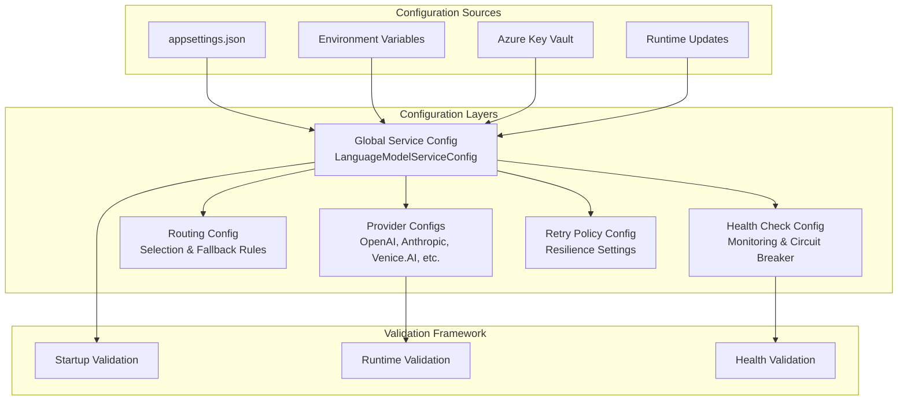

# Epic #246: Configuration Management Specification

**Last Updated:** 2025-01-25
**Document Type:** Configuration Design
**Epic Phase:** Multi-Provider Configuration

> **Parent:** [`Epic #246`](./README.md)

## Purpose & Responsibility

This document defines the comprehensive configuration management system for LanguageModelService v2, covering multi-provider configuration schemas, validation frameworks, routing policies, health monitoring settings, and environment-specific deployment patterns.

## 1. Configuration Architecture Overview

### 1.1 Configuration Hierarchy



### 1.2 Configuration Binding Pattern

```csharp
/// <summary>
/// Main configuration class for LanguageModelService v2.
/// </summary>
public class LanguageModelServiceConfig : IConfig
{
    /// <summary>
    /// Configuration section name in appsettings.json.
    /// </summary>
    public const string SectionName = "LanguageModelService";

    /// <summary>
    /// Default provider to use when none specified.
    /// </summary>
    [Required]
    public string DefaultProvider { get; set; } = "OpenAI";

    /// <summary>
    /// Provider configurations keyed by provider name.
    /// </summary>
    [Required]
    public Dictionary<string, ProviderConfig> Providers { get; set; } = new();

    /// <summary>
    /// Routing and selection configuration.
    /// </summary>
    public RoutingConfig Routing { get; set; } = new();

    /// <summary>
    /// Retry and resilience configuration.
    /// </summary>
    public RetryConfig Retry { get; set; } = new();

    /// <summary>
    /// Health check configuration.
    /// </summary>
    public HealthCheckConfig HealthCheck { get; set; } = new();

    /// <summary>
    /// Backward compatibility settings (transitional only during migration).
    /// </summary>
    public BackwardCompatibilityConfig BackwardCompatibility { get; set; } = new();

    /// <summary>
    /// Performance controls for service-level limits.
    /// </summary>
    public PerformanceConfig Performance { get; set; } = new();
}
```

### 1.3 Performance Configuration

```csharp
/// <summary>
/// Performance optimization configuration for LanguageModelService.
/// </summary>
public class PerformanceConfig
{
    /// <summary>
    /// Maximum concurrent requests allowed.
    /// </summary>
    public int MaxConcurrentRequests { get; set; } = 100;

    /// <summary>
    /// Request timeout in milliseconds.
    /// </summary>
    public int RequestTimeoutMs { get; set; } = 120000; // 2 minutes

    /// <summary>
    /// Enable request/response caching.
    /// </summary>
    public bool EnableCaching { get; set; } = false;

    /// <summary>
    /// Cache expiration time in minutes.
    /// </summary>
    public int CacheExpirationMinutes { get; set; } = 60;
}
```

## 2. Provider Configuration Schemas

### 2.1 Base Provider Configuration

```csharp
/// <summary>
/// Base interface for all provider configurations.
/// </summary>
public interface IProviderConfig
{
    string ProviderName { get; }
    bool Enabled { get; }
    string? ApiKey { get; }
    string? BaseUrl { get; }
    string? DefaultModel { get; }
    int TimeoutSeconds { get; }
    int MaxRetries { get; }
    Dictionary<string, object>? ProviderSpecific { get; }
}

/// <summary>
/// Base provider configuration with common validation.
/// </summary>
public abstract class ProviderConfigBase : IProviderConfig
{
    public abstract string ProviderName { get; }

    [Required]
    public bool Enabled { get; set; } = true;

    [Required]
    [ConfigurationKeyVault("api-key")]
    public string? ApiKey { get; set; }

    public string? BaseUrl { get; set; }

    [Required]
    public string? DefaultModel { get; set; }

    [Range(5, 300)]
    public int TimeoutSeconds { get; set; } = 60;

    [Range(0, 10)]
    public int MaxRetries { get; set; } = 3;

    /// <summary>
    /// Optional per-provider concurrency cap.
    /// </summary>
    public int? MaxConcurrentRequests { get; set; } = 10;

    public Dictionary<string, object>? ProviderSpecific { get; set; } = new();
}
```

### 2.2 OpenAI Provider Configuration

```csharp
/// <summary>
/// OpenAI provider-specific configuration with advanced features.
/// </summary>
public class OpenAIProviderConfig : ProviderConfigBase
{
    public override string ProviderName => "OpenAI";

    public override string? BaseUrl { get; set; } = "https://api.openai.com/v1/";
    public override string? DefaultModel { get; set; } = "gpt-4";

    /// <summary>
    /// OpenAI organization ID (optional).
    /// </summary>
    public string? Organization { get; set; }

    /// <summary>
    /// Enable batch request processing.
    /// </summary>
    public bool EnableBatching { get; set; } = false;

    /// <summary>
    /// Enable strict function calling mode.
    /// </summary>
    public bool StrictFunctionCalling { get; set; } = true;

    /// <summary>
    /// Enable response format features.
    /// </summary>
    public bool EnableResponseFormats { get; set; } = true;

    /// <summary>
    /// Available models for this provider instance.
    /// </summary>
    public List<string> AvailableModels { get; set; } = new()
    {
        "gpt-4", "gpt-4-turbo", "gpt-3.5-turbo", "gpt-4o"
    };

    /// <summary>
    /// Model-specific configurations.
    /// </summary>
    public Dictionary<string, ModelConfig> ModelConfigurations { get; set; } = new();
}
```

### 2.3 Anthropic Provider Configuration

```csharp
/// <summary>
/// Anthropic (Claude) provider-specific configuration.
/// </summary>
public class AnthropicProviderConfig : ProviderConfigBase
{
    public override string ProviderName => "Anthropic";

    public override string? BaseUrl { get; set; } = "https://api.anthropic.com/v1/";
    public override string? DefaultModel { get; set; } = "claude-3-sonnet";

    /// <summary>
    /// Anthropic API version header.
    /// </summary>
    public string AnthropicVersion { get; set; } = "2023-06-01";

    /// <summary>
    /// Enable beta features.
    /// </summary>
    public bool EnableBeta { get; set; } = false;

    /// <summary>
    /// Maximum context length for conversations.
    /// </summary>
    public int MaxContextLength { get; set; } = 200000;

    /// <summary>
    /// Available Claude models.
    /// </summary>
    public List<string> AvailableModels { get; set; } = new()
    {
        "claude-3-opus", "claude-3-sonnet", "claude-3-haiku", "claude-3-5-sonnet"
    };

    /// <summary>
    /// Tool use configuration.
    /// </summary>
    public ToolUseConfig ToolUse { get; set; } = new();
}
```

### 2.4 Venice.AI Provider Configuration

```csharp
/// <summary>
/// Venice.AI provider configuration for Llama models.
/// </summary>
public class VeniceAIProviderConfig : ProviderConfigBase
{
    public override string ProviderName => "Venice.AI";

    public override string? BaseUrl { get; set; } = "https://api.venice.ai/v1/";
    public override string? DefaultModel { get; set; } = "llama-3.1-70b";

    /// <summary>
    /// Cost optimization settings.
    /// </summary>
    public bool EnableCostOptimization { get; set; } = true;

    /// <summary>
    /// Available Llama models.
    /// </summary>
    public List<string> AvailableModels { get; set; } = new()
    {
        "llama-3.1-8b", "llama-3.1-70b", "llama-3.1-405b"
    };

    /// <summary>
    /// Model routing preferences for cost optimization.
    /// </summary>
    public Dictionary<string, decimal> ModelCostPriority { get; set; } = new()
    {
        ["llama-3.1-8b"] = 1.0m,
        ["llama-3.1-70b"] = 0.8m,
        ["llama-3.1-405b"] = 0.6m
    };
}
```

## 3. Routing Configuration

### 3.1 Provider Routing Configuration

```csharp
/// <summary>
/// Configuration for provider routing and selection logic.
/// </summary>
public class RoutingConfig
{
    /// <summary>
    /// Provider priority order (lower number = higher priority).
    /// </summary>
    public Dictionary<string, int> ProviderPriority { get; set; } = new()
    {
        ["OpenAI"] = 1,
        ["Venice.AI"] = 2
    };

    /// <summary>
    /// Capability-based routing rules.
    /// </summary>
    public CapabilityRoutingConfig CapabilityRouting { get; set; } = new();

    /// <summary>
    /// Load balancing configuration.
    /// </summary>
    public LoadBalancingConfig LoadBalancing { get; set; } = new();

    /// <summary>
    /// Failover configuration.
    /// </summary>
    public FailoverConfig Failover { get; set; } = new();

    /// <summary>
    /// Cost optimization routing.
    /// </summary>
    public CostOptimizationConfig CostOptimization { get; set; } = new();
}

/// <summary>
/// Capability-based routing configuration.
/// </summary>
public class CapabilityRoutingConfig
{
    /// <summary>
    /// Preferred provider for tool calling requests.
    /// </summary>
    public string? ToolCallingPreferredProvider { get; set; } = "OpenAI";

    /// <summary>
    /// Preferred provider for streaming requests.
    /// </summary>
    public string? StreamingPreferredProvider { get; set; } = "OpenAI";

    /// <summary>
    /// Preferred provider for long context requests.
    /// </summary>
    public string? LongContextPreferredProvider { get; set; } = null;

    /// <summary>
    /// Token threshold for considering long context.
    /// </summary>
    public int LongContextTokenThreshold { get; set; } = 32000;

    /// <summary>
    /// Custom capability routing rules.
    /// </summary>
    public Dictionary<string, string> CustomCapabilityRules { get; set; } = new();
}
```

### 3.2 Load Balancing Configuration

```csharp
/// <summary>
/// Load balancing configuration for provider distribution.
/// </summary>
public class LoadBalancingConfig
{
    /// <summary>
    /// Load balancing strategy.
    /// </summary>
    public LoadBalancingStrategy Strategy { get; set; } = LoadBalancingStrategy.Priority;

    /// <summary>
    /// Weight distribution for weighted round-robin.
    /// </summary>
    public Dictionary<string, int> ProviderWeights { get; set; } = new()
    {
        ["OpenAI"] = 70,
        ["Venice.AI"] = 30
    };

    /// <summary>
    /// Enable request rate limiting per provider.
    /// </summary>
    public bool EnableRateLimiting { get; set; } = true;

    /// <summary>
    /// Requests per minute limits per provider.
    /// </summary>
    public Dictionary<string, int> RequestsPerMinuteLimit { get; set; } = new()
    {
        ["OpenAI"] = 500,
        ["Venice.AI"] = 1000
    };
}

public enum LoadBalancingStrategy
{
    Priority,           // Use priority order
    RoundRobin,        // Simple round-robin
    WeightedRoundRobin, // Weighted round-robin
    LeastConnections,   // Least active connections
    Random             // Random selection
}
```

## 4. Health Check Configuration

### 4.1 Health Monitoring Configuration

```csharp
/// <summary>
/// Health check and monitoring configuration.
/// </summary>
public class HealthCheckConfig
{
    /// <summary>
    /// Enable health checking.
    /// </summary>
    public bool Enabled { get; set; } = true;

    /// <summary>
    /// Health check interval in seconds.
    /// </summary>
    [Range(5, 300)]
    public int IntervalSeconds { get; set; } = 30;

    /// <summary>
    /// Health check timeout in seconds.
    /// </summary>
    [Range(1, 60)]
    public int TimeoutSeconds { get; set; } = 10;

    /// <summary>
    /// Number of consecutive failures before marking unhealthy.
    /// </summary>
    [Range(1, 10)]
    public int FailureThreshold { get; set; } = 3;

    /// <summary>
    /// Number of consecutive successes needed to mark healthy.
    /// </summary>
    [Range(1, 10)]
    public int SuccessThreshold { get; set; } = 2;

    /// <summary>
    /// Circuit breaker configuration.
    /// </summary>
    public CircuitBreakerConfig CircuitBreaker { get; set; } = new();

    /// <summary>
    /// Provider-specific health check settings.
    /// </summary>
    public Dictionary<string, ProviderHealthConfig> ProviderSettings { get; set; } = new();
}

/// <summary>
/// Circuit breaker configuration.
/// </summary>
public class CircuitBreakerConfig
{
    /// <summary>
    /// Enable circuit breaker pattern.
    /// </summary>
    public bool Enabled { get; set; } = true;

    /// <summary>
    /// Time to wait before attempting recovery (seconds).
    /// </summary>
    [Range(30, 3600)]
    public int RecoveryTimeoutSeconds { get; set; } = 300;

    /// <summary>
    /// Failure rate threshold (0.0 to 1.0) to open circuit.
    /// </summary>
    [Range(0.0, 1.0)]
    public double FailureRateThreshold { get; set; } = 0.5;

    /// <summary>
    /// Minimum number of requests before calculating failure rate.
    /// </summary>
    [Range(1, 100)]
    public int MinimumRequestThreshold { get; set; } = 10;
}
```

### 4.2 Provider-Specific Health Configuration

```csharp
/// <summary>
/// Provider-specific health check configuration.
/// </summary>
public class ProviderHealthConfig
{
    /// <summary>
    /// Custom health check endpoint.
    /// </summary>
    public string? CustomHealthCheckEndpoint { get; set; }

    /// <summary>
    /// Custom health check method.
    /// </summary>
    public string HealthCheckMethod { get; set; } = "GET";

    /// <summary>
    /// Expected health check response status codes.
    /// </summary>
    public List<int> ExpectedStatusCodes { get; set; } = new() { 200 };

    /// <summary>
    /// Additional headers for health checks.
    /// </summary>
    public Dictionary<string, string> AdditionalHeaders { get; set; } = new();

    /// <summary>
    /// Provider-specific failure patterns to detect.
    /// </summary>
    public List<string> FailurePatterns { get; set; } = new();
}
```

## 5. Retry and Resilience Configuration

### 5.1 Retry Policy Configuration

```csharp
/// <summary>
/// Retry and resilience policy configuration.
/// </summary>
public class RetryConfig
{
    /// <summary>
    /// Enable retry policies.
    /// </summary>
    public bool Enabled { get; set; } = true;

    /// <summary>
    /// Maximum number of retry attempts.
    /// </summary>
    [Range(0, 10)]
    public int MaxRetries { get; set; } = 3;

    /// <summary>
    /// Base delay between retries (seconds).
    /// </summary>
    [Range(0.1, 60.0)]
    public double BaseDelaySeconds { get; set; } = 1.0;

    /// <summary>
    /// Maximum delay between retries (seconds).
    /// </summary>
    [Range(1.0, 300.0)]
    public double MaxDelaySeconds { get; set; } = 30.0;

    /// <summary>
    /// Backoff strategy for retry delays.
    /// </summary>
    public BackoffStrategy BackoffStrategy { get; set; } = BackoffStrategy.ExponentialWithJitter;

    /// <summary>
    /// Jitter factor for exponential backoff (0.0 to 1.0).
    /// </summary>
    [Range(0.0, 1.0)]
    public double JitterFactor { get; set; } = 0.2;

    /// <summary>
    /// HTTP status codes that should trigger retries.
    /// </summary>
    public List<int> RetryableStatusCodes { get; set; } = new()
    {
        429, // Too Many Requests
        500, // Internal Server Error
        502, // Bad Gateway
        503, // Service Unavailable
        504  // Gateway Timeout
    };

    /// <summary>
    /// Exception types that should trigger retries.
    /// </summary>
    public List<string> RetryableExceptions { get; set; } = new()
    {
        "HttpRequestException",
        "TaskCanceledException",
        "SocketException"
    };

    /// <summary>
    /// Provider-specific retry configurations.
    /// </summary>
    public Dictionary<string, ProviderRetryConfig> ProviderSettings { get; set; } = new();
}

public enum BackoffStrategy
{
    Fixed,                    // Fixed delay
    Linear,                   // Linear increase
    Exponential,             // Exponential backoff
    ExponentialWithJitter    // Exponential with jitter
}
```

### 5.2 Provider-Specific Retry Configuration

```csharp
/// <summary>
/// Provider-specific retry configuration overrides.
/// </summary>
public class ProviderRetryConfig
{
    /// <summary>
    /// Override maximum retries for this provider.
    /// </summary>
    public int? MaxRetries { get; set; }

    /// <summary>
    /// Override base delay for this provider.
    /// </summary>
    public double? BaseDelaySeconds { get; set; }

    /// <summary>
    /// Provider-specific retryable status codes.
    /// </summary>
    public List<int>? CustomRetryableStatusCodes { get; set; }

    /// <summary>
    /// Rate limit specific configuration.
    /// </summary>
    public RateLimitRetryConfig? RateLimitRetry { get; set; }
}

/// <summary>
/// Rate limit specific retry configuration.
/// </summary>
public class RateLimitRetryConfig
{
    /// <summary>
    /// Honor Retry-After header for rate limits.
    /// </summary>
    public bool HonorRetryAfterHeader { get; set; } = true;

    /// <summary>
    /// Maximum time to wait for rate limit (seconds).
    /// </summary>
    [Range(1, 3600)]
    public int MaxRateLimitWaitSeconds { get; set; } = 60;

    /// <summary>
    /// Add jitter to rate limit waits.
    /// </summary>
    public bool AddJitterToRateLimitWait { get; set; } = true;
}
```

## 6. Future Feature Management (Out of Scope for Epic 246)

Epic 246 does not introduce feature flags or a feature management framework. A future epic will define and implement feature management for AI capabilities and progressive rollouts.

## 7. Configuration Validation Framework

### 7.1 Startup Configuration Validation

```csharp
/// <summary>
/// Comprehensive configuration validation service.
/// </summary>
public class ConfigurationValidationService
{
    private readonly ILogger<ConfigurationValidationService> _logger;

    public async Task<ConfigurationValidationResult> ValidateAllAsync(
        LanguageModelServiceConfig config)
    {
        var results = new List<ValidationIssue>();

        // Validate global configuration
        results.AddRange(ValidateGlobalConfig(config));

        // Validate provider configurations
        foreach (var (providerName, providerConfig) in config.Providers)
        {
            if (providerConfig.Enabled)
            {
                results.AddRange(await ValidateProviderConfigAsync(providerName, providerConfig));
            }
        }

        // Validate routing configuration
        results.AddRange(ValidateRoutingConfig(config.Routing, config.Providers));

        // Validate health check configuration
        results.AddRange(ValidateHealthCheckConfig(config.HealthCheck));

        // Validate retry configuration
        results.AddRange(ValidateRetryConfig(config.Retry));

        // Cross-validation checks
        results.AddRange(ValidateCrossConfigurationConsistency(config));

        return new ConfigurationValidationResult
        {
            IsValid = !results.Any(r => r.Severity == ValidationSeverity.Error),
            Issues = results,
            ValidatedAt = DateTimeOffset.UtcNow
        };
    }

    private List<ValidationIssue> ValidateGlobalConfig(LanguageModelServiceConfig config)
    {
        var issues = new List<ValidationIssue>();

        if (string.IsNullOrEmpty(config.DefaultProvider))
        {
            issues.Add(new ValidationIssue
            {
                Severity = ValidationSeverity.Error,
                Code = "GLOBAL_001",
                Message = "DefaultProvider is required",
                Path = "DefaultProvider"
            });
        }
        else if (!config.Providers.ContainsKey(config.DefaultProvider))
        {
            issues.Add(new ValidationIssue
            {
                Severity = ValidationSeverity.Error,
                Code = "GLOBAL_002",
                Message = $"DefaultProvider '{config.DefaultProvider}' is not configured in Providers section",
                Path = "DefaultProvider"
            });
        }

        if (!config.Providers.Any(p => p.Value.Enabled))
        {
            issues.Add(new ValidationIssue
            {
                Severity = ValidationSeverity.Error,
                Code = "GLOBAL_003",
                Message = "At least one provider must be enabled",
                Path = "Providers"
            });
        }

        return issues;
    }

    private async Task<List<ValidationIssue>> ValidateProviderConfigAsync(
        string providerName,
        IProviderConfig config)
    {
        var issues = new List<ValidationIssue>();

        // Basic validation
        if (string.IsNullOrEmpty(config.ApiKey))
        {
            issues.Add(new ValidationIssue
            {
                Severity = ValidationSeverity.Error,
                Code = "PROVIDER_001",
                Message = $"API key is required for provider {providerName}",
                Path = $"Providers.{providerName}.ApiKey"
            });
        }

        if (string.IsNullOrEmpty(config.DefaultModel))
        {
            issues.Add(new ValidationIssue
            {
                Severity = ValidationSeverity.Warning,
                Code = "PROVIDER_002",
                Message = $"Default model not specified for provider {providerName}",
                Path = $"Providers.{providerName}.DefaultModel"
            });
        }

        // Connectivity validation
        if (!string.IsNullOrEmpty(config.ApiKey))
        {
            try
            {
                var connectivityResult = await ValidateProviderConnectivity(providerName, config);
                if (!connectivityResult.IsSuccessful)
                {
                    issues.Add(new ValidationIssue
                    {
                        Severity = ValidationSeverity.Warning,
                        Code = "PROVIDER_003",
                        Message = $"Provider {providerName} connectivity test failed: {connectivityResult.ErrorMessage}",
                        Path = $"Providers.{providerName}"
                    });
                }
            }
            catch (Exception ex)
            {
                issues.Add(new ValidationIssue
                {
                    Severity = ValidationSeverity.Warning,
                    Code = "PROVIDER_004",
                    Message = $"Provider {providerName} connectivity test error: {ex.Message}",
                    Path = $"Providers.{providerName}"
                });
            }
        }

        return issues;
    }
}
```

### 7.2 Runtime Configuration Validation

```csharp
/// <summary>
/// Runtime configuration change validation and hot-reload support.
/// </summary>
public class RuntimeConfigurationValidator
{
    public async Task<bool> ValidateConfigurationChangeAsync(
        LanguageModelServiceConfig newConfig,
        LanguageModelServiceConfig currentConfig)
    {
        // Validate that critical changes don't break running operations
        var criticalChanges = DetectCriticalChanges(newConfig, currentConfig);

        if (criticalChanges.Any())
        {
            _logger.LogWarning("Critical configuration changes detected: {Changes}",
                string.Join(", ", criticalChanges));

            // Implement gradual rollout for critical changes
            return await ValidateGradualRollout(newConfig, criticalChanges);
        }

        return true;
    }

    private List<string> DetectCriticalChanges(
        LanguageModelServiceConfig newConfig,
        LanguageModelServiceConfig currentConfig)
    {
        var changes = new List<string>();

        if (newConfig.DefaultProvider != currentConfig.DefaultProvider)
        {
            changes.Add($"Default provider changed from {currentConfig.DefaultProvider} to {newConfig.DefaultProvider}");
        }

        // Detect disabled providers that were previously enabled
        foreach (var (providerName, currentProvider) in currentConfig.Providers)
        {
            if (currentProvider.Enabled &&
                (!newConfig.Providers.ContainsKey(providerName) || !newConfig.Providers[providerName].Enabled))
            {
                changes.Add($"Provider {providerName} was disabled");
            }
        }

        return changes;
    }
}
```

## 8. Environment-Specific Configuration

### 8.1 Configuration Templates

**Development Environment (Epic 246 scope):**
```json
{
  "LanguageModelService": {
    "DefaultProvider": "OpenAI",
    "Providers": {
      "OpenAI": {
        "Enabled": true,
        "ApiKey": "#{OPENAI_API_KEY}#",
        "DefaultModel": "gpt-3.5-turbo",
        "TimeoutSeconds": 30,
        "MaxRetries": 2
      },
      "Anthropic": {
        "Enabled": false,
        "ApiKey": "#{ANTHROPIC_API_KEY}#",
        "DefaultModel": "claude-3-haiku"
      }
    },
    "Routing": {
      "ProviderPriority": {
        "OpenAI": 1
      }
    },
    "HealthCheck": {
      "Enabled": true,
      "IntervalSeconds": 60
    },
    "FeatureFlags": {
      "EnableV2Architecture": true,
      "FallbackToLegacy": true,
      "EnableMultiProvider": false,
      "V2TrafficPercentage": 50
    }
  }
}
```

**Staging Environment:**
```json
{
  "LanguageModelService": {
    "DefaultProvider": "OpenAI",
    "Providers": {
      "OpenAI": {
        "Enabled": true,
        "ApiKey": "#{OPENAI_API_KEY}#",
        "DefaultModel": "gpt-4",
        "TimeoutSeconds": 60,
        "MaxRetries": 3
      },
      "Venice.AI": {
        "Enabled": true,
        "ApiKey": "#{VENICE_API_KEY}#",
        "DefaultModel": "llama-3.1-70b"
      }
    },
    "Routing": {
      "ProviderPriority": {
        "OpenAI": 1,
        "Venice.AI": 2
      },
      "CapabilityRouting": {
        "ToolCallingPreferredProvider": "OpenAI",
        "LongContextPreferredProvider": null
      }
    },
    "HealthCheck": {
      "Enabled": true,
      "IntervalSeconds": 30
    },
    }
}
```

**Production Environment (Epic 246 scope):**
```json
{
  "LanguageModelService": {
    "DefaultProvider": "OpenAI",
    "Providers": {
      "OpenAI": {
        "Enabled": true,
        "ApiKey": "#{OPENAI_API_KEY}#",
        "DefaultModel": "gpt-4",
        "TimeoutSeconds": 90,
        "MaxRetries": 3
      },
      "Venice.AI": {
        "Enabled": true,
        "ApiKey": "#{VENICE_API_KEY}#",
        "DefaultModel": "llama-3.1-70b"
      }
    },
    "Routing": {
      "LoadBalancing": {
        "Strategy": "WeightedRoundRobin",
        "ProviderWeights": {
          "OpenAI": 70,
          "Venice.AI": 30
        }
      }
    },
    "HealthCheck": {
      "Enabled": true,
      "IntervalSeconds": 15,
      "CircuitBreaker": {
        "Enabled": true,
        "FailureRateThreshold": 0.3,
        "RecoveryTimeoutSeconds": 180
      }
    },
    "Retry": {
      "MaxRetries": 3,
      "BackoffStrategy": "ExponentialWithJitter",
      "BaseDelaySeconds": 1.0,
      "MaxDelaySeconds": 30.0
    }
  }
}
```

## 9. Configuration Security

### 9.1 Secret Management Integration

```csharp
/// <summary>
/// Secure configuration loading with Azure Key Vault integration.
/// </summary>
public class SecureConfigurationLoader
{
    public static IConfiguration LoadSecureConfiguration(IWebHostEnvironment environment)
    {
        var builder = new ConfigurationBuilder()
            .SetBasePath(environment.ContentRootPath)
            .AddJsonFile("appsettings.json", optional: false, reloadOnChange: true)
            .AddJsonFile($"appsettings.{environment.EnvironmentName}.json", optional: true, reloadOnChange: true)
            .AddEnvironmentVariables();

        // Add Azure Key Vault in production
        if (environment.IsProduction())
        {
            var keyVaultName = Environment.GetEnvironmentVariable("KEY_VAULT_NAME");
            if (!string.IsNullOrEmpty(keyVaultName))
            {
                var keyVaultUri = new Uri($"https://{keyVaultName}.vault.azure.net/");
                builder.AddAzureKeyVault(keyVaultUri, new DefaultAzureCredential());
            }
        }

        return builder.Build();
    }
}

/// <summary>
/// Attribute to mark configuration properties that should be loaded from Key Vault.
/// </summary>
[AttributeUsage(AttributeTargets.Property)]
public class ConfigurationKeyVaultAttribute : Attribute
{
    public string SecretName { get; }

    public ConfigurationKeyVaultAttribute(string secretName)
    {
        SecretName = secretName;
    }
}
```

## Implementation Guidelines

### Configuration Organization
- Group related settings in nested configuration classes
- Use data annotations for validation where possible
- Implement IValidatableObject for complex validation scenarios
- Support both JSON configuration and environment variables

### Validation Strategy
- Validate configuration at startup with detailed error messages
- Support runtime configuration validation for hot-reload scenarios
- Implement connectivity tests for critical provider configurations
- Provide clear guidance for configuration issues

### Security Requirements
- Never log API keys or sensitive configuration values
- Use Azure Key Vault or similar secret management in production
- Support environment variable overrides for sensitive values
- Implement proper access controls for configuration management

---

**🗂️ WORKING DIRECTORY ARTIFACT CREATED:**
- **Filename:** 05-configuration-management.md
- **Purpose:** Comprehensive configuration management specification covering multi-provider settings, validation, and deployment patterns
- **Context for Team:** Complete configuration framework for CodeChanger implementation with security and validation requirements
- **Dependencies:** Builds upon configuration-routing-design.md from working directory and integrates with deployment patterns
- **Next Actions:** Create component specifications in components/ directory and navigation document
