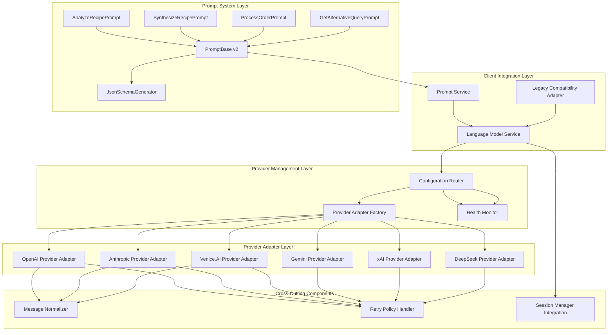

# Epic #246: Component Specifications

**Last Updated:** 2025-01-25
**Directory Purpose:** Individual component specifications for LanguageModelService v2
**Epic Phase:** Component Implementation Guide

> **Parent:** [`Epic #246`](../README.md)

## Component Directory Overview

This directory contains detailed specifications for individual components within the LanguageModelService v2 architecture. Each component specification provides implementation guidance, interface contracts, and integration patterns for CodeChanger implementation.

## Component Specifications

### Core Service Components

* **[Language Model Service](./language-model-service.md)**
  - **Purpose:** Core ILanguageModelService interface implementation
  - **Responsibility:** Primary service orchestration, provider routing, and session management
  - **Integration:** Coordinates all provider adapters and cross-cutting concerns
  - **Implementation Priority:** High - Foundation component

* **[Provider Adapters](./provider-adapters.md)**
  - **Purpose:** Multi-provider adapter implementations (OpenAI, Anthropic, Venice.AI, etc.)
  - **Responsibility:** Provider-specific API integration and message normalization
  - **Integration:** Implements IProviderAdapter interface with unified response formats
  - **Implementation Priority:** High - Core functionality

* **[Configuration Router](./configuration-router.md)**
  - **Purpose:** Provider selection and routing logic based on capabilities and configuration
  - **Responsibility:** Intelligent provider selection, health monitoring, and failover management
  - **Integration:** Works with provider adapters and health monitoring systems
  - **Implementation Priority:** Medium - After basic provider support

### Prompt System Components

* **[Prompt Base v2](./prompt-base-v2.md)**
  - **Purpose:** Provider-agnostic prompt architecture with automated schema generation
  - **Responsibility:** Unified prompt interface, automatic JSON schema generation from C# models
  - **Integration:** Works with ILanguageModelService v2 and provider adapters
  - **Implementation Priority:** High - Foundation for prompt migration

* **[Cookbook Prompt Migration](./cookbook-prompt-migration.md)**
  - **Purpose:** Detailed migration specifications for all 8 Cookbook prompts
  - **Responsibility:** Individual prompt transformation, testing requirements, provider compatibility
  - **Integration:** Uses PromptBase v2 architecture with existing Cookbook services
  - **Implementation Priority:** High - Critical business functionality

## Component Relationship Architecture

## Implementation Sequence

### Phase 1: Foundation Components (Week 1-2)
1. **Language Model Service** - Core service implementation with basic routing
2. **Provider Adapters** - OpenAI adapter implementation wrapping existing logic
3. **Message Normalization** - Unified message format conversion
4. **Prompt Base v2** - Provider-agnostic prompt architecture with schema generation

### Phase 2: Provider & Prompt Expansion (Week 3-4)
1. **Provider Adapters** - Additional provider implementations (Anthropic, Venice.AI)
2. **Configuration Router** - Basic provider selection and routing logic
3. **Cookbook Prompt Migration** - Phase 1 core prompts (Analyze, Synthesize, Process)
4. **Health Monitoring** - Provider availability and circuit breaker patterns

### Phase 3: Advanced Features & Remaining Prompts (Week 5-6)
1. **Configuration Router** - Advanced routing with capability-based selection
2. **Provider Adapters** - Remaining providers (Gemini, xAI, DeepSeek)
3. **Cookbook Prompt Migration** - Phase 2 & 3 prompts (Search, Discovery, Enhancement)
4. **Performance Optimization** - Connection pooling and async optimizations

### Phase 4: Integration & Validation (Week 7-8)
1. **End-to-End Testing** - Complete integration validation with all prompts
2. **Provider Compatibility Testing** - Multi-provider prompt validation
3. **Performance Validation** - Load testing and optimization
4. **Production Deployment** - Feature flag rollout and monitoring

## Component Dependencies

### Internal Dependencies
- **Session Management:** All components integrate with existing ISessionManager
- **Dependency Injection:** Components follow established DI patterns
- **Configuration System:** Components use IOptions pattern for configuration
- **Logging Framework:** Components use structured logging with correlation IDs

### External Dependencies
- **OpenAI SDK v1.5:** Required for OpenAI provider adapter
- **Anthropic SDK:** Required for Anthropic provider integration
- **HttpClient Factory:** Required for provider HTTP communications
- **Polly:** Required for retry policies and circuit breaker patterns

## Cross-Component Integration Patterns

### Service Orchestration
The Language Model Service acts as the primary orchestrator, coordinating between provider adapters through the configuration router while maintaining session state and providing unified error handling.

### Provider Abstraction
Provider adapters implement a common interface pattern, enabling uniform integration while isolating provider-specific logic behind the adapter boundary.

### Configuration Management
The configuration router uses strongly-typed configuration to make intelligent provider selection decisions based on capabilities, health status, and routing policies.

### Error Handling
Components use a unified exception hierarchy that maps provider-specific errors to common error types while preserving provider context for debugging.

### Performance Optimization
Components use async/await patterns throughout with proper cancellation token support and connection pooling for optimal resource utilization.

## Component Quality Standards

### Interface Design
- All components implement clear, focused interfaces
- Async/await patterns with CancellationToken support
- Proper disposal patterns for resource management
- Comprehensive error handling with specific exception types

### Testing Requirements
- Unit tests with >95% coverage for business logic
- Integration tests for provider adapters with real APIs
- Contract tests for provider compliance validation
- Performance tests for high-load scenarios

### Documentation Standards
- Comprehensive XML documentation for all public interfaces
- Implementation examples for complex integration patterns
- Configuration examples for each component
- Troubleshooting guides for common issues

### Code Quality
- Follow established project coding standards
- Use dependency injection throughout
- Implement proper logging with structured format
- Support configuration validation and startup checks

---

**Navigation Links:**
- **[Back to Epic #246](../README.md)** - Main epic specification
- **[Architecture Design](../01-architecture-design.md)** - Core architecture patterns
- **[Provider Integration](../02-provider-integration.md)** - Multi-provider implementation
- **[Migration Strategy](../03-migration-strategy.md)** - Implementation roadmap
- **[Testing Strategy](../04-testing-strategy.md)** - Quality assurance framework
- **[Configuration Management](../05-configuration-management.md)** - Configuration patterns
- **[Prompt System Modernization](../06-prompt-system-modernization.md)** - Cookbook prompt migration architecture

---

**🗂️ WORKING DIRECTORY ARTIFACT CREATED:**
- **Filename:** components/README.md
- **Purpose:** Component directory navigation and implementation sequence guide
- **Context for Team:** Component organization structure with dependencies and implementation priorities
- **Dependencies:** Provides navigation between component specifications and main epic documents
- **Next Actions:** Create individual component specifications (language-model-service.md, provider-adapters.md, configuration-router.md)