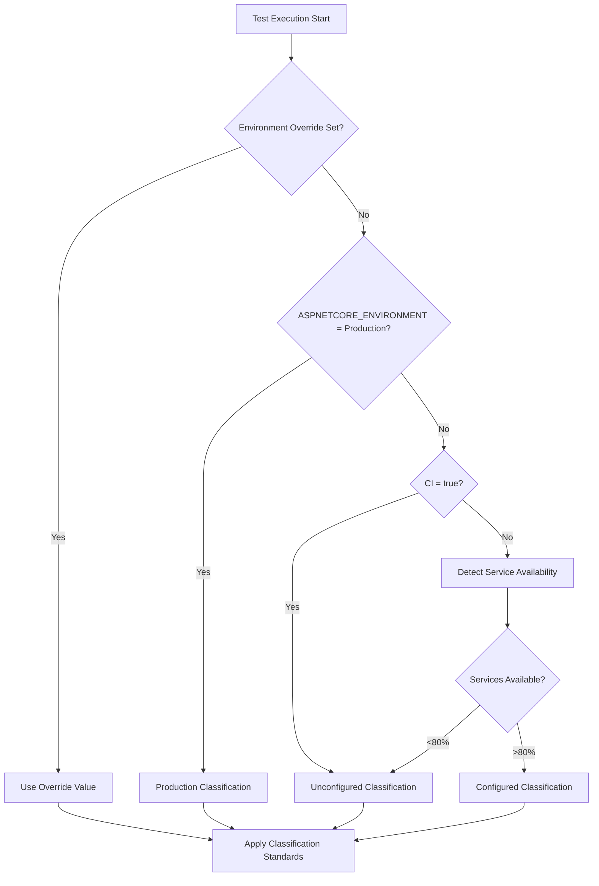
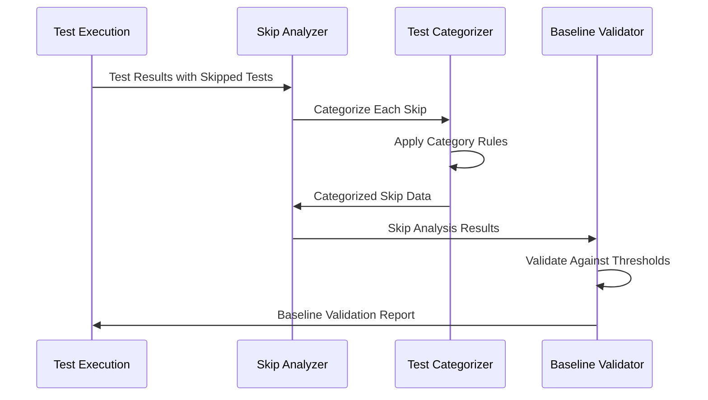

# Test Suite Baseline Standards & Progressive Coverage Framework

**Version:** 1.0  
**Last Updated:** 2025-09-28  
**Related Issues:** [#86 - Test Suite Baseline Establishment](https://github.com/Zarichney-Development/zarichney-api/issues/86)

## 1. Introduction & Philosophy

### Purpose
This document defines the comprehensive standards for test suite baseline management, progressive coverage growth, and quality gate enforcement within the zarichney-api project. It serves as the authoritative guide for understanding, implementing, and maintaining the test suite baseline framework established in Phases 1-3 of issue #86.

### Scope
- Test suite baseline validation and categorization
- Progressive coverage framework toward continuous testing excellence
- Environment-specific quality gates and thresholds
- AI-powered analysis integration standards
- Skip categorization taxonomy and management
- Velocity tracking and timeline management

### Core Philosophy
- **Evidence-Based Quality Gates**: All thresholds based on empirical data and project-specific baselines
- **Progressive Enhancement**: Systematic coverage growth through phase-based strategic development
- **Environment-Aware Standards**: Different expectations for different deployment contexts
- **AI-Augmented Analysis**: Leverage AI for intelligent test analysis and recommendations
- **Sustainable Growth**: Balance coverage goals with maintainability and team velocity

## 2. Environment Classifications

### 2.1 Environment Types

#### Unconfigured Environment
- **Classification:** `unconfigured`
- **Skip Threshold:** 26.7%
- **Description:** Local development or CI without external services configured
- **Characteristics:**
  - External services (OpenAI, Stripe, MS Graph, GitHub) unavailable
  - Docker may or may not be available
  - Infrastructure dependencies may be missing
  - Represents typical development environment constraints

#### Configured Environment  
- **Classification:** `configured`
- **Skip Threshold:** 1.2%
- **Description:** Full external service configuration with infrastructure availability
- **Characteristics:**
  - All external services properly configured with valid credentials
  - Docker and infrastructure dependencies available
  - Database connections established
  - Represents ideal testing environment

#### Production Environment
- **Classification:** `production`
- **Skip Threshold:** 0.0%
- **Description:** Production deployment validation - zero tolerance for failures
- **Characteristics:**
  - All services must be available and functional
  - No test skips acceptable
  - Complete validation of production readiness
  - Represents live deployment scenario

### 2.2 Environment Detection Logic



## 3. Skip Categorization Framework

### 3.1 Skip Category Types

#### Expected Skips
Categories where skips are anticipated and acceptable based on environment constraints.

##### External Services
- **Type:** `expected`
- **Environment Dependent:** Yes
- **Services:** OpenAI, Stripe, MS Graph, GitHub
- **Test Categories:** `ExternalOpenAI`, `ExternalStripe`, `ExternalMSGraph`, `ExternalGitHub`
- **Rationale:** External service dependencies not available in all environments

##### Infrastructure
- **Type:** `expected`
- **Environment Dependent:** Yes  
- **Dependencies:** Database, Docker
- **Test Categories:** `Database`, `Docker`
- **Rationale:** Infrastructure components may not be available in all test environments

##### Production Safety
- **Type:** `acceptable`
- **Environment Dependent:** No
- **Rationale:** Tests intentionally skipped in production for safety/performance
- **Examples:** Load testing, destructive operations, development-only features

#### Problematic Skips
Categories where skips indicate issues requiring attention.

##### Hardcoded Skips
- **Type:** `problematic`
- **Action:** `eliminate`
- **Examples:** Performance tests with hardcoded Skip attributes, runtime optimization skips
- **Rationale:** Indicates technical debt or unresolved test issues
- **Required Action:** Review and eliminate hardcoded Skip attributes

### 3.2 Skip Analysis Process



## 4. Progressive Coverage Framework

### 4.1 Coverage Progression Roadmap

#### Baseline Configuration
- **Current Baseline:** 14.22%
- **Target Coverage:** Comprehensive coverage through continuous excellence
- **Improvement Approach:** Continuous testing excellence
- **Regression Tolerance:** 1.0%

#### Progressive Targets
1. **Phase 1:** 14.22% → 20% (Foundation)
2. **Phase 2:** 20% → 35% (Growth)
3. **Phase 3:** 35% → 50% (Maturity)
4. **Phase 4:** 50% → 75% (Excellence)
5. **Phase 5:** 75% → Comprehensive coverage (Mastery)

### 4.2 Phase-Specific Standards

#### Phase 1: Foundation (14.22% → 20%)
- **Duration:** ~2 months
- **Strategic Focus:** Service layer basics, API contracts, core business logic
- **Quality Gates:**
  - Test pass rate ≥99%
  - Skip rate within environment thresholds
  - Coverage regression tolerance: 1.5% (initial phase flexibility)
- **Key Success Metrics:**
  - Public service method coverage
  - Controller action coverage
  - Core business entity validation

#### Phase 2: Growth (20% → 35%)
- **Duration:** ~5 months
- **Strategic Focus:** Service layer depth, integration scenarios, data validation
- **Quality Gates:**
  - Test pass rate ≥99.5%
  - Skip rate optimization (target reduction)
  - Coverage regression tolerance: 1.0%
- **Key Success Metrics:**
  - Complex service method scenarios
  - Repository integration patterns
  - Authentication/authorization flow coverage

#### Phase 3: Maturity (35% → 50%)
- **Duration:** ~5 months
- **Strategic Focus:** Edge cases, error handling, input validation, boundary conditions
- **Quality Gates:**
  - Test pass rate ≥99.5%
  - Skip rate further optimization
  - Coverage regression tolerance: 1.0%
- **Key Success Metrics:**
  - Exception handling path coverage
  - Input validation boundary testing
  - External service error scenario coverage

#### Phase 4: Excellence (50% → 75%)
- **Duration:** ~9 months
- **Strategic Focus:** Complex business scenarios, integration depth, cross-cutting concerns
- **Quality Gates:**
  - Test pass rate ≥99.7%
  - Skip rate minimization
  - Coverage regression tolerance: 0.5%
- **Key Success Metrics:**
  - End-to-end business process validation
  - Complex integration scenario coverage
  - Security and authorization edge cases

#### Phase 5: Mastery (75% → Comprehensive coverage)
- **Duration:** ~6 months
- **Strategic Focus:** Comprehensive edge cases, performance scenarios, system integration
- **Quality Gates:**
  - Test pass rate ≥99.8%
  - Skip rate near-zero (except environment-dependent)
  - Coverage regression tolerance: 0.5%
- **Key Success Metrics:**
  - Comprehensive performance testing coverage
  - System integration validation
  - Advanced security scenario coverage

## 5. Baseline Validation Rules

### 5.1 Validation Components

#### Skip Rate Validation
```
if (actual_skip_percentage > environment_threshold) {
    violations.add("Skip rate exceeds environment threshold")
    baseline_passed = false
}
```

#### Coverage Baseline Validation
```
if (current_coverage < (baseline_coverage - regression_tolerance)) {
    violations.add("Coverage below baseline with regression tolerance")
    baseline_passed = false
}
```

#### Test Failure Validation
```
if (failed_tests > 0) {
    violations.add("Test failures detected - must be resolved")
    baseline_passed = false
}
```

### 5.2 Validation Result Structure

```json
{
  "timestamp": "2025-08-07T10:30:00Z",
  "environment": {
    "classification": "unconfigured|configured|production",
    "description": "Environment description",
    "expectedSkipPercentage": 26.7
  },
  "metrics": {
    "totalTests": 86,
    "skippedTests": 23,
    "failedTests": 0,
    "skipPercentage": 26.7,
    "lineCoverage": 15.1
  },
  "progressiveCoverage": {
    "currentPhase": "Phase 1 - Foundation",
    "nextTarget": 20.0,
    "coverageGap": 4.9,
    "isOnTrack": true,
    "requiredVelocity": 2.8,
    "monthsToTarget": 27.2
  },
  "validation": {
    "passesThresholds": true,
    "violations": [],
    "recommendations": [
      "Configure external services to reduce skip rate",
      "Focus on service layer methods for next coverage target"
    ]
  }
}
```

## 6. Quality Gates & Thresholds

### 6.1 Dynamic Quality Gates

Quality gates adapt based on current coverage phase and environment classification.

#### Base Quality Gates
- **Test Pass Rate:** ≥99% (increases with phase progression)
- **Coverage Regression:** ≤1% decrease (tightens with phase progression)
- **Skip Rate:** Within environment-specific thresholds
- **Build Success:** Must complete without critical errors

#### Phase-Progressive Adjustments
```
quality_gate_strictness = base_strictness + (current_phase * adjustment_factor)
coverage_tolerance = base_tolerance - (current_phase * 0.1)
pass_rate_requirement = base_pass_rate + (current_phase * 0.05)
```

### 6.2 Velocity-Based Adjustments

#### On-Track Scenarios
- Standard quality gates apply
- Normal progression expectations
- Maintain current velocity requirements

#### Behind-Schedule Scenarios
- Enhanced focus on high-impact test development
- Accelerated coverage requirements
- Additional AI-driven recommendations
- Possible timeline adjustment discussions

#### Ahead-of-Schedule Scenarios
- Optional quality gate tightening
- Advanced testing pattern adoption
- Investment in test infrastructure improvements
- Early phase transition opportunities

## 7. AI Integration Standards

### 7.1 AI Analysis Context Requirements

#### Required Context Ingestion
1. **Current Phase Information:** Phase classification and strategic focus areas
2. **Baseline Validation Results:** Complete validation status and violations
3. **Progressive Coverage Status:** Gap analysis and velocity tracking
4. **Environment Classification:** Current environment and threshold expectations
5. **Historical Trends:** Coverage progression and velocity patterns

#### AI Analysis Capabilities
- Phase-appropriate test recommendations
- Coverage gap analysis and prioritization
- Skip categorization and optimization suggestions
- Velocity-aware timeline guidance
- Environment-specific configuration recommendations

### 7.2 AI Output Standards

#### Structured Recommendations
- **Priority Classification:** Critical/High/Medium/Low
- **Phase Alignment:** Recommendations appropriate for current phase
- **Excellence Awareness:** Consider comprehensive coverage through continuous testing excellence
- **Action Specificity:** Concrete, actionable guidance with file/line references

#### Educational Value
- **Pattern Reinforcement:** Highlight excellent testing patterns
- **Learning Opportunities:** Identify areas for improvement
- **Best Practice Guidance:** Phase-appropriate testing strategies
- **Knowledge Transfer:** Build institutional testing knowledge

## 8. Compliance & Monitoring

### 8.1 Compliance Requirements

#### Mandatory Standards
- All test execution must include baseline validation
- Progressive coverage analysis required for all builds
- Environment classification must be determined and reported
- Skip categorization must be performed and analyzed
- Velocity tracking must be maintained and monitored

#### Documentation Requirements
- Baseline validation results must be preserved and accessible
- Progressive coverage status must be reported in all test summaries
- Environment setup requirements must be documented and maintained
- Skip categorization decisions must be justified and documented

### 8.2 Monitoring & Reporting

#### Continuous Monitoring
- **Daily:** Basic coverage and skip rate tracking
- **Weekly:** Progressive coverage velocity assessment
- **Monthly:** Comprehensive phase progression review
- **Quarterly:** Strategic coverage roadmap evaluation

#### Alert Triggers
- **Critical:** Test pass rate <95%
- **High:** Coverage regression >2%
- **Medium:** Velocity <80% of required rate
- **Low:** Skip rate increase >5% from baseline

#### Success Metrics
- **Coverage Growth:** Steady progression toward phase targets
- **Continuous Improvement:** Steady progression toward comprehensive coverage excellence
- **Quality Stability:** Test pass rate ≥99%
- **Environment Optimization:** Decreasing skip rates over time

## 9. Integration with Existing Standards

This document complements and extends the following existing standards:

- **[TestingStandards.md](./TestingStandards.md):** Section 12 Progressive Coverage Strategy
- **[UnitTestCaseDevelopment.md](./UnitTestCaseDevelopment.md):** Unit testing patterns and practices
- **[IntegrationTestCaseDevelopment.md](./IntegrationTestCaseDevelopment.md):** Integration testing framework
- **[DocumentationStandards.md](./DocumentationStandards.md):** Documentation structure and maintenance

## 10. Future Enhancements

### Planned Improvements
- **Advanced Analytics:** Machine learning for coverage optimization
- **Predictive Modeling:** Timeline and velocity forecasting
- **Automated Optimization:** Self-tuning quality gates
- **Cross-Project Standards:** Framework generalization for other projects

### Research Areas
- **Test Impact Analysis:** Correlate coverage with bug detection rates
- **Efficiency Metrics:** Balance coverage with test maintenance overhead  
- **Pattern Mining:** Identify optimal testing patterns from successful phases
- **Performance Integration:** Include test execution performance in standards

---

**Related Documents:**
- [TestSuiteBaselineGuide.md](../Development/TestSuiteBaselineGuide.md) - Practical interpretation guide
- [TestSuiteEnvironmentSetup.md](../Development/TestSuiteEnvironmentSetup.md) - Environment configuration requirements
- [TestingStandards.md](./TestingStandards.md) - Overarching testing standards and workflows