# Module/Directory: /Controllers

**Last Updated:** 2025-05-11 > **Parent:** [`Server`](../README.md)

## 1. Purpose & Responsibility

* **What it is:** This directory defines the HTTP API endpoints for the Zarichney API application, acting as the primary interface for external clients (like the frontend application or other services).
* **Key Responsibilities:**
    * Mapping incoming HTTP requests (routes, methods, request bodies, query parameters) to specific C# action methods within controller classes (`[HttpGet]`, `[HttpPost]`, `[FromRoute]`, `[FromBody]`, etc.).
    * Receiving requests for various functional areas like Authentication (`AuthController`), Cookbook Orders/Recipes (`CookbookController`), AI interactions (`AiController`), Payment processing (`PaymentController`), and general API functions (`ApiController`, `PublicController`).
    * Delegating the actual business logic processing to appropriate services (e.g., `IOrderService`, `ILlmService`, `IPaymentService`) or MediatR handlers (primarily in `AuthController`). Controllers aim to be thin layers.
    * Constructing appropriate HTTP responses (`Ok`, `BadRequest`, `NotFound`, `Created`, `File`, custom `ApiErrorResult`) based on the outcome of the delegated business logic.
    * Handling model binding and basic input validation.
    * Applying authorization rules using attributes (`[Authorize]`, `[Authorize(Roles = "...")]`).
* **Why it exists:** To provide a clear, well-defined HTTP interface for the application's functionalities, separating the concerns of HTTP request handling from the underlying business logic implementation.

## 2. Architecture & Key Concepts

* **Pattern:** Standard ASP.NET Core Web API controllers (`[ApiController]`, inheriting `ControllerBase`).
* **Routing:** Uses attribute routing (`[Route("api/...")]`, `[HttpGet("{id}")]`, etc.) to map URLs to controller actions.
* **Dependency Injection:** Controllers receive dependencies (services, `IMediator`, `ILogger`) via constructor injection.
* **Request/Response Handling:** Uses standard ASP.NET Core mechanisms for model binding (`[FromBody]`, `[FromQuery]`, etc.) and returning results (`IActionResult` implementations like `OkObjectResult`, `BadRequestObjectResult`, `NotFoundResult`, `FileContentResult`).
* **Error Handling:** Leverages a combination of specific `IActionResult` return types for expected errors (e.g., `BadRequest` for validation, `NotFound`) and relies on the global `ErrorHandlingMiddleware` for catching unhandled exceptions, often returning a standardized `ApiErrorResult`.
* **API Documentation:** Uses Swagger/OpenAPI annotations (`[SwaggerOperation]`, `[ProducesResponseType]`, XML comments) to generate API documentation. Includes a custom filter (`FormFileOperationFilter`) for handling file uploads correctly in Swagger UI.
* **Controller Interaction Diagram:**

```mermaid
%% Diagram showing Controllers and Key Interactions
graph TD
    subgraph ClientLayer [External Clients]
        direction TB
        Client[Browser/Frontend/Other Services]
    end

    subgraph ApiLayer [API Controllers]
        direction LR
        PublicCtrl["PublicController"]
        ApiCtrl["ApiController"]
        AiCtrl["AiController"]
        AuthCtrl["AuthController"]
        CookbookCtrl["CookbookController"]
        PaymentCtrl["PaymentController"]
    end

    subgraph ServiceLayer [Services & Modules]
        direction LR
        StatusSvc["IConfigurationStatusService"]
        ConfigSvc["IStatusService (for app config)"]
        EmailSvc["EmailService"]
        LlmSvc["LlmService"]
        TranscribeSvc["TranscribeService"]
        GithubSvc["GitHubService"]
        SessionMgr["SessionManager"]
        AuthModule["Auth Module (Services/MediatR)"]
        CookbookModule["Cookbook Module (Order/Recipe Svcs)"]
        PaymentModule["Payment Module (Payment/Stripe Svcs)"]
        CustomerSvc["CustomerService"]
        OrderService["OrderService"]
    end

    subgraph MiddlewareLayer [Middleware - Conceptual]
        AuthMw["Auth/Session MW"]
        ErrorMw["Error Handling MW"]
    end

    %% Client Interactions
    Client -->|HTTP Requests| ApiLayer

    %% Controller to Middleware/Services (Simplified)
    ApiLayer -->|Uses| AuthMw
    ApiLayer -->|Uses| ErrorMw

    PublicCtrl --> StatusSvc
    PublicCtrl --> ConfigSvc
    ApiCtrl --> EmailSvc
    ApiCtrl --> SessionMgr

    AiCtrl --> EmailSvc
    AiCtrl --> TranscribeSvc
    AiCtrl --> GithubSvc
    AiCtrl --> LlmSvc
    AiCtrl --> SessionMgr

    AuthCtrl --> AuthModule
    AuthCtrl -- Cookies --> Client

    CookbookCtrl --> CookbookModule
    CookbookCtrl --> EmailSvc
    CookbookCtrl --> SessionMgr

    PaymentCtrl --> PaymentModule
    PaymentCtrl --> OrderService
    PaymentCtrl --> CustomerSvc

    %% Internal Links within Service Layer (Illustrative)
    AuthModule --> EmailSvc
    CookbookModule --> EmailSvc
    CookbookModule --> LlmSvc
    PaymentModule --> OrderService
    PaymentModule --> CustomerSvc


    %% Styling (using standard classes from DiagrammingStandards.md)
    classDef controller fill:#f9f,stroke:#333,stroke-width:2px;
    classDef service fill:#ccf,stroke:#333,stroke-width:2px;
    classDef module fill:#cceeff,stroke:#007acc,stroke-width:1px;
    classDef middleware fill:#eee,stroke:#666,stroke-width:1px;
    classDef client fill:#e6ffe6,stroke:#006400,stroke-width:1px;

    class Client client;
    class PublicCtrl,ApiCtrl,AiCtrl,AuthCtrl,CookbookCtrl,PaymentCtrl controller;
    class StatusSvc,ConfigSvc,EmailSvc,LlmSvc,TranscribeSvc,GithubSvc,SessionMgr,OrderService,CustomerSvc service;
    class AuthModule,CookbookModule,PaymentModule module;
    class AuthMw,ErrorMw middleware;

```

* **PublicController:**
    * Exposes `/api/status/config` (GET) — **DEPRECATED.** Functionality moved to `/api/config` and `/api/status`. This endpoint may be removed in a future version.
    * Exposes `/api/health` (GET) — Returns a simple health check response with success status and current time.
    * Exposes `/api/status` (GET) — Returns a dictionary mapping service names to their availability status based on configuration requirements. Each `ServiceStatusInfo` contains an availability flag and list of missing configurations. Useful for health checks, automation, and service availability monitoring. This was previously `/api/public/status`.
    * Exposes `/api/config` (GET) — Returns a list of configuration item statuses for critical settings (API keys, secrets, connection strings). Useful for health checks and automation. Response: `List<ConfigurationItemStatus>` with `Name`, `Status`, and optional `Details` (never the secret value). This replaces the old `/api/status/config`.

## 3. Interface Contract & Assumptions

* **Interface:** The HTTP API itself is the contract – the defined routes, methods, expected request formats (JSON bodies, form data, query parameters), response formats, and status codes. This is consumed by clients.
* **Assumptions:**
    * **Middleware Pipeline:** Assumes the necessary middleware components (Routing, Authentication, Authorization, Session Management, Error Handling, Logging) are configured correctly and execute in the appropriate order in `Program.cs`.
    * **Service Availability:** Assumes that the services injected into the controllers are correctly registered in the DI container and are functional.
    * **Client Behavior:** Assumes clients send requests matching the expected content types (`application/json`, `multipart/form-data`) and structures. Assumes clients handle standard HTTP status codes appropriately (e.g., retrying on 5xx, handling 4xx client errors). Assumes clients handle authentication (e.g., sending cookies automatically).
* **GET /api/status/config**
    * **Purpose:** **DEPRECATED.** Returns the status of critical configuration values. Use `/api/config` instead.
    * **Response:** `200 OK` with `List<ConfigurationItemStatus>`. Each item has `Name`, `Status` ("Configured" or "Missing/Invalid"), and optional `Details`.
    * **Auth:** `[AllowAnonymous]` — no authentication required.
* **GET /api/health**
    * **Purpose:** Provides a simple health check endpoint to verify the API is running.
    * **Response:** `200 OK` with `{ "Success": true, "Time": "YYYY-MM-DD HH:MM:SS" }`.
    * **Auth:** `[AllowAnonymous]` — no authentication required.
* **GET /api/status**
    * **Purpose:** Returns the status of all services based on their configuration requirements. (Formerly `/api/public/status`)
    * **Response:** `200 OK` with `Dictionary<string, ServiceStatusInfo>`. Each service entry has `IsAvailable` flag and `MissingConfigurations` list of missing config keys.
    * **Auth:** `[AllowAnonymous]` — no authentication required.
* **GET /api/config**
    * **Purpose:** Returns the status of critical configuration values (API keys, secrets, connection strings) for health checks and diagnostics. Replaces the old `/api/status/config`.
    * **Response:** `200 OK` with `List<ConfigurationItemStatus>`. Each item has `Name`, `Status` ("Configured" or "Missing/Invalid"), and optional `Details`.
    * **Auth:** `[AllowAnonymous]` — no authentication required.

## 4. Local Conventions & Constraints (Beyond Global Standards)

* **Thin Controllers:** Controllers should primarily delegate business logic to services or MediatR handlers, keeping action methods concise.
* **Standard Responses:** Use standard `IActionResult` types (`Ok`, `BadRequest`, `NotFound`, `Created`) and the custom `ApiErrorResult` for consistency.
* **Swagger Annotations:** Consistent use of `[SwaggerOperation]` and `[ProducesResponseType]` is expected for clear API documentation. XML comments on actions and models supplement this.
* **Authorization:** Use `[Authorize]` attributes at the controller or action level to enforce authentication and role-based access control.

## 5. How to Work With This Code

* **Adding Endpoints:** Add new action methods to existing relevant controllers or create new controller classes inheriting from `ControllerBase` and decorated with `[ApiController]` and `[Route]`. Inject necessary dependencies.
* **Modifying Endpoints:** Update action method logic, request/response models, routing attributes, authorization attributes, or Swagger annotations as needed. Ensure changes are reflected in corresponding service/handler calls.
* **Testing:**
    * Integration testing using `Microsoft.AspNetCore.Mvc.Testing.WebApplicationFactory<Program>` is highly recommended to test the controller actions within the context of the middleware pipeline and DI container.
    * Unit testing controllers typically involves mocking all injected dependencies (`ILogger`, services, `IMediator`) and verifying that the correct methods are called on the mocks and the expected `IActionResult` is returned.
* **Common Pitfalls / Gotchas:** Routing conflicts. Incorrect attribute usage (`[FromBody]` vs. `[FromQuery]`). Missing authorization attributes on protected endpoints. Inconsistent error response handling. Controllers containing too much business logic instead of delegating. Outdated Swagger documentation/annotations.

## 6. Dependencies

* **Internal Code Dependencies:** [List other key project directories/modules this code *consumes*. **Link to their READMEs.**]
    * [`/Services/Auth`](../Services/Auth/README.md) - Consumed by `AuthController` via MediatR and `[Authorize]` attributes.
    * [`/Cookbook`](../Cookbook/README.md) - Consumed by `CookbookController` via service interfaces.
    * [`/Services`](../Services/README.md) - Various services consumed by different controllers (e.g., `ILlmService`, `IPaymentService`, `IEmailService`, `IConfigurationStatusService`, `IStatusService`).
    * [`/Config`](../Config/README.md) - Uses `ApiErrorResult`, influenced by middleware configured here.
* **External Library Dependencies:** [List key NuGet packages or external libraries used directly and their purpose (e.g., `Microsoft.AspNetCore.Mvc.Core`, `Swashbuckle.AspNetCore.Annotations`, `MediatR`).]
    * `Microsoft.AspNetCore.Mvc.Core`: Core ASP.NET Core MVC components.
    * `Swashbuckle.AspNetCore.Annotations`: For Swagger documentation attributes.
    * `MediatR`: Used by `AuthController` to send commands/queries.
* **Dependents (Impact of Changes):** [List other key project directories/modules that *consume this code*. **Link to their READMEs.** Helps assess impact.]
    * External API Clients (e.g., Frontend Application). Changes to routes, request/response models, or status codes are breaking changes for clients.
    * `Program.cs`: Maps controllers (`MapControllers`).
    * Integration tests targeting the API endpoints.

## 7. Rationale & Key Historical Context

* **Standard API Structure:** Follows conventional ASP.NET Core Web API practices for structuring controllers and actions.
* **Separation of Concerns:** Controllers are intended as a thin layer responsible for HTTP concerns, separating this from the business logic implemented in services and command handlers.
* **Swagger/OpenAPI:** Annotations and XML comments are used to facilitate automatic generation of API documentation, improving discoverability and usability for clients.
* **PublicController Refactoring (May 2025):** The `PublicController` endpoints were refactored. `/api/public/status` was renamed to `/api/status`. A new endpoint `/api/config` was introduced to provide application configuration status, effectively replacing the older `/api/status/config` (which is now deprecated). This was done to clarify the purpose of each endpoint and align with a more consistent naming convention.

## 8. Known Issues & TODOs

* Review controllers for any business logic that could be further refactored into services or command handlers.
* Ensure consistent and comprehensive use of `[ProducesResponseType]` attributes for all possible success and error responses across all actions.
* Input validation using data annotations or FluentValidation could be applied more systematically to request models.